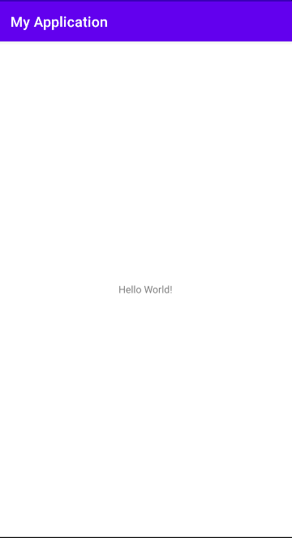

# 1.	HelloWorld

本教程参考官方参考文档：https://developer.android.google.cn/guide

另外可以参照示例项目学习：https://developer.android.google.cn/samples

## 1.0	Android概述

### 1.0.1	什么是 Android？

Android 是一个开源的，基于 Linux 的移动设备操作系统，如智能手机和平板电脑。Android 是由谷歌及其他公司带领的开放手机联盟开发的。

Android 提供了一个统一的应用程序开发方法，这意味着开发人员只需要为 Android 进行开发，这样他们的应用程序就能够运行在不同搭载 Android 的移动设备上。

谷歌在2007年发布了第一个测试版本的 Android 软件开发工具包（SDK），第一个商业版本的 Android 1.0，则发布于2008年9月。

2012年6月27日，在谷歌I/O大会上，谷歌宣布发布了 Android 版本4.1 Jelly Bean。 Jelly Bean 是一个在功能和性能方面的渐进的更新，主要目的是改进用户界面，

Android 源代码是根据自由和开放源码软件许可证。谷歌发布的大部分代码遵循 Apache 许可证2.0版，Linux 内核的变化遵循 GNU 通用公共许可证版本2。


### 1.0.2 	Android 开发优势

- 开放源代码
- 众多开发者及强大的社区
- 不断增长的市场
- 国际化的 App 集成
- 低廉的开发成本
- 更高的成功几率
- 丰富的开发环境
- 


### 1.0.3	Android 的特性

Android 是一款与 Apple 4GS 竞争的功能强大的操作系统，并支持一些伟大的特性。以下列举出部分功能：

| 特性             | 描述                                                         |
| :--------------- | :----------------------------------------------------------- |
| 漂亮的 UI        | Android 操作系统的基本屏幕提供了漂亮又直观的用户界面。       |
| 连接性           | GSM/EDGE, IDEN, CDMA, EV-DO, UMTS, Bluetooth, Wi-Fi, LTE, NFC 和 WiMAX. |
| 存储             | 用于数据存储的轻量级关系型数据库SQLite                       |
| 媒体支持         | H.263, H.264, MPEG-4 SP, AMR, AMR-WB, AAC, HE-AAC, AAC 5.1, MP3, MIDI, Ogg Vorbis, WAV, JPEG, PNG, GIF, 和 BMP |
| 消息             | SMS 和 MMS                                                   |
| Web 浏览器       | 基于开源的 WebKit 布局引擎，再加上支持 HTML5 和 CSS3 Chrome 的 V8 JavaScript 引擎。 |
| 多点触控         | Android原生支持多点触控，从最初的手持设备开始便有，如 HTC Hero。 |
| 多任务           | 用户可以跳从一个任务到另一个任务，并且相同时间可以同时运行各种应用。 |
| 可调整的 widgets | Widgets是可调整大小，这样用户就可以扩大更多的内容或缩小以节省空间。 |
| 多语言           | 支持单向和多向文本。                                         |
| GCM              | 谷歌云消息（GCM）是一种服务，让开发人员对 Android 设备的用户发送短消息数据，而无需专有的同步解决方案。 |
| Wi-Fi Direct     | 一种通过高带宽的对等网络连接来直接发现和配对应用的技术。     |
| Android Beam     | 一个流行的基于 NFC 的技术，使用户能够即时共享，只需通过触摸 NFC 功能将两个手机连在一起。 |


### 1.0.4	Android 体系架构

Android 操作系统是一个软件组件的栈，在架构图中它大致可以分为五个部分和四个主要层。


------

**Linux内核**

在所有层的最底下是 Linux - 包括大约115个补丁的 Linux 3.6。它提供了基本的系统功能，比如进程管理，内存管理，设备管理（如摄像头，键盘，显示器）。同时，内核处理所有 Linux 所擅长的工作，如网络和大量的设备驱动，从而避免兼容大量外围硬件接口带来的不便。

------

**程序库**

在 Linux 内核层的上面是一系列程序库的集合，包括开源的 Web 浏览器引擎 Webkit ，知名的 libc 库，用于仓库存储和应用数据共享的 SQLite 数据库，用于播放、录制音视频的库，用于网络安全的 SSL 库等。

------

**Android程序库**

这个类别包括了专门为 Android 开发的基于 Java 的程序库。这个类别程序库的示例包括应用程序框架库，如用户界面构建，图形绘制和数据库访问。一些 Android 开发者可用的 Android 核心程序库总结如下：

- android.app - 提供应用程序模型的访问，是所有 Android 应用程序的基石。
- android.content - 方便应用程序之间，应用程序组件之间的内容访问，发布，消息传递。
- android.database - 用于访问内容提供者发布的数据，包含 SQLite 数据库管理类。
- android.opengl - OpenGL ES 3D 图片渲染 API 的 Java 接口。
- android.os - 提供应用程序访问标注操作系统服务的能力，包括消息，系统服务和进程间通信。
- android.text - 在设备显示上渲染和操作文本。
- android.view - 应用程序用户界面的基础构建块。
- android.widget - 丰富的预置用户界面组件集合，包括按钮，标签，列表，布局管理，单选按钮等。
- android.webkit - 一系列类的集合，允许为应用程序提供内建的 Web 浏览能力。

看过了 Android 运行层内的基于 Java 的核心程序库，是时候关注一下 Android 软件栈中的基于 C/C++ 的程序库。

------

**Android运行时**

这是架构中的第三部分，自下而上的第二层。这个部分提供名为 Dalvik 虚拟机的关键组件，类似于 Java 虚拟机，但专门为 Android 设计和优化。

Dalvik 虚拟机使得可以在 Java 中使用 Linux 核心功能，如内存管理和多线程。Dalvik 虚拟机使得每一个 Android 应用程序运行在自己独立的虚拟机进程。

Android 运行时同时提供一系列核心的库来为 Android 应用程序开发者使用标准的 Java 语言来编写 Android 应用程序。

------

**应用框架**

应用框架层以 Java 类的形式为应用程序提供许多高级的服务。应用程序开发者被允许在应用中使用这些服务。

- 活动管理者 - 控制应用程序生命周期和活动栈的所有方面。
- 内容提供者 - 允许应用程序之间发布和分享数据。
- 资源管理器 - 提供对非代码嵌入资源的访问，如字符串，颜色设置和用户界面布局。
- 通知管理器 - 允许应用程序显示对话框或者通知给用户。
- 视图系统 - 一个可扩展的视图集合，用于创建应用程序用户界面。

------

**应用程序**

顶层中有所有的 Android 应用程序。你写的应用程序也将被安装在这层。这些应用程序包括通讯录，浏览器，游戏等。


### 1.0.5	Android 应用程序组件

应用程序组件是一个Android应用程序的基本构建块。这些组件由应用清单文件松耦合的组织。AndroidManifest.xml描述了应用程序的每个组件，以及他们如何交互。

以下是可以在Android应用程序中使用的四个主要组件。

| 组件                | 描述                                      |
| :------------------ | :---------------------------------------- |
| Activities          | 描述UI，并且处理用户与机器屏幕的交互。    |
| Services            | 处理与应用程序关联的后台操作。            |
| Broadcast Receivers | 处理Android操作系统和应用程序之间的通信。 |
| Content Providers   | 处理数据和数据库管理方面的问题。          |

------

**Activities**

一个活动标识一个具有用户界面的单一屏幕。举个例子，一个邮件应用程序可以包含一个活动用于显示新邮件列表，另一个活动用来编写邮件，再一个活动来阅读邮件。当应用程序拥有多于一个活动，其中的一个会被标记为当应用程序启动的时候显示。

一个活动是**Activity**类的一个子类，如下所示：

```java
public class MainActivity extends Activity {
}
```

------

**Services**

服务是运行在后台，执行长时间操作的组件。举个例子，服务可以是用户在使用不同的程序时在后台播放音乐，或者在活动中通过网络获取数据但不阻塞用户交互。

一个服务是**Service**类的子类，如下所示：

```java
public class MyService extends Service {
}
```

------

**Broadcast Receivers**

广播接收器简单地响应从其他应用程序或者系统发来的广播消息。举个例子，应用程序可以发起广播来让其他应用程序知道一些数据已经被下载到设备，并且可以供他们使用。因此广播接收器会拦截这些通信并采取适当的行动。

广播接收器是**BroadcastReceiver**类的一个子类，每个消息以**Intent**对象的形式来广播。

```java
public class MyReceiver  extends  BroadcastReceiver {
}
```

------

**Content Providers**

内容提供者组件通过请求从一个应用程序到另一个应用程序提供数据。这些请求由**ContentResolver**类的方法来处理。这些数据可以是存储在文件系统、数据库或者其他其他地方。

内容提供者是**ContentProvider**类的子类，并实现一套标准的API，以便其他应用程序来执行事务。

```java
public class MyContentProvider extends  ContentProvider {
}
```

------

**附件组件**

有一些附件的组件用于以上提到的实体、他们之间逻辑、及他们之间连线的构造。这些组件如下：

| 组件      | 描述                                             |
| :-------- | :----------------------------------------------- |
| Fragments | 代表活动中的一个行为或者一部分用户界面。         |
| Views     | 绘制在屏幕上的UI元素，包括按钮，列表等。         |
| Layouts   | 控制屏幕格式，展示视图外观的View的继承。         |
| Intents   | 组件间的消息连线。                               |
| Resources | 外部元素，例如字符串资源、常量资源及图片资源等。 |
| Manifest  | 应用程序的配置文件。                             |


## 1.1	创建第一个Android项目

官方文档：https://developer.android.google.cn/training/basics/firstapp/creating-project

选择"Create New Project"，在其中选择"Empty Activity"：


选择Finish，完成项目创建，进入项目界面，在左侧的项目管理器可以看到如下：


我们只需要关注其中的几个：manifests、java、res


### 1.1.1	Android项目目录

#### 1.1.1.1	manifests

官方文档：https://developer.android.google.cn/guide/topics/manifest/manifest-intro

 AndroidManifest.xml:这个是应用程序的清单文件，描述了应用程序的基础特性，定义它的各种组件。

其内容如下：

```xml
<?xml version="1.0" encoding="utf-8"?>
<manifest xmlns:android="http://schemas.android.com/apk/res/android"
    package="com.example.myapplication">

    <application
        android:allowBackup="true"
        android:icon="@mipmap/ic_launcher"
        android:label="@string/app_name"
        android:roundIcon="@mipmap/ic_launcher_round"
        android:supportsRtl="true"
        android:theme="@style/Theme.MyApplication">
        <!--注册MainActivity-->
        <activity android:name=".MainActivity">
            <!--用于描述该组件的功能-->
            <intent-filter>
                <!--action用于向 Intent 过滤器添加操作，
<intent-filter> 元素必须包含一个或多个 <action> 元素。如果 Intent 过滤器中没有 <action> 元素，则过滤器不接受任何 Intent 对象-->
                <action android:name="android.intent.action.MAIN" /><!--将MainActivity设置为整个App的主活动-->
				<!--category用于向 Intent 过滤器添加类别名称-->
                <category android:name="android.intent.category.LAUNCHER" /><!--当启动App时会直接跳转到MainActivity-->
            </intent-filter>
        </activity>
    </application>

</manifest>
```

在Android中，应用中的所有组件都应在AndroidManifest.xml中进行注册才能使用，如Activity，使用标签<activity>来注册


##### 1.1.1.1.1	activity

声明实现应用部分可视化界面的 Activity（一个 `Activity` 子类）。必须用清单文件中的 `<activity>` 元素表示所有 Activity。系统不会识别和运行任何未进行声明的 Activity。


##### 1.1.1.1.2	Intent过滤器

应用的 Activity、服务和广播接收器均由 *Intent* 激活。 Intent 是由 `Intent` 对象定义的消息，用于描述要执行的操作，其中包括要执行操作的数据、应执行操作的组件类别以及其他相关说明。

当应用向系统发布 Intent 后，系统会根据每个应用清单文件中的 *Intent 过滤器*来查找可处理此 Intent 的应用组件。 系统会启动匹配组件的实例，并向该组件传递 `Intent` 对象。 如果有多个应用可以处理此 Intent，则用户可选择使用哪个应用。

应用组件可包含任意数量的 Intent 过滤器（通过 `<intent-filter>` 元素定义），每个过滤器描述该组件的不同功能。


##### 1.1.1.1.3	action

包含于<intent-filter>标签，用于向 Intent 过滤器添加操作。

`<intent-filter>` 元素必须包含一个或多个 `<action>` 元素。如果 Intent 过滤器中没有 `<action>` 元素，则过滤器不接受任何 `Intent` 对象。

```
android:name
```

操作的名称。某些标准操作在 `Intent` 类中定义为 `ACTION_string` 常量。

要将其中一项操作分配给此属性，请在 `ACTION_` 后跟的 `string` 前面加上“`android.intent.action.`”。例如，对于 `ACTION_MAIN`，请使用“`android.intent.action.MAIN`”；对于 `ACTION_WEB_SEARCH`，请使用“`android.intent.action.WEB_SEARCH`”。


##### 1.1.1.1.4	category

包含于<intent-filter>标签，用于向 Intent 过滤器添加类别名称。

```
android:name
```

类别的名称。标准类别在 `Intent` 类中定义为 `CATEGORY_*name*` 常量。

此处分配的名称可以根据这些常量推导出来，方法是在 `CATEGORY_` 后跟的 `*name*` 前面加上“`android.intent.category.`”作为前缀。例如，`CATEGORY_LAUNCHER` 的字符串值为“`android.intent.category.LAUNCHER`”。

> **注意**：为了接收隐式 Intent，您必须在 Intent 过滤器中添加 `CATEGORY_DEFAULT` 类别。`startActivity()` 和 `startActivityForResult()` 方法将所有 Intent 当作声明了 `CATEGORY_DEFAULT` 类别一样对待。如果您没有在 Intent 过滤器中声明该类别，则任何隐式 Intent 都不会解析为您的 Activity。


#### 1.1.1.2	java

java目录下分别包含三个目录：com.example.myapplication、com.example.myapplication(androidTest)和com.example.myapplication(test)

它们分别是项目代码所在包目录、Android测试目录、单元测试目录，在我们的学习中，主要使用第一个


#### 1.1.1.3	res

res目录主要存放资源文件，其中的子目录有几大类：

| 目录     | 作用                         |
| -------- | ---------------------------- |
| drawable | 存放图片资源                 |
| layout   | 存放Activity所需的布局文件   |
| mipmap   | 存放应用对应的图标文件       |
| values   | 存放字符串、样式、颜色等配置 |

在values文件夹下，可以找到string.xml文件：

```xml
<resources>
    <string name="app_name">My Application</string>
    <string name="hello">Hello</string>
</resources>
```

可以看到，这里定义了两个字符串：app_name和hello

要引用字符串，有两种方式：

1、在代码中，通过R.string.app_name获得app_name字符串的引用

2、在XML文件中，通过@string/app_name获得app_name字符串的引用

其中，string部分可以按实际使用情况替换，如要引用图片资源应使用drawable，引用图标使用mipmap，引用布局文件使用layout，以此类推。

举个例子，回到AndroidManifest.xml文件中：

```xml
<application
        android:allowBackup="true"
        android:icon="@mipmap/ic_launcher"
        android:label="@string/app_name"
        android:roundIcon="@mipmap/ic_launcher_round"
        android:supportsRtl="true"
        android:theme="@style/Theme.MyApplication">
        ...
</application>
```

可以看到，其中就使用了许多引用


### 1.1.2	Android环境搭建

为了更好地开发Android应用，我们还需要安装Android SDK和AVD(Android Virtual Device)

在上方工具栏选择Tools-SDK Manager：


在学习中，我们使用Android 10.0(Android Q)版本，选中，选择OK或Apply进行SDK的下载和安装


完成安装后，选择Tools-AVD Manager- Create Virtual Device，选择一个合适的虚拟设备，这里我们使用Pixel 2 XL：


点击Next，选择要安装到手机上的系统版本，我们选择Android Q：


### 1.1.3	运行项目

完成AVD和SDK的配置后，我们就可以运行项目了：



程序已经成功运行并显示了Hello World，但这是怎么实现的呢？

来到java文件夹下的com.example.myapplication目录，找到MainActivity，之前我们在AndroidManifest.xml中看到，程序中只注册了MainActivity一个组件，因此能显示HelloWorld一定与它有关：

```java
public class MainActivity extends AppCompatActivity {

    @Override
    protected void onCreate(Bundle savedInstanceState) {
        super.onCreate(savedInstanceState);
        setContentView(R.layout.activity_main);

    }
}
```

我们可以看到，MainActivity继承自AppCompatActivity，这是一种向下兼容的Activity，它能够将Activity在各系统版本中增加的功能和特性最低兼容到Android 2.1系统。

Activity是Android系统提供的一个活动基类，项目中所有活动都必须继承自它或它的子类才能拥有活动的特性(AppCompatActivity是Activity的子类)。

接下来我们看到，MainActivity重写了onCreate()方法，这个方法是一个活动被创建时必定要执行的方法。

但在这个方法中，我们并不能找到HelloWorld字样，这是因为Android开发讲究逻辑与视图分离，因此我们在编写代码时也不应该直接在活动中编写界面，而是应当为活动建立一个对应的布局文件，在布局文件中编写界面，再引入到活动中。

可以看到，在onCreate()方法的第二行使用了setContentView()方法，将activity_main.xml布局文件引入到MainActivity中，作为MainActivity的布局，因此我们的HelloWorld也一定存放在activity_main.xml中


在res/layout目录下找到activity_main.xml布局文件：

```xml
<?xml version="1.0" encoding="utf-8"?>
<androidx.constraintlayout.widget.ConstraintLayout xmlns:android="http://schemas.android.com/apk/res/android"
    xmlns:app="http://schemas.android.com/apk/res-auto"
    xmlns:tools="http://schemas.android.com/tools"
    android:layout_width="match_parent"
    android:layout_height="match_parent"
    tools:context=".MainActivity">

    <TextView
        android:layout_width="wrap_content"
        android:layout_height="wrap_content"
        android:text="Hello World!"
        app:layout_constraintBottom_toBottomOf="parent"
        app:layout_constraintLeft_toLeftOf="parent"
        app:layout_constraintRight_toRightOf="parent"
        app:layout_constraintTop_toTopOf="parent" />

</androidx.constraintlayout.widget.ConstraintLayout>
```

我们可以看到，在其中使用了TextView，它是Android系统提供的一个组件，用于在布局中显示文字

在TextView`中找到了android:text="Hello World!"`，看来这就是程序能够显示HelloWorld的原因了。


### 1.1.4	日志类Log

#### 1.1.4.1	Log等级

 Android系统为开发者提供了良好的日志工具android.util.Log，常用的方法有如下5个，将log的输出等级也依次指定了5个级别：

| 日志等级 | 作用                                                         |
| -------- | ------------------------------------------------------------ |
| Log.v    | 这里的v代表Verbose啰嗦的意思，对应的log等级为VERVOSE。采用该等级的log，任何消息都会输出。 |
| Log.d    | 这里的d代表Debug调试的意思，对应的log等级为DEBUG。采用该等级的log，除了VERBOSE级别的log外，剩余的4个等级的log都会被输出。 |
| Log.i    | 这里的i代表information，为一般提示性的消息，对应的log等级为INFO。采用该等级的log，不会输出VERBOSE和DEBUG信息，只会输出剩余3个等级的信息。 |
| Log.w    | w代表warning警告信息，一般用于系统提示开发者需要优化android代码等场景，对应的等级为WARN。该级别log，只会输出WARN和ERROR的信息。 |
| Log.e    | e代表error错误信息，一般用于输出异常和报错信息。该级别的log，只会输出该级别信息。一般Android系统在输出crash等致命信息的时候，都会采用该级别的log。 |


#### 1.1.4.2	Log规范

 1、在app中，一般不允许使用VERBOSE级别的log，对于INFO、WARN级别的log，允许极少量打印重要信息。这是工作中的要求，系统源码中其实对这三个等级用得也不少，例如，系统打印一般Exception信息时，就是用的WARN级别log

  2、只有在出现极严重错误的时候，才允许使用ERROR级别，一般的信息要是用DEBUG级别（在后面讲Log.isLoggable()的时候，会讲到用DEBUG级别的好处）。当系统报Fatal Exception的时候，就是用的ERROR级别的log。

  3、用户的隐私信息禁止打印，比如：IMEI、手机号、密码、银行卡号等。在国外，一些法律也对Log内容做了严格的要求。

  4、Log中不要打印太多具体实现的细节，这样会导致通过log就能猜到架构的设计和代码的实现。

  5、Log中不能暴露核心算法或机制细节，比如核心算法相关信息、应用和框架间函数的调用流程等。

  6、禁止在循环打印log。在循环条件、频繁操作、频繁调用的接口、ACTION_MOVE事件、重复打印等地方，一定要控制好log的使用。在单位时间内，不同性质的应用对log的数目有一定的要求，对每条log的大小也有一定的限制。因为大量或者频繁的log，对app的性能有一定的影响。即便是有log开关控制日志的输出与否，字符串的拼接也是会耗掉一些性能和资源的。

  7、打印捕捉到的异常堆栈必须谨慎，如不需要打印堆栈就能定位问题，就尽量不要打印堆栈，若确实需要堆栈，在同一堆栈，尽量控制打印频度。

  8、对于Android源码中自带的log，尽量不要修改。在Event Log中，就严禁修改源码自带的log。

  9、Log中的TAG，一般以所划分的功能模块命名，log信息也最好用类名，方法名拼接为前缀。这样做的目的就是在查看log的时候，方便定位，对分析问题很有帮助。

  上述不仅包含使用规范，也包含了部分log使用小技巧。这些规范中有些会根据不同公司，不同严格程度而有所不同，而有些则需要统一遵守其规范的，读者可以根据具体情况斟酌。


#### 1.1.4.3	在Android Studio中查看log

Android Studio为开发者提供了良好的log查看工具，开发者可以通过如下方式打开log视图：View > Tool Windows > Logcat，或者用默认的快捷键 Alt+6 打开/隐藏 Logcat视图。下面简单介绍一下该工具的使用：


1、Logcat中选择筛选条件 

如下截图中，标注了Android Studio中使用Logcat视图的常用功能，开发者可以根据实际情况选择过滤条件。


2、Log信息颜色设置

 查看log的时候，有一个小技巧，为了便于查看不同等级的log，Android Studio对不同等级的log信息设置了不同的颜色。开发者也可以根据自己的爱好，自行设置颜色或者其他属性，这样，在查看log的时候，就容易对log等级进行区分，查看的时候就比较有层次感。设置路径为：File > Settings > Editor > Colors & Fonts > Android Logcat。如下截图所示：


在完成设置后，可以使用以下代码进行测试：

```java
Log.v("MainActivity","Hello,I am VERBOSE");
Log.d("MainActivity","Hello,I am DEBUG");
Log.i("MainActivity","Hello,I am INFORMATION");
Log.w("MainActivity","Hello,I am WARNNING");
Log.e("MainActivity","Hello,I am ERROR");
//在使用时，要传递Tag和Msg，其中Tag为该信息的标签，一般使用当前Activity名即可，Msg为传递的信息内容
```


以上打印的Log信息格式为：日期 时间(精确到毫秒) 进程号-线程号/进程名(往往与包名一致) Log等级/Log携带的Tag: Log携带的Msg


#### 1.1.4.4	写一份便于使用的Log辅助类

 Log的基本使用技能很容易掌握，但是要能灵活地使用在项目中，仍然有很多技巧需要掌握。

  1、开发者常碰到的场景

  在具体的开发中，开发者往往会遇到如下的情形：

  （1）调试的时候，往往会打印不少的log，用于辅助分析问题，但是要发布给用户使用的版本时，这些log必须要关闭掉。

  （2）开发者往往会在代码中设置一个变量，比如 boolean isDebug等，来控制日志的打印/关闭。但是每次发布版本的时候，都需要手动去修改这个值，操作不便，甚至容易忘记。

  （3）发布给用户使用的user版本，log被关闭了，出现bug需要分析的时候，log信息太少，往往又让开发者感到“巧妇难为无米之炊”，不利于分析问题。

  （4）拿到log信息后，又往往不容易找到这条信息和哪个功能有关，从哪个类，哪个方法中打印出来的。

  （5）有些log需要在user版本中关闭，但有些log需要一直保留，这两类log的处理，又需要区别对待。

  ······

  诸如此类的情形，想必开发者们都在不断地经历着。

  2、辅助工具类代码

​    有经验的开发者一般都会写一个Log的辅助类来尽量规避这些麻烦，笔者在开发中也总结了一套代码，如下代码所示：

```java
package com.example.demos;

import android.os.Build;
import android.util.Log;

public class Logger {
    private static final String TAG = "FunctionName";//功能模块名，比如你开发的是相机功能，这里可以命名为“Camera”，在查看log的时候，可以查看到该功能全部log
    private static final boolean isLogAnyTime = true;//任何情况下都允许打印的log，无论当前手机固件版本为“user”、“userdebug”还是“eng”模式

    /**
     * 用于根据是否允许打印log来决定是否打印DEBUG等级的log
     *
     * @param moduleTag  //输出该log处所在的类名
     * @param methodName //输出该log处所在的方法名
     * @param msg        //需要输出的信息
     */
    public static void d(String moduleTag, String methodName, String msg) {
        if (isTagLoggable(TAG, Log.DEBUG)) {
            Log.d(TAG, createLogPrefix(moduleTag, methodName, msg));
        }
    }

    /**
     * 在代码层面，任何情况下都会打印DEBUG等级的日志（在手机系统中也可以设置允许log打印的等级，这种情况另当别论）
     */
    public static void alwaysShowD(String moduleTag, String methodName, String msg) {
        Log.d(TAG, createLogPrefix(moduleTag, methodName, msg));
    }

    public static void e(String moduleTag, String methodName, String msg) {
        if (isTagLoggable(TAG, Log.ERROR)) {
            Log.e(TAG, createLogPrefix(moduleTag, methodName, msg));
        }
    }

    public static void alwaysShowE(String moduleTag, String methodName, String msg) {
        Log.e(TAG, createLogPrefix(moduleTag, methodName, msg));
    }

    /**
     * 用于打印方法的调用栈，即该函数一层一层的调用关系列表
     */
    public static void printStackTraceInfo() {
        if (isTagLoggable(TAG, Log.DEBUG)) {
            Log.d(TAG, Log.getStackTraceString(new Throwable()));
        }
    }

    /**
     * 获取捕捉到的Exception信息，并转化为字符串
     */
    public static void printExceptionInfo(Exception pEx) {
        String _exStr = pEx.toString() + "\n";
        StackTraceElement[] stackTraceElements = pEx.getStackTrace();
        if (stackTraceElements == null) {
            Log.w(TAG, _exStr);
        }
        for (StackTraceElement se : stackTraceElements) {
            _exStr += ("at " + se.getClassName() + "." + se.getMethodName() + "(" + se.getFileName() + ":" + se.getLineNumber() + ")\n");
        }
        Log.w(TAG, _exStr);
    }

    /**
     * 判断当前log是否允许输出
     *
     * @param tag   官方：the tag to check
     * @param level 官方：the level to check
     * @return true 表示允许输出，false表示不允许输出
     */
    private static boolean isTagLoggable(String tag, int level) {
        return Log.isLoggable(tag, level) || isDebugMode() || isLogAnyTime;
    }

    /**
     * 将各个参数按照一定的格式组合，便于log查看
     *
     * @param moduleTag  传入所在的类名
     * @param methodName 传入所在的方法名
     * @param msg        要输出的信息
     * @return 组合后的字符串
     */
    private static String createLogPrefix(String moduleTag, String methodName, String msg) {
        StringBuffer buffer = new StringBuffer();
        buffer.append("[").append(moduleTag).append("]").append(methodName).append(":").append(msg);
        return buffer.toString();
    }

    /**
     * 手机的系统一般有“user”、“userdebug”、“eng”版本，“user”版本是最终发给用户使用的版本，
     * 而另外两种为工程师调试的版本，可以对手机做更多的操作，比如root，remount等。往往开发者
     * 用于调试的大部分log，在发给用户使用时（机user版本），必须要关闭掉。
     *
     * @return true 表示当前手机系统版本为“eng”或者“userdebug”版本
     * false表示“user”版本
     */
    private static boolean isDebugMode() {
        return "eng".equals(Build.TYPE) || "userdebug".equals(Build.TYPE);
    }
}
```


 3、辅助类的使用和说明。

  （1）打印基本log

​     根据代码中的注释，想必对于这些方法的使用和含义，是很容易理解的。下面简单演示一下使用的例子

​     在需要打印log的地方调用 Logger.d(className,methodName,msg);即可


这里提一个小技巧：对于className的获取，可以采用如下的方法（这里的TAG，就是传入的Logger.d(...)中的类名了）：

```java
public class HandleDemoActivity extends AppCompatActivity {
    private static final String TAG = HandleDemoActivity.class.getSimpleName();
    ......
}
```

类名.class.getSimpleName()返回的结果就是"HandleDemoActivity"，这样做最大的好处就是，如果类名有变化，这个值也会随着改变，如果采用硬编码写死这个变量，灵活性会比较差。

（2）打印函数调用栈printStackTraceInfo

​    以下截图展示了函数的调用栈，对于分析某个方法被调用的轨迹非常有用。第二行printStackTraceInfo()方法是最终捕捉调用栈的地方，可以清晰看到其调用轨迹。

​    

  （3）打印异常信息printExceptionInfo(Exception pEx)

​    该方法主要用打印捕获的Exception信息，如下截图一清晰展示地展示了异常原因，发生的地方，已经调用栈等信息。sdk也自带了e.printStackTrace()方法，由系统自己打印(截图二)。但是其打印信息被拆分为多条信息打印，在按某个tag进行搜索时，只能搜索到其中含有该tag的信息，而不能整体显示，自定义的方法就克服了这一点，便于整体查看。当然，读者可以根据自己爱好来选择是否用sdk自带的函数。

​         

​                    　　　　　     截图一：自定义的异常打印

​         

​             　　　　　　　        截图二：sdk自带的异常打印