# 10.	Android网络编程

本章主要讲述如何在Android程序中使用HTTP协议和服务端进行网络交互，并对服务器返回的数据进行解析。

## 10.0	基本HTTP知识

### 10.0.1	HTTP协议概述

> WEB浏览器与WEB服务器之间的一问一答的交互过程必须遵循一定的规则，这个规则就是HTTP协议。

### 10.0.2	HTTP是 Hyper Text Transfer Protocol(超文本传输协议)

> - 它是TCP/IP协议的一个应用层协议，用于定义WEB浏览器与WEB服务器之间交换数据 的过程及数据本身的格式。
> - Http协议是一种应用层协议，它通过TCP实现了可靠的数据传输，能够保证数据的完整性、正确性
> - 而TCP对于数据传输控制的优点也能够体现在Http协议上，使得Http的数据传输吞吐量、效率得到保证

### 10.0.3	请求格式(用火狐看源码)

- 请求：

> 请求行  ： 请求方式 请求路径 版本
>  请求头  ： 以key-value形式组成，K：V。。。
>  空行
>  请求体  :  用于数据传递：get方式没有请求体（参数地址传递）   post方式有请求体

- 响应:

> 响应行   ：版本 响应码 响应信息
>  响应头 ：以key-value形式组成，K：V。。。
>  空行
>  响应体 ：响应正文

### 10.0.4	常用请求头

> - Host: [www.baidu.com](https://links.jianshu.com/go?to=http%3A%2F%2Fwww.baidu.com)
> - User-Agent: Mozilla/5.0 (Windows NT 10.0; Win64; x64; rv:64.0) Gecko/20100101 Firefox/64.0
>    （User Agent用户代理，是Http协议中的一部分，属于头域的组成部分，User Agent也简称UA。它是一个特殊字符串头，是一种向访问网站提供你所使用的浏览器类型及版本、操作系统及版本、浏览器内核、等信息的标识。通过这个标识，用户所访问的网站可以显示不同的排版从而为用户提供更好的体验或者进行信息统计；例如用手机访问谷歌和电脑访问是不一样的，这些是谷歌根据访问者的UA来判断的。UA可以进行伪装。
> - Accept: text/html,application/xhtml+xml,application/xml;q=0.9,*/*;q=0.8
> - Accept-Language: zh-CN,zh;q=0.8,zh-TW;q=0.7,zh-HK;q=0.5,en-US;q=0.3,en;q=0.2
> - Accept-Encoding: gzip, deflate, br
> - Connection: keep-alive
> - Cache-Control: max-age=0
> - Content-Type: text/html
> - Content-Length:120

### 10.0.5	请求方式

> Get：请求获取Request-URI所标识的资源
>  POST：在Request-URI所标识的资源后附加新的数据
>  HEAD： 请求获取由Request-URI所标识的资源的响应信息报头
>  PUT：请求服务器存储一个资源，并用Request-URI作为其标识
>  DELETE：请求服务器删除Request-URI所标识的资源
>  TRACE：请求服务器回送收到的请求信息，主要用于测试或诊断
>  CONNECT：保留将来使用
>  OPTIONS：请求查询服务器的性能，或者查询与资源相关的选项
>  Patch：是对PUT方法的补充，用来对已知资源进行局部更新

注意：

> 1. GET方式(以在请求的URL地址后以?的形式带上交给服务器的数据，多个数据之间以&进行分隔,通常传送的数据不超过1kb)，
>     通过请求URI得到资源。一般用于获取/查询资源信息
> 2. POST方式(在请求的正文内容中向服务器发送数据,传送的数据无限制)，
>     用于向服务器提交新的内容。一般用于更新资源信息

### 10.0.6	状态码

> 200(正常),206请求部分数据
>  302/307(临时重定向),
>  304(未修改),
>  404(找不到),
>  500(服务器内部错误)

### 10.0.7	Http协议的特点

> ①支持客户/服务器模式。
>  ②简单快速：客户向服务器请求服务时，只需传送请求方法和路径。请求方法常用的有GET、 HEAD、POST。每种方法规定了客户与服务器联系的类型不同。 由于HTTP协议简单，使得HTTP服务器的程序规模小，因而通信速度很快。
>  ③灵活：HTTP允许传输任意类型的数据对象。正在传输的类型由Content-Type加以标记。
>  ④无连接：无连接的含义是限制每次连接只处理一个请求。服务器处理完客户的请求， 并收到客户的应答后，即断开连接。采用这种方式可以节省传输时间。
>  ⑤无状态：HTTP协议是无状态协议。无状态是指协议对于事务处理没有记忆能力。 缺少状态意味着如果后续处理需要前面的信息，则它必须重传，这样可能导致每 次连接传送的数据量增大。另一方面，在服务器不需要先前信息时它的应答就较快

### 10.0.8	Http 1.0 与 Http1.1的区别

> 1.0协议，客户端与web服务器建立连接后，只能获得一个web资源！ 而1.1协议，允许客户端与web服务器建立连接后，在一个连接上获取多个web资源！

### 10.0.9	网络三要素

> IP:主机的唯一表示  （http://202.108.22.5/）
> 端口号：正在运行的程序（0~65535）
> 协议：通信规则，TCP以及UDP

### 10.0.10	Socket与Http的区别

- Socket：长连接，理论上客户端和服务端一旦建立连接，则不会主动断掉；但是由于各种环境因素可能会是连接断开，比如说：服务器端或客户端主机down了，网络故障，或者两者之间长时间没有数据传输，网络防火墙可能会断开该链接已释放网络资源。所以当一个socket连接中没有数据的传输，那么为了位置连续的连接需要发送心跳消息，具体心跳消息格式是开发者自己定义的。
- Http：短连接，即客户端向服务器发送一次请求，服务器端响应后连接即会断掉。

### 10.0.11	同步与异步的区别

同步是阻塞模式，异步是非阻塞模式

- 同步请求：发送方发出数据后，等接收方发回响应以后才发下一个数据包的通讯方式。
- 异步请求：发送方发出数据后，不等接收方发回响应，接着发送下个数据包的通讯方式


## 10.1	WebView

有时候我们需要在程序中显示网页，但如果我们不想打开系统浏览器，此时可以使用Android提供的WebView控件，它能帮助我们在Android程序中嵌入一个浏览器，从而实现展示网页的功能。

首先在MainActivity中创建一个WebView：

```xml
<WebView
    android:id="@+id/web_view"
    android:layout_width="match_parent"
    android:layout_height="match_parent"/>
```

```java
WebView webView = findViewById(R.id.web_view);
webView.getSettings().setJavaScriptEnabled(true);//启用JS
//该方法用于当需要跳转网页时，仍停留在WebView中显示，而不是跳转到系统浏览器
webView.setWebViewClient(new WebViewClient());
webView.loadUrl("http://www.baidu.com");
```

由于我们使用了网络功能，因此还需要在AndroidManifest.xml中进行注册：

```xml
<uses-permission android:name="android.permission.INTERNET"/>
```

运行程序：


出现这个问题是因为从Android 9.0（API级别28）开始，默认情况下禁用明文支持。因此http的url均无法在webview中加载

要解决这个问题，需要在<application>标签下加入属性：

```properties
android:usesCleartextTraffic="true"
```

重新运行程序：

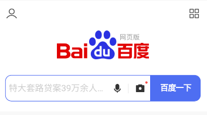


## 10.2	使用HTTP协议访问网络

HTTP的工作原理比较简单，即客户端向服务器发出HTTP请求，服务器收到请求后返回数据给客户端，客户端再对数据进行解析和处理，而这也是浏览器的基本工作原理。

例如上述的WebView实例，就是我们向百度服务器发出了HTTP请求，服务器分析到我们要访问的是百度首页，于是将该网页的HTML代码返回，WebView再调用手机的浏览器内核对返回的HTML代码进行解析，最终将页面展示出来。

简单来说，WebView已经在后台帮我们处理好了发送HTTP请求，接受服务响应、解析返回数据以及最终的页面展示工作。

接下来，我们尝试手动发送HTTP请求，深入理解这一过程：

### 10.2.1	HttpURLConnection

Android系统推荐使用的发送HTTP请求的类是HttpURLConnection

要使用HttpURLConnection，首先要获取URL实例并传入目标网络地址，再调用openConnection()方法即可获取到其实例：

```java
try {
    URL url = new URL("http://www.baidu.com");
    HttpURLConnection httpURLConnection = (HttpURLConnection) url.openConnection();
    //注意这里如果不进行强制类型转换，得到的是URLConnection类型的实例
} catch (IOException e) {
    e.printStackTrace();
}
```

得到HttpURLConnection实例后，我们可以设置发送的HTTP请求类型：即GET和POST等

GET表示从服务器获取数据，而POST表示向服务器发送数据

```java
httpURLConnection.setRequestMethod("GET");//设置发送的HTTP请求类型为GET
```

另外，我们还可以设置连接超时时间和读取超时的时间，单位是毫秒：

```java
httpURLConnection.setConnectTimeout(8000);//设置连接超时时间为8000毫秒
httpURLConnection.setReadTimeout(8000);//设置读取超时时间为8000毫秒
```

之后，我们就可以调用HttpURLConnection的getInputStream()获取输入流，获取到服务器返回的输入流：

```java
InputStream in = httpURLConnection.getInputStream();//获取服务器返回的输入流
```

最后，我们还要调用disconnect()方法，关闭这个HTTP连接：

```java
httpURLConnection.disconnect();
```


#### 10.2.1.1	GET

让我们实践一下：

在MainActivity中添加组件：

```xml
<?xml version="1.0" encoding="utf-8"?>
<LinearLayout xmlns:android="http://schemas.android.com/apk/res/android"
    xmlns:tools="http://schemas.android.com/tools"
    android:orientation="vertical"
    android:layout_width="match_parent"
    android:layout_height="match_parent"
    android:gravity="center_horizontal"
    tools:context=".MainActivity">

    <Button
        android:text="Send Request"
        android:id="@+id/btn_send_request"
        android:layout_width="match_parent"
        android:layout_height="wrap_content"/>

    <ScrollView
        android:layout_width="match_parent"
        android:layout_height="match_parent">

        <TextView
            android:id="@+id/tv_response_text"
            android:layout_width="match_parent"
            android:layout_height="wrap_content"/>

    </ScrollView>

</LinearLayout>
```

我们借助Button发送HTTP请求，TextView显示服务器返回数据，为了避免TextView中数据过多超出屏幕，我们将其放在ScrollView中。

在MainActivity添加代码：

```java
public class MainActivity extends AppCompatActivity{

    private TextView responseText;

    @Override
    protected void onCreate(@Nullable Bundle savedInstanceState) {
        super.onCreate(savedInstanceState);
        setContentView(R.layout.activity_main);
        Button sendRequestBtn = findViewById(R.id.btn_send_request);
        responseText = findViewById(R.id.tv_response_text);
        sendRequestBtn.setOnClickListener(new View.OnClickListener() {
            @Override
            public void onClick(View v) {
                sendRequestWithHttpURLConnection();
            }
        });

    }

    private void sendRequestWithHttpURLConnection() {
        //开启子线程，发送网络请求
        new Thread(new Runnable() {
            @Override
            public void run() {
                HttpURLConnection connection = null;
                BufferedReader reader = null;
                try {
                    URL url = new URL("http://www.baidu.com");
                    connection = (HttpURLConnection) url.openConnection();
                    connection.setRequestMethod("GET");
                    connection.setReadTimeout(8000);
                    connection.setConnectTimeout(8000);
                    InputStream in = connection.getInputStream();//获取服务器返回的输入流
                    //读取获取到的输入流
                    reader = new BufferedReader(new InputStreamReader(in));
                    StringBuilder response = new StringBuilder();
                    String line;
                    while ((line = reader.readLine())!=null){
                        response.append(line);
                    }
                    showResponse(response.toString());
                } catch (IOException e) {
                    e.printStackTrace();
                } finally {//先打开的后关闭
                    if(reader!=null){
                        try {
                            reader.close();
                        } catch (IOException e) {
                            e.printStackTrace();
                        }
                    }
                    if(connection!=null){
                        connection.disconnect();
                    }
                }
            }
        }).start();
    }

    private void showResponse(String response) {
        //Android不允许在子线程中进行UI操作，因此只能通过runOnUiThread()切换到主线程
        //接着才能进行UI操作
        runOnUiThread(new Runnable() {
            @Override
            public void run() {
                //在这里进行UI操作，将结果显示到页面上
                responseText.setText(response);
            }
        });
    }

}
```

运行程序，点击按钮：

 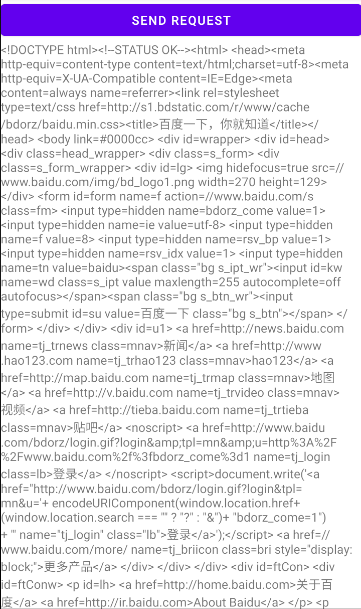


#### 10.2.1.2	POST

如果我们想要向服务器发送数据，首先要将HTTP请求类型设置为POST，并在获取输入流之前将要提交的数据写出：

要写出数据，首先要调用HTTPURLConnection实例的getOutputStream()方法，获取输出流，再用输入流构造出数据输出流DataOutputStream实例，

最后再调用DataOutputStream实例的writeBytes()方法即可，注意每条数据都要以键值对形式存在，数据之间用"&"符号隔开，如向服务器提交用户名和密码：

```java
connection.setRequestMethod("POST");
connection.setRequestProperty("Content-Type","application/x-www-form-urlencoded");//设置请求头
connection.setRequestProperty("Content-Length",content.length()+"");
DataOutputStream out = new DataOutputStream(connection.getOutputStream());
out.writeBytes("username=admin&password=123456");
if (urlConnection.getResponseCode() == 200){ }
```


#### 10.2.1.3	JSON解析

```java
//bean
JSONObject jsonObject = new JSONObject(text);
String code = jsonObject.getString("resultCode");

//array
ArrayList<StuClzInfo> list = new ArrayList<>();
JSONArray array = new JSONArray(text);
for (int i = 0; i < array.length(); i++) {
    StuClzInfo info = new StuClzInfo();
    JSONObject object = array.getJSONObject(i);
    info.setCode(object.getString("code"));
    info.setCount(object.getInt("count"));
    list.add(info);
}
        
//bean中带array
JSONObject object = new JSONObject(text);
String resultCode = object.getString("resultCode");
if ("1".equals(resultCode)) {
    tv_name.setText(object.getString("school"));
    JSONArray clazz = object.getJSONArray("clazz");
    List<StuClzInfo> list = new ArrayList<>();
    for (int i = 0; i < clazz.length(); i++) {
        JSONObject o = clazz.getJSONObject(i);
        StuClzInfo info = new StuClzInfo();
        info.setCode(o.getString("code"));
        info.setCount(o.getInt("count"));
        list.add(info);
    }
}
```


#### 10.2.1.4	GSON解析

```java
//bean
Gson gson = new Gson();
LoginInfo loginInfo = gson.fromJson(text, LoginInfo.class);
        
//list<bean>
Gson gson = new Gson();
Type type = new TypeToken<List<StuClzInfo>>() {}.getType();
List<StuClzInfo> list = gson.fromJson(text, type);
        
//bean.list<bean>
SchoolInfo info = gson.fromJson(text, SchoolInfo.class);
list = info.getClazz();
```


#### 10.2.1.5	FastJSON解析

```java
//bean
LoginInfo loginInfo1 = JSON.parseObject(text, LoginInfo.class);

//array
List<StuClzInfo> list = JSON.parseArray(text, StuClzInfo.class);
        
//bean中带array
SchoolInfo info = JSON.parseObject(text, SchoolInfo.class);
List<StuClzInfo> list = info.getClazz();
```


### 10.2.2	OkHttp

HTTPURLConnection并不是我们的唯一选择，许多出色的网络通信库都可以替代，比如OkHttp：

官方网站：https://square.github.io/okhttp/

#### 10.2.2.0	OkHttp概述

TTP是现代应用常用的一种交换数据和媒体的网络方式，高效地使用HTTP能让资源加载更快，节省带宽。OkHttp是一个高效的HTTP客户端，它有以下默认特性：

- 支持HTTP/2，允许所有同一个主机地址的请求共享同一个socket连接
- 连接池减少请求延时
- 透明的GZIP压缩减少响应数据的大小
- 缓存响应内容，避免一些完全重复的请求
- 1.支持http和https协议,api相同,易用;
   2.http使用线程池,https使用多路复用;
   3.okhttp支持同步和异步调用;
   4.支持普通form和文件上传form;
   5.操作请求和响应(日志,请求头,body等);
   6.okhttp可以设置缓存;
   7.支持透明的gzip压缩响应体

当网络出现问题的时候OkHttp依然坚守自己的职责，它会自动恢复一般的连接问题，如果你的服务有多个IP地址，当第一个IP请求失败时，OkHttp会交替尝试你配置的其他IP，OkHttp使用现代TLS技术(SNI, ALPN)初始化新的连接，当握手失败时会回退到TLS 1.0。

> note: OkHttp 支持 Android 2.3 及以上版本Android平台， 对于 Java, JDK 1.7及以上.


#### 10.2.2.1	使用OkHttp

##### 10.2.2.1.1	发送GET请求

要使用OkHttp，首先要获取OkHttpClient实例：

```java
OkHttpClient client = new OkHttpClient();//创建OkHttpClient实例
```

如果我们想要发起一条HTTP请求，就要创建一个Request对象：

```java
Request request = new Request.Builder().build();//创建Request对象
```

此时我们创建的Request的对象只是一个空的Request对象，我们还需要连缀方法来完善这个对象：

```java
Request request = new Request.Builder()
        .url("http://www.baidu.com")//设置URL
        .build();//创建Request对象
```

之后调用OkHttpClient的newCall()方法创建一个Call对象，并调用它的execute()方法来发送请求并获取服务器返回的数据：

```java
try {
    Response response = client.newCall(request).execute();
} catch (IOException e) {
    e.printStackTrace();
}
```

返回得到的Response对象就是服务器返回的数据了，我们可以调用Response对象的body()方法获取请求体，再调用string()方法转换为字符串：

```java
String responseData = response.body().string();//将响应体转为字符串
```


##### 10.2.2.1.2	发送POST请求

要发送POST请求，我们首先要构建一个请求体RequestBody对象，用来存放要提交的数据：

```java
RequestBody requestBody = new FormBody.Builder()
        .add("username", "admin")
        .add("password", "123456")
        .build();
```

接下来，我们要调用Request对象的post()方法，将我们刚才构建的RequestBody对象传入：

```java
Request request = new Request.Builder()
        .post(requestBody)//发送请求体
        .url("http://www.baidu.com")//设置URL
        .build();//创建Request对象
```

之后的操作与之前GET请求的发送方法一致。


##### 10.2.2.1.3	使用OkHttp发送HTTP请求

接下来我们尝试用OkHttp实现10.2.1.1中的项目：

```java
public class MainActivity extends AppCompatActivity{

    private TextView responseText;
    
    @Override
    protected void onCreate(@Nullable Bundle savedInstanceState) {
        super.onCreate(savedInstanceState);
        setContentView(R.layout.activity_main);
        Button sendRequestBtn = findViewById(R.id.btn_send_request);
        responseText = findViewById(R.id.tv_response_text);
        sendRequestBtn.setOnClickListener(new View.OnClickListener() {
            @Override
            public void onClick(View v) {
                sendRequestWithOkHttp();
            }
        });
    }

    private void sendRequestWithOkHttp() {
        new Thread(new Runnable() {//构建子线程
            @Override
            public void run() {
                OkHttpClient client = new OkHttpClient();//创建OkHttp实例
                Request request = new Request.Builder()
                        .url("http://www.baidu.com")//设置URL
                        .build();//创建Request对象
                try {
                    Response response = client.newCall(request).execute();
                    String responseData = response.body().string();//将响应体转为字符串
                    showResponseData(responseData);
                } catch (IOException e) {
                    e.printStackTrace();
                }
            }
        }).start();
    }

    private void showResponseData(String responseData) {
        runOnUiThread(new Runnable() {
            @Override
            public void run() {
                responseText.setText(responseData);
            }
        });
    }
}
```


## 10.3	解析XML格式数据

通常情况下，每个需要访问网络的应用都有自己的服务器，我们可以向服务器提交数据，也可以从服务器获取数据。在网络上传输数据主要使用的格式有XML、JSON、GSON、FastJSON，我们主要学习XML和JSON数据的传递

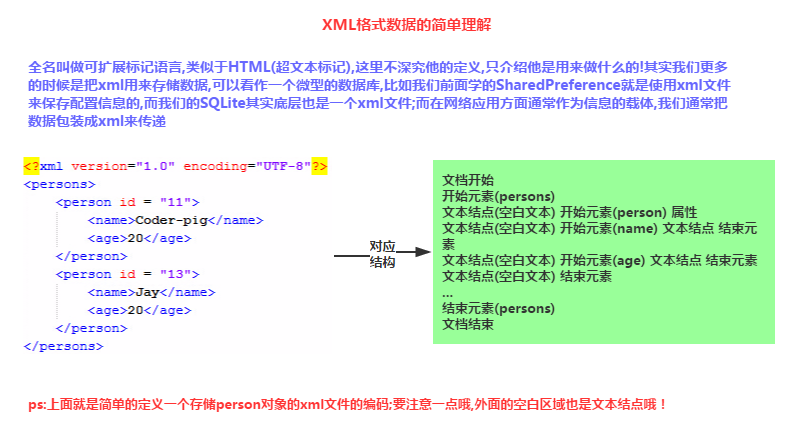

### 10.3.1	搭建Web服务器

#### 10.3.1.1	下载Apache Lounge HttpD

**Apache 2.4.46 Win64** https://www.apachelounge.com/download/VS16/binaries/httpd-2.4.46-win64-VS16.zip

**Apache 2.4.46 Win32** https://www.apachelounge.com/download/VS16/binaries/httpd-2.4.46-win32-VS16.zip

#### 10.3.1.2	配置HttpD服务器

这里，我将压缩包解压到了E盘根目录，服务器路径为E:\Apache24

打开/Apache24/conf/httpd.conf配置文件，

将第37行Define SRVROOT "c:/Apache24" 替换为 Define SRVROOT "e:/Apache24"

将第227行#ServerName www.example.com:80 替换为 ServerName localhost:80

运行/Apache24/bin/httpd.exe启动服务器，在浏览器输入网址127.0.0.1，若出现以下界面则表示配置正确：

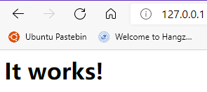

在/Apache24/htdocs目录下，创建XML文件get_data.xml：

```xml
<?xml version="1.0" encoding="utf-8"?>
<apps>
    <app>
        <id>1</id>
        <name>Google Maps</name>
        <version>1.0</version>
    </app>

    <app>
        <id>2</id>
        <name>Chrome</name>
        <version>2.1</version>
    </app>

    <app>
        <id>3</id>
        <name>Google Play</name>
        <version>2.3</version>
    </app>
</apps>
```

在浏览器中访问127.0.0.1/get_data.xml：

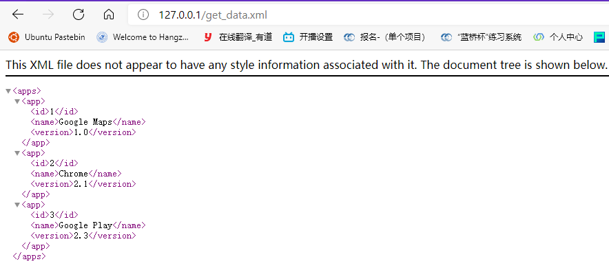

现在我们已经通过服务器准备了一段XML数据，接下来就该使用Android应用进行解析了


### 10.3.2	Pull解析方式

解析XML格式的数据有很多种，这里我们主要关注Pull解析、SAX解析，三种解析方式可见下图，由于DOM解析方式的局限性，我们不对它进行介绍。

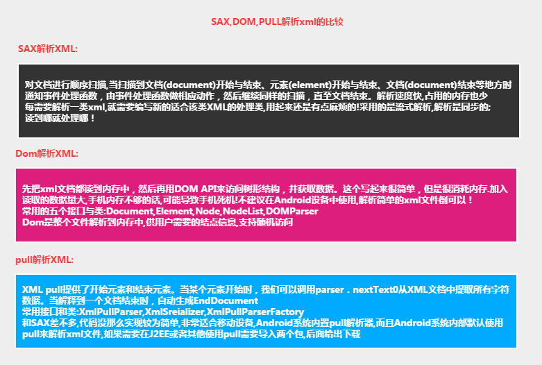

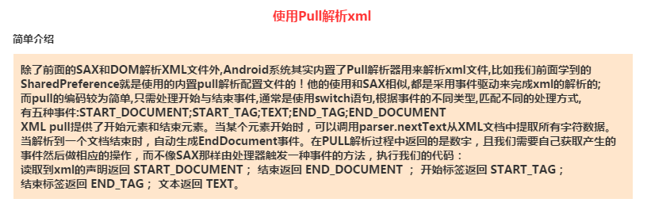

在MainActivity中更改代码：

```java
public class MainActivity extends AppCompatActivity{

    @Override
    protected void onCreate(@Nullable Bundle savedInstanceState) {
        super.onCreate(savedInstanceState);
        setContentView(R.layout.activity_main);
        Button sendRequestBtn = findViewById(R.id.btn_send_request);
        sendRequestBtn.setOnClickListener(new View.OnClickListener() {
            @Override
            public void onClick(View v) {
                sendRequestWithOkHttp();
            }
        });
    }

    private void sendRequestWithOkHttp() {
        new Thread(new Runnable() {//构建子线程
            @Override
            public void run() {
                OkHttpClient client = new OkHttpClient();//创建OkHttp实例
                Request request = new Request.Builder()
                        .url("http://10.158.194.51/get_data.xml")//这里的地址应当为服务器地址，即电脑的IP地址
                        .build();//创建Request对象
                try {
                    Response response = client.newCall(request).execute();
                    String responseData = response.body().string();//将响应体转为字符串
                    parseXMLwithPull(responseData);//Pull方式解析XML数据
                } catch (IOException e) {
                    e.printStackTrace();
                }
            }
        }).start();
    }

    private void parseXMLwithPull(String xmlData) {
        try {
            XmlPullParserFactory factory = XmlPullParserFactory.newInstance();//获取XmlPullParserFactory实例
            XmlPullParser xmlPullParser = factory.newPullParser();//获取XmlPullParser实例
            xmlPullParser.setInput(new StringReader(xmlData));//用XML数据构建StringReader对象，设为输入数据
            int eventType = xmlPullParser.getEventType();//获取当前解析事件
            String id = "";
            String name = "";
            String version = "";
            //若eventType不为XmlPullParser.END_DOCUMENT，则表示解析尚未完成
            while(eventType != XmlPullParser.END_DOCUMENT){
                String nodeName = xmlPullParser.getName();//获取当前节点名称
                switch (eventType){
                    //开始解析某个节点
                    case XmlPullParser.START_TAG://开始解析，根据节点名获取数据
                        if("id".equals(nodeName)){
                            id = xmlPullParser.nextText();//获取节点信息
                        }else if("name".equals(nodeName)){
                            name = xmlPullParser.nextText();
                        }else if("version".equals(nodeName)){
                            version = xmlPullParser.nextText();
                        }
                        break;
                    case XmlPullParser.END_TAG://当前节点解析结束，输出数据
                        if("app".equals(nodeName)){
                            Log.d("MainActivity", "id is " + id);
                            Log.d("MainActivity", "name is " + name);
                            Log.d("MainActivity", "version is " + version);
                        }
                        break;
                    default:
                        break;
                }
                eventType = xmlPullParser.next();//跳转到下一个节点
            }
        } catch (XmlPullParserException | IOException e) {
            e.printStackTrace();
        }
    }

}
```

运行程序：

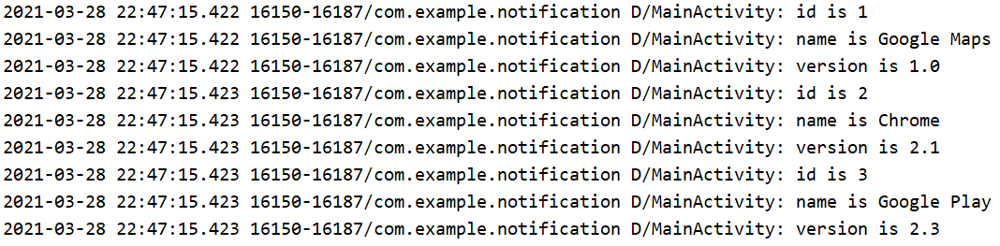

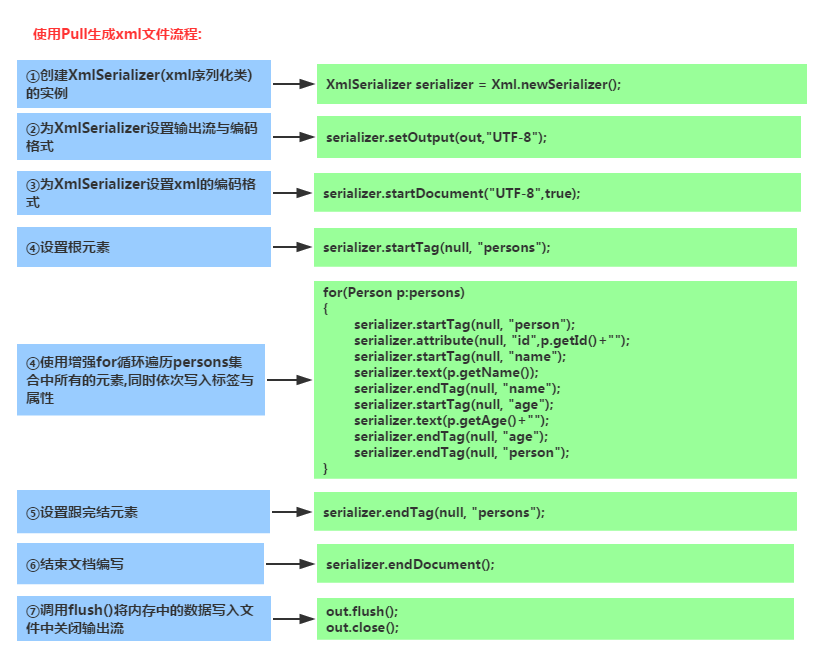

### 10.3.3	SAX解析方式

Pull解析方式虽然好用，但也不是我们的唯一选择。SAX解析方式也是我们常用的XML数据解析方式，它的用法比Pull解析要复杂一些，但语义更清楚。

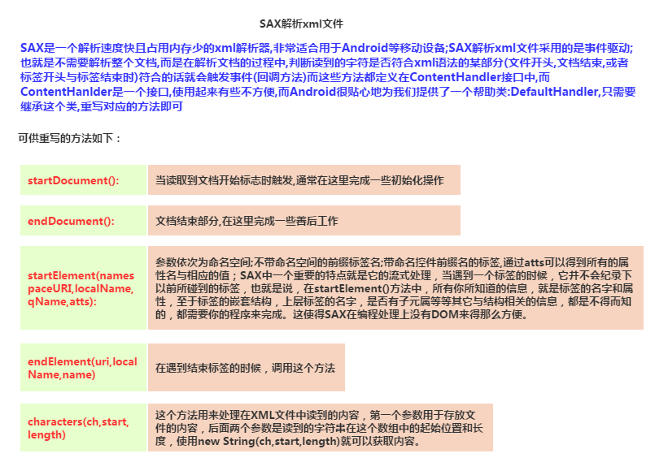

要使用SAX解析方式，我们需要实现一个自定义解析类，并继承基类DefaultHandler，同时重写其中的5个父类方法：

```java
public class MyHandler extends DefaultHandler {
    @Override
    //在开始XML解析时调用
    public void startDocument() throws SAXException {
        super.startDocument();
    }

    @Override
    //在解析某结点时调用
    public void startElement(String uri, String localName, String qName, Attributes attributes) throws SAXException {
        super.startElement(uri, localName, qName, attributes);
    }

    @Override
    //对解析到的字符串进行处理，在解析过程中会被多次调用
    public void characters(char[] ch, int start, int length) throws SAXException {
        super.characters(ch, start, length);
    }

    @Override
    //完成某结点解析时调用
    public void endElement(String uri, String localName, String qName) throws SAXException {
        super.endElement(uri, localName, qName);
    }

    @Override
    //结束XML解析时调用
    public void endDocument() throws SAXException {
        super.endDocument();
    }
}
```

了解了5个方法的使用，我们就来完成这个自定义解析器的代码：

```java
public class MyHandler extends DefaultHandler {

    private String nodeName;//节点名称

    private StringBuilder id;

    private StringBuilder name;

    private StringBuilder version;

    @Override
    //在开始XML解析时调用
    public void startDocument() throws SAXException {
        super.startDocument();
        //对StringBuilder初始化
        id = new StringBuilder();
        name = new StringBuilder();
        version = new StringBuilder();
    }

    @Override
    //在解析某结点时调用
    public void startElement(String uri, String localName, String qName, Attributes attributes) throws SAXException {
        super.startElement(uri, localName, qName, attributes);
        nodeName = localName;//记录当前节点名
    }

    @Override
    //对解析到的字符串进行处理
    public void characters(char[] ch, int start, int length) throws SAXException {
        super.characters(ch, start, length);
        if("id".equals(nodeName)){
            id.append(ch, start, length);
        }else if("name".equals(nodeName)){
            name.append(ch, start, length);
        }else if("version".equals(nodeName)){
            version.append(ch, start, length);
        }
    }

    @Override
    //完成某结点解析时调用
    public void endElement(String uri, String localName, String qName) throws SAXException {
        super.endElement(uri, localName, qName);
        if("app".equals(localName)){//在当前节点解析结束后输出解析到的数据
            Log.d("MainActivity", "id is " + id.toString().trim());//trim()方法能去掉空格和换行符
            Log.d("MainActivity", "name is " + name.toString().trim());
            Log.d("MainActivity", "version is " + version.toString().trim());
            id.setLength(0);//清空StringBuilder
            name.setLength(0);
            version.setLength(0);
        }
    }

    @Override
    //结束XML解析时调用
    public void endDocument() throws SAXException {
        super.endDocument();
    }
}
```

将MainActivity进行修改：

```java
public class MainActivity extends AppCompatActivity{

    @Override
    protected void onCreate(@Nullable Bundle savedInstanceState) {
        super.onCreate(savedInstanceState);
        setContentView(R.layout.activity_main);
        Button sendRequestBtn = findViewById(R.id.btn_send_request);
        sendRequestBtn.setOnClickListener(new View.OnClickListener() {
            @Override
            public void onClick(View v) {
                sendRequestWithOkHttp();
            }
        });
    }

    private void sendRequestWithOkHttp() {
        new Thread(new Runnable() {//构建子线程
            @Override
            public void run() {
                OkHttpClient client = new OkHttpClient();//创建OkHttp实例
                Request request = new Request.Builder()
                        .url("http://10.158.194.51/get_data.xml")//这里的地址应当为服务器地址，即电脑的IP地址
                        .build();//创建Request对象
                try {
                    Response response = client.newCall(request).execute();
                    String responseData = response.body().string();//将响应体转为字符串
                    parseXMLwithSAX(responseData);
                } catch (IOException e) {
                    e.printStackTrace();
                }
            }
        }).start();
    }

    private void parseXMLwithSAX(String xmlData) {
        SAXParserFactory factory = SAXParserFactory.newInstance();
        try {
            XMLReader xmlReader = factory.newSAXParser().getXMLReader();
            MyHandler handler = new MyHandler();
            xmlReader.setContentHandler(handler);//将自定义SAX解析器实例设置到XMLReader中
            xmlReader.parse(new InputSource(new StringReader(xmlData)));//开始解析
        } catch (SAXException | ParserConfigurationException | IOException e) {
            e.printStackTrace();
        }
    }
}
```

运行程序：

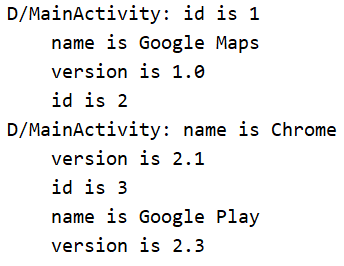


## 10.4	解析JSON格式数据

### 10.4.0	JSON概述

**1）Json是什么？**

> 答：JavaScript Object Natation, 一种轻量级的数据交换格式, 与XML一样, 广泛被采用的客户端和服务端交互的解决方案！具有良好的可读和便于快速编写的特性。

**2）Json与XML的比较**：

> - JSON和XML的数据可读性基本相同;
> - JSON和XML同样拥有丰富的解析手段
> - JSON相对于XML来讲，数据的体积小
> - JSON与JavaScript的交互更加方便
> - JSON对数据的描述性比XML较差
> - JSON的速度要远远快于XML
>
> Json的优点：体积小，节省流量，只是不如XML直观，可读性 稍微差一点而已！

**3）Json的格式规范**：

> 就像协议一样，肯定是有一套规范的，毕竟双方都是通过Json字符串来传递数据，语法规则如下： **数据在名称/值对中**；**数据由逗号分隔**；**花括号保存对象**；**方括号保存数组**； 而Json数据的书写格式：**名称/值对** 比如： **"person"："coder-pig"** 比如一个简单的Json字符串：

```json
[
    { "id":"1","name":"基神","age":"18" },
    { "id":"2","name":"B神","age":"18"  },
    { "id":"3","name":"曹神","age":"18" }
]
```

> 我们除了解析Json还可以自己拼接Json，当然如果你自己拼了一个Json字符串又不知道对不对， 可以百度随便找一个校验工具，比如： [http://www.runoob.com/jsontool](https://www.runoob.com/jsontool)把Json字符串贴上去，校验下就好！

在开始之前，我们同样需要向/Apache24/htdocs目录下添加文件get_data.json：

```json
[{"id":5,"version":"5.5","name":"Clash of Clans"},
{"id":6,"version":"7.0","name":"Boom Beach"},
{"id":7,"version":"3.50","name":"Clash Royale"}]
```

在浏览器中访问127.0.0.1/get_data.json：

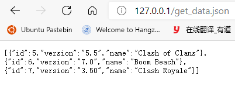

### 10.4.1	JSONObject

首先，我们来学习一下Android官方提供的JSON解析工具JSONObject

```java
private void parseJSONwithJSONObject(String jsonData){
    try {
        JSONArray jsonArray = new JSONArray(jsonData);//用JSON数据构造出JSON对象数组JSONArray
        for(int i=0; i<jsonArray.length(); i++){//遍历数组，取出数据
            JSONObject jsonObject = jsonArray.getJSONObject(i);
            String id = jsonObject.getString("id");
            String name = jsonObject.getString("name");
            String version = jsonObject.getString("version");
            Log.d("MainActivity", "id is " + id);
            Log.d("MainActivity", "name is " + name);
            Log.d("MainActivity", "version is " + version);
        }
    } catch (JSONException e) {
        e.printStackTrace();
    }
}
```

JSONObject主要的优点是Android自带，但它使用较为麻烦且性能较差


### 10.4.2	GSON

GSON快速，高效，代码量少，数据传输解析方便且可按需解析

引入依赖：

```groovy
implementation 'com.google.code.gson:gson:2.8.5'
```

GSON可以将一段JSON字符串自动映射成一个对象，从而不再需要我们手动编写代码去解析了：

首先我们需要根据JSON字符串建立一个实体类，我们根据创建的数据文件get_data.json，创建实体类App：

```java
public class App {
    private String name;
    private String id;
    private String version;
}
```

假设我们要解析的JSON字符串对应的是一个JavaBean，则我们只需要先构造Gson实例，再调用fromGson()方法，传入JSON字符串和其对应实体类，就能自动映射成一个实体对象：

```java
Gson gson = new Gson();//构造Gson实例
App app = gson.fromJson(jsonData, App.class);
```

如果JSON字符串对应的是一个JSON数组，也就是其中存放了一个对象数组，那么我们需要传入JSON字符串，再借助TypeToken，将期望解析成的数据类型传入，这里我们期望获取的是一个List<App>数组，因此代码为：

```java
Gson gson = new Gson();//构造Gson实例
gson.fromJson(jsonData, new TypeToken<List<App>>(){}.getType());
```

对于上例的代码，我们用GSON应该写为：

```java
private void parseJSONwithGSON(String jsonData){
    Gson gson = new Gson();//构造Gson实例
    List<App> apps = gson.fromJson(jsonData, new TypeToken<List<App>>() {
    }.getType());
    for(App app: apps){
        String id = app.getId();
        String name = app.getName();
        String version = app.getVersion();
        Log.d("MainActivity", "id is " + id);
        Log.d("MainActivity", "name is " + name);
        Log.d("MainActivity", "version is " + version);
    }
}
```

运行程序：

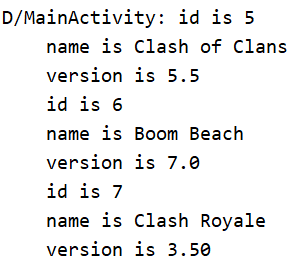


## 10.5	HTTP工具类

我们的应用程序使用网络功能的地方可能有很多，但它们的代码大体都相同，因此我们应当为此编写一个工具类：

```java
public class HttpUtil {

    public static OkHttpClient client;

    static {//创建OkHttpClient实例
        client = new OkHttpClient();
    }

    //默认发送GET请求，若发送的为GET请求，则传递参数为"GET", null, null
    //若发送的为POST请求，则需要传递一个Map对象，将需要传递的数据放在其中
    public static String sendHttpRequest(String url, String method, Map<String, String> map){
        Request.Builder requestBuilder = new Request.Builder();//创建Request.Builder
        requestBuilder.url(url);//添加URL
        if(method.equals("POST")){//若请求类型为POST，则需要获取要发送的数据，并调用post方法
            FormBody.Builder requestBodyBuilder = new FormBody.Builder();
            for(Map.Entry<String, String> entry: map.entrySet()){
                requestBodyBuilder.add(entry.getKey(), entry.getValue());
            }
            requestBuilder.post(requestBodyBuilder.build());
        }
        Request request = requestBuilder.build();//获取Request实例
        try {//获取服务器响应，将返回数据转换为字符串并返回
            Response response = client.newCall(request).execute();
            return response.body().toString();
        } catch (IOException e) {
            e.printStackTrace();
            return null;//若获取服务器响应数据失败，则
        }
    }
}
```


现在，我们发送HTTP请求并获取返回数据的方式就简化为了：

```java
//简化前
private void sendRequestWithOkHttp() {
    new Thread(new Runnable() {
        @Override
        public void run() {
            OkHttpClient client = new OkHttpClient();
            Request request = new Request.Builder()
                .url("http://10.158.194.51/get_data.json")IP地址
                .build();
            try {
                Response response = client.newCall(request).execute();
                String responseData = response.body().string();
                parseJSONwithGSON(responseData);
            } catch (IOException e) {
                e.printStackTrace();
            }
        }
    }).start();
}

//简化后
private void sendRequestWithOkHttp() {
    new Thread(new Runnable() {
        @Override
        public void run() {
            String responseData = HttpUtil.sendHttpRequest("http://10.158.194.51/get_data.json", null, null);
            parseJSONwithGSON(responseData);
        }
    }).start();
}
```


### 10.5.1	Java回调机制

在获取到服务器的响应数据后，我们就可以对它进行解析和处理了。

但这里出现了一个问题：网络请求通常是耗时操作，而我们的工具类HttpUtil中的方法sendHttpRequest()内部并没有开启线程，这可能会导致在调用该方法时导致主线程被阻塞。

但如果我们在sendHttpRequest()方法中开启线程发起HTTP请求，我们将无法接受到服务器的返回数据，因为所有耗时逻辑操作都在子线程中进行，而sendHttpRequest()方法将会在服务器还未响应时就执行结束了，自然无法返回响应数据

此时我们可以使用Java的回调机制来解决这个问题：

首先我们需要先定义一个接口，命名为HttpCallbackListener：

```java
public interface HttpCallbackListener {
    
    //当服务器成功响应时，调用onFinish()方法
    //传递的参数responseData记录了服务器返回的数据
    public void onFinish(String responseData);
    
    //当网络操作出现错误时，调用onError()方法
    //传递的参数e记录了错误的详细信息
    public void onError(Exception e);
}
```

再修改工具类HttpUtil的代码：

```java
public static void sendHttpRequest(@NonNull final String url, final String method, final Map<String, String> map, @NonNull final HttpCallbackListener callbackListener){
    new Thread(new Runnable() {
        @Override
        public void run() {
            Request.Builder requestBuilder = new Request.Builder();//创建Request.Builder
            requestBuilder.url(url);//添加URL
            if(method.equals("POST")){//若请求类型为POST，则需要获取要发送的数据，并调用post方法
                FormBody.Builder requestBodyBuilder = new FormBody.Builder();
                for(Map.Entry<String, String> entry: map.entrySet()){
                    requestBodyBuilder.add(entry.getKey(), entry.getValue());
                }
                requestBuilder.post(requestBodyBuilder.build());
            }
            Request request = requestBuilder.build();//获取Request实例
            try {//获取服务器响应，将返回数据转换为字符串并返回
                Response response = client.newCall(request).execute();
                if(response!=null){//若有响应数据，则表示服务器成功响应并返回数据
                    //此时调用onFinish()方法，返回响应数据
                    callbackListener.onFinish(response.body().toString());
                }
            } catch (IOException e) {
                //若出现异常则表示网络操作出现错误
                // 此时应调用onError()方法，传递错误信息
                e.printStackTrace();
                callbackListener.onError(e);
            }
        }
    }).start();
}
```

我们现在向方法sendHttpRequest()又传递了HttpCallbackListener，并在方法内开启了一个子线程，要注意的是，子线程不能通过return语句返回数据，因此我们将服务器的返回数据传递给了HttpCallbackListener。现在，我们在调用方法时还需要传递一个HttpCallbackListener实例：

```java
private void sendRequestWithOkHttp() {
    new Thread(new Runnable() {//构建子线程
        @Override
        public void run() {
            HttpUtil.sendHttpRequest(
                    "http://10.158.194.51/get_data.json", null, null,
                    new HttpCallbackListener(){
                @Override
                public void onFinish(String responseData) {
                    parseJSONwithGSON(responseData);
                }

                @Override
                public void onError(Exception e) {
                    e.printStackTrace();
                }
            });
        }
    }).start();
}
```

这样的方式太麻烦，实际上我们只是根据HttpURLConnection编写了这种方法，而OkHttp则提供了完善的解决方案：

```java
public static void sendHttpRequest(@NonNull final String url, final String method, final Map<String, String> map,
                                   @NonNull okhttp3.Callback callback){
    //okhttp3.Callback是OkHttp提供的一个回调接口，类似于我们刚才自己编写的回调接口HttpCallbackListener
    Request.Builder requestBuilder = new Request.Builder();//创建Request.Builder
    requestBuilder.url(url);//添加URL
    if(method.equals("POST")){//若请求类型为POST，则需要获取要发送的数据，并调用post方法
        FormBody.Builder requestBodyBuilder = new FormBody.Builder();
        for(Map.Entry<String, String> entry: map.entrySet()){
            requestBodyBuilder.add(entry.getKey(), entry.getValue());
        }
        requestBuilder.post(requestBodyBuilder.build());
    }
    Request request = requestBuilder.build();//获取Request实例
    client.newCall(request).enqueue(callback);
    //OkHttp在enqueue()方法中开启了子线程，在子线程中发送HTTP请求
    //最后将请求结果回调到okhttp3.Callback中
}
```

在MainActivity中，我们的代码就可以修改为：

```java
private void sendRequestWithOkHttp() {
    new Thread(new Runnable() {//构建子线程
        @Override
        public void run() {
            HttpUtil.sendHttpRequest(
                    "http://10.158.194.51/get_data.json", null, null,
                    new okhttp3.Callback(){
                        @Override
                        //服务器成功响应并返回数据后，可以从onResponse()方法获取到响应数据
                        public void onResponse(Call call, Response response) throws IOException {
                            String responseData = response.body().toString();
                            parseJSONwithGSON(responseData);
                        }

                        @Override
                        //出现网络操作错误时，错误信息将传递到onFailure()方法
                        public void onFailure(Call call, IOException e) {
                            e.printStackTrace();
                        }
                    });
        }
    }).start();
}
```

OkHttp的接口设计非常人性化，之后我们会学习更多的OkHttp相关知识。

要注意的是，无论使用HttpURLConnection还是OkHttp，最终的回调接口都还是在子线程中运行的，因此我们不能在这里进行任何UI操作，除非我们借助runOnUiThread()方法切换线程。