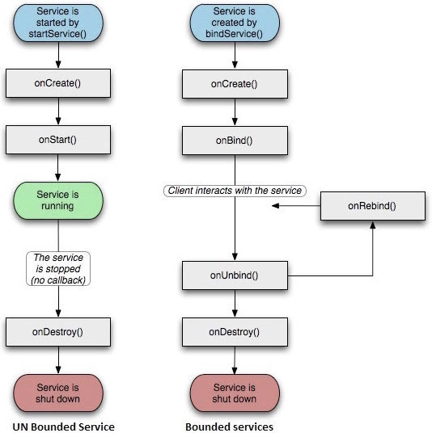
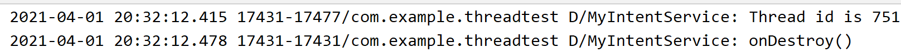

# 11.	Service

## 11.0	Service概述

服务Service，是Android实现程序后台运行的解决方案，适合执行长时间运行且不需要用户交互的任务。服务的运行不依赖任何用户界面，即使程序被切换到后台或者用户打开了另一个应用程序，甚至应用被销毁也依然可以工作。

需要注意的是，服务并不是运行在一个独立进程中的，而是依赖于创建服务时所在的应用进程。当某个应用进程被杀掉时，所有依赖于该进程的服务也会停止运行。

另外，虽然服务运行在后台，但实际上，服务并不会自动开启线程，所有代码都默认运行在主线程中。因此我们需要在服务内部手动创建子线程，并在子线程中执行具体任务，否则可能造成主线程的阻塞。

服务基本上包含两种状态：

| 状态    | 描述                                                         |
| :------ | :----------------------------------------------------------- |
| Started | Android的应用程序组件，如活动，通过startService()启动了服务，则服务是Started状态。一旦启动，服务可以在后台无限期运行，即使启动它的组件已经被销毁。 |
| Bound   | 当Android的应用程序组件通过bindService()绑定了服务，则服务是Bound状态。Bound状态的服务提供了一个客户服务器接口来允许组件与服务进行交互，如发送请求，获取结果，甚至通过IPC来进行跨进程通信。 |

服务拥有生命周期方法，可以实现监控服务状态的变化，可以在合适的阶段执行工作。下面的左图展示了当服务通过startService()被创建时的生命周期，右图则显示了当服务通过bindService()被创建时的生命周期：



要创建服务，你需要创建一个继承自Service基类或者它的已知子类的Java类。Service基类定义了不同的回调方法和多数重要方法。你不需要实现所有的回调方法。虽然如此，理解所有的方法还是非常重要的。实现这些回调能确保你的应用以用户期望的方式实现。

| 回调             | 描述                                                         |
| :--------------- | :----------------------------------------------------------- |
| onStartCommand() | 其他组件(如活动)通过调用startService()来请求启动服务时，系统调用该方法。如果你实现该方法，你有责任在工作完成时通过stopSelf()或者stopService()方法来停止服务。 |
| onBind           | 当其他组件想要通过bindService()来绑定服务时，系统调用该方法。如果你实现该方法，你需要返回IBinder对象来提供一个接口，以便客户来与服务通信。你必须实现该方法，如果你不允许绑定，则直接返回null。 |
| onUnbind()       | 当客户中断所有服务发布的特殊接口时，系统调用该方法。         |
| onRebind()       | 当新的客户端与服务连接，且此前它已经通过onUnbind(Intent)通知断开连接时，系统调用该方法。 |
| onCreate()       | 当服务通过onStartCommand()和onBind()被第一次创建的时候，系统调用该方法。该调用要求执行一次性安装。 |
| onDestroy()      | 当服务不再有用或者被销毁时，系统调用该方法。你的服务需要实现该方法来清理任何资源，如线程，已注册的监听器，接收器等。 |


## 11.1	Android多线程编程

### 11.1.1	线程的基本用法

Android多线程编程与Java多线程编程比较相似，如要定义一个线程只需要获取一个Thread类实例，向其构造方法中传入一个Runnable接口实例即可：

```java
new Thread(new Runnable() {
    @Override
    public void run() {
        
    }
}).start();
```

如上，要运行该线程，我们只需要调用它的start()方法即可。


### 11.1.2	在子线程中更新UI

与许多其他的GUI库一样，Android的UI也是线程不安全的。因此，要向更新应用的UI元素，就必须在主线程中进行，否则将会抛出异常。

有时我们需要在子线程中执行一些耗时任务，再根据任务执行结果更新响应UI控件，此时需要使用Android提供的异步消息处理机制。

创建新项目ThreadTest，添加一个TextView和一个Button：

```xml
<TextView
    android:id="@+id/text"
    android:layout_width="wrap_content"
    android:layout_height="wrap_content"
    android:text="Hello World!" />

<Button
    android:id="@+id/btn_changeText"
    android:layout_width="wrap_content"
    android:layout_height="wrap_content"
    android:text="Change Text"/>
```

```java
public class MainActivity extends AppCompatActivity {

    public static final int UPDATE_TEXT = 1;//定义动作，该动作表示更新TextView

    private TextView text;

    //创建Handler，处理Message
    private final Handler handler = new Handler(Looper.getMainLooper()){
        @Override
        //该方法中的代码将在主线程运行
        public void handleMessage(@NonNull Message msg) {
            super.handleMessage(msg);
            switch (msg.what){
                case UPDATE_TEXT://在这里进行UI操作
                    text.setText("Nice to meet you!");
                    break;
                default:
                    break;
            }
        }
    };


    @Override
    protected void onCreate(Bundle savedInstanceState) {
        super.onCreate(savedInstanceState);
        setContentView(R.layout.activity_main);
        text = findViewById(R.id.text);
        Button changeTextBtn = findViewById(R.id.btn_changeText);
        changeTextBtn.setOnClickListener(new View.OnClickListener() {
            @Override
            public void onClick(View v) {
                new Thread(new Runnable() {
                    @Override
                    public void run() {
                        //制造一个Message对象
                        Message msg = new Message();
                        //what是Message的意图
                        msg.what = UPDATE_TEXT;
                        //调用Handler实例的sendMessage()方法，将Message交给Handler处理
                        handler.sendMessage(msg);
                    }
                }).start();
            }
        });
    }
}
```


### 11.1.3	异步消息处理机制

Android中的异步消息处理主要由4部分组成：Message、Handler、MessageQueue和Looper

#### 11.1.3.1	异步消息处理四大部分

##### 11.1.3.1.1	Message

Message是在线程之间传递的消息，它可以在内部携带少量信息，用于在不同线程之间传递数据。

除了what字段外，我们还可以使用arg1和arg2字段来携带一些整型数据，使用obj字段携带一个Object对象


##### 11.1.3.1.2	Handler

Handler主要用于发送消息和处理消息，发送消息一般使用Handler实例的sendMessage()方法，而发出的消息最终会传递到Handler的hendleMessage()方法


##### 11.1.3.1.3	MessageQueue

MessageQueue，即消息队列，用于存放所有通过Handler发送的消息，这些消息会一直存在于消息队列中，等待被处理。每个线程只有一个MessageQueue对象。


##### 11.1.3.1.4	Looper

Looper是每个线程中的MessageQueue的管家，在调用Looper实例的loop()方法后，就会进入一个无限循环中，每当发现MessageQueue中存在一条消息，就将它取出，并传递到Handler的handleMessage()方法中。每个线程同样只有一个Looper对象。


#### 11.1.3.2	异步消息处理流程

- 首先需要在主线程中创建一个Handler对象，并重写handleMessage()方法。

- 当子线程需要进行UI操作时，就创建一个Message对象，并通过Handler对象的sendMessage()方法将Message发送出去。
- 之后这条Message将会被添加到MessageQueue中等待被处理，而Looper则会一直尝试从MessageQueue中取出待处理消息
- 最后Message被分发回Handler的handleMessage()方法中
- 由于Handler是在主线程中创建，此时handleMessage()方法中的代码也将在主线程中进行，因此我们在这里进行UI操作

下图为整个异步消息处理流程的核心思想：


之前我们通过runOnUiThread()方法，将线程切换回主线程进行UI操作，其本质也是异步消息处理的一个接口封装。


### 11.1.4	AsyncTask

为了更方便地在子线程中进行UI操作，Android还提供了AsyncTask。AsyncTask能帮助我们在不了解异步消息处理机制的情况下，也能轻松切换线程。当然，其本质也基于异步消息处理机制。

AsyncTask是一个抽象类，因此要使用就必须实现这个类。在继承时，我们为AsyncTask类指定3个泛型参数：

- Params：在执行AsyncTask时需要传入的参数，可用于在后台任务中使用
- Progress：后台任务执行时，若需要在界面上显示当前进度，则使用这里指定的泛型作为进度单位
- Result：任务执行完毕后，若需要对结果进行返回，则使用这里指定的泛型作为返回值类型

因此，我们可以写出一个最简单的AsyncTask类：

```java
class MyAsyncTask extends AsyncTask<Void, Integer, Boolean>{
    ...
}
//Params指定为Void表示执行任务不需要传入参数
//Progress指定为Integer表示使用整型作为进度显示单位
//Result指定为Boolean表示使用布尔类型作为返回结果
```

要完成一个AsyncTask类，我们还需要重写几个方法：

- onPreExecute()：这个方法会在后台任务开始前调用，用于在界面上进行初始化操作，如显示一个进度条对话框

- doInBackground(Params...)：这个方法所有代码都在子线程进行，我们应在这里处理所有的耗时任务。任务一旦完成就可以通过return语句返回执行结果，如果AsyncTask的第三个泛型参数Result指定为Void，则不需要返回任务执行结果。注意，这个方法中不能进行UI操作，如果需要更新UI元素，如反馈当前任务执行进度，可以调用publicProgress(Params...)方法来完成
- onProgressUpdate(Progress...)：当在后台调用了publicProgress(Params...)方法后，onProgressUpdate(Progress...)方法就会很快被调用，该方法携带的参数是在后台任务中传递过来的。这个方法中可以执行UI操作，利用参数中的数值就能对界面元素进行更新。
- onPostExecute(Result)：当后台任务执行完毕并通过return语句返回时，这个方法就会很快被调用。返回的数据将作为参数传递到此方法中，可以利用返回的数据进行一些UI操作，如提醒任务执行完成结果，以及关闭进度条对话框等。

根据这些信息，我们可以完善我们的AsyncTask类：

```java
class MyAsyncTask extends AsyncTask<Void, Integer, Boolean>{

    private ProgressDialog dialog;

    @Override
    //在任务执行开始前执行该方法
    protected void onPreExecute() {
        super.onPreExecute();
        dialog.show();//显示进度条对话框
    }

    @Override
    //在任务执行时执行该方法，该方法在子线程执行，不能执行UI操作
    protected Boolean doInBackground(Void... voids) {
        while(true){
            int downloadPercent = doDownload();//这是一个虚构的方法
            publishProgress(downloadPercent);//更新进度条
            if(downloadPercent>=100){
                break;
            }
        }
        return true;
    }

    @Override
    //publishProgress()被调用时，将调用该方法
    protected void onProgressUpdate(Integer... values) {
        super.onProgressUpdate(values);
        //更新进度条
        dialog.setMessage("Downloaded " + values[0] + "%");
        dialog.setProgress(values[0]);
    }

    @Override
    protected void onPostExecute(Boolean result) {
        super.onPostExecute(result);
        dialog.dismiss();//关闭进度条对话框
        if(result){//处理任务执行结果
            Toast.makeText(context, "Download succeeded", Toast.LENGTH_SHORT).show();
        }else{
            Toast.makeText(context, "Download failed", Toast.LENGTH_SHORT).show();
        }
    }

}
```

而当我们要执行这个任务时，只需要：

```java
new MyAsyncTask().execute();
```


## 11.2	Service基本用法

### 11.2.1	定义一个Service

首先快速创建一个Service：


现在查看自动生成的MyService代码：

```java
public class MyService extends Service {
    public MyService() {
    }

    @Override
    public IBinder onBind(Intent intent) {
        // TODO: Return the communication channel to the service.
        throw new UnsupportedOperationException("Not yet implemented");
    }
}
```

根据代码可以看到MyService类继承自Service类，这说明MyService是一个服务

需要注意的是onBind()方法是Service类中唯一的抽象方法，因此要实现Service类就必须要实现这个方法。


要定义一个Service，还要实现处理事情的逻辑，因此我们还需要继承一些方法：

- onCreate()：这个方法将在Service创建时被调用
- onStartCommand()：这个方法会在每次Service启动时被调用
- onDestroy()：在Service被销毁时调用

通常情况下，如果我们希望Service一旦启动就立刻执行某个动作，那么我们应将逻辑写到onStartCommand()方法中；而我们需要在onDestroy()回收不再使用的逻辑


作为Android的几大组件之一，Service也需要在AndroidManifest.xml中进行注册，不过AS已经帮我们完成了这一步骤：

```xml
<service
    android:name=".MyService"
    android:enabled="true"
    android:exported="true"/>
```


### 11.2.2	启动和停止Service

启动和停止Service也是通过Intent实现的

在MainActivity中添加两个Button，分别用于启动和停止Service：

```xml
<Button
    android:id="@+id/btn_start_service"
    android:text="Start Service"
    android:layout_width="wrap_content"
    android:layout_height="wrap_content"/>

<Button
    android:id="@+id/btn_stop_service"
    android:text="Stop Service"
    android:layout_width="wrap_content"
    android:layout_height="wrap_content"/>
```

```java
public class MainActivity extends AppCompatActivity {

    @Override
    protected void onCreate(Bundle savedInstanceState) {
        super.onCreate(savedInstanceState);
        setContentView(R.layout.activity_main);
        Button startServiceBtn = findViewById(R.id.btn_start_service);
        Button stopServiceBtn = findViewById(R.id.btn_stop_service);
        ServiceOnClickListener onClickListener = new ServiceOnClickListener();
        startServiceBtn.setOnClickListener(onClickListener);
        stopServiceBtn.setOnClickListener(onClickListener);
    }

    private class ServiceOnClickListener implements View.OnClickListener{
        @Override
        public void onClick(View v) {
            int id = v.getId();
            if(id == R.id.btn_start_service){
                Intent startIntent = new Intent
                        (MainActivity.this, MyService.class);
                startService(startIntent);
            }else if(id == R.id.btn_stop_service){
                Intent stopIntent = new Intent
                        (MainActivity.this, MyService.class);
                stopService(stopIntent);
            }
        }
    }
```

可以看到，我们直接使用Context类下的startService()和stopService()方法，传入Intent，就能实现Service的启动和停止。

在MyService中加入输出，看看点击Button时发生了什么：

```java
@Override
public void onCreate() {
    super.onCreate();
    Log.d("MyService", "onCreate()");
}

@Override
public int onStartCommand(Intent intent, int flags, int startId) {
    Log.d("MyService", "onStartCommand()");
    return super.onStartCommand(intent, flags, startId);
}

@Override
public void onDestroy() {
    super.onDestroy();
    Log.d("MyService", "onDestroy()");
}
```

运行程序，点击按钮"Start Service"：


点击按钮"Stop Service"：


我们什么时候停止Service完全是由Activity来决定的，如果我们没有点击Stop Service按钮，Service将一直处于运行状态。

那怎么让Service自己停止下来呢？我们只需要在MyService中调用stopSelf()方法就能停止这个Service


### 11.2.3	Activity与Service通信

如何能让Activity与Service的联系更紧密？

我们可以借助onBind()方法来实现，我们需要创建一个Binder对象在Activity与Service之间作为桥梁：

```java
public class MyService extends Service {

    private DownloadBinder binder = new DownloadBinder();

    class DownloadBinder extends Binder {
        public void startDownload(){
            Log.d("MyService", "startDownload()");
        }

        public int getProgress(){
            Log.d("MyService", "getProgress()");
            return 0;
        }
    }

    @Nullable
    @Override
    public IBinder onBind(Intent intent) {
        return binder;
    }
    ...
}
```

我们创建了一个DownloadBinder子类，继承自Binder基类，但实际上它并没有真正实现功能，只是添加了两个模拟方法

接着我们重写了onBind()方法，让它返回DownloadBinder对象实例，这样我们就能在Activity中获取到这个Binder了


在MainActivity中添加两个Button，用于绑定Service和取消绑定Service：

```xml
<Button
    android:id="@+id/btn_bind_service"
    android:text="Bind Service"
    android:layout_width="wrap_content"
    android:layout_height="wrap_content"/>

<Button
    android:id="@+id/btn_unbind_service"
    android:text="Unbind Service"
    android:layout_width="wrap_content"
    android:layout_height="wrap_content"/>
```

```java
public class MainActivity extends AppCompatActivity {

    private MyService.DownloadBinder downloadBinder;

    //创建ServiceConnection匿名类，实现onServiceConnected()和onServiceDisconnected()方法
    private ServiceConnection connection = new ServiceConnection() {
        @Override
        //绑定Service时调用
        public void onServiceConnected(ComponentName name, IBinder service) {
            downloadBinder = (MyService.DownloadBinder)service;
            downloadBinder.startDownload();
            downloadBinder.getProgress();
        }

        @Override
        //解绑Service时调用
        public void onServiceDisconnected(ComponentName name) {
        }
    };

    @Override
    protected void onCreate(Bundle savedInstanceState) {
        super.onCreate(savedInstanceState);
        setContentView(R.layout.activity_main);
		...
        Button bindServiceBtn = findViewById(R.id.btn_bind_service);
        Button unbindServiceBtn = findViewById(R.id.btn_unbind_service);
        bindServiceBtn.setOnClickListener(onClickListener);
        unbindServiceBtn.setOnClickListener(onClickListener);
    }

    private class ServiceOnClickListener implements View.OnClickListener{
        @Override
        public void onClick(View v) {
            int id = v.getId();
			...
            }else if(id == R.id.btn_bind_service){
                Intent bindIntent = new Intent(MainActivity.this, MyService.class);
                bindService(bindIntent, connection, BIND_AUTO_CREATE);//绑定Service
            	//bindService()方法接收三个参数，Intent, ServiceConnection和标志位
            	//BIND_AUTO_CREATE表示在Activity和Service间绑定后自动创建Service
                //此时Service的onCreate()方法执行但onStartCommand()方法不执行
            }else if(id == R.id.btn_unbind_service){
                unbindService(connection);//解绑Service
            }
        }
    }
    
}
```

运行程序，点击按钮"Bind Service"：


点击按钮"Unbind Service"：


需要注意的是，任何一个Service在整个应用范围内都是通用的，即MyService不仅可以与MainActivity绑定，还可以与其他Activity绑定，但它们获取到的DownloadBinder实例是同一个实例


## 11.3	Service的生命周期


- 当Service被首次创建时，会首先调用onCreate()方法
- 当我们在项目任何位置调用Context的startService()方法时，相应的Service将被启动，并调用onStartCommand()方法
- Service被启动后会一直处于运行状态，直到调用了stopService()或stopSelf()方法
- 当调用stopService()或stopSelf()方法后，onDestroy()方法将被调用，表示Service已经被销毁
- 注意，虽然每调用一次startService()方法，就会调用一次onStartCommand()方法，但实际上程序中每个Service只存在一个实例


- 另外，我们还可以调用Context的bindService()方法来获取一个Service的持久连接，此时将调用onBind()方法，如果Service之前在程序中未被创建过，同样会先调用onCreate()方法
- 之后调用方可以获取到onBind()方法中返回的IBinder对象实例，这样就能自由地与Service通信了，只要调用方与Service间连接没有断开，Service将一直处于运行状态
- 类似的，当调用unbindService()方法后，onDestroy()方法将被调用
- 需要注意的是，当一个Service同时被调用过startService()和bindService()时，必须使两个条件同时不满足才能销毁Service，即此时要调用stopService()和unbindService()才能销毁该Service


## 11.4	Service进阶技巧

### 11.4.1	使用前台Service

Service几乎都在后台运行，但Service的系统优先度比较低，当系统内存不足时，可能会回收掉在后台运行的Service

如果我们希望Service可以一直保持运行状态而不被系统回收，就可以考虑使用前台Service

前台Service和普通Service最大不同在于：它会始终在系统状态栏上显示一个正在运行的图标，下拉状态栏可以看到更详细的信息，类似于通知Notification的效果

当然有时前台Service的使用并不只是为了防止被系统回收掉，有些项目由于特殊的需求会要求必须使用前台Service，如有些天气应用的Service在后台更新天气数据时，还会在系统状态栏一直显示当前的天气信息


我们来看看如何创建一个前台Service：

修改MyService中的代码：

```java
@Override
public void onCreate() {
    super.onCreate();
    Log.d("MyService", "onCreate()");

    Intent intent = new Intent(this, MainActivity.class);
    PendingIntent pi = PendingIntent.getActivity(this, 0, intent, 0);

    NotificationCompat.Builder builder = new NotificationCompat.Builder(this)
        .setContentText("This is MyService")//设置标题
        .setContentText("MyService is running...")//设置内容
        .setWhen(System.currentTimeMillis())//设置时间
        .setSmallIcon(R.mipmap.ic_launcher_round)//设置通知栏图标
        .setLargeIcon(BitmapFactory.decodeResource(//设置下拉通知栏显示的图标
            getResources(), R.mipmap.ic_launcher))
        .setContentIntent(pi);//设置PendingIntent

    if(Build.VERSION.SDK_INT>26){//设置消息渠道NotificationChannel
        NotificationManager notificationManager = (NotificationManager)getSystemService(NOTIFICATION_SERVICE);
        NotificationChannel channel = new NotificationChannel("ForegroundChannel", "MyChannel", NotificationManager.IMPORTANCE_DEFAULT);
        notificationManager.createNotificationChannel(channel);
        builder.setChannelId("ForegroundChannel");
    }

    Notification notification = builder.build();
    startForeground(1, notification);
    //startForeground()方法能让Service以通知的形式显示在系统状态栏中
    //startForeground()方法需要两个参数，NotificationId和Notification对象
    //通知样式由传入的Notification对象决定
}
```

```java
public class MainActivity extends AppCompatActivity {

	...

    private class ServiceOnClickListener implements View.OnClickListener{
        @Override
        public void onClick(View v) {
            int id = v.getId();
            if(id == R.id.btn_start_service){
                //API29，即Android9.0后运行前台Service需要申请运行时权限
                if(Build.VERSION.SDK_INT > 27){
                    if(ActivityCompat.checkSelfPermission(MainActivity.this, Manifest.permission.FOREGROUND_SERVICE)
                            != PackageManager.PERMISSION_GRANTED) {
                        ActivityCompat.requestPermissions(MainActivity.this, new String[]{Manifest.permission.FOREGROUND_SERVICE}, 1);
                    }else{
                        startMyService();
                    }
                }
            }
            ...
    }

    @Override
    public void onRequestPermissionsResult(int requestCode, @NonNull String[] permissions, @NonNull int[] grantResults) {
        super.onRequestPermissionsResult(requestCode, permissions, grantResults);
        if(requestCode==1){
            if(grantResults.length>0&&grantResults[0]==PackageManager.PERMISSION_GRANTED){
                startMyService();
            }
        }else{
            Toast.makeText(this, "You denied the permission", Toast.LENGTH_SHORT).show();
            finish();
        }
    }

    private void startMyService(){//启动MyService
        Intent startIntent = new Intent
                (MainActivity.this, MyService.class);
        startService(startIntent);
    }

}
```

需要注意的是，自Android9.0，即API29之后，运行前台Service需要申请运行时权限：

```xml
<uses-permission android:name="android.permission.FOREGROUND_SERVICE"/>
```

运行程序：


### 11.4.2	使用IntentService

Service中的代码默认都会运行在主线程中，如果直接在Service中处理一些耗时逻辑，就容易出现ANR(Application Not Responding)的情况

因此我们就需要使用Android多线程技术，在Service的每个具体方法中开启一个子线程，在这里处理耗时逻辑。

这样，我们可以将Service写作：

```java
@Override
public int onStartCommand(Intent intent, int flags, int startId) {
    Log.d("MyService", "onStartCommand()");
    new Thread(new Runnable() {
        @Override
        public void run() {
            //处理具体逻辑
            stopSelf();//处理结束后主动停止服务
        }
    }).start();
    return super.onStartCommand(intent, flags, startId);
}
```

虽然这样的写法并不复杂，但总会出现忘记开启线程、或忘记调用stopSelf()方法的情况

为了可以简单创建一个异步、自动停止的Service，Android专门提供了一个IntentService类，解决了以上两种问题。

新建一个MyIntentService类，继承IntentService：


其中内容很多，我们暂时只关注以下方法：

```java
//必须提供一个无参构造函数，并在内部调用父类有参构造方法
public MyIntentService() {
    //调用父类有参构造函数
    super("MyIntentService");
}

@Override
//必须实现该方法，该方法运行在子线程，因此可以处理具体逻辑
protected void onHandleIntent(Intent intent) {
    //打印当前线程ID
    Log.d("MyIntentService",
            "Thread id is " + Thread.currentThread().getId());
}

@Override
public void onDestroy() {
    super.onDestroy();
    Log.d("MyIntentService", "onDestroy()");
}
```

在MainActivity中添加一个Button：

```java
<Button
    android:id="@+id/btn_start_intentService"
    android:text="Start IntentService"
    android:layout_width="wrap_content"
    android:layout_height="wrap_content"/>
```

```java
Button startIntentServiceBtn = findViewById(R.id.btn_start_intentService);
startIntentServiceBtn.setOnClickListener(new View.OnClickListener() {
    @Override
    public void onClick(View v) {
        //打印主线程id
        Log.d("MainActivity",
                "Thread id is " + Thread.currentThread().getId());
        Intent intentService = new Intent(MainActivity.this, MyIntentService.class);
        startService(intentService);
    }
});
```

不要忘记Service也需要注册，不过如果我们是自动生成的，AS已经帮我们完成了：

```xml
<service
    android:name=".MyIntentService"
    android:enabled="true"
    android:exported="false"/>
```

运行程序，点击按钮"Start IntentService"：




可以看到，MainActivity和MyIntentService的onHandleIntent()方法所在线程不一致，说明onHandleIntent()方法确实运行在子线程中，并且在运行结束后自动销毁了Service


## 11.5	Service实践

我们尝试实现Service中的常用功能：下载

引入依赖OkHttp3：

```groovy
implementation 'com.squareup.okhttp3:okhttp:3.10.0'
```

首先定义回调接口DownloadListener：

```java
public interface DownloadListener {

    void onProgress(int progress);//通知下载进度

    void onSuccess();//通知下载成功事件

    void onFailed();//通知下载失败事件

    void onPaused();//通知下载暂停事件

    void onCanceled();//通知下载取消事件
}
```

接下来编写下载功能，我们使用AsyncTask来实现：

创建异步任务类DownloadTask，继承AsyncTask：

```java
public class DownloadTask extends AsyncTask<String, Integer, Integer> {
//三个泛型参数分别指定为String, Integer, Integer
//第一个String参数表示执行AsyncTask时需要传入一个字符串参数，即我们的目标下载链接URL
//第二个Integer参数表示我们使用整型数据作为进度显示单位
//第三个Integer参数表示使用整型数据反馈任务执行结果

    //下载任务的状态
    public static final int TYPE_SUCCESS = 0;
    public static final int TYPE_FAILED = 1;
    public static final int TYPE_PAUSED = 2;
    public static final int TYPE_CANCELED = 3;

    private DownloadListener listener;

    private boolean isCanceled = false;

    private boolean isPaused = false;

    private int lastProgress;

    public DownloadTask(DownloadListener listener) {
        super();
        this.listener = listener;
    }

    @Override
    //具体下载逻辑
    protected Integer doInBackground(String... strings) {
        InputStream is = null;
        RandomAccessFile savedFile = null;
        File file = null;
        long downloadedLength = 0;//记录目标文件已下载长度
        String downloadUrl = strings[0];//从传入String参数获取下载URL
        //将文件名设为URL最后一个"/"后文字
        String fileName = downloadUrl.substring(downloadUrl.lastIndexOf("/"));
        //将下载目录设为SD卡的download目录
        String directory = Environment.getExternalStoragePublicDirectory(Environment.DIRECTORY_DOWNLOADS).getPath();
        file = new File(directory + fileName);
        if(file.exists()){//若本地文件已存在则获取已下载长度，之后根据已下载长度判断是否需要继续下载
            downloadedLength = file.length();
        }
        long contentLength = 0;//获取目标文件的长度
        try {
            contentLength = getContentLength(downloadUrl);
        } catch (IOException e) {
            e.printStackTrace();
        }
        if(contentLength==0){
            //若文件长度为0，表示文件有问题，下载失败
            return TYPE_FAILED;
        }else if(contentLength==downloadedLength){
            //若文件长度等于已下载长度表示下载成功
            return TYPE_SUCCESS;
        }
        OkHttpClient client = new OkHttpClient();
        Request request = new Request.Builder()
                //断点下载，指定从哪个字节开始下载
                .addHeader("RANGE", "byte=" + downloadedLength + "-")
                .url(downloadUrl)
                .build();
        try {//异步执行下载任务请求
            Response response = client.newCall(request).execute();
            if(response!=null&&response.body()!=null){
                is = response.body().byteStream();//将输入流设为响应体的字节流
                //创建一个随机访问文件流，从file参数指定的文件中读取文件,rw表示读写文件，若不存在则创建文件
                savedFile = new RandomAccessFile(file, "rw");
                savedFile.seek(downloadedLength);//跳过已下载的字节，即继续下载
                byte[] b = new byte[1024];//创建临时字节数组读取字节流内容，大小设定为1024
                long total = 0;
                int len;
                //当输入流仍有数据时
                while((len = is.read(b))!=-1){
                    //判断用户有无取消或暂停任务操作
                    if(isCanceled){
                        return TYPE_CANCELED;
                    }else if(isPaused){
                        return TYPE_PAUSED;
                    }else{//若没有取消或暂停任务，则继续记录下载长度
                        total += len;
                    }
                    //向文件写入b数组len长度
                    savedFile.write(b, 0, len);
                    //计算已下载的百分比
                    int progress = (int)((total+downloadedLength)*100/contentLength);
                    //更新进度
                    publishProgress(progress);
                }
            }//若循环结束则表示下载完成
            if (response != null && response.body() != null) {
                response.body().close();
                return TYPE_SUCCESS;
            }
        } catch (IOException e) {
            e.printStackTrace();
        }finally {
                try {
                    if (is != null) {
                        is.close();
                    }
                    if(savedFile != null){
                        savedFile.close();
                    }
                    if(isCanceled){//若取消任务则删除文件
                        file.delete();
                    }
                } catch (IOException e) {
                    e.printStackTrace();
                }
        }
        return TYPE_FAILED;
    }

    //获取文件内容长度
    private long getContentLength(String downloadUrl) throws IOException {
        OkHttpClient client = new OkHttpClient();
        Request request = new Request.Builder()
                .url(downloadUrl)
                .build();
        Response response = client.newCall(request).execute();
        if(response!=null&&response.isSuccessful()){
            if (response.body() != null) {
                long contentLength = response.body().contentLength();
                response.close();
                return contentLength;
            }
        }
        return 0;
    }

    public void pauseDownload(){
        isPaused = true;
    }

    public void cancelDownload(){
        isCanceled = true;
    }

    @Override
    //更新进度信息
    protected void onProgressUpdate(Integer... values) {
        super.onProgressUpdate(values);
        int progress = values[0];
        if(progress > lastProgress){//更新进度
            listener.onProgress(progress);
            lastProgress = progress;
        }
    }

    @Override
    //通过结束任务的状态调用不同处理方法，通知任务最终结果
    protected void onPostExecute(Integer status) {
        super.onPostExecute(status);
        switch (status){
            case TYPE_SUCCESS:
                listener.onSuccess();
                break;
            case TYPE_FAILED:
                listener.onFailed();
                break;
            case TYPE_PAUSED:
                listener.onPaused();
                break;
            case TYPE_CANCELED:
                listener.onCanceled();
                break;
            default:
                break;
        }
    }
    
}
```

这样，我们就完成了具体的下载功能，为了保证DownloadTask能一直在后台运行，我们还需要创建一个下载的Service，创建DownloadService：

```java
public class DownloadService extends Service {

    private DownloadTask downloadTask;

    private String downloadUrl;

    private final DownloadListener listener = new DownloadListener() {
        @Override
        public void onProgress(int progress) {
            //实时更新下载进度
            getNotificationManager().notify(1, getNotification("Downloading...", progress));
        }

        @Override
        public void onSuccess() {
            downloadTask = null;
            //下载完成后，将前台Service通知关闭，并创建一个下载成功的通知
            stopForeground(true);
            getNotificationManager().notify(1, getNotification("Download Successfully", -1));
            Toast.makeText(DownloadService.this, "Download Successfully", Toast.LENGTH_SHORT).show();
        }

        @Override
        public void onFailed() {
            downloadTask = null;
            //下载失败时关闭前台Service通知，并创建一个下载失败的通知
            stopForeground(true);
            getNotificationManager().notify(1, getNotification("Download Failed", -1));
            Toast.makeText(DownloadService.this, "Download Failed", Toast.LENGTH_SHORT).show();
        }

        @Override
        public void onPaused() {
            downloadTask = null;
            Toast.makeText(DownloadService.this, "Task Paused", Toast.LENGTH_SHORT).show();
        }

        @Override
        public void onCanceled() {
            downloadTask = null;
            stopForeground(true);
            Toast.makeText(DownloadService.this, "Task canceled", Toast.LENGTH_SHORT).show();
        }
    };//设置下载监听器

    private final DownloadBinder binder = new DownloadBinder();//用于与Activity通信

    private Notification getNotification(String title, int progress) {
        Intent intent = new Intent(this, MainActivity.class);
        //构建IntentService
        PendingIntent pi = PendingIntent.getActivity(this, 0, intent, 0);
        NotificationCompat.Builder builder = new NotificationCompat.Builder(this)
                .setContentTitle(title)
                .setContentIntent(pi)
                .setLargeIcon(BitmapFactory.decodeResource(getResources(), R.mipmap.ic_launcher))
                .setSmallIcon(R.mipmap.ic_launcher);
        if(progress>0){//进度大于0时才显示进度
            builder.setContentText(progress + "%");
            builder.setProgress(100, progress, false);
            //该方法接收3个参数，最大进度值、当前进度和是否使用模糊进度条
        }
        if(Build.VERSION.SDK_INT>27){//设置消息渠道NotificationChannel
            NotificationManager manager = getNotificationManager();
            NotificationChannel channel = new NotificationChannel("DownloadChannel", "DownloadChannel", NotificationManager.IMPORTANCE_DEFAULT);
            manager.createNotificationChannel(channel);
            builder.setChannelId("DownloadChannel");
        }
        return builder.build();
    }

    private NotificationManager getNotificationManager() {
        return (NotificationManager)getSystemService(NOTIFICATION_SERVICE);
    }

    @Override
    public IBinder onBind(Intent intent) {
        return binder;
    }

    class DownloadBinder extends Binder{
        //启动下载任务
        public void startDownload(String url){
            if(downloadTask==null){//当没有下载任务时
                downloadUrl = url;//将URL设为目标任务URL
                downloadTask = new DownloadTask(listener);//创建新的下载任务
                downloadTask.execute(downloadUrl);//传入目标任务URL，启动下载任务
                startForeground(1, getNotification("Downloading...", 0));//开启前台Service
                Toast.makeText(DownloadService.this, "Downloading...", Toast.LENGTH_SHORT).show();
            }
        }

        //暂停下载任务
        public void pauseDownload(){
            if(downloadTask!=null){
                downloadTask.pauseDownload();
            }
        }

        //取消下载任务
        public void cancelDownload(){
            if(downloadTask!=null){
                downloadTask.cancelDownload();
            }else{
                if(downloadUrl!=null){
                    //取消正在下载的任命，需要删除文件并关闭通知
                    String fileName = downloadUrl.substring(downloadUrl.lastIndexOf("/"));
                    String directory = Environment.getExternalStoragePublicDirectory(Environment.DIRECTORY_DOWNLOADS).getPath();
                    File file = new File(directory + fileName);
                    if(file.exists()){
                        file.delete();
                    }
                    getNotificationManager().cancel(1);//关闭通知
                    stopForeground(true);
                    Toast.makeText(DownloadService.this, "Task Canceled", Toast.LENGTH_SHORT).show();
                }
            }
        }
    }
}
```

在MainActivity中添加3个Button，用于启动、暂停和取消下载任务：

```xml
<Button
    android:id="@+id/btn_start_download"
    android:text="Start Download"
    android:layout_width="match_parent"
    android:layout_height="wrap_content"/>

<Button
    android:id="@+id/btn_pause_download"
    android:text="Pause Download"
    android:layout_width="match_parent"
    android:layout_height="wrap_content"/>

<Button
    android:id="@+id/btn_cacel_download"
    android:text="Cancel Download"
    android:layout_width="match_parent"
    android:layout_height="wrap_content"/>
```

```java
public class MainActivity extends AppCompatActivity implements View.OnClickListener{

    private DownloadService.DownloadBinder downloadBinder;

    private ServiceConnection connection = new ServiceConnection() {
        @Override
        public void onServiceConnected(ComponentName name, IBinder service) {
            downloadBinder = (DownloadService.DownloadBinder)service;
        }

        @Override
        public void onServiceDisconnected(ComponentName name) {
        }
    };

    @Override
    protected void onCreate(@Nullable Bundle savedInstanceState) {
        super.onCreate(savedInstanceState);
        setContentView(R.layout.activity_main);
        Button startBtn = findViewById(R.id.btn_start_download);
        Button pauseBtn = findViewById(R.id.btn_pause_download);
        Button cancelBtn = findViewById(R.id.btn_cancel_download);
        startBtn.setOnClickListener(this);
        pauseBtn.setOnClickListener(this);
        cancelBtn.setOnClickListener(this);
        Intent intent = new Intent(this, DownloadService.class);
        startService(intent);//启动Service
        bindService(intent, connection, BIND_AUTO_CREATE);//绑定Service
        if(Build.VERSION.SDK_INT>27){//获取运行时权限
            if(ContextCompat.checkSelfPermission(MainActivity.this, Manifest.permission.WRITE_EXTERNAL_STORAGE)
                    !=PackageManager.PERMISSION_GRANTED
                    &&ContextCompat.checkSelfPermission(MainActivity.this, Manifest.permission.FOREGROUND_SERVICE)
                    !=PackageManager.PERMISSION_GRANTED){
                ActivityCompat.requestPermissions(MainActivity.this,
                        new String[]{Manifest.permission.FOREGROUND_SERVICE, Manifest.permission.WRITE_EXTERNAL_STORAGE}, 1);
            }
        }else{
            if(ContextCompat.checkSelfPermission(MainActivity.this, Manifest.permission.WRITE_EXTERNAL_STORAGE)
                    !=PackageManager.PERMISSION_GRANTED){
                ActivityCompat.requestPermissions(MainActivity.this,
                        new String[]{Manifest.permission.WRITE_EXTERNAL_STORAGE}, 1);
            }
        }
    }

    @Override
    public void onRequestPermissionsResult(int requestCode, @NonNull String[] permissions, @NonNull int[] grantResults) {
        super.onRequestPermissionsResult(requestCode, permissions, grantResults);
        if(requestCode==1){
            boolean havePermissions = havePermissions = grantResults.length>0
                    &&grantResults[0]==PackageManager.PERMISSION_GRANTED;
            if(Build.VERSION.SDK_INT>27){
                havePermissions = havePermissions && grantResults[1]==PackageManager.PERMISSION_GRANTED;
            }
            if(!havePermissions){
                Toast.makeText(this, "拒绝权限将无法使用该应用", Toast.LENGTH_SHORT).show();
            }
        }
    }

    @Override
    public void onClick(View v) {
        if(downloadBinder!=null){
            int id = v.getId();
            if(id == R.id.btn_start_download){
                String url = "https://raw.githubusercontent.com/guolindev/eclipse/master/eclipse-inst-win64.exe";
                downloadBinder.startDownload(url);
            }else if(id == R.id.btn_pause_download){
                downloadBinder.pauseDownload();
            }else if(id == R.id.btn_cancel_download){
                downloadBinder.cancelDownload();
            }
        }
    }

    @Override
    protected void onDestroy() {
        super.onDestroy();
        unbindService(connection);//Activity销毁时一定要解绑Service，否则可能会造成内存泄漏
    }
}
```

在AndroidManifest.xml中声明权限：

```xml
<uses-permission android:name="android.permission.FOREGROUND_SERVICE" />
<uses-permission android:name="android.permission.WRITE_EXTERNAL_STORAGE"/>
<uses-permission android:name="android.permission.INTERNET"/>
```

运行程序：

