# 12.	MaterialDesign

MaterialDesign，即材料设计语言，是由[Google](https://baike.baidu.com/item/Google/86964)推出的全新的设计语言，谷歌表示，这种设计语言旨在为手机、平板电脑、台式机和“其他平台”提供更一致、更广泛的“外观和感觉”。

为了统一跨设备间的界面和交互，让用户得到连贯的体验。**Material Design不再让像素处于同一个平面，而是让它们按照规则处于空间当中，具备不同的维度**。按照Wired的话来说，那就是让像素具备海拔高度，这样子的话，系统的不同层面的元素，都是有原则、可预测的，不让用户感到无所适从，也避免开发者担心因为不同的视觉风格而产生冲突。

**Material Design还规范了Android的运动元素**，让按钮的弹入弹出，卡片的滑入滑出以及从一个界面变化成另一个界面的方法（比如从介绍一首歌的界面到控制播放的界面），都是秩序的、深思熟虑过的。Wired总结，Material Design中只有在高亮动作以及改变交互状态时，才会使用运动元素来表示。

对于现实世界中的隐喻，**Material Design更加倾向于用色彩来提示**。我们按下屏幕当中的按钮时，可以看到按钮颜色迅速发生变化，向石头投入湖面一样，产生了一波涟漪。杜瓦迪这样设计是因为Material Design中的按钮都处于一个平面，不再突起，因此它必须采用和以往不同的表示方法，以表明自己已经被按下。

然而，**正如Material Design名字所暗示的，为了适应多尺寸的屏幕**，杜瓦迪以及他的团队，寻求一种更加抽象的表达，一种存在屏幕里的显示“材料”。根据The Verge报道，杜瓦迪团队在面对Google产品里大量采用的卡片式设计时，灵感火花一闪：何不如这些“卡片”，想像成现实当中存在的，四处滑动的物体。


## 12.1	Toolbar

Toolbar将会是我们第一个接触的Material控件，它与我们最早学习Android接触的ActionBar很相似。ActionBar是一个自定义的标题栏，能替代系统原生的ActionBar。

但由于设计原因，ActionBar被限定Toolbar在Activity顶部，从而不能实现一些MaterialDesign的效果，因此官方不再推荐使用ActionBar了，取而代之的是Toolbar。

Toolbar不仅继承了ActionBar的全部功能，而且灵活度很高，可以配合其他控件来完成一些MaterialDesign的效果。

任何项目默认都会显示ActionBar，但这个ActionBar是从哪里来的呢？这是根据项目指定的主题显示的，在AndroidManifest.xml中：

```xml
<application
	...
    android:theme="@style/Theme.ThreadTest">
```

可以看到，<application>标签中使用了`android:theme`属性指定了一个主题样式，打开对应的样式：

```xml
<style name="Theme.ThreadTest" parent="Theme.MaterialComponents.DayNight.DarkActionBar">
```

可以看到这个Theme指定了它的parent主题是Theme.MaterialComponents.DayNight.DarkActionBar，它是一个深色的ActionBar主题，我们之前项目中自带的ActionBar就是它了。

现在我们需要使用Toolbar来替代ActionBar，因此我们需要指定一个不带ActionBar的主题，比如Theme.AppCompat.Light.NoActionBar和Theme.AppCompat.NoActionBar

前者将界面主题设为淡色，陪衬颜色设为深色；后者将界面主题设为深色，陪衬颜色设为淡色

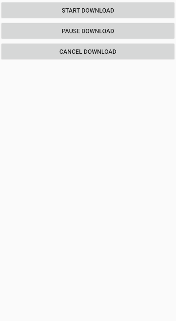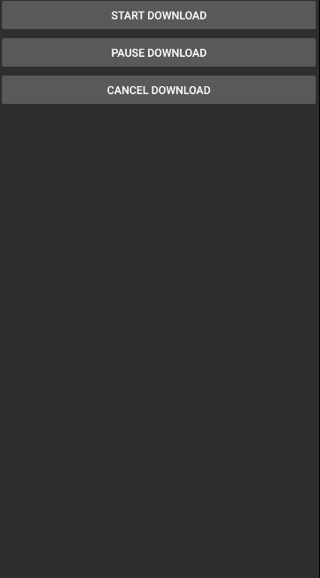

这里我们选择主题Theme.MaterialComponents.Light.NoActionBar

观察一下这个style：

```xml
<style name="Theme.ThreadTest" parent="Theme.MaterialComponents.Light.NoActionBar">
    <!-- Primary brand color. -->
    <item name="colorPrimary">@color/purple_500</item>
    <item name="colorPrimaryVariant">@color/purple_700</item>
    <item name="colorOnPrimary">@color/white</item>
    <!-- Secondary brand color. -->
    <item name="colorSecondary">@color/teal_200</item>
    <item name="colorSecondaryVariant">@color/teal_700</item>
    <item name="colorOnSecondary">@color/black</item>
    <!-- Status bar color. -->
    <item name="android:statusBarColor" tools:targetApi="l">?attr/colorPrimaryVariant</item>
    <!-- Customize your theme here. -->
</style>
```

其中有几条属性：

- colorPrimary和 colorSecondary是用于呈现品牌的颜色
- colorPrimaryVariant和 colorSecondaryVariant是品牌颜色较浅或较深的阴影色
- colorSurface用于表单或表面 (如卡片颜色和应用的底部弹出菜单颜色)
- android:colorBackground是应用的窗口背景颜色
- 顾名思义，colorError用于错误和警告
- 各种各样的 "On" 颜色 (colorOnPrimary、colorOnSecondary、colorOnSurface等) 用于为显示在其他颜色上方的前景内容 (如文本和图标) 进行着色。这些颜色需要满足无障碍功能要求并与所在表面的颜色有足够的对比度。

除此之外，我们还可以自己指定一些属性，如colorAccent、windowBackground和navigationBarColor等，控制更多位置的颜色

colorAccent表示的是一些控件被选中时候的颜色


### 12.1.1	使用Toolbar

现在我们已经隐藏了ActionBar，接下来就该使用Toolbar了，在MainActivity中添加Toolbar：

```xml
<?xml version="1.0" encoding="utf-8"?>
<LinearLayout xmlns:android="http://schemas.android.com/apk/res/android"
    xmlns:app="http://schemas.android.com/apk/res-auto"
    xmlns:tools="http://schemas.android.com/tools"
    android:layout_width="match_parent"
    android:layout_height="match_parent"
    tools:context=".MainActivity">

    <androidx.appcompat.widget.Toolbar
        android:id="@+id/toolbar"
        android:layout_width="match_parent"
        android:layout_height="?attr/actionBarSize"
        android:background="?attr/colorPrimary"
        android:theme="@style/ThemeOverlay.AppCompat.Dark.ActionBar"
        app:popupTheme="@style/ThemeOverlay.AppCompat.Light"/>
<!--这里我们引入了一个名称空间app：xmlns:app="http://schemas.android.com/apk/res-auto"-->
<!--这是为了能使用MaterialDesign同时兼容之前的设备-->

<!--我们使用android:theme单独指定了Toolbar的主题为深色主题-->
<!--但我们不希望Toolbar如果有弹出菜单时，主题颜色也是深色-->
<!--因此我们使用app:popupTheme属性单独指定弹出菜单主题颜色为浅色-->

</LinearLayout>
```


```java
@Override
protected void onCreate(Bundle savedInstanceState) {
    super.onCreate(savedInstanceState);
    setContentView(R.layout.activity_main);
    Toolbar toolbar = findViewById(R.id.toolbar);
    setSupportActionBar(toolbar);
    //通过方法setSupportActionBar()将Toolbar实例设置为ActionBar，这样既使用了Toolbar，又使它的外观与功能都和ActionBar一致
}
```

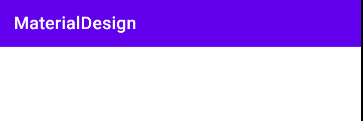

这个标题栏与我们之前使用的标题栏完全一样，但它其实已经是Toolbar而不是ActionBar了，因此它现在已经具备了实现MaterialDesign的功能

### 12.1.2	指定Toolbar标题

可以在AndroidManifest.xml中，<activity>标签下，使用`android:theme`属性指定Toolbar在该Activity下的标题内容：

```xml
<application
	...
    android:theme="@style/Theme.MaterialDesign">
    <activity android:name=".MainActivity"
        android:label="This is a title">
		...
    </activity>
</application>
```

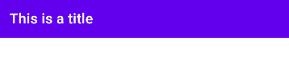

如果没有指定，则Toolbar默认使用application指定的label内容，即我们的应用名称


### 12.1.3	添加Menu菜单

我在阿里巴巴矢量图标库中找到了一些图标，作为菜单的选项图标使用：https://www.iconfont.cn/collections/detail?spm=a313x.7781069.1998910419.d9df05512&cid=30035

在res目录下创建目录menu，创建菜单资源文件toolbar.xml：

```xml
<?xml version="1.0" encoding="utf-8"?>
<menu xmlns:android="http://schemas.android.com/apk/res/android"
    xmlns:app="http://schemas.android.com/apk/res-auto">

    <item
        android:id="@+id/edit"
        android:icon="@drawable/ic_edit"
        android:title="Edit"
        app:showAsAction="always" />

    <item
        android:id="@+id/delete"
        android:icon="@drawable/ic_delete"
        android:title="Delete"
        app:showAsAction="ifRoom" />

    <item
        android:id="@+id/settings"
        android:icon="@drawable/ic_settings"
        android:title="Settings"
        app:showAsAction="never" />

</menu>
```

我们通过<item>标签来定义action按钮，android:id用于指定按钮id，android:icon用于指定按钮图标，android:title用于指定按钮文字

另外，我们还使用app:showAsAction指定按钮的显示位置，使用app名称空间是为了兼容低版本系统

showAsAction属性有几个可选值：

- always：永远显示在Toolbar中，若屏幕空间不足则不显示
- ifRoom：屏幕空间足够情况下显示在Toolbar中，不够则显示在菜单中
- never：永远显示在菜单中

注意：Toolbar中的action按钮只显示图标，而菜单中的action按钮只显示文字


之后的操作与ActionBar的配置基本相同：

```java
@Override
public boolean onCreateOptionsMenu(Menu menu) {
    getMenuInflater().inflate(R.menu.toolbar, menu);
    return super.onCreateOptionsMenu(menu);
}

@Override
public boolean onOptionsItemSelected(@NonNull MenuItem item) {
    int id = item.getItemId();
    if(id == R.id.edit){
        Toast.makeText(this, "You clicked edit button", Toast.LENGTH_SHORT).show();
    }else if(id == R.id.delete){
        Toast.makeText(this, "You clicked delete button", Toast.LENGTH_SHORT).show();
    }else if(id == R.id.settings){
        Toast.makeText(this, "You clicked settings button", Toast.LENGTH_SHORT).show();
    }
    return super.onOptionsItemSelected(item);
}
```

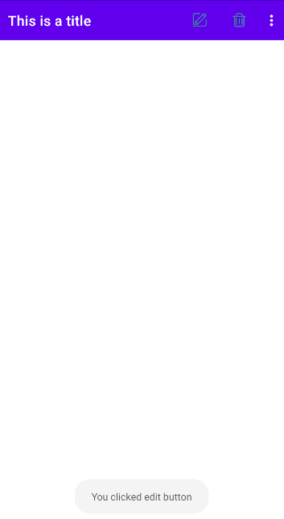


## 12.2	滑动菜单

### 12.2.1	DrawerLayout

所谓滑动菜单，就是将一些菜单选项隐藏起来，而不是放置在主屏幕上，然后可以通过滑动的方式将菜单显示出来。

这种方式既节省了空间，又实现了很好的视觉效果，是MaterialDesign的推荐做法。

Android提供了一个DrawerLayout控件，用于帮助我们来实现滑动菜单功能：

DrawerLayout是一个布局，它允许放入两个直接子控件，第一个子控件是主屏幕显示的内容，第二个子控件是滑动菜单显示的内容。

```xml
<?xml version="1.0" encoding="utf-8"?>
<androidx.drawerlayout.widget.DrawerLayout xmlns:android="http://schemas.android.com/apk/res/android"
    xmlns:app="http://schemas.android.com/apk/res-auto"
    android:id="@+id/drawerLayout"
    android:layout_width="match_parent"
    android:layout_height="match_parent">

<LinearLayout
    android:id="@+id/main_layout"
    android:layout_width="match_parent"
    android:layout_height="match_parent"
    android:orientation="horizontal">

    <androidx.appcompat.widget.Toolbar
        android:id="@+id/toolbar"
        android:layout_width="match_parent"
        android:layout_height="?attr/actionBarSize"
        android:background="?attr/colorPrimary"
        android:theme="@style/ThemeOverlay.AppCompat.Dark.ActionBar"
        app:popupTheme="@style/ThemeOverlay.AppCompat.Light"/>

</LinearLayout>

<LinearLayout
    android:id="@+id/left_layout"
    android:layout_width="wrap_content"
    android:layout_height="match_parent"
    android:orientation="horizontal"
    android:layout_gravity="start">

    <TextView
        android:text="This is a menu"
        android:layout_gravity="start"
        android:background="#FFF"
        android:layout_width="match_parent"
        android:layout_height="wrap_content"/>
    
</LinearLayout>

</androidx.drawerlayout.widget.DrawerLayout>
```

需要注意的是，DrawerLayout下的第二个直接子控件，作为滑动菜单显示内容，必须使用`android:layout_gravity`属性，指定滑动菜单所在位置，left和top为左侧，right和end为右侧

运行程序，从左向右拉出滑动菜单：

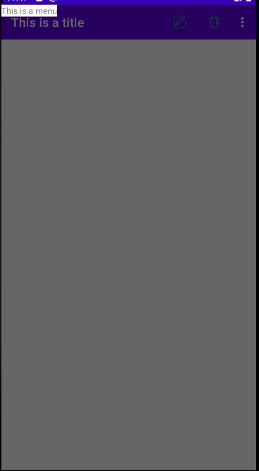

### 12.2.2	使用滑动菜单

MaterialDesign建议为Toolbar左侧添加一个导航按钮，点击按钮将弹出滑动菜单

我们同样提前准备一个导航按钮图标，修改MainActivity代码：

```java
public class MainActivity extends AppCompatActivity {

    private DrawerLayout drawerLayout;

    @Override
    protected void onCreate(Bundle savedInstanceState) {
        super.onCreate(savedInstanceState);
        setContentView(R.layout.activity_main);
        Toolbar toolbar = findViewById(R.id.toolbar);
        drawerLayout = findViewById(R.id.drawerLayout);
        setSupportActionBar(toolbar);
        ActionBar actionBar = getActionBar();//获取ActionBar（实际由Toolbar实现）
        if(actionBar!=null){
            //启用导航键，即HomeAsUp按钮，实际上它默认功能是返回到上一个Activity
            actionBar.setDisplayHomeAsUpEnabled(true);
            //将HomeAsUp按钮设置为导航键并指定图标
            actionBar.setHomeAsUpIndicator(R.drawable.ic_menu);
        }

    }

	...

    @Override
    public boolean onOptionsItemSelected(@NonNull MenuItem item) {
        int id = item.getItemId();
		...
        }else if(id == android.R.id.home){
            //导航键的id永远为android.R.id.home
            //当点击导航键时开启侧滑菜单
        	//openDrawer()方法要求传入一个Gravity参数，为了保持与XML定义一致，这里传入START参数
            drawerLayout.openDrawer(GravityCompat.START);
        }
        return super.onOptionsItemSelected(item);
    }
}
```

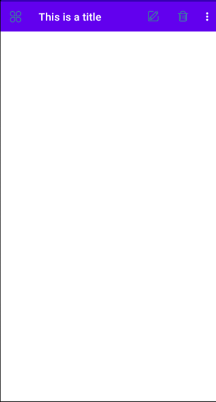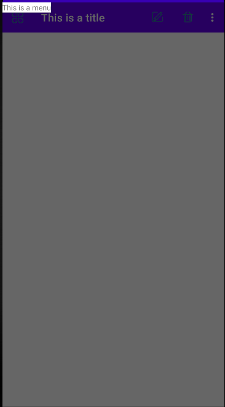


### 12.2.3	NavigationView

现在我们已经实现了滑动菜单功能，其中滑动我们已经做得很好了，但还没有实现菜单内容

实际上，我们可以在滑动菜单页面使用任何布局或控件，但Android已经为我们提供了NavigationView，它不仅严格按照MaterialDesign的要求设计，同时还能简化滑动菜单的实现。

引入依赖：

```groovy
implementation 'com.google.android.material:material:1.1.0'
implementation 'de.hdodenhof:circleimageview:2.1.0'
```

我们还引入了GitHub上的一个开源项目CircleImageView，它能轻松实现图片圆形化功能。

在使用NavigationView之前，我们还需要准备menu和headerLayout

menu用于在NavigationView中显示具体菜单项，headerLayout用来在NavigationView中显示头部布局

首先来准备menu，我们事先需要准备几个图标作为菜单项的按钮图标，在menu文件夹下创建nav_menu.xml：

```xml
<?xml version="1.0" encoding="utf-8"?>
<menu xmlns:android="http://schemas.android.com/apk/res/android">
    <group android:checkableBehavior="single">
        <item
            android:id="@+id/idea"
            android:icon="@drawable/ic_light"
            android:title="Idea"/>
        <item
            android:id="@+id/file"
            android:icon="@drawable/ic_file"
            android:title="File"/>
        <item
            android:id="@+id/exit"
            android:icon="@drawable/ic_exit"
            android:title="Exit"/>
    </group>
</menu>
```

我们首先在<menu>标签中嵌套了一个<group>标签，group表示一个组，android:checkableBehavior指定为single表示组中所有菜单项只能单选


接下来我们再来准备headerLayout，这是一个可以随意定制的布局，简单起见，我们就在这里放置用户名、头像和邮箱：

我们需要提前准备一张正方形图片作为头像，这样更方便圆形化

在layout文件夹下创建新的布局文件nav_header.xml：

```xml
<?xml version="1.0" encoding="utf-8"?>
<RelativeLayout xmlns:android="http://schemas.android.com/apk/res/android"
    android:layout_width="match_parent"
    android:layout_height="180dp"
    android:padding="10dp"
    android:background="?attr/colorPrimary">

    <de.hdodenhof.circleimageview.CircleImageView
        android:id="@+id/headImg"
        android:layout_width="70dp"
        android:layout_height="70dp"
        android:src="@drawable/img_2"
        android:layout_centerInParent="true"/>

    <TextView
        android:id="@+id/username"
        android:layout_width="wrap_content"
        android:layout_height="wrap_content"
        android:layout_alignParentBottom="true"
        android:text="Admin@test.com"
        android:textColor="#FFF"
        android:textSize="14sp"/>

    <TextView
        android:id="@+id/mail"
        android:layout_width="wrap_content"
        android:layout_height="wrap_content"
        android:layout_above="@id/username"
        android:text="Admin"
        android:textColor="#FFF"
        android:textSize="14sp"/>

</RelativeLayout>
```

最后在MainActivity中将之前的TextView替换为NavigationView：

```xml
<com.google.android.material.navigation.NavigationView
    android:id="@+id/nav_view"
    android:layout_width="match_parent"
    android:layout_height="match_parent"
    android:layout_gravity="start"
    app:menu="@menu/nav_menu"
    app:headerLayout="@layout/nav_header"/>
```

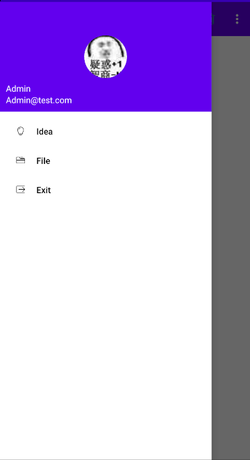

完成Navigation布局设计之后，我们还需要添加点击事件：

```java
NavigationView navView = findViewById(R.id.nav_view);
navView.setCheckedItem(R.id.idea);//设置默认选中项为Idea
//设置点击事件监听器
navView.setNavigationItemSelectedListener(new NavigationView.OnNavigationItemSelectedListener() {
    @Override
    public boolean onNavigationItemSelected(@NonNull MenuItem item) {
        drawerLayout.closeDrawers();//关闭滑动菜单
        int id = item.getItemId();
        if(id == R.id.idea){
            Toast.makeText(MainActivity.this, "You clicked Idea", Toast.LENGTH_SHORT).show();
        }else if(id == R.id.file){
            Toast.makeText(MainActivity.this, "You clicked File", Toast.LENGTH_SHORT).show();
        }else if(id == R.id.exit){
            Toast.makeText(MainActivity.this, "You clicked Exit", Toast.LENGTH_SHORT).show();
        }
        return true;
    }
});
```


## 12.3	悬浮按钮和可交互提示

立体设计是MaterialDesign中一条非常重要的设计思想，也就是说，MaterialDesign认为应用界面不仅是一个界面，更应该是有立体效果的。其中，最简单且具有代表性的立体设计就是悬浮按钮，这种按钮不属于主界面平面的一部分，而是位于另一个维度，因此就会给人一种悬浮的感觉。

### 12.3.1	FloatingActionButton

FloatingActionButton可以帮助我们轻松实现悬浮按钮的效果，它默认使用colorAccent作为按钮的颜色，我们还可以通过为按钮指定一个图标来表明按钮的作用。

首先需要提前准备好按钮对应的图标，修改MainActivity布局，将FloatingActionButton放在主界面中：

```xml
<com.google.android.material.floatingactionbutton.FloatingActionButton
    android:id="@+id/index"
    android:layout_width="wrap_content"
    android:layout_height="wrap_content"
    android:layout_gravity="bottom|end"
    android:layout_margin="16dp"
    android:src="@drawable/ic_index"/>
```

```java
FloatingActionButton floatingActionButton = findViewById(R.id.index);
floatingActionButton.setOnClickListener(new View.OnClickListener() {
    @Override
    public void onClick(View v) {
        Toast.makeText(MainActivity.this, "You clicked the index FloatingActionButton", Toast.LENGTH_SHORT).show();
    }
});
```

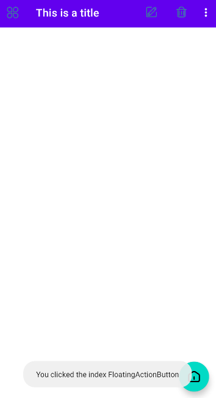

另外，我们还可以使用属性`app:elevation`指定按钮的悬浮高度


### 12.3.2	SnackBar

之前我们一直在使用Toast作为提示工具，现在我们可以使用MaterialDesign提供的新的提示工具Snackbar

Snackbar与Toast有着不同的应用场景：

- Toast的作用是告诉用户现在发生了什么事情，但用户只能被动接受，因为Toast不能与用户交互
- Snackbar允许在提示中加入一个可交互的按钮，当用户点击按钮时可以执行一些额外的逻辑操作，如我们可以在用户删除文件弹出一个有Undo按钮的Snackbar，允许用户撤销之前的操作，防止重要数据的丢失

Snackbar的用法与Toast基本相同，只是添加了一个按钮的点击事件：

```java
floatingActionButton.setOnClickListener(new View.OnClickListener() {
    @Override
    public void onClick(View v) {
        Snackbar.make(v, "Data deleted", Snackbar.LENGTH_SHORT)
                .setAction("Undo", new View.OnClickListener() {
                    @Override
                    public void onClick(View v) {
                        Toast.makeText(MainActivity.this, "The deleted data had been restored", Toast.LENGTH_SHORT).show();
                    }
                }).show();
    }
});
```

可以看到，Snackbar的使用方法与Toast很相似，首先需要调用Snackbar类的make()方法，该方法需要传入三个参数：view、content和duration，

其中view只需要传入当前界面布局的任意view即可，Snackbar会使用这个view自动查找到最外层的布局，用于展示Snackbar。

接着调用setAction()方法， 从而设置了一个用于与用户交互的按钮，最后通过show()方法展示该Snackbar：

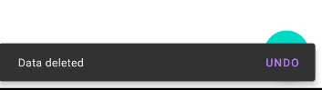

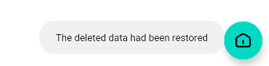

但这里出现了一个不太明显的bug：Snackbar出现时会遮挡住悬浮按钮

要解决这个问题，我们需要使用布局CoordinatorLayout


### 12.3.3	CoordinatorLayout

CoordinatorLayout实际上是一个加强版的FrameLayout，它也由MaterialDesign提供。

在普通情况下，它的作用于FrameLayout基本一致，但事实上，CoordinatorLayout可以监听其所有子控件的各种事件，然后自动为我们作出最合理的响应。

比如，如果我们能使CoordinatorLayout监听到Snackbar的弹出事件，那么它将自动将内部的FloatingActionButton向上偏移，从而保证Snackbar不会遮挡住悬浮按钮。

要使用CoordinatorLayout，只需要将刚才使用的FrameLayout直接替换为CoordinatorLayout即可：

```xml
<androidx.coordinatorlayout.widget.CoordinatorLayout
    android:id="@+id/main_layout"
    android:layout_width="match_parent"
    android:layout_height="match_parent">
	...
</androidx.coordinatorlayout.widget.CoordinatorLayout>
```

运行程序，现在Snackbar弹出也不会遮挡住悬浮按钮了：

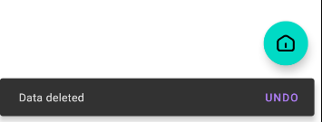


## 12.4	卡片式布局

现在主界面上仍是空白状态，我们可以使用一组图片来填充这部分区域。

要使这些图片能Material化，我们要使用卡片式布局


### 12.4.1	CardView

CardView是实现卡片式布局的重要组件，其实质也是一个FrameLayout，只是额外提供了圆角和阴影效果，看上去有立体效果。

CardView的使用方法也比较简单：

```xml
<androidx.cardview.widget.CardView
    android:layout_width="match_parent"
    android:layout_height="wrap_content"
    app:cardCornerRadius="4dp"
    app:elevation="5dp">

    <TextView
        android:id="@+id/info_text"
        android:layout_width="match_parent"
        android:layout_height="wrap_content"/>

</androidx.cardview.widget.CardView>
```

我们通过属性app:cardCornerRadius指定了卡片的圆角弧度，数值越大弧度越大。

另外我们还使用了app:elevation属性指定卡片的悬浮高度，高度越大投影范围越大，这里的使用方法与FloatingActionButton相同。


另外我们需要引入Glide库：

```groovy
implementation 'com.github.bumptech.glide:glide:3.7.0'
```

Glide是一个强大的图片加载库，它不仅可以加载本地图片，还可以加载网络图片、GIF图片甚至本地视频，同时它的使用极其简单，只需一行代码就能实现复杂的图片加载功能。

在CoordinatorLayout中添加一个RecyclerView：

```xml
<androidx.coordinatorlayout.widget.CoordinatorLayout
    android:id="@+id/main_layout"
    android:layout_width="match_parent"
    android:layout_height="match_parent">

    <androidx.appcompat.widget.Toolbar
        android:id="@+id/toolbar"
        android:layout_width="match_parent"
        android:layout_height="?attr/actionBarSize"
        android:background="?attr/colorPrimary"
        android:theme="@style/ThemeOverlay.AppCompat.Dark.ActionBar"
        app:popupTheme="@style/ThemeOverlay.AppCompat.Light"/>

    <androidx.recyclerview.widget.RecyclerView
        android:id="@+id/recycler_view"
        android:layout_width="match_parent"
        android:layout_height="match_parent"/>

    <com.google.android.material.floatingactionbutton.FloatingActionButton
        android:id="@+id/index"
        android:layout_width="wrap_content"
        android:layout_height="wrap_content"
        android:layout_gravity="bottom|end"
        android:layout_margin="16dp"
        app:elevation="8dp"
        android:src="@drawable/ic_index"/>

</androidx.coordinatorlayout.widget.CoordinatorLayout>
```


添加一个实体类Fruit：

```java
public class Fruit {
    private String name;
    private int imgId;

    public Fruit(String name, int imgId) {
        this.name = name;
        this.imgId = imgId;
    }
}
```


然后为RecyclerView子项指定我们的自定义布局，在layout布局下新建布局文件fruit_item.xml：

```xml
<?xml version="1.0" encoding="utf-8"?>
<androidx.cardview.widget.CardView xmlns:android="http://schemas.android.com/apk/res/android"
    android:layout_width="match_parent"
    android:layout_height="wrap_content"
    xmlns:app="http://schemas.android.com/apk/res-auto"
    android:layout_margin="5dp"
    app:cardCornerRadius="4dp">

    <LinearLayout
        android:orientation="vertical"
        android:layout_width="match_parent"
        android:layout_height="wrap_content">

        <ImageView
            android:id="@+id/img_fruit"
            android:layout_width="match_parent"
            android:layout_height="100dp"
            android:scaleType="centerCrop"/>

        <TextView
            android:id="@+id/fruit_name"
            android:layout_width="wrap_content"
            android:layout_height="wrap_content"
            android:layout_gravity="center_horizontal"
            android:layout_margin="5dp"/>

    </LinearLayout>

</androidx.cardview.widget.CardView>
```

这里使用了CardView作为子项的最外层布局，这样RecyclerView中的每个元素都在卡片之中，同时由于CardView是一个FrameLayout，因此它没有什么方便的定位格式，因此我们又嵌套了一个LinearLayout布局，在其中放置具体内容。

在ImageView中我们使用了属性`android:scaleType`，它能指定图片的缩放模式。由于素材图片的长宽比例可能不一致，因此为了能让所有图片都能填充满ImageView，我们需要缩放图片，这里使用了centerCrop模式，它能让图片保持原有比例填充满ImageView，并将超出部分裁减掉。

我们还要为RecyclerView准备一个Adapter，新建一个适配器FruitAdapter类，继承RecyclerView.Adapter，将泛型指定为FruitAdapter.ViewHolder：

```java
public class FruitAdapter extends RecyclerView.Adapter<FruitAdapter.ViewHolder> {

    private Context context;

    private List<Fruit> fruitList;

    public FruitAdapter(List<Fruit> fruitList) {
        this.fruitList = fruitList;
    }

    @NonNull
    @Override
    //初始化ViewHolder
    public ViewHolder onCreateViewHolder(@NonNull ViewGroup parent, int viewType) {
        if(context==null){//获取上下文
            context = parent.getContext();
        }
        //将渲染完成的子项封装到View对象中，传递给ViewHolder的构造函数
        View view = LayoutInflater.from(context).inflate(R.layout.fruit_item, parent ,false);
        return new ViewHolder(view);
    }

    @Override
    //绑定数据到ViewHolder
    public void onBindViewHolder(@NonNull ViewHolder holder, int position) {
        Fruit fruit = fruitList.get(position);
        holder.textView.setText(fruit.getName());
        Glide.with(context).load(fruit.getImgId()).into(holder.imageView);
        //首先调用Glide.with()方法，传入Context、Activity或Fragment
        //再调用load()方法加载图片，可以是URL、本地路径或资源ID
        //最后调用into()方法，指定设置到具体的哪个ImageView
    }

    @Override
    public int getItemCount() {
        return fruitList.size();
    }

    static class ViewHolder extends RecyclerView.ViewHolder{

        CardView cardView;
        ImageView imageView;
        TextView textView;

        public ViewHolder(@NonNull View view) {
            super(view);
            cardView = (CardView)view;
            imageView = view.findViewById(R.id.img_fruit);
            textView = view.findViewById(R.id.fruit_name);
        }
    }
}
```

我们之所以要使用Glide库而不是直接将图片设置到ImageView中，是因为Glide库在将图片设置到ImageView之前，还进行了诸如图片压缩等一些复杂的图片逻辑操作，有助于改善应用程序的性能，同时能避免造成内存溢出的问题。


最后修改MainActivity代码：

```java
public class MainActivity extends AppCompatActivity {

    private DrawerLayout drawerLayout;

    private Fruit[] fruits = {
            new Fruit("Orange", R.drawable.orange), new Fruit("Apple", R.drawable.apple),
            new Fruit("Cherry", R.drawable.cherry), new Fruit("Pear", R.drawable.pear),
            new Fruit("Banana", R.drawable.banana), new Fruit("Kiwifruit", R.drawable.kiwifruit),
            new Fruit("Pineapple", R.drawable.pineapple), new Fruit("Strawberry", R.drawable.strawberry)};

    private List<Fruit> fruitList = new ArrayList<>();

    private FruitAdapter adapter;

    @Override
    protected void onCreate(Bundle savedInstanceState) {
        super.onCreate(savedInstanceState);
        setContentView(R.layout.activity_main);
		...
        initFruits();//初始化水果列表
        RecyclerView recyclerView = findViewById(R.id.recycler_view);
        //创建一个两列的GridLayout
        GridLayoutManager layoutManager = new GridLayoutManager(this, 2);
        recyclerView.setLayoutManager(layoutManager);
        adapter = new FruitAdapter(fruitList);
        recyclerView.setAdapter(adapter);//设置适配器
    }

    private void initFruits() {
        fruitList.clear();
        //随机将fruits数组中的Fruit对象添加到fruitList数组中
        for(int i=0; i<50; i++){
            Random random = new Random();
            int index = random.nextInt(fruits.length);
            fruitList.add(fruits[index]);
        }
    }
	...
}
```

运行程序：

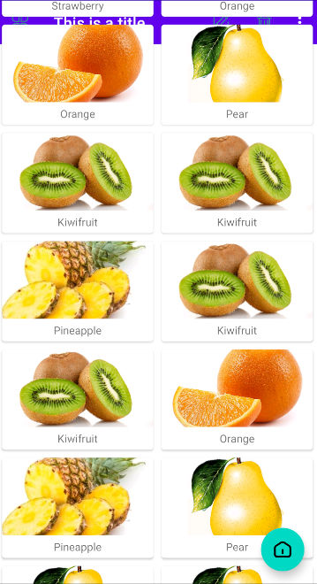

现在又出现了一个问题：我们的Toolbar被RecyclerView挡住了，要解决这个问题，我们还要借助另一个工具：AppBarLayout


### 12.4.2	AppBarLayout

为什么RecyclerView会将Toolbar遮挡住？

由于CoordinatorLayout本质上是一个FrameLayout，当控件没有明确定位的时候，都默认摆放在布局的左上角，因此会产生遮挡的现象。

传统情况下，要解决遮挡问题，使用偏移量是唯一解决方法，即让RecyclerView向下偏移一个Toolbar的高度，从而保证不会遮挡到Toolbar。

但这里我们可以使用MaterialDesign提供的另一个工具：AppBarLayout，它实际上是一个垂直方向的LinearLayout，其内部有很多滚动事件的封装，并应用了一些MaterialDesign的设计理念。

要解决覆盖问题，只需要两步：

- 首先将Toolbar嵌套到AppBarLayout中
- 为RecyclerView指定一个布局行为

修改activity_main.xml的代码：

```xml
<androidx.coordinatorlayout.widget.CoordinatorLayout
    android:id="@+id/main_layout"
    android:layout_width="match_parent"
    android:layout_height="match_parent">

    <com.google.android.material.appbar.AppBarLayout
        android:layout_width="match_parent"
        android:layout_height="wrap_content">

        <androidx.appcompat.widget.Toolbar
            .../>

    </com.google.android.material.appbar.AppBarLayout>

    <androidx.recyclerview.widget.RecyclerView
		...
        app:layout_behavior="com.google.android.material.appbar.AppBarLayout$ScrollingViewBehavior"/>

		...

</androidx.coordinatorlayout.widget.CoordinatorLayout>
```

可以看到，我们并没有对布局进行很大的改动，只是先定义了一个AppBarLayout，将Toolbar放置在AppBarLayout中，接着在RecyclerView中使用`app:layout_behavior`属性指定了一个布局行为

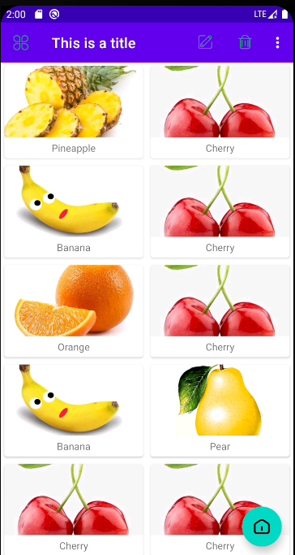

现在我们已经成功使用AppBarLayout解决了RecyclerView遮挡Toolbar的问题，但是AppBarLayout现在还没有体现出MaterialDesign的设计理念，事实上，当RecyclerView滚动时，滚动事件已经被通知给了AppBarLayout，只是我们没有进行处理而已。

接下来我们将对AppBarLayout进一步优化，看看它能实现什么样的MaterialDesign效果。

当AppBarLayout接收到滚动事件时，它内部的子控件其实可以指定如何影响这些事件，我们通过`app:layout_scrollFlags`属性就能实现了。

修改activity_main.xml代码：

```xml
<androidx.appcompat.widget.Toolbar
	...
    app:layout_scrollFlags="scroll|enterAlways|snap"/>
```

我们将Toolbar的`app:layout_scrollFlags`属性指定为了scroll|enterAlways|snap，

其中scroll表示当RecyclerView向上滚动时，Toolbar会一起向上滚动并隐藏；

entrerAlways表示当RecyclerView向下滚动时，Toolbar会向下滚动并重新显示；

snap表示当Toolbar还没有完全隐藏或显示时，根据当前滚动距离，自动显示隐藏还是显示。


可以看到，随着我们向上滚动RecyclerView，Toolbar会自动隐藏；而向下滚动RecyclerView，Toolbar又会重新出现，这其实也是MaterialDesign的一项重要设计思想，通过Toolbar的隐藏与显示，既保证了用户的最佳阅读效果，又不影响任何功能上操作。

当然，这样的功能我们只能通过Toolbar来实现，ActionBar对此就没有办法了。


## 12.5	下拉刷新

市面上现有的下拉刷新功能风格各不相同，并且与MaterialDesign还有些格格不入。谷歌为了让Android的下拉刷新风格有一个统一标准，在MaterialDesign中制定了一个官方的设计规范。

SwipeRefreshLayout是实现下拉刷新功能的核心类，我们将想要实现下拉刷新功能的控件放置在这个布局中，就能迅速让这个控件支持下拉刷新，在我们的项目中，应该支持下拉刷新的功能自然是RecyclerView。

引入依赖:

```groovy
implementation "androidx.swiperefreshlayout:swiperefreshlayout:1.0.0"
```

修改activity_main.xml：

```xml
<androidx.swiperefreshlayout.widget.SwipeRefreshLayout
        android:id="@+id/swipe_refresh"
        android:layout_width="match_parent"
        android:layout_height="match_parent"
        app:layout_behavior="com.google.android.material.appbar.AppBarLayout$ScrollingViewBehavior">

    <androidx.recyclerview.widget.RecyclerView
        android:id="@+id/recycler_view"
        android:layout_width="match_parent"
        android:layout_height="match_parent"/>

</androidx.swiperefreshlayout.widget.SwipeRefreshLayout>
```

需要注意的一点是，我们将RecyclerView嵌套在SwipeRefreshLayout中之后，SwipeRefreshLayout现在是CoordinatorLayout的直接子控件，因此之前在RecyclerView声明的behavior现在应当转移到SwipeRefreshLayout中。


接下来需要在MainActivity中处理具体的刷新逻辑：

```java
SwipeRefreshLayout refresher = findViewById(R.id.swipe_refresh);
refresher.setColorSchemeColors(R.color.design_default_color_primary);//改变下拉刷新时的颜色
refresher.setColorSchemeResources(R.color.design_default_color_primary);//设置下拉进度的背景颜色
refresher.setOnRefreshListener(new SwipeRefreshLayout.OnRefreshListener() {//设置刷新事件监听器
    @Override
    public void onRefresh() {
        new Thread(new Runnable() {
            @Override
            public void run() {
                try {
                    Thread.sleep(1500);
                } catch (InterruptedException e) {
                    e.printStackTrace();
                }
                runOnUiThread(new Runnable() {
                    @Override
                    public void run() {
                        initFruits();//重新加载RecyclerView的菜单内容
                        adapter.notifyDataSetChanged();//刷新菜单
                        refresher.setRefreshing(false);//设置刷新状态，false表示刷新事件结束
                    }
                });
            }
        }).start();
    }
});
```


## 12.6	可折叠式标题栏

虽然我们现在的标题栏是使用Toolbar来编写的，但它看上去和传统的ActionBar长得一样，只是可以响应RecyclerView的滚动时间，但实际上MaterialDesign没有规定标题栏必须长这样。因此，我们可以根据自己的喜好随意定制标题栏，现在我们就来实现一个可折叠式标题栏。


### 12.6.1	CollapsingToolbarLayout

CollapsingToolbarLayout是一个作用于Toolbar基础之上的布局，它能让Toolbar的效果变得更丰富，不仅是展示一个标题栏，还能实现华丽的效果。

CollapsingToolbarLayout是不能独立存在的，它在设计时就被限定只能作为AppBarLayout的直接子布局来使用。而AppBarLayout又必须是CoordinatorLayout的子布局。

我们需要创建一个新的ActionBar来作为水果的详情展示界面，命名为FruitActivity，布局名指定为activity_fruit.xml，现在先编写布局：

布局主要分为两部分，一个是水果标题栏，一个是水果内容详情。

```xml
<?xml version="1.0" encoding="utf-8"?>
<androidx.coordinatorlayout.widget.CoordinatorLayout android:layout_width="match_parent"
    android:layout_height="match_parent"
    xmlns:android="http://schemas.android.com/apk/res/android"
    xmlns:app="http://schemas.android.com/apk/res-auto">

    <!--标题栏界面-->
    <com.google.android.material.appbar.AppBarLayout
        android:id="@+id/app_bar"
        android:layout_width="match_parent"
        android:layout_height="250dp">

        <!--因为我们要实现更高级的Toolbar效果，因此需要将Theme指定到上一层-->
        <!--app:contentScrim属性用于指定CollapsingToolbar在趋于折叠和折叠之后的背景色-->
        <!--CollapsingToolbar折叠之后就是一个普通的Toolbar，背景色为colorPrimary-->
        <!--app:layout_scrollFlags指定滚动时行为，scroll表示CollapsingToolbar随内容滚动而滚动-->
        <!--exitUntilCollapsed表示CollapsingToolbar随滚动完成折叠之后保留在界面中，不再移出屏幕-->
        <com.google.android.material.appbar.CollapsingToolbarLayout
            android:id="@+id/collapse_toolbar"
            android:layout_width="match_parent"
            android:layout_height="match_parent"
            android:theme="@style/ThemeOverlay.AppCompat.Dark.ActionBar"
            app:contentScrim="?attr/colorPrimary"
            app:layout_scrollFlags="scroll|exitUntilCollapsed">

            <!--app:layout_collapseMode指定CollapsingToolbar折叠过程中的折叠模式
            pin表示折叠时位置不变，parallax表示折叠过程中会产生一定的错位偏移-->
            <ImageView
                android:id="@+id/img_fruit"
                android:layout_width="match_parent"
                android:layout_height="match_parent"
                android:scaleType="centerCrop"
                app:layout_collapseMode="parallax"/>

            <androidx.appcompat.widget.Toolbar
                android:id="@+id/tool_bar"
                android:layout_width="match_parent"
                android:layout_height="?attr/actionBarSize"
                app:layout_collapseMode="pin"/>

        </com.google.android.material.appbar.CollapsingToolbarLayout>

    </com.google.android.material.appbar.AppBarLayout>

    <!--内容详情界面-->
    <!--NestedScrollView基于ScrollView的基础，
    增加了嵌套响应滚动事件的功能，允许使用滚动方式查看屏幕外的数据-->
    <androidx.core.widget.NestedScrollView
        android:layout_width="match_parent"
        android:layout_height="match_parent"
        app:layout_behavior="com.google.android.material.appbar.AppBarLayout$ScrollingViewBehavior">

        <!--NestedScrollView内部同样只能有一个直接子控件，因此将控件嵌套在LinearLayout中-->
        <LinearLayout
            android:orientation="vertical"
            android:layout_width="match_parent"
            android:layout_height="wrap_content">

            <androidx.cardview.widget.CardView
                android:layout_width="match_parent"
                android:layout_height="wrap_content"
                android:layout_marginBottom="15dp"
                android:layout_marginTop="35dp"
                android:layout_marginRight="15dp"
                android:layout_marginLeft="15dp"
                app:cardCornerRadius="4dp">

                <TextView
                    android:id="@+id/content_fruit"
                    android:layout_width="wrap_content"
                    android:layout_height="wrap_content"/>

            </androidx.cardview.widget.CardView>

        </LinearLayout>

    </androidx.core.widget.NestedScrollView>

    <!--app:layout_anchor设置锚点，这样悬浮按钮将出现在标题栏区域内-->
    <!--app:layout_anchorGravity将悬浮按钮定位在标题栏区域右下角-->
    <com.google.android.material.floatingactionbutton.FloatingActionButton
        android:layout_margin="16dp"
        android:layout_width="wrap_content"
        android:layout_height="wrap_content"
        android:src="@drawable/ic_comment"
        app:layout_anchor="@id/app_bar"
        app:layout_anchorGravity="bottom|end"/>

</androidx.coordinatorlayout.widget.CoordinatorLayout>
```

接下来再编写FruitActivity中的代码：

```java
public class FruitActivity extends AppCompatActivity {

    public static final String FRUIT_NAME = "fruit_name";

    public static final String FRUIT_IMG_ID = "fruit_img_id";

    @Override
    protected void onCreate(Bundle savedInstanceState) {
        super.onCreate(savedInstanceState);
        setContentView(R.layout.activity_fruit);
        //通过Intent获取水果名和图片资源ID
        Intent intent = getIntent();
        String fruitName = intent.getStringExtra(FRUIT_NAME);
        int fruitImgId = intent.getIntExtra(FRUIT_IMG_ID, 0);
        Toolbar toolbar = findViewById(R.id.tool_bar);
        CollapsingToolbarLayout collapsingToolbar = findViewById(R.id.collapse_toolbar);
        ImageView fruitImg = findViewById(R.id.img_fruit);
        TextView fruitContent = findViewById(R.id.content_fruit);
        //将Toolbar作为ActionBar使用
        setSupportActionBar(toolbar);
        ActionBar actionBar = getSupportActionBar();
        if(actionBar!=null){
            //启用HomeAsUp按钮
            actionBar.setDisplayHomeAsUpEnabled(true);
        }
        collapsingToolbar.setTitle(fruitName);
        Glide.with(this).load(fruitImgId).into(fruitImg);
        //拼接文本内容
        String fruitContentText = generateFruitContent(fruitName);
        fruitContent.setText(fruitContentText);
    }

    private String generateFruitContent(String fruitName) {
        StringBuilder builder = new StringBuilder();
        for(int i=0; i<500; i++){
            builder.append(fruitName);
        }
        return builder.toString();
    }

    @Override
    public boolean onOptionsItemSelected(@NonNull MenuItem item) {
        int id = item.getItemId();
        if(id == android.R.id.home){
            finish();
            return true;
        }
        return super.onOptionsItemSelected(item);
    }
}
```

除此之外，我们还要处理RecyclerView中的点击事件：

修改FruitAdapter代码：

```java
@NonNull
@Override
//初始化ViewHolder
public ViewHolder onCreateViewHolder(@NonNull ViewGroup parent, int viewType) {
    if(context==null){//获取上下文
        context = parent.getContext();
    }
    //将渲染完成的子项封装到View对象中，传递给ViewHolder的构造函数
    View view = LayoutInflater.from(context).inflate(R.layout.fruit_item, parent ,false);
    final ViewHolder holder = new ViewHolder(view);
    holder.cardView.setOnClickListener(new View.OnClickListener() {
        @Override
        public void onClick(View v) {
            Fruit fruit = fruitList.get(holder.getAdapterPosition());
            Intent intent = new Intent(context, FruitActivity.class);
            intent.putExtra(FruitActivity.FRUIT_NAME, fruit.getName());
            intent.putExtra(FruitActivity.FRUIT_IMG_ID, fruit.getImgId());
            context.startActivity(intent);
        }
    });
    return holder;
}
```

运行程序，随意点击一个水果，就能显示我们编写的FruitActivity效果了：

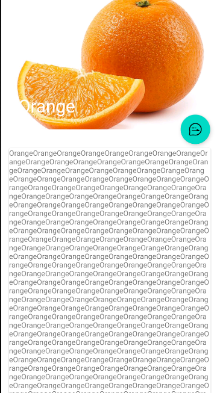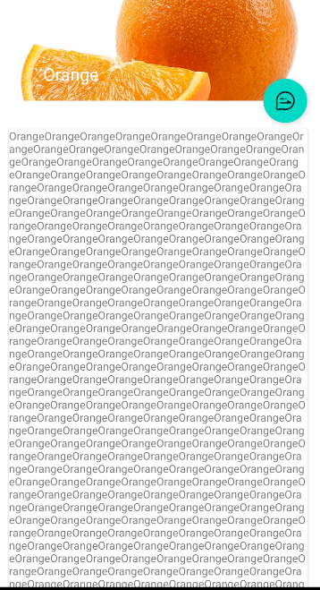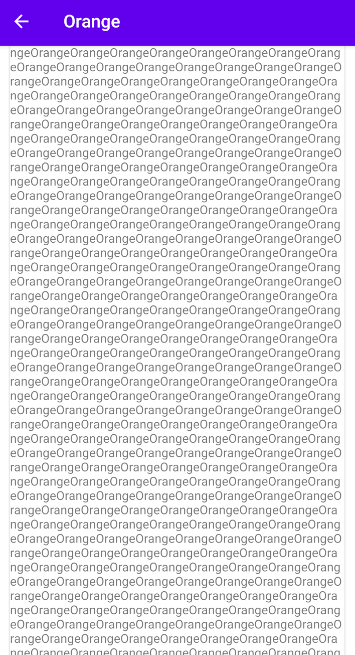


### 12.6.2	充分利用系统状态栏控件

现在水果背景图片和系统状态栏还有一些视觉上的冲突，现在我们要做的就是将背景图和状态栏融合。

要让背景图和系统状态栏融合，我们需要借助属性`android:fitsSystemWindows`来实现。

在CoordinatorLayout、AppBarLayout和CollapsingToolbarLayout这种嵌套结构的布局中，将控件的`android:fitsSystemWindows`属性指定为true，就表示该控件会出现在系统状态栏中。

对应到我们的程序，那就是水果标题栏的ImageView应当设置这个属性，不过只给ImageView设置这个属性还不够，我们还需要将ImageView布局结构的所有父布局都设置上这个属性才可以。

修改activity_fruit.xml：

```xml
<androidx.coordinatorlayout.widget.CoordinatorLayout
	...
    android:fitsSystemWindows="true">

    <!--标题栏界面-->
    <com.google.android.material.appbar.AppBarLayout
		...
        android:fitsSystemWindows="true">

        <com.google.android.material.appbar.CollapsingToolbarLayout
			...
            android:fitsSystemWindows="true">

            <ImageView
				...
                android:fitsSystemWindows="true"/>
            ...
        <com.google.android.material.appbar.CollapsingToolbarLayout/>
        ...
    <com.google.android.material.appbar.AppBarLayout/>
    ...
<androidx.coordinatorlayout.widget.CoordinatorLayout/>
```

但是这样还不够，我们还要在程序的主题中将状态栏颜色指定为透明才可以，只需要在主题中将`android:statusBarColor`属性的值指定为@android:color/transparent即可：

```xml
<item name="android:statusBarColor">@android:color/transparent</item>
```

不过要注意的是，这种方法只适合Android5.0，即API21以上的系统。

运行程序，现在我们的FruitActivity有了更好的使用体验：

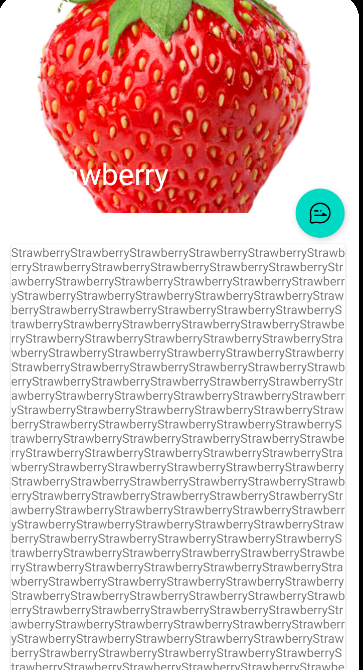