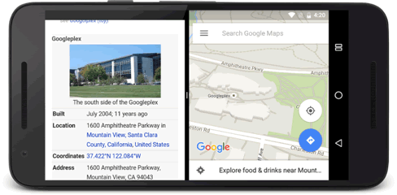
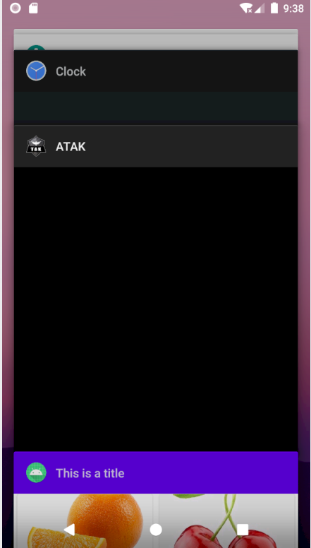
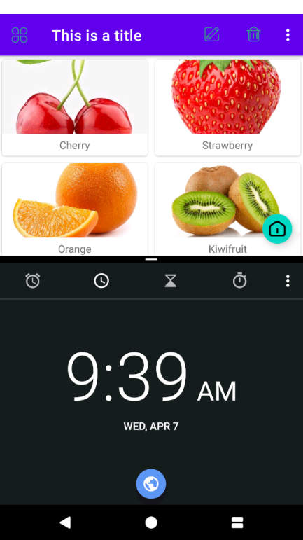
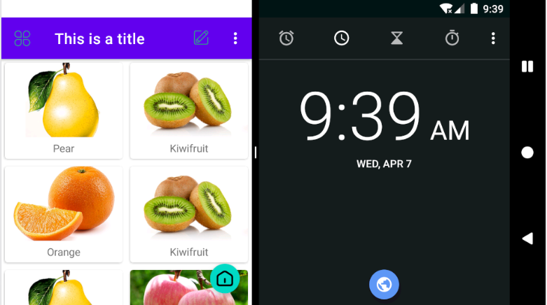

# 13.	Android进阶技巧

## 13.1	全局获取Context

在Android开发时，很多地方都需要使用Context。目前我们还没有为Context获取而烦恼，因为我们现在的操作大多都是在Activity中进行，而Activity本身就是一个Context对象，但是当应用架构逐渐复杂时，很多逻辑代码都将脱离Activity类，这时候我们又要如何获取到Activity呢？

以我们在学习Android网络编程时编写的工具类HttpUtil为例，当我们想使用Toast提示时，就需要传入一个Context，但在HttpUtil类中显然获取不到Context对象，这要怎么办呢？

有一个简单的办法，就是在调用Toast的方法中添加一个Context参数，让上层方法传递一个Context对象即可，这的确是一种解决方案，但有些推卸责任，因为我们将获取Context的任务转移给了这个方法的调用者，而不关心调用者又是否能获取到Context对象。

因此，获取Context并非是容易的事情，但Android提供了一个Application类，每当程序启动时，系统将会自动初始化这个类。我们可以定制一个自己的Application类，以便于管理程序内一些全局的状态信息，比如全局Context。

要定制一个Application类并不复杂，首先需要创建一个MyApplication类，继承Application：

```java
public class MyApplication extends Application {

    private static Context context;

    @Override
    public void onCreate() {
        super.onCreate();
        context = getApplicationContext();
    }

    public static Context getContext(){
        return context;
    }
}
```

要使用这个Application类，还需要在AndroidManifest.xml中进行声明：

```xml
<application
    android:name="com.example.materialdesign.MyApplication"
```

注意这里要使用全类名，否则将找不到这个Application

现在我们已经实现了全局获取Context，只需要调用MyApplication.getContext就可以获取了。


在Android数据库操作部分，我们使用了LitePal这个框架来操作数据库，但要配置LitePal，必须将在AndroidManifest.xml中指定<application>标签中的`android:name`属性为org.litepal.LitePalApplication，其实这个道理也是一样的，这样配置之后，LitePal就能在内部自动获取到Context了。

但如果我们已经配置过了自己的Application该怎么办？任何一个项目都只能配置一个Application，为了解决这个问题，我们可以在自己的Application中调用LitePal的初始化方法：

```java
@Override
public void onCreate() {
    super.onCreate();
    context = getApplicationContext();
    LitePalApplication.initialize(context);
}
```

使用这种写法，相当于我们将全局的Context对象通过参数传递给了LitePal，效果与在AndroidManifest.xml中配置LitePalApplication相同。


## 13.2	使用Intent传递对象

Intent对象使用putExtra()方法能传递的数据类型优先，当我们想传递自定义对象时就无能为力了。

使用Intent传递对象通常有两种方式，Serializable方式和Parcelable方式

### 13.2.1	Serializable方式

Serializable方式，即序列化，表示将一个对象转换为可存储或可传输的状态。序列化后的对象可以在网络上进行传输，也可以存储到本地。要序列化，只需要使类继承Serializable接口即可：

```java
public class Fruit implements Serializable {
    private String name;
    private int imgId;

    public Fruit(String name, int imgId) {
        this.name = name;
        this.imgId = imgId;
    }
}
```

接下来我们就可以直接使用Intent对象的putExtra()方法传递对象了

要获取对象，需要使用方法getSerializableExtra()方法，传入对应的key值


### 13.2.2	Parcelable

Parcelable方式同样可以使对象在Intent中传递，不过不同于序列化对象，Parcelable方式的实现原理是将完整对象分解，分解后的每一部分都是Intent支持的数据类型，这样也能实现传递对象的功能。

要实现Parcelable方式，就要继承Parcelable接口，并实现方法：

```java
public class Fruit implements Parcelable {
    private String name;
    private int imgId;

    @Override
    public int describeContents() {
        return 0;
    }

    @Override
    public void writeToParcel(Parcel dest, int flags) {
        dest.writeString(name);//写出数据
        dest.writeInt(imgId);
    }

    //必须提供一个Creator的实现，并将泛型指定为本类
    public static final Creator<Fruit> CREATOR = new Creator<Fruit>() {
        @Override
        public Fruit createFromParcel(Parcel in) {
            //使用下面的构造函数构造对象
            return new Fruit(in);
        }

        @Override
        public Fruit[] newArray(int size) {
            return new Fruit[size];
        }
    };

    protected Fruit(Parcel in) {
        name = in.readString();//读入数据
        imgId = in.readInt();
    }
    
    ...
}
//需要注意的是，我们通过writeToParcel()方法将数据写出到Parcel，通过createFromParcel()方法将数据从Parcel写入类对象
//其中使用writexxx()方法写出数据，readxxx()方法读入数据，对类内所有成员变量都要写出或读入
//同时读入的顺序必须与写出的顺序完全相同
```

要注意的是，**继承Parcelable接口的类在写出和读入数据的顺序必须完全相同**


接下来，我们同样可以使用putExtra()方法将对象存放到Intent，而取出对象则要使用方法getParcelableExtra()方法


对比而言，Serializable方式较为简单，但会将整个对象进行序列化，因此效率比Parcelable方式低一些，另外序列化可能会破坏单例类的单例效果，因此一般推荐使用Parcelable方式实现Intent传递对象。


## 13.3	自定义日志类

Android自带的日志工具功能强大，但也不是毫无缺点。比如在打印日志的控制方面就做的不够好。

在项目开发结束后，之前用于调试的日志在项目上线后仍旧会照常打印，这样不仅降低了程序的运行效率，同时还可能会泄露机密数据。

最理想的情况是能自由控制日志打印，当程序处于开发阶段时打印日志，程序上线后就将日志屏蔽。

我们只需要定制一个自己的日志工具类就能实现这个功能，新建LogUtil类：

```java
public class LogUtil {

    public static final int VERBOSE = 1;
    public static final int DEBUG = 2;
    public static final int INFO = 3;
    public static final int WARN = 4;
    public static final int ERROR = 5;
    public static final int NOTHING = 6;

    public static int level = VERBOSE;

    public static void v(String tag, String msg){
        if(level<=VERBOSE){
            Log.v(tag, msg);
        }
    }

    public static void d(String tag, String msg){
        if(level<=DEBUG){
            Log.v(tag, msg);
        }
    }

    public static void i(String tag, String msg){
        if(level<=INFO){
            Log.v(tag, msg);
        }
    }

    public static void w(String tag, String msg){
        if(level<=WARN){
            Log.v(tag, msg);
        }
    }

    public static void e(String tag, String msg){
        if(level<=ERROR){
            Log.v(tag, msg);
        }
    }

}
```

我们在LogUtil中定义了VERBOSE、DEBUG、INFO、WARN、ERROR和NOTHING这6个常量，且它们对应的值是递增的，然后定义了一个静态变量level，它用于控制输出的日志等级

接下来我们提供了v()、d()、i()、w()、e()这5个自定义的日志方法，分别调用了Log类的对应日志输出，通过if判断要输出的是否超过了限制的输出等级

这样，我们在开发阶段将level指定为VERBOSE，在项目上线时将level指定为NOTHING就可以了。


## 13.4	创建定时任务

Android定时任务有两种实现方式，一种是使用Java API提供的Timer类，另一种就是使用Android提供的Alarm机制。

这两种方式大多数情况下都能实现类似的效果，但TImer有一个明显短板，它不适用于那些需要长期在后台运行的定时任务，因为Android在长时间不操作的情况下会休眠CPU，这可能会导致Timer中的定时任务无法正常运行。

而Alarm具有唤醒CPU的功能，它能保证在大多数情况下需要执行定时任务的时候CPU都能正常工作。

需要注意，唤醒CPU和唤醒屏幕不是一个概念。


### 13.4.1	Alarm机制

Alarmhi是借助了AlarmManager类实现的。这个类和NotificationManager有点类似，都是通过调用Context类的getSystemService()方法获取实例，这里需要传入的参数是Context.ALARM_SERVICE

```java
AlarmManager alarmManager = (AlarmManager) getSystemService(Context.ALARM_SERVICE);
long triggerTime = SystemClock.elapsedRealtime() + 10*1000;//触发时间设定为10秒
//SystemClock.elapsedRealtime()获取系统开机至今经历的毫秒数
//System.currentTimeMillis()获取1970/1/1的0点至今经历的毫秒数
alarmManager.set(AlarmManager.ELAPSED_REALTIME_WAKEUP, triggerTime, p);
//set方法接收三个参数，第一个参数是整型参数，用于指定AlarmManager的工作类型
    // 可选量为ELAPSED_REALTIME、ELAPSED_REALTIME_WAKEUP、RTC和RTC_WAKEUP
    //其中ELAPSED_REALTIME表示定时任务的触发时间从系统开机开始算起，但不唤醒CPU
    //ELAPSED_REALTIME_WAKEUP同理，会唤醒CPU
    //RTC表示定时任务的触发时间从1970/1/1的0点算起，但不唤醒CPU
    //RTC_WAKEUP同理，会唤醒CPU
//第二个参数为定时任务的触发时间，单位是毫秒
//第三个参数是PendingIntent，这里一般调用getService()或getBroadcast()方法获取一个能执行Service或Broadcast的PendingIntent
    //这样当定时任务被触发，Service的onStartCommand()方法或Broadcast的onReceive()方法就能得到执行
```

假设们要实现一个长时间在后台定时运行的Service，首先新建Service命名为LongRunningService，将触发定时任务的代码写到onStartCommand()方法中：

```java
public class LongRunningService extends Service {
    public LongRunningService() {
    }

    @Override
    public IBinder onBind(Intent intent) {
        return null;
    }

    @Override
    public int onStartCommand(Intent intent, int flags, int startId) {
        new Thread(new Runnable() {
            @Override
            public void run() {
                //在这里进行具体逻辑操作
            }
        }).start();
        AlarmManager alarmManager = (AlarmManager)getSystemService(Context.ALARM_SERVICE);
        int anHour = 60*60*1000;//预先写定1小时包含的毫秒数
        long triggerTime = SystemClock.elapsedRealtime() + anHour;
        Intent i = new Intent(this, LongRunningService.class);
        PendingIntent pi = PendingIntent.getService(this, 0, i ,0);
        alarmManager.set(AlarmManager.ELAPSED_REALTIME_WAKEUP, triggerTime, pi);
        return super.onStartCommand(intent, flags, startId);
    }
}
```

我们在onStartCommand()方法中开启了一个子线程，用于执行定时任务的具体操作，防止因为占用主线程而对定时任务的准确性造成影响。

接着使用Alarm机制，获取AlarmManager实例，定义任务触发时间，PendingIntent指定处理定时任务的Service为LongRunningService，最后调用set()方法完成设置。

这样我们就实现了一个长时间在后台定时运行的Service，一旦启动LongRunningService，就会在onStartCommand()方法中设定一个定时任务，这样一小时后将会再次启动LongRunningService，形成循环，保证LongRunningService每隔一小时就执行一次。

最后在想要启动定时服务的地方调用代码即可：

```java
Intent intent = new Intent(context, LongRunningService.class);
context.startService(intent);
```

需要注意的是，从Android4.4系统开始，Alarm任务触发时间将变得不准确，可能会延迟一段时间后任务才能得到执行。这是由于系统在耗电性方面进行的优化，系统会检测目前有多少Alarm人物存在，然后将触发事件相近的几个任务放在一起执行，这就可以大幅减少CPU被唤醒的次数，从而有效延长电池使用时间。

当然，如果你要求Alarm任务执行时间必须准确无误，可以使用AlarmManager的setExact()方法来替代set()方法，保证任务准时执行。


### 13.4.2	Doze模式

虽然Android每个系统版本都在优化手机续航，但一直没有解决后台服务泛滥、手机电量消耗过快的问题。于是在Android6.0系统中，Android加入了全新的Doze模式，从而及大幅度延长了电池的使用寿命

当用户设备系统版本在Android6.0或以上时，若该设备为连接电源，处于静止状态（Android7.0删除了这一条件），并且屏幕关闭了一段时间之后，系统会将应用进入Doze，置于`App Standby`模式。在Doze模式下，系统会对CPU、网络、Alarm等活动进行限制，从而延长电池使用寿命。

当然，系统并不会一直处于Doze模式，而是会间歇退出Doze模式一小段时间，在这段时间内应用可以去完成同步操作、Alarm任务等

#### 13.4.2.1	Doze模式的状态

该状态与API版本无关，未适配API23以上的应用只要运行在6.0以上的系统上就会受到Doze模式的影响。

- 在屏幕熄灭30分钟、没有晃动并且在不充电的时候，会进入Doze模式
- 在进入Doze模式后，每间隔一段时间，会进入一段时长为30s的`maintenance window`的窗口期，可以唤醒系统，进行网络交互等等
- 进入Doze模式后，如果没有退出的话，系统唤醒的间隔时长会越来越长


当系统处于Doze模式下，系统和白名单之外的应用将受到以下限制：

- 无法访问网络
- Wake Locks被忽略，即忽略唤醒CPU或唤醒屏幕操作
- AlarmManager闹铃会被推迟到下次退出Doze模式再执行
  - 使用`setAndAllowWhileIdle()`或`SetExactAndAllowWhileIdle()`设置的Alarm则不会受到Doze模式的影响
  - `setAlarmClock`设置的闹铃在Doze模式下仍然生效，但系统会在闹铃生效前退出Doze
- 系统不执行Wi-Fi/GPS扫描；
- 系统不允许同步适配器运行，不执行同步服务；
- 系统不允许JobScheduler运行；

而位于白名单中的应用可以：

- 继续使用网络并保留部分wake lock
- Job和同步仍然会被推迟
- 常规的AlarmManager闹铃也不会被触发


#### 13.4.2.2	应用申请加入白名单

App可以通过`PowerManager.isIgnoringBatteryOptimizations`检查本App是否在系统的白名单列表中。

如果不在，则可以通过在`AndroidManifest.xml`中添加`REQUEST_IGNORE_BATTERY_OPTIMIZATIONS`权限，并且通过发送`ACTION_IGNORE_BATTERY_OPTIMIZATION_SETTINGS`的Intent来向用户申请该权限


## 13.5	多窗口模式编程

由于手机屏幕大小的限制，传统情况下一个手机只能同时打开一个应用，而Android7.0则引入了多窗口模式，它允许我们在同一个屏幕同时打开两个甚至更多应用程序。

在手机模式下，两个应用可以并排或者上下同时显示，用户可以拖动两个应用之间的分界线改变两个窗口的大小，放大其中一个应用，同时缩小另一个应用。



在分屏模式下，各个窗口的应用都可以正常运行，但是只能有一个窗口获得焦点，而另外的窗口则属于暂停状态。


### 13.6.1	进入多窗口模式

我们无须编写额外代码使应用支持多窗口模式，但我们仍需要系统学习，这样才能写出多窗口模式下兼容性更好的程序。

在手机导航栏上有三个按钮，它们分别是Back、Home和Overview：


Overview按钮的作用是打开一个最近访问过的Activity或Task的列表界面，从而在多个应用之间切换：



在打开的应用中长按Overview按钮，就可以进入多任务模式了：



此时旋转屏幕，上下分屏的多窗口模式还能自动切换为左右分屏的多窗口模式：



在多窗口模式下，整个应用的界面会缩小很多，因此我们在编写程序界面时就应当多考虑使用match_parent属性、RecyclerView、ListView、ScrollView等控件，让应用界面能更好适配不同尺寸的屏幕，尽量不要出现屏幕尺寸变化过大时界面无法正常显示的情况。


### 13.6.2	多窗口模式下的生命周期

多窗口模式不会改变Activity原有生命周期，只是会将用户最近交互的Activity设为运行状态，将多窗口模式下另一个可见的Activity设为暂停状态。若此时用户又与暂停的Activity交互，则该Activity将变为运行状态，之前处于运行状态的Activity编程暂停状态。

了解了多窗口模式下Activity的生命周期规则，我们在编写程序时，就可以将一些关键点考虑进去，比如在多窗口模式下，用户仍然可以看到处于暂停状态的应用，那么像视频播放器之类的应用在此时仍然应该播放视频，因此我们最好不要在Activity的onPause()方法中处理视频播放器的暂停逻辑，而是在onStop()方法中处理，并且在onStart()方法恢复视频的播放。

针对于进入多窗口模式时Activity会被重新创建的问题，如果你想改变这一默认行为，可以在AndroidManifest.xml中对Activity进行如下配置：

```xml
<activity
    android:configChanges="orientation|keyboardHidden|screenSize|screenLayout"
```

加入这行配置之后，不论是进入多窗口模式还是横竖屏切换，Activity都不会被重新创建，而是将屏幕发生变化的事件通知到Activity的onConfigurationChanged()方法中，因此，如果你想在屏幕发生变化时进行相应逻辑处理，只需要重写Activity的onConfigurationChanged()方法


### 13.6.3	禁用多窗口模式

多窗口模式虽然功能强大但未必适用于所有程序，如手机游戏就不适合在多窗口模式下运行。

因此Android提供了禁用多窗口模式的选项，只需要在AndroidManifest.xml的<application>或<activity>标签中加入如下属性：

```properties
android:resizeableActivity="false"
```

将属性`android:resizeableActivity`设置为false即可禁用多窗口模式，该属性的默认值为true

要注意该属性只有在API大于等于24时才能使用


### 13.6.4	禁用横竖屏切换

默认情况下，我们的应用可以随手机旋转自由切换横竖屏，如果想要让应用不允许横竖屏切换，只需要在AndroidManifest.xml中的<activity>标签加入配置：

```properties
android:screenOrientation="portrait"
#或
android:screenOrientation="landscape"
```

`android:screenOrientation`属性规定了Activity只能横向或竖直显示，其中portrait表示Activity只支持竖屏，landscape表示Activity只支持横屏。


另外，当我们禁用横竖屏切换后，此时多窗口模式也将被禁用，这个方法也适用于API小于24时要禁用多窗口模式。


## 13.6	Lambda编程

Java8引入了很多特色功能，如Lambda表达式、StreamAPI、接口默认实现等，但streamAPI和接口默认实现等特性只支持Android7.0及以上的系统，要保证兼容性就不能使用这些功能，因此Lambda表达式是Java8兼容性最高的可用新特性。

Lambda表达式本质是一种匿名方法，它没有方法名也没有访问修饰符和返回值类型，使用它编写代码将会更简洁也更易读。

要在Android项目中使用Lambda或其他Java8新特性，需要在app/build.gradle中添加如下配置：

```groovy
plugins {
    ...
    id 'me.tatarka.retrolambda'
}

android {
	...
    compileOptions {
        sourceCompatibility JavaVersion.VERSION_1_8
        targetCompatibility JavaVersion.VERSION_1_8
    }
}
```

在project/build.gradle下添加依赖：

```groovy
buildscript {
	...
    dependencies {
        ...
        classpath 'me.tatarka:gradle-retrolambda:3.3.1'
    }
}
```


现在我们就可以使用Lambda表达式编写代码了，传统情况下开启子线程：

```java
new Thread(new Runnable() {
    @Override
    public void run() {
        //具体逻辑
    }
}).start();
```

而使用Lambda表达式：

```java
new Thread(() ->{
    //具体逻辑
}).start();
```

之所以我们可以这样写，是因为Thread类的构造方法接收参数是一个Runnable接口，并且该接口中只有一个待实现方法，凡是这样只有一个待实现方法的接口，都可以使用Lambda表达式的写法：

```java
Runnable runnable = () -> {
    //具体逻辑
};
```

注意括号中表示的是对应的唯一的待实现方法需要传入的参数的声明，如对于接口：

```java
public interface MyListener {
    public String doSomething(String a, int b);
}
```

则我们要用Lambda表达式：

```java
MyListener myListener = (String a, int b) -> {
    String result = a + b;
    return result;
};
```

其实，Java还可以根据上下文自动推断出Lambda表达式中的参数类型，因此上面的代码还可以简化为：

```java
MyListener myListener = (a, b) -> {
    String result = a + b;
    return result;
};
```

Java将会自动推断出参数a是String类型，参数b是int类型，从而使我们的代码更精简。

在Android中，除了子线程之外，像设置点击事件这样的功能也很适合使用Lambda表达式：

```java
Button button = findViewById(R.id.button);
button.setOnClickListener((view)->{
    //处理点击事件
});
```

另外，当接口的待实现方法有且只有一个参数时，我们还可以进一步简化，去掉参数外面的括号：

```java
Button button = findViewById(R.id.button);
button.setOnClickListener(view->{
    //处理点击事件
});
```

