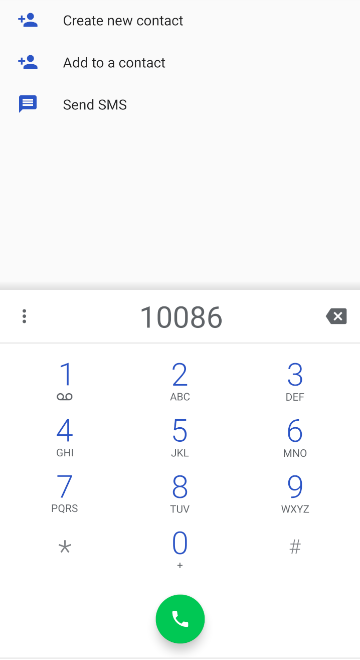
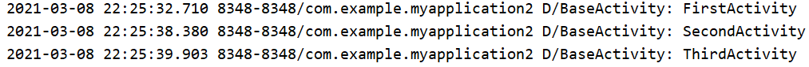

# 2.	Activity

`Activity` 类是 Android 应用的关键组件，而 Activity 的启动和组合方式则是该平台应用模型的基本组成部分。在编程范式中，应用是通过 `main()` 方法启动的，而 Android 系统与此不同，它会调用与其生命周期特定阶段相对应的特定回调方法来启动 `Activity` 实例中的代码。

要详细了解有关设计应用架构的最佳做法，请参阅[应用架构指南](https://developer.android.google.cn/topic/libraries/architecture/guide)。

简单地说，Activity是能包含用户界面的组件，主要用于与用户进行交互

> 移动应用体验与桌面体验的不同之处在于，用户与应用的互动并不总是在同一位置开始，而是经常以不确定的方式开始。例如，如果您从主屏幕打开电子邮件应用，可能会看到电子邮件列表，如果您通过社交媒体应用启动电子邮件应用，则可能会直接进入电子邮件应用的邮件撰写界面。
>
> `Activity` 类的目的就是促进这种范式的实现。当一个应用调用另一个应用时，调用方应用会调用另一个应用中的 Activity，而不是整个应用。通过这种方式，Activity 充当了应用与用户互动的入口点。您可以将 Activity 实现为 `Activity` 类的子类。
>
> Activity 提供窗口供应用在其中绘制界面。此窗口通常会填满屏幕，但也可能比屏幕小，并浮动在其他窗口上面。通常，一个 Activity 实现应用中的一个屏幕。例如，应用中的一个 Activity 实现“偏好设置”屏幕，而另一个 Activity 实现“选择照片”屏幕。
>
> 大多数应用包含多个屏幕，这意味着它们包含多个 Activity。通常，应用中的一个 Activity 会被指定为主 Activity，这是用户启动应用时出现的第一个屏幕。然后，每个 Activity 可以启动另一个 Activity，以执行不同的操作。例如，一个简单的电子邮件应用中的主 Activity 可能会提供显示电子邮件收件箱的屏幕。主 Activity 可能会从该屏幕启动其他 Activity，以提供执行写邮件和打开邮件这类任务的屏幕。
>
> 虽然应用中的各个 Activity 协同工作形成统一的用户体验，但每个 Activity 与其他 Activity 之间只存在松散的关联，应用内不同 Activity 之间的依赖关系通常很小。事实上，Activity 经常会启动属于其他应用的 Activity。例如，浏览器应用可能会启动社交媒体应用的“分享”Activity。
>
> 要在应用中使用 Activity，您必须在应用的清单中注册关于 Activity 的信息，并且必须适当地管理 Activity 的生命周期。本文的后续内容将介绍这些主题。


## 2.1	创建新项目

重新创建一个项目，选择"No Activity"：


在项目源码目录下创建一个Empty Activity：


不选择Launcher Activity(将当前Activity设为主Activity)和Generate Layout File(为当前Activity生成布局文件)：


```java
public class MainActivity extends AppCompatActivity {

    @Override
    protected void onCreate(Bundle savedInstanceState) {
        super.onCreate(savedInstanceState);
    }
}
```

可以看到，AS已经帮我们重写了onCreate()方法，由于现在Activity还没有对应的布局文件，因此没有调用setContentView()方法，引入布局文件。


### 2.1.1	创建布局文件

在Android开发中，讲究逻辑与视图相分离，因此我们最好为每个Activity都配置一个对应的布局文件，布局就是用来显示界面内容的。

在res下创建布局文件目录layout：


在layout目录下创建我们的布局文件：


这里Root element即我们要使用的布局格式，这里我们使用线性布局LinearLayout：


AS为我们提供了可视化布局编辑器，可以直接在左侧拖动组件到右侧布局，并直接预览效果：

点击右侧的Code，切换到XML方式编辑布局：

```xml
<?xml version="1.0" encoding="utf-8"?>
<LinearLayout xmlns:android="http://schemas.android.com/apk/res/android"
    android:orientation="vertical" android:layout_width="match_parent"
    android:layout_height="match_parent">

</LinearLayout>
```

之前创建布局文件时，我们选择的根元素Root Element为LinearLayout，因此我们的根布局就使用了线性布局LinearLayout

接下来为我们的布局添加一个按钮Button：

在string.xml中定义一个字符串：

```xml
<string name="button_1">Button 1</string>
```

```xml
<Button
        android:id="@+id/button_1"
        android:text="@string/button_1"
        android:layout_width="match_parent"
        android:layout_height="wrap_content"/>
```

其中，`android:id`为当前元素定义一个id作为唯一标识符，之后我们在Java代码中可以通过id来引用元素

@+id或许看起来很陌生，但@id应该就能看懂了，类似于@string，我们在XML中通过@id来引用一个元素的id，而当我们要在XML中声明一个元素的id时，就需要使用@+id

我们通过`android:text`指定Button上显示的文本内容，其引用了string.xml中定义的对应字符串

另外，我们通过`android:layout_width`和`android:layout_height`来指定该组件的宽和高，`wrap_content`表示该部件的宽/高度能刚好包含其中的文本内容，而`match_parent`表示该部件的宽/高度与其父元素相同，这里Button的父元素为LinearLayout，因此该按钮的宽度应与整个画面同宽


### 2.1.2	引入布局文件

这样，我们就完成了布局的编写，现在我们要在MainActivity的代码中引入对应布局：

```java
@Override
protected void onCreate(Bundle savedInstanceState) {
    super.onCreate(savedInstanceState);
    setContentView(R.layout.main_layout);
}
```


#### 2.1.2.1	R文件

当 Android 应用程序被编译，会自动生成一个 R 类，其中包含了所有 res/ 目录下资源的 ID，如布局文件，资源文件，图片（values下所有文件）的ID等。在写java代码需要用这些资源的时候，你可以使用 R 类，通过子类+资源名或者直接使用资源 ID 来访问资源。


### 2.1.3	在AndroidManifest中注册Activity

另外，我们之前提到过，所有的Android组件必须在AndroidManifest.xml中进行注册才能使用，因此我们也要对MainActivity进行注册：

```xml
<activity android:name=".MainActivity">
    <intent-filter>
        <action android:name="android.intent.action.MAIN"/>
        <category android:name="android.intent.category.LAUNCHER"/>
    </intent-filter>
</activity>
```


另外我们需要注意，**如果你的程序中没有声明任何一个活动作为主活动，这个程序依然可以安装并运行，但用户无法在启动器中看到或打开这个程序**。

这种程序一般用作第三方服务，供其他应用在内部进行调用，如支付宝的快捷支付服务。


在完成了Activity的注册之后，我们就可以运行程序了：


## 2.2	Toast

Toast是Android系统提供的一种非常好的提醒方式，他不会占用任何的屏幕空间，所以可以将一些简短的信息通过toast的方式通知给用户，这些信息过一段时间会自动消失，非常方便，友好。

### 2.2.1	使用Toast

要使用Toast，我们需要寻找一个Toast的触发点。正好我们刚才创建了一个按钮Button，因此我们刚好可以使用这个Button作为我们的触发点。

因此我们需要先在MainActivity代码中创建一个Button对象，通过id引入我们在布局文件中创建的Button按钮：

```java
//创建Button对象，通过findViewById方法将对应id的Button传递
//由于findViewById方法返回的是View类型的对象，因此我们还需要将对象类型转换为Button类型
Button button1 = (Button)findViewById(R.id.button_1);
```

接下来，我们需要为这个按钮添加一个监听器Listener，它能监听组件发生事件，而我们需要的是点击按钮触发事件，即对应监听器的onClick()方法：

```java
button1.setOnClickListener(new View.OnClickListener() {
            @Override
            public void onClick(View v) {
                Toast.makeText(MainActivity.this, "I'm Button1", Toast.LENGTH_SHORT).show();
            }
        });
```

Toast的用法很简单，通过静态方法makeText()创建出一个Toast对象，再调用show()方法将其显示出来即可。

makeTest()方法需要传递3个参数，第一个参数为Context，即Toast要求的上下文，由于活动本身就是一个Context对象，因此这里我们只需要传递MainActivity.this即可，第二个参数是Toast显示的文本内容，第三个参数是Toast显示时长，一般使用Toast定义的两个常量：Toast.LENGTH_SHORT和Toast.LENGTH_LONG

现在运行程序就可以使用Toast了：


### 2.2.2	解决多次点击产生Toast过多的问题

Toast采用队列的方式处理， 等当前Toast消失后， 下一个Toast才能显示出来；Toast的管理是在队列中，点击一次，就会产生一个新的Toast，要等这个队列中的Toast处理完，这个显示Toast的任务才算结束。 因此，为了防止多次点击出现过多的Toast， 我们可以把Toast改成单例模式，没有Toast再新建它，这样也就解决了连续点击Toast，一直在显示的问题。


## 2.3	Menu

官方文档：https://developer.android.google.cn/guide/topics/ui/menus.html?hl=zh-cn#xml

相比电脑，手机的屏幕空间有限，因此我们要考虑如何高效使用屏幕空间。如果在Activity中有大量菜单需要展示，这时我们就需要用到Android提供的Menu组件了：

### 2.3.1	使用Menu

#### 2.3.1.1	在XML中定义Menu

> 对于所有菜单类型，Android 提供标准的 XML 格式来定义菜单项。您应在 XML [菜单资源](https://developer.android.google.cn/guide/topics/resources/menu-resource?hl=zh-cn)中定义菜单及其所有菜单项，而非在 Activity 的代码中构建菜单。

在res目录下创建menu目录，新建Menu文件，命名为main，添加如下代码：

```xml
<?xml version="1.0" encoding="utf-8"?>
<menu xmlns:android="http://schemas.android.com/apk/res/android">
    <item
        android:id="@+id/add_item"
        android:title="Add"/>
    <item
        android:id="@+id/del_item"
        android:title="Delete"/>
</menu>
```

这里我们创建了两个菜单项，其中<item>标签就是用来创建某一具体的菜单项，再通过属性`android:id`为其添加唯一标识符，再用属性`android:title`为其指定名称。


#### 2.3.1.2	创建选项菜单

完成了XML定义，我们还需要在MainActivity中引入Menu。在MainActivity中重写onCreateOptionMenu()方法，添加代码：

```java
@Override
public boolean onCreateOptionsMenu(Menu menu) {
    getMenuInflater().inflate(R.menu.main, menu);
    return true;
}
```

我们通过调用getMenuInflater()方法，得到MenuInflater对象，再调用它的inflate()方法，为当前Activity创建菜单。

inflate()方法接收两个参数，第一个参数用于指定我们要传入的Menu资源文件，即我们刚才创建的main.xml声明的Menu，因此应当传入R.menu.main；

第二个参数用于指定我们的菜单项将被添加到哪个Menu对象中，这里我们直接使用了onCreateOptionsMenu()方法传入的Menu对象

最后我们让方法返回true，即允许菜单显示，若返回false则不显示菜单


这时运行程序，可以发现我们的应用右上角有了一个图标：


点击图标就能打开我们的菜单：


但此时我们点击菜单项不会有任何事情发生，这是因为我们还没有为菜单项添加响应事件


#### 2.3.1.3	定义菜单响应事件

在MainActivity中重写方法onOptionsItemSelected()：

```java
@Override
public boolean onOptionsItemSelected(@NonNull MenuItem item) {
    switch (item.getItemId()){//根据itemId，即不同菜单项，触发不同事件
        case R.id.add_item:
            Toast.makeText(this, "I'm add_item", Toast.LENGTH_SHORT).show();
            break;
        case R.id.del_item:
            Toast.makeText(this, "I'm del_item", Toast.LENGTH_SHORT).show();
            break;
        default:
    }
    return true;
}
```


#### 2.3.1.4	android:ADT14以后，不再支持使用R.id.XX作为constant使用

在android:ADT14以后，不再支持使用R.id.XX作为constant使用

我们会发现IDEA将刚才的代码标黄：

有道翻译：在Android Gradle Plugin version 5.0中，资源id将是非final，避免在switch case语句中使用它们

即资源id不是一个常量，Android不建议我们在switch case语句中使用它们


##### 2.3.1.4.1	添加注解消除警告

如果我们要直接解决标黄只需要直接在方法上添加注解@SuppressLint("NonConstantResourceId")来消除警告，但更好的方法是解决问题


##### 2.3.1.4.2	用if-else替代switch-case

用if-else可以解决这个问题：

```java
@Override
public boolean onOptionsItemSelected(@NonNull MenuItem item) {
    int itemId = item.getItemId();
    if(itemId == R.id.add_item){
        Toast.makeText(this, "I'm add_item", Toast.LENGTH_SHORT).show();
    }else if(itemId == R.id.del_item){
        Toast.makeText(this, "I'm del_item", Toast.LENGTH_SHORT).show();
    }
    return true;
}
```


运行程序，现在点击菜单项就能触发对应事件了：


## 2.4	销毁Activity

要销毁一个Activity，最简单的方式就是使用Back键，即后退键。

在Activity类中，也提供了用于销毁Activity的finish()方法。

下面我们演示使用按钮Button销毁当前Activity：

```java
button1.setOnClickListener(new View.OnClickListener() {
    @Override
    public void onClick(View v) {
        finish();
    }
});
```

运行程序，点击按钮，当前的Activity就会被销毁了，效果与按下Back键相同。


## 2.5	使用Intent在Activity间跳转

如何使程序从一个Activity跳转到另一个Activity？

Android 应用一般具有若干个 [Activity](https://developer.android.google.cn/guide/components/activities?hl=zh-cn)。每个 Activity 显示一个界面，用户可通过该界面执行特定任务（例如查看地图或拍照）。如需将用户从一个 Activity 转至另一 Activity，您的应用必须使用 `Intent` 定义应用执行操作的“intent”。当您使用 `startActivity()` 等方法将 `Intent` 传递至系统时，系统会使用 `Intent` 识别和启动相应的应用组件。使用 intent 甚至可以让您的应用启动另一个应用包含的 Activity。

`Intent` 可以为“显式”，以便启动特定组件（特定的 `Activity` 实例），也可为“隐式”，以便启动任何可以处理预期操作（例如“拍摄照片”）的组件。


### 2.5.1	使用显式Intent

创建一个新的Activity，命名为AnotherActivity，选择Generate Layout File自动生成布局文件，但不选择Launcher Activity：


将生成的activity_another.xml文件中布局由ConstrainLayout更改为LinearLayout，并添加按钮Button2：

```xml
<?xml version="1.0" encoding="utf-8"?>
<LinearLayout xmlns:android="http://schemas.android.com/apk/res/android"
    xmlns:app="http://schemas.android.com/apk/res-auto"
    xmlns:tools="http://schemas.android.com/tools"
    android:layout_width="match_parent"
    android:layout_height="match_parent"
    tools:context=".AnotherActivity">

    <Button
        android:layout_width="match_parent"
        android:layout_height="wrap_content"
        android:id="@+id/button_2"
        android:text="Button 2"/>

</LinearLayout>
```

在AnotherActivity代码中，AS已经自动为我们引入了该布局文件，而在AndroidManifest.xml中也对该Activity自动进行了注册：

```xml
<activity android:name=".AnotherActivity"></activity>
```

由于AnotherActivity不是我们的主Activity，因此我们暂时不需要添加<intent-filter>标签


我们已经完成了第二个Activity的创建，现在我们需要考虑一个问题，如何启动AnotherActivity？

在Android中，我们使用Intent在各组件中进行交互，它不仅可以指明当前组件要执行的动作，还可以在不同组件之间传递数据。

Intent主要用于启动活动、启动服务以及发送广播等，这里我们主要介绍用Intent启动活动。

Intent大致分为两种：显式Intent和隐式Intent，我们首先介绍显式Intent的使用方法


Intent有多个构造函数重载，我们这次选择使用其中的***Intent(Context packageContext, Class<?> cls)***，这个构造函数接收的两个参数分别为启动活动的上下文和要启动的目标活动，通过这个构造函数，我们就可以构造出Intent的“意图”。

那我们要怎么使用这个Intent呢？Activity类中提供了一个startActivity()方法，这个方法专门用于启动Activity，它接收一个Intent参数，我们只需要将刚才构造的Intent传入即可：

```java
button1.setOnClickListener(new View.OnClickListener() {
    @Override
    public void onClick(View v) {
        Intent intent = new Intent(MainActivity.this, AnotherActivity.class);
        startActivity(intent);
    }
});
```

我们首先构建了一个Intent，传入MainActivity.this作为上下文，传入AnotherActivity.class作为目标活动，这样我们的“意图”就很明显了，即在MainActivity的基础上打开AnotherActivity这个活动，再通过startActivity()方法来执行这个Intent。

运行程序，点击按钮，我们就从MainActivity跳转到了AnotherActivity。如果想要回到上一个Activity，只需要按下Back键，销毁当前Activity即可

通过这种方式来启动Activity，我们的“意图”非常明显，因此我们称这种方法为显式Intent


### 2.5.2	使用隐式Intent

相比于显式Intent，隐式Intent则要含蓄很多，它不明确指出要启动哪个Activity，而是指定了一系列更抽象的action和category信息，再交由系统分析这个Intent，帮我们找到合适的活动去启动。

这里说的合适的活动，也就是能够响应这个隐式Intent的活动。

通过在AndroidManifest.xml中<activity>标签下配置<intent-filter>标签，我们可以使用<action>标签和<category>标签来指定当前Activity能够响应的action和category。在AndroidManifest.xml中为AnotherAction配置如下`intent-filter`：

```xml
<activity android:name=".AnotherActivity">
    <intent-filter>
        <action android:name="com.example.myapplication1.ACTION_START"/>
        <category android:name="android.intent.category.DEFAULT"/>
    </intent-filter>
</activity>
```

在<action>标签中，我们明确指出了当前Action可以响应的action为com.example.myapplication1.ACTION_START，而<category>标签则包含了一些附加信息，更精确地指出当前Activity能响应的Intent中可能带有的category。只有<action>标签和<category>标签中的内容同时匹配上Intent中的action和category，这个活动才能响应该Intent。


修改MainActivity中按钮的点击事件：

```java
button1.setOnClickListener(new View.OnClickListener() {
    @Override
    public void onClick(View v) {
        Intent intent = new Intent("com.example.myapplication1.ACTION_START");
        startActivity(intent);
    }
});
```

可以看到，我们使用了Intent的另一个构造函数，通过action和category构造隐式Intent。但显然，我们只传入了action而并没有传入category，这是因为当省略category时，它的默认值就是android.intent.category.DEFAULT。

重新运行程序，此时我们点击按钮Button1同样可以从MainActivity跳转到AnotherActivity，不同的是我们这次使用了隐式Intent的方式来启动Activity，这说明我们配置的action和category已经生效了。

### 2.5.3	为隐式Intent添加更多category

一个隐式Intent只能指定一个action，但可以同时指定多个category。我们可以使用Intent的addCategory()方法，为当前Intent指定更多的category：

```java
button1.setOnClickListener(new View.OnClickListener() {
    @Override
    public void onClick(View v) {
        Intent intent = new Intent("com.example.myapplication1.ACTION_START");
        intent.addCategory("com.example.myapplication1.MY_CATEGORY");
        startActivity(intent);
    }
});
```

重新运行程序，点击按钮Button1，此时却发现程序崩溃了。

查看Logcat，错误信息为：

```java
2021-03-06 21:46:21.717 8293-8293/? E/AndroidRuntime: FATAL EXCEPTION: main
    Process: com.example.myapplication1, PID: 8293
    android.content.ActivityNotFoundException: No Activity found to handle Intent { act=com.example.myapplication1.ACTION_START cat=[com.example.myapplication1.MY_CATEGORY] }
```

错误信息告诉我们，找不到能够响应我们当前Intent的Activity，这是因为我们只为隐式Intent添加了新的category，却没有在AnotherActivity的<intent-filter>中添加新的category：

```xml
<activity android:name=".AnotherActivity">
    <intent-filter>
        <action android:name="com.example.myapplication1.ACTION_START"/>
        <category android:name="android.intent.category.DEFAULT"/>
        <category android:name="com.example.myapplication1.MY_CATEGORY"/>
    </intent-filter>
</activity>
```

再次运行程序，此时我们又可以通过Button1从MainActivity跳转到AnotherActivity了。


### 2.5.4	更多隐式Intent的用法

通过隐式Intent，我们不仅可以启动自己程序内的Activity，甚至还可以启动其他程序的Activity，这使得多个Android应用程序之间的功能共享成为了可能。比如当你的应用程序需要展示一个网页时，不必自己实现一个浏览器，而只需要调用系统的浏览器来打开这个网页即可。

修改MainActivity中的代码如下：

```java
@Override
public void onClick(View v) {
    Intent intent = new Intent(Intent.ACTION_VIEW);
    intent.setData(Uri.parse("http://www.baidu.com"));
    startActivity(intent);
}
```

我们将Intent的action设为`Intent.ACTION_VIEW`，它对应Android提供的常量`android.intent.action.VIEW`，接下来，我们使用Uri.parse()方法，将字符串解析为Uri对象，调用setData()方法，存入Intent中。

重新运行程序，此时点击按钮就会打开浏览器，并跳转到我们的目标网页：


与此对应的，我们可以在<intent-filter>标签中配置<data>标签，用于更精确地指定当前活动能响应什么类型的数据：

| <data>标签可用属性  | 作用                                                         |
| ------------------- | ------------------------------------------------------------ |
| android:scheme      | 指定数据的协议部分，如http。scheme是指定 URI 时最基本的属性；必须至少为过滤器设置一个 `scheme` 属性，否则其他 URI 属性都没有意义。 |
| android:host        | 指定URI 授权方的主机部分，如www.baidu.com，要匹配多个子网域，请使用星号 (`*`) 匹配主机中的零个或多个字符。例如，主机 `*.google.com` 匹配 `www.google.com`、`.google.com` 和 `developer.google.com`。星号必须是主机属性的第一个字符。例如，主机 `google.co.*` 无效，因为星号通配符不是第一个字符。 |
| android:port        | 指定URI 授权方的端口部分。仅当同时为过滤器指定了 `scheme` 和 `host` 属性时，此属性才有意义。 |
| android:path        | 指定与 Intent 对象中的完整路径匹配的完整路径                 |
| android:pathPattern | 指定与 Intent 对象中的完整路径匹配的完整路径，但它可以包含以下通配符：星号（“`*`”）匹配出现零次到多次的紧邻前面的字符的一个序列、句点后跟星号（“`.*`”）匹配零个到多个字符的任意序列。 |
| android:pathPrefix  | 指定只与 Intent 对象中的路径的初始部分匹配的部分路径         |
| android:mimeType    | MIME 媒体类型，如 `image/jpeg` 或 `audio/mpeg4-generic`。子类型可以是星号通配符 (`*`)，以指示任何子类型都匹配。Intent 过滤器经常会声明仅包含 `android:mimeType` 属性的 `<data>`。 |

<data>标签向 Intent 过滤器添加数据规范。该规范可以是只有数据类型（`mimeType` 属性），可以是只有 URI，也可以是既有数据类型又有 URI。URI 由其各个部分的单独属性指定：

```
<scheme>://<host>:<port>[<path>|<pathPrefix>|<pathPattern>]
```

用于指定网址格式的以下属性是可选的，但也相互依赖：

- 如果没有为 Intent 过滤器指定 `scheme`，则系统会忽略其他所有 URI 属性。
- 如果没有为过滤器指定 `host`，则系统会忽略 `port` 属性以及所有路径属性。

同一 `<intent-filter>` 元素中包含的所有 `<data>` 元素都对同一过滤器起作用：

```xml
<!--格式1-->
<intent-filter . . . >
        <data android:scheme="something" android:host="project.example.com" />
        . . .
</intent-filter>

<!--格式2-->
<intent-filter . . . >
        <data android:scheme="something" />
        <data android:host="project.example.com" />
        . . .
</intent-filter>
```

以上演示的两种格式效果相同，我们可以在 `<intent-filter>` 内放置任意数量的 `<data>` 元素，为其提供多个数据选项。它的属性都没有默认值。

下面我们自己来创建一个Activity，让它能响应打开网页的Intent：

创建新的Activity，命名为YetAnotherActivity，初始设置与AnotherActivity相同，将其布局改为：

```xml
<?xml version="1.0" encoding="utf-8"?>
<LinearLayout xmlns:android="http://schemas.android.com/apk/res/android"
    xmlns:app="http://schemas.android.com/apk/res-auto"
    xmlns:tools="http://schemas.android.com/tools"
    android:layout_width="match_parent"
    android:layout_height="match_parent"
    tools:context=".YetAnotherActivity">

    <Button
        android:layout_width="match_parent"
        android:layout_height="wrap_content"
        android:id="@+id/button_3"
        android:text="Button 3"/>
</LinearLayout>
```

在AndroidManifest.xml中修改YetAnotherActivity的注册信息：

```xml
<activity android:name=".YetAnotherActivity"
            tools:ignore="AppLinkUrlError">
    <intent-filter>
        <action android:name="android.intent.action.VIEW"/>
        <category android:name="android.intent.category.DEFAULT"/>
        <data android:scheme="http"/>
    </intent-filter>
</activity>
```

运行程序，此时我们的程序也可以响应打开浏览器的Intent了：


此时选择用My Application1响应，则会跳转到YetAnotherActivity了。

除了HTTP协议，我们还可以指定其他协议，比如geo表示显示地理位置，tel表示拨打电话，下面演示调用系统拨号功能：

```java
@Override
public void onClick(View v) {
    Intent intent = new Intent(Intent.ACTION_DIAL);
    intent.setData(Uri.parse("tel:10086"));
    startActivity(intent);
}
```




### 2.5.5	向目标Activity传递数据

在启动Activity时，Intent还可以向其传递自身携带的数据。

要传递数据，只需要使用Intent的putExtra()方法，通过K-V的形式存储和获取所需数据。如在MainActivity存放信息：

```java
@Override
public void onClick(View v) {
    String str = "Hello, I'm MainActivity";
    Intent intent = new Intent(MainActivity.this, AnotherActivity.class);
    intent.putExtra("msg", str);
    startActivity(intent);
}
```

在AnotherActivity中再取出数据：

```java
@Override
protected void onCreate(Bundle savedInstanceState) {
    super.onCreate(savedInstanceState);
    setContentView(R.layout.activity_another);
    Intent intent = getIntent();
    String str = intent.getStringExtra("msg");
    Toast.makeText(AnotherActivity.this, str, Toast.LENGTH_SHORT).show();
}
```

在AnotherActivity中，首先通过方法getIntent()获取到用于启动AnotherActivity的Intent，再根据存放的数据类型String，通过Intent的getStringExtra()和Key获取到对应的字符串数据信息。

重新运行程序，我们可以通过点击Button1跳转到AnotherActivity，并获取到对应信息：


### 2.5.6	向上一个Activity返回数据

有时我们也需要当前Activity在被销毁时将某些信息传递给之前调用它的上层Activity，在Activity类中有一个方法startActivityForResult()，它同样能用于启动活动，但它还期望在Activity被销毁时返回一个结果给上一个Activity，这就是我们需要的方法。

startActivityForResult()需要传入两个参数，Intent和请求码，请求码用于在之后的回调中判断数据的来源，因此请求码应当是一个唯一值。修改MainActivity中按钮点击事件：

```java
@Override
public void onClick(View v) {
    Intent intent = new Intent(MainActivity.this, AnotherActivity.class);
    startActivityForResult(intent, 1);
}
```

在AnotherActivity中为按钮注册点击事件：

```java
Button button2 = (Button)findViewById(R.id.button_2);
button2.setOnClickListener(new View.OnClickListener() {
    @Override
    public void onClick(View v) {
         Intent intent = new Intent();
         intent.putExtra("msg", "Hello, MainActivity!");
         setResult(RESULT_OK, intent);
         finish();
    }
});
```

这里，我们依然构造了一个Intent，但这个Intent只用于存放数据，而不指定任何“意图”。接着，我们使用setResult()方法，这个方法专门用于向上一个活动返回数据。setResult()方法接收两个参数，第一个参数用于向上一个Activity返回处理结果，一般只使用*RESULT_OK*或*RESULT_CANCEL*；第二个参数是我们需要传递的Intent。最后，我们调用finishi()方法销毁了当前Activity。


#### 2.5.6.1	重写onActivityResult()方法

在AnotherActivity被销毁后，会回调上一个活动，即MainActivity的onActivityResult()方法，因此我们必须重写这个方法才能获取到返回的数据：

```java
@Override
protected void onActivityResult(int requestCode, int resultCode, @Nullable Intent data) {
    super.onActivityResult(requestCode, resultCode, data);
    if (requestCode == 1) {
        if(resultCode == RESULT_OK) {
            if (data != null) {
                String returnData = data.getStringExtra("msg");
                System.out.println(returnData);
                Toast.makeText(MainActivity.this, returnData, Toast.LENGTH_SHORT).show();
            }
        }
    }
}
```

onActivityResult()方法需要传入三个参数，第一个参数是请求码requestCode，即我们在启动Activity时传入的请求码；第二个参数是返回码resultCode，即我们在返回数据时传入的处理结果，第三个参数data，即我们用于返回数据的Intent。

由于在一个活动中可能通过startActivityForResult()方法启动多个Activity，而每个Activity销毁时传回的数据都会回调onActivityResult()方法，因此我们必须通过请求码requestCode来判断返回的数据来自哪个Activity。确定数据来自于AnotherActivity后，我们再通过resultCode的值来判断处理结果；最后从data中取出数据。

运行程序，我们就可以看到AnotherActivity销毁后向MainActivity传递的信息了：


#### 2.5.6.2	重写onBackPressed()方法

现在有一个问题，如果用户是通过按Back键销毁AnotherActivity，而不是使用Button2呢？

为了解决这个问题，我们需要重写AnotherActivity的onBackPressed()方法，让用户按下Back键时也能返回数据：

```java
@Override
public void onBackPressed() {
    Intent intent = new Intent();
    intent.putExtra("msg", "Hello, MainActivity!");
    setResult(RESULT_OK, intent);
    finish();
}
```

现在，用户按Back键返回MainActivity时，AnotherActivity也能向MainActivity传递信息了。


## 2.6	Activity的生命周期

### 2.6.1	返回栈

在Android中，Activity是可以层叠的。新启动的Activity将会覆盖在之前的Activity之上。当点击Back键或使用finish()方法销毁最上层的活动后，其下面的Activity就会重新显示出来。

实际上，在Android中，我们使用任务Task来管理Activity，一个Task就是一组存放在栈中的Activity的集合，而这个栈就称为**返回栈Back Stack**。


### 2.6.2	活动状态

每个Activity在其生命周期中有四个状态：

| 状态     | 含义                                                         |
| -------- | ------------------------------------------------------------ |
| 运行状态 | 当一个Activity正位于返回栈栈顶时，这个Activity就处于运行状态。系统最不愿意回收处于运行状态的Activity，因为这会严重影响用户的体验。 |
| 暂停状态 | 当一个Activity不再处于栈顶位置，但仍然可见时，它就处于暂停状态。系统也不愿意回收暂停状态的Activity，只有当系统内存极低时，才会考虑回收暂停状态的Activity。 |
| 停止状态 | 系统仍然会为这个Activity保存相应的状态和成员变量，但这不是完全可靠的，当其他地方需要内存时，处于停止状态的Activity可能会被回收。 |
| 销毁状态 | 当一个Activity从返回栈中移除就处于销毁状态，系统最倾向于回收这种类型的Activity，从而保证系统内存充足。 |


### 2.6.3	Activity的生命周期

当用户浏览、退出和返回到您的应用时，您应用中的 `Activity` 实例会在其生命周期的不同状态间转换。`Activity` 类会提供许多回调，这些回调会让 Activity 知晓某个状态已经更改：系统正在创建、停止或恢复某个 Activity，或者正在销毁该 Activity 所在的进程。

在生命周期回调方法中，您可以声明用户离开和再次进入 Activity 时 Activity 的行为方式。例如，如果您正构建流媒体视频播放器，当用户切换至另一应用时，您可能要暂停视频或终止网络连接。当用户返回时，您可以重新连接网络并允许用户从同一位置继续播放视频。换言之，每个回调都支持您执行适合给定状态变更的特定作业。在合适的时间执行正确的作业，并妥善处理转换，这将提升应用的稳健性和性能。例如，良好的生命周期回调实现有助于防止应用出现以下问题：

- 当用户在使用应用时接听来电，或切换至另一应用时崩溃。
- 当用户未主动使用它时，消耗宝贵的系统资源。
- 当用户离开应用并在稍后返回时，丢失用户的进度。
- 当屏幕在横向和纵向之间旋转时，崩溃或丢失用户的进度。

熟悉JavaEE的朋友们都了解Servlet技术，我们想要实现一个自己的servlet，需要继承相应的基类，重写它的方法，这些方法会在合适的时间被servlet容器调用。其实Android中的Activity运行机制跟Servlet有些相似之处，Android系统相当于Servlet容器，Activity相当于一个Servlet，我们的Activity处在这个容器中，一切创建实例、初始化、销毁实例等过程都是容器来调用的，这也就是所谓的“Don't call me, I'll call you.”机制。


这是Activity的生命周期流程图：


其主要流程为：

1.启动Activity：系统会先调用onCreate方法，然后调用onStart方法，最后调用onResume，Activity进入运行状态。

2.当前Activity被其他Activity覆盖其上或被锁屏：系统会调用onPause方法，进入停止状态。

3.当前Activity由被覆盖状态回到前台或解锁屏：系统会调用onResume方法，再次进入运行状态。

4.当前Activity转到新的Activity界面或按Home键回到主屏，自身退居后台：系统会先调用onPause方法，然后调用onStop方法，进入停止状态。

5.用户后退回到此Activity：系统会先调用onRestart方法，然后调用onStart方法，最后调用onResume方法，再次进入运行状态。

6.当前Activity处于被覆盖状态或者后台不可见状态，即第2步和第4步，系统内存不足，杀死当前Activity，而后用户退回当前Activity：再次调用onCreate方法、onStart方法、onResume方法，进入运行状态。

7.用户退出当前Activity：系统先调用onPause方法，然后调用onStop方法，最后调用onDestory方法，结束当前Activity。


**值得注意的是：切换Activity时，各方法的执行次序是(A)onPause→(B)onCreate→(B)onStart→(B)onResume→(A)onStop；**

而不是(A)onPause→(A)onStop→(B)onCreate→(B)onStart→(B)onResume，其原因是：

（1）一个Activity或多或少会占有系统资源，而在官方的建议中，onPause方法将会释放掉很多系统资源，为切换Activity提供流畅性的保障，而不需要再等多两个阶段，这样做切换更快。
 （2）按生命周期图的表示，如果用户在切换Activity的过程中再次切回原Activity，是在onPause方法后直接调用onResume方法的，这样比onPause→onStop→onRestart→onStart→onResume要快得多。

另外，当targetSdkVersion小于3时onSaveInstanceState是在onPause方法中调用的，而大于3时是在onStop方法中调用的；onRestoreInstanceState()是在onStart()之后、onResume()之前调用的


#### 2.6.3.1	生命周期中各个方法的含义和作用

| 生命周期中的方法 | 含义和作用                                                   |
| ---------------- | ------------------------------------------------------------ |
| onCreate()       | 在系统首次创建 Activity 时触发。此时 Activity 并未处于“已创建”状态。`onCreate()` 方法完成执行后，Activity 进入“已开始”状态。在 `onCreate()` 方法中，您需执行基本应用启动逻辑，即应用初始化，如使用setContentView加载布局，对一些控件和变量进行初始化等。**此时Activity不可见**，因此不应当在这里初始化动画。 |
| onStart()        | 当 Activity 进入“已开始”状态时，系统会调用此回调。`onStart()` 调用使 Activity 对用户**可见**，但Activity还**未进入前台且不支持交互**，应用会为 Activity 进入前台并支持互动做准备，此时可以初始化维护界面的代码。`onStart()` 方法会非常快速地完成，并且与“已创建”状态一样，Activity 不会一直处于“已开始”状态。一旦此回调结束，Activity 便会进入“已恢复”状态，系统将调用 `onResume()` 方法。 |
| onResume()       | Activity 会在进入“已恢复”状态时来到前台，然后系统调用 `onResume()` 回调。此时应用**来到前台并可以交互**，应用会一直保持这种状态，直到某些事件发生，让焦点远离应用，如接到来电、跳转到另一个 Activity，或设备屏幕关闭。当发生中断事件时，Activity 进入“已暂停”状态，系统调用 `onPause()` 回调。如果 Activity 从“已暂停”状态返回“已恢复”状态，系统将再次调用 `onResume()` 方法。 |
| onPause()        | 系统将此方法视为用户将要离开您的 Activity 的第一个标志，此方法表示 Activity 此时可见且位于前台，但很快将不再位于前台（尽管在用户处于多窗口模式时 Activity 仍然可见）。使用 [`onPause()`](https://developer.android.google.cn/reference/android/app/Activity#onPause()) 方法暂停或调整当 [`Activity`](https://developer.android.google.cn/reference/android/app/Activity) 处于“已暂停”状态时不应继续（或应有节制地继续）的操作，以及您希望很快恢复的操作。您还可以使用 [`onPause()`](https://developer.android.google.cn/reference/android/app/Activity#onPause()) 方法释放系统资源、传感器，或当您的 Activity 暂停且用户不需要它们时仍然可能影响电池续航时间的任何资源。如果处于多窗口模式，“已暂停”的 Activity 仍完全可见。因此，您应该考虑使用 onStop() 而非 onPause() 来完全释放或调整与界面相关的资源和操作，以便更好地支持多窗口模式。注意，Android规定，若**onPause()方法在500ms即0.5秒内没有执行完毕的话就会强制关闭Activity**，因此最好只进行一些轻量级的存储数据和去初始化的工作。Activity 会保持此状态，直到其恢复或变成对用户完全不可见。 |
| onStop()         | 当Activity 不再对用户可见时，例如，当新启动的 Activity 覆盖整个屏幕时，此时Activity进入“已停止”状态，系统将调用 `onStop()` 回调。应用应释放或调整在应用对用户不可见时的无用资源。例如，应用可以暂停动画效果，或从精确位置更新切换到粗略位置更新。使用 `onStop()` 而非 `onPause()` 可确保与界面相关的工作继续进行，即使用户在多窗口模式下查看您的 Activity 也能如此。`onStop()` 中应当执行 CPU 相对密集的关闭操作。例如，如果您无法找到更合适的时机来将信息保存到数据库，可以在 `onStop()` 期间执行此操作。当您的 Activity 进入“已停止”状态时，`Activity` 对象会继续驻留在内存中：该对象将维护所有状态和成员信息，但不会附加到窗口管理器。Activity 恢复后，Activity 会重新调用这些信息。您无需重新初始化在任何回调方法导致 Activity 进入“已恢复”状态期间创建的组件。系统还会追踪布局中每个 `View` 对象的当前状态，如果用户在 `EditText` 微件中输入文本，系统将保留文本内容，因此您无需保存和恢复文本。 |
| onDestroy()      | Activity被销毁之前将进入已销毁状态，系统会先调用 [`onDestroy()`](https://developer.android.google.cn/reference/android/app/Activity#onDestroy())，释放先前的回调（例如 [`onStop()`](https://developer.android.google.cn/reference/android/app/Activity#onStop())）尚未释放的所有资源。系统调用此回调的原因有两种：①Activity 即将结束（由于用户彻底关闭 Activity 或由于系统为 Activity 调用 [`finish()`](https://developer.android.google.cn/reference/android/app/Activity#finish())）② 由于配置变更（设备旋转或多窗口模式），系统暂时销毁Activity。我们可以可以使用 [`isFinishing()`](https://developer.android.google.cn/reference/android/app/Activity#isFinishing()) 方法区分这两种情况，注意应使用 [`ViewModel`](https://developer.android.google.cn/reference/androidx/lifecycle/ViewModel) 对象来包含 Activity 的相关视图数据，而不是在您的 Activity 中加入逻辑来确定 Activity 被销毁的原因。如果因配置变更而重新创建 Activity，ViewModel 不必执行任何操作，因为系统将保留 ViewModel 并将其提供给下一个 Activity 实例。如果不重新创建 Activity，ViewModel 将调用 [`onCleared()`](https://developer.android.google.cn/reference/androidx/lifecycle/ViewModel#onCleared()) 方法，以便在 Activity 被销毁前清除所需的任何数据。如果 Activity 即将结束，onDestroy() 是 Activity 收到的最后一个生命周期回调。如果由于配置变更而调用 onDestroy()，系统会立即新建 Activity 实例，然后在新配置中为新实例调用 [`onCreate()`](https://developer.android.google.cn/reference/android/app/Activity#onCreate(android.os.Bundle))。 |
| onRestart()      | restart表示重新开始，Activity在这时**可见**，当用户按Home键切换到桌面后又切回来或者从后一个Activity切回前一个Activity就会触发这个方法。这里一般不做什么操作 |


#### 2.6.3.2	三大生存期

按三对方法，我们可以将整个Activity的生存周期分为3个生存期：

| 生存期     | 含义                                                         |
| ---------- | ------------------------------------------------------------ |
| 完整生存期 | Activity在onCreate()方法和onDestroy()方法之间所经历的，就是完整生存期。Activity将在onCreate()方法中完成初始化操作，在onDestroy()方法中完成内存的释放。 |
| 可见生存期 | Activity在onStart()方法和onStop()方法之间所经历的，就是可见生存期。在可见生存期中，Activity一直是可见的，即使可能无法与用户交互。一般情况下，我们在onStart()方法中加载资源，在onStop()方法中释放资源，从而保证处于停止状态的Activity不会占用过多内存。 |
| 前台生存期 | Activity在onResume()方法和onPause()方法之间经历的是前台生存期。在前台生存期内，Activity总是处于运行状态，此时的Activity总是可以与用户进行交互，我们平时看到和接触到最多的就是处于这个状态的Activity。 |


#### 2.6.3.3	实例状态

在某些情况下，您的 Activity 会因正常的应用行为而被销毁，例如当用户按下返回按钮或您的 Activity 通过调用 [`finish()`](https://developer.android.google.cn/reference/android/app/Activity#finish()) 方法发出销毁信号时。当您的 Activity 因用户按下返回按钮或因其自行结束而被销毁时，系统和用户对该 [`Activity`](https://developer.android.google.cn/reference/android/app/Activity) 实例的概念将永远消失。在这些情况下，用户的期望与系统行为相匹配，您无需完成任何额外工作。

但是，如果系统因系统限制（例如配置变更或内存压力）而销毁 Activity，虽然实际的 [`Activity`](https://developer.android.google.cn/reference/android/app/Activity) 实例会消失，但系统会记住它曾经存在过。如果用户尝试回退到该 Activity，系统将使用一组描述 Activity 销毁时状态的已保存数据新建该 Activity 的实例。

系统用于恢复先前状态的已保存数据称为实例状态，是存储在 [`Bundle`](https://developer.android.google.cn/reference/android/os/Bundle) 对象中的键值对集合。默认情况下，系统使用 [`Bundle`](https://developer.android.google.cn/reference/android/os/Bundle) 实例状态来保存 Activity 布局中每个 [`View`](https://developer.android.google.cn/reference/android/view/View) 对象的相关信息（例如在 [`EditText`](https://developer.android.google.cn/reference/android/widget/EditText) 微件中输入的文本值）。这样，如果您的 Activity 实例被销毁并重新创建，布局状态便会恢复为其先前的状态，且您无需编写代码。但是，您的 Activity 可能包含您要恢复的更多状态信息，例如追踪用户在 Activity 中的进程的成员变量。

> 注意：为了使 Android 系统恢复 Activity 中视图的状态，每个视图必须具有 `android:id` 属性提供的唯一 ID。

[`Bundle`](https://developer.android.google.cn/reference/android/os/Bundle) 对象并不适合保留大量数据，因为它需要在主线程上进行序列化处理并占用系统进程内存。如需保存大量数据，您应组合使用持久性本地存储、[`onSaveInstanceState()`](https://developer.android.google.cn/reference/android/app/Activity#onSaveInstanceState(android.os.Bundle)) 方法和 [`ViewModel`](https://developer.android.google.cn/reference/androidx/lifecycle/ViewModel) 类来保存数据，正如[保存界面状态](https://developer.android.google.cn/topic/libraries/architecture/saving-states)中所述。


##### 2.6.3.3.1	使用 onSaveInstanceState() 保存简单轻量的界面状态

当您的 Activity 开始停止时，系统会调用 [`onSaveInstanceState()`](https://developer.android.google.cn/reference/android/app/Activity#onSaveInstanceState(android.os.Bundle)) 方法，以便您的 Activity 可以将状态信息保存到实例状态 Bundle 中。此方法的默认实现保存有关 Activity 视图层次结构状态的瞬时信息，例如 [`EditText`](https://developer.android.google.cn/reference/android/widget/EditText) 微件中的文本或 [`ListView`](https://developer.android.google.cn/reference/android/widget/ListView) 微件的滚动位置。

如需保存 Activity 的其他实例状态信息，您必须替换 [`onSaveInstanceState()`](https://developer.android.google.cn/reference/android/app/Activity#onSaveInstanceState(android.os.Bundle))，并将键值对添加到您的 Activity 意外销毁时事件中所保存的 [`Bundle`](https://developer.android.google.cn/reference/android/os/Bundle) 对象中。替换 onSaveInstanceState() 时，如果您希望默认实现保存视图层次结构的状态，必须调用父类实现。例如：

```java
static final String STATE_SCORE = "playerScore";
static final String STATE_LEVEL = "playerLevel";
// ...

@Override
public void onSaveInstanceState(Bundle savedInstanceState) {
    // Save the user's current game state
    savedInstanceState.putInt(STATE_SCORE, currentScore);
    savedInstanceState.putInt(STATE_LEVEL, currentLevel);

    // Always call the superclass so it can save the view hierarchy state
    super.onSaveInstanceState(savedInstanceState);
}
```

> **注意**：当用户显式关闭 Activity 时，或者在其他情况下调用 `finish()` 时，系统不会调用 [`onSaveInstanceState()`](https://developer.android.google.cn/reference/android/app/Activity#onSaveInstanceState(android.os.Bundle))。

如需保存持久性数据（例如用户首选项或数据库中的数据），您应在 Activity 位于前台时抓住合适机会。如果没有这样的时机，您应在执行 [`onStop()`](https://developer.android.google.cn/reference/android/app/Activity#onStop()) 方法期间保存此类数据。


##### 2.6.3.3.2	使用保存的实例状态恢复 Activity 界面状态

重建先前被销毁的 Activity 后，您可以从系统传递给 Activity 的 [`Bundle`](https://developer.android.google.cn/reference/android/os/Bundle) 中恢复保存的实例状态。[`onCreate()`](https://developer.android.google.cn/reference/android/app/Activity#onCreate(android.os.Bundle)) 和 [`onRestoreInstanceState()`](https://developer.android.google.cn/reference/android/app/Activity#onRestoreInstanceState(android.os.Bundle)) 回调方法均会收到包含实例状态信息的相同 [`Bundle`](https://developer.android.google.cn/reference/android/os/Bundle)。

因为无论系统是新建 Activity 实例还是重新创建之前的实例，都会调用 [`onCreate()`](https://developer.android.google.cn/reference/android/app/Activity#onCreate(android.os.Bundle)) 方法，所以在尝试读取之前，您必须检查状态 Bundle 是否为 null。如果为 null，系统将新建 Activity 实例，而不会恢复之前销毁的实例。

例如，以下代码段显示如何在 [`onCreate()`](https://developer.android.google.cn/reference/android/app/Activity#onCreate(android.os.Bundle)) 中恢复某些状态数据：

```java
@Override
protected void onCreate(Bundle savedInstanceState) {
    super.onCreate(savedInstanceState); // Always call the superclass first

    // Check whether we're recreating a previously destroyed instance
    if (savedInstanceState != null) {
        // Restore value of members from saved state
        currentScore = savedInstanceState.getInt(STATE_SCORE);
        currentLevel = savedInstanceState.getInt(STATE_LEVEL);
    } else {
        // Probably initialize members with default values for a new instance
    }
    // ...
}
```

您可以选择实现系统在 [`onStart()`](https://developer.android.google.cn/reference/android/app/Activity#onStart()) 方法之后调用的 [`onRestoreInstanceState()`](https://developer.android.google.cn/reference/android/app/Activity#onRestoreInstanceState(android.os.Bundle))，而不是在 [`onCreate()`](https://developer.android.google.cn/reference/android/app/Activity#onCreate(android.os.Bundle)) 期间恢复状态。仅当存在要恢复的已保存状态时，系统才会调用 [`onRestoreInstanceState()`](https://developer.android.google.cn/reference/android/app/Activity#onRestoreInstanceState(android.os.Bundle))，因此您无需检查 [`Bundle`](https://developer.android.google.cn/reference/android/os/Bundle) 是否为 null：

```java
public void onRestoreInstanceState(Bundle savedInstanceState) {
    // Always call the superclass so it can restore the view hierarchy
    super.onRestoreInstanceState(savedInstanceState);

    // Restore state members from saved instance
    currentScore = savedInstanceState.getInt(STATE_SCORE);
    currentLevel = savedInstanceState.getInt(STATE_LEVEL);
}
```

> 注意：您应始终调用 [`onRestoreInstanceState()`](https://developer.android.google.cn/reference/android/app/Activity#onRestoreInstanceState(android.os.Bundle)) 的父类实现，以便默认实现可以恢复视图层次结构的状态。


#### 2.6.3.4	onCreate()和onStart()的区别

| onCreate()                   | onStart()                                                    |
| ---------------------------- | ------------------------------------------------------------ |
| 不可见                       | 可见                                                         |
| 只在Activity创建时执行一次   | 在Activity的切换以及按Home键返回桌面再切回应用的过程中被多次调用 |
| setContentView()和资源初始化 | 进行动画的初始化                                             |


#### 2.6.3.5	onStart()和onResume()区别

| onStart()                        | onResume()                 |
| -------------------------------- | -------------------------- |
| Activity可见但不在前台，不可交互 | onResume中在前台，可以交互 |
| 主要进行初始化工作               | 开启动画和独占设备的操作   |


#### 2.6.3.6	onPause()和onStop()区别

| onPause()    | onStop()                                |
| ------------ | --------------------------------------- |
| Activity可见 | Activity不可见,但Activity对象还在内存中 |

在系统内存不足的时候可能不会执行onStop方法，因此程序状态的保存、独占设备和动画的关闭、以及一些数据的保存最好在onPause中进行，但要注意不能太耗时


#### 2.6.3.7	onStop()和onDestroy()区别

| onStop()                                                     | onDestroy()   |
| ------------------------------------------------------------ | ------------- |
| Activity还没有被销毁，对象还在内存中，此时可以通过切换Activity再次回到该Activity | Acivity被销毁 |


### 2.6.4	体验Activity的各生命周期

重新建立一个项目，选择Empty Activity，再创建两个子Activity：NormalActivity和DialogActivity，向MainActivity的布局中添加两个Button：

```xml
<?xml version="1.0" encoding="utf-8"?>
<LinearLayout xmlns:android="http://schemas.android.com/apk/res/android"
    xmlns:app="http://schemas.android.com/apk/res-auto"
    xmlns:tools="http://schemas.android.com/tools"
    android:layout_width="match_parent"
    android:layout_height="match_parent"
    tools:context=".MainActivity"
    android:orientation="vertical">

    <Button
        android:layout_width="match_parent"
        android:layout_height="wrap_content"
        android:id="@+id/start_normal_activity"
        android:text="Start Normal Activity"/>

    <Button
        android:layout_width="match_parent"
        android:layout_height="wrap_content"
        android:id="@+id/start_dialog_activity"
        android:text="Start Dialog Activity"/>

</LinearLayout>
```

在MainActivity代码中将两个按钮的点击事件分别指向启动NormalActivity和DialogActivity，并重写生命周期七个方法：

```java
public class MainActivity extends AppCompatActivity {

    final static String TAG = "MainActivity";

    @Override
    protected void onCreate(Bundle savedInstanceState) {
        super.onCreate(savedInstanceState);
        setContentView(R.layout.activity_main);
        Log.d(TAG, "onCreate");
        Button normalActivityButton = findViewById(R.id.start_normal_activity);
        Button dialogActivityButton = findViewById(R.id.start_dialog_activity);
        normalActivityButton.setOnClickListener(new View.OnClickListener() {
            @Override
            public void onClick(View v) {
                Intent intent = new Intent(MainActivity.this, NormalActivity.class);
                startActivity(intent);
            }
        });
        dialogActivityButton.setOnClickListener(new View.OnClickListener() {
            @Override
            public void onClick(View v) {
                Intent intent = new Intent(MainActivity.this, DialogActivity.class);
                startActivity(intent);
            }
        });
    }

    @Override
    protected void onStart() {
        super.onStart();
        Log.d(TAG, "onStart");
    }

    @Override
    protected void onResume() {
        super.onResume();
        Log.d(TAG, "onResume");
    }

    @Override
    protected void onPause() {
        super.onPause();
        Log.d(TAG, "onPause");
    }

    @Override
    protected void onStop() {
        super.onStop();
        Log.d(TAG, "onStop");
    }

    @Override
    protected void onDestroy() {
        super.onDestroy();
        Log.d(TAG, "onDestroy");
    }

    @Override
    protected void onRestart() {
        super.onRestart();
        Log.d(TAG, "onRestart");
    }
}
```

在NormalActivity布局activity_normal和DialogActivity布局activity_dialog中分别添加文本框TextView：

```xml
<TextView
        android:layout_width="match_parent"
        android:layout_height="wrap_content"
        android:text="This is NormalActivity"/>

<TextView
    android:layout_width="match_parent"
    android:layout_height="wrap_content"
    android:text="This is DialogActivity"/>
```

在AndroidManifest.xml中指定DialogActivity的`android:theme`属性指定为@style/Theme.AppCompat.Dialog

```xml
<activity android:name=".DialogActivity"
    android:theme="@style/Theme.AppCompat.Dialog"/>
```

运行程序，可以看到，当MainActivity第一次被创建时依次执行了onCreate()、onStart()、onResume()方法：


点击按钮"Start Normal Activity"，由于NormalActivity将MainActivity完全遮盖住，因此执行了onPause()、onStop()方法：


点击Back键返回MainActivity，此时执行onRestart()、onStart()、onResume()方法：


点击按钮"Start Dialog Activity"，由于DialogActivity虽然在MainActivity上层，但没有完全遮盖MainActivity，因此只执行了onPause()方法，而没有执行onStop()方法：


响应的，由于只执行了onPause()方法，按下Back键返回到MainActivity时只执行onResume()方法：


最后按Back键退出程序，依次执行了onPause()、onStop()、onDestroy()方法：


### 2.6.5	Activity被回收的处理操作

当一个Activity进入了停止状态，即执行了onStop()后，有可能会被系统回收。此时返回到被回收的Activity，会执行onCreate()方法，即重新创建被回收的Activity。这样造成的问题是，之前Activity中的临时数据和状态会全部丢失，如输入的文本全部丢失，浏览的网页又回到了顶部等。

为了解决这个问题，我们需要使用Activity类提供的onSaveInstanceState()方法，该方法保证会在系统回收Activity前被调用，它携带一个Bundle类型的参数：

> Bundle提供了一系列用于存储数据的方法，在Bundle中，数据以K-V形式存储，以put+数据类型(K, V)方法存储数据，以get+数据类型(K)方法获取数据。
>
> 另外，Intent可以结合Bundle使用，将要存储的数据全部存放到Bundle对象中，再将Bundle存入Intent，在目标Activity中再从Intent中取出Bundle中的数据。

```java
@Override
protected void onSaveInstanceState(@NonNull Bundle outState) {
    super.onSaveInstanceState(outState);
    String tempData = "Something here";
    outState.putString("msg", tempData);
}
```

我们注意到，在onCreate()方法中有一个Bundle参数，它就是用来获取onSaveInstanceState()方法保存的Bundle的：

```java
@Override
protected void onCreate(Bundle savedInstanceState) {
    super.onCreate(savedInstanceState);
    setContentView(R.layout.activity_main);
    Log.d(TAG, "onCreate");
    if(savedInstanceState != null){
        String tempData = savedInstanceState.getString("msg");
        Toast.makeText(MainActivity.this, tempData, Toast.LENGTH_SHORT).show();
    }
    ...
}
```

在获取到保存的数据后，需要再进行相应的复制操作，如将保存的文本赋值回文本框等，这里只作简单输出演示。


## 2.7	Activity的启动模式

在实际开发中，我们会根据实际需求，为Activity指定不同的启动模式。

在AndroidMainifest.xml文件中，通过指定<activity>标签下的`android:launchMode`属性，可以为Activity指定启动模式，默认的启动模式为Standard

Activity共有四种启动模式：

| 启动模式       | 含义                                                         |
| -------------- | ------------------------------------------------------------ |
| standard       | 标准模式，是Activity的默认启动模式。这种模式下，Activity可以有多个实例，每次启动Activity，无论返回栈中是否已经有这个Activity的实例，系统都会创建一个新的Activity实例。 |
| singleTop      | 即栈顶复用模式，类似于standard模式，当一个singleTop模式的Activity已经位于任务栈的栈顶，再去启动它时，不会再创建新的实例，而是调用onNewIntent()方法；如果不位于栈顶，就会创建新的实例。 |
| singleTask     | 栈内复用模式，在同一个Task内只有一个实例，如果Activity已经位于栈顶，系统不会创建新的Activity实例，而是调用onNewIntent()方法。但Activity已经存在但不位于栈顶时，系统就会调用onNewIntent()方法，再把该Activity移到栈顶，并把它上面的activity出栈。 |
| singleInstance | 和singleTask不同，singleTask只是在当前返回栈内单例，但系统里是可以有多个singleTask Activity实例的。而singleInstance Activity在整个系统里只有一个实例，启动一singleInstanceActivity时，系统会创建一个新的任务栈，并且这个任务栈只有他一个Activity。往往用于多个应用之间 |

下面我们来介绍一些相关知识

### 2.7.1	任务栈Task Stack

- 任务栈，即返回栈或退回栈Back Stack，用来存放用户开启的Activity。
- 在应用程序创建之初，系统会默认分配给其一个任务栈（默认一个），并存储根Activity(Root Activity)。
- 在同一个任务栈中，只要不在栈顶，就是onStop停止状态


- 任务栈的ID为Integer类型，且自增长
- 新创建Activity会被压入栈顶。点击back会将栈顶Activity弹出，并产生新的栈顶元素作为显示界面（onResume运行状态）
- 当Task最后一个Activity被销毁时，对应的应用程序被关闭，清除Task栈，但是还会保留应用程序进程，再次点击进入应用会创建新的Task栈。


### 2.7.2	TaskAffinity

affinity是Activity内的一个属性，默认情况下，拥有相同affinity的Activity属于同一个Task中。

Task也有affinity属性，它的affinity属性由根Activity（创建Task时第一个被压入栈的Activity）决定。

默认情况下，所有的Activity的affinity都从Application继承。也就是说Application同样有taskAffinity属性，而Application默认的affinity属性为Manifest的包名。


在了解了基本知识后，我们来看Activity的四大启动模式

### 2.7.3	Standard

Standard模式是Activity的默认启动模式，无需指定。在standard模式下，每启动一次Activity，无论是否已经存在当前Activity，系统都会创建一个新的Activity并放入返回栈栈顶。


### 2.7.4	栈顶复用模式singleTop

 在该模式下，如果栈顶Activity为我们要新建的Activity（目标Activity），那么就不会重复创建新的Activity。当栈顶Activity不是要启动的Activity时，系统会创建新的Activity并压入栈顶。


**应用场景：**

开启渠道多，适合多应用开启调用的Activity：通过这种设置可以避免已经创建过的Activity被重复创建（多数通过动态设置使用）


### 2.7.5	栈内复用模式singleTask

与singleTop模式相似，只不过singleTop模式是只是针对栈顶的元素，而singleTask模式下，如果任务栈中存在目标Activity实例，则：

1. 将task内的对应Activity实例之上的所有Activity弹出栈。
2. 将对应Activity置于栈顶，获得焦点。

**应用场景：**

程序主界面，我们肯定不希望主界面被多创建，而且在主界面退出的时候退出整个App是最好的设想。

耗费系统资源的Activity：对于那些及其耗费系统资源的Activity，我们可以考虑将其设为singleTask模式，减少资源耗费


### 2.7.6	全局唯一模式singleInstance

在该模式下，我们会为目标Activity分配一个新的affinity，并创建一个新的Task栈，将目标Activity放入新的Task，并让目标Activity获得焦点。新的Task有且只有这一个Activity实例。       

如果已经创建过目标Activity实例，则不会创建新的Task，而是将以前创建过的Activity唤醒（对应Task设为Foreground状态）


假设有三个Activity1-3，Activity3设置为singleInstance，1和2默认（standard）：


首先由1创建2,2创建3，然后又由3创建2,2创建3,3创建2，然后一直back直至销毁所有Activity：


我们发现back的时候会先把Foreground的Task中的Activity弹出，直到Task销毁，然后才将Background的Task唤到前台，所以最后将Activity3销毁之后，会直接退出应用。


修改Activity1-3设定，2是singleInstance模式，1,3为Standard模式：


1->2,2->3，之后一直Back回到Home界面后点击菜单键，发现首先启动的是2Activity。

1和3是一个task，2是单独的一个task，在我们2->3后，前台的task又从2的回到了1和3的。所以最后退出的task是2的线程，而如果不是重新启动App。上一次最后关闭的Task是2的，因此singleInstance模式的Activity最好不要设置成中间界面


### 2.7.7	动态设置启动模式

以上介绍的启动模式都是在AndroidManifest.xml中进行设置，在项目运行时我们无法改变Activity之前设定的启动模式，这样的操作称为静态设置。

相对应的，我们还可以在Java代码中设置Activity的启动模式，这样的操作称为动态设置。

在Java代码中，通过设置Intent的Flag来指定Activity的启动模式：

```java
intent.setFlags(...);
```

下面介绍几种动态设置


#### 2.7.7.1	_NEW_TASK

它对应的Flag为`Intent.FLAG_ACTIVITY_NEW_TASK`，类似于singleInstance模式，在给目标Activity设立此Flag后，会根据目标Activity的affinity进行匹配：如果已经存在与其affinity相同的task，则将目标Activity压入此Task。反之没有的话，则新建一个task，新建的task的affinity值与目标Activity相同。然后将目标Activity压入此栈。

但是此情况和singleInstance有两点不同：

- 新的Task没有说只能存放一个目标Activity。只是说决定是否新建一个Task。而singleInstance模式下新的Task只能放置一个目标Activity。
- 在同一应用下，如果Activity都是默认的affinity，那么此Flag无效。而singleInstance默认情况也会创建新的Task。


#### 2.7.7.2	_SINGLE_TOP

对应Flag为`Intent.FLAG_ACTIVITY_SINGLE_TOP`，效果与singleTop相同


#### 2.7.7.3	_CLEAR_TOP

对应Flag为`Intent.FLAG_ACTIVITY_CLEAR_TOP`

当设置此Flag时，目标Activity会检查Task中是否存在此实例，如果没有则创建Activity并压入栈，

如果有，就将对应任务栈中的对应Activity其上的所有Activity弹出栈，此时有以下两种情况：

- 如果同时设置Flag_ACTIVITY_SINGLE_TOP，则直接使用栈内的对应Activity
- 没有设置则将栈内的对应Activity销毁重新创建。

如此，我们可以说，当_CLEAR_TOP和_*SINGLE_TOP*同时设置的情况下，其效果与singleTask模式一致


## 2.8	Activity标签中Task的相关属性

除了给Activity设置启动模式之外，<Activity>标签中还有一些相关的属性，也是关于Task的

### 2.8.1	allowTaskReparenting

标记此属性的Activity实例所在的当前应用切换到后台后，决定是否将标记的Activity从启动的Task移动到相同affinity的Task（需要和taskAffinity属性配合使用）：

- true：可以移动。
- false（默认）：不能移动。

即我们给一个Activity实例标记了此属性并设置为true，当他所在的Application退到后台之后，就会将Activity实例移动到具有相同的affinity。因此我们不能默认Activity的affinity，必须手动设置（taskAffinity）。


首先我们给TwoApp的TwoActivity设置了allowTaskReparenting属性。

在OneApp中的MainActivity点开了TwoApp的TwoActivity，在默认情况下它还是在OneApp显示的，然后我们点击Home键，TwoApp的TwoActivity就会移动到TwoApp的Task（因为TwoActivity默认的affinity就是TwoApp的包名）


### 2.8.2	alwaysRestainTaskState

这个属性只针对根Activity起作用，它标记应用的Task是否保持原来的状态：

- true：总保持
- false（默认）：不保证维持原来状态

我们的App如果长期在后台不使用，我们的系统会对应用的Task进行清理，而清理过程中，如果我们对根Activity标记了这个属性，那么他会保留我们根Activity的状态。


### 2.8.3	clearTaskOnLaunch

该属性同样只针对根Activity起作用，它决定每次唤醒应用时，是否清除掉除了根Activity之外的所有Activity：

- true：清除
- false（默认）：不清除


### 2.8.4	finishOnTaskLaunch

与clearTaskLaunch很像，只不过他只销毁标记的Activity，而clearTaskOnLaunch是除了根Activity全部销毁。


### 2.8.5	noHistory

标记的Activity（包括根Activity）跳转到其他Activity时，Task不将其压入栈。


## 2.9	Activity开发技巧

### 2.9.1	知道当前在哪个Activity

在Activity中，我们可以调用getclass()方法获取到当前类，再调用当前类的getSimpleName()方法，就能获取到Activity的名称：

创建一个基类BaseActivity，命名为AppCompatActivity，注意BaseActivity是一个Class而不是Activity：

```java
public class BaseActivity extends AppCompatActivity {
    @Override
    protected void onCreate(@Nullable Bundle savedInstanceState) {
        super.onCreate(savedInstanceState);
        Log.d("BaseActivity", getClass().getSimpleName());
    }
}
```

创建三个Activity：FirstActivity、SecondActivity和ThirdActivity，让它们继承BaseActivity而不是AppCompatActivity，选择自动生成布局，将FirstActivity作为主Activity：

在FirstActivity、SecondActivity中分别放置按钮：

```xml
<Button
    android:id="@+id/to_second_activity"
    android:layout_width="wrap_content"
    android:layout_height="wrap_content"
    android:text="To Second Activity"/>

<Button
        android:id="@+id/to_third_activity"
        android:layout_width="wrap_content"
        android:layout_height="wrap_content"
        android:text="To Third Activity"/>
```

在FirstActivity、SecondActivity中为按钮设置点击事件：

```java
public class FirstActivity extends BaseActivity {

    @Override
    protected void onCreate(Bundle savedInstanceState) {
        super.onCreate(savedInstanceState);
        setContentView(R.layout.activity_first);
        Button button1 = findViewById(R.id.to_second_activity);
        button1.setOnClickListener(new View.OnClickListener() {
            @Override
            public void onClick(View v) {
                Intent intent = new Intent(FirstActivity.this, SecondActivity.class);
                startActivity(intent);
            }
        });
    }
}

public class SecondActivity extends BaseActivity {

    @Override
    protected void onCreate(Bundle savedInstanceState) {
        super.onCreate(savedInstanceState);
        setContentView(R.layout.activity_second);
        Button button2 = findViewById(R.id.to_third_activity);
        button2.setOnClickListener(new View.OnClickListener() {
            @Override
            public void onClick(View v) {
                Intent intent = new Intent(SecondActivity.this, ThirdActivity.class);
                startActivity(intent);
            }
        });
    }
}
```

运行程序，当我们打开新的Activity时，Logcat的日志就会提示我们当前的Activity名称：




### 2.9.2	随时退出程序

如果我们的程序需要一个退出或是注销功能，此时我们可以建立一个集合类，对所有Activity进行管理就可以了。

新建一个Class，命名为ActivityCollector，作为我们的Activity管理器：

```java
public class ActivityCollector {

    public static List<Activity> activities = new ArrayList<>();

    public static void addActivity(Activity activity){//向集合中添加Activity
        activities.add(activity);
    }

    public static void removeActivity(Activity activity){//从集合中移除Activity
        activities.remove(activity);
    }

    public static void finishAll(){//销毁集合中的全部Activity
        for(Activity activity: activities){
            if(!activity.isFinishing()){
                activity.finish();
            }
        }
    }
}
```

修改BaseActivity中的代码：

```java
public class BaseActivity extends AppCompatActivity {
    @Override
    protected void onCreate(@Nullable Bundle savedInstanceState) {
        super.onCreate(savedInstanceState);
        ActivityCollector.addActivity(this);
        Log.d("BaseActivity", getClass().getSimpleName());
    }

    @Override
    protected void onDestroy() {
        super.onDestroy();
        ActivityCollector.removeActivity(this);
    }
}
```

这样，我们创建Activity时就会将Activity加入到集合中，销毁Activity时将Activity从集合中移除。

当我们想要退出程序时，就可以使用ActivityCollector的finishAll()方法：

在ThirdActivity中加入退出按钮：

```xml
<Button
    android:layout_width="wrap_content"
    android:layout_height="wrap_content"
    android:id="@+id/exit"
    android:text="Exit"/>
```

为按钮添加点击事件：

```java
Button button3 = findViewById(R.id.exit);
button3.setOnClickListener(new View.OnClickListener() {
    @Override
    public void onClick(View v) {
        ActivityCollector.finishAll();
        Process.killProcess(Process.myPid());//获取进程，杀死进程，保证程序完全退出
        //需要注意的是，killProcess()方法只能杀掉当前进程，不能杀死其他进程
    }
});
```

启动程序，当我们点击ThirdActivity中的Exit按钮时，程序就退出了。


### 2.9.3	启动Activity的最佳写法

假设我们要在FirstActivity启动SecondActivity时，向SecondActivity传递信息，可以使用Intent或Bundle传递信息。

但假设我们只负责开发FirstActivity，不知道SecondActivity需要以什么Key获取Value，此时我们可以在SecondActivity中封装一个方法来解决这个问题：

```java
public static void actionStart(Context context, String data1, String data2){
    Intent intent = new Intent(context, SecondActivity.class);
    intent.putExtra("Key1", data1);
    intent.putExtra("Key2", data2);
    context.startActivity(intent);
}
```

在FirstActivity中，我们只需要向方法中传入数据而无需关心Key值：

```java
@Override
public void onClick(View v) {
    String data1 = "123";
    String data2 = "qwe";
    SecondActivity.actionStart(FirstActivity.this, data1, data2);
}
```

这样，我们就解决了问题。