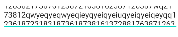
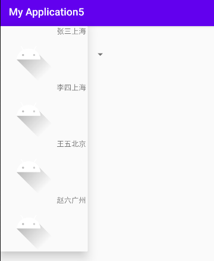

# 3.	UI开发

先介绍几个常用单位：

| 单位    | 含义                                                         |
| ------- | ------------------------------------------------------------ |
| dp(dip) | device independent pixels(设备独立像素)，在不同设备有不同显示效果,与设备硬件有关，推荐使用 |
| px      | pixels(像素)，不同设备显示效果相同                           |
| pt      | point，标准长度单位，1pt=1/72英寸                            |
| sp      | scaled pixels(放大像素)，主要用于字体显示                    |


## 3.1	常用控件

### 3.1.1	TextView

#### 3.1.1.1	基本属性

| id                | 设置一个组件id，通过findViewById()的方法获取到该对象，然后进行相关设置 |
| ----------------- | ------------------------------------------------------------ |
| **layout_width**  | 组件宽度，可使用wrap_content（自适应大小）和match_parent（与父容器同大小）指定大小 |
| **layout_height** | 组件高度，使用同layout_width                                 |
| **text**          | 设置文本内容，应将字符串放在values/string.xml中，使用@string引用 |
| **background**    | 设置背景颜色（或背景图片），默认无背景（透明）               |
| **textColor**     | 设置字体颜色，应将对应颜色放在values/colors.xml中，使用@color引用 |
| **textStyle**     | 设置字体样式，可选属性normal（默认）、bold（加粗）、italic（斜体） |
| **textSize**      | 字体大小，一般以sp为单位调整大小                             |
| **gravity**       | 设置内容对齐方向                                             |
| **autoLink**      | autoLink的属性可以将符合指定格式的文本转换为可单击的超链接形式 |


#### 3.1.1.2	对齐方式

在`TextView`中，使用`gravity`属性规定内容的对齐方式：

| gravity可选值         | 对齐效果                           |
| --------------------- | ---------------------------------- |
| **center**            | 居中对齐，位于容器横向和纵向的中央 |
| **left**              | 左对齐，位于容器左侧               |
| **right**             | 右对齐，位于容器右边               |
| **bottom**            | 底部对齐，位于容器底部             |
| **top**               | 顶部对齐，位于容器顶部             |
| **center_vertical**   | 垂直方向居中，位于容器水平位置左侧 |
| **center_horizontal** | 水平方向居中，位于容器垂直方向顶部 |
| **fill_vertical**     | 纵向延伸填满容器                   |
| **fill_horizontal**   | 横向延伸填满容器                   |
| **fill**              | 纵向和横向延伸填满容器             |

在`gravity`属性中，可以使用或" | "叠加定位，如 fill 等同于fill_vertical | fill_horizontal，center 等同于 center_vertical | center_horizontal。


#### 3.1.1.3	阴影效果

在TextView中，通过以下四个属性实现文字阴影效果：

| 属性名           | 作用                                                 |
| ---------------- | ---------------------------------------------------- |
| **shadowColor**  | 设置阴影颜色                                         |
| **shadowRadius** | 设置阴影模糊程度，数值越大，阴影越模糊               |
| **shadowDx**     | 设置在水平方向上的偏移量，数值越大，则阴影越向右移动 |
| **shadowDy**     | 设置在垂直方向上的偏移量，数值越大，则阴影越向下移动 |


#### 3.1.1.4	链接类型

在TextView中，通过指定属性`autoLink`的值，可以实现文字超链接：

| autoLink可选值 | 效果                                          |
| -------------- | --------------------------------------------- |
| **none**       | 不进行任何匹配，默认。                        |
| **web**        | 匹配Web Url，将变成点击跳转到对应网站的超链接 |
| **email**      | 匹配邮件地址：邮件地址会成为可单击的超链接    |
| **phone**      | 匹配电话号码：点击号码会跳到拨号界面          |
| **map**        | 匹配地图地址                                  |
| **all**        | 匹配web、email、phone、map所有类型            |

另外，通过属性**`android：textColorLink`可以指定链接字体的颜色**


#### 3.1.1.5	**drawable**在TextView旁显示照片

使用drawable相关属性可以在TextView旁显示照片，对应属性分别有：

**drawableTop（drawableLeft、drawableRight、drawableBottom）:在TextView的上（左、右、下方放置一个drawable（图片等））**

`android:drawablePadding`：是设置text与drawable(图片等)的间隔，一般都与drawableLeft、drawableRight、drawableTop、drawableBottom一起使用，此值可设置为负数，单独使用没有效果

```xml
<TextView  
        android:layout_width="wrap_content"  
        android:layout_height="wrap_content"  
        android:layout_centerInParent="true"  
        android:drawableTop="@drawable/show1"  
        android:drawableLeft="@drawable/show1"  
        android:drawableRight="@drawable/show1"  
        android:drawableBottom="@drawable/show1"  
        android:drawablePadding="10dp"  
        android:text="张全蛋" />  
```


但我们会发现，我们这样设置的drawable并不能自行设置大小，在XML是无法直接设置的； 所以我们需要在Java代码中来进行一个修改：

```java
txtZQD = (TextView) findViewById(R.id.txtZQD);  
Drawable[] drawable = txtZQD.getCompoundDrawables();  
// 数组下表0~3,依次是:左上右下  
drawable[1].setBounds(100, 0, 200, 200);  
txtZQD.setCompoundDrawables(drawable[0], drawable[1], drawable[2],  drawable[3]);  
```


#### 3.1.1.6	文字滚动

| TextView属性                     | 作用                                                         |
| -------------------------------- | ------------------------------------------------------------ |
| **android:ellipsize**            | 若文字过长，控制该控件如何显示                               |
| **android:marqueeRepeatLimit**   | 在ellipsize指定marquee的情况下，设置重复滚动的次数，当设置为`marquee_forever`时表示无限次。 |
| **android:scrollHorizontally**   | 设置文本超出TextView的宽度的情况下，是否出现横拉条。         |
| **android:focusable**            | 在控件得到焦点（被点击）后触发事件。                         |
| **android:focusableInTouchMode** | 在程序运行开始的时候，无需获取焦点（不需被点击）即可触发事件。 |
| **android:singleLine**           | 设置文字是否单行显示不换行，默认为false                      |


##### 3.1.1.6.1	设置过长文字显示方式

当TextView中文本过长时，可以使用属性`android:ellipsize`来指定显示方式：

| android:ellipsize可选值 | 效果                                           |
| ----------------------- | ---------------------------------------------- |
| start                   | 省略号显示在开头，即显示最后面文字，前面省略   |
| end                     | 省略号显示在结尾，即显示最前面文字，后面省略   |
| middle                  | 省略号显示在中间，显示开头和结尾文字，中间省略 |
| marquee                 | 以动画横向移动的方式显示，一直是动态的滚播形式 |

实现跑马灯（文字滚动）效果：


```xml
<TextView
    android:layout_width="wrap_content"
    android:layout_height="wrap_content"
    android:ellipsize="marquee"
    android:marqueeRepeatLimit="marquee_forever"
    android:text="Android开发：文本控件详解——TextView文字跑马灯效果实现"
    android:textColor="@color/colorPrimary"
    android:textStyle="bold"
    android:textSize="30sp"
    android:gravity="center"
    android:scrollHorizontally="true"
    android:focusable="true"
    android:focusableInTouchMode="true"
    android:singleLine="true"/>
```

实现效果：


其它扩展使用方法：https://www.runoob.com/w3cnote/android-tutorial-textview.html


### 3.1.2	Button

Button是Android程序用于和用户交互的重要组件，其支持的属性有：

**Button 支持的 XML 属性及相关方法**

| XML 属性            | 相关方法                              | 说明                                                         |
| ------------------- | ------------------------------------- | ------------------------------------------------------------ |
| android:clickable   | setClickable(boolean clickable)       | 设置是否允许点击。 clickable=true:允许点击 clickable=false:禁止点击 |
| android:background  | setBackgroundResource(int resid)      | 通过资源文件设置背景色。 resid:资源xml文件ID 按钮默认背景为android.R.drawable.btn_default |
| android:text        | setText(CharSequence text)            | 设置文字                                                     |
| android:textColor   | setTextColor(int color)               | 设置文字颜色                                                 |
| android:onClick     | setOnClickListener(OnClickListener l) | 设置点击事件                                                 |
| android:textAllCaps | setAllCaps(boolean allCaps)           | 设置按钮中文字是否全部为大写，默认为true                     |


#### 3.1.2.1	为Button设置点击事件

我们之前已经学习过了一种Button设置点击事件的方法，即为Button添加点击事件监听器ClickListener：

```java
Button button1 = findViewById(R.id.btn_click_one);
button1.setOnClickListener(new View.OnClickListener() {
    @Override
    public void onClick(View v) {
        Toast.makeText(MainActivity.this,"Button点击事件1",Toast.LENGTH_LONG).show();
    }
});
```

另外还有一种方法，在XML中将Button的`android:onClick`属性赋值为"click"：

```properties
android:onClick="click"
```

再到对应的Acitivity中实现该方法。需要注意的是这个方法必须符合三个条件：

1).方法的修饰符是 public
2).返回值是 void 类型
3).只有一个参数View，这个View就是被点击的这个控件。

```java
public void click(View v){
    if (v.getId() == R.id.btn_click_two) {
        Toast.makeText(MainActivity.this, "Button点击事件2", Toast.LENGTH_LONG).show();
    }
}
```

**注意：**Button的setOnClickListener优先级比xml中android:onClick高，如果同时设置点击事件，只有setOnClickListener有效。


#### 3.1.2.2	其他样式的Button

```xml
<!--这是V7包里面自带的style样式。
    按钮的颜色是ButtonTest/app/src/main/res/values/colors.xml下name="colorAccent"的颜色。-->
<TextView
    style="@style/Widget.AppCompat.Button.Colored"
    android:layout_width="match_parent"
    android:layout_height="50dp"
    android:layout_marginLeft="20dp"
    android:layout_marginRight="20dp"
    android:layout_marginTop="10dp"
    android:text="V7包按钮样式"
    android:textColor="#ffffffff"
    android:textSize="20sp" />
```


#### 3.1.2.3	EditText

参考文档：https://www.runoob.com/w3cnote/android-tutorial-edittext.html

EditText是程序用于和用户交互的另一个重要控件，它允许用户在控件中输入和编辑内容，还可以在程序中对这些内容进行处理。

基本的使用方法类似于TextView：

```xml
<EditText
    android:layout_width="match_parent"
    android:layout_height="wrap_content"
    android:id="@+id/test_edit_text"/>
```


##### 3.1.2.3.1	添加提示文字

要向EditText添加提示文字，只需要使用属性`android:hint`，其值即为目标提示文字：

另外，用属性`android:textColorHint`可以指定提示文字的颜色：

```properties
android:hint="Type something here"
android:textColorHint="@color/purple_200"
```


##### 3.1.2.3.2	获得焦点后全选组件内所有文本内容

当我们想在点击输入框获得焦点后，不是将光标移动到文本的开始或者结尾；而是 获取到输入框中所有的文本内容的话！这个时候我们可以使用`android:selectAllOnFocus`属性

```properties
android:selectAllOnFocus="true"
```


##### 3.1.2.3.3	限制EditText行数

一般情况下，我们会设定EditText的高度`android:layout_height`为自适应wrap_content，这样，随着输入文本行数增多，EditText的行数会自动增长。

但随之带来的问题是，EditText的高度会随着文本输入行数增长而无限增长，为了解决这个问题我们需要使用属性`android:maxLines`，它能限制EditText的最大行数：

```properties
android:maxLines="2"
```

当输入的文字行数超过了设定的最大行数时，前面的文字将会自动上滚：



同理，我们还可以使用`android:minLines`属性来限制EditText的最小行数。

另外，我们还可以通过属性`android:singleLine`设置单行且不换行：

```properties
android:singleLine="true"
```


##### 3.1.2.3.4	获取EditText内容

我们可以结合Button和EditText，点击按钮获取EditText的内容：

```java
Button button = findViewById(R.id.button_get_text);
EditText editText = findViewById(R.id.test_edit_text);
button.setOnClickListener(new View.OnClickListener() {
    @Override
    public void onClick(View v) {
        String text = editText.getText().toString();
        Toast.makeText(MainActivity.this, text, Toast.LENGTH_SHORT).show();
    }
});
```


##### 3.1.2.3.5	设置文字间隔

可以通过下述两个属性来设置字的间距：

```properties
#设置字与字的水平间隔
android:textScaleX="1.5"  
#设置字与字的垂直间隔
android:textScaleY="1.5"    
```


##### 3.1.2.3.6	设置英文字母大写类型

EditText还为我们提供了设置英文字母大写类型的属性：`android:capitalize` 默认none，提供了三个可选值：

- **sentences：**仅第一个字母大写
- **words：**每一个单词首字母大小，用空格区分单词
- **characters:**每一个英文字母都大写


##### 3.1.2.3.7 控制EditText四周的间隔距离与内部文字与边框间的距离

我们使用***margin***相关属性增加组件相对其他控件的距离，比如：

```properties
android:marginTop = "5dp" 
```

使用***padding***增加组件内文字和组件边框的距离，比如

```properties
android:paddingTop = "5dp"*
```


### 3.1.3	ImageView

参考文档：https://www.runoob.com/w3cnote/android-tutorial-imageview.html

ImageView是用于展示图片的一个控件，我们需要事先准备一些图片，放在drawable开头的目录下。不过由于该目录没有指定分辨率，我们一般不使用它放置图片。在res目录下新建目录，命名为drawable-xhdpi，将准备好的图片img_1.png和img_2.png放到目录中：


在布局文件中使用<ImageView>标签添加对应控件，使用`android:src`属性引入对应图片：

```xml
<ImageView
    android:id="@+id/image_view"
    android:layout_width="wrap_content"
    android:layout_height="wrap_content"
    android:src="@drawable/img_1"/>
```

运行程序，图片成功显示：


在Java代码中，还可以动态替换图片源：

```java
ImageView imageView = findViewById(R.id.image_view);
imageView.setImageResource(R.drawable.img_2);
```


实际上，*ImageView*有两个可以设置图片的属性，分别是：src和background，而它们的区别在于：

①background通常指的都是**背景**,而src指的是**内容**!!

②当使用**src**填入图片时,是按照图片大小**直接填充**,并**不会进行拉伸**；而使用background填入图片,则是会根据ImageView给定的宽度来进行**拉伸**

**Java代码中设置background和src属性:**

```java
//前景(对应src属性):setImageDrawable***( );
//背景(对应background属性):setBackgroundDrawable( );
```


#### 3.1.3.1	adjustViewBounds设置缩放是否保存原图长宽比

*ImageView为我们提供了***adjustViewBounds**属性，用于设置缩放时是否保持原图长宽比

单独设置不起作用，需要配合***maxWidth***和***maxHeight***属性一起使用，而后面这两个属性也需要adjustViewBounds为true才会生效：

- `android:maxHeight`:设置ImageView的最大高度

- `android:maxWidth`:设置ImageView的最大宽度

  

#### 3.1.3.2	alpha设置透明度

在XML中使用属性`android:alpha`或在Java代码中使用setAlpha()方法可以设置图片的透明度

要注意，只有ImageView以src显示图片才能调整透明度


#### 3.1.3.3	scaleType设置缩放类型

`android:scaleType`用于设置显示的图片如何缩放或者移动以适应ImageView的大小，Java代码中可以通过imageView.setScaleType()方法设置。

*可选值如下*：

| scaleType可选值  | 效果                                                         |
| ---------------- | ------------------------------------------------------------ |
| **fitXY**        | 对图像的横向与纵向进行独立缩放,使得该图片完全适应ImageView,但是图片的横纵比可能会发生改变 |
| **fitStart**     | 保持纵横比缩放图片，直到较长的边与Image的编程相等，缩放完成后将图片放在ImageView的左上角 |
| **fitCenter**    | 同上,缩放后放于中间                                          |
| **fitEnd**       | 同上,缩放后放于右下角                                        |
| **center**       | 保持原图的大小，显示在ImageView的中心。当原图的size大于ImageView的size，超过部分裁剪处理。 |
| **centerCrop**   | 保持横纵比缩放图片,知道完全覆盖ImageView,可能会出现图片的显示不完全 |
| **centerInside** | 保持横纵比缩放图片,直到ImageView能够完全地显示图片           |
| **matrix**       | 默认值，不改变原图的大小，从ImageView的左上角开始绘制原图， 原图超过ImageView的部分作裁剪处理 |


### 3.1.4	ProgressBar

扩展文档：https://blog.csdn.net/wangjinyu501/article/details/25963993

ProgressBar用于在屏幕上显示一个进度条，以表示程序正在加载一些数据。其用法非常简单：

```xml
<ProgressBar
    android:id="@+id/progress"
    android:layout_width="match_parent"
    android:layout_height="wrap_content"/>
```

运行程序，就可以看到有一个圆形进度条在不停转动：


但随之产生了一个问题，要怎么控制进度条的出现和消失呢？

Android中所有控件都有一个属性`android:visibility`，它决定了控件是否可见，有3种可选值：

- visible：可见，默认值
- invisible：不可见，但仍占据屏幕原来的位置和空间
- gone：不可见，且不再占据屏幕原来位置和空间

根据这个思路，我们在Java代码中可以使用setVisibility()方法设置进度条是否可见：

先创建一个按钮：

```xml
<Button
    android:id="@+id/progress_control"
    android:layout_width="wrap_content"
    android:layout_height="wrap_content"
    android:text="Progress Control"/>
```

再添加点击事件逻辑：

```java
ProgressBar progressBar = findViewById(R.id.progress);
Button progressControlButton = findViewById(R.id.progress_control);
progressControlButton.setOnClickListener(new View.OnClickListener() {
    @Override
    public void onClick(View v) {
        int state = progressBar.getVisibility();
        if (state == View.VISIBLE){
            progressBar.setVisibility(View.GONE);
        }else{
            progressBar.setVisibility(View.VISIBLE);
        }
    }
});
```

运行程序，我们通过按钮就可以控制进度条的出现与消失了：


#### 3.1.4.1	为进度条设置进度

- ProgressBar有两个进度，一个是`android:progress`，如播放视频时的时间进度；另一个是`android:secondaryProgress`，主要是为缓存需要所涉及的，比如看视频时候的缓存进度条。
- ProgressBar分为确定的和不确定的，上面说的播放进度、缓存等就是确定的。相反地，不确定的就是不清楚、不确定一个操作需要多长时间来完成，这个时候就需要用的不确定的ProgressBar了。这个是由属性android:indeterminate来控制的。默认情况下，如果是水平进度条，那么就是确定的。

- ProgressBar的样式设定其实有两种方式，在API文档中说明的方式如下：
  - Widget.ProgressBar.Horizontal
  - Widget.ProgressBar.Small
  - Widget.ProgressBar.Large
  - Widget.ProgressBar.Inverse
  - Widget.ProgressBar.Small.Inverse
  - Widget.ProgressBar.Large.Inverse

使用的时候可以这样：style="@android:style/Widget.ProgressBar.Small"。另外还有一种方式就是使用系统的attr，上面的方式是系统的style：

- style="?android:attr/progressBarStyle"
- style="?android:attr/progressBarStyleHorizontal"
- style="?android:attr/progressBarStyleInverse"
- style="?android:attr/progressBarStyleLarge"
- style="?android:attr/progressBarStyleLargeInverse"
- style="?android:attr/progressBarStyleSmall"
- style="?android:attr/progressBarStyleSmallInverse"
- style="?android:attr/progressBarStyleSmallTitle"


使用Java代码设置进度：

```java
setProgress(int) //设置第一进度
setSecondaryProgress(int) //设置第二进度
getProgress() //获取第一进度
getSecondaryProgress() //获取第二进度
incrementProgressBy(int) //增加或减少第一进度
incrementSecondaryProgressBy(int) //增加或减少第二进度
getMax() //获取最大进度
```


#### 3.1.4.2	ProgressBar常见的几种样式

- 横向progressBarStyleHorizontal

```xml
<ProgressBar
        style="?android:attr/progressBarStyleHorizontal"
        android:layout_width="240dp"
        android:layout_height="wrap_content"
        android:layout_gravity="center_horizontal"
        android:layout_marginTop="10dp"
        android:max="100"
        android:progress="50" />
```

效果图：


- 横向Widget.ProgressBar.Horizontal

- ```xml
  <ProgressBar
          style="@android:style/Widget.ProgressBar.Horizontal"
          android:layout_width="240dp"
          android:layout_height="wrap_content"
          android:layout_gravity="center_horizontal"
          android:layout_marginTop="10dp"
          android:max="100"
          android:progress="50" />
  ```

效果图：


- 圆形:progressBarStyleLarge

  ```xml
  <ProgressBar
          android:layout_gravity="center_horizontal"
          android:layout_marginTop="10dp"
          android:id="@+id/progressBar1"
          style="?android:attr/progressBarStyleLarge"
          android:layout_width="wrap_content"
          android:layout_height="wrap_content"/>
  ```

  

- 圆形:普通

```xml
 <ProgressBar
        android:layout_marginTop="10dp"
        android:id="@+id/progressBar2"
        android:layout_width="wrap_content"
        android:layout_height="wrap_content"/>
```


- 圆形:progressBarStyleSmall

- ```xml
  <ProgressBar
          android:layout_marginTop="10dp"
          android:layout_gravity="center_horizontal"
          android:id="@+id/progressBar3"
          style="?android:attr/progressBarStyleSmall"
          android:layout_width="wrap_content"
          android:layout_height="wrap_content"/>
  ```

  


#### 3.1.4.3	自定义进度条修改进度的颜色

```xml
<?xml version="1.0" encoding="utf-8"?>
<layer-list xmlns:android="http://schemas.android.com/apk/res/android" >
    <!-- 进度条背景色 -->
    <item android:id="@android:id/background">
        <shape>
            <corners android:radius="5dip" />
            <gradient
                android:startColor="#ff9d9e9d"
                android:centerColor="#ff5a5d5a"
                android:centerY="0.75"
                android:endColor="#ff747674"
                android:angle="270"
                />
        </shape>
    </item>

    <!-- 第二进度条 -->
    <item android:id="@android:id/secondaryProgress">
        <clip>
            <shape>
                <corners android:radius="5dip" />
                <gradient
                    android:startColor="#b9a4ff"
                    android:centerColor="#c6b7ff"
                    android:centerY="0.75"
                    android:endColor="#c3b2ff"
                    android:angle="270"
                    />
            </shape>
        </clip>
    </item>

    <!-- 第一进度条 -->
    <item android:id="@android:id/progress">
        <clip>
            <shape>
                <corners android:radius="5dip" />
                <gradient
                    android:startColor="#57e8ff"
                    android:centerColor="#74ebff"
                    android:centerY="0.75"
                    android:endColor="#8eefff"
                    android:angle="270"
                    />
            </shape>
        </clip>
    </item>
</layer-list>
```


#### 3.1.4.4	自定义进度条多种属性

```xml
<ProgressBar
        style="@android:style/Widget.ProgressBar.Horizontal"
        android:layout_width="240dp"
        android:layout_height="wrap_content"
        android:layout_gravity="center_horizontal"
        android:layout_marginTop="10dp"
        android:max="100"
        android:progress="100"
        android:maxHeight="12dp"
        android:minHeight="12dp"
        android:progressDrawable="@drawable/pb_pd_sp_download" />
```


### 3.1.5	AlertDialog

AlertDialog可以在当前界面弹出一个对话框，并且该对话框是置顶于所有界面元素之上的，能屏蔽掉其他控件的交互能力，一般用来提示一些重要信息或警告信息。

```java
Button alertButton = findViewById(R.id.button_alert);
alertButton.setOnClickListener(new View.OnClickListener() {
    @Override
    public void onClick(View v) {
        AlertDialog.Builder dialog = new AlertDialog.Builder(MainActivity.this);
        dialog.setTitle("This is a title");//设置标题
        dialog.setMessage("Something important");//设置消息
        dialog.setCancelable(false);//设置是否能取消，默认为true
        dialog.setPositiveButton("OK", new DialogInterface.OnClickListener() {
            @Override
            public void onClick(DialogInterface dialog, int which) {
            }
        });//设置OK按钮及点击事件
        dialog.setNegativeButton("Cancel", new DialogInterface.OnClickListener() {
            @Override
            public void onClick(DialogInterface dialog, int which) {
            }
        });//设置Cancel按钮及点击事件
        dialog.show();
    }
});
```


### 3.1.6	ProcessDialog

类似于AlertDialog的用法，ProcessDialog用于弹出一个能屏蔽其他控件的窗口，展示一个进度条，一般表示当前正在进行一个耗时较长，需要用户等待的操作。

```java
Button processButton = findViewById(R.id.button_process);
processButton.setOnClickListener(new View.OnClickListener() {
    @Override
    public void onClick(View v) {
        ProgressDialog dialog = new ProgressDialog(MainActivity.this);
        dialog.setTitle("This is a title");
        dialog.setMessage("Something in need are being prepared...");
        dialog.setCancelable(true);
        //注意，如果设置不可按Back退出，则必须在加载结束之后使用dismiss()方法关闭窗口
        dialog.show();
    }
});
```


## 3.2	常见布局

通过布局的使用，我们可以合理控制各控件的位置。同时，布局中除了可以放置控件，还可以放置布局，通过布局的嵌套使用得到更美观的界面设计效果。要注意的是，放置的布局过多会影响程序性能。

### 3.2.1	线性布局LInearLayout

线性布局有两个方向，水平和垂直方向。分别是通过android:orientation="horizontal"和android:orientation="vertical"来控制的

在LinearLayout中，可以使用属性`android:layout_weight`自动为所在布局分配合适的大小，该属性所赋值为布局的权重，而该布局将会获得其权重与所有布局权重之和之比的空间：

```xml
<!-- 利用android:layout_weight这个属性平均分配宽度和高度，也就是权重属性 -->

<LinearLayout
              android:layout_width="match_parent"
              android:layout_height="match_parent"
              android:layout_weight="1"
              android:orientation="vertical" >

    <TextView
              android:layout_width="match_parent"
              android:layout_height="0dp"
              android:layout_weight="1"
              android:background="#120ff0" />

    <TextView
              android:layout_width="match_parent"
              android:layout_height="0dp"
              android:layout_weight="1"
              android:background="#950ff0" />

    <TextView
              android:layout_width="match_parent"
              android:layout_height="0dp"
              android:layout_weight="1"
              android:background="@android:color/darker_gray" />

    <TextView
              android:layout_width="match_parent"
              android:layout_height="0dp"
              android:layout_weight="1"
              android:background="#000ff0" />
</LinearLayout>

<LinearLayout
              android:layout_width="match_parent"
              android:layout_height="match_parent"
              android:layout_weight="1"
              android:orientation="horizontal" >

    <TextView
              android:layout_width="0dp"
              android:layout_height="match_parent"
              android:layout_weight="1"
              android:background="#079ff0" />

    <TextView
              android:layout_width="0dp"
              android:layout_height="match_parent"
              android:layout_weight="1"
              android:background="#000fca" />

    <TextView
              android:layout_width="0dp"
              android:layout_height="match_parent"
              android:layout_weight="1"
              android:background="#000f65" />

    <TextView
              android:layout_width="0dp"
              android:layout_height="match_parent"
              android:layout_weight="1"
              android:background="@android:color/holo_blue_bright" />
</LinearLayout>
```


权重是分配剩余空间，权重属性是对屏幕剩下的空间进行分配。这就是为什么上面我们说要将控件的宽度或者高度设置为0dp的原因。假如说，控件设置了宽度或者高度，那么权重分配的公式如下：

控件1的宽度或者高度=定义的宽度或者高度+1/3（屏幕宽度或者高度-两个控件的宽度或者高度之和）

控件2的宽度或者高度=定义的宽度或者高度+2/3（屏幕宽度或者高度-两个控件的宽度或者高度之和）。

要注意，假如在horizontal的线性布局里面分配权重，那么高度不能设置为0dp，因为在水平布局中只能按权重分配宽度而不会分配高度，vertical布局中就反之。


### 3.2.2	相对布局RelativeLayout

相对布局通过控件间的相对定位或控件相对父布局的定位，让控件出现在布局的任何位置。默认显示在父视图的左上角。

#### 3.2.2.1	相对父布局定位

RelativeLayout可以使用`alignParent`相关属性定位到父布局的相对位置：

android:layout_alignParentTop、android:layout_alignParentEnd、android:layout_alignParentBottom、android:layout_alignParentLeft、android:layout_alignParentRight、android:layout_alignParentStart

以及相对父布局居中：

android:layout_centerInParent、layout_centerHorizontal、layout_centerVertical


#### 3.2.2.2	相对控件定位

使用以下属性，可以使控件间相对定位，注意相对定位要指定目标控件id：

- `layout_above`，视图的下边与相对视图的上边对齐
- `layout_below`，视图的的上边与相对视图的下边对齐
- `layout_toRightOf`，视图的左边与相对视图的右边对齐
- `layout_toLeftOf`，视图的右边与相对视图的左边对齐

- `layout_alignTop`，视图与基准视图的上边对齐
- `layout_alignBottom`：视图与基准视图的下边对齐
- `layout_alignLeft`：视图与基准视图的左边对齐
- `layout_alignRight`：视图与基准视图的右边对齐
- `layout_alignBaseline`：视图与基准视图的基准线对齐


### 3.2.3	约束布局ConstraintLayout

添加依赖：

```groovy
dependencies {

    ... ...
    implementation 'com.android.support.constraint:constraint-layout:1.1.3'
}
```


#### 3.2.3.1	相对位置

主要属性如下，

| ConstraintLayout属性                   | 效果           |
| -------------------------------------- | -------------- |
| layout_constraintLeft_toLeftOf         | 左边左对齐     |
| layout_constraintLeft_toRightOf        | 左边右对齐     |
| layout_constraintRight_toLeftOf        | 右边左对齐     |
| layout_constraintRight_toRightOf       | 右边右对齐     |
| layout_constraintTop_toTopOf           | 顶部上对齐     |
| layout_constraintTop_toBottomOf        | 顶部下对齐     |
| layout_constraintBottom_toTopOf        | 底部上对齐     |
| layout_constraintBottom_toBottomOf     | 底部下对齐     |
| layout_constraintBaseline_toBaselineOf | 文字基准线对齐 |
| layout_constraintStart_toEndOf         | 起始与尾部对齐 |
| layout_constraintStart_toStartOf       | 起始与起始对齐 |
| layout_constraintEnd_toStartOf         | 尾部与起始对齐 |
| layout_constraintEnd_toEndOf           | 尾部与尾部对齐 |


属性的值为其他控件的`id`或者`parent`

```xml
<?xml version="1.0" encoding="utf-8"?>
<android.support.constraint.ConstraintLayout
    xmlns:android="http://schemas.android.com/apk/res/android"
    xmlns:app="http://schemas.android.com/apk/res-auto"
    android:layout_width="match_parent"
    android:layout_height="match_parent">
    <TextView
        android:id="@+id/tv_left_top"
        android:layout_width="100dp"
        android:layout_height="30dp"
        app:layout_constraintLeft_toLeftOf="parent"
        app:layout_constraintTop_toTopOf="parent"
        android:text="left|top"
        android:gravity="center"
        android:background="#ffa6a5aa"/>
    <TextView
        android:layout_width="100dp"
        android:layout_height="30dp"
        app:layout_constraintRight_toRightOf="parent"
        app:layout_constraintTop_toTopOf="parent"
        android:text="right|top"
        android:gravity="center"
        android:background="#ffa6a5aa"/>
    <TextView
        android:layout_width="100dp"
        android:layout_height="30dp"
        app:layout_constraintLeft_toRightOf="@id/tv_left_top"
        app:layout_constraintTop_toBottomOf="@id/tv_left_top"
        android:text="right|bottom"
        android:gravity="center"
        android:background="#ffa6a5aa"/>

</android.support.constraint.ConstraintLayout>
```


#### 3.2.3.2	隐藏边距

当一个相对的控件隐藏时， ConstraintLayout也可以设置一个不同的边距

`layout_goneMarginStart`
`layout_goneMarginEnd`
`layout_goneMarginLeft`
`layout_goneMarginTop`
`layout_goneMarginRight`
`layout_goneMarginBottom`
当设置layout_goneMarginXXX属性时，如果边上控件的visibility属性设置为gone时，间距才会发生作用

```xml
<?xml version="1.0" encoding="utf-8"?>
<android.support.constraint.ConstraintLayout
    xmlns:android="http://schemas.android.com/apk/res/android"
    xmlns:app="http://schemas.android.com/apk/res-auto"
    android:paddingTop="10dp"
    android:layout_width="match_parent"
    android:layout_height="match_parent">
    <TextView
        android:id="@+id/tv_left"
        android:layout_width="100dp"
        android:layout_height="30dp"
        app:layout_constraintLeft_toLeftOf="parent"
        app:layout_constraintTop_toTopOf="parent"
        android:text="text_left"
        android:gravity="center"
        android:background="#ffa6a5aa"
        android:visibility="gone"/>
    <TextView
        android:id="@+id/tv_right"
        android:layout_width="100dp"
        android:layout_height="30dp"
        app:layout_constraintLeft_toRightOf="@id/tv_left"
        app:layout_constraintTop_toTopOf="parent"
        app:layout_goneMarginLeft="@dimen/margin_dpi_10"
        android:text="text_right"
        android:gravity="center"
        android:background="#ffa6a5aa"/>
</android.support.constraint.ConstraintLayout>
```


#### 3.2.3.3	偏差

默认偏差是居中，

- `layout_constraintHorizontal_bias`，水平偏差
- `layout_constraintVertical_bias`，垂直偏差

`bias`的值为0~1，0.5是居中显示

```xml
<?xml version="1.0" encoding="utf-8"?>
<android.support.constraint.ConstraintLayout
    xmlns:android="http://schemas.android.com/apk/res/android"
    xmlns:app="http://schemas.android.com/apk/res-auto"
    android:layout_width="match_parent"
    android:layout_height="match_parent">
    <TextView
        android:id="@+id/tv_horizontal_center"
        android:layout_width="160dp"
        android:layout_height="30dp"
        app:layout_constraintLeft_toLeftOf="parent"
        app:layout_constraintRight_toRightOf="parent"
        app:layout_constraintTop_toTopOf="parent"
        android:text="horizontal center"
        android:gravity="center"
        android:background="#ffa6a5aa"/>
    <TextView
        android:layout_width="160dp"
        android:layout_height="30dp"
        app:layout_constraintLeft_toLeftOf="parent"
        app:layout_constraintRight_toRightOf="parent"
        app:layout_constraintTop_toBottomOf="@id/tv_horizontal_center"
        app:layout_constraintHorizontal_bias="0.3"
        android:text="horizontal center_bias"
        android:gravity="center"
        android:background="#ffa6a5aa"/>
    <TextView
        android:layout_width="160dp"
        android:layout_height="30dp"
        app:layout_constraintTop_toTopOf="parent"
        app:layout_constraintBottom_toBottomOf="parent"
        app:layout_constraintRight_toRightOf="parent"
        app:layout_constraintVertical_bias="0.3"
        android:text="vertical center"
        android:gravity="center"
        android:background="#ffa6a5aa"/>
</android.support.constraint.ConstraintLayout>
```


#### 3.2.3.4	圆心定位

- `layout_constraintCircle`，圆心定位
- `layout_constraintCircleRadius`，相对控件距离
- `layout_constraintCircleAngle`，相对控件角度，0是Y轴正方向

分别指定角度为0和135的两个控件:

```xml
<?xml version="1.0" encoding="utf-8"?>
<android.support.constraint.ConstraintLayout
    xmlns:android="http://schemas.android.com/apk/res/android"
    xmlns:app="http://schemas.android.com/apk/res-auto"
    android:layout_width="match_parent"
    android:layout_height="match_parent">
    <TextView
        android:id="@+id/tv_center"
        android:layout_width="wrap_content"
        android:layout_height="wrap_content"
        app:layout_constraintLeft_toLeftOf="parent"
        app:layout_constraintRight_toRightOf="parent"
        app:layout_constraintTop_toTopOf="parent"
        app:layout_constraintBottom_toBottomOf="parent"
        android:text="center"
        android:background="#ffffcc00"/>
    <TextView
        android:layout_width="wrap_content"
        android:layout_height="wrap_content"
        app:layout_constraintCircle="@id/tv_center"
        app:layout_constraintCircleRadius="100dp"
        app:layout_constraintCircleAngle="0"
        android:text="circle 0"
        android:background="#ffa6a5aa"/>
    <TextView
        android:layout_width="wrap_content"
        android:layout_height="wrap_content"
        app:layout_constraintCircle="@id/tv_center"
        app:layout_constraintCircleRadius="60dp"
        app:layout_constraintCircleAngle="135"
        android:text="circle 135"
        android:background="#ffa6a5aa"/>
</android.support.constraint.ConstraintLayout>
```


#### 3.2.3.5	尺寸约束

ConstraintLayout布局设置方式：

- 固定值
- `wrap_content`
- 0dp（相当于`MATCH_CONSTRAINT`）

固定值和`wrap_content`的控件:

```xml
<android.support.constraint.ConstraintLayout
    android:layout_width="match_parent"
    android:layout_height="200dp">
    <TextView
        android:id="@+id/tv_specific"
        android:layout_width="100dp"
        android:layout_height="30dp"
        app:layout_constraintLeft_toLeftOf="parent"
        app:layout_constraintRight_toRightOf="parent"
        app:layout_constraintTop_toTopOf="parent"
        android:text="text specific"
        android:gravity="center"
        android:background="#ffa6a5aa"/>
    <TextView
        android:layout_width="wrap_content"
        android:layout_height="wrap_content"
        app:layout_constraintLeft_toLeftOf="parent"
        app:layout_constraintRight_toRightOf="parent"
        app:layout_constraintTop_toBottomOf="@id/tv_specific"
        android:text="text wrap"
        android:background="#ffa6a5aa"/>
</android.support.constraint.ConstraintLayout>
```


**设置一定宽高比例**

设置宽度或高度百分比：

| 属性名                          | 效果               |
| ------------------------------- | ------------------ |
| layout_constraintWidth_default  | 设置宽度百分比布局 |
| layout_constraintWidth_percent  | 指定宽度百分比     |
| layout_constraintHeight_default | 设置高度百分比布局 |
| layout_constraintHeight_percent | 指定高度百分比     |

layout_width`或者`layout_height`设置为`0dp：

```xml
<android.support.constraint.ConstraintLayout
    android:layout_width="match_parent"
    android:layout_height="200dp">
    <TextView
        android:layout_width="0dp"
        android:layout_height="wrap_content"
        app:layout_constraintLeft_toLeftOf="parent"
        app:layout_constraintRight_toRightOf="parent"
        app:layout_constraintTop_toTopOf="parent"
        app:layout_constraintWidth_default="percent"
        app:layout_constraintWidth_percent="0.3"
        android:text="percent"
        android:gravity="center"
        android:background="#ffa6a5aa"/>
    <TextView
        android:layout_width="wrap_content"
        android:layout_height="0dp"
        app:layout_constraintLeft_toLeftOf="parent"
        app:layout_constraintTop_toTopOf="parent"
        app:layout_constraintHeight_default="percent"
        app:layout_constraintHeight_percent="0.5"
        android:text="percent"
        android:gravity="center"
        android:background="#ffa6a5aa"/>
</android.support.constraint.ConstraintLayout>
```


**设置宽高比**：

- `layout_constraintDimensionRatio`，默认以`width:height`排列

使用字符`W`或者`H`来指定哪个边被约束：

```xml
<android.support.constraint.ConstraintLayout
    android:layout_width="match_parent"
    android:layout_height="200dp">
    <ImageView
        android:layout_width="0dp"
        android:layout_height="match_parent"
        app:layout_constraintLeft_toLeftOf="parent"
        app:layout_constraintTop_toTopOf="parent"
        app:layout_constraintDimensionRatio="w,4:5"
        android:background="@drawable/scenery"/>
</android.support.constraint.ConstraintLayout>
```


#### 3.2.3.6	链式布局

链式布局为同一个方向提供群组行为：

| 属性名                                 | 效果                                                      |
| -------------------------------------- | --------------------------------------------------------- |
| layout_constraintHorizontal_chainStyle | 提供了三种选择spread、spread_inside和packed，默认是spread |
| layout_constraintHorizontal_weight     | 指定水平方向weight值                                      |
| layout_constraintVertical_weight       | 指定垂直方向weight值                                      |

`chain`下控件必须相互约束：

```xml
<android.support.constraint.ConstraintLayout
    android:layout_width="match_parent"
    android:layout_height="50dp">
   <TextView
       android:id="@+id/tv_left"
       android:layout_width="80dp"
       android:layout_height="30dp"
       app:layout_constraintLeft_toLeftOf="parent"
       app:layout_constraintRight_toLeftOf="@+id/tv_center"
       app:layout_constraintTop_toTopOf="parent"
       app:layout_constraintHorizontal_chainStyle="spread"
       android:text="text left"
       android:gravity="center"
       android:background="#ffa6a5aa"/>
    <TextView
        android:id="@+id/tv_center"
        android:layout_width="80dp"
        android:layout_height="30dp"
        app:layout_constraintLeft_toRightOf="@+id/tv_left"
        app:layout_constraintRight_toLeftOf="@+id/tv_right"
        app:layout_constraintTop_toTopOf="parent"
        android:text="text center"
        android:gravity="center"
        android:background="#ffa6a5aa"/>
    <TextView
        android:id="@+id/tv_right"
        android:layout_width="80dp"
        android:layout_height="30dp"
        app:layout_constraintLeft_toRightOf="@id/tv_center"
        app:layout_constraintRight_toRightOf="parent"
        app:layout_constraintTop_toTopOf="parent"
        android:text="text right"
        android:gravity="center"
        android:background="#ffa6a5aa"/>
</android.support.constraint.ConstraintLayout>
```

chainStyle一共有三种类型，

spread，View分散布局，平分间隔。如果设置尺寸为0，并且设置layout_constraintHorizontal_weight属性，可以按比例分配控件。
spread_inside，类似于spread，View分散布局，但两端靠近父容器
packed，所以View居中聚集在一起，可以设置bias控制聚集的位置


#### 3.2.3.7	辅助线

`GuideLine`是辅助线，容器的水平或者竖直方向插入一条辅助线，通过`android:orientation`属性指定方向：

| 属性名                         | 效果                                 |
| ------------------------------ | ------------------------------------ |
| layout_constraintGuide_begin   | 指定辅助线距离容器顶部或者左边的距离 |
| layout_constraintGuide_end     | 指定辅助线距离容器底部或者右边的距离 |
| layout_constraintGuide_percent | 指定容器的宽或者高度的百分比         |

利用两条辅助线指定控件左右两边：

```xml
<?xml version="1.0" encoding="utf-8"?>
<android.support.constraint.ConstraintLayout
    xmlns:android="http://schemas.android.com/apk/res/android"
    xmlns:app="http://schemas.android.com/apk/res-auto"
    android:layout_width="match_parent"
    android:layout_height="match_parent">
    <android.support.constraint.Guideline
        android:id="@+id/gl_left"
        android:layout_width="wrap_content"
        android:layout_height="wrap_content"
        android:orientation="vertical"
        app:layout_constraintGuide_begin="50dp"/>
    <android.support.constraint.Guideline
        android:id="@+id/gl_right"
        android:layout_width="wrap_content"
        android:layout_height="wrap_content"
        android:orientation="vertical"
        app:layout_constraintGuide_percent="0.5"/>
    <TextView
        android:id="@+id/tv_center2"
        android:layout_width="0dp"
        android:layout_height="wrap_content"
        app:layout_constraintLeft_toRightOf="@+id/gl_left"
        app:layout_constraintRight_toLeftOf="@+id/gl_right"
        app:layout_constraintTop_toTopOf="parent"
        app:layout_constraintBottom_toBottomOf="parent"
        android:text="guide line"
        android:gravity="center"
        android:background="#ffa6a5aa"/>
</android.support.constraint.ConstraintLayout>
```


### 3.2.4	帧布局FrameLayout

FrameLayout(帧布局)是常见布局中最简单的布局,这个布局直接在屏幕上开辟出一块空白的区域,当我们往里面添加控件的时候,会默认把他们放到这块区域的左上角。

而这种布局方式却没有任何的定位方式,所以它应用的场景并不多;帧布局的大小由控件中最大的子控件决定,后续添加的控件会覆盖前一个!虽然默认会将控件放置在左上角,但是我们也可以通过layout_gravity属性,指定到其他的位置。

前景图像:永远处于帧布局最上面,直接面对用户的图像,就是不会被覆盖的图片，即将图片置顶。

- **android:foreground:**设置帧布局容器的前景图像
- **android:foregroundGravity:**设置前景图像显示的位置

简单演示：

```xml
<FrameLayout xmlns:android="http://schemas.android.com/apk/res/android"    
    xmlns:tools="http://schemas.android.com/tools"    
    android:id="@+id/FrameLayout1"    
    android:layout_width="match_parent"    
    android:layout_height="match_parent"    
    tools:context=".MainActivity"     
    android:foreground="@drawable/logo"    
    android:foregroundGravity="right|bottom"><!--设置前景图像位于右下角-->
    
    <!--三个TextView设置不同大小与背景色,依次覆盖-->
    <TextView    
        android:layout_width="200dp"    
        android:layout_height="200dp"    
        android:background="#FF6143" />    
    <TextView    
        android:layout_width="150dp"    
        android:layout_height="150dp"    
        android:background="#7BFE00" />    
     <TextView    
        android:layout_width="100dp"    
        android:layout_height="100dp"    
        android:background="#FFFF00" />    
    
</FrameLayout>    
```

前景图像通过 android:foreground="@drawable/logo" 设置前景图像的图片， android:foregroundGravity="right|bottom"设置前景图像的位置在右下角。


### 3.2.5	网格布局GridLayout

GridLayout是Android4.0引入的网格布局，使用它可以减少布局嵌套

#### 3.2.5.1	常用属性

| 属性                         | 作用                                                         |
| ---------------------------- | ------------------------------------------------------------ |
| android:columnCount          | 最大列数                                                     |
| android:rowCount             | 最大行数                                                     |
| android:orientation          | 子元素的布局方向                                             |
| android:alignmentMode        | alignBounds：对齐子视图边界 alignMargins ：对齐子视距内容，默认值 |
| android:columnOrderPreserved | 使列边界显示的顺序和列索引的顺序相同，默认是true             |
| android:rowOrderPreserved    | 使行边界显示的顺序和行索引的顺序相同，默认是true             |
| android:useDefaultMargins    | 没有指定视图的布局参数时使用默认的边距，默认值是false        |

**item属性**

| 属性                        | 作用                       |
| --------------------------- | -------------------------- |
| android:layout_column       | 指定该单元格在第几列显示   |
| android:layout_row          | 指定该单元格在第几行显示   |
| android:layout_columnSpan   | 指定该单元格占据的列数     |
| android:layout_rowSpan      | 指定该单元格占据的行数     |
| android:layout_gravity      | 指定该单元格在容器中的位置 |
| android:layout_columnWeight | （API21加入）列权重        |
| android:layout_rowWeight    | （API21加入） 行权重       |

**注意**

- 使用`layout_columnSpan` 、`layout_rowSpan`时要加上`layout_gravity`属性，否则没有效果；

- item在边缘时宽高计算会出现错误，需要我们手动设置宽高，否则达不到想要的效果


#### 3.2.5.2	Java实现计算器界面

在布局中引入GridLayout：

```xml
<?xml version="1.0" encoding="utf-8"?>
<GridLayout
    xmlns:android="http://schemas.android.com/apk/res/android"
    xmlns:app="http://schemas.android.com/apk/res-auto"
    xmlns:tools="http://schemas.android.com/tools"
    android:id="@+id/grid_layout"
    android:layout_width="match_parent"
    android:layout_height="match_parent"
    android:background="#ece7e7"
    app:orientation="horizontal"
    app:useDefaultMargins="false"
    app:alignmentMode="alignBounds">

</GridLayout>
```

在Java代码中设置Activity布局：

```java
public class MainActivity extends AppCompatActivity {

    private String[] mStrings = {"0","AC","退格","/","*","7","8","9","—","4","5","6","+","1","2","3","=","%","0","."};

    @RequiresApi(api = Build.VERSION_CODES.LOLLIPOP)
    @Override
    protected void onCreate(Bundle savedInstanceState) {
        super.onCreate(savedInstanceState);
        setContentView(R.layout.activity_main);

        GridLayout gridLayout = (GridLayout) findViewById(R.id.grid_layout);

        // 6行   4列
        gridLayout.setColumnCount(4);
        gridLayout.setRowCount(6);

        for (int i = 0; i < mStrings.length; i++) {
            TextView textView = new TextView(this);
            textView.setTextSize(30);
            GridLayout.LayoutParams params = new GridLayout.LayoutParams();
            params.width =0;
            params.height =0;

            if(i == 0){
                // 设置行列下标， 所占行列  ，比重
                // 对应： layout_row  , layout_rowSpan , layout_rowWeight
                // 如下代表： item坐标（0,0）， 占 1 行，比重为 3 ； 占 4 列，比重为 1
                params.rowSpec = GridLayout.spec(0,1,3f);
                params.columnSpec = GridLayout.spec(0,4,1f);

                textView.setGravity(Gravity.BOTTOM|Gravity.RIGHT);
            }else{
                // 设置行列下标，和比重
                params.rowSpec = GridLayout.spec((i+3)/4,1f);
                params.columnSpec = GridLayout.spec((i+3)%4,1f);

                // 背景
                textView.setBackgroundColor(Color.WHITE);

                // 字体颜色
                if("AC".equals(mStrings[i])){
                    textView.setTextColor(Color.parseColor("#f68904"));
                }

                if("=".equals(mStrings[i])){
                    textView.setBackgroundColor(Color.parseColor("#f68904"));
                    textView.setTextColor(Color.WHITE);
                    params.rowSpec = GridLayout.spec((i+3)/4,2,1f);
                }

                // 居中显示
                textView.setGravity(Gravity.CENTER);

                // 设置边距
                params.setMargins(2,2,2,2);
            }

            // 设置文字
            textView.setText(mStrings[i]);

            // 添加item
            gridLayout.addView(textView,params);
        }
    }
}
```


### 3.2.6	自定义控件

我们平常使用的控件都直接或间接继承于View，而所有布局都直接或间接继承自ViewGroup

View是Android最基本的一种控件，它可以在屏幕上绘制一块矩形区域，并能响应该区域的各种事件，因此我们使用的各种控件其实是在View的基础上添加了各自的特有功能。而ViewGroup也是一种特殊的View，它可以包含很多子View和VIewGroup，是用于放置控件和布局的容器。

因此，当系统提供的控件和布局不足以满足我们的需求时，我们可以通过上图的继承结构来实现自定义控件。


#### 3.2.6.1	自定义布局

在iOS系统中有这样的经典布局，一个标题栏上有一个或两个按钮

我们可以通过自定义控件，在Android系统中实现这样的布局：

在thme.xml中进行修改：

```xml
<style name="Theme.MyApplication4" parent="Theme.MaterialComponents.DayNight.DarkActionBar">
 <!--将行1改为行2，即在末尾添加.Bridge，不使用默认主题颜色，避免按钮颜色无法修改-->
<style name="Theme.MyApplication4" parent="Theme.MaterialComponents.DayNight.DarkActionBar.Bridge">
```

创建布局文件layout_title.xml，首先引入布局LinearLayout，添加两个Button和一个TextView：

```xml
<?xml version="1.0" encoding="utf-8"?>
<LinearLayout xmlns:android="http://schemas.android.com/apk/res/android"
    xmlns:app="http://schemas.android.com/apk/res-auto"
    xmlns:tools="http://schemas.android.com/tools"
    android:layout_width="match_parent"
    android:layout_height="wrap_content"
    android:background="@android:color/holo_blue_dark"
    tools:context=".MainActivity">

    <Button
        android:id="@+id/button_back"
        android:layout_width="wrap_content"
        android:layout_height="wrap_content"
        android:gravity="center"
        android:layout_margin="5dp"
        android:text="Back"
        android:textColor="#fff"
        android:background="@android:color/transparent"/>

    <TextView
        android:id="@+id/title_text"
        android:layout_width="0dp"
        android:layout_height="wrap_content"
        android:layout_weight="1"
        android:gravity="center"
        android:text="Title"
        android:textColor="#fff"
        android:textSize="24sp" />

    <Button
        android:id="@+id/button_edit"
        android:layout_width="wrap_content"
        android:layout_height="wrap_content"
        android:gravity="center"
        android:layout_margin="5dp"
        android:text="edit"
        android:textColor="#fff"
        android:background="@android:color/transparent"/>

</LinearLayout>
```

这样，我们就模仿出了iOS的标题栏。在其他布局中，只要使用@layout就可以引用了：

```xml
<include layout="@layout/layout_title" />
```

另外，我们还可以用Java代码隐藏Android系统的状态栏：

```java
ActionBar actionBar = getSupportActionBar();
if(actionBar != null){
    actionBar.hide();
}
```


#### 3.2.6.2	自定义控件

引入布局的技巧解决了重复编写布局的问题，但如果布局中有些控件要求响应事件，则我们需要在不同Activity中编写相同的响应事件代码，这无疑添加了许多重复代码。比如标题栏的Back按钮，无论什么地方都是用于销毁当前Activity，因此我们可以使用自定义控件的方法解决问题：

```java
//创建class TitleLayout，继承LinearLayout
public class TitleLayout extends LinearLayout {
    //重写构造函数
    public TitleLayout(Context context, @Nullable AttributeSet attrs) {
        super(context, attrs);
        //动态加载标题栏布局
        //LayoutInflater.from()方法构建LayoutInflater对象
        //调用inflate()方法加载布局(参数一)，为加载好的布局添加一个父布局(参数二)
        LayoutInflater.from(context).inflate(R.layout.layout_title, this);
    }
}
```


接着，在构造函数中为Button添加点击事件：

```java
Button backButton = findViewById(R.id.button_back);
Button editButton = findViewById(R.id.button_edit);
backButton.setOnClickListener(new OnClickListener() {
    @Override
    public void onClick(View v) {
        //按Back键销毁Activity
        Toast.makeText(getContext(), "The Activity would be finished.", Toast.LENGTH_SHORT).show();
        ((Activity)getContext()).finish();
    }
});
editButton.setOnClickListener(new OnClickListener() {
    @Override
    public void onClick(View v) {
        Toast.makeText(getContext(), "This is EDIT Button.", Toast.LENGTH_SHORT).show();
    }
});
```

这样，我们只需要使用TitleLayout布局就可以直接创建一个iOS风格的标题栏了：

```xml
<com.example.myapplication5.TitleLayout
    android:layout_height="match_parent"
    android:layout_width="match_parent">

</com.example.myapplication5.TitleLayout>
```


### 3.2.7	单选按钮RadioButton

RadioButton是一个单选按钮，用于让用户在多个选项中只能做出一个选择。

使用RadioButton必须和单选框RadioGroup一起使用，在RadioGroup中放置RadioButton来使用。

#### 3.2.7.1	onClick()

在布局中放置组件，<RadioButton>标签中添加onClick属性，指定值即为对应方法值，点击对应RadioButton就会触发指定的方法：

```xml
<RelativeLayout
    xmlns:android="http://schemas.android.com/apk/res/android"
    xmlns:tools="http://schemas.android.com/tools"
    android:layout_width="match_parent"
    android:layout_height="match_parent"
    android:orientation="vertical"
    tools:context=".MainActivity">

    <TextView
        android:id="@+id/textView1"
        android:layout_width="wrap_content"
        android:layout_height="wrap_content"
        android:layout_alignParentLeft="true"
        android:layout_alignParentTop="true"
        android:layout_marginTop="44dp"
        android:text="性别："
        android:textSize="20dp" />
    <RadioGroup
        android:id="@+id/radioGroup1"
        android:layout_width="wrap_content"
        android:layout_height="wrap_content"
        android:layout_alignTop="@+id/textView1"
        android:layout_marginLeft="21dp"
        android:layout_toRightOf="@+id/textView1"
        android:orientation="horizontal" >
        <RadioButton
            android:id="@+id/radio0"
            android:layout_width="wrap_content"
            android:layout_height="wrap_content"
            android:checked="true"
            android:onClick="onRadioButtonClicked"
            android:text="男" />
        <RadioButton
            android:id="@+id/radio1"
            android:layout_width="wrap_content"
            android:layout_height="wrap_content"
            android:onClick="onRadioButtonClicked"
            android:text="女" />
        <RadioButton
            android:id="@+id/radio2"
            android:layout_width="wrap_content"
            android:layout_height="wrap_content"
            android:onClick="onRadioButtonClicked"
            android:text="保密" />
    </RadioGroup>

    <Button
        android:id="@+id/button_submit"
        android:text="SUBMIT"
        android:layout_width="match_parent"
        android:layout_height="wrap_content"
        android:layout_below="@id/radioGroup1"/>
    
</RelativeLayout>
```

在MainActivity中编写点击事件逻辑：

```java
public void onRadioButtonClicked(View view) {
    RadioButton button = (RadioButton) view;
    int id = view.getId();
    if(id == R.id.radio0 || id == R.id.radio1 || id == R.id.radio2){
        if (button.isChecked()) {
            Toast.makeText(MainActivity.this, button.getText(), Toast.LENGTH_SHORT).show();
        }
    }
}
```

除了编写RadioButton的点击事件处理逻辑，我们还可以添加一个Button，通过Button获取RadioGroup信息：

```java
Button submitButton = findViewById(R.id.button_submit);
RadioGroup radioGroup = findViewById(R.id.radioGroup1);
submitButton.setOnClickListener(new View.OnClickListener() {
    @Override
    public void onClick(View v) {
        for(int i=0; i<radioGroup.getChildCount(); i++){
            RadioButton radioButton = (RadioButton) radioGroup.getChildAt(i);
            if(radioButton.isChecked()){
                Toast.makeText(MainActivity.this, radioButton.getText(), Toast.LENGTH_SHORT).show();
            }
        }
    }
});
```


#### 3.2.7.2	setOnCheckedChangeListener()

我们还可以为RadioGroup设置选择改变监听器CheckedChangeListener：

```java
RadioGroup radioGroup = findViewById(R.id.radioGroup1);
radioGroup.setOnCheckedChangeListener(new RadioGroup.OnCheckedChangeListener() {
    @Override
    public void onCheckedChanged(RadioGroup group, int checkedId) {
        RadioButton radioButton = findViewById(checkedId);
        Toast.makeText(MainActivity.this, radioButton.getText(), Toast.LENGTH_SHORT).show();
    }
});
```


### 3.2.8	复选框CheckBox

复选框，即可以同时选中多个选项，至于获得选中的值，除了onClick属性指定点击事件方法外，同样有两种方式：

 1.为每个CheckBox添加事件：setOnCheckedChangeListener 

2.放置按钮，在点击后，对每个checkbox进行判断:isChecked()；

```xml
<LinearLayout
    android:orientation="vertical"
    android:layout_height="match_parent"
    android:layout_width="match_parent"
    xmlns:android="http://schemas.android.com/apk/res/android">

    <LinearLayout
        android:layout_width="wrap_content"
        android:layout_height="wrap_content"
        android:orientation="horizontal">

        <CheckBox
            android:text="抽烟"
            android:id="@+id/checkbox_smoke"
            android:layout_width="wrap_content"
            android:layout_height="wrap_content"/>

        <CheckBox
            android:text="喝酒"
            android:id="@+id/checkbox_drink"
            android:layout_width="wrap_content"
            android:layout_height="wrap_content"/>

        <CheckBox
            android:text="烫头"
            android:id="@+id/checkbox_fire"
            android:layout_width="wrap_content"
            android:layout_height="wrap_content"/>

        <Button
            android:id="@+id/button_submit"
            android:layout_width="wrap_content"
            android:layout_height="wrap_content"
            android:text="SUBMIT"/>

    </LinearLayout>
</LinearLayout>
```

#### 3.2.8.1	OnCheckedChangeListener

OnCheckedChangeListener是CheckBox的父类CompoundButton的监听器，能在组件被选中/反选时触发onCheckedChanged()方法，直接返回被选中的组件：

```java
public class MainActivity extends AppCompatActivity{

    public static List<CheckBox> checkBoxes;
    public static boolean[] choices = {false, false, false};

    @Override
    protected void onCreate(Bundle savedInstanceState) {
        super.onCreate(savedInstanceState);
        setContentView(R.layout.activity_main);
        checkBoxes = new ArrayList<>();


        checkBoxes.add(findViewById(R.id.checkbox_smoke));
        checkBoxes.add(findViewById(R.id.checkbox_drink));
        checkBoxes.add(findViewById(R.id.checkbox_fire));

        CheckBoxCheckedChangeListener listener = new CheckBoxCheckedChangeListener();

        for(CheckBox checkBox: checkBoxes){
            checkBox.setOnCheckedChangeListener(listener);
        }
    }

    private class CheckBoxCheckedChangeListener implements CompoundButton.OnCheckedChangeListener {

        @Override
        public void onCheckedChanged(CompoundButton buttonView, boolean isChecked) {
            choices[checkBoxes.indexOf((CheckBox)buttonView)] = isChecked;
            StringBuilder toastText = new StringBuilder();
            if(choices[0]||choices[1]||choices[2]){
                for(int i=0; i<choices.length; i++){
                    if(choices[i]){
                        toastText.append(checkBoxes.get(i).getText());
                    }
                }
            }
            String text = toastText.toString();
            if(!text.equals("")){
                Toast.makeText(MainActivity.this, text, Toast.LENGTH_SHORT).show();
            }
        }
    }
}
```


#### 3.2.8.2	onClick()

通过点击按钮，遍历获取CheckBox信息：

```java
Button submitButton = findViewById(R.id.button_submit);
submitButton.setOnClickListener(new View.OnClickListener() {
    @Override
    public void onClick(View v) {
        for(int i=0; i<checkBoxes.size(); i++){
            choices[i] = checkBoxes.get(i).isChecked();
        }
        StringBuilder toastText = new StringBuilder();
        if(choices[0]||choices[1]||choices[2]){
            for(int i=0; i<choices.length; i++){
                if(choices[i]){
                    toastText.append(checkBoxes.get(i).getText());
                }
            }
        }
        String text = toastText.toString();
        if(!text.equals("")){
            Toast.makeText(MainActivity.this, text, Toast.LENGTH_SHORT).show();
        }
    }
});
```


#### 3.2.8.3	替换CheckBox样式

还记得我们之前学TextView的时候用到的drawableXxx吗？ 要控制选择框的位置，两步即可！设置：

**Step 1.** android:button="@null"
**Step 2.** android:drawableTop="@android:drawable/btn_radio"
当然我们可以把drawableXxx替换成自己喜欢的效果！


#### 3.2.8.4	修改文字与选择框的距离

有时，我们可能需要调节文字与选择框之间的距离，让他们看起来稍微没那么挤，我们可以：
1.在XML代码中控制： 使用android:paddingXxx = "xxx" 来控制距离
2.在Java代码中，稍微好一点，动态计算paddingLeft!

```java
rb.setButtonDrawable(R.drawable.rad_btn_selctor);
int rb_paddingLeft = getResources().getDrawable(R.mipmap.ic_checkbox_checked).getIntrinsicWidth()+5; 
rb.setPadding(rb_paddingLeft, 0, 0, 0);
```


### 3.2.9	开关按钮ToggleButton和开关Switch

开关按钮ToggleButton可供我们设置的属性：

> - **android:disabledAlpha**：设置按钮在禁用时的透明度
> - **android:textOff：**按钮没有被选中时显示的文字
> - **android:textOn：**按钮被选中时显示的文字 另外，除了这个我们还可以自己写个selector，然后设置下Background属性即可~

开关Switch可供我们设置的属性：

> - **android:showText：**设置on/off的时候是否显示文字,boolean
> - **android:splitTrack：**是否设置一个间隙，让滑块与底部图片分隔,boolean
> - **android:switchMinWidth：**设置开关的最小宽度
> - **android:switchPadding：**设置滑块内文字的间隔
> - **android:switchTextAppearance：**设置开关的文字外观，暂时没发现有什么用...
> - **android:textOff：**按钮没有被选中时显示的文字
> - **android:textOn：**按钮被选中时显示的文字
> - **android:textStyle：**文字风格，粗体，斜体写划线那些
> - **android:track：**底部的图片
> - **android:thumb：**滑块的图片
> - **android:typeface：**设置字体，默认支持这三种:sans, serif, monospace;除此以外还可以使用 其他字体文件(***.ttf**)，首先要将字体文件保存在assets/fonts/目录下，不过需要在Java代码中设置： **Typeface typeFace =Typeface.createFromAsset(getAssets(),"fonts/HandmadeTypewriter.ttf"); textView.setTypeface(typeFace);**

添加ToggleButton和Switch各一个：

```xml
<LinearLayout
    android:layout_width="wrap_content"
    android:layout_height="wrap_content"
    android:orientation="horizontal">

    <ToggleButton
        android:id="@+id/toggleBtn_wifi"
        android:layout_width="wrap_content"
        android:layout_height="wrap_content"
        android:textOff="WIFI关闭"
        android:textOn="WIFI开启"/>
    
    <Switch
        android:text="飞行模式"
        android:id="@+id/switch_flight"
        android:layout_width="wrap_content"
        android:layout_height="wrap_content"
        android:textOff="WIFI关闭"
        android:textOn="WIFI开启"/>

</LinearLayout>
```

重写状态变化监听器：

```java
@Override
protected void onCreate(Bundle savedInstanceState) {
    super.onCreate(savedInstanceState);
    setContentView(R.layout.activity_main);
    ToggleButton wifiToggleBtn = findViewById(R.id.toggleBtn_wifi);
    Switch flightSWitch = findViewById(R.id.switch_flight);

    wifiToggleBtn.setOnCheckedChangeListener(new CompoundButton.OnCheckedChangeListener() {
        @Override
        public void onCheckedChanged(CompoundButton buttonView, boolean isChecked) {
            if(isChecked) {
                Toast.makeText(MainActivity.this, ((ToggleButton) buttonView).getTextOn(), Toast.LENGTH_SHORT).show();
            }else{
                Toast.makeText(MainActivity.this, ((ToggleButton) buttonView).getTextOff(), Toast.LENGTH_SHORT).show();
            }
        }
    });
    flightSWitch.setOnCheckedChangeListener(new CompoundButton.OnCheckedChangeListener() {
        @Override
        public void onCheckedChanged(CompoundButton buttonView, boolean isChecked) {
            if(isChecked) {
                Toast.makeText(MainActivity.this, ((Switch) buttonView).getTextOn(), Toast.LENGTH_SHORT).show();
            }else{
                Toast.makeText(MainActivity.this, ((Switch) buttonView).getTextOff(), Toast.LENGTH_SHORT).show();
            }
        }
    });

}
```


### 3.2.10	滚动列表ListView

ListView是Android中最重要的组件之一，几乎每个Android应用中都会使用ListView。它以垂直列表的方式列出所需的列表项。
java.lang.Object
  ↳ android.view.View
  ↳ android.view.ViewGroup
   ↳ android.widget.AdapterView
    ↳ android.widget.AbsListView
     ↳ android.widget.ListView


#### 3.2.10.1	ListView的职责：

- 将数据填充到布局；
- 处理用户的选择点击等操作。


#### 3.2.10.2	ListView实现依赖元素：

- 1．ListVeiw：用来展示列表的View；
- 2．适配器： 用来把数据映射到ListView上的中介；
- 3．数据源： 具体的将被映射的字符串，图片，或者基本组件。


#### 3.2.10.3	什么是适配器？

适配器是一个连接数据和AdapterView的桥梁，通过它能有效地实现数据与AdapterView的分离设置，使AdapterView与数据的绑定更加简便，修改更加方便。将数据源的数据适配到ListView中的常用适配器有：`ArrayAdapter`、`SimpleAdapter` 和 `SimpleCursorAdapter`。

| *Adapter*             | 含义                                  |
| --------------------- | ------------------------------------- |
| *ArrayAdapter<T>*     | 用来绑定一个数组，支持泛型操作        |
| *SimpleAdapter*       | 用来绑定在*xml*中定义的控件对应的数据 |
| *SimpleCursorAdapter* | 用来绑定游标得到的数据                |
| *BaseAdapter*         | 通用的基础适配器                      |

- ArrayAdapter最为简单，只能展示一行字；
- SimpleAdapter有最好的扩充性，可以自定义各种各样的布局，除了文本外，还可以放ImageView（图片）、Button（按钮）、CheckBox（复选框）等等；
- SimpleCursorAdapter可以认为是SimpleAdapter对数据库的简单结合，可以方便地把数据库的内容以列表的形式展示出来。
- 但是实际工作中，常用自定义适配器。即继承于BaseAdapter的自定义适配器类。


#### 3.2.10.4	ListView的常用UI属性：

- android:divider
- android:dividerHeight
- android:entries
- android:footerDividersEnabled
- android:headerDividersEnabled


#### 3.2.10.5	ArrayAdapter

使用步骤：

- 定义一个数组来存放ListView中item的内容；
- 通过实现ArrayAdapter的构造方法创建一个ArrayAdapter对象；
- 通过ListView的setAdapter()方法绑定ArrayAdapter。

**ArrayAdapter有多个构造方法，最常用三个参数的那种。**

- 第一个参数：上下文对象；
- 第二个参数：ListView的每一行（也就是item）的布局资源id；
- 第三个参数：ListView的数据源。

**使用系统自带布局文件的不同效果：**

- A、android.R.layout.simple_list_item_1
- B、android.R.layout.simple_list_item_checked
- C、android.R.layout.simple_list_item_multiple_choice
- D、android.R.layout.simple_list_item_single_choice

先在布局中添加ListView：

```xml
<ListView
    android:id="@+id/lv"
    android:layout_width="match_parent"
    android:layout_height="match_parent" />
```

在Activity中设置ListView，使用适配器ArrayAdapter：

```java
ListView lv = (ListView) findViewById(R.id.lv);//得到ListView对象的引用
String[] strs = new String[] {"first", "second", "third", "fourth", "fifth"};
//定义一个String数组用来显示ListView的内容

/*为ListView设置Adapter来绑定数据*/
lv.setAdapter(new ArrayAdapter<String>(MainActivity.this,
                android.R.layout.simple_list_item_1, strs));
//分别使用android.R.layout.simple_list_item_1、android.R.layout.simple_list_item_checked、android.R.layout.simple_list_item_single_choice、android.R.layout.simple_list_item_multiple_choice的效果：
```


可以看到，ArrayAdapter只能显示一行文字，因此功能比较局限。


#### 3.2.10.6	SimpleAdapter

很多时候需要在列表中展示一些除了文字以外的东西，比如图片等。这时候可以使用SimpleAdapter。SimpleAdapter的使用也非常简单，同时它的功能也非常强大。可以通过它自定义ListView中的item的内容，比如图片、多选框等。

下面我们来实现一个每一行都有一个ImageView和TextView的ListView：

首先需要建立一个布局文件item.xml，用来定义ListView中每一行的布局：

```xml
<?xml version="1.0" encoding="utf-8"?>
<RelativeLayout
    xmlns:android="http://schemas.android.com/apk/res/android"
    android:layout_height="match_parent"
    android:layout_width="match_parent">
    
    <!--使图片显示在每一行的最右侧-->
    <ImageView
        android:layout_alignParentEnd="true"
        android:layout_width="wrap_content"
        android:layout_height="wrap_content"
        android:id="@+id/ItemImage" />
    
    <!--定义标题-->
    <TextView
        android:id="@+id/ItemTitle"
        android:layout_height="wrap_content"
        android:layout_width="fill_parent"
        android:textSize="20sp" />
    
    <!--定义内容-->
    <TextView
        android:id="@+id/ItemText"
        android:layout_height="wrap_content"
        android:layout_width="fill_parent"
        android:layout_below="@+id/ItemTitle" />
    
</RelativeLayout>
```


在Java代码中为ListView绑定数据：

```java
@Override
protected void onCreate(Bundle savedInstanceState) {
    super.onCreate(savedInstanceState);
    setContentView(R.layout.activity_main);
    ListView lv = (ListView) findViewById(R.id.lv);//得到ListView对象的引用
    ArrayList<HashMap<String, Object>> listItem = new ArrayList<HashMap<String,     Object>>();
    /*在数组中存放数据*/
    for(int i=0;i<10;i++) {
        HashMap<String, Object> map = new HashMap<String, Object>();
        map.put("ItemImage", R.drawable.ic_launcher_foreground);//加入图片
        map.put("ItemTitle", "第"+i+"行");
        map.put("ItemText", "这是第"+i+"行");
        listItem.add(map);
    }

    SimpleAdapter mSimpleAdapter = new SimpleAdapter(MainActivity.this,listItem,//需要绑定的数据
            R.layout.item,//每一行的布局
            //动态数组中的数据源的键对应到定义布局的View中
            new String[] {"ItemImage","ItemTitle", "ItemText"},
            new int[] {R.id.ItemImage,R.id.ItemTitle,R.id.ItemText});

    lv.setAdapter(mSimpleAdapter);//为ListView绑定适配器

    //处理点击事件
    lv.setOnItemClickListener(new AdapterView.OnItemClickListener() {
        @Override
        public void onItemClick(AdapterView<?> arg0, View arg1, int arg2,long arg3) {
            setTitle("你点击了第"+arg2+"行");//设置标题栏显示点击的行
        }
    });
}
```


使用simpleAdapter的数据一般都是用HashMap构成的列表，列表的每一节对应ListView的每一行。通过SimpleAdapter的构造函数，将HashMap的每个键的数据映射到布局文件中对应控件上。这个布局文件一般根据自己的需要来自己定义。梳理一下使用SimpleAdapter的步骤。

（1）根据需要定义ListView每行所实现的布局。

（2）定义一个HashMap构成的列表，将数据以键值对的方式存放在里面。

（3）构造SimpleAdapter对象。

（4）将ListView绑定到SimpleAdapter上。


#### 3.2.10.7	使用BaseAdapter并优化ListView

在ListView的使用中，有时候还需要在里面加入按钮等控件，实现单独的操作。

也就是说，这个ListView不再只是展示数据，也不仅仅是这一行要来处理用户的操作，而是里面的控件要获得用户的焦点。

读者可以试试用SimpleAdapter添加一个按钮到ListView的条目中，会发现可以添加，但是却无法获得焦点，点击操作被ListView的Item所覆盖。这时候最方便的方法就是使用灵活的适配器BaseAdapter了。


BaseAdapter是一个抽象类，继承它必须实现它的方法。如图所示为继承自BaseAdapter的SpeechListAdapter所实现的方法，其中最重要的即为getView()方法。这些方法都有什么作用呢？我们通过分析ListView的原理来为读者解答。

当系统开始绘制ListView的时候，首先调用getCount()方法，得到它的返回值，即ListView的长度。

然后系统调用getView()方法，根据这个长度逐一绘制ListView的每一行。也就是说，如果让getCount()返回1，那么只显示一行。

而getItem()和getItemId()则在需要处理和取得Adapter中的数据时调用。

那么getView如何使用呢？如果有10000行数据，就绘制10000次？这肯定会极大的消耗资源，导致ListView滑动非常的慢，那应该怎么做呢？

通过一个例子来讲解如何在使用BaseAdapter的时候优化ListView的显示。例子中将上一节中的ImageView换成Button，并且处理Button的点击事件，其中对ListView的显示做了优化。


将之前的item.xml中的ImageView替换为Button：

```xml
<!--android:focusable="false" 使Button不会抢夺ListView的焦点-->
<Button
    android:id="@+id/btn"
    android:focusable="false"
    android:text="Click me"
    android:layout_width="wrap_content"
    android:layout_height="wrap_content"
    android:layout_alignParentEnd="true"/>
```

在Java代码中编写逻辑：

```java
public class MainActivity extends AppCompatActivity{

    /*定义一个动态数组*/
    ArrayList<HashMap<String, Object>> listItem;

    /** Called when the activity is first created. */
    @Override
    public void onCreate(Bundle savedInstanceState) {
        super.onCreate(savedInstanceState);
        setContentView(R.layout.activity_main);

        ListView lv = (ListView) findViewById(R.id.lv);
        MyAdapter mAdapter = new MyAdapter(this);//得到一个MyAdapter对象
        
        lv.setAdapter(mAdapter);//为ListView绑定Adapter
        /*为ListView添加点击事件*/
        lv.setOnItemClickListener(new AdapterView.OnItemClickListener() {
            @Override
            public void onItemClick(AdapterView<?> parent, View view, int position, long id) {
                Log.d("MyListViewBase", "这是第"+position+"行");
            }
        });
    }
    
    /*添加一个得到数据的方法，方便使用*/
    private ArrayList<HashMap<String, Object>> getDate(){
        ArrayList<HashMap<String,Object>> listItem = new ArrayList<HashMap<String,Object>>();
        /*为动态数组添加数据*/
        for(int i=0;i<30;i++) {
            HashMap<String, Object> map = new HashMap<String, Object>();
            map.put("ItemTitle", "第"+i+"行");
            map.put("ItemText", "这是第"+i+"行");
            listItem.add(map);
        }
        return listItem;
    }
    
    /*
     * 新建一个类继承BaseAdapter，实现视图与数据的绑定
     */
    private class MyAdapter extends BaseAdapter {

        private LayoutInflater mInflater;//得到一个LayoutInfalter对象用来导入布局

        /*构造函数*/
         public MyAdapter(Context context) {
            this.mInflater = LayoutInflater.from(context);
        }

        @Override
        public int getCount() {
            return getDate().size();//返回数组的长度
        }

        @Override
        public Object getItem(int position) {
            return null;
        }

        @Override
        public long getItemId(int position) {
            return 0;
        }

        @Override
        public View getView(final int position, View convertView, ViewGroup parent) {
            ViewHolder holder;

            //观察convertView随ListView滚动情况
            Log.v("MyListViewBase", "getView " + position + " " + convertView);

            if (convertView == null) {
                convertView = mInflater.inflate(R.layout.item,null);
                holder = new ViewHolder();
                /*得到各个控件的对象*/
                holder.title = (TextView) convertView.findViewById(R.id.ItemTitle);
                holder.text = (TextView) convertView.findViewById(R.id.ItemText);
                holder.btn = (Button) convertView.findViewById(R.id.btn);
                convertView.setTag(holder);//绑定ViewHolder对象
            }else{
                holder = (ViewHolder)convertView.getTag();//取出ViewHolder对象
            }
            /*设置TextView显示的内容，即我们存放在动态数组中的数据*/
            holder.title.setText(getDate().get(position).get("ItemTitle").toString());
            holder.text.setText(getDate().get(position).get("ItemText").toString());

            /*为Button添加点击事件*/
            holder.btn.setOnClickListener(new View.OnClickListener() {
                @Override
                public void onClick(View v) {
                    Log.v("MyListViewBase", "你点击了按钮" + position);//打印Button的点击信息
                }
            });
            return convertView;
        }

    }
    
    /*存放控件*/
    public static final class ViewHolder{
        public TextView title;
        public TextView text;
        public Button   btn;
    }
    //ViewHolder能对控件实例进行缓存
    //当converterView为null时，创建一个ViewHolder对象，并将对象实例都放入ViewHolder中，调用View.setTag()方法，将ViewHolder对象存储在View中
    //当converterView不为null时，调用View.getTag()方法，将ViewHolder取出
    //这样我们将所有控件实例都存储在了ViewHolder中，不需要通过findViewById()方法反复获取实例了

}
```


代码中getView()方法不容易理解。其实完全可以不用所谓的convertView和ViewHolder，直接导入布局并且设置控件显示的内容就可以了。但是这意味着有多少行数据就需要绘制多少行ListView，这显然是不可取的。这里采用了一种优化的方法。代码中，在getView()方法中加入了一行log输出convertView的内容。滚动ListView，输出信息如图所示。

从图中可以看出，当启动Activity呈现第一屏ListView的时候，convertView为零。当用户向下滚动ListView时，上面的条目变为不可见，下面出现新的条目。这时候convertView不再为空，而是创建了一系列的convertView的值。当又往下滚一屏的时候，发现第11行的容器用来容纳第22行，第12行的容器用来容纳第23行。也就是说convertView相当于一个缓存，开始为0，当有条目变为不可见，它缓存了它的数据，后面再出来的条目只需要更新数据就可以了，这样大大节省了系统资料的开销。


还可以继续优化。虽然重复利用了已经绘制的view，但是要得到其中的控件，需要在控件的容器中通过findViewById的方法来获得。如果这个容器非常复杂，这显然会增加系统资源的开销。在上面的例子中，引入了Tag的概念。或许不是最好的办法，但是它确实能使ListView变得更流畅。代码中，当convertView为空时，用setTag()方法为每个View绑定一个存放控件的ViewHolder对象。当convertView不为空，重复利用已经创建的view的时候，使用getTag()方法获取绑定的ViewHolder对象，这样就避免了findViewById对控件的层层查询，而是快速定位到控件。


#### 3.2.10.8	[ListView的点击事件](https://www.cnblogs.com/librasun/p/5588828.html)

ListView不能只是提供显示功能，还必须能够点击它显示一些东西：

其实在3.2.10.7的代码中，我们已经添加了ListView的点击事件：

```java
lv.setOnItemClickListener(new AdapterView.OnItemClickListener() {
    @Override
    public void onItemClick(AdapterView<?> parent, View view, int position, long id) {
        Log.d("MyListViewBase", "这是第"+position+"行");
    }
});
```

通过position，我们可以知道当前点击的是哪个item，并作出相应的事件响应。


### 3.2.11	微调控制项Spinner

Spinner提供了从一个数据集合中快速选择一项值的办法。默认情况下Spinner显示的是当前选择的值，点击Spinner会弹出一个包含所有可选值的dropdown菜单，从该菜单中可以为Spinner选择一个新值。


**Spinner常用属性**

- android:spinnerMode //显示模式 :dropdown和dialog两种，即下拉列表和对话框

- android:dropDownWidth="230dp"//显示弹出框的宽度


- android:popupBackground="#66ccff"//显示弹出框的背景颜色


- android:entries="@array/week"//引入资源数组作为条目


- android:prompt //当显示模式为dialog时生效,作用为显示dialog的标题内容
- mSpinner.setPopupBackgroundResource(R.drawable.back)*;* 
- mSpinner.setBackgroundResource(R.drawable.back)*;* //给默认显示项和下拉菜单设置背景  

 **android:prompt 属性使用常见问题:**

设置之后不起作用:prompt属性只有在dialog状态才有用，所以要在xml中，将style设置为Widget.Spinner
prompt属性要用string下资源，不支持字符直接输入，否则会报错

#### 3.2.11.1	最简单的Spinner

创建资源文件res/values/array.xml，写入资源数组language：

```xml
<?xml version="1.0" encoding="utf-8"?>
<resources>
    <string-array name="languages">
        <item>C</item>
        <item>C++</item>
        <item>Java</item>
        <item>Python</item>
        <item>JavaScript</item>
    </string-array>
</resources>
```

在布局文件中添加Spinner控件：

```xml
<Spinner
    android:id="@+id/spinner"
    android:layout_width="wrap_content"
    android:layout_height="wrap_content"
    android:entries="@array/languages" />
```

其中android:entries="@array/languages"表示Spinner的数据集合是从资源数组languages中获取的

在Java代码中添加点击事件响应逻辑：

```java
Spinner spinner = findViewById(R.id.spinner);
spinner.setOnItemSelectedListener(new AdapterView.OnItemSelectedListener() {
    @Override
    public void onItemSelected(AdapterView<?> parent, View view,
                               int pos, long id) {

        String[] languages = getResources().getStringArray(R.array.languages);
        Toast.makeText(MainActivity.this, "你点击的是:"+languages[pos], Toast.LENGTH_SHORT).show();
    }
    @Override
    public void onNothingSelected(AdapterView<?> parent) {
        // Another interface callback
    }
});
```

运行程序：


#### 3.2.11.2	设置Spinner的Adapter

##### 3.2.11.2.1	ArrayAdapter

上面使用Spinner数据源于xml数组，其实用的最多的还是通过Adapter来跟Spinner绑定数据。

我们以最简单的ArrayAdapter示范，其缺点是只能显示单个`TextView`内容(采用`List`存储数据)：

```java
// 实例化控件
Spinner spinner = findViewById(R.id.spinner);
// 建立数据源
String[] mItems = getResources().getStringArray(R.array.languages);

// 建立Adapter并且绑定数据源,引入布局文件android.R.layout.simple_spinner_item作为默认状态样式
ArrayAdapter<String> adapter=new ArrayAdapter<String>(this,android.R.layout.simple_spinner_item, mItems);
//引入布局文件android.R.layout.simple_spinner_dropdown_item作为下拉菜单样式
adapter.setDropDownViewResource(android.R.layout.simple_spinner_dropdown_item);

//绑定 Adapter到控件
spinner.setAdapter(adapter);
spinner.setOnItemSelectedListener(new AdapterView.OnItemSelectedListener() {
    @Override
    public void onItemSelected(AdapterView<?> parent, View view,
                               int pos, long id) {

        String[] languages = getResources().getStringArray(R.array.languages);
        Toast.makeText(MainActivity.this, "你点击的是:"+languages[pos], Toast.LENGTH_SHORT).show();
    }
    @Override
    public void onNothingSelected(AdapterView<?> parent) {
        // Another interface callback
    }
});
```


##### 3.2.11.2.2	BaseAdapter

当我们想自定义显示效果，比如在显示文字的同时每一行还要显示图片，此时ArrayAdapter已经不能满足我们的需求了，应继承BaseAdapter实现自定义：

我们以选择联系人的Spinner为例：

建立布局文件item_custom.xml，创建自定义Spinner样式：

```xml
<?xml version="1.0" encoding="utf-8"?>
<LinearLayout xmlns:android="http://schemas.android.com/apk/res/android"
    android:orientation="horizontal" android:layout_width="wrap_content"
    android:layout_height="wrap_content">

    <ImageView
        android:src="@drawable/ic_launcher_foreground"
        android:layout_width="wrap_content"
        android:layout_height="wrap_content"/>

    <TextView
        android:id="@+id/tv1"
        android:layout_width="wrap_content"
        android:layout_height="wrap_content"/>

    <TextView
        android:id="@+id/tv2"
        android:layout_width="wrap_content"
        android:layout_height="wrap_content"/>

</LinearLayout>
```

封装实体类Person：

```java
public class Person {
    private String personName;
    private String personAddress;
    public Person(String personName, String personAddress) {
        super();
        this.personName = personName;
        this.personAddress = personAddress;
    }
    public String getPersonName() {
        return personName;
    }
    public void setPersonName(String personName) {
        this.personName = personName;
    }
    public String getPersonAddress() {
        return personAddress;
    }
    public void setPersonAddress(String personAddress) {
        this.personAddress = personAddress;
    }

}
```

创建自定义Adapter类MyAdapter，继承BaseAdapter：

```java
public class MyAdapter extends BaseAdapter {
    private List<Person> mList;
    private Context mContext;

    public MyAdapter(Context pContext, List<Person> pList) {
        this.mContext = pContext;
        this.mList = pList;
    }

    @Override
    public int getCount() {
        return mList.size();
    }

    @Override
    public Object getItem(int position) {
        return mList.get(position);
    }

    @Override
    public long getItemId(int position) {
        return position;
    }

    @Override
    public View getView(int position, View convertView, ViewGroup parent) {
        LayoutInflater inflater=LayoutInflater.from(mContext);
        convertView = inflater.inflate(R.layout.item_custom, null);
        if(convertView!=null) {
            TextView tv1 = convertView.findViewById(R.id.tv1);
            TextView tv2 = convertView.findViewById(R.id.tv2);
            tv1.setText(mList.get(position).getPersonName());
            tv2.setText(mList.get(position).getPersonAddress());
        }
        return convertView;
    }
}
```

在Activity中创建并绑定数据源、绑定适配器：

```java
// 实例化控件
Spinner spinner = findViewById(R.id.spinner);
// 建立数据源
List<Person>  persons=new ArrayList<Person>();
persons.add(new Person("张三", "上海 "));
persons.add(new Person("李四", "上海 "));
persons.add(new Person("王五", "北京" ));
persons.add(new Person("赵六", "广州 "));

//  建立Adapter绑定数据源
MyAdapter myAdapter=new MyAdapter(this, persons);
//绑定Adapter
spinner.setAdapter(myAdapter);
```

运行程序：



### 3.2.12	更强大的滚动列表RecycleView

尽管ListView功能非常强大，但其使用比较麻烦：我们必须使用诸如convertView、ViewHolder的技巧来改善ListView的性能，否则其性能将非常糟糕。另外ListView只能纵向滚动而不能横向滚动，为了解决这些问题，Android推出了更强大的滚动列表RecycleView，而这也是Android官方推荐的。

扩展：Android RecycleView轻松实现下拉刷新、加载更多https://www.jianshu.com/p/7396dc6d67f0

#### 3.2.12.0	RecycleView概述

**RecyclerView是什么**

从Android 5.0开始，谷歌公司推出了一个用于大量数据展示的新控件RecylerView，可以用来代替传统的ListView，更加强大和灵活。RecyclerView的官方定义如下：

> A flexible view for providing a limited window into a large data set.

从定义可以看出，flexible（可扩展性）是RecyclerView的特点。

RecyclerView是**support-v7包**中的**新组件**，是一个强大的滑动组件，与经典的ListView相比，同样拥有item回收复用的功能，这一点从它的名字Recyclerview即回收view也可以看出。


**RecyclerView的优点**

RecyclerView并不会完全替代ListView（这点从ListView没有被标记为@Deprecated可以看出），两者的使用场景不一样。但是RecyclerView的出现会让很多开源项目被废弃，例如横向滚动的ListView, 横向滚动的GridView, 瀑布流控件，因为RecyclerView能够实现所有这些功能。

比如：有一个需求是**屏幕竖着**的时候的显示形式是**ListView**，屏幕**横着**的时候的显示形式是2列的**GridView**，此时如果用**RecyclerView**，则通过设置LayoutManager**一行代码实现替换**。

RecylerView相对于ListView的优点罗列如下：

- RecyclerView**封装了viewholder**的回收复用，也就是说RecyclerView**标准化了ViewHolder**，**Adapter面向ViewHolder**而不再是View了，复用的逻辑被封装了，写起来更加简单。
   直接省去了listview中convertView.setTag(holder)和convertView.getTag()这些繁琐的步骤。
- 提供了一种**插拔式的体验**，**高度的解耦**，异常的灵活，针对一个Item的显示RecyclerView专门抽取出了**相应的类**，来**控制Item的显示**，使其的扩展性非常强。
- 设置**布局管理器**以控制**Item**的**布局方式**，**横向**、**竖向**以及**瀑布流**方式
   例如：你想控制横向或者纵向滑动列表效果可以通过**LinearLayoutManager**这个类来进行控制(与GridView效果对应的是**GridLayoutManager**,与**瀑布流**对应的还**StaggeredGridLayoutManager**等)。也就是说RecyclerView不再拘泥于ListView的线性展示方式，它也可以实现GridView的效果等多种效果。
- 可设置**Item的间隔样式**（可绘制）
   通过**继承RecyclerView的ItemDecoration**这个类，然后针对自己的业务需求去书写代码。
- 可以控制**Item增删的动画**，可以通过**ItemAnimator**这个类进行控制，当然针对增删的动画，RecyclerView有其自己默认的实现。

但是关于Item的点击和长按事件，需要用户自己去实现。


#### 3.2.12.1	使用RecycleView

##### 3.2.12.1.0	引入依赖

```groovy
implementation 'androidx.recyclerview:recyclerview:1.1.0'
```


修改item_custom.xml布局文件：

```xml
<?xml version="1.0" encoding="utf-8"?>
<LinearLayout xmlns:android="http://schemas.android.com/apk/res/android"
    android:orientation="horizontal" android:layout_width="wrap_content"
    android:layout_height="wrap_content">

    <ImageView
        android:src="@drawable/ic_launcher_foreground"
        android:layout_width="wrap_content"
        android:layout_height="wrap_content"/>

    <TextView
        android:id="@+id/tv"
        android:layout_width="wrap_content"
        android:layout_height="wrap_content"/>
    
</LinearLayout>
```

在activity_main.xml布局文件中添加RecycleView和Spinner、Button：

```xml
<?xml version="1.0" encoding="utf-8"?>
<RelativeLayout
    android:orientation="vertical"
    android:layout_height="match_parent"
    android:layout_width="match_parent"
    xmlns:android="http://schemas.android.com/apk/res/android">

    <androidx.recyclerview.widget.RecyclerView
        android:id="@+id/recycleview"
        android:layout_width="match_parent"
        android:layout_height="match_parent"
        android:layout_marginBottom="50dp" />
<!--    选择不同的Item展示模式-->
    <Spinner
        android:id="@+id/spinner"
        android:layout_width="170dp"
        android:layout_height="wrap_content"
        android:layout_alignParentBottom="true"/>
<!--添加Item-->
    <Button
        android:id="@+id/b1"
        android:layout_width="wrap_content"
        android:layout_height="wrap_content"
        android:layout_alignParentBottom="true"
        android:layout_toEndOf="@id/spinner"
        android:text="add" />
<!--删除Item-->
    <Button
        android:id="@+id/b2"
        android:layout_width="wrap_content"
        android:layout_height="wrap_content"
        android:layout_alignParentBottom="true"
        android:layout_toEndOf="@id/b1"
        android:text="delete" />
    
</RelativeLayout>
```

在使用RecyclerView时候，必须指定一个适配器Adapter和一个布局管理器LayoutManager。适配器继承**`RecyclerView.Adapter`**类，具体实现类似ListView的适配器，取决于数据信息以及展示的UI。布局管理器用于确定RecyclerView中Item的展示方式以及决定何时复用已经不可见的Item，避免重复创建以及执行高成本的`findViewById()`方法。

##### 3.2.12.1.1	设置RecyclerView

一般来说，需要为RecyclerView进行**四大设置**，也就是后文说的四大组成：

- Layout Manager(必选)：Item的布局。
- Adapter(必选)：为Item提供数据。
- Item Decoration(可选，默认为空)：Item之间的Divider。
- Item Animator(可选，默认为DefaultItemAnimator)：添加、删除Item动画。


##### 3.2.12.1.2	适配器Adapter

标准实现步骤如下：
 ① **创建Adapter**：创建一个**继承`RecyclerView.Adapter<VH>`**的Adapter类
 ② **创建ViewHolder**：在Adapter中创建一个**继承`RecyclerView.ViewHolder`**的静态内部类ViewHolder。ViewHolder的实现和ListView的ViewHolder实现几乎一样。
 ③ 在**Adapter中实现3个方法**：

- ```java
  public class MyRecycleViewAdapter extends RecyclerView.Adapter<MyRecycleViewAdapter.ViewHolder> {
      //创建内部类ViewHolder，用于保存RecyclerView中每行的控件ItemView
      public static class ViewHolder extends RecyclerView.ViewHolder{
          public ViewHolder(@NonNull View itemView) {
              super(itemView);
          }
      }
  
      private List<String> mDatas;//用来存储数据
      private Context mContext;//获取当前Context
  
      public MyRecycleViewAdapter(List<String> data, Context context){
          mDatas = data;
          mContext = context;
      }
  
      //重写RecyclerView.Adapter中的方法
      @NonNull
      @Override
      //为每个Item inflater出一个View，但是该方法返回的是一个ViewHolder。该方法把View直接封装在ViewHolder中
      public ViewHolder onCreateViewHolder(@NonNull ViewGroup parent, int viewType) {
          //LayoutInflater.from指定写法
          View v = LayoutInflater.from(parent.getContext()).inflate(R.layout.item_custom, parent, false);
          return new ViewHolder(v);
      }
  
      @Override
      //适配渲染数据到View中，重写子项的点击事件
      public void onBindViewHolder(@NonNull ViewHolder holder, int position) {
          holder.itemView.setOnClickListener(new View.OnClickListener() {
              @Override
              public void onClick(View v) {
                  //item 点击事件
                  Toast.makeText(mContext, ("你点击的是第"+position+"行").toString(), Toast.LENGTH_SHORT).show();
              }
          });
      }
  
      @Override
      //获取子项数量
      public int getItemCount() {
          return mDatas.size();
      }
  }
  ```


###### 万能适配器

为了创建一个RecyclerView的Adapter，每次我们都需要去做重复劳动，包括重写`onCreateViewHolder()`,`getItemCount()`、创建ViewHolder，并且实现过程大同小异，因此万能适配器出现了。

我们通过`public abstract class QuickAdapter<T> extends RecyclerView.Adapter<QuickAdapter.VH>`定义万能适配器QuickAdapter类，T是列表数据中每个元素的类型，QuickAdapter.VH是QuickAdapter的ViewHolder实现类，称为万能ViewHolder。

QuickAdapter实现如下：

```java
public abstract class QuickAdapter<T> extends RecyclerView.Adapter<QuickAdapter.VH>{
    private List<T> mDatas;
    public QuickAdapter(List<T> datas){
        this.mDatas = datas;
    }
	
    //根据viewType返回布局ID
    public abstract int getLayoutId(int viewType);
    
    //具体的bind操作
    public abstract void convert(VH holder, T data, int position);

    @Override
    public VH onCreateViewHolder(ViewGroup parent, int viewType) {
        return VH.get(parent,getLayoutId(viewType));
    }

    @Override
    public void onBindViewHolder(VH holder, int position) {
        convert(holder, mDatas.get(position), position);
    }

    @Override
    public int getItemCount() {
        return mDatas.size();
    }
    
    static class VH extends RecyclerView.ViewHolder{
        private SparseArray<View> mViews;//通过SparseArray<View>存储ItemView的控件
        private View mConvertView;

        private VH(View v){
            super(v);
            mConvertView = v;
            mViews = new SparseArray<>();
        }

        //通过id获得对应的View（首先在mViews中查询是否存在，如果没有，那么findViewById()并放入mViews中，避免下次再执行findViewById()）	
        public static VH get(ViewGroup parent, int layoutId){
            View convertView = LayoutInflater.from(parent.getContext()).inflate(layoutId, parent, false);
            return new VH(convertView);
        }

        public <T extends View> T getView(int id){
            View v = mViews.get(id);
            if(v == null){
                v = mConvertView.findViewById(id);
                mViews.put(id, v);
            }
            return (T)v;
        }

        public void setText(int id, String value){
            TextView view = getView(id);
            view.setText(value);
        }
    }
}
```

通过万能适配器能通过以下方式快捷地创建一个Adapter：

```java
mAdapter = new QuickAdapter<String>(data) {
    @Override
    public int getLayoutId(int viewType) {
        return R.layout.item;
    }

    @Override
    public void convert(VH holder, String data, int position) {
        holder.setText(R.id.text, data);
        //holder.itemView.setOnClickListener(); 此处还可以添加点击事件
    }
};
```


##### 3.2.12.1.3	Layout Manager布局管理器

在最开始就提到，RecyclerView 能够支持各种各样的布局效果，这是 ListView 所不具有的功能，那么这个功能如何实现的呢？其核心关键在于 [RecyclerView.LayoutManager](https://link.jianshu.com?t=https%3A%2F%2Fdeveloper.android.com%2Freference%2Fandroid%2Fsupport%2Fv7%2Fwidget%2FRecyclerView.LayoutManager.html) 类中。从前面的基础使用可以看到，RecyclerView 在使用过程中要比 ListView 多一个 setLayoutManager 步骤，这个 LayoutManager 就是用于控制我们 RecyclerView 最终的展示效果的。

LayoutManager负责RecyclerView的布局，其中包含了Item View的获取与回收。

RecyclerView提供了**三种布局管理器**：

- **LinerLayoutManager** 以**垂直**或者**水平列表**方式展示Item
- **GridLayoutManager** 以**网格**方式展示Item
- **StaggeredGridLayoutManager** 以**瀑布流**方式展示Item

如果你想用 RecyclerView 来实现自己**自定义效果**，则应该去**继承实现自己的 LayoutManager**，并重写相应的方法，而不应该想着去改写 RecyclerView。


###### LayoutManager 常见 API

关于 LayoutManager 的使用有下面一些常见的 API（有些在 LayoutManager 实现的子类中）

```java
canScrollHorizontally();//能否横向滚动
canScrollVertically();//能否纵向滚动
scrollToPosition(int position);//滚动到指定位置

setOrientation(int orientation);//设置滚动的方向
getOrientation();//获取滚动方向

findViewByPosition(int position);//获取指定位置的Item View
findFirstCompletelyVisibleItemPosition();//获取第一个完全可见的Item位置
findFirstVisibleItemPosition();//获取第一个可见Item的位置
findLastCompletelyVisibleItemPosition();//获取最后一个完全可见的Item位置
findLastVisibleItemPosition();//获取最后一个可见Item的位置
```

上面仅仅是列出一些常用的 API 而已，更多的 API 可以查看官方文档，通常你想用 RecyclerView 实现某种效果，例如指定滚动到某个 Item 位置，但是你在 RecyclerView 中又找不到可以调用的 API 时，就可以跑到 LayoutManager 的文档去看看，基本都在那里。

另外还有一点关于瀑布流布局效果 StaggeredGridLayoutManager 想说的，看到网上有些文章写的示例代码，在设置了 StaggeredGridLayoutManager 后仍要去 Adapter 中动态设置 View 的高度，才能实现瀑布流，这种做法是完全错误的，之所以 StaggeredGridLayoutManager 的瀑布流效果出不来，基本是 item 布局的 xml 问题以及数据问题导致。如果要在 Adapter 中设置 View 的高度，则完全违背了 LayoutManager 的设计理念了。


###### LinearLayoutManager源码分析

这里我们简单分析LinearLayoutManager的实现。

对于LinearLayoutManager来说，比较重要的几个方法有：

- `onLayoutChildren()`: 对RecyclerView进行布局的入口方法。
- `fill()`: 负责填充RecyclerView。
- `scrollVerticallyBy()`:根据手指的移动滑动一定距离，并调用`fill()`填充。
- `canScrollVertically()`或`canScrollHorizontally()`: 判断是否支持纵向滑动或横向滑动。

`onLayoutChildren()`的核心实现如下：

```java
public void onLayoutChildren(RecyclerView.Recycler recycler, RecyclerView.State state) {
    detachAndScrapAttachedViews(recycler); //将原来所有的Item View全部放到Recycler的Scrap Heap或Recycle Pool
    fill(recycler, mLayoutState, state, false); //填充现在所有的Item View
}
```

RecyclerView的回收机制有个重要的概念，即将回收站分为Scrap Heap和Recycle Pool，其中Scrap Heap的元素可以被直接复用，而不需要调用`onBindViewHolder()`。`detachAndScrapAttachedViews()`会根据情况，将原来的Item View放入Scrap Heap或Recycle Pool，从而在复用时提升效率。

`fill()`是对剩余空间不断地调用`layoutChunk()`，直到填充完为止。`layoutChunk()`的核心实现如下：


```java
public void layoutChunk() {
    View view = layoutState.next(recycler); //调用了getViewForPosition()
    addView(view);  //加入View
    measureChildWithMargins(view, 0, 0); //计算View的大小
    layoutDecoratedWithMargins(view, left, top, right, bottom); //布局View
}
```

其中`next()`调用了`getViewForPosition(currentPosition)`，该方法是从RecyclerView的回收机制实现类Recycler中获取合适的View，在后文的回收机制中会介绍该方法的具体实现。

如果要自定义LayoutManager，可以参考：

- [创建一个 RecyclerView LayoutManager – Part 1](https://link.jianshu.com?t=https%3A%2F%2Fgithub.com%2Fhehonghui%2Fandroid-tech-frontier%2Fblob%2Fmaster%2Fissue-9%2F%E5%88%9B%E5%BB%BA-RecyclerView-LayoutManager-Part-1.md)
- [创建一个 RecyclerView LayoutManager – Part 2](https://link.jianshu.com?t=https%3A%2F%2Fgithub.com%2Fhehonghui%2Fandroid-tech-frontier%2Fblob%2Fmaster%2Fissue-13%2F%E5%88%9B%E5%BB%BA-RecyclerView-LayoutManager-Part-2.md)
- [创建一个 RecyclerView LayoutManager – Part 3](https://link.jianshu.com?t=https%3A%2F%2Fgithub.com%2Fhehonghui%2Fandroid-tech-frontier%2Fblob%2Fmaster%2Fissue-13%2F%E5%88%9B%E5%BB%BA-RecyclerView-LayoutManager-Part-3.md)


##### 3.2.12.1.4	间隔样式Item Decoration

RecyclerView通过**`addItemDecoration()`**方法添加item之间的分割线。Android并没有提供实现好的Divider，因此**任何分割线样式都需要自己实现**。

自定义间隔样式需要继承**`RecyclerView.ItemDecoration`**类，该类是个**抽象类**，官方目前并没有提供默认的实现类，主要有三个方法。

- **onDraw**(Canvas c, RecyclerView parent, State state)，在**Item绘制之前**被调用，该方法主要用于绘制间隔样式。
- **onDrawOver**(Canvas c, RecyclerView parent, State state)，在**Item绘制之前**被调用，该方法主要用于绘制间隔样式。
- **getItemOffsets**(Rect outRect, View view, RecyclerView parent, State state)，设置**item的偏移量**，**偏移的部分用于填充间隔样式**，即设置分割线的宽、高；在RecyclerView的`onMesure()`中会调用该方法。

`onDraw()`和`onDrawOver()`这两个方法都是用于绘制间隔样式，我们只需要复写其中一个方法即可。

Google在sample中给了一个参考的实现类：[DividerItemDecoration](https://link.jianshu.com?t=https%3A%2F%2Fandroid.googlesource.com%2Fplatform%2Fdevelopment%2F%2B%2Fmaster%2Fsamples%2FSupport7Demos%2Fsrc%2Fcom%2Fexample%2Fandroid%2Fsupportv7%2Fwidget%2Fdecorator%2FDividerItemDecoration.java)，这里我们通过分析这个例子来看如何自定义Item Decoration。

###### 自定义的间隔样式的实现步骤

- ① 通过读取系统主题中的 Android.R.attr.**listDivider**作为Item间的**分割线**，并且支持横向和纵向。
   该分割线是系统默认的，你可以在theme.xml中找到该属性（android:listDivider）的使用情况。
   如果要设置，则需要在value/styles.xml中设置：


```xml
<style name="AppTheme" parent="Theme.AppCompat.Light.DarkActionBar">
    <item name="android:listDivider">@drawable/item_divider</item>
</style>
```

- ② 获取到**listDivider**以后，该属性的值是个**Drawable**，在**getItemOffsets**中，**outRect**去设置了绘制的范围。
- ③ **onDraw**中实现了真正的绘制。

① 获取listDivider

首先看构造函数，构造函数中获得系统属性`android:listDivider`，该属性是一个Drawable对象。


```java
private static final int[] ATTRS = new int[]{android.R.attr.listDivider};
private Drawable mDivider;
public DividerItemDecoration(Context context, int orientation) {
    final TypedArray a = context.obtainStyledAttributes(ATTRS);
    mDivider = a.getDrawable(0);
    a.recycle();
    setOrientation(orientation);
}
```

② getItemOffsets

接着来看`getItemOffsets()`的实现：

```java
public void getItemOffsets(Rect outRect, int position, RecyclerView parent) {
    if (mOrientation == VERTICAL_LIST) {
        outRect.set(0, 0, 0, mDivider.getIntrinsicHeight());
    } else {
        outRect.set(0, 0, mDivider.getIntrinsicWidth(), 0);
    }
}
```

这里只看`mOrientation == VERTICAL_LIST`的情况，outRect是当前item四周的间距，类似margin属性，现在设置了该item下间距为`mDivider.getIntrinsicHeight()`。

那么`getItemOffsets()`是怎么被调用的呢？

RecyclerView继承了ViewGroup，并重写了`measureChild()`，该方法在`onMeasure()`中被调用，用来计算每个child的大小，计算每个child大小的时候就需要加上`getItemOffsets()`设置的外间距：


```java
public void measureChild(View child, int widthUsed, int heightUsed){
    final Rect insets = mRecyclerView.getItemDecorInsetsForChild(child);//调用getItemOffsets()获得Rect对象
    widthUsed += insets.left + insets.right;
    heightUsed += insets.top + insets.bottom;
    //...
}
```

③ onDraw

这里我们只考虑`mOrientation == VERTICAL_LIST`的情况，DividerItemDecoration的`onDraw()`实际上调用了`drawVertical()`：

```java
public void drawVertical(Canvas c, RecyclerView parent) {
    final int left = parent.getPaddingLeft();
    final int right = parent.getWidth() - parent.getPaddingRight();
    final int childCount = parent.getChildCount();
    // 画每个item的分割线
    for (int i = 0; i < childCount; i++) {
        final View child = parent.getChildAt(i);
        final RecyclerView.LayoutParams params = (RecyclerView.LayoutParams) child
                .getLayoutParams();
        final int top = child.getBottom() + params.bottomMargin + Math.round(ViewCompat.getTranslationY(child));
        final int bottom = top + mDivider.getIntrinsicHeight();
        mDivider.setBounds(left, top, right, bottom);/*规定好左上角和右下角*/
        mDivider.draw(c);
    }
}
```

那么`onDraw()`是怎么被调用的呢？还有ItemDecoration还有一个方法`onDrawOver()`，该方法也可以被重写，那么`onDraw()`和`onDrawOver()`之间有什么关系呢？

我们来看下面的代码：

```java
class RecyclerView extends ViewGroup{
    public void draw(Canvas c) {
        super.draw(c); //调用View的draw()，该方法会先调用onDraw()，再调用dispatchDraw()绘制children

        final int count = mItemDecorations.size();
        for (int i = 0; i < count; i++) {
            mItemDecorations.get(i).onDrawOver(c, this, mState);
        }
        ...
    }
    public void onDraw(Canvas c) {
        super.onDraw(c);
        final int count = mItemDecorations.size();
        for (int i = 0; i < count; i++) {
            mItemDecorations.get(i).onDraw(c, this, mState);
        }
    }
}
```

根据[View的绘制流程](https://link.jianshu.com?t=http%3A%2F%2Fa.codekk.com%2Fdetail%2FAndroid%2FlightSky%2F%E5%85%AC%E5%85%B1%E6%8A%80%E6%9C%AF%E7%82%B9%E4%B9%8B%20View%20%E7%BB%98%E5%88%B6%E6%B5%81%E7%A8%8B)，首先调用RecyclerView重写的`draw()`方法，随后`super.draw()`即调用View的`draw()`，该方法会先调用`onDraw()`（这个方法在RecyclerView重写了），再调用`dispatchDraw()`绘制children。因此：ItemDecoration的`onDraw()`在绘制Item之前调用，ItemDecoration的`onDrawOver()`在绘制Item之后调用。

当然，如果只需要实现Item之间相隔一定距离，那么只需要为Item的布局设置margin即可，没必要自己实现ItemDecoration这么麻烦。


##### 3.2.12.1.5	动画Item Animator

RecyclerView能够通过**`mRecyclerView.setItemAnimator(ItemAnimator animator)`设置添加、删除、移动、改变的动画效果**。

RecyclerView提供了**默认**的ItemAnimator实现类：**DefaultItemAnimator**。如果没有特殊的需求，默认使用这个动画即可。

```java
// 设置Item添加和移除的动画
mRecyclerView.setItemAnimator(new DefaultItemAnimator());
```

下面就添加一下删除和添加Item的动作。在**Adapter里面添加方法**：

```java
public void addNewItem() {
    if(mData == null) {
        mData = new ArrayList<>();
    }
    mData.add(0, "new Item");
  ////更新数据集不是用adapter.notifyDataSetChanged()而是notifyItemInserted(position)与notifyItemRemoved(position) 否则没有动画效果。 
    notifyItemInserted(0);
}

public void deleteItem() {
    if(mData == null || mData.isEmpty()) {
        return;
    }
    mData.remove(0);
    notifyItemRemoved(0);
}
```

添加事件的处理：

```java
public void onClick(View v) {
    int id = v.getId();
    if(id == R.id.rv_add_item_btn) {
        mAdapter.addNewItem();
        // 由于Adapter内部是直接在首个Item位置做增加操作，增加完毕后列表移动到首个Item位置
        mLayoutManager.scrollToPosition(0);
    } else if(id == R.id.rv_del_item_btn){
        mAdapter.deleteItem();
        // 由于Adapter内部是直接在首个Item位置做删除操作，删除完毕后列表移动到首个Item位置
        mLayoutManager.scrollToPosition(0);
    }
}
```

准备工作完毕后，来看一下运行的效果：


###### DefaultItemAnimator源码分析

这里我们通过分析DefaultItemAnimator的源码来介绍如何自定义Item Animator。

DefaultItemAnimator继承自SimpleItemAnimator，SimpleItemAnimator继承自ItemAnimator。

首先我们介绍**ItemAnimator类**的几个重要**方法**：

- **animateAppearance**(): 当ViewHolder出现在屏幕上时被调用（可能是**add或move**）。
- **animateDisappearance**(): 当ViewHolder消失在屏幕上时被调用（可能是**remove或move**）。
- **animatePersistence**(): 在没调用`notifyItemChanged()`和`notifyDataSetChanged()`的情况下布局发生改变时被调用。
- **animateChange**(): 在显式调用`notifyItemChanged()`或`notifyDataSetChanged()`时被调用。
- **runPendingAnimations**(): RecyclerView动画的执行方式并不是立即执行，而是每帧执行一次，比如两帧之间添加了多个Item，则会将这些将要执行的动画Pending住，保存在成员变量中，等到下一帧一起执行。该方法执行的前提是前面`animateXxx()`返回true。
- **isRunning**(): 是否有动画要执行或正在执行。
- **dispatchAnimationsFinished**(): 当全部动画执行完毕时被调用。

上面的方法比较难懂，不过没关系，因为Android提供了**SimpleItemAnimator**类（继承自ItemAnimator），该类提供了一系列更易懂的API，在自定义Item Animator时只需要继承SimpleItemAnimator即可：

- **animateAdd**(ViewHolder holder): 当Item添加时被调用。
- **animateMove**(ViewHolder holder, int fromX, int fromY, int toX, int toY): 当Item移动时被调用。
- **animateRemove**(ViewHolder holder): 当Item删除时被调用。
- **animateChange**(ViewHolder oldHolder, ViewHolder newHolder, int fromLeft, int fromTop, int toLeft, int toTop): 当显式调用`notifyItemChanged()`或`notifyDataSetChanged()`时被调用。

对于以上四个方法，**注意**两点：

- 当Xxx动画开始执行前（在`runPendingAnimations()`中）需要调用`dispatchXxxStarting(holder)`，执行完后需要调用`dispatchXxxFinished(holder)`。
- 这些方法的内部实际上并不是书写执行动画的代码，而是将需要执行动画的Item全部存入成员变量中，并且返回值为true，然后在`runPendingAnimations()`中一并执行。

**DefaultItemAnimator**类是RecyclerView提供的默认动画类。我们通过阅读该类源码学习如何自定义Item Animator。我们先看DefaultItemAnimator的**成员变量**：

```java
private ArrayList<ViewHolder> mPendingAdditions = new ArrayList<>();//存放下一帧要执行的一系列add动画
ArrayList<ArrayList<ViewHolder>> mAdditionsList = new ArrayList<>();//存放正在执行的一批add动画
ArrayList<ViewHolder> mAddAnimations = new ArrayList<>(); //存放当前正在执行的add动画

private ArrayList<ViewHolder> mPendingRemovals = new ArrayList<>();
ArrayList<ViewHolder> mRemoveAnimations = new ArrayList<>();

private ArrayList<MoveInfo> mPendingMoves = new ArrayList<>();
ArrayList<ArrayList<MoveInfo>> mMovesList = new ArrayList<>();
ArrayList<ViewHolder> mMoveAnimations = new ArrayList<>();

private ArrayList<ChangeInfo> mPendingChanges = new ArrayList<>();
ArrayList<ArrayList<ChangeInfo>> mChangesList = new ArrayList<>();
ArrayList<ViewHolder> mChangeAnimations = new ArrayList<>();
```

DefaultItemAnimator实现了SimpleItemAnimator的`animateAdd()`方法，该方法只是将该item添加到mPendingAdditions中，等到`runPendingAnimations()`中执行。

```java
public boolean animateAdd(final ViewHolder holder) {
    resetAnimation(holder);  //重置清空所有动画
    ViewCompat.setAlpha(holder.itemView, 0); //将要做动画的View先变成透明
    mPendingAdditions.add(holder);
    return true;
}
```

接着看`runPendingAnimations()`的实现，该方法是执行remove,move,change,add动画，执行顺序为：remove动画最先执行，随后move和change并行执行，最后是add动画。为了简化，我们将remove,move,change动画执行过程省略，只看执行add动画的过程，如下：

```java
public void runPendingAnimations() {
    //1、判断是否有动画要执行，即各个动画的成员变量里是否有值。
    //2、执行remove动画
    //3、执行move动画
    //4、执行change动画，与move动画并行执行
    //5、执行add动画
    if (additionsPending) {
        final ArrayList<ViewHolder> additions = new ArrayList<>();
        additions.addAll(mPendingAdditions);
        mAdditionsList.add(additions);
        mPendingAdditions.clear();
        Runnable adder = new Runnable() {
            @Override
            public void run() {
                for (ViewHolder holder : additions) {
                    animateAddImpl(holder);  //***** 执行动画的方法 *****
                }
                additions.clear();
                mAdditionsList.remove(additions);
            }
        };
        if (removalsPending || movesPending || changesPending) {
            long removeDuration = removalsPending ? getRemoveDuration() : 0;
            long moveDuration = movesPending ? getMoveDuration() : 0;
            long changeDuration = changesPending ? getChangeDuration() : 0;
            long totalDelay = removeDuration + Math.max(moveDuration, changeDuration);
            View view = additions.get(0).itemView;
            ViewCompat.postOnAnimationDelayed(view, adder, totalDelay); //等remove，move，change动画全部做完后，开始执行add动画
        }
    }
}
```

为了防止在执行add动画时外面有新的add动画添加到mPendingAdditions中，从而导致执行add动画错乱，这里将mPendingAdditions的内容移动到局部变量additions中，然后遍历additions执行动画。

在`runPendingAnimations()`中，`animateAddImpl()`是执行add动画的具体方法，其实就是将itemView的透明度从0变到1（在`animateAdd()`中已经将view的透明度变为0），实现如下：

```java
void animateAddImpl(final ViewHolder holder) {
    final View view = holder.itemView;
    final ViewPropertyAnimatorCompat animation = ViewCompat.animate(view);
    mAddAnimations.add(holder);
    animation.alpha(1).setDuration(getAddDuration()).
            setListener(new VpaListenerAdapter() {
                @Override
                public void onAnimationStart(View view) {
                    dispatchAddStarting(holder);  //在开始add动画前调用
                }
                @Override
                public void onAnimationCancel(View view) {
                    ViewCompat.setAlpha(view, 1);
                }

                @Override
                public void onAnimationEnd(View view) {
                    animation.setListener(null);
                    dispatchAddFinished(holder); //在结束add动画后调用
                    mAddAnimations.remove(holder);
                    if (!isRunning()) {
                        dispatchAnimationsFinished(); //结束所有动画后调用
                    }
                }
            }).start();
}
```


###### 开源动画recyclerview-animators

从DefaultItemAnimator类的实现来看，发现自定义Item Animator好麻烦，需要继承SimpleItemAnimator类，然后实现一堆方法。
 别急，[recyclerview-animators](https://link.jianshu.com?t=https%3A%2F%2Fgithub.com%2Fwasabeef%2Frecyclerview-animators)解救你，原因如下：

- 首先，[recyclerview-animators](https://link.jianshu.com?t=https%3A%2F%2Fgithub.com%2Fwasabeef%2Frecyclerview-animators)提供了一系列的Animator，比如FadeInAnimator,ScaleInAnimator。
- 其次，如果该库中没有你满意的动画，该库提供了BaseItemAnimator类，该类继承自SimpleItemAnimator，进一步封装了自定义Item Animator的代码，使得自定义Item Animator更方便，你只需要关注动画本身。如果要实现DefaultItemAnimator的代码，只需要以下实现：

```java
public class DefaultItemAnimator extends BaseItemAnimator {

  public DefaultItemAnimator() {
  }

  public DefaultItemAnimator(Interpolator interpolator) {
    mInterpolator = interpolator;
  }

  @Override protected void animateRemoveImpl(final RecyclerView.ViewHolder holder) {
    ViewCompat.animate(holder.itemView)
        .alpha(0)
        .setDuration(getRemoveDuration())
        .setListener(new DefaultRemoveVpaListener(holder))
        .setStartDelay(getRemoveDelay(holder))
        .start();
  }

  @Override protected void preAnimateAddImpl(RecyclerView.ViewHolder holder) {
    ViewCompat.setAlpha(holder.itemView, 0); //透明度先变为0
  }

  @Override protected void animateAddImpl(final RecyclerView.ViewHolder holder) {
    ViewCompat.animate(holder.itemView)
        .alpha(1)
        .setDuration(getAddDuration())
        .setListener(new DefaultAddVpaListener(holder))
        .setStartDelay(getAddDelay(holder))
        .start();
  }
}
```


###### 局部刷新闪屏问题解决

对于RecyclerView的Item Animator，有一个常见的坑就是“闪屏问题”。
 这个问题的描述是：当Item视图中有图片和文字，当更新文字并调用`notifyItemChanged()`时，文字改变的同时图片会闪一下。这个问题的原因是当调用`notifyItemChanged()`时，会调用DefaultItemAnimator的`animateChangeImpl()`执行change动画，该动画会使得Item的透明度从0变为1，从而造成闪屏。

解决办法很简单，在`rv.setAdapter()`之前调用`((SimpleItemAnimator)rv.getItemAnimator()).setSupportsChangeAnimations(false)`**禁用change动画**。


#### 3.2.12.2	网格样式

RecyclerView展示的样式由布局管理器LayoutManager来控制。
 网格样式的管理器是**`GridLayoutManager`**，看一下它最常用的两个构造函数以及参数含义。

- GridLayoutManager(Context context, int spanCount)
  - spanCount，每列或者每行的item个数，设置为1，就是列表样式
  - 该构造函数默认是竖直方向的网格样式
- GridLayoutManager(Context context, int spanCount, int orientation,boolean reverseLayout)
  - spanCount，每列或者每行的item个数，设置为1，就是列表样式
  - 网格样式的方向，水平（OrientationHelper.HORIZONTAL）或者竖直（OrientationHelper.VERTICAL）
  - reverseLayout，是否逆向，true：布局逆向展示，false：布局正向显示


```java
// 竖直方向的网格样式，每行四个Item
mLayoutManager = new GridLayoutManager(this, 4, OrientationHelper.VERTICAL, false);
mRecyclerView.setLayoutManager(mLayoutManager);
```

运行效果：


网格样式已经显示出来了，和之前遇见的问题一样，没有间隔线，非常丑，间隔线必须加，而且要使用自定义，不使用系统自带的。

新建文件md_divider.xml，是一个灰色的矩形：

```xml
<?xml version="1.0" encoding="utf-8"?>
<shape xmlns:android="http://schemas.android.com/apk/res/android"
       android:shape="rectangle" >
    <solid android:color="@android:color/darker_gray"/>
    <size android:height="4dp" android:width="4dp"/>
</shape>
```

在styles.xml中的自定义的应用主题里替换掉listdivider属性：

```xml
<style name="AppTheme" parent="Theme.AppCompat.Light.DarkActionBar">
    <item name="colorPrimary">@color/colorPrimary</item>
    <item name="colorPrimaryDark">@color/colorPrimaryDark</item>
    <item name="colorAccent">@color/colorAccent</item>
    <item name="android:listDivider">@drawable/md_divider</item>
</style>
```

然后继承**`RecyclerView.ItemDecoration`**类，在构造函数里获取自定义的间隔线，复写绘制间隔线的方法：

```java
public class MDGridRvDividerDecoration extends RecyclerView.ItemDecoration {
    private static final int[] ATTRS = new int[]{android.R.attr.listDivider};
    // 用于绘制间隔样式
    private Drawable mDivider;
    
    public MDGridRvDividerDecoration(Context context) {
        // 获取默认主题的属性
        final TypedArray a = context.obtainStyledAttributes(ATTRS);
        mDivider = a.getDrawable(0);
        a.recycle();
    }

    @Override
    public void onDraw(Canvas c, RecyclerView parent, RecyclerView.State state) {
        // 绘制间隔，每一个item，绘制右边和下方间隔样式
        int childCount = parent.getChildCount();
        int spanCount = ((GridLayoutManager)parent.getLayoutManager()).getSpanCount();
        int orientation = ((GridLayoutManager)parent.getLayoutManager()).getOrientation();
        boolean isDrawHorizontalDivider = true;
        boolean isDrawVerticalDivider = true;
        int extra = childCount % spanCount;
        extra = extra == 0 ? spanCount : extra;
        for(int i = 0; i < childCount; i++) {
            isDrawVerticalDivider = true;
            isDrawHorizontalDivider = true;
            // 如果是竖直方向，最右边一列不绘制竖直方向的间隔
            if(orientation == OrientationHelper.VERTICAL && (i + 1) % spanCount == 0) {
                isDrawVerticalDivider = false;
            }

            // 如果是竖直方向，最后一行不绘制水平方向间隔
            if(orientation == OrientationHelper.VERTICAL && i >= childCount - extra) {
                isDrawHorizontalDivider = false;
            }

            // 如果是水平方向，最下面一行不绘制水平方向的间隔
            if(orientation == OrientationHelper.HORIZONTAL && (i + 1) % spanCount == 0) {
                isDrawHorizontalDivider = false;
            }

            // 如果是水平方向，最后一列不绘制竖直方向间隔
            if(orientation == OrientationHelper.HORIZONTAL && i >= childCount - extra) {
                isDrawVerticalDivider = false;
            }

            if(isDrawHorizontalDivider) {
                drawHorizontalDivider(c, parent, i);
            }

            if(isDrawVerticalDivider) {
                drawVerticalDivider(c, parent, i);
            }
        }
    }

    @Override
    public void getItemOffsets(Rect outRect, View view, RecyclerView parent, RecyclerView.State state) {
        int spanCount = ((GridLayoutManager) parent.getLayoutManager()).getSpanCount();
        int orientation = ((GridLayoutManager)parent.getLayoutManager()).getOrientation();
        int position = parent.getChildLayoutPosition(view);
        if(orientation == OrientationHelper.VERTICAL && (position + 1) % spanCount == 0) {
            outRect.set(0, 0, 0, mDivider.getIntrinsicHeight());
            return;
        }

        if(orientation == OrientationHelper.HORIZONTAL && (position + 1) % spanCount == 0) {
            outRect.set(0, 0, mDivider.getIntrinsicWidth(), 0);
            return;
        }

        outRect.set(0, 0, mDivider.getIntrinsicWidth(), mDivider.getIntrinsicHeight());
    }

    /* 绘制竖直间隔线
     * @param canvas
     * @param parent   父布局，RecyclerView
     * @param position item在父布局中所在的位置     */
    private void drawVerticalDivider(Canvas canvas, RecyclerView parent, int position) {
        final View child = parent.getChildAt(position);
        final RecyclerView.LayoutParams params = (RecyclerView.LayoutParams) child
                .getLayoutParams();
        final int top = child.getTop() - params.topMargin;
        final int bottom = child.getBottom() + params.bottomMargin + mDivider.getIntrinsicHeight();
        final int left = child.getRight() + params.rightMargin;
        final int right = left + mDivider.getIntrinsicWidth();
        mDivider.setBounds(left, top, right, bottom);
        mDivider.draw(canvas);
    }

    /* 绘制水平间隔线
     * @param canvas
     * @param parent   父布局，RecyclerView
     * @param position item在父布局中所在的位置     */
    private void drawHorizontalDivider(Canvas canvas, RecyclerView parent, int position) {
        final View child = parent.getChildAt(position);
        final RecyclerView.LayoutParams params = (RecyclerView.LayoutParams) child
                .getLayoutParams();
        final int top = child.getBottom() + params.bottomMargin;
        final int bottom = top + mDivider.getIntrinsicHeight();
        final int left = child.getLeft() - params.leftMargin;
        final int right = child.getRight() + params.rightMargin + mDivider.getIntrinsicWidth();
        mDivider.setBounds(left, top, right, bottom);
        mDivider.draw(canvas);
    }
}
```

设置RecyclerView的间隔线。

```java
mRecyclerView.addItemDecoration(new MDGridRvDividerDecoration(this));
```

运行效果如下图：


关于网格样式的RecyclerView使用大体和列表样式相同，主要在于间隔线的实现上有些不同，来看一下如果真正的使用自定义的间隔线需要做些什么。

- 实现间隔线样式，可以是xml文件也可以是图片
- 覆盖应用主题的listdivider属性，使用自定义的间隔线样式
- 继承`RecyclerView.ItemDecoration`类，并实现其中的绘制间隔线方法
- 设置RecyclerView间隔线样式


#### 3.2.12.3	瀑布流样式

RecyclerView的瀑布流布局管理器是**`StaggeredGridLayoutManager`**，它最常用的构造函数就一个，StaggeredGridLayoutManager(int spanCount, int orientation)，spanCount代表每行或每列的Item个数，orientation代表列表的方向，竖直或者水平。

看在代码中的使用：

```java
// 初始化布局管理器
mLayoutManager = new StaggeredGridLayoutManager(2, OrientationHelper.VERTICAL);
// 设置布局管理器
mRecyclerView.setLayoutManager(mLayoutManager);
// 设置adapter
mRecyclerView.setAdapter(mAdapter);
// 设置间隔样式
mRecyclerView.addItemDecoration(new MDStaggeredRvDividerDecotation(this));
```

要实现瀑布流效果（仅讨论竖直方向的瀑布流样式），每一个Item的高度要有所差别，如果所有的item的高度相同，就和网格样式是一样的展示效果。示例中就实现两中不同高度的Item，一个高度为80dp,一个高度为100dp。

view_rv_staggered_item.xml布局：

```xml
<?xml version="1.0" encoding="utf-8"?>
<LinearLayout xmlns:android="http://schemas.android.com/apk/res/android"
              xmlns:tools="http://schemas.android.com/tools"
              android:orientation="vertical"
              android:layout_width="match_parent"
              android:layout_height="80dp">
    <TextView
        android:id="@+id/item_tv"
        android:layout_width="match_parent"
        android:layout_height="match_parent"
        android:gravity="center"
        tools:text="item"/>
</LinearLayout>
```

view_rv_staggered_item_two.xml布局：

```xml
<?xml version="1.0" encoding="utf-8"?>
<LinearLayout xmlns:android="http://schemas.android.com/apk/res/android"
              xmlns:tools="http://schemas.android.com/tools"
              android:orientation="vertical"
              android:layout_width="match_parent"
              android:layout_height="100dp">
    <TextView
        android:id="@+id/item_tv"
        android:layout_width="match_parent"
        android:layout_height="match_parent"
        android:gravity="center"
        tools:text="item"/>
</LinearLayout>
```

Item不同的布局是在Adapter里面绑定的，看一下Adapter的实现。

```java
public class MDStaggeredRvAdapter extends RecyclerView.Adapter<MDStaggeredRvAdapter.ViewHolder> {
    // 展示数据
    private ArrayList<String> mData;
    public MDStaggeredRvAdapter(ArrayList<String> data) {
        this.mData = data;
    }
    public void updateData(ArrayList<String> data) {
        this.mData = data;
        notifyDataSetChanged();
    }

    @Override
    public int getItemViewType(int position) {
        // 瀑布流样式外部设置spanCount为2，在这列设置两个不同的item type，以区分不同的布局
        return position % 2;
    }

    @Override
    public MDStaggeredRvAdapter.ViewHolder onCreateViewHolder(ViewGroup parent, int viewType) {
        // 实例化展示的view
        View v;
        if(viewType == 1) {
            v = LayoutInflater.from(parent.getContext()).inflate(R.layout.view_rv_staggered_item, parent, false);
        } else {
            v = LayoutInflater.from(parent.getContext()).inflate(R.layout.view_rv_staggered_item_two, parent, false);
        }
        // 实例化viewholder
        ViewHolder viewHolder = new ViewHolder(v);
        return viewHolder;
    }

    @Override
    public void onBindViewHolder(MDStaggeredRvAdapter.ViewHolder holder, int position) {
        // 绑定数据
        holder.mTv.setText(mData.get(position));
    }

    @Override
    public int getItemCount() {
        return mData == null ? 0 : mData.size();
    }

    public static class ViewHolder extends RecyclerView.ViewHolder {

        TextView mTv;

        public ViewHolder(View itemView) {
            super(itemView);
            mTv = (TextView) itemView.findViewById(R.id.item_tv);
        }
    }
}
```

接下来是设置瀑布流样式的间隔线样式的，上面代码中使用的是`MDStaggeredRvDividerDecotation`类，其实是直接拷贝的网格样式的间隔线绘制类。


##### 3.2.12.3.1	瀑布流间隔样式

很奇怪，间隔线并没有按照我们想象中的方式绘制，仔细看瀑布流中Item的分布，发现瀑布流样式的Item分布和网格样式的Item分布有些不同。对比一下两者Item的分布，如下图。


网格样式的Item分布规律很明显，竖直方向的网格，Item是从左向右从上到下依次按顺序排列分布。

瀑布流样式的Item分布也是从上到下，从左到右的顺序排列，但是有一个高度的优先级，如果某一列中有一个高度最低的位置为空，最优先在此处添加Item。看第三张图的`3 item`，因为该位置最低，优先在此处添加Item。

分析出了瀑布流样式的Item的分布规律，就会发现，按照以往列表样式或者网格样式去设置间隔线是有问题的，因为不知道Item具体的位置，上下左右间隔线是否需要绘制不确定，参考第二张图，其实第三张图的间隔线也有问题，向上滑动就会展示出来。

目前能考虑到的瀑布流添加间隔线的思路：

- Item布局中设置四周间隔padding/margin
- 代码中动态修改ItemView的间隔padding/margin

设置间隔有两个方法：

- 上下左右都设置间隔
- 相邻两边设置间隔（左上/左下/右上/右下）

第一种设置间隔的方法会导致相邻的Item间距是间隔的两倍，第二种设置间隔的方法会导致Item某一个方向上的与父布局边缘无间隔，但是另一个方向与父布局边缘有间隔，例如左上相邻两边设置了间隔，最左边一列的Item左边与父布局边缘有间隔，但是最右边一列Item右边与父布局无间隔，第一行和最后一行的Item也会出现这种情况。

要解决上面的问题，父布局RecyclerView也需要根据相应的情况设置padding让整个布局的间隔都一致。下面的例子是选择在Item布局中设置间隔，因为可以自己在布局文件中控制颜色比较方便，选择右下两边设置间隔。

首先修改两个Item的布局文件。
 view_rv_staggered_item.xml修改背景色和外层间距背景色：

```xml
<?xml version="1.0" encoding="utf-8"?>
<LinearLayout xmlns:android="http://schemas.android.com/apk/res/android"
              xmlns:tools="http://schemas.android.com/tools"
              android:orientation="vertical"
              android:layout_width="match_parent"
              android:layout_height="@dimen/md_common_view_height"
              android:background="@color/md_divider"
              android:paddingBottom="5dp"
              android:paddingRight="5dp">
    <TextView
        android:id="@+id/item_tv"
        android:layout_width="match_parent"
        android:layout_height="match_parent"
        android:gravity="center"
        android:background="@color/md_white"
        tools:text="item"/>
</LinearLayout>
```

同样修改view_rv_staggered_item_two.xml：

```xml
<?xml version="1.0" encoding="utf-8"?>
<LinearLayout xmlns:android="http://schemas.android.com/apk/res/android"
              xmlns:tools="http://schemas.android.com/tools"
              android:orientation="vertical"
              android:layout_width="match_parent"
              android:layout_height="100dp"
              android:paddingBottom="5dp"
              android:paddingRight="5dp"
              android:background="@color/md_divider">
    <TextView
        android:id="@+id/item_tv"
        android:layout_width="match_parent"
        android:layout_height="match_parent"
        android:gravity="center"
        android:background="@color/md_white"
        tools:text="item"/>
</LinearLayout>
```

最后修改RecyclerView的一些属性：

```xml
<android.support.v7.widget.RecyclerView
        android:id="@+id/my_recycler_view"
        android:layout_width="match_parent"
        android:layout_height="match_parent"
        android:background="@color/md_divider"
        android:paddingLeft="5dp"
        android:paddingTop="5dp"
        android:fadeScrollbars="true"/>
```


差不多完美的解决了间隔线的问题，有细心的同学可能发现，在RecyclerView滑动的时候上面一直有一条灰色的间隔线，这个可以通过取消xml布局文件中RecyclerView的paddingTop属性去掉顶部灰色的间隔线。

#### 3.2.12.4	扩展RecyclerView

https://www.jianshu.com/p/4f9591291365


### 3.2.13	滚动视图ScrollView

`ScrollView`绝对是各种教材、教程都或多或少遗漏的一个非常重要的视图。凡是这个界面的组成非常不规则，而且竖直方向长度不够就肯定需要使用`Scrollview`了。因为`ListView`处理的是规则的内容。至于带视差效果的滚动自然是ScrollView的产物。本文会通过一个简单的例子，讲述如何使用Scrollview。

很多Android应用都会出现内容尺寸超出屏幕的情况。比如一则新闻页，有配图，在配图下可以点击按钮了解更多，有标题，最后是全部的新闻内容，那么ListView显然不是最好的选择，但是一般的Layout，比如`LinearLayout`、`RelativeLayout`或者`FrameLayout`之类Layout也没法用。最后就只有`ScrollView`可以解决问题了。

#### 3.2.13.1	ScrollView特点

先看下`ScrollView`类的继承关系：

```java
java.lang.Object
  ↳android.view.View
    ↳android.view.ViewGroup
      ↳android.widget.FrameLayout
        ↳android.widget.ScrollView
```

可以看出，`ScrollView`原来是一个`FrameLayout`的容器，不过在他的基础上添加了滚动，允许显示的比实际多的内容。

`ScrollView`就是这么一种特殊的布局。当`ScrollView`的内容大于他本身的size的时候，`ScrollView`会自动添加滚动条，并可以竖直滑动。

1. `ScrollView`的直接子View只能有一个。也就是说如果你要使用很复杂的视图结构，就如上问中说的那条新闻，你必须把这些视图**放在一个标准布局**里，如`LinearLayout`、`RelativeLayout`等。

2. 你可以使用`layout_width`和`layout_height`给`ScrollView`指定大小。

3. `ScrollView`只用来处理需要滚动的不规则视图的组合。大批量的列表数据展示可以使用`ListView`、`GridView`或者`RecyclerView`。

4. `ScrollView`和`ListView`之类的嵌套使用时会有滑动冲突。不到不得已不要使用。

5. `ScrollView`只支持竖直滑动，水平滑动使用`HorizontalScrollView`。

6. `ScrollView`的`android:fillViewport`属性定义了是否可以拉伸其内容来填满viewport。你可以可以调用方法`setFillViewport(boolean)`来达到一样的效果。

   

#### 3.2.13.2	ScrollView布局实例


以下是一个ScrollView控件的布局展示：

```xml
<?xml version="1.0" encoding="utf-8"?>
<!--scrollView的基本滚动屏幕作用在xml布局页面上就可实现而不需java代码，其他功能可在代码中设置-->
<ScrollView xmlns:android="http://schemas.android.com/apk/res/android"
    xmlns:tools="http://schemas.android.com/tools"
    android:layout_width="match_parent"
    android:layout_height="match_parent"
    android:padding="10dp"
    tools:context="demo.scrollviewdemo.MainActivity">

    <LinearLayout
        android:layout_width="match_parent"
        android:layout_height="match_parent"
        android:orientation="vertical">

        <ImageView
            android:layout_width="wrap_content"
            android:layout_height="200dp"
            android:scaleType="centerCrop"
            android:src="@drawable/nba" />

        <Button
            android:id="@+id/knowMoreButton"
            android:layout_width="match_parent"
            android:layout_height="wrap_content"
            android:text="@string/know_more" />

        <TextView
            android:id="@+id/titleTextView"
            android:layout_width="match_parent"
            android:layout_height="wrap_content"
            android:text="@string/title"
            android:textAppearance="?android:attr/textAppearanceLarge" />

        <TextView
            android:id="@+id/contentTextView"
            android:layout_width="match_parent"
            android:layout_height="wrap_content"
            android:text="@string/content"
            android:textAppearance="?android:attr/textAppearanceSmall" />

    </LinearLayout>
</ScrollView>
```


#### 3.2.13.3	水平滚动视图`HorizontalScrollView`

在实际使用时，我们也会遇到水平方向，控件超出屏幕的情况。这时就需要使用水平方向的滚动视图`HorizontalScrollView`。

在上面代码头部新增一个`HorizontalScrollView`，水平方向线性布局4个`ImageView`，代码如下：

```xml
<?xml version="1.0" encoding="utf-8"?>
<ScrollView xmlns:android="http://schemas.android.com/apk/res/android"
    xmlns:tools="http://schemas.android.com/tools"
    android:layout_width="match_parent"
    android:layout_height="match_parent"
    tools:context=".MainActivity">

    <HorizontalScrollView
                          android:layout_width="match_parent"
                          android:layout_height="200dp"
                          android:layout_marginTop="20dp">

        <LinearLayout
                      android:layout_width="match_parent"
                      android:layout_height="match_parent"
                      android:gravity="center_vertical"
                      android:orientation="horizontal">

            <ImageView
                       android:layout_width="120dp"
                       android:layout_height="120dp"
                       android:layout_margin="20dp"
                       android:src="@mipmap/ic_launcher" />

            <ImageView
                       android:layout_width="120dp"
                       android:layout_height="120dp"
                       android:layout_margin="20dp"
                       android:src="@mipmap/ic_launcher" />

            <ImageView
                       android:layout_width="120dp"
                       android:layout_height="120dp"
                       android:layout_margin="20dp"
                       android:src="@mipmap/ic_launcher" />

            <ImageView
                       android:layout_width="120dp"
                       android:layout_height="120dp"
                       android:layout_margin="20dp"
                       android:src="@mipmap/ic_launcher" />

        </LinearLayout>
    </HorizontalScrollView>
</ScrollView>
```


#### 3.2.13.4	XML常用属性介绍

1.`android:fadingEdge="none"`

设置拉滚动条时，边框渐变的方向。none（边框颜色不变），horizontal（水平方向颜色变淡），vertical（垂直方向颜色变淡）。

2.`android:overScrollMode="never"`

删除`ScrollView`拉到尽头（顶部、底部），然后继续拉出现的阴影效果，适用于2.3及以上，否则不用设置。

3.`android:scrollbars="none"`

设置滚动条显示，none（隐藏），horizontal（水平），vertical（垂直）。

4.`android:descendantFocusability=""`

该属性是当一个为view获取焦点时，定义`ViewGroup`和其子控件两者之间的关系。
属性的值有三种：

```java
beforeDescendants	//viewgroup会优先其子类控件而获取到焦点
afterDescendants	//viewgroup只有当其子类控件不需要获取焦点时才获取焦点
blocksDescendants	//viewgroup会覆盖子类控件而直接获得焦点
```

5.`android:fillViewport=“true"`

这是 `ScrollView` 独有的属性，用来定义 `ScrollView` 对象是否需要拉伸自身内容来填充
`viewport`。通俗来说，就是允许`ScrollView`去填充整个屏幕。比如`ScrollView`嵌套的子控件高度达不到屏幕高度时，虽然`ScrollView`高度设置了`match_parent`，也无法充满整个屏幕，需设置`android:fillViewport=“true"`使`ScrollView`填充整个页面，给`ScrollView`设置背景颜色就能体现。

#### 3.2.13.5	常用方法

##### 3.2.13.5.1	滑动开关控制

```java
scrollView.setOnTouchListener(new View.OnTouchListener() {
	@Override
 	public boolean onTouch(View view, MotionEvent motionEvent) {
        // true禁止滑动  false可滑动
 		return true;
  	}
});
```

##### 3.2.13.5.2	滑动位置控制

```java
scrollView.post(new Runnable() {
	@Override
	public void run() {
		//滑动到顶部
		scrollView.fullScroll(ScrollView.FOCUS_UP);
        
        //滑动到底部
        scrollView.fullScroll(ScrollView.FOCUS_DOWN);
	}
});
```

##### 3.2.13.5.3	滑动到某个位置

```java
scrollView.post(new Runnable() {
	@Override
	public void run() {
		//偏移值
		int offset = 100;
		scrollView.smoothScrollTo(0, offset);
	}
});
```

##### 3.2.13.5.4	隐藏下拉条

```java
scrollView = findViewById(R.id.id_scrollView);
scrollView.setVerticalScrollBarEnabled(false);
```

##### 3.2.13.5	判断触底

```java
scrollView.setOnTouchListener(new View.OnTouchListener() {
    @Override
    public boolean onTouch(View v, MotionEvent event) {
        switch (event.getAction()) {
            case MotionEvent.ACTION_UP:
                // 判断是在顶部、底部
                if ( scrollView.getScrollY() <= 0 ) {
                    Toast.makeText ( MainActivity.this, "到达顶部", Toast.LENGTH_SHORT ) .show();
                    break;
                }else if ( scrollView.getChildAt(0) .getMeasuredHeight() <=
                          scrollView.getHeight() + scrollView.getScrollY()) {
                    Toast.makeText(MainActivity.this, "到达底部", Toast.LENGTH_SHORT).show();
                    break;
                }
                break;
            default:
                break;
        }
        return false;
    }
});
```


### 3.2.14	自动完成文本框AutoCompleteTextView

在使用百度或者 Google 搜索信息时，只需要在搜索框中输入几个关键字，就会有很多相关的信息以列表形式被列举出来供用户选择，这种效果在 [Android](http://c.biancheng.net/android/) SDK 中可以通过 AutoCompleteTextView 来实现。


它在布局中的使用方法与TextView相同：

```xml
<AutoCompleteTextView
        android:id="@+id/autoCompleteTextView"
        android:layout_width="match_parent"
        android:layout_height="wrap_content"/>
```

在MainActivity中：

```java
AutoCompleteTextView  textView = findViewById(R.id.autoCompleteTextView1);
String[] autoTexts = new String[]{"zhang", "zh", "zhuang"};
/*new ArrayAdapter 对象将 autoTexts字符串数组传入*/
ArrayAdapter<String> adapter = new ArrayAdapter<String>(this, android.R.layout.simple_dropdown_item_1line, autoTexts);
/*将ArrayAdapter添加到AutoCompleteTextView中*/
textView.setAdapter(adapter);
```

AutoCompleteTextViewActivity 中为可自动补全的内容建立对应字符串数组 autotext，将该数组关联到 ArrayAdapter 中，然后将 ArrayAdapter 与 AutoCompleteTextView 相关联，进而实现自动完成文本功能。


AutoCompleteTextView 提供一系列属性对显示效果进行设置：

- completionThreshold：它的值决定了你在 AutoCompleteTextView 中至少输入几个字符，才会具有自动提示的功能。另外，默认最多提示 20 条。
- dropDownAnchor：它的值是一个 View 的 ID，指定后，AutoCompleteTextView 会在这个 View 下弹出自动提示。
- dropDownSelector：应该是设置自动提示的背景色之类的，没有尝试过，有待进一步考证。
- dropDownWidth：设置自动提示列表的宽度。


### 3.2.15	拖动条SeekBar

SeekBar 是水平进度条 ProgressBar 的间接子类，相当于一个可以拖动的水平进度条。


```xml
<TextView
    android:id="@+id/textView1"
    android:layout_width="wrap_content"
    android:layout_height="wrap_content" />
<SeekBar
    android:id="@+id/seekBar1"
    android:layout_width="match_parent"
    android:layout_height="wrap_content"
    android:max="100"/>
```

```java
TextView textView1 = findViewById(R.id.textView1);
SeekBar seekBar = findViewById(R.id.seekBar1);
/* 设置SeekBar 监听setOnSeekBarChangeListener */
seekBar.setOnSeekBarChangeListener(new SeekBar.OnSeekBarChangeListener() {
    /*拖动条停止拖动时调用 */
    @Override
    public void onStopTrackingTouch(SeekBar seekBar) {
        Log.i("SeekBarActivity", "拖动停止");
    }
    /*拖动条开始拖动时调用*/
    @Override
    public void onStartTrackingTouch(SeekBar seekBar) {
        Log.i("SeekBarActivity", "开始拖动");
    }
    /* 拖动条进度改变时调用*/
    @Override
    public void onProgressChanged(SeekBar seekBar, int progress, boolean fromUser) {
        textView1.setText("当前进度为：" + progress + "%");
    }
});
```


### 3.2.16	评价条RatingBar

RatingBar 是 SeekBar 和 ProgressBar 的扩展，是 ProgressBar 的间接子类，可以使用 ProgressBar 相关的属性。

RatingBar 有三种风格，分别为默认风格（ratingBarStyle）、小风格（ratingBarStyleSmall）和大风格（ratingBarStyleIndicator ）。其中，默认风格的 RatingBar 是我们通常使用的，可以进行交互，而其他两种不能进行交互。


```xml
    <TextView
        android:id="@+id/textView2"
        android:layout_width="wrap_content"
        android:layout_height="wrap_content" />
    <RatingBar
        android:id="@+id/ratingBar1"
        android:layout_width="wrap_content"
        android:layout_height="wrap_content"
        android:numStars="5"
        android:rating="3"
        android:stepSize="0.5" />
<!--android:numStars="5" 用于设置 RatingBar 显示的星星数量为 5 个。-->
<!--android:stepSize="0.5" 用于设置 RatingBar 的最小变化单位为半个星星-->
<!--android:rating ="3" 表示 RatingBar 在初始状态下被选中的星星数量为 3 个-->
```

```java
TextView textView2 = findViewById(R.id.textView2);
RatingBar ratingBar = findViewById(R.id.ratingBar1);
/*创建RatingBar监听器 */
ratingBar.setOnRatingBarChangeListener(new RatingBar.OnRatingBarChangeListener() {
    @Override
    public void onRatingChanged(RatingBar ratingBar, float rating, boolean fromUser) {
        ratingBar = findViewById(R.id.ratingBar1);
        ratingBar.setRating(rating);
        textView2.setText("您选择了" + rating + "个星星");
    }
});
```

onRatingChanged() 的三个参数所对应的含义如下：

- ratingBar：多个 RatingBar 可以同时指定同一个 RatingBar 监听器。该参数就是当前触发 RatingBar 监听器的那个 RatingBar 对象。
- rating：当前评级分数。取值范围从 0 到 RatingBar 的总星星数。
- fromUser：如果触发监听器的是用户触屏单击或轨迹球左右移动，则为 true。


### 3.2.17	滑动标签页TabLayout

使用滚动的标签指示器和滑动的内容页面，是手机应用经常出现的一种设计风格，常见的比较出名的应用有：微信（首页）、网易新闻、今日头条和知乎等。

配合着ViewPager和Fragment的使用，TabLayout可以帮助开发者们分分钟打造一个滑动标签页。Tab 组件利用面板标签把不同的面板内容切换到屏幕上，以显示不同类别的内容。

实际上TabLayout继承自HorizontalScrollView：


#### 3.2.17.1	基础介绍

```xml
<com.google.android.material.tabs.TabLayout
    android:layout_width="match_parent"
    android:layout_height="wrap_content">

    <com.google.android.material.tabs.TabItem
        android:text="Tab0"
        android:layout_width="match_parent"
        android:layout_height="match_parent"/>

    <com.google.android.material.tabs.TabItem
        android:text="Tab1"
        android:layout_width="match_parent"
        android:layout_height="match_parent"/>

    <com.google.android.material.tabs.TabItem
        android:text="Tab2"
        android:layout_width="match_parent"
        android:layout_height="match_parent"/>

</com.google.android.material.tabs.TabLayout>
```

```java
 TabLayout tabLayout = ...;
 tabLayout.addTab(tabLayout.newTab().setText("Tab0"));
 tabLayout.addTab(tabLayout.newTab().setText("Tab1"));
 tabLayout.addTab(tabLayout.newTab().setText("Tab2"));
```


#### 3.2.17.2	属性介绍

（1）颜色指示器

tabIndicatorColor （更改下标颜色，颜色透明时候可以隐藏）

（2）高度指示器

tabIndicatorHeight（更改下标高度，0dp 时候下标就不见了）

（3）开始位置的偏移量，但tabMode="scrollable"才生效

tabContentStart

（4）背景颜色

tabBackground

（5）可滑动

tabMode（所有tab只能在屏幕内显示，超出会挤压，scrollabletab数量超出屏幕可滑动）

（6）tab最小宽度

tabMinWidth

（7）tab最大宽度

tabMaxWidth

（8）tab文本设置样式

tabTextAppearance

（9）tab字体颜色

tabTextColor

（10）tab选中的字体颜色

tabSelectedTextColor

（11）tab内填充以及整个tablayout

tab：tabPadding、tabPaddingStart、tabPaddingTop、tabPaddingEnd、tabPaddingBottom。

tablayout：paddingEnd，paddingStart


#### 3.2.17.3	监听事件

```java
tabLayout.setOnTabSelectedListener(new TabLayout.OnTabSelectedListener() {
    @Override
    //选中的选项卡
    public void onTabSelected(TabLayout.Tab tab) {
        Toast.makeText(MainActivity.this, "You choose " + tab.getText(), Toast.LENGTH_SHORT).show();
    }

    @Override
    //上一次选中的选项卡
    public void onTabUnselected(TabLayout.Tab tab) {
        Toast.makeText(MainActivity.this, "You choose " + tab.getText() + " last time", Toast.LENGTH_SHORT).show();
    }

    @Override
    //再次选中的选项卡
    public void onTabReselected(TabLayout.Tab tab) {
        Toast.makeText(MainActivity.this, "You choose " + tab.getText() + " again", Toast.LENGTH_SHORT).show();
    }
});
```

