# 4.	Fragment

## 4.0	Fragment简述

**基本概念**

------

Fragment，简称碎片，是Android 3.0（API 11）提出的，为了兼容低版本，support-v4库中也开发了一套Fragment API，最低兼容Android 1.6。

过去support-v4库是一个jar包，24.2.0版本开始，将support-v4库模块化为多个jar包，包含：support-fragment, support-ui, support-media-compat等，这么做是为了减少APK包大小，你需要用哪个模块就引入哪个模块。

如果想引入整个support-v4库，则`compile 'com.android.support:support-v4:24.2.1'`，如果只想引入support-fragment库，则`com.android.support:support-fragment:24.2.1`。

> 因为support库是不断更新的，因此建议使用support库中的android.support.v4.app.Fragment，而不要用系统自带的android.app.Fragment。而如果要使用support库的Fragment，Activity必须要继承FragmentActivity（AppCompatActivity是FragmentActivity的子类）。

- Fragment是依赖于Activity的，不能独立存在的。
- 一个Activity里可以有多个Fragment。
- 一个Fragment可以被多个Activity重用。
- Fragment有自己的生命周期，并能接收输入事件。
- 我们能在Activity运行时动态地添加或删除Fragment。

**Fragment的优势：**

- 模块化（Modularity）：我们不必把所有代码全部写在Activity中，而是把代码写在各自的Fragment中。
- 可重用（Reusability）：多个Activity可以重用一个Fragment。
- 可适配（Adaptability）：根据硬件的屏幕尺寸、屏幕方向，能够方便地实现不同的布局，这样用户体验更好。


Fragment是一种可以嵌入Activity中的UI片段，它可以让程序更加合理和充分地利用屏幕空间，在平板设备应用尤为广泛。

假设我们要开发一款新闻APP，其中一个界面用RecyclerView展示了一组新闻标题，当点击一组标题时，会打开另一个界面，显示新闻详细内容。在手机上使用时，我们的设计如下：

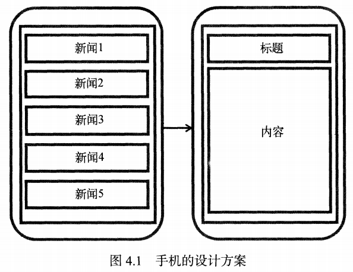

但如果我们在平板上也设计成这样的格式，新闻标题列表将会被拉伸至充满整个平板的屏幕，而新闻标题一般不会太长，这将导致界面中有大量空白区域：

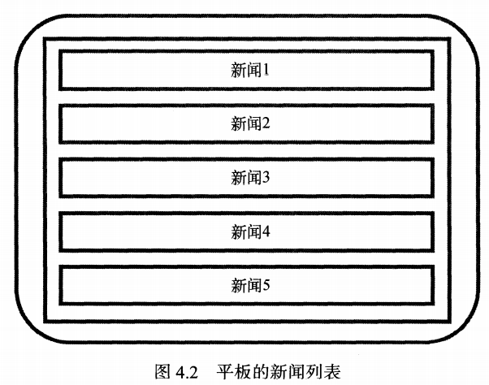

因此，我们可以将新闻标题界面和新闻详细内容界面分别放在两个Fragment中，在同一个Activity中引入这两个Fragment，这样就可以充分利用屏幕空间了：

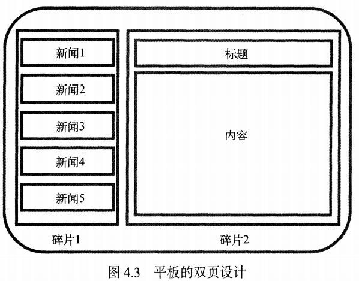


## 4.1	Fragment的使用

### 4.1.1	Fragment的简单使用

引入依赖：

```groovy
implementation 'com.android.support:appcompat-v7'
```

在一个Activity中使用两个Fragment，并让这两个Fragment平分Activity的空间：

创建左侧Fragment布局left_fragment.xml：

```xml
<?xml version="1.0" encoding="utf-8"?>
<LinearLayout xmlns:android="http://schemas.android.com/apk/res/android"
    android:orientation="vertical"
    android:layout_width="match_parent"
    android:layout_height="match_parent">

    <Button
        android:id="@+id/btn"
        android:layout_width="wrap_content"
        android:layout_height="wrap_content"
        android:layout_gravity="center_horizontal"
        android:text="Button"/>

</LinearLayout>
```

创建右侧Fragment布局right_fragment.xml：

```xml
<?xml version="1.0" encoding="utf-8"?>
<LinearLayout xmlns:android="http://schemas.android.com/apk/res/android"
    android:orientation="vertical"
    android:layout_width="match_parent"
    android:layout_height="match_parent">

    <TextView
        android:layout_width="wrap_content"
        android:layout_height="wrap_content"
        android:layout_gravity="center_horizontal"
        android:textSize="20sp"
        android:text="Right Fragment"/>

</LinearLayout>
```

创建class，命名为LeftFragment，继承adroidx.app.Fragment基类：

```java
public class LeftFragment extends Fragment {
    @Nullable
    @Override
    public View onCreateView(@NonNull LayoutInflater inflater, @Nullable ViewGroup container, @Nullable Bundle savedInstanceState) {
        View view = inflater.inflate(R.layout.left_fragment, container, false);
        return view;
    }
}
```

同理，创建RightFragment类，继承adroidx.app.Fragment基类：

```java
public class RightFragment extends Fragment {
    @Nullable
    @Override
    public View onCreateView(@NonNull LayoutInflater inflater, @Nullable ViewGroup container, @Nullable Bundle savedInstanceState) {
        View view = inflater.inflate(R.layout.right_fragment, container, false);
        return view;
    }
}
```

在MainActivity的布局activity_main.xml中引入刚才定义的两个Fragment：

```xml
<?xml version="1.0" encoding="utf-8"?>
<LinearLayout xmlns:android="http://schemas.android.com/apk/res/android"
    xmlns:tools="http://schemas.android.com/tools"
    android:layout_width="match_parent"
    android:layout_height="match_parent"
    tools:context=".MainActivity">

    <fragment
        android:id="@+id/fragment_left"
        android:name="com.example.fragmenttest.LeftFragment"
        android:layout_weight="1"
        android:layout_width="0dp"
        android:layout_height="match_parent"/>

    <fragment
        android:id="@+id/fragment_right"
        android:name="com.example.fragmenttest.RightFragment"
        android:layout_weight="1"
        android:layout_width="0dp"
        android:layout_height="match_parent"/>

</LinearLayout>
```

引入Fragment的步骤与其他组件基本一致，需要注意的是，我们还需要使用`android:name`属性来显式指明要添加的Fragment全类名：

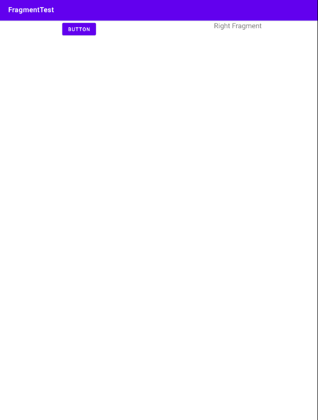


### 4.1.2	动态添加Fragment

Fragment真正的强大之处在于，可以在程序运行时，动态添加到Activity中。根据具体需求动态添加Fragment，才能将界面定制得更加多样化。

新建Fragment布局文件，命名为another_right_fragment.xml：

```xml
<?xml version="1.0" encoding="utf-8"?>
<LinearLayout
    xmlns:android="http://schemas.android.com/apk/res/android"
    android:orientation="vertical"
    android:background="#ffff00"
    android:layout_width="match_parent"
    android:layout_height="match_parent">

    <TextView
        android:layout_width="wrap_content"
        android:layout_height="wrap_content"
        android:layout_gravity="center_horizontal"
        android:textSize="20sp"
        android:text="Another Right Fragment"/>
    
</LinearLayout>
```

类似的，新建类AnotherRightFragment：

```java
public class AnotherRightFragment extends Fragment {
    @Nullable
    @Override
    public View onCreateView(@NonNull LayoutInflater inflater, @Nullable ViewGroup container, @Nullable Bundle savedInstanceState) {
        View view = inflater.inflate(R.layout.another_right_fragment, container, false);
        return view;
    }
}
```

在activity_main.xml中，将右侧的Fragment替换为FrameLayout：

```xml
<FrameLayout
    android:id="@+id/layout_right"
    android:layout_weight="1"
    android:layout_width="0dp"
    android:layout_height="match_parent"/>
```

由于我们只需要向布局中添加一个Fragment，因此使用FrameLayout十分方便。

在MainActivity中添加逻辑：

```java
public class MainActivity extends AppCompatActivity {

    @Override
    protected void onCreate(Bundle savedInstanceState) {
        super.onCreate(savedInstanceState);
        setContentView(R.layout.activity_main);
        Button button = findViewById(R.id.btn);
        MyOnClcikListener onClcikListener = new MyOnClcikListener();
        button.setOnClickListener(onClcikListener);
        replaceFragment(new RightFragment());
    }

    private class MyOnClcikListener implements View.OnClickListener{
        @Override
        public void onClick(View v) {
            int id = v.getId();
            if(id == R.id.btn){
                replaceFragment(new AnotherRightFragment());
            }
        }
    }

    private void replaceFragment(Fragment fragment){
        FragmentManager fragmentManager = getSupportFragmentManager();
        FragmentTransaction transaction = fragmentManager.beginTransaction();
        transaction.replace(R.id.layout_right, fragment);
        transaction.commit();
    }
}
```

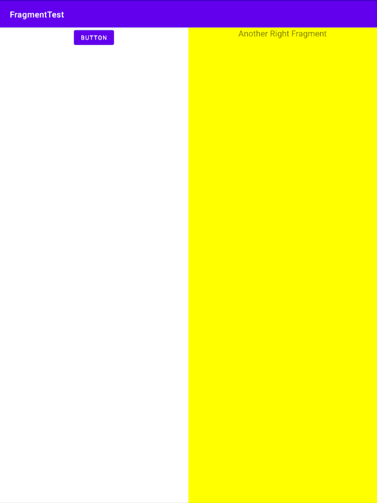

可以看到，我们首先为左侧Fragment中的Button添加了点击事件，当点击按钮就调用replaceFragment()方法，将右侧Fragment替换为AnotheRightFragment。

动态添加碎片的方法分为5步：

①创建待添加的碎片实例，如new AnotherRightFragment()

②获取FragmentManger，在Activity中可以直接通过调用getSupportFragmentManager()方法获取到

③开启事务，通过调用方法beginTransaction()开启

④向容器中添加或替换Fragment，通过replace()方法实现，需要传入容器ID和待添加的Fragment实例

⑤提交事务，调用commit()方法来完成


### 4.1.3	在Fragment中模拟返回栈

之前我们虽然实现了通过Button动态添加Fragment，但此时按下Back键仍然会直接退出程序到桌面。我们可以模仿类似于返回栈的效果，按下Back键后返回到上一个Fragment。

要实现这个功能很简单，只需要使用FragmentTransaction提供的addToBackStack()方法，可以将一个事务添加到返回栈中，修改MainActivity中的代码：

```java
private void replaceFragment(Fragment fragment){
    FragmentManager fragmentManager = getSupportFragmentManager();
    FragmentTransaction transaction = fragmentManager.beginTransaction();
    transaction.replace(R.id.layout_right, fragment);
    transaction.addToBackStack(null);
    transaction.commit();
}
```

这里，addToBackStack()方法需要传入一个字符串，用来描述返回栈的状态，一般传入null即可。这样我们就实现了将Fragment添加到返回栈的效果。


### 4.1.4	Fragment与Activity通信

虽然Fragment是嵌入Activity中显示的，但实际上它们之间的联系并不紧密。为了方便Fragment与Activity之间进行通信，

FragmentManger提供了一个类似于findViewById()的方法，专门用于从布局文件中获取Fragment实例：

```java
RightFragment rightFragment = (RightFragment) getSupportFragmentManager().findFragmentById(R.id.fragment_right);
```

同理，在Fragment中，只需要使用getActivity方法就能获取到与当前Fragment相关联的Activity实例：

```java
MainActivity mainActivity = (MainActivity) getActivity();
```

如果要在两个Fragment之间通信，首先需要从一个Fragment获取到当前Activity实例，再从Activity中获取到另一个Fragment的实例，这样就实现了两个Fragment之间通信。


## 4.2	Fragment生命周期

Fragment的生命周期与Activity十分相似

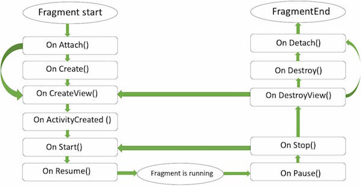

### 4.2.1	Fragment的状态与回调

Fragment有四个状态：

| 状态     | 描述                                                         |
| -------- | ------------------------------------------------------------ |
| 运行状态 | 当一个Fragment可见，且它关联的Activity处于运行状态时，该Fragment也处于运行状态 |
| 暂停状态 | 当一个Activity进入暂停状态（另一个未占满屏幕的Activity被添加到了栈顶），与它相关的可见Fragment将进入暂停状态 |
| 停止状态 | 当一个Activity进入停止状态时，相关的Fragment将进入停止状态。或调用FragmentTransaction的remove()、replace()方法将Fragment从Activity中移除，且在事务提交前调用addToBackStack()方法，此时Fragment也将进入停止状态。此时Fragment不可见，且可能被系统回收。 |
| 销毁状态 | Fragment总依附于Activity，当Activity被销毁时，与其相关的Fragment将进入销毁状态。或调用FragmentTransaction的remove()、replace()方法将Fragment从Activity中移除，且在事务提交前没有调用addToBackStack()方法，此时Fragment也将进入销毁状态。 |

这是在类fragment中你可以重写的方法列表：

- onAttach(): 碎片实例被关联到活动实例。碎片和活动还没有完全初始化。通常，你在该方法中获取到活动的引用，在碎片将来的初始化工作中被使用。

- onCreate(): 当创建碎片时，系统调用该方法。你需要初始化一些碎片的必要组件。这些组件是当碎片被暂停、停止时需要保留的，以便被恢复。

- onCreateView(): 当碎片将要第一次绘制它的用户界面时系统调用该方法。为了绘制碎片的UI，你需要从该方法中返回一个代表碎片根布局的View组件。如果该碎片不提供用户界面，直接返回null。

- onActivityCreated: 当宿主活动被创建，在onCreateView()方法之后调用该方法。活动和碎片实例与活动的视图层级被创建。这时，视图可以通过findViewById()方法来访问。在这个方法中，你可以实例化需要Context对象的对象。

- onStart(): 碎片可见时调用该方法。

- onResume(): 碎片可交互时调用该方法。

- onPause(): 当首次表明用户将要离开碎片时系统调用该方法。通常，这里你需要提交任何的会超出用户会话的持久化的变化。

- onStop(): 碎片将要被停止时调用。

- onDestroyView(): 调用该方法后，碎片将要被销毁。

- onDestroy(): 该方法被用来清理碎片的状态。但在Android平台并不保证一定被调用。

  

  需要注意的是，Fragment也可以使用onSaveInstanceState()方法存储数据，保存的数据在onCreate()、onCreateView()和onActivityCreated()这三个方法中都可以取得。


## 4.3	动态加载布局

本节讨论Android动态加载布局的方法

### 4.3.1	限定符

平板设备中，很多平板应用都会使用双页模式，即程序在左侧面板显示一个包含子项的列表，在右侧面板显示详细内容。

要在运行时判断程序应该使用单页模式还是双页模式，我们需要借助限定符Qualifier来实现。

修改布局activity_main.xml：

```xml
<?xml version="1.0" encoding="utf-8"?>
<LinearLayout xmlns:android="http://schemas.android.com/apk/res/android"
    xmlns:tools="http://schemas.android.com/tools"
    android:layout_width="match_parent"
    android:layout_height="match_parent"
    tools:context=".MainActivity">

    <fragment
        android:id="@+id/fragment_left"
        android:name="com.example.fragmenttest.LeftFragment"
        android:layout_width="match_parent"
        android:layout_height="match_parent"/>

</LinearLayout>
```

在res目录下新建layout-large文件夹，新建布局，也叫作activity_main.xml：

```xml
<?xml version="1.0" encoding="utf-8"?>
<LinearLayout xmlns:android="http://schemas.android.com/apk/res/android"
    xmlns:tools="http://schemas.android.com/tools"
    android:layout_width="match_parent"
    android:layout_height="match_parent"
    tools:context=".MainActivity"
    android:baselineAligned="false">

    <fragment
        android:id="@+id/fragment_left"
        android:name="com.example.fragmenttest.LeftFragment"
        android:layout_weight="1"
        android:layout_width="0dp"
        android:layout_height="match_parent"/>

    <fragment
        android:id="@+id/layout_right"
        android:name="com.example.fragmenttest.RightFragment"
        android:layout_weight="3"
        android:layout_width="0dp"
        android:layout_height="match_parent"/>

</LinearLayout>
```

可以看到,layout/activity_main布局只包含了一个Fragment，即单页模式；而layout-large布局包含两个Fragment，即双页模式。其中large就是一个限定符，屏幕被认为是large的设备就会运行layout-large下的布局，而其它设备将运行layout布局

将MainActivity中的replaceFragment()方法中的代码注释掉，用手机和平板设备分别运行程序：

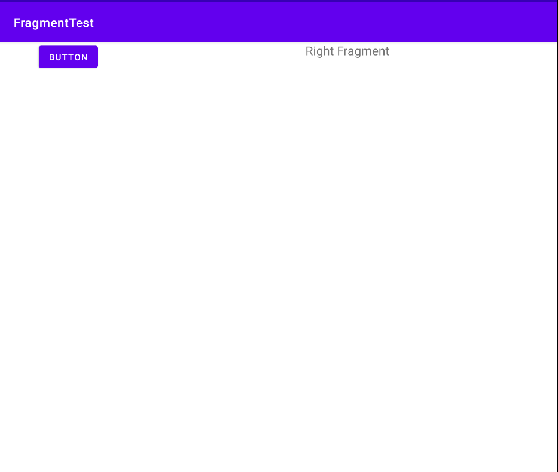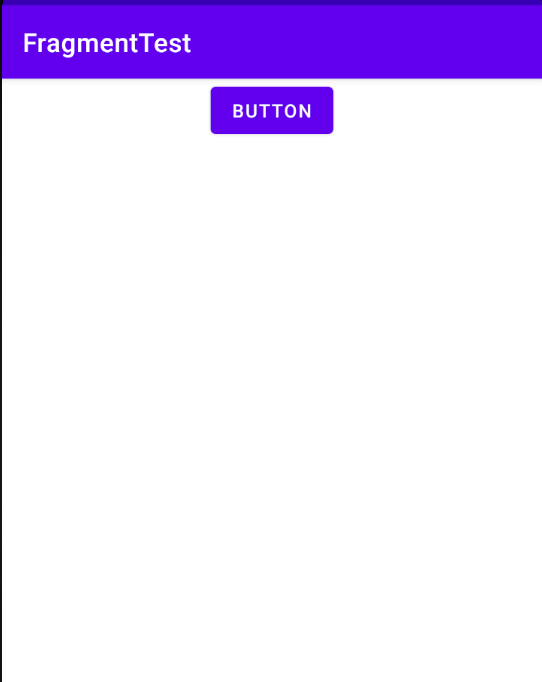

Android中常见限定符如下：

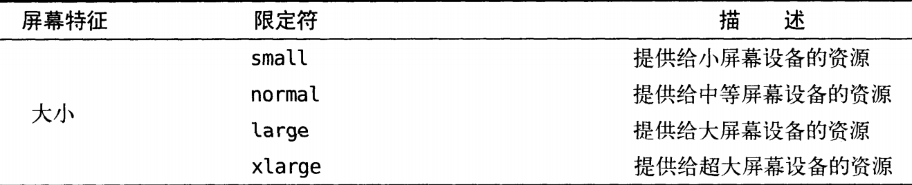

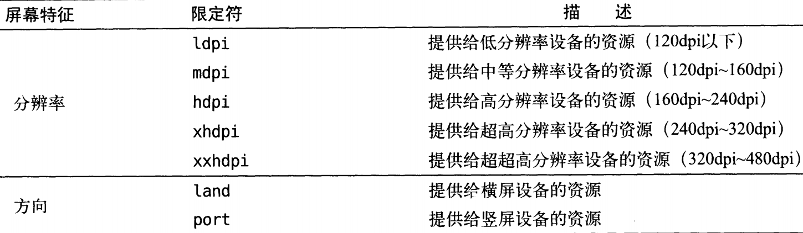


### 4.3.2	最小宽度限定符

large是多大？有时候，我们会希望能够更灵活地为不同设备加载布局，不管他们是不是被认定为large，这时可以使用最小宽度限定符Smallest-width Qualifier。

最小宽度限定符允许我们对屏幕宽度指定一个最小值(单位dp)，以这个最小值为临界点，屏幕宽度大于这个值的设备加载一个布局，小于这个值的设备加载另一个布局。例如在res目录下创建目录layout-sw600，同样添加一个activity_main.xml布局文件，当设备屏幕宽度大于600dp时将加载布局layout-sw600/activity_main，而当屏幕设备宽度小于600dp时，将加载布局layout/activity_main


### 4.4	新闻App制作

创建新闻实体类News：

```java
public class News {
    private String title;//新闻标题
    private String content;//新闻内容
}
```

新建布局文件news_content_frag.xml，作为新闻内容布局：

```xml
<?xml version="1.0" encoding="utf-8"?>
<RelativeLayout xmlns:android="http://schemas.android.com/apk/res/android"
    android:layout_width="match_parent" android:layout_height="match_parent">

    <LinearLayout
        android:id="@+id/visibility_layout"
        android:layout_width="match_parent"
        android:layout_height="match_parent"
        android:orientation="vertical"
        android:visibility="invisible">

        <!--新闻标题-->
        <TextView
            android:id="@+id/news_title"
            android:layout_width="match_parent"
            android:layout_height="wrap_content"
            android:gravity="center"
            android:padding="10dp"
            android:textSize="20sp"/>

        <!--分割线-->
        <View
            android:layout_width="match_parent"
            android:layout_height="1dp"
            android:background="#000"/>

        <!--新闻内容-->
        <TextView
            android:id="@+id/news_content"
            android:layout_width="match_parent"
            android:layout_height="0dp"
            android:layout_weight="1"
            android:padding="15dp"
            android:textSize="18sp"/>

    </LinearLayout>

    <!--分割线-->
    <View
        android:layout_width="1dp"
        android:layout_height="match_parent"
        android:layout_alignParentTop="true"
        android:background="#000"/>

</RelativeLayout>
```

创建一个NewsContentFragment类，用于显示新闻内容的Fragment：

```java
public class NewsContentFragment extends Fragment {

    private View view;

    @Nullable
    @Override
    public View onCreateView(@NonNull LayoutInflater inflater, @Nullable ViewGroup container, @Nullable Bundle savedInstanceState) {
        view = inflater.inflate(R.layout.news_content_frag, container, false);
        return view;
    }

    public void refresh(String newsTitleText, String newsContentText){
        View visibilityLayout = view.findViewById(R.id.visibility_layout);
        visibilityLayout.setVisibility(View.VISIBLE);
        TextView newsTitle = view.findViewById(R.id.news_title);
        TextView newsContent = view.findViewById(R.id.news_content);
        newsTitle.setText(newsTitleText);
        newsContent.setText(newsContentText);
    }
}
```

我们已经完成了双页模式布局的制作，接下来我们还要制作单页模式的布局，创建类NewsContentActivity，

创建布局news_content.xml：

```xml
<?xml version="1.0" encoding="utf-8"?>
<LinearLayout xmlns:android="http://schemas.android.com/apk/res/android"
    android:orientation="vertical" android:layout_width="match_parent"
    android:layout_height="match_parent">

    <fragment
        android:id="@+id/news_content_fragment"
        android:name="com.example.fragmenttest.NewsContentFragment"
        android:layout_width="match_parent"
        android:layout_height="match_parent"/>

</LinearLayout>
```

这里我们充分发挥了代码的复用性，直接在布局中引入了NewsContentFragment，相当于将news_content_frag的内容加了进来。

修改NewsContentActivity内容：

```java
public class NewsContentActivity extends AppCompatActivity {

    public static void actionStart(Context context, String newsTitle, String newsContent){
        Intent intent = new Intent(context, NewsContentActivity.class);
        intent.putExtra("news_title", newsTitle);
        intent.putExtra("news_content", newsContent);
        context.startActivity(intent);
    }

    @Override
    protected void onCreate(Bundle savedInstanceState) {
        super.onCreate(savedInstanceState);
        setContentView(R.layout.news_content);
        String newsTitle = getIntent().getStringExtra("news_title");
        String newsContent = getIntent().getStringExtra("news_content");
        NewsContentFragment newsContentFragment = (NewsContentFragment)
                getSupportFragmentManager().findFragmentById(R.id.news_content_fragment);
        if (newsContentFragment != null) {
            newsContentFragment.refresh(newsTitle, newsContent);
        }
    }
}
```

创建用于显示新闻列表的布局news_title_frag.xml：

```xml
<?xml version="1.0" encoding="utf-8"?>
<LinearLayout xmlns:android="http://schemas.android.com/apk/res/android"
    android:orientation="vertical" android:layout_width="match_parent"
    android:layout_height="match_parent">

    <androidx.recyclerview.widget.RecyclerView
        android:id="@+id/news_title_recycler_view"
        android:layout_width="match_parent"
        android:layout_height="match_parent"/>

</LinearLayout>
```

再创建news_item.xml布局，作为上个布局中RecyclerView的子项布局：

```xml
<?xml version="1.0" encoding="utf-8"?>
<TextView
    xmlns:android="http://schemas.android.com/apk/res/android"
    android:id="@+id/news_title"
    android:layout_height="wrap_content"
    android:layout_width="match_parent"
    android:singleLine="true"
    android:ellipsize="end"
    android:textSize="18sp"
    android:paddingTop="15dp"
    android:paddingBottom="15dp"
    android:paddingStart="10dp"
    android:paddingEnd="10dp"/>
```

news_item的布局非常简单，只有一个TextView。其中`android:padding`属性表示为控件周围补白，不至于让文本紧靠边缘；

android:singleLine="true"表示该TextView单行显示；android:ellipsesize表示当文本超出TextView宽度时，文本的缩略方式，赋值end表示在尾部缩略。


创建好了新闻列表和列表子项的布局之后，我们还要创建单页模式和双页模式的布局：

修改layout/activity_main中的布局：

```xml
<?xml version="1.0" encoding="utf-8"?>
<FrameLayout xmlns:android="http://schemas.android.com/apk/res/android"
    xmlns:tools="http://schemas.android.com/tools"
    android:layout_width="match_parent"
    android:layout_height="match_parent"
    tools:context=".MainActivity"
    android:id="@+id/news_title_layout">

    <fragment
        android:id="@+id/news_title_fragment"
        android:name="com.example.fragmenttest.NewsTitleFragment"
        android:layout_width="match_parent"
        android:layout_height="match_parent"/>

</FrameLayout>
```

在该布局中，我们只添加了一个Fragment，作为单页模式的布局。

在res目录下新建目录layout-large，创建布局activity_main：

```xml
<?xml version="1.0" encoding="utf-8"?>
<LinearLayout xmlns:android="http://schemas.android.com/apk/res/android"
    xmlns:tools="http://schemas.android.com/tools"
    android:layout_width="match_parent"
    android:layout_height="match_parent"
    tools:context=".MainActivity"
    android:baselineAligned="false">

    <fragment
        android:id="@+id/fragment_left"
        android:name="com.example.fragmenttest.NewsTitleFragment"
        android:layout_weight="1"
        android:layout_width="0dp"
        android:layout_height="match_parent"/>

    <FrameLayout
        android:id="@+id/news_content_layout"
        android:layout_width="0dp"
        android:layout_weight="3"
        android:layout_height="match_parent">

        <fragment
            android:id="@+id/news_content_fragment"
            android:name="com.example.fragmenttest.NewsContentFragment"
            android:layout_width="match_parent"
            android:layout_height="match_parent"/>

    </FrameLayout>

</LinearLayout>
```

在该布局中，我们使用了两个Fragment，作为双页模式的布局。同时我们将展示新闻内容的布局放在FrameLayout中，该帧布局的id为news_content_layout，即当该id的布局存在时，应为双页模式；反之为单页模式。


最后，我们要创建一个展示新闻列表的地方，我们选择Fragment来展示新闻列表，创建class NewsTitleFragment：

```java
public class NewsTitleFragment extends Fragment {

    private static boolean isDoublePages;

    @Override
    public void onActivityCreated(@Nullable Bundle savedInstanceState) {
        super.onActivityCreated(savedInstanceState);
        if(getActivity().findViewById(R.id.news_content_layout)!=null){
            isDoublePages = true;
        }else{
            isDoublePages = false;
        }//findViewById()方法能找到id为news_content_layout的组件，即表示layout-large/activity_main.xml存在
        //即应使用双页模式，反之应使用单页模式。
    }

    private List<News> getNews(){
        List<News> newsList = new ArrayList<>();
        for(int i=1; i<=50; i++){//循环产生50个News
            News news = new News();
            news.setTitle("This is news title" + i);
            news.setContent(getRandomLengthContent("This is news content" + i +"."));
            newsList.add(news);
        }
        return newsList;
    }

    //利用Random类产生随机长度的字符串
    private String getRandomLengthContent(String content){
        Random random = new Random();
        int length = random.nextInt(20)+1;//随机字符串长度为1~20
        StringBuilder builder = new StringBuilder();
        for (int i =0; i<length; i++){
            builder.append(content);
        }
        return builder.toString();
    }

    @Nullable
    @Override
    public View onCreateView(@NonNull LayoutInflater inflater, @Nullable ViewGroup container, @Nullable Bundle savedInstanceState) {
        //引入新闻列表布局
        View view = inflater.inflate(R.layout.news_title_frag, container, false);
        //创建RecyclerView
        RecyclerView newsTitleRecyclerView = view.findViewById(R.id.news_title_recycler_view);
        //为RecyclerView设置LinearLayoutManager
        newsTitleRecyclerView.setLayoutManager(new LinearLayoutManager(getActivity()));
        //为RecyclerView设置适配器
        newsTitleRecyclerView.setAdapter(new NewsAdapter(getNews()));
        return view;
    }


    private class NewsAdapter extends RecyclerView.Adapter<NewsAdapter.ViewHolder>{

        private List<News> mNewsList;

        class ViewHolder extends RecyclerView.ViewHolder{

            TextView newsTitle;

            public ViewHolder(View view){
                super(view);
                newsTitle = view.findViewById(R.id.news_title);
            }
        }

        public NewsAdapter(List<News> news){
            mNewsList = news;
        }

        @NonNull
        @Override
        public ViewHolder onCreateViewHolder(@NonNull ViewGroup parent, int viewType) {
            View view = LayoutInflater.from(parent.getContext())
                    .inflate(R.layout.news_item, parent, false);
            final ViewHolder holder = new ViewHolder(view);
            view.setOnClickListener(new View.OnClickListener() {
                @Override
                public void onClick(View v) {
                    News news = mNewsList.get(holder.getAdapterPosition());
                    if(isDoublePages){//若为双页模式，刷新NewsContentFragment中内容
                        NewsContentFragment fragment = (NewsContentFragment) getFragmentManager()
                                .findFragmentById(R.id.news_content_fragment);
                        fragment.refresh(news.getTitle(), news.getContent());
                    }else{//若单页模式则直接启动NewsContentActivity
                        NewsContentActivity
                                .actionStart(getActivity(), news.getTitle(), news.getContent());
                    }
                }
            });
            return holder;
        }

        @Override
        public void onBindViewHolder(@NonNull ViewHolder holder, int position) {
            News news = mNewsList.get(position);
            holder.newsTitle.setText(news.getTitle());
        }

        @Override
        public int getItemCount() {
            return mNewsList.size();
        }
    }
}
```

分别运行平板设备和手机，查看效果：

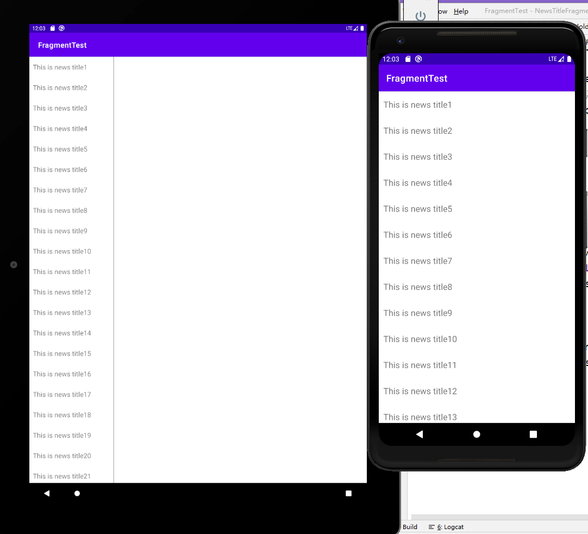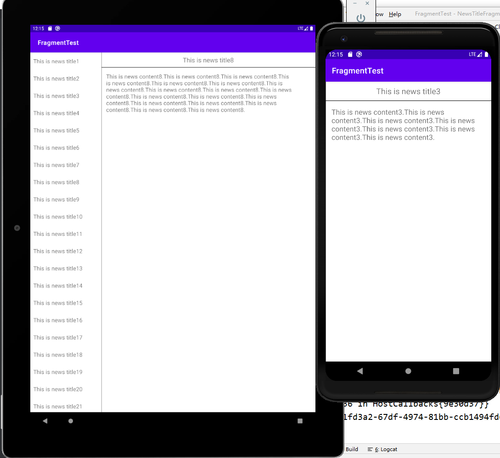

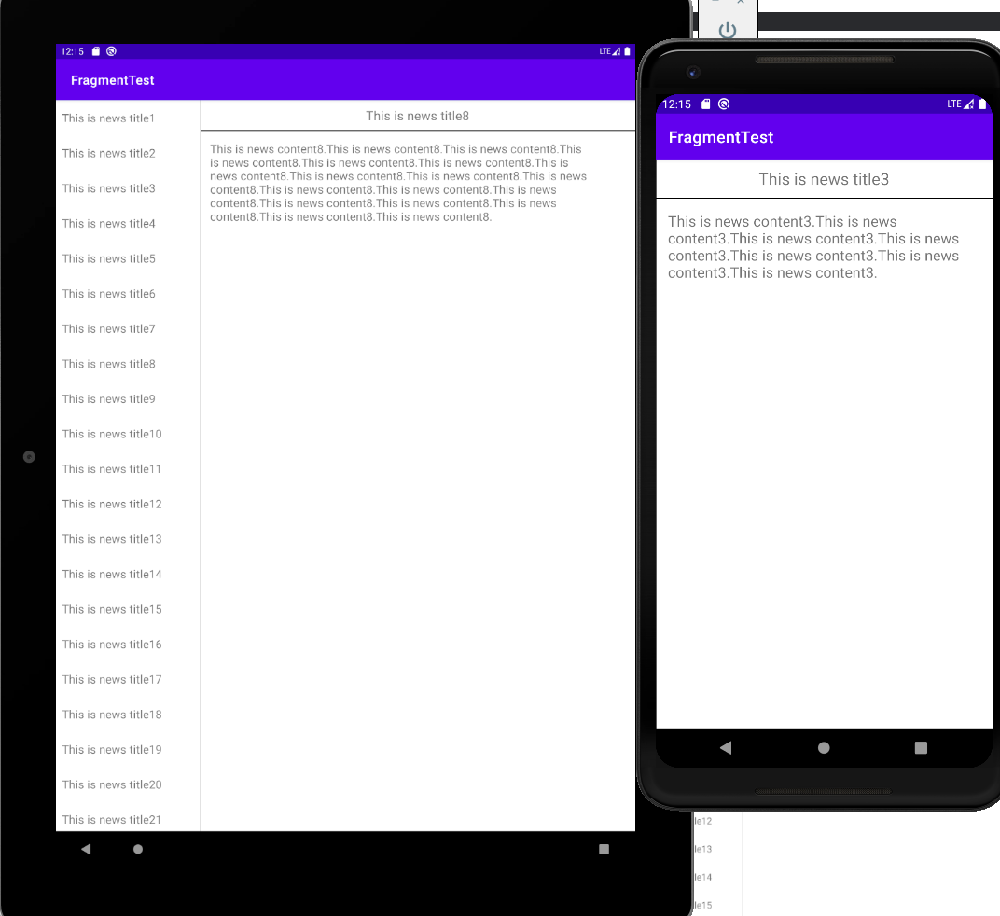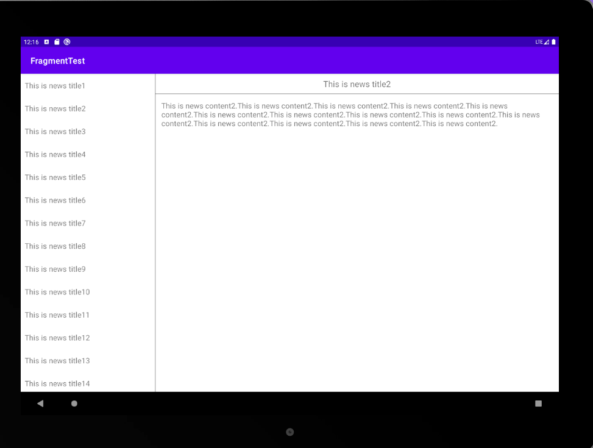

