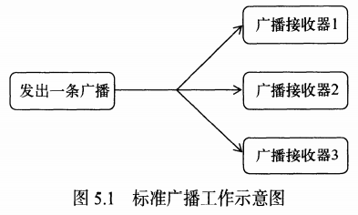
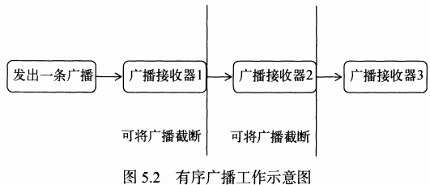

# 5.	广播

## 5.1	广播概述

在Android中，每个程序都可以对自己感兴趣的广播进行注册，这样该程序就只会接收到自己关心的广播内容，这些广播可能是来自系统的，也可能是来自其他应用程序。

Android提供了一套完整的API，允许程序自由发送和接收广播。发送广播只需要使用Intent即可，而接收广播需要使用广播接收器Broadcast Receiver

Android中的广播分为两种：

- **标准广播Normal Broadcast**：这是一种完全异步执行的广播，在广播发出之后，所有广播接收器几乎会在同一时刻接收到这条广播信息，因此它们之间没有任何先后顺序。这种广播的效率比较高，但这也意味着不可截断，其工作流程如下：



- **有序广播Ordered Broadcast**：这是一种同步执行的广播，在广播发出后，同一时刻只有一个广播接收器能接收到这条广播消息，当这个广播接收器的逻辑执行完毕后广播才会继续传递。此时广播接收器有传递的先后顺序，优先级高的广播接收器会先收到广播消息，并且前面的广播接收器可以截断正在传递的广播，这样后面的广播接收器将无法收到这条广播消息。其工作流程如下：

  


## 5.2	接收系统广播

Android内置了许多系统级别的广播，我们可以通过应用程序监听广播来得到各种系统状态信息。如开机后会发出一条广播，电池电量变化会发出广播，时间或时区变化也会发出广播。

### 5.2.1	动态注册监听网络变化

广播接收器可以自由地对自己感兴趣的广播进行注册，这样广播接收器就只接收自己需要的广播消息，并在内部处理逻辑。

注册广播的方式一般有两种：在代码中注册（动态注册）和在AndroidManifest.xml中注册（静态注册）

要创建广播接收器，只需要新建一个类并继承基类BroadcastReceiver，重写onReceive()方法，在其中处理接收到广播消息后的逻辑即可。

```java
public class MainActivity extends AppCompatActivity {

    private IntentFilter intentFilter;

    private NetworkChangeReceiver networkChangeReceiver;

    @Override
    protected void onCreate(Bundle savedInstanceState) {
        super.onCreate(savedInstanceState);
        setContentView(R.layout.activity_main);
        intentFilter = new IntentFilter();
        intentFilter.addAction("android.net.conn.CONNECTIVITY_CHANGE");
        networkChangeReceiver = new NetworkChangeReceiver();
        registerReceiver(networkChangeReceiver, intentFilter);
    }

    @Override
    protected void onDestroy() {
        super.onDestroy();
        unregisterReceiver(networkChangeReceiver);
    }

    private static class NetworkChangeReceiver extends BroadcastReceiver{

        @Override
        public void onReceive(Context context, Intent intent) {
            //通过getSystemService()方法获取ConnectivityManager实例，这是专门用于管理网络连接的系统服务类
            ConnectivityManager manager = (ConnectivityManager) context.getSystemService(CONNECTIVITY_SERVICE);
            //调用ConnectivityManager实例的getActiveNetworkInfo()方法，获取NetworkInfo实例，查看网络信息
            NetworkInfo networkInfo = manager.getActiveNetworkInfo();
            if(networkInfo!=null && networkInfo.isAvailable()){
                Toast.makeText(context, "Network is now available", Toast.LENGTH_SHORT).show();
            }else{
                Toast.makeText(context, "Network is now unavailable", Toast.LENGTH_SHORT).show();
            }
        }
    }
}
```

我们通过IntentFilter来过滤Intent，只关注目标内容，通过addAction()方法添加目标内容；另外我们的自定义BroadcastReceiver通过registerReceiver()方法监听广播，要注意需要在Activity销毁，即onDestroy()方法使用unregisterReceiver()方法取消注册。

我们通过开关模拟器的移动数据就可以更改网络状态了：


**需要引起注意的是，Android系统为了保护用户设备的安全和隐私，对程序的权限有严格限制，若程序需要做一些对用户来说比较敏感的操作，就必须在配置文件中声明所需权限，否则程序将直接崩溃。**


这里我们需要访问网络权限，这个权限的限制比较少，只需要在AndroidManifest.xml中声明即可：

```xml
...
package="com.example.myapplication6">

<uses-permission android:name="android.permission.ACCESS_NETWORK_STATE" />
<application
             ...
```


### 5.2.2	静态注册实现开机启动

动态注册的广播接收器最大的好处是可以自由控制注册和开销，灵活性好；但其缺点是必须在程序启动后才能收到广播，因为注册的逻辑位于onCreate()方法中。想要不启动程序也能接收广播，就要使用静态注册。

这里我们让程序接收开机广播，当收到广播后在onReceive()方法中启动程序，从而实现开机启动的功能。我们可以使用Android Studio提供的快速创建广播接收器选项：


这里Exported表示是否接收程序之外的广播，Enabled表示是否启用该广播接收器，将两项都勾选，选择Finish完成创建：


使用静态注册方式的广播接收器需要在AndroidManifest.xml中进行注册，不过这一步AS已经帮我们完成了：

```xml
<receiver
    android:name=".MyReceiver"
    android:enabled="true"
    android:exported="true"></receiver>
```

`android:name`属性指定我们要注册的具体广播接收器，enabled和exported属性则是根据我们的勾选自动生成

我们需要在<receiver>标签中使用子标签<intent-filter>来添加Intent，即目标监听内容：

```xml
<intent-filter>
    <action android:name="android.intent.action.BOOT_COMPLETED"/>
</intent-filter>
```


**需要注意的是，不要在onReceive()方法中添加过多逻辑或进行任何耗时操作，因为广播接收器中不允许开启线程，若方法运行时间过长而没有结束就会导致程序错误。**

因此广播接收器更多做的是打开程序的其他组件，比如创建一条状态栏通知，或者启动一个服务等。


## 5.3	发送自定义广播

注意：从Android 8.0系统之后，为了提高电池续航时间，提高设备性能，系统会限制未在前台运行的应用的某些行为，如：

- 在后台运行的应用对后台服务的访问受到限制


- 应用无法使用其清单注册大部分隐式广播（即并非专门针对次应用的广播）

 对广播的限制具体可以查看一下Android 8.0 API 介绍     https://developer.android.google.cn/about/versions/oreo/background

 解决方法：

- 尽量使用动态广播代替静态广播
- 如果动态广播不能满足你的需求，必须要使用静态广播的话，那么就得在 Intent 中设置参数 Component参数，然后其他注册广播的步骤和原来在 Android 6.0 系统以下注册的方法一样。

```java
//通过Intent携带要发送的广播
Intent intent = new Intent("com.example.myapplication6.MY_BROADCAST");
//需要注意 静态注册的接收器需要使用intent的setComponent()方法，传入的参数分别为包名和接收器全类名，否则接收器无法接收到广播
intent.setComponent(new ComponentName("com.example.myapplication6","com.example.myapplication6.MyBroadcastReceiver"));
//调用Context的sendBroadcast()方法发送广播
sendBroadcast(intent);
```


### 5.3.1	发送标准广播

首先准备广播接收器MyBroadcastReceiver和AnotherBroadcastReceiver：

由于我们是监听程序内的广播，因此我们只需要使用更为灵活的动态注册即可，同时为接下来的有序广播作准备：

```java
public class MainActivity extends AppCompatActivity{

    private MyBroadcastReceiver myBroadcastReceiver;

    private AnotherBroadcastReceiver anotherBroadcastReceiver;

    private IntentFilter intentFilter;

    @Override
    protected void onCreate(@Nullable Bundle savedInstanceState) {
        super.onCreate(savedInstanceState);
        setContentView(R.layout.activity_main);
        intentFilter = new IntentFilter();//实例化Intent过滤器
        intentFilter.addAction("com.example.myapplication6.MY_BROADCAST");//指定接收自定义广播
        myBroadcastReceiver = new MyBroadcastReceiver();//实例化广播接收器
        anotherBroadcastReceiver = new AnotherBroadcastReceiver();
        registerReceiver(myBroadcastReceiver, intentFilter);//注册广播接收器
        registerReceiver(anotherBroadcastReceiver, intentFilter);
        Button button = findViewById(R.id.btn_broadcast);
        button.setOnClickListener(new View.OnClickListener() {//点击按钮发送自定义广播
            @Override
            public void onClick(View v) {
                Intent intent = new Intent("com.example.myapplication6.MY_BROADCAST");
                sendBroadcast(intent);
            }
        });
    }

    @Override
    protected void onDestroy() {
        super.onDestroy();
        unregisterReceiver(myBroadcastReceiver);
        unregisterReceiver(anotherBroadcastReceiver);
    }

    private static class AnotherBroadcastReceiver extends BroadcastReceiver {

        @Override
        public void onReceive(Context context, Intent intent) {
            Toast.makeText(context, "received in AnotherBroadcastReceiver", Toast.LENGTH_SHORT).show();
        }
    }

    private static class MyBroadcastReceiver extends BroadcastReceiver {

        @Override
        public void onReceive(Context context, Intent intent) {
            Toast.makeText(context, "received in MyBroadcastReceiver", Toast.LENGTH_SHORT).show();
        }
    }
}
```


可以看到，发送标准广播可以让多个广播接收器同时接收到。


### 5.3.2	发送有序广播

广播是一种可以跨进程的通信方式，因此我们发出的广播，其他程序也能接收到。

```java
public class MainActivity extends AppCompatActivity{

    private MyBroadcastReceiver myBroadcastReceiver;

    private AnotherBroadcastReceiver anotherBroadcastReceiver;


    @Override
    protected void onCreate(@Nullable Bundle savedInstanceState) {
        super.onCreate(savedInstanceState);
        setContentView(R.layout.activity_main);
        IntentFilter myFilter = new IntentFilter();//实例化Intent过滤器
        IntentFilter anotherFilter = new IntentFilter();
        myFilter.setPriority(100);//为IntentFilter设置优先级
        anotherFilter.setPriority(200);
        anotherFilter.addAction("com.example.myapplication6.MY_BROADCAST");
        myFilter.addAction("com.example.myapplication6.MY_BROADCAST");//指定接收自定义广播
        myBroadcastReceiver = new MyBroadcastReceiver();//实例化广播接收器
        anotherBroadcastReceiver = new AnotherBroadcastReceiver();
        registerReceiver(myBroadcastReceiver, myFilter);//注册广播接收器
        registerReceiver(anotherBroadcastReceiver, anotherFilter);
        Button button = findViewById(R.id.btn_broadcast);
        button.setOnClickListener(new View.OnClickListener() {//点击按钮发送自定义广播
            @Override
            public void onClick(View v) {
                Intent intent = new Intent("com.example.myapplication6.MY_BROADCAST");
                sendOrderedBroadcast(intent, null);
                //sendOrderedBroadcast()用于发送有序广播，第二个参数传入与权限相关的字符串，这里使用null即可
            }
        });
    }

    @Override
    protected void onDestroy() {
        super.onDestroy();
        unregisterReceiver(myBroadcastReceiver);
        unregisterReceiver(anotherBroadcastReceiver);
    }

    private static class AnotherBroadcastReceiver extends BroadcastReceiver {

        @Override
        public void onReceive(Context context, Intent intent) {
            Toast.makeText(context, "received in AnotherBroadcastReceiver", Toast.LENGTH_SHORT).show();
            abortBroadcast();//截止广播 优先级低于该接收器，即在该接收器之后接收的接收器将无法接收到这条广播
        }
    }

    private static class MyBroadcastReceiver extends BroadcastReceiver {

        @Override
        public void onReceive(Context context, Intent intent) {
            Toast.makeText(context, "received in MyBroadcastReceiver", Toast.LENGTH_SHORT).show();
            abortBroadcast();
        }
    }
}
```

运行程序：


我们看到AnotherBroadcastReceiver接收到了广播而MyBroadcastReceiver则没有，这说明优先级数值越大，优先级越高。

在静态注册时，设置优先级的方法为：在<intent-filter>标签的属性`android:priority`中进行设置：

```xml
<receiver
    android:name=".MyReceiver"
    android:enabled="true"
    android:exported="true">
    <intent-filter android:priority="100">
        <action android:name="android.intent.action.BOOT_COMPLETED" />
    </intent-filter>
</receiver>
```

同时广播接收器接收广播的规则如下：

情况1：当广播为标准广播时

如果一条广播是标准广播，那么广播接收器的启动快慢跟设置的优先级无关，而是跟广播接收器的注册方式有关：动态注册的接收器要优先于静态注册的接收器启动，如果是注册方式相同，则跟注册的先后有关：先注册的动态接收器优先后注册的动态接收器启动，静态同理。

情况2：当广播为有序广播时

如果一条广播是有序广播，则跟设置的优先级有关：1.无论静态和动态接收器，优先级高的先接收。2.当优先级相同时，动态的接收器优先于静态接收器接收。3.当优先级和注册方式都相同时：先注册的接收器先接收。


## 5.4	本地广播

之前我们发送和接收的广播都属于系统全局广播，即发出的广播可以被其他任何应用程序接收到，并且我们也可以接收来自其他任何应用的广播。这样会造成安全性问题，为了解决这个问题，我们可以使用本地广播，这样发出的广播只会在应用内部传递，并且广播接收器也只能接收来自本应用发出的广播，从而解决了安全性问题。

本地广播其实是使用了LocalBroadcastManager对广播进行管理，并提供了广播的发送和注册广播接收器的方法。

需要注意：

> This class is deprecated.
> LocalBroadcastManager is an application-wide event bus and embraces layer violations in your app: any component may listen events from any other. You can replace usage of LocalBroadcastManager with other implementation of observable pattern, depending on your usecase suitable options may be LiveData or reactive streams.

LocalBroadcastManager已经过时，但暂时我们还没有替代方案，因此我们需要在gradle中重新引入LocalBroadcastManager：

```groovy
implementation 'androidx.localbroadcastmanager:localbroadcastmanager:1.0.0'
```

```java
public class MainActivity extends AppCompatActivity {

    private LocalReceiver localReceiver;

    private LocalBroadcastManager localBroadcastManager;

    private IntentFilter intentFilter;


    @Override
    protected void onCreate(Bundle savedInstanceState) {
        super.onCreate(savedInstanceState);
        setContentView(R.layout.activity_main);
        intentFilter = new IntentFilter();
        localReceiver = new LocalReceiver();
        localBroadcastManager = LocalBroadcastManager.getInstance(this);//获取实例
        Button button = findViewById(R.id.btn_broadcast);
        intentFilter.addAction("com.example.myapplication6.LOCAL_BROADCAST");
        localBroadcastManager.registerReceiver(localReceiver, intentFilter);//注册广播接收器

        button.setOnClickListener(new View.OnClickListener() {
            @Override
            public void onClick(View v) {
                Intent intent = new Intent("com.example.myapplication6.LOCAL_BROADCAST");
                localBroadcastManager.sendBroadcast(intent);
            }
        });

    }

    @Override
    protected void onDestroy() {
        super.onDestroy();
        localBroadcastManager.unregisterReceiver(localReceiver);
    }


    private static class LocalReceiver extends BroadcastReceiver{
        @Override
        public void onReceive(Context context, Intent intent) {
            Toast.makeText(context, "received in LocalReceiver", Toast.LENGTH_SHORT).show();
        }
    }
}
```

其实本地广播的操作与普通广播基本一致，只是首先要调用LocalBroadcastManager.getInstance()方法获取LocalBroadcastManager实例，并且注册接收器registerReceiver()、取消注册接收器unregisterReceiver()和发送广播sendBroadcast()都要通过LocalBroadcastManager实例调用，这样我们才能保证广播和广播接收器都只在该程序内传递和接收。


## 5.5	本地广播实现强制下线功能

要实现强制下线功能其实很简单，只需要广播接收器接收到强制下线广播后，弹出一个只有确定按钮的提示框，先销毁全部Activity，再回到登录界面即可。

要实现Activity的全部销毁，我们需要先实现Activity管理器类ActivityCollector，这在第二章Activity我们就已经使用过了：

```java
public class ActivityCollector {

    private static List<Activity> activityList = new ArrayList<>();

    public static void addActivity(Activity activity){
        activityList.add(activity);
    }

    public static void removeActivity(Activity activity){
        activityList.remove(activity);
    }

    public static void removeAll(){
        for (Activity activity:activityList) {
            if(!activity.isFinishing()){
                activity.finish();
            }
        }
    }
}
```

创建BaseActivity作为所有Activity的基类，用ActivityCollector管理：

```java
public class BaseActivity extends AppCompatActivity {
    @Override
    protected void onCreate(@Nullable Bundle savedInstanceState) {
        super.onCreate(savedInstanceState);
        ActivityCollector.addActivity(this);
    }

    @Override
    protected void onDestroy() {
        super.onDestroy();
        ActivityCollector.removeActivity(this);
    }
}
```

创建登录界面的Activity，命名为LoginActivity：

修改activity_login的布局：

```xml
<?xml version="1.0" encoding="utf-8"?>
<LinearLayout xmlns:android="http://schemas.android.com/apk/res/android"
    android:orientation="vertical" android:layout_width="match_parent"
    android:layout_height="match_parent">

    <LinearLayout
        android:layout_width="match_parent"
        android:layout_height="60dp"
        android:orientation="horizontal">
        
        <TextView
            android:layout_width="90dp"
            android:layout_height="wrap_content"
            android:layout_gravity="center_vertical"
            android:textSize="18sp"
            android:text="Account:"/>

        <EditText
            android:id="@+id/account"
            android:singleLine="true"
            android:hint="Account"
            android:layout_width="0dp"
            android:layout_height="wrap_content"
            android:layout_weight="1"
            android:layout_gravity="center_vertical"/>
        
    </LinearLayout>

    <LinearLayout
        android:layout_width="match_parent"
        android:layout_height="60dp"
        android:orientation="horizontal">

        <TextView
            android:layout_width="90dp"
            android:layout_height="wrap_content"
            android:layout_gravity="center_vertical"
            android:textSize="18sp"
            android:text="Password:"/>

        <EditText
            android:id="@+id/password"
            android:hint="Password"
            android:singleLine="true"
            android:textIsSelectable="false"
            android:inputType="textPassword"
            android:layout_width="0dp"
            android:layout_height="wrap_content"
            android:layout_weight="1"
            android:layout_gravity="center_vertical"/>

    </LinearLayout>

    <Button
        android:id="@+id/btn_login"
        android:text="Login"
        android:layout_width="wrap_content"
        android:layout_height="wrap_content"
        android:layout_gravity="center_horizontal"/>

</LinearLayout>
```

在LoginActivity中添加逻辑：

```java
public class LoginActivity extends BaseActivity{

    private Button loginButton;

    private EditText accountEditText;

    private EditText passwordEditText;

    @Override
    protected void onCreate(@Nullable Bundle savedInstanceState) {
        super.onCreate(savedInstanceState);
        setContentView(R.layout.activity_login);
        loginButton = findViewById(R.id.btn_login);
        accountEditText = findViewById(R.id.account);
        passwordEditText = findViewById(R.id.password);
        loginButton.setOnClickListener(new View.OnClickListener() {
            @Override
            public void onClick(View v) {
                String account = accountEditText.getText().toString();
                String password = passwordEditText.getText().toString();
                if(account.equals("admin") && password.equals("123456")){//假定账号为admin,密码为123456
                    Intent intent = new Intent(LoginActivity.this, MainActivity.class);
                    startActivity(intent);
                    finish();//若登录成功则跳转到MainAcitity并销毁该Activity
                }else{
                    Toast.makeText(LoginActivity.this, "Invalid Account or Password", Toast.LENGTH_SHORT).show();
                }
            }
        });
    }
}

```


在MainActivity中只需要一个用于发送强制下线通知的Button即可：

```xml
<?xml version="1.0" encoding="utf-8"?>
<LinearLayout xmlns:android="http://schemas.android.com/apk/res/android"
    xmlns:tools="http://schemas.android.com/tools"
    android:layout_width="match_parent"
    android:layout_height="match_parent"
    tools:context=".MainActivity">

    <Button
        android:id="@+id/btn_offline_broadcast"
        android:text="Make An Offline Broadcast"
        android:layout_width="match_parent"
        android:layout_height="wrap_content"/>

</LinearLayout>
```

```java
public class MainActivity extends BaseActivity{

    @Override
    protected void onCreate(@Nullable Bundle savedInstanceState) {
        super.onCreate(savedInstanceState);
        setContentView(R.layout.activity_main);
        Button offlineBroadcastSender = findViewById(R.id.btn_offline_broadcast);
        offlineBroadcastSender.setOnClickListener(new View.OnClickListener() {
            @Override
            public void onClick(View v) {
                Intent intent = new Intent("com.example.myapplication6.FORCE_OFFLINE_BROADCAST");
                sendBroadcast(intent);
            }
        });
    }
}
```

这样，我们已经做好了准备工作，接下来就该编写广播接收器了。

但问题同样来了：静态注册的广播接收器不能在onReceive()方法中弹出一个对话框，而在每个Activity中注册一个动态的广播接收器显然也不现实。

因此，我们应当在基类BaseActivity中进行广播接收器的动态注册：

```java
public class BaseActivity extends AppCompatActivity {

    private OfflineBroadcastReceiver offlineBroadcastReceiver;

    @Override
    protected void onCreate(@Nullable Bundle savedInstanceState) {
        super.onCreate(savedInstanceState);
        ActivityCollector.addActivity(this);
    }

    @Override
    protected void onResume() {//在onResume()方法中实例化接收器并注册
        super.onResume();
        IntentFilter intentFilter = new IntentFilter();
        intentFilter.addAction("com.example.myapplication6.FORCE_OFFLINE_BROADCAST");
        offlineBroadcastReceiver = new OfflineBroadcastReceiver();
        registerReceiver(offlineBroadcastReceiver, intentFilter);
    }

    @Override
    protected void onPause() {//在onPause()方法中取消注册接收器，减少占用
        super.onPause();
        if(offlineBroadcastReceiver!=null){
            unregisterReceiver(offlineBroadcastReceiver);
            offlineBroadcastReceiver = null;
        }
    }

    @Override
    protected void onDestroy() {
        super.onDestroy();
        ActivityCollector.removeActivity(this);
    }

    private static class OfflineBroadcastReceiver extends BroadcastReceiver{
        @Override
        public void onReceive(Context context, Intent intent) {
            AlertDialog.Builder builder = new AlertDialog.Builder(context);//创建弹出对话框
            builder.setTitle("Forced offline reminder");//设置标题
            builder.setMessage("You are forced to be offline. Please try to login again.");//设置内容
            builder.setCancelable(false);//对话框不可取消
            builder.setPositiveButton("OK", new DialogInterface.OnClickListener() {
                @Override
                public void onClick(DialogInterface dialog, int which) {
                    ActivityCollector.removeAll();//销毁全部Activity
                    Intent intent1 = new Intent(context, LoginActivity.class);
                    context.startActivity(intent1);//重新返回登录页面
                }
            });
            builder.show();//展示对话框
        }
    }
}
```

最后，不要忘记在AndroidManifest.xml中注册LoginActivity，并作为程序启动时的Activity，这样才能保证程序的逻辑：

```xml
<activity android:name=".MainActivity"/>

<activity android:name=".LoginActivity">
    <intent-filter>
        <action android:name="android.intent.action.MAIN" />
        <category android:name="android.intent.category.LAUNCHER" />
    </intent-filter>
</activity>
```

启动程序：

