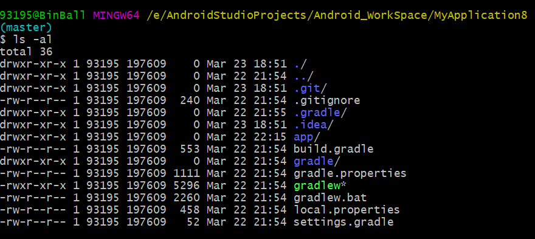
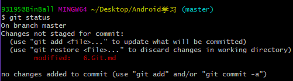

# 6.	Git

## 6.0	 Git概述

> Git 是一个开源的分布式版本控制系统，用于敏捷高效地处理任何或小或大的项目。
>
> Git 是 Linus Torvalds 为了帮助管理 Linux 内核开发而开发的一个开放源码的版本控制软件。
>
> Git 与常用的版本控制工具 CVS, Subversion 等不同，它采用了分布式版本库的方式，不必服务器端软件支持。
>
> ## Git 与 SVN 区别
>
> Git 不仅仅是个版本控制系统，它也是个内容管理系统(CMS)，工作管理系统等。
>
> 如果你是一个具有使用 SVN 背景的人，你需要做一定的思想转换，来适应 Git 提供的一些概念和特征。
>
> Git 与 SVN 区别点：
>
> - **1、Git 是分布式的，SVN 不是**：这是 Git 和其它非分布式的版本控制系统，例如 SVN，CVS 等，最核心的区别。
> - **2、Git 把内容按元数据方式存储，而 SVN 是按文件：**所有的资源控制系统都是把文件的元信息隐藏在一个类似 .svn、.cvs 等的文件夹里。
> - **3、Git 分支和 SVN 的分支不同：**分支在 SVN 中一点都不特别，其实它就是版本库中的另外一个目录。
> - **4、Git 没有一个全局的版本号，而 SVN 有：**目前为止这是跟 SVN 相比 Git 缺少的最大的一个特征。
> - **5、Git 的内容完整性要优于 SVN：**Git 的内容存储使用的是 SHA-1 哈希算法。这能确保代码内容的完整性，确保在遇到磁盘故障和网络问题时降低对版本库的破坏。
> - 

这里不赘述Git的安装过程，只介绍Windows系统下Git Bash的使用方法。

启动GitBash：


## 6.1	Git初始配置

首先配置一下用户身份：

$ git config --global user.name "name"

$ git config --global user.email "email@email.com"

配置结束后再使用相同的命令进行检测即可，不要带后面的值。


确认身份无误后就可以进行代码仓库的创建了，仓库***Repository***是用于保存版本管理所需信息的地方，所有本地提交的代码都会被提交到代码仓库中，如果需要还可以推送到远程仓库去。

我们只需要在想要备份的地方创建仓库即可：在对应路径下使用git init命令：


仓库创建完成后，会在当前目录下创建一个名为.git的隐藏文件夹，用来记录本地所有Git操作，可以通过ls -al命令查看：



如果想要删除本地仓库，只需要删除这个文件夹即可。


## 6.2	提交代码

在代码仓库创建完成之后，就可以提交代码了。提交代码只需要两个命令：add和commit

add用于将想要提交的代码添加进来，commit则是确认操作

假设我们要提交文件build.gradle：

```git
git add build.gradle
```

假设我们要提交app文件夹：

```git
git add app
```

假设我们要提交当前目录下的所有文件：

```git
git add .
```


这里会弹出一个警告，忽视即可，它的意思是会将文件中Windows的换行符替换为Linux的换行符，在文件恢复时会再次恢复为正常格式。


在文件提交之后，还需要确认当前操作：

```git
git commit -m "First Commit"
```


**注意，在提交时需要在commit命令后添加 -m 参数加上提交的描述信息，没有描述信息的提交是不合法的**


当我们修改了很多文件，而不想每一个都add，想commit自动来提交本地修改，我们可以使用-a标识。

```
git commit -a -m "Changed some files"
```

git commit 命令的-a选项可将所有**被修改或者已删除的且已经被git管理的文档**提交到仓库中。

千万注意，-a不会造成新文件被提交，只能修改：


### 6.2.1	忽略文件

在Git备份时，可能整个目录下有个别文件是我们不需要备份的，Git提供了一种可配性很强的机制，允许用户将指定文件或目录排除在版本控制之外，它会检查仓库下是否存在一个名为`.gitignore`的文件，若存在则读取其中内容，将每一行指定的文件或目录排除在版本控制之外。

注意，.gitignore指定的文件或目录可以使用通配符*

对于我们的Android项目，Android Studio在创建项目的时候会自动帮我们创建出两个.gitignore文件，一个在根目录下，另一个在app模块下，它们将IDE自动生成的文件和每次编译都要重新生成的文件排除在了版本控制之外：

```gitignore
*.iml
.gradle
/local.properties
/.idea/caches
/.idea/libraries
/.idea/modules.xml
/.idea/workspace.xml
/.idea/navEditor.xml
/.idea/assetWizardSettings.xml
.DS_Store
/build
/captures
.externalNativeBuild
.cxx
local.properties
```


### 6.2.2	查看修改内容

Git比较理想的使用是每完成一小部分功能，就执行一次提交。当某个功能牵扯到的代码很多，可能我们已经忘记了之前做过什么修改，就可以使用Git来查看自上次提交后文件修改的内容：

```git
git status
```

我们对备份的目录中进行任意修改，然后输入命令：



此时Git会提醒我们发生更改的文件，接着我们还需要查看更改的内容，输入指令：

```git
git diff
```


这样我们就可以查看到所有文件的修改内容，如果我们只想查看6.Git.md这个文件的修改内容，可以使用命令：


其中，减号表示删除的部分，加号表示添加的部分。


### 6.2.3	撤销未提交的修改

有时候我们的操作可能过于草率，导致现有文件出现了问题，但有Git，只要还未提交修改，就可以撤销已经修改的内容。

我们可以使用命令：

```git
git checkout 文件路径名
```

需要注意，这种方法仅适用于没有执行过add命令的修改，而执行过add命令的修改不能通过checkout命令撤销


对于已经add的文件我们需要先撤回add命令，再撤回提交：

```git
git reset 文件路径名
```


### 6.2.4	查看提交记录

当我们的项目经历了许多次的提交之后，我们可能已经忘记了每次提交的修改内容，此时可以借助命令来查看历史修改信息：

```git
git log
```


当提交记录很多的时候，我们可以指定该记录的id，并加上-1参数，表示我们只想看到这一条记录：


如果我们还想查看这条提交记录的具体修改内容，可以再加上参数-p：


