# 7.	数据持久化

顾名思义，数据持久化就是将临时数据通过持久化数据，存储到设备中。持久化技术提供了一种机制，能让数据在瞬时状态和持久化技术间转换

## 7.0	持久化技术概述

Android系统中提供了3种方式用于简单实现数据持久化功能，即文件存储、SharedPreferences存储以及数据库存储。除此之外，还可以将数据保存到手机的SD卡上，不过这三种技术保存数据更简单也更安全。


## 7.1	文件存储

文件存储不对存储内容进行任何格式化处理，所有数据都原封不动保存在文件当中。因此这种方式适合存储一些简单的文本数据或二进制数据。

如果想要使用文件存储的方式保存一些较为复杂的文本数据，就需要定义一套自己的格式规范，这样方便以后将数据从文件中取出来。

### 7.1.1	将数据存储到文件

Context类提供了一个openFileOutput()方法，可以将数据存储到指定文件中。

这个方法接收两个参数，第一个参数是文件名，在文件创建的时候使用的就是这个名称，注意：**文件名不包含路径**，因为所有文件都默认存储到/data/data/<pakagename>/files目录下；第二个参数是文件操作模式，主要有两种模式可选：MODE_PRIVATE和MODE_APPEND。

其中MODE_PRIVATE是默认操作模式，表示当指定同样文件名时，写入内容将覆盖原文件内容；而MODE_APPEND则表示若该文件已存在，就向文件内追加内容，若不存在则创建新文件。

openFileOutput()方法返回一个FileOutputStream对象，接下来就可以用Java流的方式将数据写入文件了：

在activity_main中加入一个EditText，使MainActivity销毁时保存EditText中的内容到文件：

```xml
<?xml version="1.0" encoding="utf-8"?>
<LinearLayout xmlns:android="http://schemas.android.com/apk/res/android"
    xmlns:tools="http://schemas.android.com/tools"
    android:layout_width="match_parent"
    android:layout_height="match_parent"
    tools:context=".MainActivity">

    <EditText
        android:id="@+id/edit_text"
        android:layout_width="match_parent"
        android:layout_height="wrap_content"
        android:hint="Type something here"/>

</LinearLayout>
```

```java
public class MainActivity extends AppCompatActivity {

    private EditText editText;

    @Override
    protected void onCreate(Bundle savedInstanceState) {
        super.onCreate(savedInstanceState);
        setContentView(R.layout.activity_main);
        editText = findViewById(R.id.edit_text);
    }

    @Override
    protected void onDestroy() {
        super.onDestroy();
        String text = editText.getText().toString();
        saveString(text);
    }

    private void saveString(String data){
        FileOutputStream out = null;
        BufferedWriter writer = null;
        try{
            out = openFileOutput("data", Context.MODE_PRIVATE);
            //通过openFileOutput方法获取FileOutputStream实例
            writer = new BufferedWriter(new OutputStreamWriter(out));
            //通过FileOutputStream实例构建OutputStreamWriter实例
            //再通过OutputStreamWriter构建BufferedWriter实例
            //通过BufferedWriter将文本内容写入文件
            writer.write(data);
        }catch (IOException e){
            e.printStackTrace();
        }finally {
            try{
                if(writer!=null){
                    writer.close();
                }
            }catch(IOException e1){
                e1.printStackTrace();
            }
        }
    }
}
```

运行程序，在EditText中输入测试文字，按下Back销毁程序，然后在上方工具栏点击View -> Device File Explorer，打开设备文件浏览器：

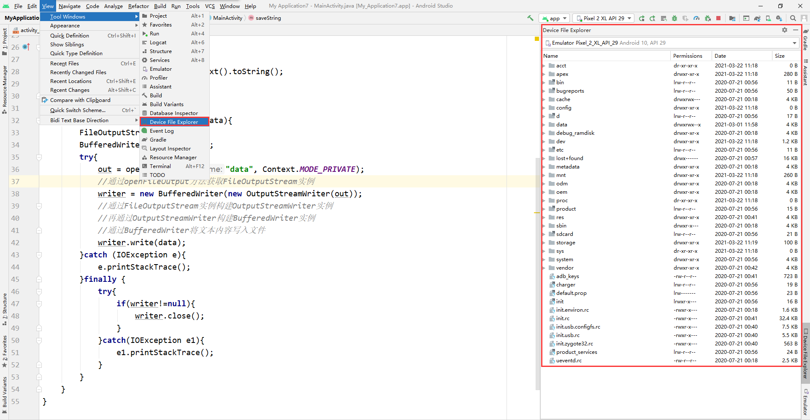

接着，我们在/data/data/包名/files文件夹下就能找到之前保存的文件了：

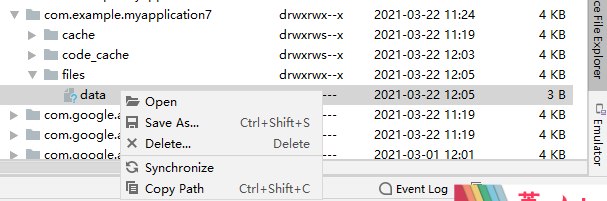

右键菜单中Open为直接打开文件，Save As可以将文件保存到电脑上

现在我们已经保存好了数据，接下来就要解决如何将保存的数据恢复了，因此我们还要学习从文件中读取数据。


### 7.1.2	从文件中读取数据

类似的，Context类提供了openFileInput()方法，用于从文件中读取数据。该方法只接收一个参数，即文件名，然后系统就会寻找/data/data/包名/files文件夹下的同名文件，并返回一个FileInputStream对象，之后再通过Java流方式获取数据即可：

```java
@Override
protected void onCreate(Bundle savedInstanceState) {
    super.onCreate(savedInstanceState);
    setContentView(R.layout.activity_main);
    editText = findViewById(R.id.edit_text);
    String content = loadString();
    editText.setText(content);
}

private String loadString(){
    FileInputStream in = null;
    BufferedReader reader = null;
    StringBuilder content = new StringBuilder();
    try {
        in = openFileInput("data");//openFileInput()方法返回FileInputStream文件输入流对象
        reader = new BufferedReader(new InputStreamReader(in));
        //利用文件输入流对象构建InputStreamReader实例，再构建BufferedReader实例
        String data = "";
        //BufferedReader从文件中逐行读取并赋值到String对象中，若该行内容不为空，即String不为空，则添加到StringBuilder中，否则循环结束
        while((data = reader.readLine())!=null){
            content.append(data);
        }
    }catch (IOException e) {
        e.printStackTrace();
    }finally {
        if(reader!=null){
            try {
                reader.close();
            } catch (IOException e) {
                e.printStackTrace();
            }
        }
    }
    return content.toString();
}
...
```

文件存储不适合保存复杂的文本数据，因此我们接下来要学习另一种数据持久化技术——SharedPreferences，它比文件存储更简单易用，而且可以很方便地对某一指定数据进行读写操作。


## 7.2	SharedPreferences

SharedPreferences使用KV键值对形式存储数据，支持多种数据类型存储。

### 7.2.1	将数据存储到SharedPreferences中

要使用SharedPreferences存储数据，首先要获取SharedPreferences对象。Android提供了3种获取SharedPreferences对象的方法：

- Context类的getSharedPreferences()方法

此方法接收两个参数，第一个参数用于指定SharedPreferences文件名称，若不存在则创建文件，SharedPreferences文件存放在/data/data/<package-name>/shared_prefs目录下；第二个参数用于指定操作模式，一般只使用MODE_PRIVATE，这是默认的操作模式，相当于直接传入0，表示只有当前应用才可以对这个SharedPreferences文件读写。

- Activity类的getPreferences()方法

这个方法与Context类的getSharedPreferences()方法很相似，不过它只接受一个操作模式参数，因为该方法将当前Activity的类名作为SharedPreferences文件名

- PreferenceManager类的getDefaultSharedPreferences()方法

这是一个静态方法，它接收一个Context参数，并自动使用包名作为前缀来命名SharedPreferences文件。


得到SharedPreferences对象后，就可以向SharedPreferences文件存储数据了，可以分为3步：

（1）调用SharedPreferences对象的edit()方法，获取SharedPreferences.Editor对象

（2）向SharedPreferences.Editor对象添加数据，调用方法put+数据类型()

（3）调用apply()方法提交已添加的数据，完成数据存储操作。


将MainActivity的TextView替换为Button：

```xml
<Button
    android:id="@+id/btn_data_save"
    android:text="Save Data"
    android:layout_width="match_parent"
    android:layout_height="wrap_content"/>
```

将点击事件设定为点击按钮保存一些指定数据：

```java
@Override
protected void onCreate(Bundle savedInstanceState) {
    super.onCreate(savedInstanceState);
    setContentView(R.layout.activity_main);
    Button saveDataButton = findViewById(R.id.btn_data_save);
    saveDataButton.setOnClickListener(new View.OnClickListener() {
        @Override
        public void onClick(View v) {
            SharedPreferences.Editor editor = getSharedPreferences("data", MODE_PRIVATE).edit();
            editor.putString("name", "Tom");
            editor.putInt("age", 18);
            editor.putBoolean("isMarried", false);
            editor.apply();
        }
    });
}
```

运行程序，点击按钮，我们可以看到在/data/data/包名/shared_prefs目录下，出现了data.xml文件：

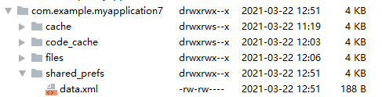

其中以XML的KV格式存储了之前的数据：

```xml
<?xml version='1.0' encoding='utf-8' standalone='yes' ?>
<map>
    <boolean name="isMarried" value="false" />
    <string name="name">Tom</string>
    <int name="age" value="18" />
</map>
```


### 7.2.2	从SharedPreferences中读取数据

读取数据操作更简单，只需要调用SharedPreferences对象的get+数据类型()方法，就可以获取到对应数据类型的数据了。

这些get方法接收两个参数，第一个参数是键值，第二个参数是默认值，即当传入键找不到对应值时返回的值。

在MainActivity中加入新的Button，用于获取SharedPreferences存储的数据

```xml
<Button
    android:id="@+id/btn_data_get"
    android:text="Get Data"
    android:layout_width="match_parent"
    android:layout_height="wrap_content"/>
```

```java
Button getDataButton = findViewById(R.id.btn_data_get);
getDataButton.setOnClickListener(new View.OnClickListener() {
    @Override
    public void onClick(View v) {
        SharedPreferences pref = getSharedPreferences("data", MODE_PRIVATE);
        String name = pref.getString("name", "");
        int age = pref.getInt("age", 0);
        boolean isMarried = pref.getBoolean("isMarried", false);
        Log.d("MainActivity", "name = "+ name);
        Log.d("MainActivity", "age = " + age);
        Log.d("MainActivity", "isMarried = " + isMarried);
    }
});
```

点击按钮，就可以查看到输出的日志，发现已经成功获取到了数据：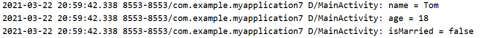


### 7.2.3	实现记住密码功能

我们直接使用5.5创建的强制下线广播项目，在activity_login布局中，在登录按钮之前再添加一个CheckBox复选框，用于提供记住密码功能：

```xml
<LinearLayout
    android:orientation="horizontal"
    android:layout_width="match_parent"
    android:layout_height="wrap_content">
    
    <CheckBox
        android:id="@+id/checkbox_password_remember"
        android:layout_width="wrap_content"
        android:layout_height="wrap_content"/>

    <TextView
        android:text="Remember password"
        android:textSize="18sp"
        android:layout_width="wrap_content"
        android:layout_height="wrap_content"/>
    
</LinearLayout>
```

修改LoginActivity的代码：

```java
public class LoginActivity extends BaseActivity{

    private SharedPreferences pref;

    private SharedPreferences.Editor editor;

    private CheckBox passwordRememberCheckBox;

    private EditText accountEditText;

    private EditText passwordEditText;

    @Override
    protected void onCreate(@Nullable Bundle savedInstanceState) {
        super.onCreate(savedInstanceState);
        setContentView(R.layout.activity_login);
        Button loginButton = findViewById(R.id.btn_login);
        accountEditText = findViewById(R.id.account);
        passwordEditText = findViewById(R.id.password);
        pref = PreferenceManager.getDefaultSharedPreferences(this);
        passwordRememberCheckBox = findViewById(R.id.checkbox_password_remember);
        boolean isRemember = pref.getBoolean("remember_password", false);
        if(isRemember){
            String account = pref.getString("account", "");
            String password = pref.getString("password", "");
            accountEditText.setText(account);
            passwordEditText.setText(password);
            passwordRememberCheckBox.setChecked(true);
        }
        loginButton.setOnClickListener(new View.OnClickListener() {
            @Override
            public void onClick(View v) {
                String account = accountEditText.getText().toString();
                String password = passwordEditText.getText().toString();
                if(account.equals("admin") && password.equals("123456")){//假定账号为admin,密码为123456
                    editor = pref.edit();
                    if(passwordRememberCheckBox.isChecked()){//若选中复选框，即记住密码，则应保存账号和密码
                        editor.putBoolean("remember_password", true);
                        editor.putString("account", accountEditText.getText().toString());
                        editor.putString("password", passwordEditText.getText().toString());
                    }else{
                        editor.clear();//若不记住密码，则清空SharedPreferences保存的数据
                    }
                    editor.apply();
                    
                    Intent intent = new Intent(LoginActivity.this, MainActivity.class);
                    startActivity(intent);
                    finish();
                }else{
                    Toast.makeText(LoginActivity.this, "Invalid Account or Password", Toast.LENGTH_SHORT).show();
                }
            }
        });
    }
}
```

这样，我们就实现了使用SharedPreferences实现记住密码功能了，不过要注意的是，这里只是进行了简单的原理演示，实际将密码以明文形式存储是不安全的，在实际项目中还要结合一定的加密算法使用来保护密码安全。


## 7.3 	SQLite数据库存储

Android系统内置了SQLite数据库，这是一款轻量级的关系型数据库，运算速度快，占用资源少，适合在移动设备使用。它不仅支持标准SQL语法，还遵循数据库的ACID事务。因此SQLite很容易上手，甚至不需要设置用户名和密码。

要存储数据量大、结构复杂的数据，文件存储和SharedPreferences已经捉襟见肘，而数据库存储就能很轻松的解决问题。

### 7.3.1	创建数据库

为了帮助我们更方便管理数据库，Android提供了SQLiteOpenHelp帮助类，能通过它轻松实现对数据库的创建和升级。

SQLiteOpenHelp类是一个抽象类，要使用它就必须创建自己的帮助类并继承它，除此之外还需要重写onCreate()和onUpgrade()方法，实现创建数据库和升级数据库的逻辑。

另外SQLiteOpenHelp类中还有两个很重要的实例方法，getReadableDatabase()和getWriteableDatabase()方法，这两个方法都可以创建或打开一个现有数据库，并返回一个可对数据库进行读写操作的对象。不同的是，当数据库不可写入时（如磁盘已满），getReadableDatabase()方法返回的对象将只以可读方式打开数据库，而getWriteableDatabase()方法将出现异常。

SQLiteOpenHelp类有两个构造方法可供重写，一般使用参数较少的即可。该构造方法接收4个参数，第一个参数是Context，必须有它才能对数据库进行操作；第二个参数是数据库名；第三个参数允许我们在查询数据时返回一个自定义的Cursor，一般传入null；第四个参数表示当前数据库版本号，可用于数据库升级操作。

构建出SQLiteOpenHelp实例后，再调用getReadableDatabase()或getWriteableDatabase()方法就能创建数据库了。数据库文件存放在/data/data/<package-name>/database目录下，此时重写的onCreate()方法也会得到执行，通常在这里处理一些创建表的逻辑。


创建一个新项目，我们希望创建一个名为BookStore.db的数据库，在数据库中新建一张名为Book的表，表中有id(主键、自增)、作者、价格、页数和书名等列。

创建数据库帮助类MyDatabaseHelper，继承SQLiteOpenHelper：

```java
public class MyDatabaseHelper extends SQLiteOpenHelper {

    public static final String CREATE_BOOK = "create table Book("
            + "id integer primary key autoincrement,"
            + "author text,"
            + "price real,"
            + "pages integer,"
            + "name text)";
    //integer表示整型， primary key表示主键， autoincrement表示自增
    //text表示文本类型 real表示浮点数型 blob表示二进制类型

    private Context mContext;

    public MyDatabaseHelper(@Nullable Context context, @Nullable String name, @Nullable SQLiteDatabase.CursorFactory factory, int version, Context mContext) {
        super(context, name, factory, version);
        this.mContext = mContext;
    }

    @Override
    public void onCreate(SQLiteDatabase db) {
        db.execSQL(CREATE_BOOK);
        Toast.makeText(mContext, "Database Create Succeeded", Toast.LENGTH_SHORT).show();
    }

    @Override
    public void onUpgrade(SQLiteDatabase db, int oldVersion, int newVersion) {

    }
}
```

在MainActivity中添加一个Button，用于创建数据库：

```xml
<Button
    android:id="@+id/create_database"
    android:text="Create Database"
    android:layout_width="match_parent"
    android:layout_height="wrap_content"/>
```

```java
public class MainActivity extends AppCompatActivity {

    private MyDatabaseHelper db;

    @Override
    protected void onCreate(Bundle savedInstanceState) {
        super.onCreate(savedInstanceState);
        setContentView(R.layout.activity_main);
        db = new MyDatabaseHelper(this, "BookStore.db", null, 1);
        Button createDatabaseButton = findViewById(R.id.create_database);
        createDatabaseButton.setOnClickListener(new View.OnClickListener() {
            @Override
            public void onClick(View v) {
                db.getWritableDatabase();
            }//首次点击按钮时会调用MyDatabaseHelper的onCreate()方法，
            // 从而发现不存在名为BookStore.db的数据库，并新建数据库和数据库表Book
            //再次点击按钮就会发现已有数据库，不会再创建数据库和表
        });
    }
}
```

在Device File Explorer中，我们可以在databases文件夹下找到BookStore.db文件，但不能看到数据库表Book，因此我们要使用另一种工具，通过adb shell来对数据库和表的创建情况进行检查。

adb是Android SDK中自带的一个调试工具，它能直接对连接在电脑上的手机或模拟器进行调试操作。它存放在sdk的pltaform-tools目录下，如果想要在命令行中使用该工具，就要先把它的路径配置到环境变量中：

Windows10系统下，路径为C:\Users\用户名\AppData\Local\Android\Sdk\platform-tools，将其添加到环境变量Path中：

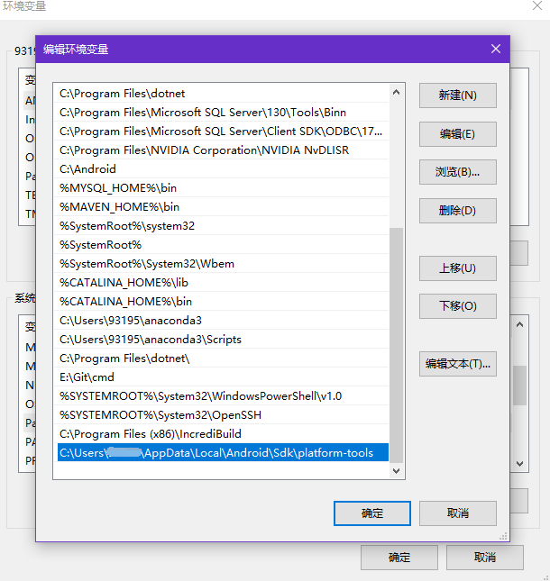

WIndows+R打开运行窗口，输入CMD打开控制台，输入adb shell即可运行调试工具：

我们使用命令su提升访问权限，再用cd命令跳转到databases目录，输入ls查看当前文件夹下的文件：

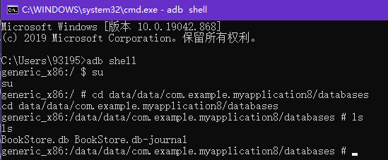

其中BookStore.db是我们的数据库文件，而BookStore.db-journal则是为了让数据库能支持事务而产生的临时日志文件。

接下来我们要借助sqlite命令来打开数据库，使用sqlite3 + 数据库名即可：

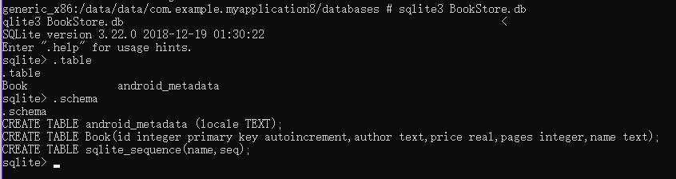

进入数据库后，我们可以使用.table命令查看当前数据库下的表，其中android_metadata是每个数据库创建时自动生成的；

还可以使用.schema命令查看建表语句，最后可以使用.exit或.quit退出数据库的编辑，再输入exit就可以退出设备控制台了。


### 7.3.2	升级数据库

onUpgrade()方法用于数据库的升级，它在整个数据库的管理中起着重要作用。

目前项目中已有一张Book表用于存放书的详细数据，如果我们还想再添加一张Category表用于记录图书的分类：

```java
public class MyDatabaseHelper extends SQLiteOpenHelper {

    public static final String CREATE_BOOK = "create table Book("
            + "id integer primary key autoincrement,"
            + "author text,"
            + "price real,"
            + "pages integer,"
            + "name text)";
    //integer表示整型， primary key表示主键， autoincrement表示自增
    //text表示文本类型 real表示浮点数型 blob表示二进制类型

    public static final String CREATE_CATEGORY = "create table Category(" +
            "id integer primary key autoincrement," +
            "category_name text，" +
            "category_code integer)";

    private Context mContext;

    public MyDatabaseHelper(@Nullable Context context, @Nullable String name, @Nullable SQLiteDatabase.CursorFactory factory, int version) {
        super(context, name, factory, version);
        this.mContext = context;
    }

    @Override
    public void onCreate(SQLiteDatabase db) {
        db.execSQL(CREATE_BOOK);
        db.execSQL(CREATE_CATEGORY);
        Toast.makeText(mContext, "Database Create Succeeded", Toast.LENGTH_SHORT).show();
    }//在数据库建立的同时建立数据库表

    @Override
    public void onUpgrade(SQLiteDatabase db, int oldVersion, int newVersion) {

    }
}
```

我们以这种思路创建Category数据库表，点击按钮，却发现Category数据表并没有创建成功。这是因为此时BookStore.db数据库已经存在了，因此点击按钮也并不能执行onCreate()方法，因此我们就不能通过onCreate()方法创建Category表了。

如果一定要通过onCreate()方法创建Category表，就只能先卸载程序，重新安装并启动后再点击按钮，才能完成创建。这无疑是不显示的，因此，我们应当通过onUpgrade()方法来实现数据库的更新：

```java
@Override
public void onUpgrade(SQLiteDatabase db, int oldVersion, int newVersion) {
    db.execSQL(CREATE_CATEGORY);
    Toast.makeText(mContext, "Database update successfully", Toast.LENGTH_SHORT).show();
}
```

接下来，要调用onUpgrade()方法，只需要在实例化MyDatabaseHelper对象的时候，向构造方法中传入一个更高的版本号即可：

```java
db = new MyDatabaseHelper(this, "BookStore.db", null, 2);
```

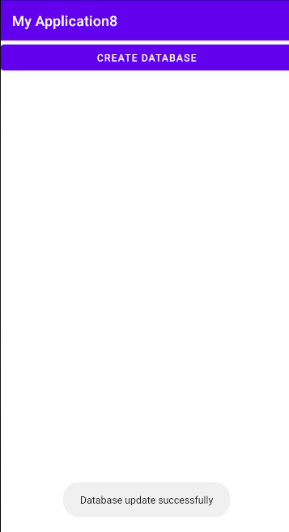

这样，我们就完成了数据库的升级操作。


### 7.3.3	数据库CRUD操作

接下来，我们就要关心如何操作数据库表中的数据了，也就是CRUD操作。Android提供了一系列辅助方法，使我们可以不编写SQL语句也能轻松完成CRUD操作。

前面提到，SQLiteOpenHelper类的getReadableDatabase()和getWriteableDatabase()可以用于创建和升级数据库，除此之外，这两个方法还会返回返回一个SQLiteDatabase对象，通过这个对象就可以实现数据的CRUD操作了。

#### 7.3.3.1	添加数据（Create）

SQLiteDatabase对象提供了insert()方法，用于添加数据操作。它接收3个参数，第一个参数是目的表名，第二个参数是用于未指定添加数据的情况下为某些可为空的列自动赋值NULL，我们暂时传入只传入null即可；第三个参数是一个ContentValues对象，它提供了一系列的put()方法重载，用于向ContentValues添加数据，只需要提供表中的每个列名和对应的数据即可。

向acitivty_main中添加一个Button，用于添加数据：

```xml
<Button
    android:id="@+id/btn_data_add"
    android:text="Add data"
    android:layout_width="match_parent"
    android:layout_height="wrap_content"/>
```

在MainActivity中添加点击事件逻辑：

```java
Button addDataBtn = findViewById(R.id.btn_data_add);
addDataBtn.setOnClickListener(new View.OnClickListener() {
    @Override
    public void onClick(View v) {
        SQLiteDatabase database = db.getWritableDatabase();//获取SQLiteDatabase对象
        ContentValues values = new ContentValues();//实例化ContentValues对象
        values.put("name", "The Da Vinci Code");//组装第一条数据
        values.put("author", "Dan Brown");
        values.put("pages", 454);
        values.put("price", 16.96);
        database.insert("Book", null, values);//插入数据
        values.clear();//清空上一条数据内容
        values.put("name", "The Lost Symbol");//组装第二条数据
        values.put("author", "Dan Brown");
        values.put("pages", 510);
        values.put("price", 19.95);
        database.insert("Book", null, values);//插入数据
    }
});
```

运行程序，点击按钮"Add Data"，在adb shell中使用select * from Book就可以查询到刚才添加的信息：

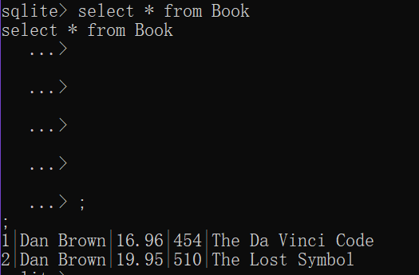


#### 7.3.3.2	更新数据（Update）

类似的，更新数据使用SQLiteDatabase对象的update()方法，它接收4个参数：第一个参数是表名；第二个参数是ContentValues对象，只需要把要更新的数据组装进去；第三、第四个参数用于约束更新某一行或某几行的数据，不指定则默认更新所有行，第三个参数相当于where关键字，第四个参数相当于SQL语句中?占位符对应的值

在activity_main中添加一个Button，用于更新数据：

```java
Button updateDataBtn = findViewById(R.id.btn_data_update);
updateDataBtn.setOnClickListener(new View.OnClickListener() {
    @Override
    public void onClick(View v) {
        SQLiteDatabase database = db.getWritableDatabase();
        ContentValues values = new ContentValues();
        values.put("price", 9.99);
        database.update("Book", values, "name = ?", new String[]{"The Da Vinci Code"
        });
    }
});
```

运行程序，点击按钮“Update Data”，再重新查询数据：

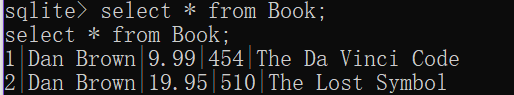

可以看到，现在数据已经得到了更新。


#### 7.3.3.3	删除数据（Delete）

SQLiteDatabase为删除功能提供了方法delete()，它接收3个参数：第一个参数是表名，第二、第三个参数也是用于约束删除某一行或某几行数据的，不指定则默认删除所有行

在activity_main中添加Button，用于删除数据：

```xml
<Button
    android:id="@+id/btn_data_delete"
    android:text="Delete data"
    android:layout_width="match_parent"
    android:layout_height="wrap_content"/>
```

```java
Button deleteDataBtn = findViewById(R.id.btn_data_delete);
deleteDataBtn.setOnClickListener(new View.OnClickListener() {
    @Override
    public void onClick(View v) {
        SQLiteDatabase database = db.getWritableDatabase();
        database.delete("Book", "pages > ?", new String[]{"500"});
    }//删除页数超过500的行数据
});
```

再次查询数据：

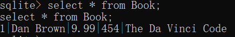

可以发现之前添加的页数超过500的行已经被删除了。


#### 7.3.3.4	查询数据（Retrieve）

查询是CRUD操作中最繁琐的一步，我们一般使用SQL语句进行查询，这里只介绍SQLiteDatabase提供的query()方法。它有多个重载，其中最短的也需要传入7个参数：

- 第一个参数是表名
- 第二个参数用于指定查询哪几列，若不指定则查询所有列(*)
- 第三、第四个参数用于约束查询哪一或哪几行，不指定则查询所有行
- 第五个参数用于指定需要去group by的列，不指定则不进行group by操作
- 第六个参数用于对group by后的数据进行进一步过滤，不指定则不进行过滤
- 第七个参数用于指定查询结果的排序方式，不指定则按默认方式排序

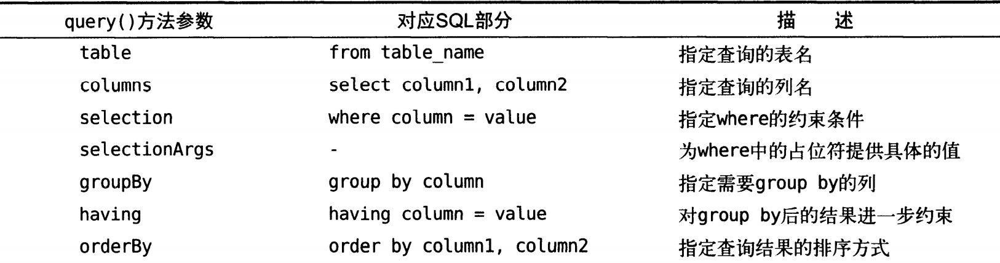

调用query()方法会返回一个Cursor对象，查询到的数据都将从这个对象取出


在MainActivity中添加一个Button，用于查询数据：

```xml
<Button
    android:id="@+id/btn_data_query"
    android:text="Query data"
    android:layout_width="match_parent"
    android:layout_height="wrap_content"/>
```

```java
Button queryDataBtn = findViewById(R.id.btn_data_query);
queryDataBtn.setOnClickListener(new View.OnClickListener() {
    @Override
    public void onClick(View v) {
        SQLiteDatabase database = db.getWritableDatabase();
        //查询Book表中全部对象
        Cursor cursor = database.query("Book", null, null, null, null, null, null);
        if(cursor.moveToFirst()){
            do{
                //遍历Cursor对象
                String name = cursor.getString(cursor.getColumnIndex("name"));
                String author = cursor.getString(cursor.getColumnIndex("author"));
                int pages = cursor.getInt(cursor.getColumnIndex("pages"));
                double price = cursor.getDouble(cursor.getColumnIndex("price"));
                Log.d("MainActivity", "name is " + name);
                Log.d("MainActivity", "author is " + author);
                Log.d("MainActivity", "pages = " + pages);
                Log.d("MainActivity", "price = " + price);
            }while (cursor.moveToNext());
        }
        cursor.close();
    }
});
```

运行程序，我们已经查询到了目标结果：

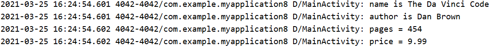


#### 7.3.3.5	使用SQL操作数据库

Android同样支持使用SQL语句操作数据库

增删改都需要调用SQLiteDatabase对象的execSQL()方法：

```java
//添加数据
database.execSQL("insert into Book(name, author, pages, price) values(?, ?, ?, ?)",
        new String[]{"The Da Vinci Code", "Dan Brown", "454", "16.96"});

//修改数据
database.execSQL("update Book set price = ? where name = ?",
                        new String[]{"10.99", "The Da Vinci Code"});

//删除数据
database.execSQL("delete from Book where pages > ?",
                        new String[]{"500"});
//第一个参数传入SQL语句结构，第二个参数传入对应占位符填入的值的字符串组成的String数组
```

而查询数据则需要调用SQLiteDatabase对象的rawQuery()方法：

```java
Cursor rawQuery = database.rawQuery("select * from Book", null);
//传入参数与增删改用法相同，第二个参数位置若没有使用占位符可传入null
//需要注意，rawQuery()方法同样返回一个Cursor对象，需要遍历对象获取数据，最后调用cursor.close()方法关闭Cursor对象结束查询
```


## 7.4	使用LitePal操作数据库

### 7.4.0	LitePal简述

LitePal是一款开源的Android数据库框架,它采用了对象关系映射(ORM)的模式,并将我们平时开发最常用到的一些数据库功能进行了封装,使得不用编写一行SQL语句就可以完成各种建表和增删改查的操作，并且LitePal是一个轻量级的持久层框架，其jar包大小不到100k，而且近乎零配置，这一点和Hibernate这类的框架有很大区别。
GitHub文档：https://github.com/guolindev/LitePal

### 7.4.1	配置LitePal

在build.gradle中引入依赖：

```groovy
implementation 'org.litepal.android:core:1.6.1'
```

接下来，需要配置一个XML文件litepal.xml：

以Project Files格式展开项目文件，在app/src/main下新建目录assets，并创建文件litepal.xml：

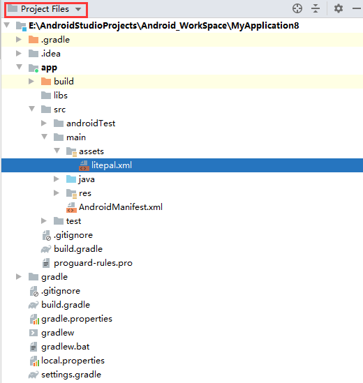

在litepal.xml中配置基本信息：

```xml
<?xml version="1.0" encoding="utf-8"?>
<litepal>
    <!--    dbname:相应的数据库名称-->
    <dbname value="file"/>
    <!--    version:相应的数据库的版本,注意内容发生改变时,要升级到对应版本-->
    <version value="1"/>
    <!--    list：指定映射模型，即需要数据库管理的对象,路径为全类名-->
    <list>
        <!--    list标签中的实体类都应继承DataSupport类-->
        <mapping class="com.example.myapplication8.MainActivity"/>
    </list>
</litepal>
```

在AndroidManifest.xml中也需要进行配置：

```xml
<application
    android:name="org.litepal.LitePalApplication"
    android:allowBackup="true"
    android:icon="@mipmap/ic_launcher"
    android:label="@string/app_name"
    android:roundIcon="@mipmap/ic_launcher_round"
    android:supportsRtl="true"
    android:theme="@style/Theme.MyApplication8">
   <!--这里我们需要将application注册为org.litepal.LitePalApplication才能使LitePal所有功能正常工作，这里暂时不详细阐述Application-->
```


### 7.4.2	创建和升级数据库

在LitePal中，使用对象关系映射（ORM）模式，对象关系映射，简单地说就是在我们使用的面向对象编程语言与关系型数据库之间建立一种映射关系。

对象映射模式使得我们能够以面向对象的思维操作数据库，而不使用SQL语句操作数据库。

我们同样以7.3中BookStore数据库为例：

首先建立实体类Book：

```java
public class Book {
    private int id;
    private String name;
    private String author;
    private int pages;
    private double price;
}
```

可以看到，这是一个再普通不过的JavaBean，而我们建立的Book实体类将会对应数据库的Book表，而类中的每个字段就对应表中的各列。

接下来需要将Book类添加到映射模型列表中，修改litepal.xml：

```xml
<?xml version="1.0" encoding="utf-8"?>
<litepal>
    <!--    dbname:相应的数据库名称-->
    <dbname value="BookStore"/>
    <!--    version:相应的数据库的版本,注意内容发生改变时,要升级到对应版本-->
    <version value="1"/>
    <!--    list：指定映射模型，即需要数据库管理的对象,路径为全类名-->
    <list>
        <!--    list标签中的实体类都应继承DataSupport类-->
        <mapping class="com.example.myapplication8.Book"/>
    </list>
</litepal>
```

我们使用<mapping>标签声明要配置的映射模型类，将所有需要映射的模型类都放在<list>标签下的标签<mapping>中即可

现在，我们只需要进行任意数据库操作，LitePal就会自动为我们创建数据库。

在MainActivity中重写创建数据库的按钮：

```java
Button createDatabaseButton = findViewById(R.id.create_database);
createDatabaseButton.setOnClickListener(new View.OnClickListener() {
    @Override
    public void onClick(View v) {
        Connector.getDatabase();
    }
});
```

我们在Device File Explorer中就能看到新的数据库被创建了：

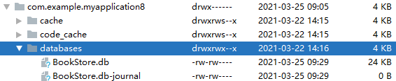

在adb shell中，使用.schema命令可以看到Book表也得到了创建：

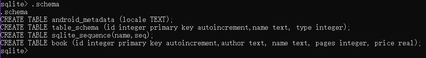

现在，我们想要向Book表添加一个Press(出版社)列，直接修改Book类代码即可：

```java
private String press;
```

另外，我们还想添加一张Category表，只需要新建实体类Category即可：

```java
public class Category {
    private int id;
    private String categoryName;
    private int categoryCode;
}
```

之后，我们只需要在lietpal.xml中添加新创建的实体类，并修改版本号即可：

```xml
<?xml version="1.0" encoding="utf-8"?>
<litepal>
    <dbname value="BookStore"/>
    <version value="2"/>
    <list>
        <mapping class="com.example.myapplication8.Book"/>
        <mapping class="com.example.myapplication8.Category"/>
    </list>
</litepal>
```

运行程序，再次点击按钮，对比操作前后.schema的结果：

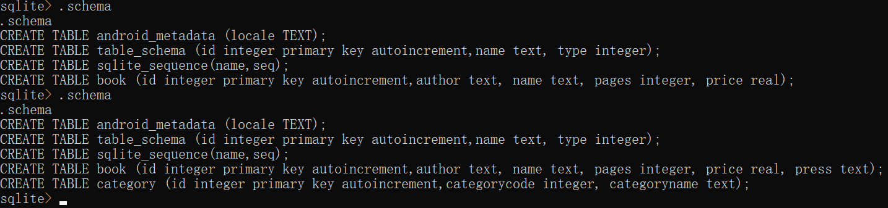

可以看到，数据库的更新已经完成了，同时LitePal还帮我们保留了之前数据库的数据。


### 7.4.3	使用LitePal进行CRUD操作

#### 7.4.3.1	添加数据

要使用LitePal添加数据，只需要创建模型类实例，将要存储的数据设置好，最后调用save()方法进行存储即可。

要注意的是，要使用LitePal进行CRUD操作，模型类必须继承DataSupport类：

```java
public class Book extends DataSupport {
```

接下来，我们在MainActivity中重写Add Data Button：

```java
Button addDataBtn = findViewById(R.id.btn_data_add);
addDataBtn.setOnClickListener(new View.OnClickListener() {
    @Override
    public void onClick(View v) {
        Book book =
                new Book("Unknown", "The Da Vinci Code", "Dan Brown", 454, 16.96);
        book.save();
    }
});
```

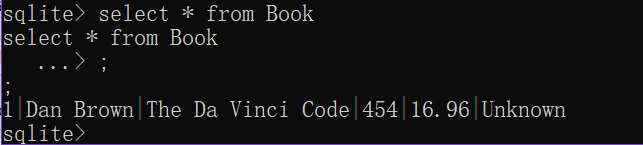

可以看到，数据已经成功添加到了数据库。


#### 7.4.3.2	更新数据

##### 7.4.3.2.1	save()

LitePal提供了多种更新数据的方式，其中最简单的一种是对已存储的对象重新设值，再调用save()方法即可。

什么是已存储对象呢？

对LitePal来说，对象是否已存储是根据调用model.isSave()方法的结果判断的，true表示已存储，false表示未存储。

那么什么情况下model.isSave()方法返回true，什么情况下返回false呢？

有两种情况会返回true：

- 对象已经调用过model.save()方法添加数据
- model对象是通过LitePal提供的查询API获取的，由于是从数据库中获取的对象，因此也会被认为是已存储的对象

我们来试试第一种情况：

修改MainActivity的Update Data Button：

```java
Button updateDataBtn = findViewById(R.id.btn_data_update);
updateDataBtn.setOnClickListener(new View.OnClickListener() {
    @Override
    public void onClick(View v) {
        Book book =
            new Book("Unknown", "The Lost Symbol","Dan Brown", 510, 9.99);
        book.save();//调用save()方法存储到数据库
        book.setPrice(19.95);//更新数据后重新调用save()方法更新数据
        book.save();
    }
});
```

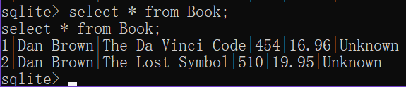

可以看到，数据库中价格为19.95，是我们修改后的数据而不是初始化时的数据，这证明数据库中的数据已经进行了更新。


##### 7.4.3.2.2	updateAll()

save()方法存储对象虽然很方便，但仅限于已存储的对象，局限性比较大。我们可以使用updateAll()方法，结合SQL语句，更灵活地更新数据：

```java
Button updateDataBtn = findViewById(R.id.btn_data_update);
updateDataBtn.setOnClickListener(new View.OnClickListener() {
    @Override
    public void onClick(View v) {
        Book book = new Book();
        book.setPress("Anchor");
        book.setPrice(16.95);
        book.updateAll("name = ? and author = ?", "The Lost Symbol", "Dan Brown");
    }
});
```

对比两次数据，可以发现数据已经更新了：

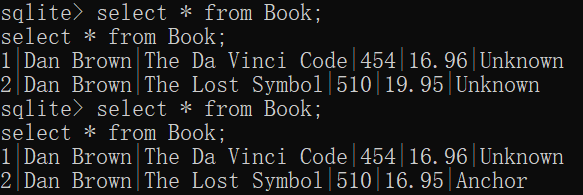

要注意的是，Java中所有数据类型字段都有默认值，如int类型默认值为0，boolean类型默认值为false，String类型默认值为null。当对象实例化时，所有字段都会被初始化为默认值，如pages字段值就是0。因此我们直接调用book.setPage(0)不会更新数据库，因为这本身就是默认值。对于想要将数据更新为默认值的操作，LitePal提供了setToDefault()方法，只需要传入相应列名即可：

```java
Button updateDataBtn = findViewById(R.id.btn_data_update);
updateDataBtn.setOnClickListener(new View.OnClickListener() {
    @Override
    public void onClick(View v) {
        Book book = new Book();
        book.setToDefault("pages");
        book.updateAll();//没有指定约束条件，因此更新操作对所有数据都生效
    }
});
```

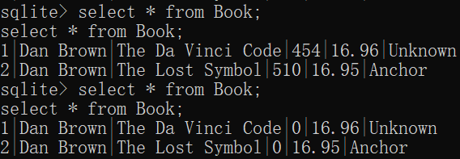


#### 7.4.3.3	删除数据

LitePal删除数据主要有两种方法，一种是直接调用已存储对象的delete()方法，还可以直接调用DataSupport类的静态方法deleteAll()：

```java
Button deleteDataBtn = findViewById(R.id.btn_data_delete);
deleteDataBtn.setOnClickListener(new View.OnClickListener() {
    @Override
    public void onClick(View v) {
        DataSupport.deleteAll(Book.class, "price < ?", "15");
    }
});
```

deleteAll()方法传入第一个参数为要操作的表对应的实体类，我们要删除Book表中的数据，也就对应实体类Book，后面的参数即约束条件。

另外，若deleteAll()方法不传入约束条件，则默认删除表中所有数据，这一点与updateAll()方法相似。	


#### 7.4.3.4	查询数据

在SQLiteDatabase中，要查询Book表中的全部数据，我们之前的操作为：

```java
Cursor cursor = database.query("Book", null, null, null, null, null, null);
```

而在LitePal中，操作变得更简单了：

```java
Button queryDataBtn = findViewById(R.id.btn_data_query);
queryDataBtn.setOnClickListener(new View.OnClickListener() {
    @Override
    public void onClick(View v) {
        List<Book> books = DataSupport.findAll(Book.class);
        for (Book book: books) {
            Log.d("MainActivity", "name is " + book.getName());
            Log.d("MainActivity", "press is" + book.getPress());
            Log.d("MainActivity", "Press is" + book.getPress());
            Log.d("MainActivity", "Price = " + book.getPrice());
            Log.d("MainActivity", "pages = " + book.getPages());
        }
    }
});
```

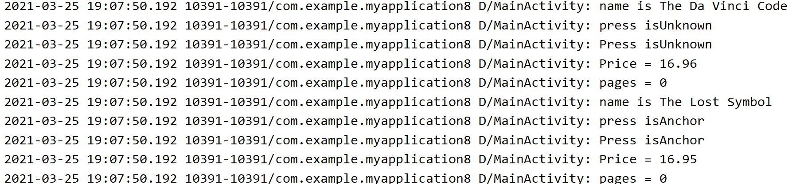

除了findAll()方法，我们还可以分别使用findFirst()和findLast()方法查询表中的第一条和最后一条数据


另外，我们还可以使用连缀查询定制更多查询内容：

- select()方法用于指定查询哪几列数据，对应SQL关键字select，比如只查询name和author两列数据：

```java
DataSupport.select("name", "author").find(Book.class);
```

我们用find()方法指定在哪张表中进行查询

- 另外，还有where()方法用于指定约束条件，对应SQL关键字where，如只查询页数大于400的数据：

```java
DataSupport.where("pages > ?", "400").find(Book.class);
```

- order()方法可以指定查询结果的排序方式，对应SQL关键字order by，如将查询结果按价格降序排序：

```java
DataSupport.order("price desc").find(Book.class);
//默认不写为asc，即升序排序;desc为降序排序
```

- limit()方法用于指定查询结果的数量，比如只查询前三条数据：

```java
DataSupport.limit(3).find(Book.class);
```

- offset()方法用于指定查询结果偏移量，如查询表中第2、3、4条数据：

```java
DataSupport.limit(3).offset(1).find(Book.class);
```

我们还可以将这些方法组合起来，进行比较复杂的查询操作：

```java
DataSupport.select("name", "author", "pages")
        .where("pages > ?", "400")
        .order("pages")
        .limit(10)
        .offset(1)
        .find(Book.class);
//从Book表中查询页数大于400的第2~11条数据的name、author、pages属性，查询结果按pages升序排序
```

最后，LitePal同样支持使用SQL语句进行查询：

```java
DataSupport.findBySQL("select * from Book where pages > ? and price < ?", "400", "200");
```

要注意的是，findBySQL方法返回的是一个Cursor对象，要获取数据还要使用老方法。