# 8.	内容提供器

## 8.0	内容提供器概述

内容提供器ContentProvider，主要用于在不同应用间实现数据共享的功能，它提供了一套完整的机制，允许一个程序访问另一个程序中的数据，同时还能保证被访问数据的安全性。目前，使用内容提供器是Android实现跨程序共享数据的标准方法。

不同于文件存储和SharedPreferences存储的两种全局可读写操作模式，内容提供器可选择只对哪部分数据进行共享，从而保证隐私数据不会泄露。


## 8.1	运行时权限

要使用内容提供器，我们首先要了解运行时权限的相关内容。

### 8.1.1	Android权限机制

在学习广播Broadcast内容时，我们需要在AndroidManifest.xml中注册才能获取到相应权限：

```xml
<uses-permission android:name="android.permission.RECEIVE_BOOT_COMPLETED"/>
<uses-permission android:name="android.permission.CHANGE_NETWORK_STATE"/>
```

这是因为访问系统的网络状态以及监听开机广播涉及到用户设备的安全性，因此必须声明权限，否则程序将会崩溃。

声明程序所需权限，一方面Android版本低于6.0的用户在安装程序时，系统将会提醒程序所需权限：

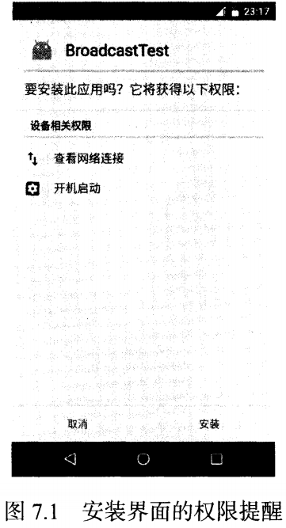

另一方面，用户可以在软件管理中看到软件申请的所有权限：

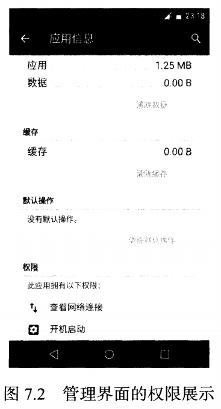

但随之造成了一个问题：我们的常用软件普遍存在滥用权限的情况，申请的权限远超所需权限。

为了解决这个问题，Android在6.0版本引入了运行时权限功能，即用户不需要在安装软件时一次性授权全部权限，而是可以在软件的使用过程中再对某一项权限进行授权。

比如一款相机应用在运行时申请了地理位置定位权限，就算拒绝这个权限，我们应当仍然可以使用这个应用的其他功能，而不是直接无法安装应用。

并不是所有权限都需要授权，无限的授权会严重影响用户的使用体验。Android将权限分为两类：普通权限和危险权限。

普通权限指的是不会直接威胁到用户安全和隐私的权限，系统会自动授权这些权限而不需要用户手动授权，如广播中的两个权限就是普通权限，我们在使用时并不需要手动通过权限的申请，因为系统已经自动进行了授权。

危险权限指的是可能会触及用户隐私或对设备安全性造成影响的权限，如获取联系人信息、定位设备的地理位置等。这些权限必须由用户手动点击授权，否则程序将无法使用相应功能。

下面是Android系统中的危险权限，除此之外的权限都是普通权限：

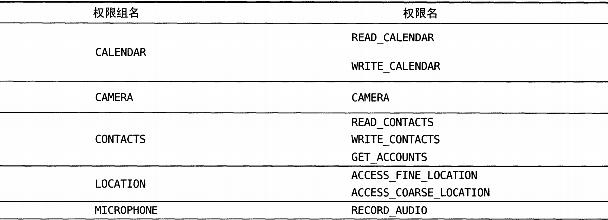

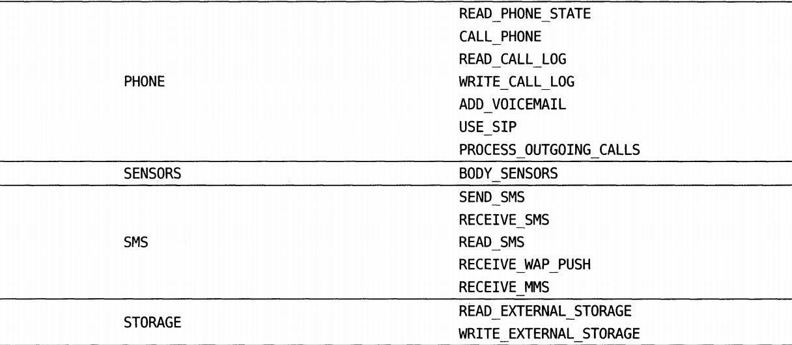

需要注意的是，表格中的每个危险权限都属于一个权限组，我们在进行运行时权限处理时处理的是权限名，但一旦用户进行授权，该权限对应的权限组中所有其他权限都将被授权。


### 8.1.2	在程序运行时申请权限

本节我们尝试申请CELL_PHONE权限：

CELL_PHONE权限是编写拨打电话功能时需要声明的，因为这可能会影响到用户手机资费问题，因此被列为危险权限，

创建新项目，在MainActivity中声明：

```xml
<Button
    android:id="@+id/btn_make_call"
    android:text="Make Call"
    android:layout_width="match_parent"
    android:layout_height="wrap_content"/>
```

```java
Button makeCallBtn = findViewById(R.id.btn_make_call);
makeCallBtn.setOnClickListener(new View.OnClickListener() {
    @Override
    public void onClick(View v) {
        try {
            Intent intent = new Intent(Intent.ACTION_CALL);
            intent.setData(Uri.parse("tel:10086"));
            startActivity(intent);
        }catch (Exception e){
            e.printStackTrace();
        }
    }
});
```

我们构造了一个隐式Intent，action指定为Intent.ACTION_CALL，这是系统内置的拨号action，data指定协议为tel，号码为10086，这里Intent.ACTION_CALL属于危险权限，因此为了防止程序崩溃，需要声明权限：

在AndroidManifest.xml中声明权限：

```xml
<uses-permission android:name="android.permission.CALL_PHONE"/>
```

运行程序，点击按钮，程序居然报错了：

```java
W/System.err: java.lang.SecurityException: Permission Denial: starting Intent { act=android.intent.action.CALL dat=tel:xxxxx cmp=com.android.server.telecom/.components.UserCallActivity } from ProcessRecord{1ea24d7 11467:com.example.myapplication9/u0a146} (pid=11467, uid=10146) with revoked permission android.permission.CALL_PHONE
```

如果我们把程序放到Android6.0以下版本的系统上运行，软件可以正常使用，这是为什么呢？

错误信息提示我们“ Permission Denial ”，也就是错误是权限被禁止造成的，因为6.0以上版本在使用危险权限时都必须进行运行时权限处理。

修改MainActivity中代码：

```java
public class MainActivity extends AppCompatActivity {

    @Override
    protected void onCreate(Bundle savedInstanceState) {
        super.onCreate(savedInstanceState);
        setContentView(R.layout.activity_main);
        Button makeCallBtn = findViewById(R.id.btn_make_call);
        makeCallBtn.setOnClickListener(new View.OnClickListener() {
            @Override
            public void onClick(View v) {
                //ContextCompat.checkSelfPermission()方法判断用户是否已经授权
                //checkSelfPermission()方法接收两个参数，第一个参数是Context，第二个参数是具体权限名
                //若返回值与PackageManager.PERMISSION_GRANTED相等则说明用户已经授权，反之未授权
                if(ContextCompat.checkSelfPermission(MainActivity.this, Manifest.permission.CALL_PHONE) !=
                        PackageManager.PERMISSION_GRANTED){
                    //用户未授权，调用ActivityCompat.requestPermissions()方法,弹出对话框向用户申请授权
                    //requestPermissions()接收三个参数，第一个参数是Content，第二个参数是要申请的权限，第三个参数是请求码，是唯一值即可
                    ActivityCompat.requestPermissions(MainActivity.this, new String[]{Manifest.permission.CALL_PHONE}, 1);
                }else{
                    call();//用户已授权，直接调用call()方法进行操作即可
                }
            }
        });
    }

    @Override
    //用户同意或拒绝权限申请操作后都会调用onRequestPermissionsResult()方法
    //请求码是向requestPermissions()方法传入的请求码，授权结果封装在grantResults中
    public void onRequestPermissionsResult(int requestCode, @NonNull String[] permissions, @NonNull int[] grantResults) {
        if (requestCode == 1) {
            if (grantResults.length > 0 && grantResults[0] == PackageManager.PERMISSION_GRANTED) {
                call();
            } else {
                Toast.makeText(this, "You denied the permission", Toast.LENGTH_SHORT).show();
            }
        }
    }

    private void call(){//进行已授权的操作
        try {
            Intent intent = new Intent(Intent.ACTION_CALL);
            intent.setData(Uri.parse("tel:10086"));
            startActivity(intent);
        }catch (Exception e){
            e.printStackTrace();
        }
    }
}
```

运行程序，点击按钮，弹出对话框：

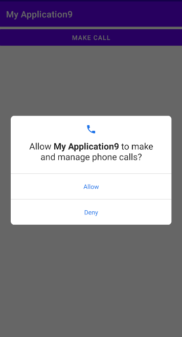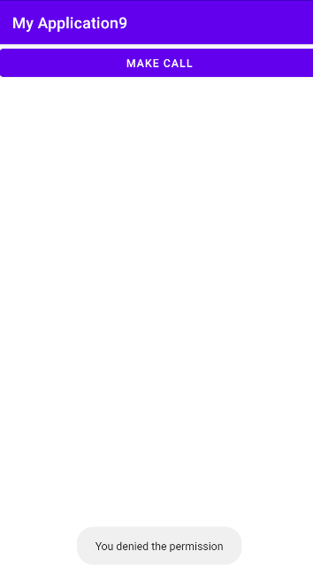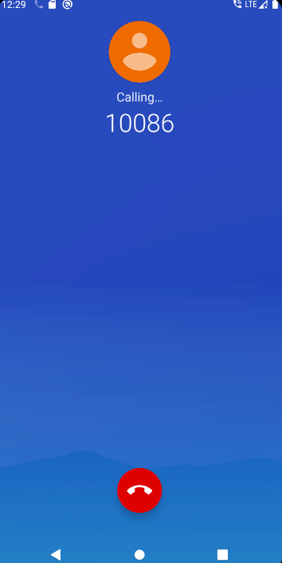


## 8.2	访问其他程序的数据

内容提供器的用法有两种：

- 使用现有内容提供器读取和操作相应程序中的数据
- 创建自定义内容提供器，为我们的程序的数据提供外部访问接口

当一个程序通过内容提供器对数据提供了外部访问接口，那么任何其他应用程序都可以对这部分数据进行访问。Android系统中自带的电话簿、短信、媒体库等程序都提供了类似的访问接口，这使得第三方程序能够充分利用这部分数据实现更好的功能。


### 8.2.1	ContentResolver

对每个程序来说，想要访问内容提供器中共享的数据，就要借助ContentResolver类，可以通过Context的getContentResolver()方法获取到该类的实例。

ContentResolver中提供了一系列用于对数据进行CRUD操作的方法，其中insert()方法用于添加数据，update()方法用于更新数据，delete()方法用于删除数据，query()方法用于查询数据，这与SQLite的操作方法很相似，只是传入方法的参数有所不同。


#### 8.2.1.1	内容URI

不同于SQLiteDatabase，ContentResolver中的CRUD方法不接收表名，而是使用一个Uri参数代替，这个参数被称为内容URI。内容URI为内容提供器中的数据建立了唯一标识符，它由两部分组成：authority和path。

authority是用于对不同的应用数据做区分的，一般为了避免冲突，都会采用程序包名命名，如程序包名为com.example.app，则author可命名为com.example.app.provider

path用于对同一应用中的不同表作区分，通常会添加到authority后面，如某程序数据库存在两个表table1和table2，则path可写作/table1和/table2

最后将authority和path组合，内容URI此时格式为com.example.app.provider/table1和com.example.app.provider/table2

现在还是很难辨认这两个字符串就是内容URI，因此还要在字符串头部加上协议名，因此内容URI的标准写法为：

```java
content://com.example.app.provider/table1
content://com.example.app.provider/table2
```

可以看到，内容URI可以清楚表达我们想要访问哪个程序中哪个表的数据。


得到了内容URI后，我们还需要将其解析为Uri对象才可以作为参数传入：

```java
Uri uri = Uri.parse("content://com.example.app.provider/table1");
```


#### 8.2.1.2	查询数据

现在我们就可以使用这个Uri对象查询table1表中的数据了：

```java
Cursor cursor = getContentResolver().query(
			uri,
			projection,
			selection,
			selectionArgs,
			sortOrder);
```

这些参数与SQLiteDatabase的query()方法很像，但我们在访问其他程序的数据时不需要构造太复杂的参数。

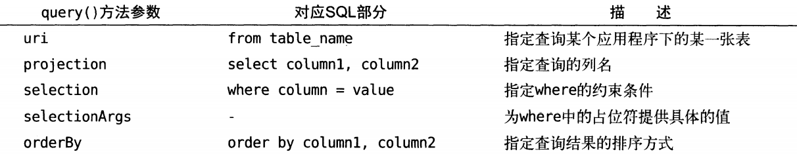

查询后返回的是一个Cursor对象，它的使用方法与之前相同。


#### 8.2.1.3	添加数据

要向table1表中添加数据：

```java
ContentValues values = new ContentValues();
values.put("column1", "text");
values.put("column2", 1);
getContentResolver().insert(uri, values);
```

可以看到，仍然是将待添加的数据组装到ContentValues，再调用getContentResolver()方法获取ContentResolver实例，再调用insert()方法，将uri和ContentValues实例传入即可。


#### 8.2.1.4	更新数据

如果我们想要更新这条新添加的数据，把column1的值清空，可以借助ContentResolver的update()方法实现：

```java
ContentValues values = new ContentValues();
values.put("column1", "");
getContentResolver().update(uri, values, "column1 = ? and column2 = ?",
        new String[]{"text", "1"});
```

注意我们使用了selection和selectionArgs对想要更新的数据进行约束，防止所有的行都受影响。


#### 8.2.1.5	删除数据

最后，我们还可以调用ContentResolver实例的delete()方法删除这条记录：

```java
getContentResolver().delete(uri, "column2 = ?", new String[]{"1"});
```


#### 8.2.1.6	读取系统联系人

打开系统应用Contacts，发现模拟器中还没有联系人，让我们自己创建几个：

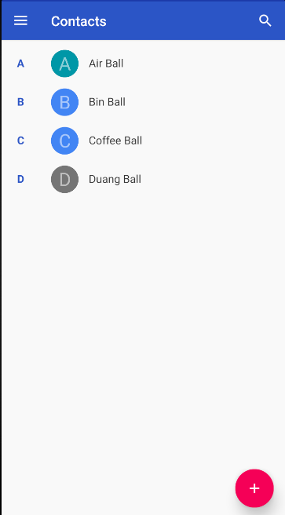

首先在AndroidManifest.xml中加入权限声明：

```xml
<uses-permission android:name="android.permission.READ_CONTACTS"/>
```

我们希望读取到的联系人信息能显示到ListView中，因此在MainActivity中添加一个ListView：

```xml
<ListView
    android:id="@+id/list_view_contacts"
    android:layout_width="match_parent"
    android:layout_height="match_parent"/>
```

```java
public class MainActivity extends AppCompatActivity {

    private List<String> contactsList = new ArrayList<>();

    private ArrayAdapter<String>  contactsAdapter;

    @Override
    protected void onCreate(Bundle savedInstanceState) {
        super.onCreate(savedInstanceState);
        setContentView(R.layout.activity_main);
        ListView contactsListView = findViewById(R.id.list_view_contacts);
        contactsAdapter = new ArrayAdapter<String>(
                this, android.R.layout.simple_list_item_1, contactsList);
        contactsListView.setAdapter(contactsAdapter);
        if(ContextCompat.checkSelfPermission(this, Manifest.permission.READ_CONTACTS)
        != PackageManager.PERMISSION_GRANTED){
            ActivityCompat.requestPermissions(
                    this, new String[]{Manifest.permission.READ_CONTACTS}, 1);
        }else{
            readContacts();
        }
    }

    @Override
    public void onRequestPermissionsResult(int requestCode, @NonNull String[] permissions, @NonNull int[] grantResults) {
        if(requestCode == 1){
            if(grantResults.length>0 && grantResults[0]==PackageManager.PERMISSION_GRANTED){
                readContacts();
            }else{
                Toast.makeText(this, "You denied the permission", Toast.LENGTH_SHORT).show();
            }
        }
    }

    private void readContacts() {
        Cursor cursor = null;
        //查询联系人信息
        //这里没有使用Uri.parse()方法解析内容URI字符串是因为ContactsContract.CommonDataKinds.Phone已经完成了封装，我们只需使用即可
        cursor = getContentResolver().query(ContactsContract.CommonDataKinds.Phone.CONTENT_URI, null, null, null, null);
        try {
            if(cursor!=null){
                while(cursor.moveToNext()){//获取联系人数据
                    String name = cursor.getString(cursor.getColumnIndex(ContactsContract.CommonDataKinds.Phone.DISPLAY_NAME));
                    String phoneNum = cursor.getString(cursor.getColumnIndex(ContactsContract.CommonDataKinds.Phone.NUMBER));
                    contactsList.add(name + "\n" + phoneNum);
                }
                contactsAdapter.notifyDataSetChanged();//更新ListView数据
            }
        }catch (Exception e){
            e.printStackTrace();
        }finally {
            if (cursor!=null){
                cursor.close();
            }//一定记得在最后关闭Cursor
        }
    }
    
}
```

运行程序：

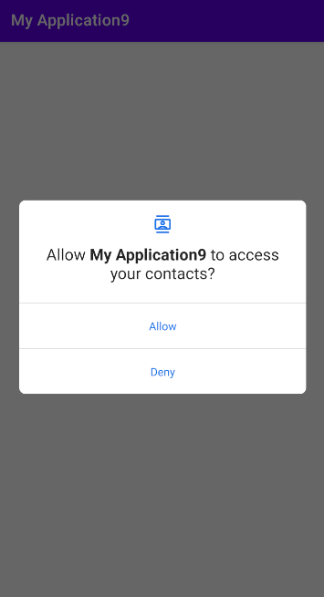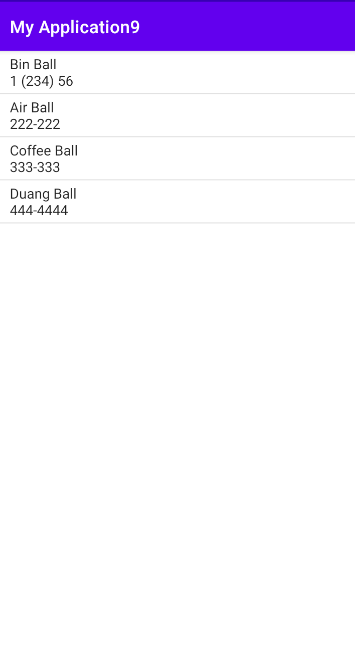


## 8.3	自定义内容提供器

要自定义内容提供器，只需要新建一个类并继承ContentProvider，实现其中6个方法：

```java
public class MyProvider extends ContentProvider {
    @Override
    //初始化内容提供器时调用，通常在这里完成数据库的创建和升级操作，返回值表示操作是否成功
    //注意，只有当存在ContentResolver尝试访问程序中数据时，内容提供器才会被初始化
    public boolean onCreate() {
        return false;
    }

    @Nullable
    @Override
    //从内容提供器中查询数据，使用uri确定表，projection确定列，selection和selectionArgs约束，sortOrder排序
    //查询结果放在Cursor对象中。
    public Cursor query(@NonNull Uri uri, @Nullable String[] projection, @Nullable String selection, @Nullable String[] selectionArgs, @Nullable String sortOrder) {
        return null;
    }

    @Nullable
    @Override
    //向内容提供器添加一条数据，uri确定表，待保存数据存放在ContentValues实例
    //返回的URI表示这条新纪录
    public Uri insert(@NonNull Uri uri, @Nullable ContentValues values) {
        return null;
    }

    @Override
    //从内容提供器删除数据，uri确定表，selection和selectionArgs用于约束
    // 返回值为受影响行数
    public int delete(@NonNull Uri uri, @Nullable String selection, @Nullable String[] selectionArgs) {
        return 0;
    }

    @Override
    //更新内容提供器已有数据，uri确定表，新数据保存在ContentValues实例， selection和selectionArgs用于约束
    //返回值为受影响行数
    public int update(@NonNull Uri uri, @Nullable ContentValues values, @Nullable String selection, @Nullable String[] selectionArgs) {
        return 0;
    }

    @Nullable
    @Override
    //根据传入内容URI返回对应MIME类型
    public String getType(@NonNull Uri uri) {
        return null;
    }
}
```

可以看到，几乎每个方法都需要我们传递一个Uri参数，我们再来回顾一下Uri：

一个标准的内容URI是这样的：

```java
content://com.example.app.provider/table1
```

这表示我们访问的是应用com.example.app.provider的表table1

我们还可以再加上一个id：

```java
content://com.example.app.provider/table1/1
```

这表示我们访问的是应用com.example.app.provider的表table1中id为1的数据

内容URI主要使用的格式就是这两种：以路径结尾表示期望访问整张表的数据；以id结尾表示期望访问表中拥有该id的数据，我们还可以使用通配符分别匹配这两种格式的内容URI：

- *：表示匹配任意长度字符
- #：表示匹配任意长度数字

所以，一个匹配任意表的内容URI可以写作：

```java
content://com.example.app.provider/*
```

而一个匹配table1表中任意一行数据的内容URI写作：

```java
content://com.example.app.provider/table1/#
```


接着，我们可以借助UriMatcher这个类，实现匹配内容URI的功能。

UriMatcher提供了一个addURI()方法，这个方法接收3个参数，可以分别将authority、path和一个自定义代码传入。

这样，当调用UriMatcher的match()方法时，我们可以传入一个Uri对象，返回值是某个能匹配该对象对应的自定义代码，利用这个代码，我们就直到调用方期望获取的是哪张表中的数据了。

修改MyProvider中数据：

```java
public class MyProvider extends ContentProvider {

    public static final int TABLE1_DIR=0;//访问table1表中所有数据

    public static final int TABLE1_ITEM=1;//访问table1表中单条数据

    public static final int TABLE2_DIR=2;//访问table2表中所有数据

    public static final int TABLE2_ITEM=3;//访问table2表中单条数据

    private static UriMatcher uriMatcher;

    static {//创建UriMatcher实例，在CRUD时调用uriMatcher.match()方法匹配对应自定义操作符
        uriMatcher = new UriMatcher(UriMatcher.NO_MATCH);
        uriMatcher.addURI("com.example.myapplication9.provider", "table1", TABLE1_DIR);
        uriMatcher.addURI("com.example.myapplication9.provider", "table1/#", TABLE1_ITEM);
        uriMatcher.addURI("com.example.myapplication9.provider", "table2", TABLE2_DIR);
        uriMatcher.addURI("com.example.myapplication9.provider", "table2/#", TABLE2_ITEM);
    }

    @Nullable
    @Override
    //从内容提供器中查询数据，使用uri确定表，projection确定列，selection和selectionArgs约束，sortOrder排序
    //查询结果放在Cursor对象中。
    public Cursor query(@NonNull Uri uri, @Nullable String[] projection, @Nullable String selection, @Nullable String[] selectionArgs, @Nullable String sortOrder) {
        switch (uriMatcher.match(uri)){
            case TABLE1_DIR://查询table1表中所有数据
                break;
            case TABLE1_ITEM://查询table1表中单条数据
                break;
            case TABLE2_DIR://查询table2表中所有数据
                break;
            case TABLE2_ITEM://查询table2表中单条数据
                break;
            default:
                break;
        }
        return null;
    }//只以query()方法作为示例，insert()、update()、delete()方法原理与之基本相同
   
    ...
        
}
```

除此之外，我们还必须实现方法getType()，而这个方法要求我们根据传入内容URI返回对应MIME类型

一个内容URI对应的MIME字符串应当由三部分组成：

- 必须以vnd开头
- 如果内容URI以路径结尾，则后接android.cursor.dir/；如果内容URI以id结尾，则后接android.cursor.item/
- 最后接上vnd.<authority>.<path>

所以，对于content://com.example.app.provider/table1这个内容URI，其对应MIME类型应为：

```java
vnd.android.cursor.dir/vnd.com.example.app.provider.table1
```

而对于内容URIcontent://com.example.app.provider/table1/1，其对应MIME类型应为：

```
vnd.android.cursor.item/vnd.com.example.app.provider.table1
```

按照这个逻辑，我们来实现方法getType()：

```java
@Nullable
@Override
public String getType(@NonNull Uri uri) {
    switch (uriMatcher.match(uri)){
        case TABLE1_DIR:
            return "vnd.android.cursor.dir/vnd.com.example.app.provider.table1";
        case TABLE1_ITEM:
            return "vnd.android.cursor.item/vnd.com.example.app.provider.table1";
        case TABLE2_DIR:
            return "vnd.android.cursor.dir/vnd.com.example.app.provider.table2";
        case TABLE2_ITEM:
            return "vnd.android.cursor.item/vnd.com.example.app.provider.table2";
        default:
            return null;
    }
}
```


## 8.4	实现跨程序数据共享

我们以第七章数据库项目为基础继续开发，首先删去项目中的Toast，因为跨程序访问时我们不能直接使用Toast

接下来创建一个内容提供器类，命名为：

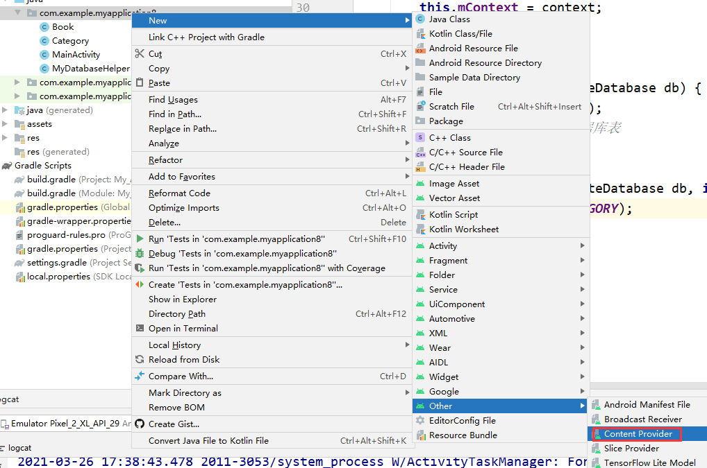

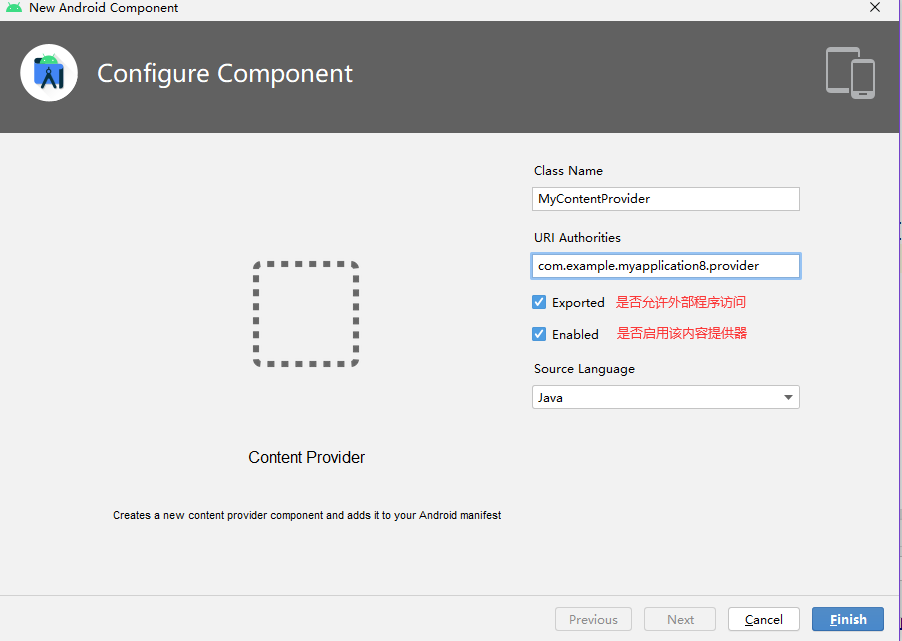

接下来完成内容提供器的代码：

```java
public class MyContentProvider extends ContentProvider {

    public static final int BOOK_DIR = 0;//访问Book表全部数据

    public static final int BOOK_ITEM = 1;//访问Book表某条数据

    public static final int CATEGORY_DIR = 2;//访问Category表全部数据

    public static final int CATEGORY_ITEM = 3;//访问Category表某条数据

    public static final String AUTHORITY = "com.example.myapplication8.provider";

    private static UriMatcher uriMatcher;

    private MyDatabaseHelper dbHelper;

    static {
        uriMatcher = new UriMatcher(UriMatcher.NO_MATCH);
        uriMatcher.addURI(AUTHORITY, "book", BOOK_DIR);
        uriMatcher.addURI(AUTHORITY, "book/#", BOOK_ITEM);
        uriMatcher.addURI(AUTHORITY, "category", CATEGORY_DIR);
        uriMatcher.addURI(AUTHORITY, "category/#", CATEGORY_ITEM);
    }

    @Override
    public boolean onCreate() {
        dbHelper = new MyDatabaseHelper(getContext(), "BookStore.db", null ,2);
        return true;
    }

    @Override
    //查询返回Cursor对象，存储了查询结果
    public Cursor query(Uri uri, String[] projection, String selection,
                        String[] selectionArgs, String sortOrder) {
        SQLiteDatabase database = dbHelper.getWritableDatabase();
        Cursor cursor = null;
        switch (uriMatcher.match(uri)){
            case BOOK_DIR:
                cursor = database.query(
                        "Book", projection, selection , selectionArgs, null, null, sortOrder);
                break;
            case BOOK_ITEM:
                //调用uri的getPathSegments()方法，它将内容URI权限之后部分以"/"符号分割，并将分割后结果放到一个String[]中
                //其中第0个是路径path，第1个是id
                String bookId = uri.getPathSegments().get(1);//获取要查询的记录对应ID
                cursor = database.query(
                        "Book", projection, "id = ?", new String[]{bookId}, null, null, sortOrder);
                break;
            case CATEGORY_DIR:
                cursor = database.query(
                        "Category", projection, selection , selectionArgs, null, null, sortOrder);
                break;
            case CATEGORY_ITEM:
                String categoryId = uri.getPathSegments().get(1);//获取要查询的记录对应ID
                cursor = database.query(
                        "Category", projection, "id = ?", new String[]{categoryId}, null, null, sortOrder);
                break;
            default:
                break;
        }
        return cursor;
    }

    @Override
    //查询返回Uri，记录了新添加的记录所在位置
    public Uri insert(Uri uri, ContentValues values) {
        SQLiteDatabase database = dbHelper.getWritableDatabase();
        Uri uriReturn = null;
        switch (uriMatcher.match(uri)){
            case BOOK_DIR:
            case BOOK_ITEM:
                long bookId = database.insert("Book", null, values);
                uriReturn = Uri.parse("content://" + AUTHORITY + "/book/" + bookId);
                break;
            case CATEGORY_DIR:
            case CATEGORY_ITEM:
                long categoryId = database.insert("Category", null, values);
                uriReturn = Uri.parse("content://" + AUTHORITY + "/book/" + categoryId);
                break;
            default:
                break;
        }
        return uriReturn;
    }

    @Override
    //返回int，表示受影响行数
    public int update(Uri uri, ContentValues values, String selection,
                      String[] selectionArgs) {
        int updatedRows = 0;
        SQLiteDatabase database = dbHelper.getWritableDatabase();
        switch (uriMatcher.match(uri)){
            case BOOK_DIR:
                updatedRows = database.update("Book", values, selection ,selectionArgs);
                break;
            case BOOK_ITEM:
                String bookId = uri.getPathSegments().get(1);
                updatedRows = database.update("Book", values, "id = ?", new String[]{bookId});
                break;
            case CATEGORY_DIR:
                updatedRows = database.update("Category", values, selection ,selectionArgs);
                break;
            case CATEGORY_ITEM:
                String categoryId = uri.getPathSegments().get(1);
                updatedRows = database.update("Category", values, "id = ?", new String[]{categoryId});
                break;
            default:
                break;
        }
        return updatedRows;
    }

    @Override
    //返回int，表示受影响行数
    public int delete(Uri uri, String selection, String[] selectionArgs) {
        SQLiteDatabase database = dbHelper.getWritableDatabase();
        int deletedRows = 0;
        switch (uriMatcher.match(uri)){
            case BOOK_DIR:
                deletedRows = database.delete("Book", selection, selectionArgs);
                break;
            case BOOK_ITEM:
                String bookId = uri.getPathSegments().get(1);
                deletedRows = database.delete("Book", "id = ?", new String[]{bookId});
                break;
            case CATEGORY_DIR:
                deletedRows = database.delete("Category", selection, selectionArgs);
                break;
            case CATEGORY_ITEM:
                String categoryId = uri.getPathSegments().get(1);
                deletedRows = database.delete("Category", "id = ?", new String[]{categoryId});
                break;
            default:
                break;
        }
        return deletedRows;
    }

    @Override
    //返回内容URI对应MIME类型
    public String getType(Uri uri) {
        switch (uriMatcher.match(uri)) {
            case BOOK_DIR:
                return "vnd.android.cursor.dir/vnd.com.example.myapplication.provider.book";
            case BOOK_ITEM:
                return "vnd.android.cursor.item/vnd.com.example.myapplication.provider.book";
            case CATEGORY_DIR:
                return "vnd.android.cursor.dir/vnd.com.example.myapplication.provider.category";
            case CATEGORY_ITEM:
                return "vnd.android.cursor.item/vnd.com.example.myapplication.provider.category";
            default:
                return null;
        }
    }
}
```

需要注意的是，内容提供器必须在AndroidManifest.xml中注册，不过由于我们是由AS帮助生成的内容提供器，因此它已经完成了注册工作：

```xml
<provider
    android:name=".MyContentProvider"
    android:authorities="com.example.myapplication8.provider"
    android:enabled="true"
    android:exported="true"/>
<!--android:name指定类名-->
<!--android:authorities指定内容提供器的authority-->
```


现在我们已经完成了这个项目代码的编写，为了避免之前数据库操作对之后测试的影响，我们先在模拟器上卸载应用并重新安装：

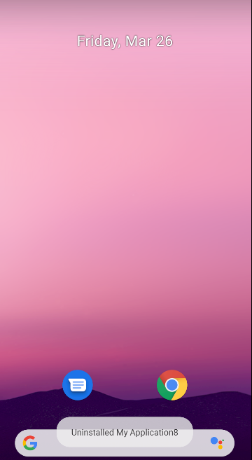

创建新项目ProviderTest，我们就用这个项目进行跨程序数据共享的测试，首先在MainActivity中放置四个Button，用于CRUD操作：

```xml
<Button
        android:id="@+id/btn_data_add"
        android:text="Add data to Book"
        android:layout_width="match_parent"
        android:layout_height="wrap_content"/>

<Button
        android:id="@+id/btn_data_query"
        android:text="Query data from Book"
        android:layout_width="match_parent"
        android:layout_height="wrap_content"/>

<Button
        android:id="@+id/btn_data_update"
        android:text="Update Book"
        android:layout_width="match_parent"
        android:layout_height="wrap_content"/>

<Button
        android:id="@+id/btn_data_delete"
        android:text="Delete data from Book"
        android:layout_width="match_parent"
        android:layout_height="wrap_content"/>
```

```java
public class MainActivity extends AppCompatActivity {

    private String newId;

    @Override
    protected void onCreate(Bundle savedInstanceState) {
        super.onCreate(savedInstanceState);
        setContentView(R.layout.activity_main);
        Button addData = findViewById(R.id.btn_data_add);
        Button updateData = findViewById(R.id.btn_data_update);
        Button deleteData = findViewById(R.id.btn_data_delete);
        Button queryData = findViewById(R.id.btn_data_query);

        addData.setOnClickListener(new View.OnClickListener() {
            @Override
            public void onClick(View v) {//添加数据
                Uri uri = Uri.parse("content://com.example.myapplication8.provider/book");
                ContentValues values = new ContentValues();
                values.put("name", "A Clash of Kings");
                values.put("author", "George Martin");
                values.put("pages", 1040);
                values.put("price", 22.85);
                Uri newUri = getContentResolver().insert(uri, values);
                newId = newUri.getPathSegments().get(1);
            }
        });

        queryData.setOnClickListener(new View.OnClickListener() {
            @Override
            public void onClick(View v) {
                Uri uri = Uri.parse("content://com.example.myapplication8.provider/book/" + newId);
                Cursor cursor = getContentResolver().query(uri, null, null, null, null);
                if(cursor!=null){
                    cursor.moveToFirst();
                    String name = cursor.getString(cursor.getColumnIndex("name"));
                    String author = cursor.getString(cursor.getColumnIndex("author"));
                    int pages = cursor.getInt(cursor.getColumnIndex("pages"));
                    double price = cursor.getDouble(cursor.getColumnIndex("price"));
                    Log.d("MainActivity", "book name is " + name);
                    Log.d("MainActivity", "book author is " + author);
                    Log.d("MainActivity", "book pages is " + pages);
                    Log.d("MainActivity", "book price is " + price);
                    cursor.close();
                }
            }
        });

        //由于在内容URI中已经指明了目标ID，因此即使约束条件为空也不会影响其他数据
        updateData.setOnClickListener(new View.OnClickListener() {
            @Override
            public void onClick(View v) {
                Uri uri = Uri.parse("content://com.example.myapplication8.provider/book/" + newId);
                ContentValues values = new ContentValues();
                values.put("name", "A Storm of swords");
                values.put("pages", 1216);
                values.put("price", 24.05);
                getContentResolver().update(uri, values, null, null);
            }
        });

        //由于在内容URI中已经指明了目标ID，因此即使约束条件为空也不会影响其他数据
        deleteData.setOnClickListener(new View.OnClickListener() {
            @Override
            public void onClick(View v) {
                Uri uri = Uri.parse("content://com.example.myapplication8.provider/book/" + newId);
                getContentResolver().delete(uri, null, null);
            }
        });
    }
}
```

运行程序，依次点击按钮：

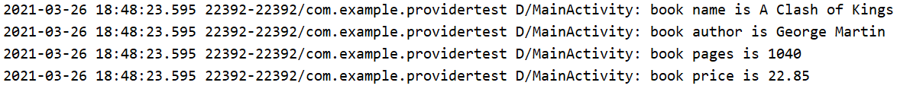

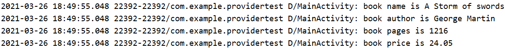