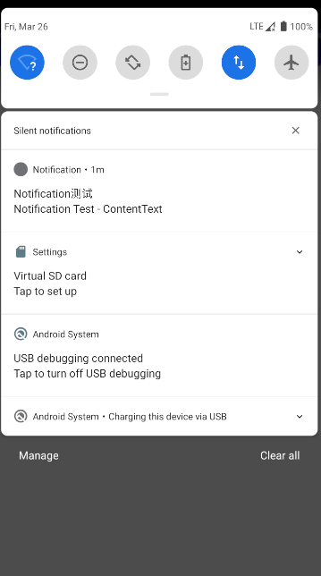
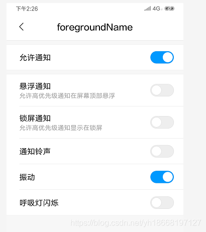
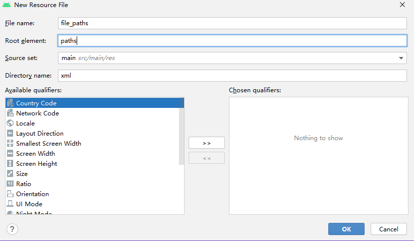
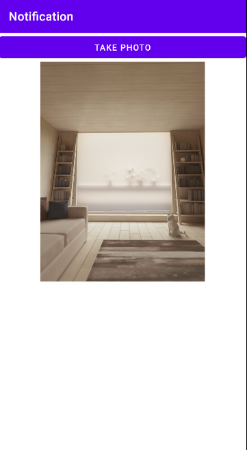
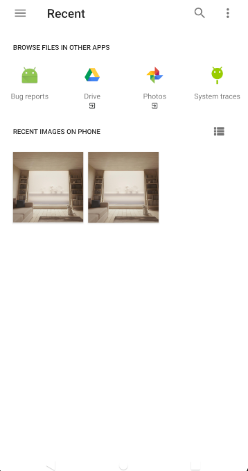
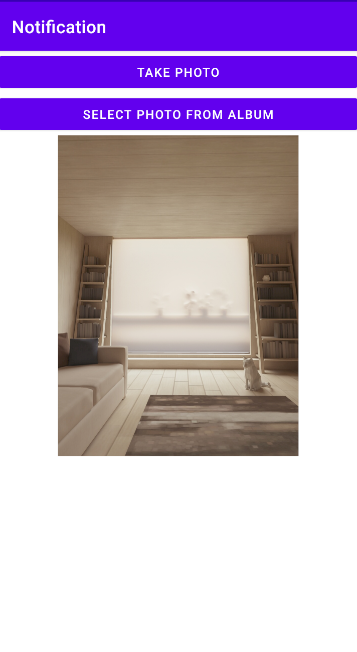
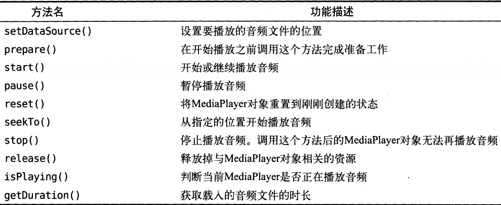
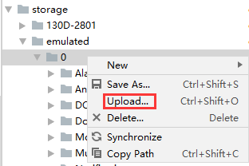
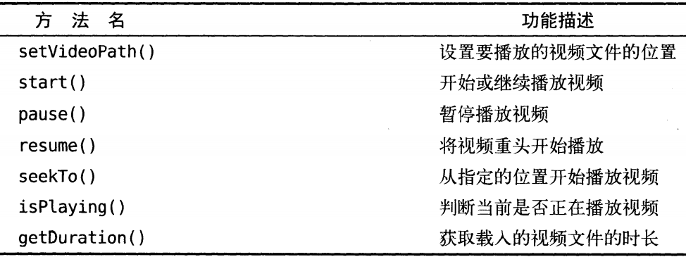

# 9.	Android多媒体

本章我们研究Android上一些多媒体功能的使用

## 9.0	将程序运行到手机上


## 9.1	通知Notification

通知是Android系统的一个特色功能，当某个程序希望向用户发出提示信息，而该应用又不在前台运行时，就可以借助通知来实现。发出一条通知后，手机最上方的通知栏会显示一个通知的图标，下拉状态栏就可以看到通知的详细信息。

### 9.1.1	通知基本使用

通知的用法较为灵活，既可以在Activity中创建，也可以在广播接收器中创建，还可以在即将学习的Service中创建。

相比于在广播接收器中创建和在Service中创建，在Activity中创建通知的应用场景较少，因为一般情况下我们只有在程序进入后台时才需要使用通知。

但这三种创建通知方式的流程基本相同：

- 首先需要使用NotificationManager来管理通知，我们可以调用Context.getSystemService()方法获取，该方法接收一个字符串参数，用于确定获取系统的哪个Service，这里我们需要传入Context.NOTIFICATION_SERVICE来获取NotificationManager实例：

```java
NotificationManager notificationManager = (NotificationManager) getSystemService(Context.NOTIFICATION_SERVICE);
```

- 接下来需要使用一个Builder构造器创建Notification对象，需要注意的是，几乎每个Android版本都会对通知这部分功能进行或多或少的修改，为了保证稳定性，我们需要androidx.core.app.NotificationCompat类，需要注意的是在Android O，即Android8.0( API版本26 )之后，构造Notification的builder方法除了Context外，还需要传入NotificationChannel对象，我们会在后面介绍：

```java
Notification notification = new NotificationCompat.Builder(this, "default")
                .setContentTitle("Notification测试")//设置通知标题
                .setContentText("Notification Test - ContentText")//设置通知内容
                .setWhen(System.currentTimeMillis())//设置通知时间
                .setSmallIcon(R.mipmap.ic_launcher_round)//设置状态栏通知图标 注意只能使用纯alpha图层的图片
                .setLargeIcon(BitmapFactory.decodeResource(getResources(),
                        R.drawable.ic_launcher_foreground))//设置通知栏通知图标
                .build();//构造通知
```

- 最后，我们只需要调用NotificationManager的notify()方法就可以让通知显示出来，这个方法接收两个参数，第一个参数是通知id，我们应保证每个通知指定的id都是唯一的；第二个参数是Notification对象，即我们要发送的通知：

```java
notificationManager.notify(1, notification);
```


下面我们在MainActivity中添加一个Button，用于发送通知：

```xml
<Button
    android:id="@+id/btn_notification"
    android:text="Send Notification"
    android:layout_width="match_parent"
    android:layout_height="wrap_content"/>
```

```java
Button button = findViewById(R.id.btn_notification);
button.setOnClickListener(new View.OnClickListener() {
    @Override
    public void onClick(View v) {
        NotificationManager notificationManager = (NotificationManager) getSystemService(Context.NOTIFICATION_SERVICE);
        Notification notification = new NotificationCompat.Builder(MainActivity.this, "default")
            .setContentTitle("Notification测试")//设置通知标题
            .setContentText("Notification Test - ContentText")//设置通知内容
            .setWhen(System.currentTimeMillis())//设置通知时间
            .setSmallIcon(R.mipmap.ic_launcher_round)//设置状态栏通知图标
            .setLargeIcon(BitmapFactory.decodeResource(getResources(),
                                                       R.drawable.ic_launcher_foreground))//设置通知栏通知图标
            .build();//构造通知
        notificationManager.notify(1, notification);
    }
});
```

运行程序：



但我们很快会发现，这条通知被点击时也不会有任何事件发生，这是因为想要响应事件，我们还要设置PendingIntent：

它与Intent有些相似，比如它们都可以指定意图，可以用于启动Activity、Service或发送广播等。

不同的是，Intent倾向于立即执行动作，而PendingIntent更倾向于在某个合适的时机执行动作，因此PendingIntent可以简单理解为延迟执行的Intent

PendingIntent用法同样很简单，它提供了几个静态方法用于获取实例，可以根据需求决定使用getActivity()、getService()或getBroadcast()方法

这几个方法接收相同的参数，第一个参数是Content；第二个参数一般传入0即可，第三个参数是一个Intent对象，我们通过它来构建PendingIntent的意图；第四个参数用于确定PendingIntent的行为，有FLAG_ONE_SHOT、FLAG_NO_CREATE、FLAG_CANCEL_CURRENT和FLAG_UPDATE_CURRENT四个值可选，通常传入0即可。

在完成了PendingIntent的构建后，我们通过NotificationCompat.Builder的setContentIntent()方法添加我们的意图。

先创建一个新的Activity：NotifyActivity：

```xml
<?xml version="1.0" encoding="utf-8"?>
<LinearLayout xmlns:android="http://schemas.android.com/apk/res/android"
    xmlns:tools="http://schemas.android.com/tools"
    android:layout_width="match_parent"
    android:layout_height="match_parent"
    tools:context=".NotifyActivity">

    <TextView
        android:text="Notify Activity"
        android:layout_gravity="center"
        android:layout_width="match_parent"
        android:layout_height="wrap_content"/>
    
</LinearLayout>
```

我们构建一个PendingIntent，使得点击通知就跳转到NotifyActivity：

```java
Button button = findViewById(R.id.btn_notification);
button.setOnClickListener(new View.OnClickListener() {
    @Override
    public void onClick(View v) {
        NotificationManager notificationManager = (NotificationManager) getSystemService(Context.NOTIFICATION_SERVICE);
        NotificationChannel mChannel = null;
        if (android.os.Build.VERSION.SDK_INT >= android.os.Build.VERSION_CODES.O) {
            mChannel = new NotificationChannel(getString(R.string.app_name), getString(R.string.app_name), NotificationManager.IMPORTANCE_LOW);
            mChannel.setDescription("TestChannel");
            mChannel.setShowBadge(false);
            notificationManager.createNotificationChannel(mChannel);
        }

        Intent intent = new Intent(MainActivity.this, NotifyActivity.class);//Intent构建意图
        PendingIntent pi = PendingIntent.getActivity(MainActivity.this, 0, intent, 0);//以Intent构建PendingIntent

        Notification notification = new NotificationCompat.Builder(MainActivity.this, getString(R.string.app_name))
                .setContentTitle("Notification测试")//设置通知标题
                .setContentText("Notification Test - ContentText")//设置通知内容
                .setWhen(System.currentTimeMillis())//设置通知时间
                .setSmallIcon(R.mipmap.ic_launcher_round)//设置状态栏通知图标
                .setLargeIcon(BitmapFactory.decodeResource(getResources(),
                        R.drawable.ic_launcher_foreground))//设置通知栏通知图标
                .setContentIntent(pi)//设置PendingIntent
                .build();//构造通知
        notificationManager.notify(1, notification);
    }
});
```


#### 9.1.1.1	管理通知

当您需要为同一类型的事件多次发出同一通知时，应避免创建全新的通知， 而是应考虑通过更改之前通知的某些值和/或为其添加某些值来更新通知。

例如，Gmail 通过增加未读消息计数并将每封电子邮件的摘要添加到通知，通知用户收到了新的电子邮件。 这称为“堆叠”通知；通知设计指南对此进行了更详尽的描述。

##### 9.1.1.1.1	更新通知

要将通知设置为能够更新，请通过调用 NotificationManager.notify() 发出带有通知 ID 的通知。 要在发出之后更新此通知，请更新或创建 NotificationCompat.Builder 对象，从该对象构建 Notification 对象，并发出与之前所用 ID 相同的 Notification。如果之前的通知仍然可见，则系统会根据 Notification 对象的内容更新该通知。相反，如果之前的通知已被清除，系统则会创建一个新通知。


##### 9.1.1.1.2	删除通知

现在又出现了一个新的问题：点击了通知之后，虽然我们成功跳转到了NotifyActivity，但通知栏中的通知却没有消失。

这是因为如果我们不在代码中对该通知进行取消(删除)，那么它就会一直显示在系统状态栏上。解决的办法有两种：

- 在Notification.Builder()后连缀方法setAutoCancel()
- 显式调用NotificationManager的cancel()方法，取消通知


```java
//第一种写法
Notification notification = new NotificationCompat.Builder(MainActivity.this, getString(R.string.app_name))
        .setAutoCancel(true)//点击通知后通知消失
        .build();//构造通知

//第二种写法
public class NotifyActivity extends AppCompatActivity {

    @Override
    protected void onCreate(Bundle savedInstanceState) {
        super.onCreate(savedInstanceState);
        setContentView(R.layout.activity_notify);
        NotificationManager manager = (NotificationManager) getSystemService(Context.NOTIFICATION_SERVICE);
        manager.cancel(1);//取消对应ID的通知
    }
}
```


### 9.1.2	通知进阶使用

#### 9.1.2.1	设置通知音效

我们可以在构造Notification对象时，使用setSound()方法设置通知发出时的声音

该方法需要接收一个Uri参数，因此要指定音频文件时还需要获取到其对应URI

比如我们可以指定手机内置的音效，它们存放在/system/media/audio/ringtones目录下

则代码应写为：

```java
Notification notification = new NotificationCompat.Builder(MainActivity.this, getString(R.string.app_name))
        .setSound(Uri.fromFile(new File("/system/media/audio/ringtones/Luna.ogg")))//设置通知音效
        .build();//构造通知
```


#### 9.1.2.2	通知时振动

我们可以使通知发出时使手机振动，需要使用 `vibrate` 属性，这是一个长整型数组，用于设置手机静止和振动时长，以毫秒为单位。

下标为0的值表示手机静止时长，下标为1的值表示手机振动时长，下标为2的值又表示手机静止时长，以此类推。

因此，如果想让手机在通知到来时立即振动1秒，静止1秒，再振动1秒，代码可以写为：

```java
Notification notification = new NotificationCompat.Builder(MainActivity.this, getString(R.string.app_name))
        .setVibrate(new long[]{0, 1000, 1000, 1000})//立即振动1秒，静止1秒，再振动1秒
        .build();//构造通知
```

不过，想要手机振动还要在AndroidManifest.xml中注册权限：

```xml
<uses-permission android:name="android.permission.VIBRATE"/>
```


#### 9.1.2.3	通知时点亮LED灯

现在有很多手机都会前置一个LED灯，当有未读消息且手机锁屏时，LED灯就会不停闪烁，提醒用户查看消息。

我们可以通过setLights()方法实现这个效果，该方法接收三个参数：

- LED灯的颜色，如Color.GREEN
- LED亮起时长，以毫秒为单位
- LED暗去时长，以毫秒为单位

因此，当收到通知时，要实现LED灯闪烁绿色灯光，代码可写为：

```java
Notification notification = new NotificationCompat.Builder(MainActivity.this, getString(R.string.app_name))
        .setLights(Color.GREEN, 1000, 1000)//灯色为绿色，亮1秒暗1秒
        .build();//构造通知
```


#### 9.1.2.4	使用默认通知效果

当然，如果不想进行过多设置，也可以直接使用默认效果，系统会按当前手机的环境决定播放什么铃声以及如何振动等：

```java
Notification notification = new NotificationCompat.Builder(MainActivity.this, getString(R.string.app_name))
        .setDefaults(NotificationCompat.DEFAULT_ALL)//使用默认通知效果
        .build();//构造通知
```


注意，以上进阶技巧都要在手机上运行才能看到效果，模拟器不能表现振动、LED灯闪烁等功能。


### 9.1.3	通知高级功能

#### 9.1.3.1	构建富文本内容

假如我们将通知内容设置为很长的字符串：

```java
Notification notification = new NotificationCompat.Builder(MainActivity.this, getString(R.string.app_name))
                        .setContentTitle("Notification测试")//设置通知标题
                        .setContentText("The content text is very very very very very very very very very very long.")
                        .build();//构造通知
```

运行程序：


我们可以看到，通知内容无法完整显示，多余部分用省略号代替。因为通知的内容本就应该简单，详细内容应放在点击后打开的Activity中更合适。

但如果我们真的想要在通知中显示很长的一段文字，就可以使用setStyle()方法来实现，这个方法允许我们构建出富文本内容，也就是说通知中除了文字和图标外，还可以有长文字、图片等，我们使用NotificationCompat.BigTextStyle()构建长文字，

setStyle()方法接收一个NotificationCompat.Style参数：

```java
Notification notification = new NotificationCompat.Builder(MainActivity.this, getString(R.string.app_name))
                        .setContentTitle("Notification测试")//设置通知标题
                        .setStyle(new NotificationCompat.BigTextStyle().bigText("The content text is very very very very very very very very very very long."))
                        .build();//构造通知
```

运行程序：


现在，我们的长文字就能完整地在通知中显示了。	


我们还可以在通知中添加图片：

```java
Notification notification = new NotificationCompat.Builder(MainActivity.this, getString(R.string.app_name))
                        .setContentTitle("Notification测试")//设置通知标题
                        .setStyle(new NotificationCompat.BigPictureStyle().bigPicture(
                            //调用BitmapFactory的decodeResource()方法，将图片解析为Bitmap对象，传入bigPicture()方法
                                BitmapFactory.decodeResource(getResources(), R.drawable.kungbaochicken))//设置图片
                                .setSummaryText("This is Kung Bao Chicken"))//设置总结
                        .build();//构造通知
```

运行程序：


#### 9.1.3.2	设置通知优先级

我们可以调用setPriority()方法，设置通知的优先级，它接收一个整型参数作为通知的重要程度，共有五个常量可选：

- PRIORITY_DEFAULT：默认值，与不设置效果相同
- PRIORITY_MIN：最低重要程度，系统可能只在特定场景才会显示这条通知，如用户下拉通知栏
- PRIORITY_LOW：较低重要程度，系统会将通知缩小或将其排在更重要通知之后
- PRIORITY_HIGH：较高重要程度，系统会将通知放大或将其排在靠前的位置
- PRIORITY_MAX：最高重要程度，这类通知必须立即让用户看到，甚至需要用户做出相应

```java
Notification notification = new NotificationCompat.Builder(MainActivity.this, getString(R.string.app_name))
                        .setContentTitle("Notification测试")//设置通知标题
                        .setStyle(new NotificationCompat.BigPictureStyle().bigPicture(
                                BitmapFactory.decodeResource(getResources(), R.drawable.kungbaochicken))//设置图片
                                .setSummaryText("This is Kung Bao Chicken"))//设置总结
                        .setPriority(NotificationCompat.PRIORITY_MAX)//设置优先级
                        .build();//构造通知
```


#### 9.1.3.3	在通知中显示进度

通知可能包括动画形式的进度指示器，向用户显示正在进行的操作状态。 如果您可以估计操作所需的时间以及任意时刻的完成进度，则使用“限定”形式的指示器（进度栏）。 如果无法估计操作的时长，则使用“非限定”形式的指示器（Activity 指示器）。

平台的 ProgressBar 类实现中显示有进度指示器。

要在 Android 4.0 及更高版本的平台上使用进度指示器，需调用 setProgress()。
要显示限定形式的进度栏，请通过调用 setProgress(max, progress, false) 将进度栏添加到通知，然后发出通知。随着操作继续进行，递增 progress 并更新通知。操作结束时， progress 应该等于 max。调用 setProgress() 的常见方法是将 max 设置为 100，然后将 progress 作为操作的“完成百分比”值递增。

您可以在操作完成后仍保留显示进度栏，也可以将其删除。无论哪种情况，都请记住更新通知文本以显示操作已完成。 要删除进度栏，请调用 setProgress(0, 0, false)。例如：

```java
...
mNotifyManager =
        (NotificationManager) getSystemService(Context.NOTIFICATION_SERVICE);
mBuilder = new NotificationCompat.Builder(this);
mBuilder.setContentTitle("Picture Download")
    .setContentText("Download in progress")
    .setSmallIcon(R.drawable.ic_notification);
// Start a lengthy operation in a background thread
new Thread(
    new Runnable() {
        @Override
        public void run() {
            int incr;
            // Do the "lengthy" operation 20 times
            for (incr = 0; incr <= 100; incr+=5) {
                    // Sets the progress indicator to a max value, the
                    // current completion percentage, and "determinate"
                    // state
                    mBuilder.setProgress(100, incr, false);
                    // Displays the progress bar for the first time.
                    mNotifyManager.notify(0, mBuilder.build());
                        // Sleeps the thread, simulating an operation
                        // that takes time
                        try {
                            // Sleep for 5 seconds
                            Thread.sleep(5*1000);
                        } catch (InterruptedException e) {
                            Log.d(TAG, "sleep failure");
                        }
            }
            // When the loop is finished, updates the notification
            mBuilder.setContentText("Download complete")
            // Removes the progress bar
                    .setProgress(0,0,false);
            mNotifyManager.notify(ID, mBuilder.build());
        }
    }
// Starts the thread by calling the run() method in its Runnable
).start();
```


#### 9.1.3.4	设置可见性

您的应用可以控制在安全锁定屏幕上显示的通知中可见的详细级别。 调用 setVisibility() 并指定以下值之一：

VISIBILITY_PUBLIC 显示通知的完整内容。
VISIBILITY_SECRET 不会在锁定屏幕上显示此通知的任何部分。
VISIBILITY_PRIVATE 显示通知图标和内容标题等基本信息，但是隐藏通知的完整内容。
设置 VISIBILITY_PRIVATE 后，您还可以提供其中隐藏了某些详细信息的替换版本通知内容。例如，短信 应用可能会显示一条通知，指出“您有 3 条新短信”，但是隐藏了短信内容和发件人。要提供此替换版本的通知，请先使用 NotificationCompat.Builder 创建替换通知。创建专用通知对象时，请通过 setPublicVersion() 方法为其附加替换通知。

#### 9.1.3.5	在锁定屏幕上控制媒体播放

在 Android 5.0（API 级别 21）中，锁定屏幕不再基于 RemoteControlClient（现已弃用）显示媒体控件。取而代之的是，将 Notification.MediaStyle 模板与 addAction() 方法结合使用，后者可将操作转换为可点击的图标。

注：该模板和 addAction() 方法未包含在支持库中，因此这些功能只能在 Android 5.0 及更高版本的系统上运行。

要在 Android 5.0 系统的锁定屏幕上显示媒体播放控件，请将可见性设置为 VISIBILITY_PUBLIC，如上文所述。然后，添加操作并设置 Notification.MediaStyle 模板，如以下示例代码中所述：

```java
Notification notification = new Notification.Builder(context)
    // Show controls on lock screen even when user hides sensitive content.
    .setVisibility(Notification.VISIBILITY_PUBLIC)
    .setSmallIcon(R.drawable.ic_stat_player)
    // Add media control buttons that invoke intents in your media service
    .addAction(R.drawable.ic_prev, "Previous", prevPendingIntent) // #0
    .addAction(R.drawable.ic_pause, "Pause", pausePendingIntent)  // #1
    .addAction(R.drawable.ic_next, "Next", nextPendingIntent)     // #2
    // Apply the media style template
    .setStyle(new Notification.MediaStyle()
    .setShowActionsInCompactView(1 /* #1: pause button */)
    .setMediaSession(mMediaSession.getSessionToken())
    .setContentTitle("Wonderful music")
    .setContentText("My Awesome Band")
    .setLargeIcon(albumArtBitmap)
    .build();
```

注：弃用 RemoteControlClient 会对控制媒体产生进一步的影响。如需了解有关用于管理媒体会话和控制播放的新 API 的详细信息，请参阅媒体播放控件。


#### 9.1.3.6	自定义通知布局

您可以利用通知框架定义自定义通知布局，由该布局定义通知在 RemoteViews 对象中的外观。 自定义布局通知类似于常规通知，但是它们是基于 XML 布局文件中所定义的 RemoteViews。

自定义通知布局的可用高度取决于通知视图。普通视图布局限制为 64 dp，扩展视图布局限制为 256 dp。

要定义自定义通知布局，请首先实例化 RemoteViews 对象来扩充 XML 布局文件。然后，调用 setContent()，而不是调用 setContentTitle() 等方法。要在自定义通知中设置内容详细信息，请使用 RemoteViews 中的方法设置视图子项的值：

在单独的文件中为通知创建 XML 布局。您可以根据需要使用任何文件名，但必须使用扩展名 .xml。
在您的应用中，使用 RemoteViews 方法定义通知的图标和文本。通过调用 setContent() 将此 RemoteViews 对象放入 NotificationCompat.Builder 中。避免在 RemoteViews 对象上设置背景 Drawable，因为文本颜色可能使文本变得难以阅读。
此外，RemoteViews 类中还有一些方法可供您轻松将 Chronometer 或 ProgressBar 添加到通知布局。如需了解有关为通知创建自定义布局的详细信息，请参阅 RemoteViews 参考文档。

注意：
使用自定义通知布局时，要特别注意确保自定义布局适用于不同的设备方向和分辨率。 尽管这条建议适用于所有“视图”布局，但对通知尤为重要，因为抽屉式通知栏中的空间非常有限。 不要让自定义布局过于复杂，同时确保在各种配置中对其进行测试。

对自定义通知文本使用样式资源
始终对自定义通知的文本使用样式资源。通知的背景颜色可能因设备和系统版本的不同而异，使用样式资源有助于您充分考虑到这一点。 从 Android 2.3 开始，系统定义了标准通知布局文本的样式。若要在面向 Android 2.3 或更高版本系统的多个应用中使用相同样式，则应确保文本在显示背景上可见。


### 9.1.4	通知渠道Notification Channel

> 通知
>
> 在 Android 8.0 中，我们已重新设计通知，以便为管理通知行为和设置提供更轻松和更统一的方式。这些变更包括：
>
> Android 8.0 中的通知长按菜单。
>
> 通知渠道：Android 8.0 引入了通知渠道，其允许您为要显示的每种通知类型创建用户可自定义的渠道。用户界面将
> 通知渠道称之为通知类别。要了解如何实现通知渠道的信息，请参阅通知渠道指南。
>
> 通知标志：Android 8.0 引入了对在应用启动器图标上显示通知标志的支持。通知标志可反映某个应用是否存在与其
> 关联、并且用户尚未予以清除也未对其采取行动的通知。通知标志也称为通知点。要了解如何调整通知标志，请参阅通知标志指南。
>
> 休眠：用户可以将通知置于休眠状态，以便稍后重新显示它。重新显示时通知的重要程度与首次显示时相同。应用可以移除或更新已休眠的通知，但更新休眠的通知并不会使其重新显示。
>
> 通知超时：现在，使用 setTimeoutAfter() 创建通知时您可以设置超时。您可以使用此函数指定一个持续时间，超过该持续时间后，通知应取消。如果需要，您可以在指定的超时持续时间之前取消通知。
>
> 通知设置：当您使用 Notification.INTENT_CATEGORY_NOTIFICATION_PREFERENCESIntent 从通知创建指向应用通知设置的链接时，您可以调用 setSettingsText() 来设置要显示的文本。此系统可以提供以下 Extra 数据和 Intent，用于过滤应用必须向用户显示的设置：EXTRA_CHANNEL_ID、NOTIFICATION_TAG 和 NOTIFICATION_ID。
>
> 通知清除：系统现在可区分通知是由用户清除，还是由应用移除。要查看清除通知的方式，您应实现 NotificationListenerService 类的新 onNotificationRemoved() 函数。
>
> 背景颜色：您现在可以设置和启用通知的背景颜色。只能在用户必须一眼就能看到的持续任务的通知中使用此功能。例如，您可以为与驾车路线或正在进行的通话有关的通知设置背景颜色。您还可以使用 Notification.Builder.setColor() 设置所需的背景颜色。这样做将允许您使用 Notification.Builder.setColorized() 启用通知的背景颜色设置。
>
> 消息样式：现在，使用 MessagingStyle 类的通知可在其折叠形式中显示更多内容。对于与消息有关的通知，您应使用 MessagingStyle 类。您还可以使用新的 addHistoricMessage() 函数，通过向与消息相关的通知添加历史消息为会话提供上下文。

设置好通知Channel还可以在手机设置→通知中看到每个APP的通知渠道：




#### 9.1.4.1	构建NotificationChannel对象

要创建通知渠道，请执行下列操作：

- 构建一个在软件包内具有唯一 ID 的通知渠道对象。
- 为该通知渠道对象配置所需的任何初始设置（例如提示音以及对用户可见的可选说明）。
- 将通知渠道对象提交到通知管理器。

构造方法
三个参数分别为ID,名字,重要度

NotificationChannel(String id,CharSequence name, int importance)

几个重要度:

 * IMPORTANCE_NONE 关闭通知
 * IMPORTANCE_MIN 开启通知，不会弹出，但没有提示音，状态栏中无显示
 * IMPORTANCE_LOW 开启通知，不会弹出，不发出提示音，状态栏中显示
 * IMPORTANCE_DEFAULT 开启通知，不会弹出，发出提示音，状态栏中显示
 * IMPORTANCE_HIGH 开启通知，会弹出，发出提示音，状态栏中显示

如果试图使用初始值创建的通知渠道已存在，不会执行任何操作，因此启动应用时可以放心地执行以上步骤序列。以下示例代码演示的是如何创建具有低重要性级别和自定义振动模式的通知渠道：

```java
mNotificationManager = (NotificationManager) getSystemService(Context.NOTIFICATION_SERVICE);
// 通知渠道的id
String id = "my_channel_01";
// 用户可以看到的通知渠道的名字.
CharSequence name = getString(R.string.channel_name);
// 用户可以看到的通知渠道的描述
String description = getString(R.string.channel_description);
int importance = NotificationManager.IMPORTANCE_HIGH;
NotificationChannel mChannel = new NotificationChannel(id, name, importance);
// 配置通知渠道的属性
mChannel.setDescription(description);
// 设置通知出现时的闪灯（如果 android 设备支持的话）
mChannel.enableLights(true);
mChannel.setLightColor(Color.RED);
// 设置通知出现时的震动（如果 android 设备支持的话）
mChannel.enableVibration(true);
mChannel.setVibrationPattern(new long[]{100, 200, 300, 400, 500, 400, 300, 200, 400});
//最后在notificationmanager中创建该通知渠道
mNotificationManager.createNotificationChannel(mChannel);
```


#### 9.1.4.2	创建通知

我们使用NotificationCompat.Builder()方法构造Notification对象，该方法需要传入两个参数：

第一个参数是Context，第二个参数是要使用的NotificationChannel对象对应的channelId：

```java
Notification notification = new NotificationCompat.Builder(MainActivity.this, "my_channel_01").build();//构造通知
```


#### 9.1.4.3	读取通知渠道设置

用户可以修改通知渠道的设置，包括振动和提示音等行为。开发者可以调用以下两个方法来发现用户对通知渠道应用的设置：

- 要检索单个通知渠道，可以调用 [getNotificationChannel()](https://link.jianshu.com?t=https://developer.android.google.cn/reference/android/app/NotificationManager.html#getNotificationChannel(java.lang.String))。
- 要检索归属的应用的所有通知渠道，可以调用 [getNotificationChannels()](https://link.jianshu.com?t=https://developer.android.google.cn/reference/android/app/NotificationManager.html#getNotificationChannels())。


#### 9.1.4.4	更新通知渠道设置

一旦创建了通知渠道，其设置和行为就由用户掌控。可以再次调用 [createNotificationChannel()](https://link.jianshu.com?t=https://developer.android.google.cn/reference/android/app/NotificationManager.html#createNotificationChannel(android.app.NotificationChannel))以重命名现有通知渠道，或更新其说明。以下示例代码说明如何通过创建启动 Activity 的 Intent 将用户重定向到通知渠道的设置。在本例中，Intent 要求提供扩展数据，包括通知渠道的 ID 和应用的软件包名称。

```java
Intent intent = new Intent(Settings.ACTION_CHANNEL_NOTIFICATION_SETTINGS);
intent.putExtra(Settings.EXTRA_CHANNEL_ID,mChannel.getId());
intent.putExtra(Settings.EXTRA_APP_PACKAGE, getPackageName());
startActivity(intent);
```


#### 9.1.4.5	删除通知渠道

可以通过调用方法 [deleteNotificationChannel()](https://link.jianshu.com?t=https://developer.android.google.cn/reference/android/app/NotificationManager.html#deleteNotificationChannel(java.lang.String))来删除通知渠道。作为一个垃圾信息预防机制，通知设置中将显示已删除渠道的数量。可以通过以下任一方法清除开发设备上的测试渠道：重新安装应用；清除与应用副本关联的数据。以下示例代码演示了如何删除通知渠道。

```objectivec
NotificationManager mNotificationManager = (NotificationManager) getSystemService(Context.NOTIFICATION_SERVICE);
// 通知渠道的id
String id = "my_channel_01";
NotificationChannel mChannel = mNotificationManager.getNotificationChannel(id);
mNotificationManager.deleteNotificationChannel(mChannel);
```


## 9.2	调用摄像头和相册

我们经常需要在程序中使用用户提供的图片，这些图片可以来自相册，也可以来自摄像头，本节就来学习调用摄像头和相册。


### 9.2.1	调用摄像头拍照

在MainActivity中添加两个组件，其中Button用于拍照，ImageView用于显示拍到的照片：

```xml
<Button
    android:id="@+id/btn_take_photo"
    android:text="Take Photo"
    android:layout_width="match_parent"
    android:layout_height="wrap_content"/>

<ImageView
    android:id="@+id/img"
    android:layout_gravity="center_horizontal"
    android:layout_width="wrap_content"
    android:layout_height="wrap_content"/>
```

```java
public class MainActivity extends AppCompatActivity {

    public static final int TAKE_PHOTO = 1;

    private ImageView img;

    private Uri imgUri;

    @Override
    protected void onCreate(Bundle savedInstanceState) {
        super.onCreate(savedInstanceState);
        setContentView(R.layout.activity_main);
        Button takePhotoBtn = findViewById(R.id.btn_take_photo);
        img = findViewById(R.id.img);
        takePhotoBtn.setOnClickListener(new View.OnClickListener() {
            @Override
            public void onClick(View v) {
                //创建File对象，用于存储拍到的照片
                File outputImg = new File(getExternalCacheDir(), "output_img.jpg");
                //将文件存放在外部缓存路径ExternalCacheDir，即SD卡的应用关联缓存目录，具体路径为/sdcard/Android/data/<package name>/cache
                //从Android6.0开始，读写SD卡被列为危险权限，若将图片存放在SD卡下任何其他目录，都要进行运行时权限处理，而使用外部缓存路径则可以跳过这步
                if(outputImg.exists()){//若已存在同名文件则删除
                    outputImg.delete();
                }
                try {
                    outputImg.createNewFile();//创建新文件
                } catch (IOException e) {
                    e.printStackTrace();
                }
                //若系统版本高于Android7.0
                //Android7.0系统开始，直接使用本地真实路径的Uri不认为是不安全的，会抛出FileUriExposedException
                //FileProvider是一种特殊的内容提供器，它使用类似内容提供器的机制保护数据，可以选择性将封装的Uri共享给外部，提高应用安全性
                if(Build.VERSION.SDK_INT >= 24){
                    //FileProvider.getUriForFile()方法将File对象转换为一个封装了的Uri对象
                    //getUriForFile()方法接收三个参数，第一个参数是Context，第二个参数authority可为任意唯一字符串，第三个参数是File对象
                    imgUri = FileProvider.getUriForFile(
                            MainActivity.this, "com.example.notification.fileprovider", outputImg);
                }else{
                    imgUri = Uri.fromFile(outputImg);
                }
                //启动相机程序
                Intent intent = new Intent("android.media.action.IMAGE_CAPTURE");
                intent.putExtra(MediaStore.EXTRA_OUTPUT, imgUri);//设置输出路径为目标路径
                startActivityForResult(intent, TAKE_PHOTO);//获取结果
            }
        });
    }

    @Override
    protected void onActivityResult(int requestCode, int resultCode, @Nullable Intent data) {
        super.onActivityResult(requestCode, resultCode, data);
        if (requestCode==TAKE_PHOTO && resultCode==RESULT_OK) {
            try {
                //将照片对应URI传入getContentResolver().openInputStream()方法，构建InputStream输入流
                //将输入流传入BitmapFactory.decodeStream()方法，构建Bitmap对象
                Bitmap bitmap = BitmapFactory.decodeStream(getContentResolver().openInputStream(imgUri));
                img.setImageBitmap(bitmap);//将Bitmap对象作为图像源展示到ImageView
            } catch (FileNotFoundException e) {
                e.printStackTrace();
            }
        }
    }
}
```

要注意我们刚才使用了一个内容提供器FileProvider，因此要到AndroidManifest.xml中进行注册：

我们在这里使用了@xml/file_paths，因此我们需要创建对应文件：

在res目录下新建目录xml，创建XML文件file_paths：



```xml
<?xml version="1.0" encoding="utf-8"?>
<paths xmlns:android="http://schemas.android.com/apk/res/android">
    <external-path name="my_imgs" path=""/>
</paths>
<!--external-path用于指定Uri共享，name可为任意值，path表示共享的具体路径-->
<!--这里将path设为空值表示将整个SD卡共享，也可以只共享我们存放图片的路径-->
```

另外，在Android4.4版本之前，访问SD卡的应用关联目录也需要声明权限。为了兼容老版本手机，我们还是需要声明权限：

```xml
<uses-permission android:name="android.permission.WRITE_EXTERNAL_STORAGE"/>
```

运行程序，点击按钮，我们就可以调用摄像头进行拍照了：



### 9.2.2	从相册选择图片

添加一个Button，用于从相册中选择图片：

```xml
<Button
    android:id="@+id/btn_select_photo"
    android:text="Select Photo From Album"
    android:layout_width="match_parent"
    android:layout_height="wrap_content"/>
```

将整个MainActivity代码修改：

```java
public class MainActivity extends AppCompatActivity {

    public static final int TAKE_PHOTO = 1;

    public static final int SELECT_PHOTO = 2;

    private ImageView img;

    private Uri imgUri;

    @Override
    protected void onCreate(Bundle savedInstanceState) {
        super.onCreate(savedInstanceState);
        setContentView(R.layout.activity_main);
        Button takePhotoBtn = findViewById(R.id.btn_take_photo);
        img = findViewById(R.id.img);
        takePhotoBtn.setOnClickListener(new View.OnClickListener() {
            @Override
            public void onClick(View v) {
                //创建File对象，用于存储拍到的照片
                File outputImg = new File(getExternalCacheDir(), "output_img.jpg");
                //将文件存放在外部缓存路径ExternalCacheDir，即SD卡的应用关联缓存目录，具体路径为/sdcard/Android/data/<package name>/cache
                //从Android6.0开始，读写SD卡被列为危险权限，若将图片存放在SD卡下任何其他目录，都要进行运行时权限处理，而使用外部缓存路径则可以跳过这步
                if(outputImg.exists()){//若已存在同名文件则删除
                    outputImg.delete();
                }
                try {
                    outputImg.createNewFile();//创建新文件
                } catch (IOException e) {
                    e.printStackTrace();
                }
                //若系统版本高于Android7.0
                //Android7.0系统开始，直接使用本地真实路径的Uri不认为是不安全的，会抛出FileUriExposedException
                //FileProvider是一种特殊的内容提供器，它使用类似内容提供器的机制保护数据，可以选择性将封装的Uri共享给外部，提高应用安全性
                if(Build.VERSION.SDK_INT >= 24){
                    //FileProvider.getUriForFile()方法将File对象转换为一个封装了的Uri对象
                    //getUriForFile()方法接收三个参数，第一个参数是Context，第二个参数可为任意唯一字符串，第三个参数是File对象
                    imgUri = FileProvider.getUriForFile(
                            MainActivity.this, "com.example.notification.fileprovider", outputImg);
                }else{
                    imgUri = Uri.fromFile(outputImg);
                }
                //启动相机程序
                Intent intent = new Intent("android.media.action.IMAGE_CAPTURE");
                intent.putExtra(MediaStore.EXTRA_OUTPUT, imgUri);//设置输出路径为目标路径
                startActivityForResult(intent, TAKE_PHOTO);//获取结果
            }
        });

        Button albumButton = findViewById(R.id.btn_select_photo);
        albumButton.setOnClickListener(new View.OnClickListener() {
            @Override
            public void onClick(View v) {
                if(ContextCompat.checkSelfPermission(MainActivity.this, Manifest.permission.READ_EXTERNAL_STORAGE)
                != PackageManager.PERMISSION_GRANTED){//获取运行时权限
                    ActivityCompat.requestPermissions(
                            MainActivity.this, new String[]{Manifest.permission.READ_EXTERNAL_STORAGE}, 1);
                }else {
                    openAlbum();
                }
            }
        });
    }

    private void openAlbum() {
        Intent intent = new Intent("android.intent.action.GET_CONTENT");
        intent.setType("image/*");
        startActivityForResult(intent, SELECT_PHOTO);//启动相册
    }

    @Override
    public void onRequestPermissionsResult(int requestCode, @NonNull String[] permissions, @NonNull int[] grantResults) {
        super.onRequestPermissionsResult(requestCode, permissions, grantResults);
        if(requestCode==SELECT_PHOTO){
            if (grantResults!=null && grantResults[0]==PackageManager.PERMISSION_GRANTED){
                openAlbum();
            }else{
                Toast.makeText(this, "You denied the permission", Toast.LENGTH_SHORT).show();
            }
        }
    }

    @Override
    protected void onActivityResult(int requestCode, int resultCode, @Nullable Intent data) {
        super.onActivityResult(requestCode, resultCode, data);
        if (requestCode==TAKE_PHOTO && resultCode==RESULT_OK) {
            try {
                //将照片对应URI传入getContentResolver().openInputStream()方法，构建InputStream输入流
                //将输入流传入BitmapFactory.decodeStream()方法，构建Bitmap对象
                Bitmap bitmap = BitmapFactory.decodeStream(getContentResolver().openInputStream(imgUri));
                img.setImageBitmap(bitmap);//将Bitmap对象作为图像源展示到ImageView
            } catch (FileNotFoundException e) {
                e.printStackTrace();
            }
        }else if(requestCode==SELECT_PHOTO && resultCode==RESULT_OK){
            imgUri = data.getData();//获取Uri
            Bitmap bitmap = null;
            InputStream in = null;
            try {
                in = getContentResolver().openInputStream(imgUri);//根据URI直接获取输入流
                bitmap = BitmapFactory.decodeStream(in);//通过输入流，调用BitmapFactory.decodeStream()方法获取Bitmap对象
            } catch (FileNotFoundException e) {
                e.printStackTrace();
            }finally {
                if(in!=null){
                    try {
                        in.close();//关闭输入流
                    } catch (IOException e) {
                        e.printStackTrace();
                    }
                }
            }
            img.setImageBitmap(bitmap);//设置Bitmap对象到ImageView上
        }
    }

}
```

运行程序：




## 9.3	播放多媒体文件

Android提供了一套较为完整的API，使得开发者能够轻松编写出简易的视频或音频播放器

### 9.3.1	播放音频

Android中，播放音频是由MediaPlayer类实现的，它对多种格式的音频提供了全面的控制方法：



MediaPlayer的工作流程如下：

- 首先创建一个MediaPlayer对象
- 然后调用MediaPlayer对象的setDataSource()方法，设置音频文件路径
- 再调用prepare()方法使MediaPlayer进入准备状态
- 接下来调用start()方法就可以开始播放音频，而调用pause()方法就会暂停播放，调用reset()方法就能停止播放


在MainActivity中添加三个Button，用于播放、暂停和停止音乐：

```xml
<Button
    android:id="@+id/btn_play"
    android:text="Play Music"
    android:layout_width="match_parent"
    android:layout_height="wrap_content"/>

<Button
    android:id="@+id/btn_pause"
    android:text="Pause"
    android:layout_width="match_parent"
    android:layout_height="wrap_content"/>

<Button
    android:id="@+id/btn_stop"
    android:text="Stop Music"
    android:layout_width="match_parent"
    android:layout_height="wrap_content"/>
```

首先，我们要在AndroidManifest.xml中允许程序访问外部存储，即访问SD卡：

```xml
<uses-permission android:name="android.permission.READ_EXTERNAL_STORAGE" />

<application
    android:requestLegacyExternalStorage="true"
    ...>
```

接着在MainActivity中为Button添加逻辑：

```java
public class MainActivity extends AppCompatActivity implements View.OnClickListener {

    private MediaPlayer mediaPlayer = new MediaPlayer();

    @Override
    protected void onCreate(@Nullable Bundle savedInstanceState) {
        super.onCreate(savedInstanceState);
        setContentView(R.layout.activity_main);
        Button playBtn = findViewById(R.id.btn_play);
        Button pauseBtn = findViewById(R.id.btn_pause);
        Button stopBtn = findViewById(R.id.btn_stop);
        playBtn.setOnClickListener(this);
        pauseBtn.setOnClickListener(this);
        stopBtn.setOnClickListener(this);
        if(ContextCompat.checkSelfPermission(MainActivity.this, Manifest.permission.WRITE_EXTERNAL_STORAGE)
        != PackageManager.PERMISSION_GRANTED){
            ActivityCompat.requestPermissions(MainActivity.this,
                    new String[]{Manifest.permission.WRITE_EXTERNAL_STORAGE}, 1);
        }else{
            initMediaPlayer();//初始化MediaPlayer
        }
    }

    //初始化MediaPlayer
    private void initMediaPlayer() {
        File file = new File(Environment.getExternalStorageDirectory(), "music.mp3");
        try {
            mediaPlayer.setDataSource(file.getPath());//设置数据源
            mediaPlayer.prepare();//进入准备状态
        } catch (IOException e) {
            e.printStackTrace();
        }
    }

    @Override
    public void onRequestPermissionsResult(int requestCode, @NonNull String[] permissions, @NonNull int[] grantResults) {
        super.onRequestPermissionsResult(requestCode, permissions, grantResults);
        if(requestCode==1){
            if(grantResults.length>0&&grantResults[0]==PackageManager.PERMISSION_GRANTED){
                initMediaPlayer();
            }else{
                Toast.makeText(this, "拒绝权限将无法使用程序", Toast.LENGTH_SHORT).show();
                finish();
            }
        }
    }

    @Override
    public void onClick(View v) {
        int id = v.getId();
        if(id == R.id.btn_play){
            //若音频没有在播放则点击Play按钮播放音乐
            if(!mediaPlayer.isPlaying()){
                mediaPlayer.start();
            }
        }else if(id == R.id.btn_pause){
            if(mediaPlayer.isPlaying()){
                mediaPlayer.pause();
            }
        }else if(id == R.id.btn_stop){
            if(mediaPlayer.isPlaying()){
                mediaPlayer.reset();//停止播放
                initMediaPlayer();
            }
        }
    }

    @Override
    protected void onDestroy() {
        super.onDestroy();
        if (mediaPlayer!=null){
            mediaPlayer.stop();
            mediaPlayer.release();//释放资源
        }
    }
}
```

我们在代码中调用MediaPlayer播放外部存储根路径下名为music.mp3的音频文件，因此我们要在程序运行前提前准备好，在Device File Explorer中上传文件，我们在代码中使用的路径为Environment.getExternalStorageDirectory()，它对应的实际路径为/storage/emulated/0/，因此我们要在这里上传一个名为music.mp3的音频文件：



### 9.3.2	播放视频

播放视频的方法其实与播放音频大致相同，它是使用VideoView类实现的。这个类将视频的显示与控制集于一身，使我们仅仅借助它就能完成简单的视频播放器功能：



在MainActivity中放置三个Button和一个VideoView，分别用于播放、暂停和重置以及播放视频：

```xml
<?xml version="1.0" encoding="utf-8"?>
<LinearLayout xmlns:android="http://schemas.android.com/apk/res/android"
    xmlns:tools="http://schemas.android.com/tools"
    android:orientation="vertical"
    android:layout_width="match_parent"
    android:layout_height="match_parent"
    tools:context=".MainActivity">

    <LinearLayout
        android:gravity="center_horizontal"
        android:orientation="horizontal"
        android:layout_width="match_parent"
        android:layout_height="wrap_content">

        <Button
            android:id="@+id/btn_play"
            android:text="Play"
            android:layout_width="wrap_content"
            android:layout_height="wrap_content"/>

        <Button
            android:id="@+id/btn_pause"
            android:text="Pause"
            android:layout_marginStart="10dp"
            android:layout_width="wrap_content"
            android:layout_height="wrap_content"/>

        <Button
            android:id="@+id/btn_replay"
            android:text="Replay"
            android:layout_marginStart="10dp"
            android:layout_width="wrap_content"
            android:layout_height="wrap_content"/>

    </LinearLayout>

    <VideoView
        android:id="@+id/video_view"
        android:layout_width="wrap_content"
        android:layout_height="wrap_content"/>

</LinearLayout>
```

同样的，我们也需要向目录/storage/emulated/0/下提前准备好名为movie.mp4的文件，运行程序：


实际上，VideoView是MediaPlayer的封装类，实际上视频仍然是由MediaPlayer在控制的。需要注意的是，VideoView并不是一个万能的视频播放工具类，它在视频格式的支持以及播放效率方面都存在很大的不足。因此VideoView并不适合作为功能强大的视频播放器，而只能作为简单的视频播放工具。