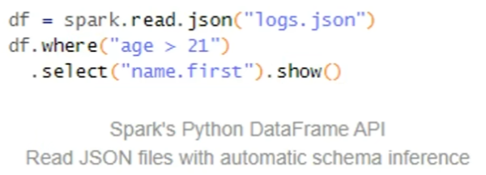
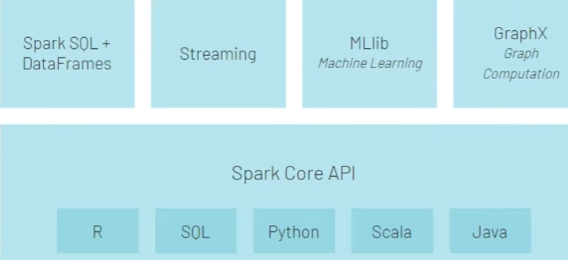
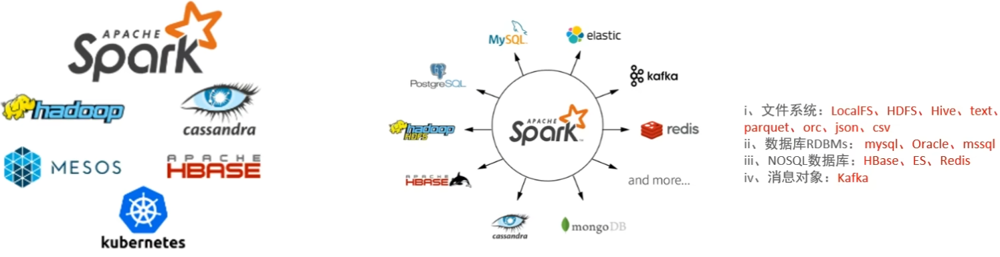
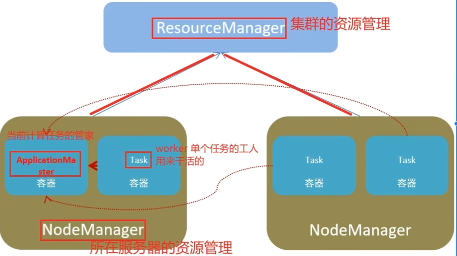
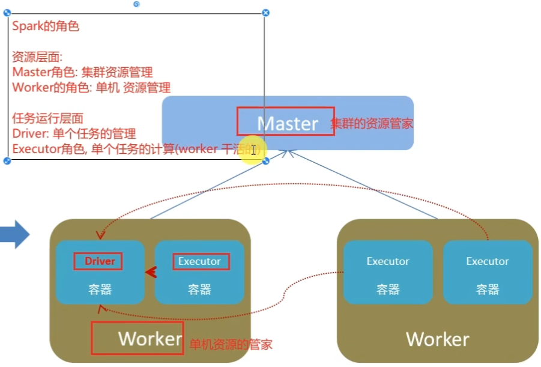
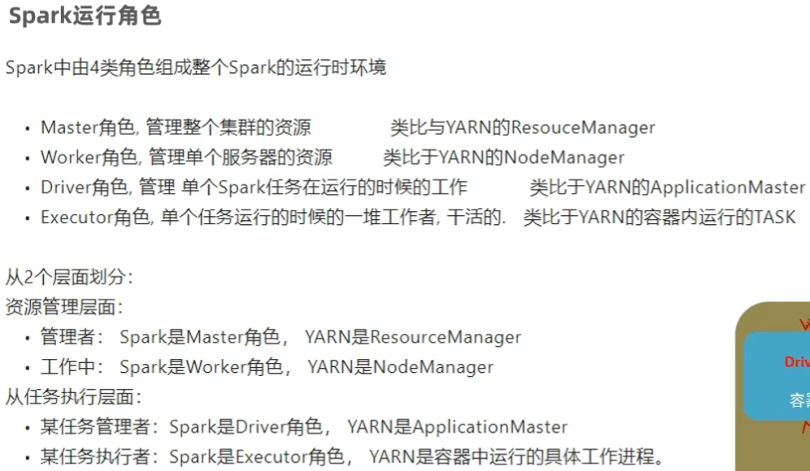

# 1.	Spark概述

Apache Spark是用于**大规模数据处理**的**统一分析引擎**

Spark提出了RDD(弹性分布式数据集)，它是一种分布式内存抽象，且具有高容错。

> 什么是统一分析引擎？
>
> 统一指的是Spark适用面广，可以支持多种语言，处理多种格式的数据；
>
> 分析引擎是指数据处理，Spark支持对任意类型数据进行自定义的计算

## 1.1	Spark与Hadoop的区别

|              |                        Hadoop                         |                        Spark                         |
| :----------: | :---------------------------------------------------: | :--------------------------------------------------: |
|     类型     | 基础平台，包含计算(MapReduce)、存储(HDFS)、调度(YARN) |                      纯计算平台                      |
|     场景     |               数据批处理(磁盘迭代计算)                |   数据批处理(内存迭代计算、交互式计算)、数据流处理   |
|     价格     |                   设备要求低、便宜                    |                  内存要求高、相对贵                  |
|   编程范式   |           MapReduce API较底层，算法适应性差           |      RDD组成DAG有向无环图，API较高层，易于使用       |
| 数据存储结构 |       MapReduce中间计算结果存储在HDFS上，延迟高       |         RDD中间计算结果存储在内存中，延迟小          |
|   运行方式   |              Task以进程方式维护，启动慢               | Task以线程方式维护，启动快，可批量创建以提高并行性能 |

> Spark不能替代Hadoop的原因：
>
> 1.Spark计算效率远高于MapReduce，但现有很多成熟框架是以MapReduce为基础实现，如Hive
>
> 2.Spark只能做计算，而Hadoop有完整平台，HDFS和YARN仍是很多大数据体系的核心架构

## 1.2	Spark的四大特点

### 1.2.1	计算速度快

Spark支持内存计算，且通过有向无环图DAG执行引擎支持无环数据流，因此计算速度远快于MapReduce

相比MapReduce，Spark计算有两个不同：

1.Spark计算时，中间结果存储在内存中，而MapReduce存储在HDFS中；

2.Spark提供了很多算子(API)，可以轻松在一个Spark程序中完成复杂任务

### 1.2.2	易于使用

Spark提供了众多算子，且Spark编程支持多种语言开发，如Python：

### 1.2.3	通用性强

Spark还提供了Spark SQL(结构化数据处理)、Spark Streaming(流计算)、MLib(机器学习)和GraphX(图计算)等多个工具库，同时支持多种语言开发：

### 1.2.4	运行方式多

Spark支持多种运行方式：

- 单机模式Local
- 单机集群模式StandAlone
- 集群模式(YARN、Mesos)
- 容器集群模式Kubernetes
- 云服务模式

对于数据源，Spark支持从HDFS、HBase、Kafka等多种途径获取数据。

## 1.3	Spark的架构角色

### 1.3.1	YARN角色

YARN有4类角色，从两个角度看：

1.资源管理层面：

- 集群资源管理者(Master): ResourceManager
- 单机资源管理者(Worker): NodeManager

2.任务计算层面：

- 单任务管理者(Master): ApplicationMaster
- 单任务执行者(Worker): Task(容器内计算框架的工作角色)

### 1.3.2	Spark角色

正常情况下，Executor角色干活，但在Local模式下，Driver既管理又干活。

