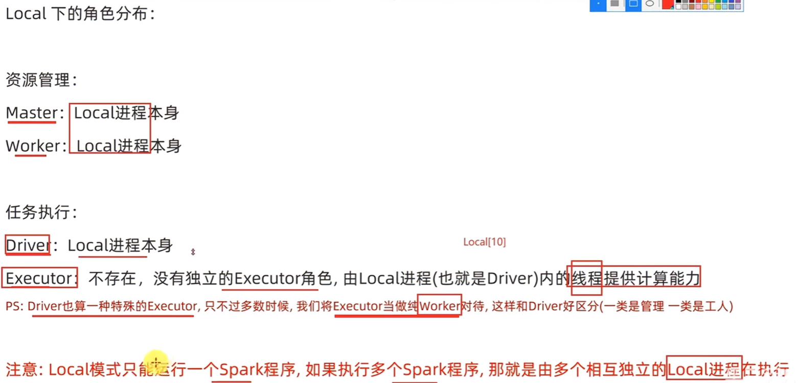
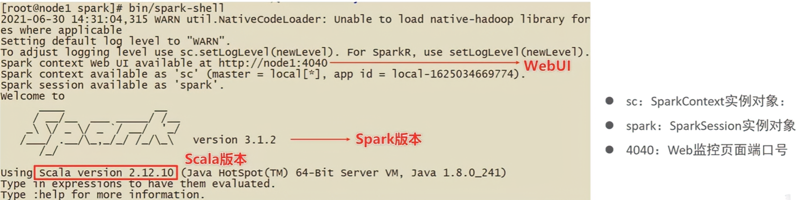
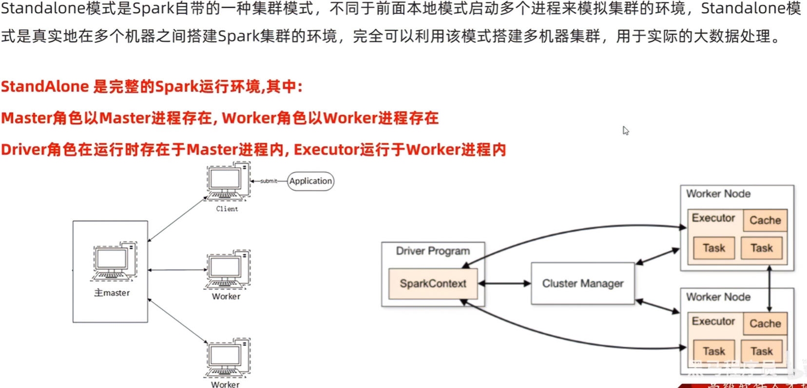
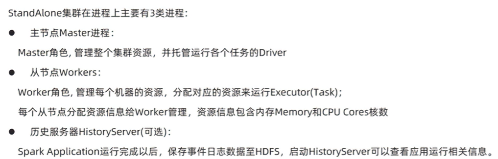
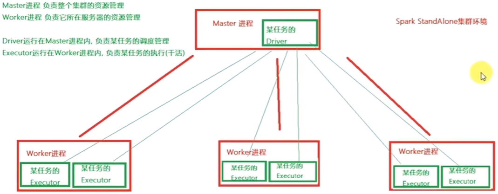
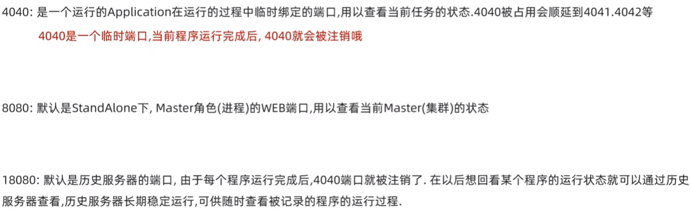
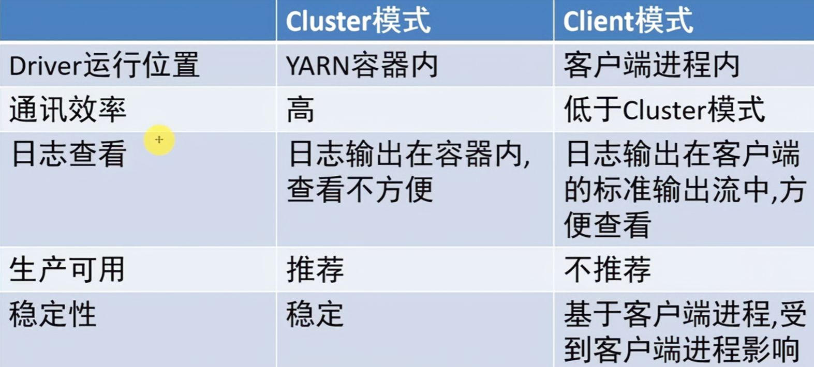
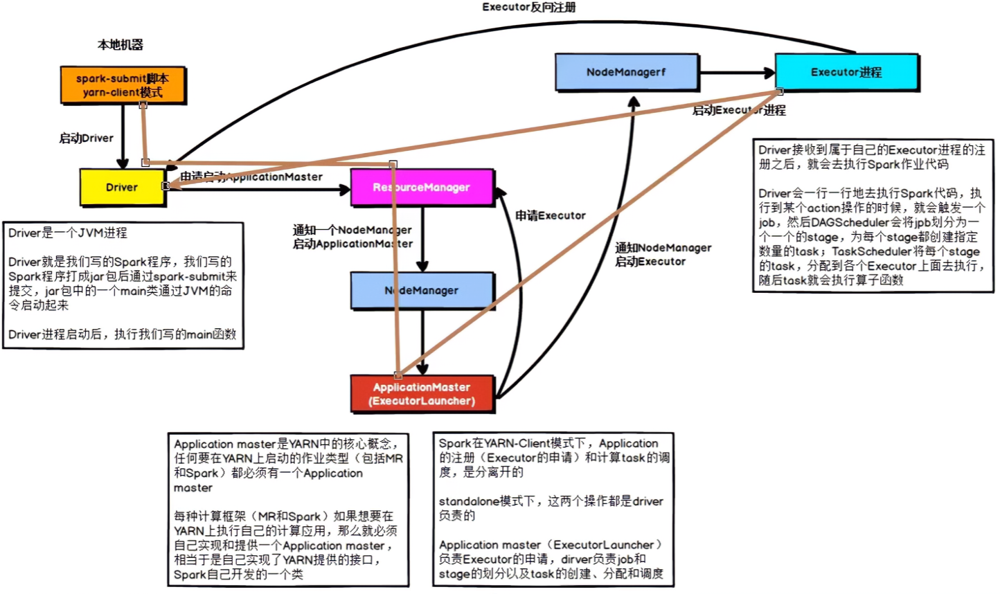
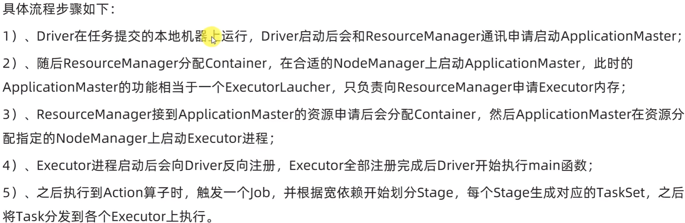
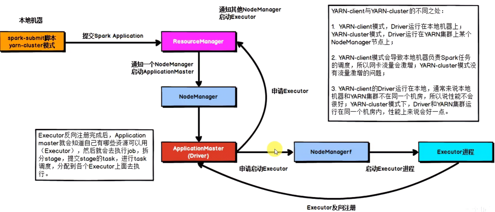

# 2.	Spark配置

## 2.1	Local模式




输入Spark后应有的输出：



使用PySpark工具启动Spark：

```sh
pyspark --master local[*]
# *表示可以使用任意多个线程
```

提交样例代码到Spark：

```sh
spark-submit --master local[*] /data/environment/spark/examples/src/main/python/pi.py 10
```


## 2.2	Standalone模式








使用pyspark工具启动Spark：

```sh
pyspark --master spark://iot146:7077
```

提交样例程序到Spark：

```sh
spark-submit --master spark://iot146:7077 /data/environment/spark/examples/src/main/python/pi.py 10
```

由于Spark任务结束后，4040端口上的Web就无法访问，因此我们不能在任务结束后查看执行情况。

要查看历史任务执行情况，要为Spark部署历史日志服务器(History Server)，默认开放端口18080




### 2.2.1	高可用HA

由于Spark是主从结构，因此存在Master单点故障问题导致集群失效。

为了解决单点故障问题，Spark提供两种方案：

- 基于文件系统的单点恢复(只能用于开发或测试环境)
- 基于ZooKeeper的Standby Masters

ZooKeeper提供了Leader Election机制，可以保证集群同时存在多个Master但只活跃一个，其他的都是Standby状态。当活跃的Master故障时，Standby的Master中会选举出一个Master作为活跃的Master。

由于集群信息，包括Worker、Driver和Application信息都持久化到了文件系统，因此切换时只会影响新Job提交，对于正在进行的Job没有影响。


## 2.3	Spark on YARN

为了提高计算资源利用率，Spark通常被运行在YARN集群上。由于YARN本身就是一个资源调度框架，因此Spark本身直接运行在YARN中，接受YARN的调度。

对于Spark on YARN，**无需部署Spark集群**，只需一台服务器充当Spark客户端即可提交任务到YARN集群。

```sh
spark-submit --master yarn /data/environment/spark/examples/src/main/python/pi.py 10
```


### 2.3.1	Spark on YARN本质

由于Spark直接运行在YARN中，接收YARN调度，因此在Spark on YARN中：

- Spark的Master角色由YARN的ResourceManager担任，Worker角色由YARN的NodeManager担任；
- Driver角色运行在**YARN容器**中或**提交任务的客户端进程**中，Executor运行在YARN容器中


Spark on YARN有两种运行模式：

- Cluster模式(效率更高)：Driver运行在YARN容器内，和ApplicationMaster在同一容器内
- Client模式(默认，方便查看日志)：Driver运行在客户端进程内，如Driver运行在spark-submit程序进程



```sh
spark-submit 
--master yarn
# 部署模式, 默认为client
--deploy-mode client
# Driver可用内存大小
--driver-memory 512m
# 每个Executor可用内存大小
--executor-memory 512m
# 创建Executor个数, 应当为Worker数的倍数
--num-executors 5
# 所有Executor共使用的CPU核心数, 应为num-executors的倍数
--total-executor-cores 5
/data/environment/spark/examples/src/main/python/pi.py 10
```


#### 2.3.1.1	YARN Client模式

本地机器提交任务，Driver运行在本地机器上，具体运行流程：





#### 2.3.1.2	YARN Cluster模式



要注意的是，在Spark on YARN中，无论哪个模式，无论申请分配多少个Executor，NodeManager都会先只分配一个容器用于运行Driver，然后才会分配剩下的容器用于运行Executor。