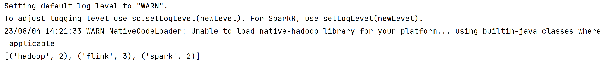
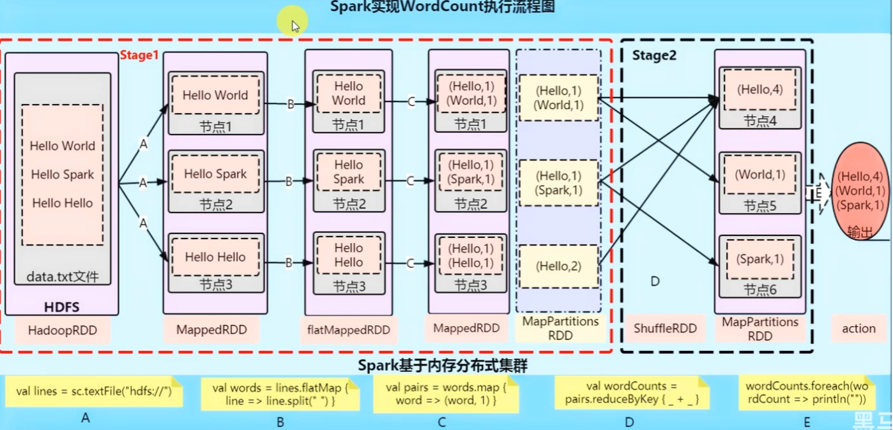
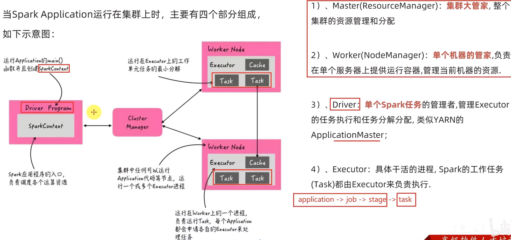
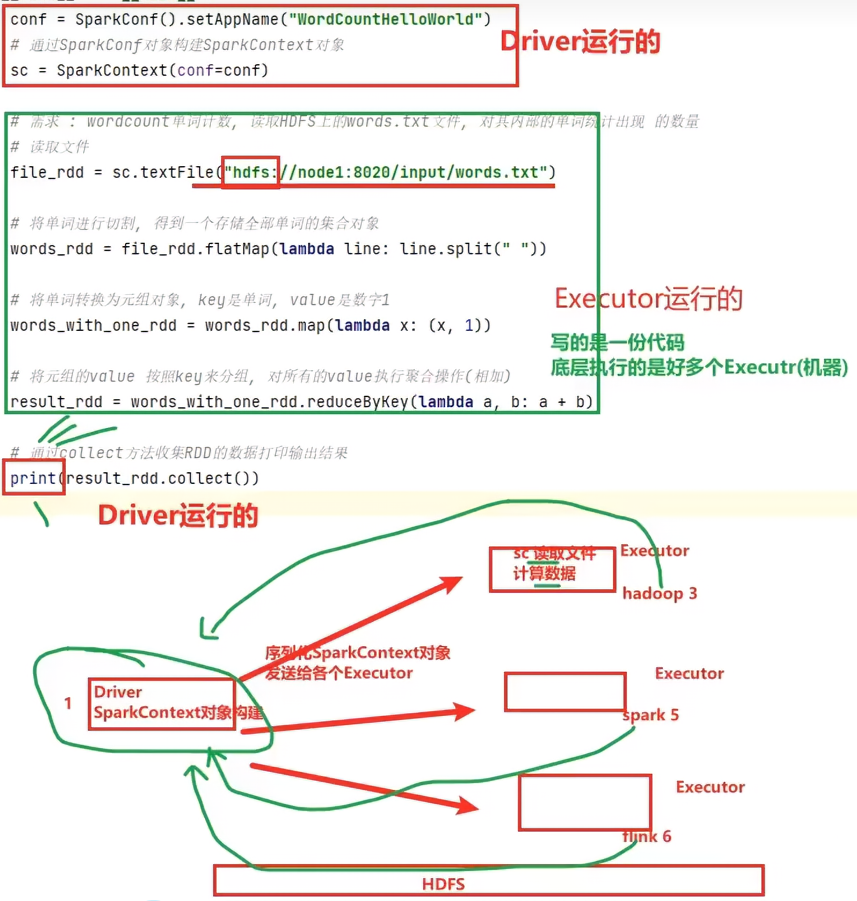
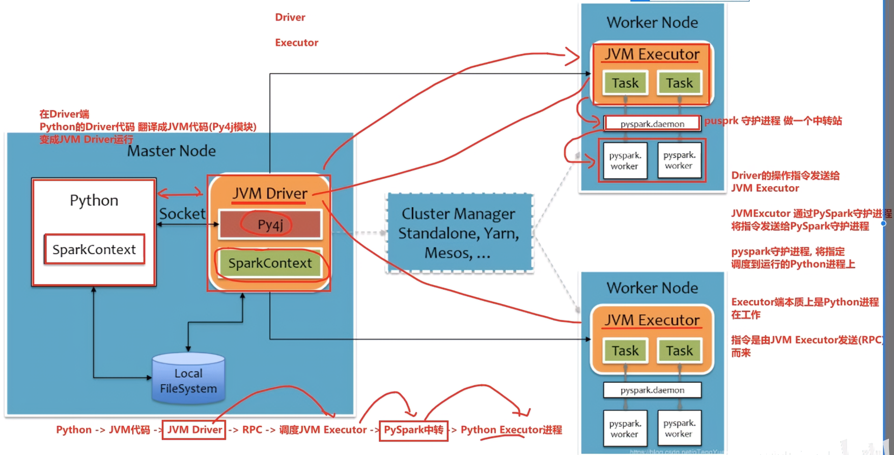
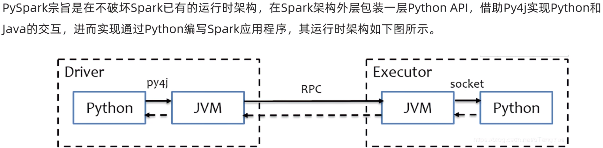

# 3.	Spark基础入门

## 3.1	Spark应用入口SparkContext

对于所有Spark应用程序(Spark Application)，其程序入口为SparkContext：

```python
from pyspark import SparkContext, SparkConf
# 创建SparkConf对象， 设置Spark Application基本信息，如应用名AppName和应用运行所需的Master
conf = SparkConf().setAppName("test").setMaster("local[*]")
# 使用SparkConf对象， 构造SparkContext对象
sc = SparkContext(conf=conf)
```


## 3.2	WordCount

### 3.2.1	在HDFS上统计

首先在HDFS上创建目录input:

```sh
hadoop fs -mkdir hdfs://iot146:8020/input
```

然后在input文件夹中上传统计所需的文本文件word.txt：

```sh
hadoop fs -put /data/workspace/project/pyspark/data/word.txt hdfs://iot146:8020/input
```

编写代码：

```python
# 获取SparkContext对象
sc = get_spark_context()
# 从HDFS中读取文件, 得到RDD对象
file_rdd = sc.textFile('hdfs://iot146:8020/input/word.txt')
# 分割字符, 得到存储所有字符串对象的RDD
word_rdd = file_rdd.flatMap(lambda line: line.split(' '))
# 将每个单词转换为(word, 1)格式的tuple
word_with_one_rdd = word_rdd.map(lambda word: (word, 1))
# 按照key进行聚合, 得到(word, count)格式的tuple, 然后将结果收集到本地
results = word_with_one_rdd.reduceByKey(lambda a, b: a + b).collect()
print(results)
```

运行：




### 3.2.2	在本地统计

此代码在Windows上也可以直接运行，只需要将文件路径修改为本地路径即可：

```python
# 获取SparkContext对象
sc = get_spark_context()
# 从HDFS中读取文件, 得到RDD对象
file_rdd = sc.textFile('./data/word.txt')
# 分割字符, 得到存储所有字符串对象的RDD
word_rdd = file_rdd.flatMap(lambda line: line.split(' '))
# 将每个单词转换为(word, 1)格式的tuple
word_with_one_rdd = word_rdd.map(lambda word: (word, 1))
# 按照key进行聚合, 得到(word, count)格式的tuple, 然后将结果收集到本地
results = word_with_one_rdd.reduceByKey(lambda a, b: a + b).collect()
print(results)
```


### 3.2.3	原理分析

假设将WordCount任务提交到Spark集群，其代码对应流程如下：



```python
# 获取SparkContext对象
sc = get_spark_context()
# 从HDFS中读取文件, 得到HadoopRDD对象
file_rdd = sc.textFile('hdfs://iot146:8020/input/word.txt')

# ===阶段1, 将完整数据派发到集群各节点===
# 数据向下派发，各节点得到存储部分数据的MappedRDD对象
# 分割字符, 得到存储分段字符串对象的flatMappedRDD对象
word_rdd = file_rdd.flatMap(lambda line: line.split(' '))
# 将每个单词转换为(word, 1)格式的tuple, 得到新的MappedRDD对象
word_with_one_rdd = word_rdd.map(lambda word: (word, 1))

# ===阶段2，将各节点处理完成的数据汇总===
# 此时各分段数据处理完成，需要进行合并，因此转换为MapPartitionsRDD对象
# 进行Shuffle操作合并数据：按照key进行聚合, 得到合并后的MapPartitionsRDD对象
results = word_with_one_rdd.reduceByKey(lambda a, b: a + b)
# 将结果收集到本地
results = results.collect()
```


### 3.2.4	将代码提交到Spark集群

需要注意的是，在集群环境中，我们要读取的文件路径应当是一个HDFS路径而不是本地路径，否则没有该文件的集群节点将会报错。

```python
# 由于要提交到Spark集群，因此这里不能setMaster，而是要在spark-submit工具中使用--master 指定Master
def get_spark_context():
    conf = SparkConf().setAppName("test")
    return SparkContext(conf=conf)
```

```python
# 获取SparkContext对象
conf = SparkConf().setAppName("test")
sc = SparkContext(conf=conf)
# 从HDFS中读取文件, 得到RDD对象
file_rdd = sc.textFile('hdfs://iot146:8020/input/word.txt')
# 分割字符, 得到存储所有字符串对象的RDD
word_rdd = file_rdd.flatMap(lambda line: line.split(' '))
# 将每个单词转换为(word, 1)格式的tuple
word_with_one_rdd = word_rdd.map(lambda word: (word, 1))
# 按照key进行聚合, 得到(word, count)格式的tuple, 然后将结果收集到本地
results = word_with_one_rdd.reduceByKey(lambda a, b: a + b).collect()
print(results)
```

使用sprak-submit工具，将编写的Python代码提交到Spark集群：

```sh
spark-submit --master spark://iot146:7077 /data/workspace/project/pyspark/main.py
```


除了spark-submit工具，也可以在Python代码中提交代码文件：

```python
conf.set('spark.submit.pyFiles', 'defs.py')
```

spark-submit工具还支持批量提交文件

```sh
spark-submit --master spark://iot146:7077 --py-files ./defs.zip ./main.py
# --py-files可以批量提交文件，支持.zip和.py
```


运行流程：

可以看到SparkContext实际上是由Driver构造的，在Executor中，实际完成任务的是Task





以刚才的代码为例，可以看到运行流程为：

1.Driver构造SparkContext对象，并将其序列化，发送给各Executor

2.Executor使用SparkContext对象，在HDFS中读取本Executor需要使用的数据块，根据算子进行相应计算

3.数据合并阶段，各Executor将数据传递给Driver

对于大部分Spark程序来说，执行流程都是Driver->Executor->Driver


## 3.3	PySpark运行原理

由于Spark运行在JVM上，而Python并不需要JVM，因此PySpark相比原生Spark有一定的修改。

在PySpark中，Driver和Executor仍然运行在JVM中。

对于Driver：JVM Driver和Python各自维护一个SparkContext，它们之间通过Py4j库，将Python代码与JVM代码互相转换，通过Socket通信。

对于Executor：由于Spark提供的许多算子并不在Java和Python间兼容，因此它将Task交由PySpark.worker完成，在Task和PySpark.worker之间使用PySpark守护进程完成转换和通信，也就是说实际完成任务的是Python进程。



其简化流程图如下：



简单地说，PySpark的架构体系是：

Driver由JVM运行，Executor由JVM转发命令，底层由Python完成工作