# 4.	SparkCore

## 4.1	RDD概述

### 4.1.0	为什么需要RDD

在分布式计算中，我们需要的功能：

- 分区控制(数据分块)
- Shuffle控制(不同分区上的数据交互)
- 数据存储、数据序列化、数据发送
- 数据计算API
- ...

要完成这么多功能，Python内置的数据集合类型显然不能满足。在分布式框架中，我们需要一个统一的数据抽象对象来实现以上功能，这就是RDD。


### 4.1.1	什么是RDD

弹性数据集RDD(Resilient Distributed Dataset)，是Spark中最基本的数据抽象，表示一个不可变、可分区、元素可并行计算的集合。

- Dataset：数据集合，用于存放数据

> List、Dict、Array等数据集合都是本地集合，即所有数据都在一个进程内部，无法实现分布式

- Distributed： RDD中的数据是分布式存储的，因此可以实现分布式计算

> RDD中的数据是跨机器(跨进程)存储的

- Resilient: RDD中的数据可以存放在内存，也可以存放在硬盘中。

> RDD的大小可以动态扩充或缩减，并且可以 切换存放介质

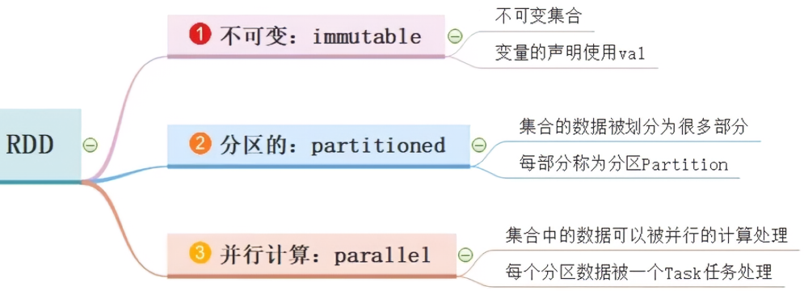

### 4.1.2	RDD五大特性

RDD有五大特性：

- RDD中有分区

> 分区是RDD存储的最小单位，一份RDD数据本质上是分割为了多个分区。 
>
> 分区是物理概念，而RDD是抽象概念
>
> 用一段代码展示RDD中的分区：
>
> ```python
> # 向Spark存储数字1~9，划分为3个分区
> rdd = sc.parallelize([1,2,3,4,5,6,7,8,9], 3)
> # glom()方法能够展示当前RDD的分区情况, collect()收集到本地
> print(rdd.glom().collect())
> # >>> [[1, 2, 3], [4, 5, 6], [7, 8, 9]]
> ```
>
> 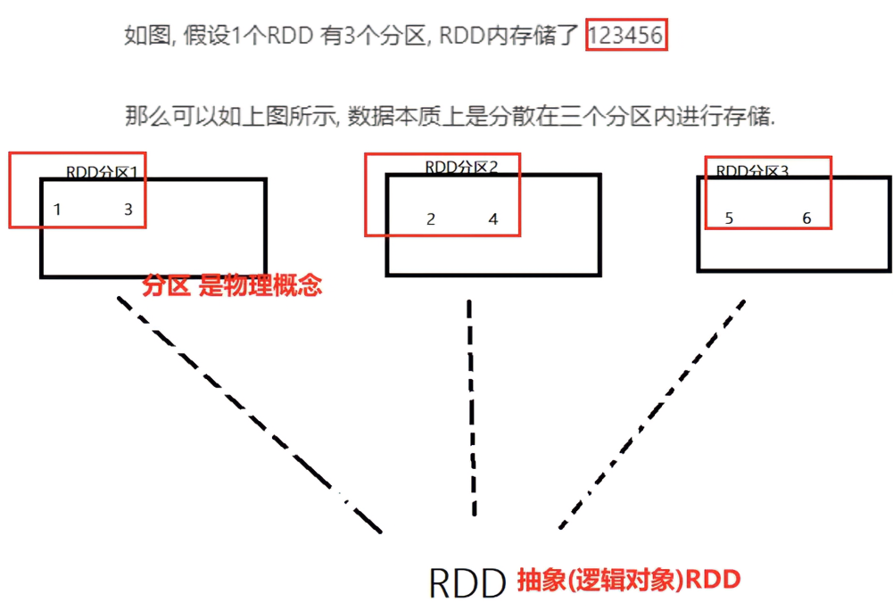

- 计算方法会作用到每一个数据分片(分区)

> ```python
> >>> sc.parallelize([1,2,3,4,5,6,7,8,9], 3).glom().collect()
> >>> [[1, 2, 3], [4, 5, 6], [7, 8, 9]]
> >>> sc.parallelize([1,2,3,4,5,6,7,8,9], 3).map(lambda x: X*10).glom().collect()
> >>> [[10, 20, 30], [40, 50, 60], [70, 80, 90]]
> ```

- RDD间存在依赖关系（迭代计算关系）

> 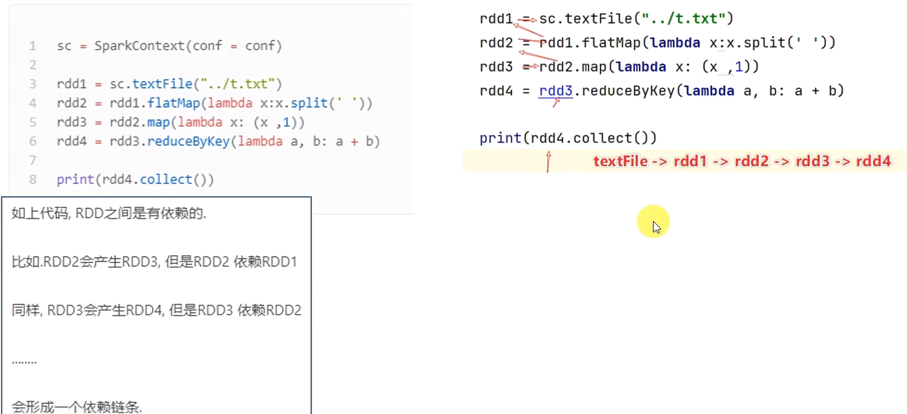

- 对于K-V型RDD，可以自定义分区器

> 在Spark中，我们将存储数据格式为二元元组的RDD称为KV型RDD
>
> 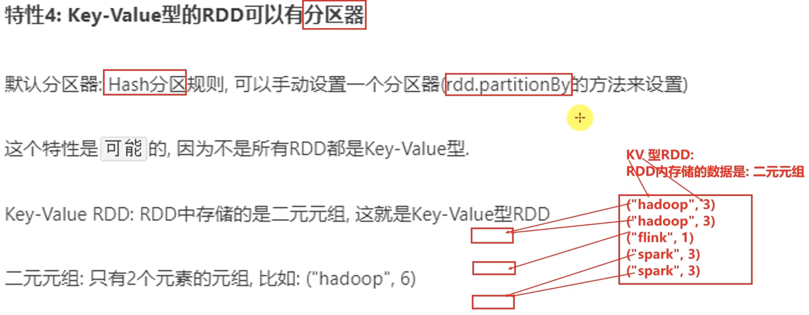
>
> 

- 为了减少开销，RDD读取分区数据时会尽可能靠近数据所在地（比如Spark会在确保并行计算能力的前提下，尽可能让存放那一部分分片的设备从本地读取，从而避免网络传输的额外开销）


### 4.1.3	WordCount案例分析

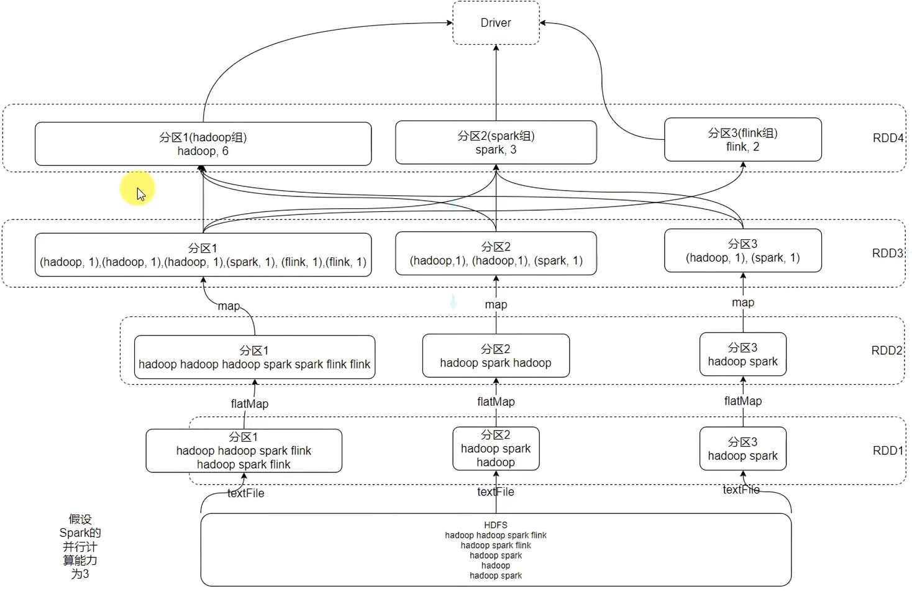


## 4.2	RDD编程

SparkRDD编程的程序入口对象是SparkContext对象，从编程角度上来说，SparkContext功能就是创建第一个RDD

### 4.2.1	创建RDD

RDD创建方式有两种：

- 通过并行化集合创建（本地集合对象->分布式RDD）
- 读取外部数据源（文件读取）

 **并行化创建RDD**：

```python
# 并行化创建对象, 调用SparkContext对象的parallelize()方法, 传入本地集合对象和分区数
# 若不指定分区数，默认值则依据集群拥有的CPU数量决定
rdd = sc.parallelize(data_collection, num_partitions)

# 对RDD对象调用getNumPartitions()方法获取该RDD对象的分区数
print(rdd.getNumPartitions())
# collect()方法将RDD(分布式集合)中每个分区数据都发送给Driver, 得到一个本地的Python list对象
# 即实现了分布式集合->本地集合
print(rdd.collect())
```

**读取文件创建RDD**：

```python
"""
调用SparkContext对象的textFile()方法，传入文件路径和最小分区数：
	文件路径可选本地路径，也可以是分布式文件系统路径，如HDFS
	Spark会自行估算当前文件的最小分区数，若传入值超出Spark认为可行的范围则参数失效
一般情况下，我们不对textFile()传入分区数
"""
rdd = sc.textFile(file_path, min_num_partitions)

"""
对于批量小文件读取, Spark提供了另外的API: wholeTextFile()
	其参数与textFile()相同
与textFile()不同的是, wholeTextFile()倾向于使用更少的分区读取数据, 以减少Shuffle几率提高效率
"""
rdd = sc.wholeTextFile(file_path)
```


### 4.2.2	RDD算子

我们将分布式集合对象上的API称为算子，它与方法/函数类似，只是针对分布式对象；而方法/函数针对本地对象

RDD算子分为两种：

- Transformation: 转换算子

> 定义：返回值为RDD的RDD算子，称为Transformation算子
>
> 特性：懒加载，如果没有Action算子则不工作

- Action: 动作算子

> 定义：返回值不为RDD的RDD算子，称为Action算子

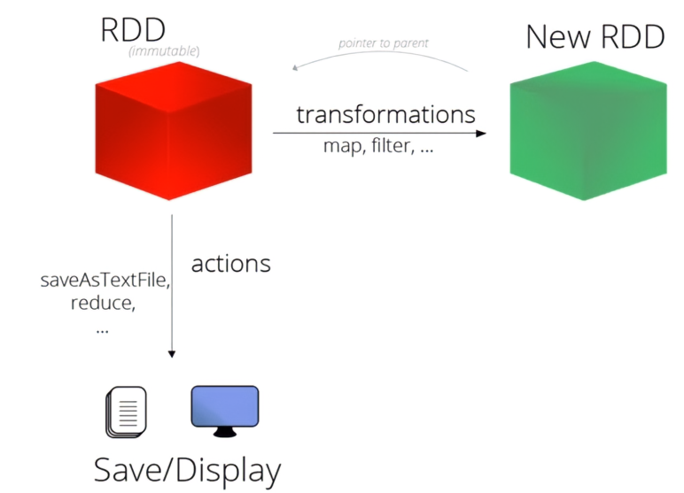

对这两类算子来说，Transformation算子相当于构建工作计划，而Action算子是执行计划的指令。

如果没有Action算子，Transformation算子间的迭代关系就像没通电的流水线，直到Action算子到来，这个数据处理流水线才开始工作。


### 4.2.3 常见Transformation算子

#### 4.2.3.1	Map算子

Map算子，是将RDD数据一条条处理，返回新的RDD

其语法为：

```python
rdd.map(func)
"""
func: f:(T) -> U
f: 表示这是一个函数, (T) -> U表示函数定义
	()表示传入参数, (T)表示传入一个参数, ()表示不传入参数
	T、U都是泛型代称
	-> U表示返回值
"""
# 示例：
def add(data):
    return data * 10
print(rdd.map(add).collect())
# 对于一行可以解决的函数, 也可以直接用Lambda表达式传入匿名函数
print(rdd.map(lambda x: x*10).collect())
```


#### 4.2.3.2	flatMap算子

flatMap算子是对RDD先执行Map操作，然后解除嵌套：

> 解除嵌套：
>
> ```python
> >>> lst = [[1,2,3],[4,5,6],[7,8,9]]
> # 解除嵌套
> >>> lst = [1,2,3,4,5,6,7,8,9]
> ```

```python
rdd = sc.parallelize(['hadoop spark hadoop', 'spark hadoop spark', 'hadoop flink spark'])

print(rdd.map(lambda x: x.split("")).collect())
>>> [['hadoop', 'spark', 'hadoop'], ['spark', 'hadoop', 'spark'], ['hadoop', 'flink', 'spark']]

print(rdd.flatMap(lambda x: x.split('')).collect())
>>> ['hadoop', 'spark', 'hadoop', 'spark', 'hadoop', 'spark', 'hadoop', 'flink', 'spark']
```


#### 4.2.3.3	reduceByKey算子

针对KV型RDD，reduceByKey算子可以自动按Key分组，然后根据传入的聚合逻辑，完成组内数据(value)的聚合操作

```python
rdd.reduceByKey(func)
# func: (V, V) -> V
# 接受两个传入参数V(类型一致), 返回值与传入参数类型相同

rdd = sc.parallelize([('a', 1), ('a', 1), ('b', 1), ('b', 1), ('b', 1)])
res = rdd.reduceByKey(lambda a, b: a+b)
print(res.collect())
>>> [('b', 3), ('a', 2)]
```

注意：reduceByKey接受的函数，只负责聚合Value而不处理分组，即只关心Value而不关心Key

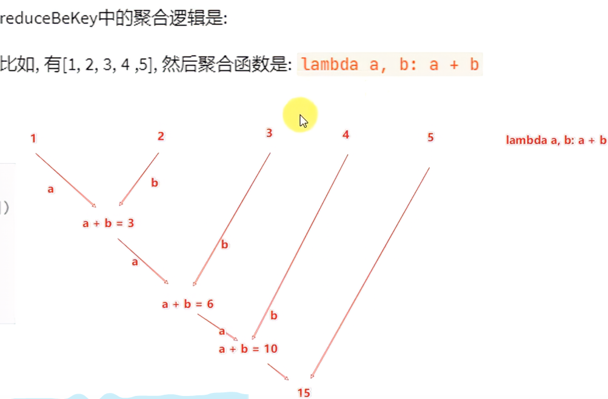

#### 4.2.3.4 mapValues算子

mapValues算子针对**二元元组**的RDD，对其内部的**Value**执行**map**操作

```python
rdd.mapValues(func)
# func: (V) -> U
# 传入的参数是二元元组的Value, 即方法只处理Value
```


#### 4.2.3.5	WordCount回顾

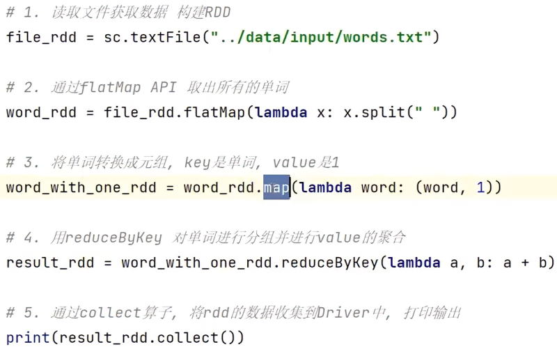


#### 4.2.3.6	groupBy算子

groupBy算子能够对RDD数据进行分组

```python
rdd.groupBy(func)
"""
	func: (T) -> K
	函数传入一个参数，返回一个返回值，类型可以不同
	函数拿到返回值后，将所有相同返回值的放入一个group中
	分组完成后，每个组是一个二元元祖，key是返回值，所有同组的数据放入一个迭代器对象中作为Value
	
	可以理解为, groupBy传入的函数意思是：通过该函数，确定按照谁分组(返回谁)
	分组规则与SQL一致，即相同的在一个组(Hash分组)
"""

rdd = sc.parallelize([1,2,3,4,5])
# 分组，将数字分层，偶数和奇数分开
rdd2 = rdd.groupBy(lambda num: 'even' if (num%2==0) else 'odd')

# 将RDD2元素的value转为list, 以便print输出
rdd2 = rdd2.map(lambda x: (x[0], list(x[1])).collect())
print(rdd2)
>>> [('even', [2, 4]), ('odd', [1, 3, 5])]
```


#### 4.2.3.7	Filter算子

Filter算子能够只保留需要的数据，过滤掉不需要的数据

```python
rdd.filter(func)
# func: (T) -> bool 只保留返回值为True的数据

rdd = sc.parallelize([1,2,3,4,5])
# 通过Filter算子, 只保留偶数
rdd2 = rdd.filter(lambda x: x%2==0).collect()
print(rdd2)
>>> [2, 4]
```


#### 4.2.3.8	distinct算子

distinct算子能够去除重复数据

```python
rdd.distinct(param)
# 这里的param指的是去重分区数量，一般不用传入

rdd = sc.parallelize([1, 2, 2, 3, 4, 5, 5])
print(rdd.distinct().collect())
>>> [1,2,3,4,5]

rdd2 = sc.parallelize([('a', 1), ('a', 1), ('b', 3)])
print(rdd2.distinct().collect())
>>> [('a', 1), ('b', 3)]
```


#### 4.2.3.9	union算子

union算子将两个RDD合并为一个RDD并返回

```python
rdd.union(rdd2)
# 注意：union操作只合并数据并不去重，且合并的两个RDD数据类型可以不同

rdd1 = sc.parallelize([1, 1, 3, 3])
rdd2 = sc.parallelize(['a', 'b', 'c'])
print(rdd1.union(rdd2).collect())
>>> [1, 1, 3, 3, 'a', 'b', 'c']
```


#### 4.2.3.10	join算子

join算子能够对两个RDD执行join操作，实现SQL的内/外连接

注意：**join算子只能用于二元元组**

```python
# join算子以二元元组的Key作为关联
rdd.join(rdd2)	# 内连接
rdd.leftOuterJoin(rdd2)	# 左外连接
rdd.rightOuterJoin(rdd2)	# 右外连接

rdd1 = sc.parallelize([(1001, '张三'), (1002, '李四'), (1003, '王五'), (1004, '赵六')])
rdd2 = sc.parallelize([(1001, '销售部'), (1002, '研发部')])

print(rdd1.join(rdd2).collect())
>>> [(1001, ('张三', '销售部')), (1002, ('李四', '研发部'))]

# 相当于rdd2.rightOuterJoin(rdd1)
print(rdd1.leftOuterJoin(rdd2).collect())
>>> [(1001, ('张三', '销售部')), (1002, ('李四', '研发部'))， (1003, ('王五', None)), (1004, ('赵六', None))]
```


#### 4.2.3.11	intersection算子

intersection算子求两个RDD的交集，返回新的RDD

```python
rdd.intersection(rdd2)

rdd1 = sc.parallelize([('a', 1), ('b', 1)])
rdd2 = sc.parallelize([('a', 1), ('c', 1)])
print(rdd1.intersection(rdd2).collect())
>>> [('a', 1)]
```


#### 4.2.3.12	glom算子

glom算子将RDD数据加上嵌套，嵌套格式由**分区情况**决定

```python
rdd.glom()
# 假设RDD数据[1,2,3,4,5]有2个分区, 那么glom后可能会变成[[1,2,3], [4,5]]
```


#### 4.2.3.13	groupByKey算子

groupByKey算子针对**KV型KDD**，自动按Key分组

```python
rdd.groupByKey()
# groupByKey()只作用于KV型KDD, 因此与groupBy()不同的是，它分组后只保留原本元素的Value

rdd = sc.parallelize([('a', 1), ('a', 1), ('b', 1), ('b', 2)])
grouped_rdd = rdd.groupByKey()
print(grouped_rdd.map(lambda x: (x[0], list(x[1]))).collect())
>>> [('a', [1, 1]), ('b', [1, 2])]
```

 

#### 4.2.3.14	sortBy算子

sortBy算子对RDD数据排序，排序依据基于指定

注意：**排序时只保证Executor内有序即局部有序**，要全局有序则要指定numPartitions=1

```python
rdd.sortBy(func, ascending=False, numPartitions=1)
# func: (T) -> U: 告知按KDD中哪个数据排序, 如lambda x: x[1]表示用RDD中第二列数据排序
# ascengding: 是否升序排列, 默认为True
# numPartitions: 用多少分区排序

rdd = sc.parallelize([('c', 2), ('b', 1), ('a', 4), ('f', 7), ('e', 1)])
print(rdd.sortBy(lambda x: x[1], ascending=True, numPartitions=1).collect())
>>> [('b', 1), ('e', 1), ('c', 2), ('a', 4), ('f', 7)]
```


#### 4.2.3.15	sortByKey算子

sortBykey算子只针对KV型RDD，按Key排序

```python
sortByKey(ascending=True, numPartitions=None, keyfunc=<function RDD.<lambda>>)
# keyfunc: 在排序前对Key进行处理, 语法为(k)->U
# 注意：keyfunc只改变在排序时key的值，不改变最终输出的值

rdd = sc.parallelize([('A', 1), ('a', 1), ('b', 1), ('E', 1)])
print(rdd.sortByKey().collect())
>>> [('A', 1), ('E', 1), ('a', 1), ('b', 1)]

print(rdd.sortByKey(keyfunc=lambda k:str(k).lower()).collect())
>>> [('A', 1), ('a', 1), ('b', 1), ('E', 1)]
```


### 4.2.4	常见Action算子

#### 4.2.4.1	countByKey算子

countByKey算子一般用于KV型RDD，用于统计每个Key出现的次数，返回类型为collections.defaultdict，返回值为Key-Count

```python
rdd.countByKey()

rdd = sc.textFile('./word.txt')
rdd2 = rdd.flatMap(lambda x: x.split('')).map(lambda x: (x, 1))
res = rdd2.countByKey()
print(res)
>>> defaultdict(<alss 'int'>, {'hello': 3, 'spark': 1, 'hadoop': 1})
```


#### 4.2.4.2	collect算子

collect算子将RDD各分区内的数据，统一收集到Driver中，得到一个list对象

**注意**：collect算子将RDD各分区数据都会拉取到Driver，使用该方法要确保数据集大小不会造成Driver内存溢出


#### 4.2.4.3	reduce算子

reduce算子对RDD按传入逻辑进行聚合

**注意**：reduce算子是Action算子，而reduceByKey算子是Transformation算子

```python
rdd.reduce(func)
# func: (T, T) -> T 传入两个相同类型参数，返回1个相同类型参数

rdd = sc.parallelize(range(1, 6))
# 累加求和
print(rdd.reduce(lambda a, b: a+b))
>>> 15
```

执行流程如下：

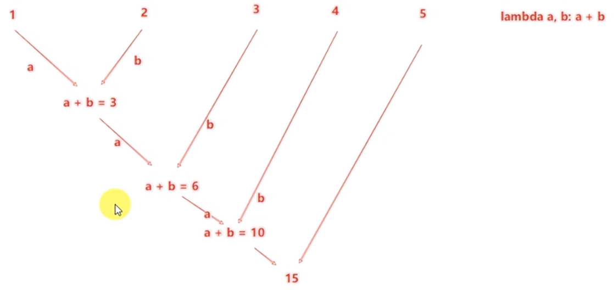


#### 4.2.4.4	fold算子(了解)

fold算子与reduce类似，接受传入逻辑进行聚合，**聚合是带有初始值的**

这个初始值聚合，作用在分区内聚合和分区间聚合

```python
rdd.fold(init_num, func)
# 如对[[1, 2, 3], [4, 5, 6], [7, 8, 9]]聚合：
rdd = sc.parallelize(range(1, 10), 3)
print(rdd.fold(10, lambda a,b: a+b))
>>> 85

"""
分区内聚合：
	对第1个分区聚合时：初始值10+1+2+3=16
	对第2个分区聚合时：初始值10+4+5+6=25
	对第3个分区聚合时：初始值10+7+8+9=34
分区间聚合：
	初始值10+16+25+34=85
"""
```


#### 4.2.4.5	first算子

first算子取出RDD中第一个元素并直接返回

```python
>>> sc.parallelize([1,2,3].first())
>>> 3
```


#### 4.2.4.6	take算子

take算子取RDD的前N个算子，返回一个对应的list

```python
>>> sc.parallelize([3, 2, 1, 4, 5, 6]).take(5)
>>> [3, 2, 1, 4, 5]
```


#### 4.2.4.7	top算子

top算子先对RDD降序排序，然后取前N个返回一个对应list

```python
>>> sc.parallelize([3, 2, 1, 4, 5, 6].top(3))
>>> [6, 5, 4]
```


#### 4.2.4.8	count算子

count算子计算RDD中元素个数，直接返回数值

```python
>>> sc.parallelize(range(1, 6)).count()
>>> 5
```


#### 4.2.4.9	takeSample算子

takeSample算子从RDD中随机抽样数据

```python
takeSample(repeat: bool, num_samples: int, random_seed: int)
# repeat参数表示有无放回采样

>>> sc.parallelize([1, 1, 1, 1, 1]).takeSample(True, 8)
>>> [1, 1, 1, 1, 1, 1, 1, 1]
```


#### 4.2.4.10	takeOrdered算子

takeOrdered算子与top算子类似，但是为**升序排序**RDD并取前N个元素组成list返回

```python
rdd.takeOrdered(num_takes, orderfunc)
# num_takes: 要几个元素
# orderfunc: 对排序时的数据值更改，不影响结果

# 可以通过orderfunc实现升序和降序排序：
print(sc.parallelize([1, 3, 2, 4, 7, 9, 6], 1).takeOrdered(3))
>>> [1, 2, 3]

print(sc.parallelize([1, 3, 2, 4, 7, 9, 6], 1).takeOrdered(3, lambda x:-x))
>>> [9, 7, 6]
```


#### 4.2.4.11	foreach算子

foreach算子对RDD每个元素，执行传入的逻辑，没有返回值

当我们需要查看RDD元素值而不需要其返回值操作时，foreach会比collect效率更高

```python
rdd.foreach(func)
# func: (T) -> None

rdd = sc.parallelize([1, 3, 2, 4, 7, 9, 6])
# 对数据乘以10
r = rdd.foreach(lambda x:print(x*10))
>>> 10 30 20 40 70 90 60

print(r)
>>> None # foreach没有返回值
```


#### 4.2.4.12	saveAsTextFile算子

saveAsTextFile算子将RDD数据写入到文本文件中，支持本地写入和分布式文件系统写入

```python
rdd = sc.parallelize([1, 3, 2, 4, 7 , 9, 6], 3)
rdd.saveAsTextFile('hdfs://iot146:8020/output/test.txt')
```


#### 4.2.4.13	mapPartitions算子

mapPartitions算子与map算子类似，但map算子每次传递一个元素执行计算，而mapPartitions算子一次传递RDD的一个分区进行计算，这样能大大减少网络IO的开销，但要注意的是使用时要保证不会超出Executor的可用内存


#### 4.2.4.14	foreachPartitions算子

foreachPartitions算子与foreach算子类似，每次传递一个分区，大大减少网络IO的开销


#### 4.2.4.15	partitionBy算子

partitionBy算子能对RDD进行自定义分区

```python
rdd.partitionBy(num_partitions, partitionFunc)
# num_partitions: 重新分区后的分区数
# partitionFunc: 自定义分区规则
# partitionFunc: (K) -> int 传入任意类型参数，返回值为int类型
# 即将元素的Key传给函数，自定义函数逻辑，决定返回的分区编号，编号范围[0, num_partitions-1]

rdd = sc.parallelize(
	[('hadoop', 1), ('spark', 1), ('hello', 1), ('flink', 1), ('hadoop', 1), ('spark', 1)]
)

def process(k):
    if k == 'hadoop' or k == 'hello':
        return 0
    if k == 'spark':
        return 1
    return 2

print(rdd.partitionBy(3, process).glom().collect())
>>> [[('hadoop', 1), ('hello', 1), ('hadoop', 1)], [('spark', 1), ('spark', 1)], [('flink', 1)]]
```


#### 4.2.4.16	repartition算子

repartition算子同样对RDD重新分区，但只改变数量而不改变分区规则

**注意**：要慎重使用分区数量操作，一般除了全局排序时，并不关心分区

当改变分区数量时：	

- 影响并行计算（内存迭代的并行管道数量）
- 分区增加时，很容易导致shuffle

```python
rdd.repatition(N) # N为决定的新分区数
```


#### 4.2.4.17	coalesce算子

coalesce算子与repatition算子类似，但它比repatition算子更安全，当分区数量增加时，只有传入参数shuffle=True时才会执行，从而避免误操作导致的分区数量增加和开销增加

```python
>>> rdd = sc.parallelize([1, 2, 3, 4, 5], 3)

>>> rdd.repatition(1).getNumPartitions()
>>> 1
>>> rdd.repatition(5).getNumPartitions()
>>> 5

>>> rdd.coalesce(1).getNumPartitions()
>>> 1
# 当分区数量增加时，只有传入参数shuffle=True时才会执行
>>> rdd.coalesce(5).getNumPartitions()
>>> 3
>>> >>> rdd.coalesce(5, shuffle=True).getNumPartitions()
>>> 5
```


### 4.2.5	groupByKey和reduceByKey的区别

在功能上：

- groupByKey只能分组
- reduceByKey除了ByKey的分组功能外，还有reduce的聚合功能，因此它是一个分组聚合功能一体化的算子

在性能上：

​	当对数据执行分组+聚合时，reduceByKey的性能远高于groupByKey，因为groupByKey只能分组，因此它要先分组(shuffle)后聚合；而reduceByKey在分组内就先做了局部聚合，这样就大大减少了需要shuffle的数据。

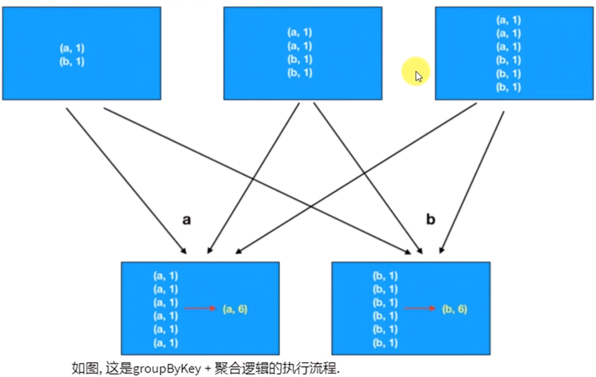

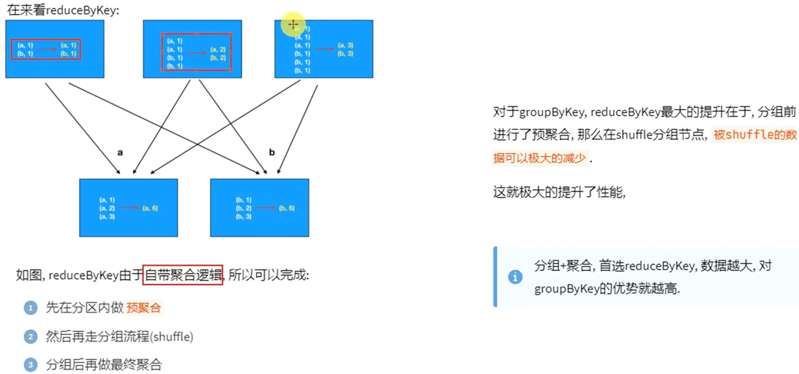


## 4.3	RDD持久化

### 4.3.1	RDD数据是过程数据

RDD之间进行迭代计算(Transformation转换)时，当执行启动，新RDD生成时，老RDD就消失了。

RDD数据是过程数据，只在处理过程存在，一旦处理完成就会消失。

> RDD的这个特性可以最大化利用计算资源，老旧RDD失效后就会被GC清理，为后续计算腾出内存空间

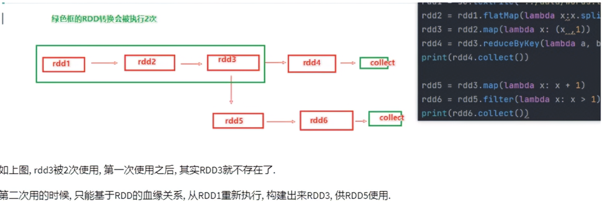


### 4.3.2	RDD缓存

由于RDD数据是过程数据，为了能暂时保留RDD数据以供后续使用，要使用RDD缓存

Spark提供了RDD的缓存API，可以通过调用，将RDD数据保留在内存或硬盘

```python
# 当RDD不止一次被使用时，可以将其加入到缓存以减少重复计算
rdd.cache()	# 缓存到内存

rdd.persisit(StorageLevel.MEMORY_ONLY)	# 只缓存到内存, 和cache()一样
rdd.persisit(StorageLevel.MEMORY_ONLY_2)	# 只缓存到内存, 2个副本

rdd.persisit(StorageLevel.DISK_ONLY)	# 只缓存到硬盘
rdd.persisit(StorageLevel.DISK_ONLY_2)	# 只缓存到硬盘, 2个副本
rdd.persisit(StorageLevel.DISK_ONLY_3)	# 只缓存到硬盘, 3个副本

rdd.persisit(StorageLevel.MEMORY_AND_DISK)	# 先放内存，内存不够再放硬盘
rdd.persisit(StorageLevel.MEMORY_AND_DISK_2)	# 先放内存，内存不够再放硬盘, 2个副本

rdd.persisit(StorageLevel.OFFHEAP)	# 堆外内存(系统内存)

# 一般建议使用StorageLevel.MEMORY_AND_DISK
# 如果集群内存比较小，建议使用StorageLevel.DISK_ONLY，或者不用缓存，用CheckPoint

# 释放缓存的API
rdd.unpersisit()
```

缓存是**分散存储**的，即每个Executor只保存自己拥有分区上的数据

缓存在设计上认为是**不安全**（有丢失风险）的，因此它还会**保留RDD间的依赖关系**，一旦缓存丢失，可以基于依赖关系重新计算出其中的数据


### 4.3.3	RDD CheckPoint

CheckPoint技术，同样是保存RDD数据，但只支持硬盘存储

与缓存不同，CheckPoint技术设计上认为是**安全**的，同时**不保留RDD间的依赖关系**

CheckPoint在保存RDD数据时，将各分区数据收集起来**集中存储**，这与缓存的分散存储不同

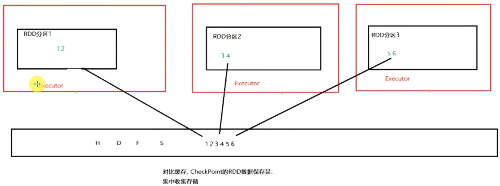

缓存与CheckPoint对比：

- CheckPoint无论分区多少，风险相同。缓存分区越多，风险越高
- CheckPoint支持写入HDFS，缓存只能写入到Executor本地。而HDFS是高可靠存储，因此CheckPoint设计安全
- CheckPoint不支持写内存，缓存可以，当缓存写入内存时，性能好于CheckPoint
- CheckPoint设计安全，因此不保留RDD依赖关系；缓存设计不安全，因此需要保留RDD依赖关系

使用CheckPoint：

```python
# 设置CheckPoint保存路径, 在Local模式下可以指定本地文件路径，集群模式下只支持HDFS
sc.setCheckPointDir('hdfs://iot146:8020/checkpoint/testDataBackUp')

rdd.checkpoint()
```


## 4.4	搜索引擎日志分析案例

使用搜狗提供的【用户查询日志(SogouQ)】数据，使用Spark框架，将数据封装到RDD进行业务数据处理分析。

数据格式：

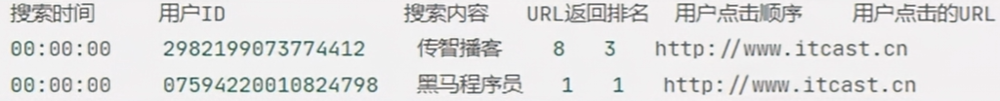

业务需求：

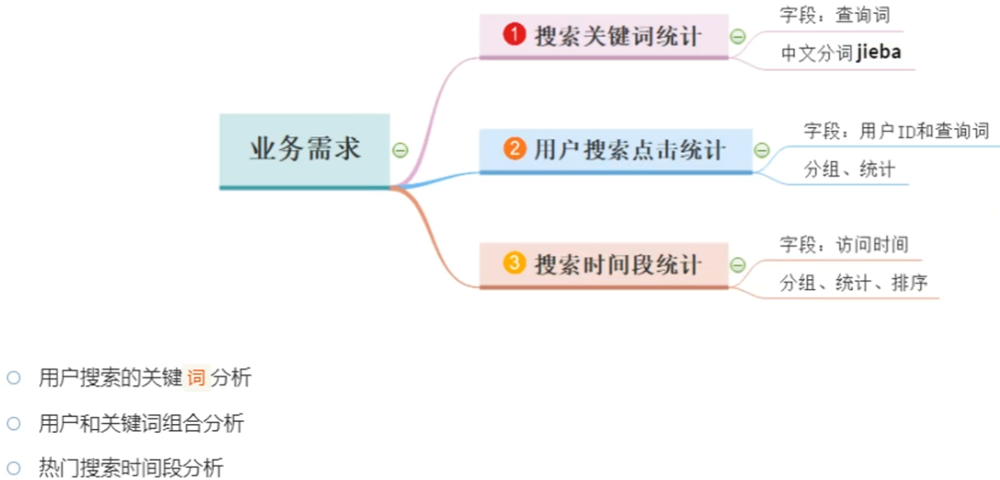

由于统计关键词需要进行分词，因此需要引入中文分词库jieba


### 4.4.1	jieba库简单使用

分词：如我喜欢上清华大学吃饭-> 我，喜欢，清华，大学，吃饭，清华大学，我喜欢

```python
import jieba

if __name__ == '__main__':
    content = '小明硕士毕业于中国科学院计算所，后在清华大学深造'

    # cut_all: 是否拆分二次组合的词, 如清华大学是否拆分为清华, 大学
    res = jieba.cut(content, cut_all=True)
    print(list(res))
>>> ['小', '明', '硕士', '毕业', '于', '中国', '中国科学院', '科学', '科学院', '学院', '计算', '计算所', '，', '后', '在', '清华', '清华大学', '华大', '大学', '深造']

    res = jieba.cut(content, cut_all=False)
    print(list(res))
>>> ['小明', '硕士', '毕业', '于', '中国科学院', '计算所', '，', '后', '在', '清华大学', '深造']

	# 搜索引擎模式, 相当于允许二次组合的场景
	res = jieba.cut_for_search(content)
    print(list(res))
>>> ['小明', '硕士', '毕业', '于', '中国', '科学', '学院', '科学院', '中国科学院', '计算', '计算所', '，', '后', '在', '清华', '华大', '大学', '清华大学', '深造']
```


### 4.4.2	搜索引擎日志分析案例

```python
from operator import add

import jieba
from pyspark import SparkContext, SparkConf


# 对结果进行调整
def adjust_word(word):
    if word == '传智播': word = '传智播客'
    if word == '院校': word = '院校帮'
    if word == '博学': word = '博学谷'
    return word, 1


# 过滤无意义的结果
def filter_word(word):
    return word not in ['谷', '帮', '客']


# 调用Jieba库, 将搜索内容切分为词
def cut_line_to_word(line):
    return list(jieba.cut_for_search(line))


# 分析热力词语(用户搜索关键词分析)
def hot_word_analyze(rdd):
    # 取出用户搜索关键词
    content_rdd = rdd.map(lambda x: x[2])
    # 分词
    word_rdd = content_rdd.flatMap(cut_line_to_word)
    # 过滤无意义的词
    filter_rdd = word_rdd.filter(filter_word)

    word_rdd = filter_rdd.map(adjust_word)
    # 对单词分组聚合、排序，求出前5名
    # 按搜索数降序排序, 分区数=1保证全局排序
    res = word_rdd.reduceByKey(lambda a, b: a + b)\
        .sortBy(lambda x: x[1], ascending=False, numPartitions=1)\
        .take(5)
    print(res)


# 需求2: 用户和关键词组合分析
def combine_analyze(rdd):
    user_content_rdd = rdd.map(lambda x: (x[1], x[2]))

    # 对用户搜索内容分词, 然后与用户ID再次组合
    def extract_user_and_word(data):
        user, content = data
        words = cut_line_to_word(content)
        return [(f'{user}_{adjust_word(word)[0]}', 1) for word in words if filter_word(word)]

    user_word_rdd = user_content_rdd.flatMap(extract_user_and_word)
    # 对内容分组聚合、排序，求出前五名
    # 按搜索数降序排序, 分区数=1保证全局排序
    res = user_word_rdd.reduceByKey(lambda a, b: a + b) \
        .sortBy(lambda x: x[1], ascending=False, numPartitions=1) \
        .take(5)
    print(res)


# 需求3: 热门搜索时间段分析
def hot_period_analyze(rdd):
    # 取出时间, 只保留小时
    time_rdd = split_rdd.map(lambda x: (x[0].split(':')[0], 1))
    # add就是 lambda a,b: a+b, 这是Spark已经预先实现的操作
    res = time_rdd.reduceByKey(add)\
        .sortBy(lambda x: x[1], ascending=False, numPartitions=1)\
        .take(5)
    print(res)


if __name__ == '__main__':
    # 获取SparkContext对象
    conf = SparkConf().setAppName("test").setMaster('local[*]')
    sc = SparkContext(conf=conf)

    # 从HDFS中读取文件, 得到RDD对象
    file_rdd = sc.textFile('./data/SogouQ.txt')

    # 分割字符, 得到存储所有字符串对象的RDD
    split_rdd = file_rdd.map(lambda line: line.split('\t'))

    # 有多个需求, split_rdd要多次调用, 因此做个缓存
    split_rdd.cache()

    # 需求1: 关键词分析
    hot_word_analyze(split_rdd)

    # 需求2: 用户和关键词组合分析
    # 用户1: 我喜欢传智播客 -> 用户1+我; 用户1+喜欢; 用户1+传智播客
    combine_analyze(split_rdd)

    # 需求3: 热门搜索时间段分析
    hot_period_analyze(split_rdd)
```


### 4.4.3	压榨集群性能

为了使集群尽可能多地占用计算资源以加快任务计算速度，我们需要压榨集群性能：

首先查看每台Worker上的资源：

```sh
# 查看CPU核心数
> cat /proc/cpuinfo | grep processor | wc -l
64

# 查看可用内存大小
> free -g
              total        used        free      shared  buff/cache   available
Mem:            251          15         214           0          21         234
Swap:             9           0           9
```

查看可知，集群共有320个CPU核心，896G内存，我们可以为每个CPU核心分配一个Executor，每个Executor按需分配2G内存：

```sh
spark-submit
--master spark://iot146:7077\
--executor-memory 2g\
--executor-cores 1\
--num-executors 320\
./main.py
```


## 4.5	共享变量

共享变量的使用场景：数据量不大，需要在两个数据集之间做JOIN运算的情况使用

- 为什么数据量不能太大？
  - 共享变量传递的是其中一个数据集的全量数据，太大会导致Executor内存溢出
- 为什么能提升性能？
  - 减少了Shuffle的发生，大大减少了网络开销


### 4.5.1	广播变量

假设有一个本地数据对象stu_info_list，现在Spark集群需要从其中获取数据进行条件查找：

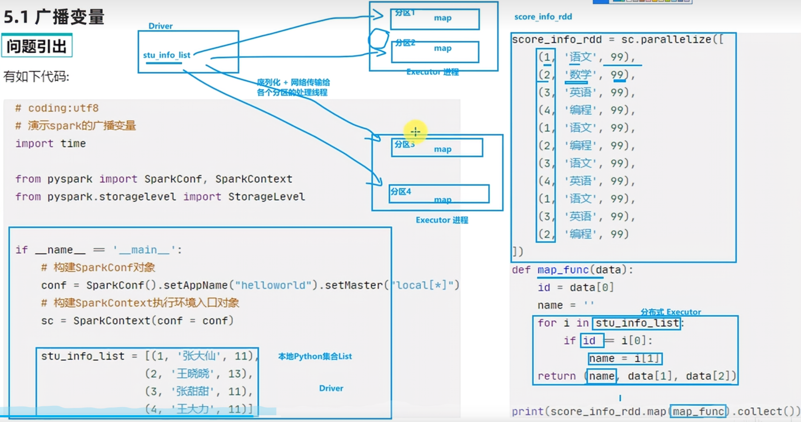

直接将对象发送给各Executor是可以运行的，但这会使得Driver向所有分区发送了一个stu_info_list，当每个Executor中存在多个分区时，这会导致额外的内存和网络开销。因为数据在进程内是共享的。

因此，我们希望提出广播变量，使得在发送变量时，每个Executor只得到一份。

```python
# 将本地变量标记为广播变量
broadcat = sc.broadcast(info_list)

# 使用广播变量, 直接从broadcast对象中取出本地对象即可
value = broadcast.value 
```


### 4.5.2	累加器

需求：计算map算子内传入逻辑的调用次数


原始思想：

```python
# 1~10划分两个分区
rdd = sc.parallelize([1,2,3,4,5,6,7,8,9,10], 2)

count = 0
def map_count(data):
    global count
    count += 1
    print(count)

print(rdd.map(map_count).collect())
>>> 1 2 3 4 5 1 2 3 4 5 0
```

通过运行结果可以发现，这个count累加是在每个分区内独立进行的，因此这一操作无法满足我们的需求

为了简单实现这一需求，可以使用Spark提供的累加器：

```python
# Spark提供的累加器变量
count = sc.accumulator(0)

# 函数逻辑不变
print(rdd.map(map_count).collect())
>>> 1 2 3 4 5 1 2 3 4 5 10
```

可以看到，虽然每个分区依然独立计算count，但最终输出结果被合并了。

注意：

```python
# 1~10划分两个分区
rdd = sc.parallelize([1,2,3,4,5,6,7,8,9,10], 2)

rdd = rdd.map(map_count)
rdd.collect()

rdd2 = rdd.map(lambda x: x)
print(count)
>>> 20
```

可以看到，我们只调用了一次map_count，得到的结果却是20，这是因为在第7行，rdd2调用了已经被回收的rdd对象，导致rdd对象重新计算，使得map_count又被调用了一次。

要避免这种情况，就要防止使用累加器的RDD的重新计算，可以使用缓存机制来避免。


## 4.6	Spark任务调度

### 4.6.1	Spark DAG

Spark Core是根据RDD实现的，Spark Scheduler则是Spark Core实现的重要一环。Spark任务调度就是组织任务处理RDD的每个分区的数据，根据RDD依赖关系构建DAG，基于DAG划分Stage，将每个Stage中的任务分发到指定节点。

Spark的任务调度可以合理规划资源利用，做到尽可能用最少资源高效完成任务计算。以WordCount程序为例的DAG图：


### 4.6.2	Job和Action算子

在RDD算子部分提到过，Action算子是返回值不为RDD类型的算子，它的作用就是触发开关，将Action算子之前的**一串RDD依赖链条**执行，即一个Action算子产生一个DAG。

在搜索引擎日志分析案例中，前两个需求使用了两次Action，这就得到了两个DAG：

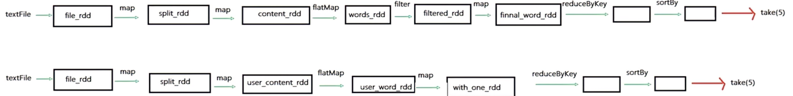

在程序运行时，一个Action算子产生的一个DAG，会产生一个Job，因此：
$$
1个Action = 1个DAG = 1个Job
$$
整个代码运行时，在Spark中称为一个Application。

因此在1个Application中，可以有多个Job，每个Job包含一个DAG，同时每个Job都是由一个Action算子产生的。


根据代码，Spark能够得到对应的DAG。在程序运行时，Spark会根据划分的分区情况和对应的DAG，得到带有分区关系的DAG：

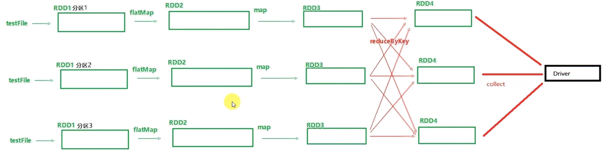


### 4.6.3	DAG的宽窄依赖和阶段划分

SparkRDD前后之间的关系，分为宽依赖和窄依赖：

- 宽依赖(**Shuffle**)：父RDD的一个分区，将数据发给子RDD的**多个**分区

  > ​	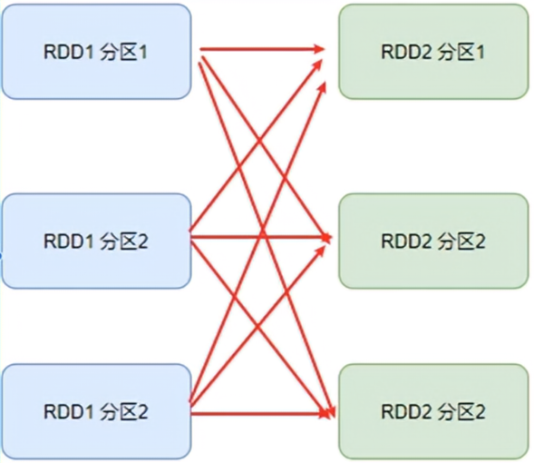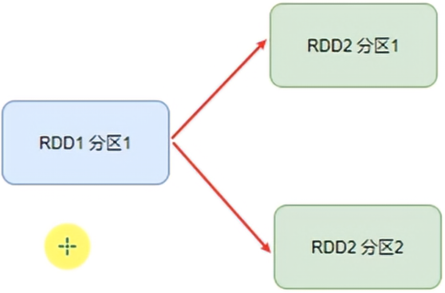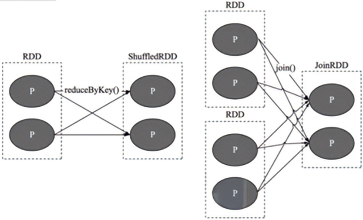

- 窄依赖：父RDD的一个分区，**全部**将数据发给子RDD的**一个**分区

  > 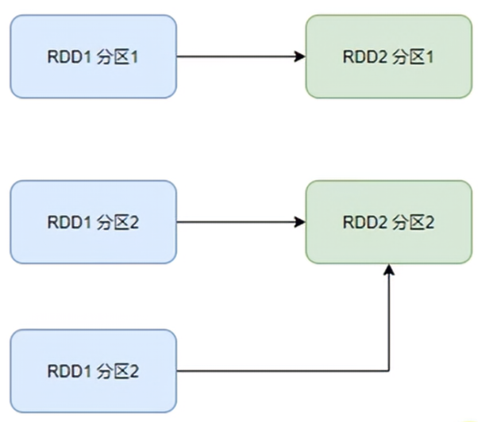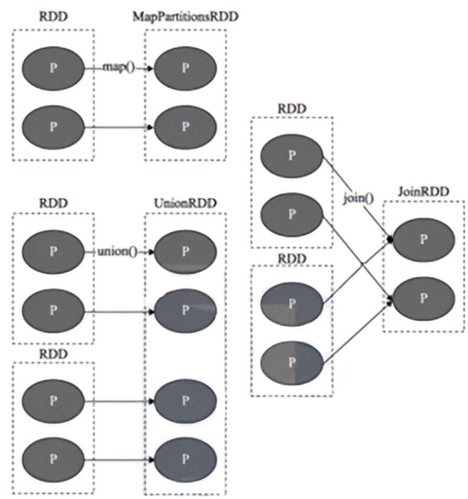

**阶段划分**：

Spark会根据DAG，按宽依赖划分不同的DAG阶段，划分依据是：从后向前，遇到**宽依赖**就划分一个阶段Stage，Stage内部的依赖一定是**窄依赖**。

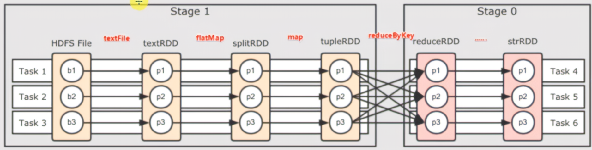


### 4.6.4	内存迭代计算

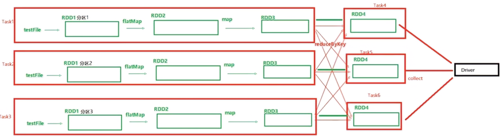

Spark基于带有分区的DAG和阶段划分，可以得到逻辑最优的Task分配，一个Task由一个线程具体执行（窄依赖使得数据只需要在内存中计算，免去了网络开销）。

如上图，Task1中RDD1、RDD2、RDD3迭代计算，都是由一个Task(线程)完成。这一阶段的这一条线是纯内存计算。Task1、Task2、Task3就形成了三个并行的内存计算管道。


Spark默认受全局并行度限制，除个别算子有特殊分区的情况，大部分算子都遵循全局并行度要求，来规划自己的分区数。如全局并行度为3，则大部分算子分区数都是3。

但注意，一般Spark只设置全局并行度即可，不要在除了排序算子外的算子上设置分区数。


### 4.6.5	面试题

Spark是如何做内存计算的？DAG的作用？Stage阶段划分的作用？

1. Spark会根据代码里的Action算子产生DAG
2. DAG基于分区情况和宽窄依赖关系，划分Stage
3. 一个Stage内部都是窄依赖，在窄依赖内，如果形成前后1:1的分区对应关系，就可以产生许多内存迭代计算的管道。这些管道，就是具体的Task
4. 一个Task是一个具体的线程，Task跑在线程内，就实现了内存计算。


Spark为什么比MapReduce快？

1. Spark提供了丰富的算子，MapReduce只有Map和Reduce，这个编程模型很难在一套MR中处理复杂任务。要实现复杂任务，需要写多个MapReduce串联，多个MR串联后通过硬盘交互数据。
2. Spark执行内存迭代，算子间形成DAG，基于依赖划分Stage后，在Stage内形成内存迭代管道。但MapReduce的Map和Reduce交互是基于硬盘的。

总结：Spark的编程模型优于MapReduce；且在算子交互和计算上，Spark尽可能多的使用内存计算而不是磁盘迭代。


### 4.6.6	Spark并行度

Spark的并行：同一时间内，有多少Task同时运行

并行度：并行能力的设置。比如设置并行度6，就是6个Task并行运行，这样RDD的分区数也会被规划为6个。


设置并行度（优先级从高到低）：

- 代码

> ```python
> conf = SparkConf()
> conf.set('spark.default.parallelism', '100')
> ```

- 客户端提交参数(如spark-submit)

> ```sh
> spark-submit --conf "spark.default.parallelism=100"
> ```

- 配置文件

> ```properties
> # 在conf/spark-defaults.conf中设置
> spark.default.parallelism 100
> ```

- 默认(默认值为1，但不会全部以1运行，多数时候基于读取文件的分片数量作为默认并行度)

**注意**：全局并行度是推荐设置，不要修改RDD分区数，否则可能影响内存迭代管道构建或产生额外的Shuffle


**如何规划Spark集群并行度**？

> 一般设置为集群CPU总核心数的2~10倍，要确保是CPU核心数的整数倍


### 4.6.7	Spark任务调度

Spark任务由Driver调度，其工作包含：

- 逻辑DAG产生
- 分区DAG产生
- Task划分
- 将Task分配给Executor并监控工作

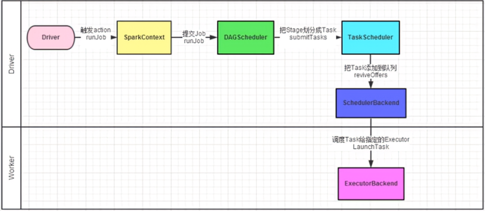

如图，Spark程序调度流程：

1. 构建Driver
2. 构建SparkContext（执行环境入口对象）
3. 基于DAG Scheduler，构建逻辑Task分配
4. 基于Task Scheduler，将逻辑Task分配到各Executor，并监控它们工作
5. Worker(Executor)，被TaskScheduler管理监控，听从其指令工作，并定期汇报工作进度。


Driver内两个组件：

- DAG Scheduler：处理逻辑DAG，得到逻辑Task划分

> 根据DAG和Action算子：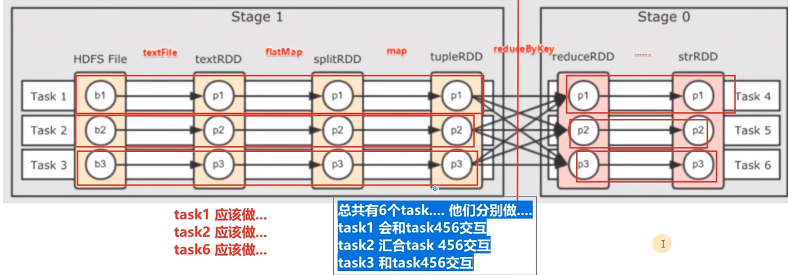

- Task Scheduler：基于DAG Scheduler产出，规划逻辑Task应当在哪些物理的Executor上运行，并监控管理其运行

> 根据逻辑Task划分和实际的Executor数量：
>
> 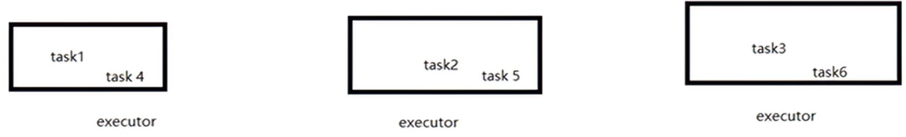


## 4.7	Spark常见概念

常见概念、名词：

- Application：构建在Spark上的用户程序，包括一个Driver程序和集群上的Executor
- Driver：运行应用的main()方法并构建SparkContext的进程
- Cluster Manager：用于管理、分配集群资源的外部服务（如Standalone Manager、YARN、Mesos等）
- Deploy Mode：Driver进程运行所在设备的位置。在集群模式(cluster)中，框架将Driver程序启动在集群内部(容器内)；在客户端模式(client)中，由提交设备(submitter)，在集群外部启动Driver。
- Worker Node：在集群内，能运行应用代码的任一结点。
- Executor：在一个Worker节点上启动的应用进程，执行任务并借助内存或硬盘存储保持数据。每个应用都有自己的Executor。
- Task：被发送给一个Executor的工作单元
- Job：被创建以响应Spark Action算子(save、collect等)的，由多个Task组成的并行计算集合。
- Stage：每个Job以宽依赖为分界，将自身划分为多个Task的集合（类似于MapReduce的Map和Reduce阶段的划分）


层级关系梳理：

- 一个Spark环境能运行多个Application
- 一个代码执行，会成为一个Application
- Application内部可以分为多个Job
- 每个Job由一个Action算子产生，每个Job都有自己对应的DAG
- 一个Job的DAG，会基于宽 依赖，划分为不同Stage
- 不同Stage内，基于分区数量，形成多个并行的内存迭代管道
- 每个内存迭代管道形成一个Task（DAG Scheduler将Job内划分出具体Task，一个Job被划分出的Task在逻辑上称为这个Job的TaskSet）


1.DAG是什么？在Spark中有什么用？

DAG是有向无环图，在Spark中用于描述任务执行的流程，主要作用是协助DAG Scheduler构建Task分配，用于Task管理


2.Spark如何实现内存迭代和阶段划分？

Spark基于DAG中宽窄依赖划分阶段，在阶段内部都是窄依赖，由此构建内存迭代管道


3.什么是DAG Scheduler？

构建Task分配，用于Tas
