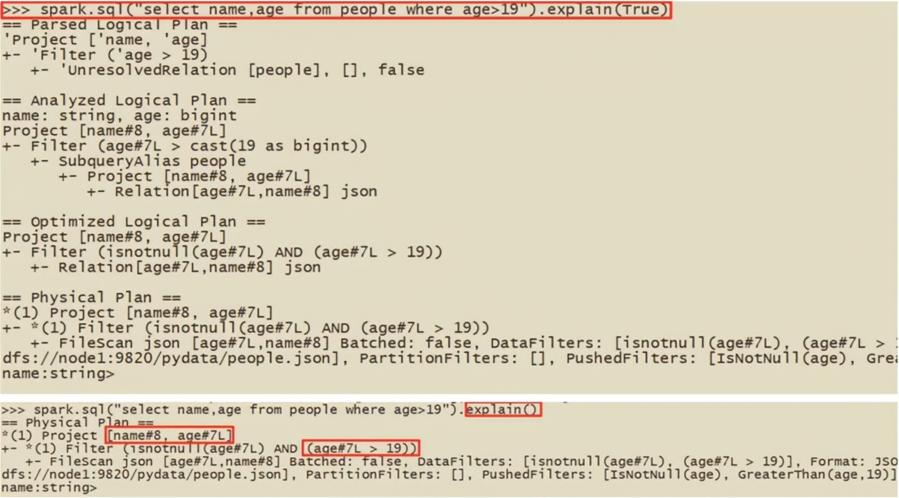

# 5.	Spark SQL

## 5.0	Spark SQL简介

1.什么是SparkSQL？

SparkSQL是Spark用于处理海量**结构化数据**的模块


2.为什么要使用SparkSQL？

- SparkSQL本身优秀：支持SQL、性能强、自动优化、API简单、兼容HIVE
- 企业常用SparkSQL处理业务数据：离线开发、数仓搭建、科学计算、数据分析


3.SparkSQL的特点？

- 融合性：SQL可以无缝集成于代码，随时使用SQL处理数据
- 统一数据访问：一套标准API可以读写不同数据源
- 兼容HIVE：可以使用SparkSQL直接计算，并生成HIVE数据表
- 标准化连接：支持标准化JDBC/ODBC连接，方便与各种数据库进行数据交互


4.SparkSQL和HIVE的异同：

SparkSQL与Hive都是分布式SQL计算引擎，用于处理大规模结构化数据，但SparkSQL有更好的性能


5.SparkSQL的数据抽象

 

Pandas使用DataFrame作为数据抽象，其内部实现是二维表数据结构，适合使用SQL、适合处理结构化数据，但它是本地数据类型，因此不能用于处理分布式数据。

SparkCore使用RDD作为数据抽象，其虽然数据集合是分布式，但没有标准数据结构，因此不适合处理结构化数据。

SparkSQL使用DataFrame作为数据抽象，内部实现是二维表数据结构，且使用分布式集合，因此适合使用SQL和处理分布式结构化数据。


6.SparkSQL在不同语言下的数据类型

SparkSQL数据抽象对象：

- DataSet，实际上是泛型DataFrame，可用于Java、Scala
- DataFrame，可用于Java、Scal、Python


7.DataFrame与RDD的异同


## 5.1	SparkSession

在RDD编程时，Spark程序的执行入口对象是SparkContext

在Spark2.0后，Spark使用SparkSession作为Spark编程的统一入口对象，可以同时用于SparkSQL编程和SparkCore编程。


```python
from pyspark.sql import SparkSession


if __name__ == '__main__':
    # 以构建器模式构造SparkSession对象
    spark = SparkSession.builder\
    		.appName('local[*]')\
    		.master('local[*]')\
    		.config('spark,sql.shuffle.partitions', '4')\
    		.getOrCreate()
    # appName()方法设置Application名, config()设置属性
    # getOrCreate()方法创建SparkSession对象
    
    # 通过SparkSession对象获取SparkContext对象
    sc = spark.sparkContext
    
    # SparkSQL HelloWorld
    df = spark.read.csv('./data/stu_score.txt', seq=',', header=False)
    df2 = df.toDF('id', 'name', 'score')
    df2.printSchema()	# 查看表结构
    df2.show()	# 查看表内数据
    
    # SQL风格编程
    df2.createTempView('score')
    spark.sql('select * from score where name="语文" LIMIT 5').show()
    
    # API模式开发(DSL风格)
    df2.where('name="语文"').limit(5).show()
```


## 5.2	DataFrame

### 5.2.1	DataFrame的组成

DataFrame是一个二维表结构，因此具有三个点：行、列、表结构描述

如在MySQL中的一张表：

- 由许多行组成
- 数据也分为多个列
- 表结构信息：列、列名、列数据类型、列约束等

基于这个前提，DataFrame组成如下：

- 结构层面：
  - StructType对象描述整个DataFrame表结构
  - StructField对象描述一个列的信息
- 数据层面：
  - Row对象记录一行数据
  - Column对象记录一列数据，并包含列信息


### 5.2.2	基于RDD构造DataFrame

DataFrame与RDD都是分布式数据集，因此只需转换其内部存储结构为二维表结构，就可以将RDD转换为DataFrame：

```python
rdd = sc.textFile('./data/sql/people.txt')\
		.map(lambda x: x.split(','))\
		.map(lambda x: [x[0], int(x[1])])
# DataFrame中列名从RDD中推断, 因此需要在RDD中做类型转换
# 要将RDD转换为二维表结构, 以转换为DataFrame

# 这里只传入列名，是否为空默认为True
df = spark.createDataFrame(rdd, schema=['name', 'age'])

# 查看DataFrame表结构
df.printSchema()

# 输出DataFrame数据
# 参数1为输出行数, 默认为20; 
# 参数2表示是否对列截断, 若列数据长度超过20个字符, 后续内容不显示以...代替, 默认True
df.show(20, False)

# 注册成临时视图, 用于SQL查询
df.createOrReplaceTempView('people')
spark.sql('select * from people where age < 30').show()
```


除了先在RDD中转换数据格式，再直接将RDD转换为DataFrame，还有更好的方法，用StructType描述表结构，然后用RDD对象和StructType对象共同构造DataFrame对象：

```python
from pySpark.sql.types import StructType, StringType, IntegerType

rdd = sc.textFile('./data/sql/people.txt')\
		.map(lambda x: x.split(','))\
		.map(lambda x: [x[0], int(x[1])])

# 构造表结构的描述对象StructType
schema = StructType()\
	.add('name', StringType(), nullable=True)\
	.add('age', IntegerType(), nullable=False)
# 基于StructType, 实现RDD到DataFrame的转换
df = spark.createDataFrame(rdd, schema=schema)
```


除此之外，RDD还可以调用.toDF()方法，直接转换为DataFrame：

```python
from pySpark.sql.types import StructType, StringType, IntegerType

rdd = sc.textFile('./data/sql/people.txt')\
		.map(lambda x: x.split(','))\
		.map(lambda x: [x[0], int(x[1])])

# 构造表结构的描述对象StructType
schema = StructType()\
	.add('name', StringType(), nullable=True)\
	.add('age', IntegerType(), nullable=False)

# 只传列名，类型靠推断, 是否为空默认True
df = rdd.toDF(['name', 'age'])

# 基于StructType, 调用.toDF()方法, 实现RDD到DataFrame的转换
df = rdd.toDF(schema)
```


### 5.2.3	基于Pandas构造DataFrame

由于Pandas和SparkSQL的DataFrame都是二维表结构，因此只需要将本地集合转换为分布式集合即可。

```python
# 构造Pandas的DataFrame
pd_df = pd.DataFrame({
    'id': [1, 2, 3],
    'name': ['张三', '李四', '王五'],
    'age': [11, 12, 13]
})

# 将Pandas的DataFrame转换为SparkSQL的DataFrame
spark_df = spark.createDataFrame(pd_df)
```


###  5.2.4	DataFrame读取外部数据

通过使用SparkSQL的统一API进行数据读取，构造DataFrame：

```python
sparkSession.read\
			.foramt('text|csv|json|parquet|orc|avro|jdbc|...')\	# 支持多种数据源
			.option('K', 'V')\	# option可选, 如传入数据库的账号密码
			.schema(StructType | str)\	# str语法如.shcema('name STRING', 'age INT')
			.load('被读取文件路径, 支持本地文件系统和HDFS')
```

读取text数据源：

```python
# 数据特点是一整行作为一列读取, 默认列名为value, 类型为str
schema = StructType().add('data', StringType())
df = spark.read\
    .foramt('text')\
    .schema(schema)\
    .load('./data/people.txt')
```

读取JSON数据源：

```python
# JSON数据源自带类型信息
df = spark.read.format('json').load('./data/people.json')
```

读取CSV数据源：

```python
df = spark.read.format('csv')\
	.option('sep', ',')\	# 设置分隔符
	.option('header', False)\	# 无表头
	.option('encoding', 'utf-8')\	# 设置编码格式
	.schema('name STRING, age INT, job STRING')\	# 设置列名和类型, 默认自动生成列名和str类型
    .load('./data/people.csv')
```

读取parquet数据：

> parquet是Spark常用的**列式存储文件格式**，与Hive的ORC格式类似。
>
> parquet与普通文本文件区别：
>
> - 内置schema（列名\列类型\是否允许为空）
> - 按列存储
> - 序列化存储（可压缩，体积小）

```python
df = spark.read.format('parquet').load('./data/users.parquet')
```


## 5.3	DataFrame编程

### 5.3.1	DSL和SQL编程风格

DataFrame支持两种编程风格：

- DSL风格（领域特定语言，即DataFrame特有API）：调用API方式处理数据，如df.where().litmit()

> ```python
> # 获取Column对象
> id_column = df['id']
> subject_column = df['subject']
> 
> # DLS风格select, 三种方法效果一样
> df.select(['id', 'subject']).show()
> df.select('id', 'subject').show()
> df.select(id_column, subject_column).show()
> 
> # filter API
> df.filter('score < 99').show()
> df.filter(df['score'] < 99).show()
> 
> # where API, 与filter API相同
> df.where('score < 99').show()
> df.where(df['score'] < 99).show()
> 
> # groupBy API 
> df.groupBy('subject').count().show()
> df.groupBy(df['subject']).count().show()
> # 其他API返回的是DataFrame, 而groupBy返回的是GroupedData
> # GroupedData是由分组关系的数据结构，类似于SQL分组后的数据结构, 后接聚合: sum/avg/count/min/max, 聚合后返回的是DataFrame
> ```

- SQL风格：使用SQL语句处理DataFrame数据：spark.sql('select * from xxx*')

> DataFrame可以被看做关系型数据表，使用spark.sql()执行SQL语句，结果返回DataFrame
>
> ```python
> # 使用SQL风格语法前，先将DataFrame注册为表：
> df.createTempView('score')	# 注册临时视图
> df.createOrReplaceTempView('score_2')	# 注册临时视图, 若存在则替换
> df.createGlobalTempView('score_3')	# 注册全局视图
> # 全局指的是在一个程序内的多个SparkSession对象中都可以调用, 查询前要带前缀"global_temp."
> # 临时只在当前SparkSession中可用
> 
> # 通过SparkSession对象的SQL API执行SQL语句
> spark.sql('select subject, count(*) as cnt from score group by subject').show()
> spark.sql('select subject, count(*) as cnt from score_2 group by subject').show()
> spark.sql('select subject, count(*) as cnt from global_temp.score_3 group by subject').show()
> ```


### 5.3.2	SparkSQL库

PySpark提供了pyspark.sql.functions包，提供了一系列SparkSQL的计算函数，这些函数返回值大多为Column对象，如：

```python
from pyspark.sql import functions as F

new_column = F.split(old_column, ' ')
```


### 5.3.3	词频统计案例练习

```python
from pyspark.sql import SparkSession
from pyspark.sql import functions as F


if __name__ == '__main__':
    spark = SparkSession.builder \
    					.appName('test') \
    					.master('local[*]') \
    					.getOrCreate()
    # SQL风格
    sc = spark.sparkContext
    rdd = sc.textFile('./data/word.txt') \
    		.flatMap(lambda x: x.split(' ')) \
    		.map(lambda x: [x])
    df = rdd.toDF(['word'])
    
    df.createTempView('words')	# 注册为临时视图
    spark.sql('SELECT word, COUNT(*) AS cnt FROM words GROUP BY word ORDER BY cnt DESC').show()
    
    # DSL风格
    df = spark.read.format('text').load('./data/word.txt')
    # withColumn: 对已存在的列操作，返回新的列，若名字与旧列相同则替换，否则作为新列存在
    # explode: 将一行转换为多列
    df = df.withColumn('value', F.explode(F.split(df['value'], ' '))) \
    		.groupBy('value') \
    		.count() \
    		.withColumnRenamed('value', 'word') \
    		.withColumnRenamed('count', 'cnt') \
    		.orderBy('cnt', ascending=False) \
    		.show()
```


###  5.3.4	电影评分数据分析案例


```python
from pyspark.sql import SparkSession
from pyspark.sql import functions as F
from pyspark.sql.types import StructType, StringType, IntegerType


# 需求1. 用户平均分
def user_avg_score(df):
    df.groupBy('user_id') \
        .avg('rank') \
        .withColumnRenamed('avg(rank)', 'avg_rank') \
        .withColumn("avg_rank", F.round('avg_rank', 2)) \
        .orderBy("avg_rank", ascending=False) \
        .show()


# 需求2.电影平均分
def movie_avg_score(df):
    df.createTempView('movie')
    spark.sql("""
        SELECT movie_id, ROUND(AVG(rank), 2) AS avg_rank 
        FROM movie GROUP BY movie_id ORDER BY avg_rank DESC
    """).show()


# 需求3. 查询大于平均分的电影数量
def count_better_movie(df):
    # first()方法返回DataFrame的第一行, 是一个Row对象
    avg_score = df.select(F.avg('rank')).first()['avg(rank)']
    print('大于平均分的电影数量：', df.where(df['rank'] > avg_score).count())


# 需求4. 查询高分电影中(>3)打分次数最多的用户, 此人打分的平均分
def active_user_avg_score(df):
    active_user_id = df.where('rank > 3') \
        .groupBy('user_id') \
        .count() \
        .orderBy('count', ascending=False) \
        .limit(1) \
        .first()['user_id']
    df.where(df['user_id'] == active_user_id) \
        .select(F.round(F.avg('rank'), 2)).show()


# 需求5. 查询每个用户平均打分, 最低打分和最高打分
def stat_user_rank(df):
    df.groupBy('user_id') \
        .agg(
        F.round(F.avg('rank'), 2).alias('avg_rank'),
        F.min('rank').alias('min_rank'),
        F.max('rank').alias('max_rank')
    ).show()


# 6. 查询评分超过100次的电影 平均分、排名 TOP10
def stat_hot_movie(df):
    df.groupBy('movie_id') \
        .agg(
        F.count('movie_id').alias('count'),
        F.round(F.avg('movie_id'), 2).alias('avg_rank')
    ).where('count > 100') \
        .orderBy('avg_rank', ascending=False) \
        .limit(10) \
        .show()


if __name__ == '__main__':
    spark = SparkSession.builder \
        .appName('test') \
        .master('local[*]') \
        .getOrCreate()
    sc = spark.sparkContext

    # 读取数据
    schema = StructType().add('user_id', StringType()) \
        .add('movie_id', IntegerType()) \
        .add('rank', IntegerType()) \
        .add('ts', StringType())
    df = spark.read \
        .format('csv') \
        .options(sep='\t', header=False, encoding='utf-8') \
        .schema(schema) \
        .load('./data/u.data')

    # 1. 用户平均分
    user_avg_score(df)

    # 2. 电影平均分
    movie_avg_score(df)

    # 3. 查询大于平均分的电影数量
    count_better_movie(df)

    # 4. 查询高分电影中(>3)打分次数最多的用户, 此人打分的平均分
    active_user_avg_score(df)

    # 5. 查询每个用户平均打分, 最低打分和最高打分
    stat_user_rank(df)

    # 6. 查询评分超过100次的电影 平均分、排名 TOP10
    stat_hot_movie(df)
```

这里使用了几个新的方法：

```python
# agg: GroupedData的API, 其中可以写多个聚合方法
# alias: Column的API, 可以对列重命名
# withColumnRenamed: DataFrame的API, 可以对其中的指定列改名
# orderBy: DataFrame的API, 可以升降序排序
# first: DataFrame的API, 返回值为Row对象

# Row对象是一个数组，可以通过row['列名']取出当前行中某一列具体数值 
```


## 5.4	SparkSQL Shuffle

在Spark WebUI上查看时会发现某一Stage会有200个Task：


这是因为在SparkSQL中，当Job产生Shuffle时，默认分区数(spark.sql.shuffle.partitions)为200。

修改SparkSQL Shuffle分区数可以通过：

- 配置文件:  conf/spark-defaults.conf: spark.sql.shuffle.partitions 100
- 客户端提交： spark-submit --conf "spark.sql.shuffle.partitions=100"
- 代码设置: SparkSession.builder.config("spark.sql.shuffle.partitions"， "2")

spark.sql.shuffle.partitions参数指的是：在SQL计算中，shuffle算子默认分区数为200，在集群模式下200个还可以，但local模式下就会增加很大的调度开销。这个参数与SparkRDD中，设置并行度的参数是独立的。


## 5.5	SparkSQL 数据清洗

在实际生产环境中，要先对初始数据进行数据清洗，将raw数据处理为符合后续处理要求的规整数据。

```python
# 去重

# dropDuplicates()方法将合并重复数据
df.dropDuplicates().show()
# 也可以按字段去重
df.dropDuplicates(['age', 'job']).show()

# 缺失值处理

# 删除有空值的行
df.dropna().show()
# 删除不足3个有效列的行
df.drop(thresh=3).show()
# 删除不足3个有效列的行, 只对subset内的列检查
df.drop(thresh=3, subset=['name', 'age', 'job']).show()

# 缺失值填充

df.fillna('loss').show()
# 指定列填充
df.fillna('N/A', subset=['job']).show()
df.fillna({
    'job': 'N/A',
    'age': 0,
    'name': 'unknown'
}).show()
```


## 5.6	SparkSQL 数据写出

SparkSQL的数据写出方法与数据读取方法格式类似：

```python
df.write\
    .mode(append|overwrite|ignore|error)\
    .format(text|csv|json|parquet|orc|avro|jdbc)\	# 注意text源只支持单列DataFrame写出
    .option(K, V)\
    .save(PATH)	# 写出路径, 支持本地文件和HDFS
```

Text数据写出：

```python
# 只能写出一个列的数据, 需要将DataFrame转换为单列
df.select(F.concat_ws('---', 'user_id', 'movie_id', 'rank', 'ts'))\
	.write\
	.mode('overwrite')\
	.format('text')\
	.save('./data/out/text')
```

CSV数据写出：

```python
df.write\
	.mode('overwrite')\
	.format('csv')\
	.option('sep', ',')\
	.option('header', True)\
	.save('./data/out/csv')
```

JSON数据写出：

```python
df.write\
	.mode('overwrite')\
	.format('json')\
	.save('./data/out/json')
```

Parquet写出：

```python
# format默认是parquet
df.write\
	.mode('overwrite')\
	.format('parquet')\
	.save('./data/out/parquet')
```

 

## 5.7	DataFrame使用JDBC读写数据库

以MySQL为例，要读写MySQL数据库需要将MySQL的驱动提供给Spark Application

需要将驱动（如mysql-connector-java-8.0.13.jar）放入PySpark库目录下：

```sh
# Windows
$CONDA_HOME/Lib/site-packages/pyspark/jars
# Linux
$CONDA_HOME/lib/python3.9/site-packages/pyspark/jars
```

写出数据到MySQL：

```python
df.write\
	.mode('overwrite')\
	.format('jdbc')\
	.option('url', 'jdbc:mysql://172.22.105.146:3306/flow_analyze?userSSL=false&useUnicode=true')\
	.option('dbtable', 'file_characteristics')\
	.option('user', 'root')\
	.option('password', 'root')\
	.save()
# JDBC写出会自动创建对应的表, 因为DataFrame中的StructType包含了表结构
```

从MySQL读取数据：

```python
df.read\
	.format('jdbc')\
	.option('url', 'jdbc:mysql://172.22.105.146:3306/flow_analyze?userSSL=false&useUnicode=true')\
	.option('dbtable', 'file_characteristics')\
	.option('user', 'root')\
	.option('password', 'root')\
	.load()
```


## 5.8	SparkSQL自定义函数

SparkSQL支持定义函数UDF和UDAF，其中UDF实际使用更广泛。

在Hive中，自定义函数有三种：

- UDF(User Defined Function)：
  - 一对一，输入一个值输出一个值
  - 在Hive中继承UDF类，方法名为evaluate，返回值不能为void，也就是实现一个方法
- UDAF(User Defined Aggregation Function)：
  - 多对一，通常与groupBy联合使用
- UDTF(User Defined Table Generating Functions)：
  - 一对多，即一行变多行
  - 自定义生成函数，类似于flatMap

在SparkSQL中，只支持UDF和UDAF，对PySpark、SparkR，只支持UDF


### 5.8.1	定义UDF

有两种UDF定义方式：

- ```python
  # SparkSession注册的UDF支持DSL和SQL风格，返回值用于DSL、传参内的名字用于SQL
  udf_obj = sparkSession.udf.register(udf_name, udf_method, return_dtype)
  """
  	udf_name: UDF名称, 用于SQL风格
  	udf_method: 被注册成UDF的方法名
  	return_dtype: UDF返回值类型
  	udf_obj: 返回值对象，这是一个UDF对象，用于DSL风格
  """
  def my_func(x):
      return x
  udf2 = spark.udf.register('udf1', my_func, IntegerType())
  
  # SQL风格:
  df.selectExpr('udf1(num)')
  
  # DSL风格
  # select方法接受列名对应的字符串 或是返回值类型为Column的计算
  # 返回值UDF对象如果作为方法使用, 传入的参数应为Column对象
  df.select(udf2(df['num']))
  ```

- ```python
  # 在pyspark.sql.functions.udf中注册的UDF，只能用于DSL风格
  udf_obj = F.udf(udf_method, return_dtype)
  
  udf3 = F.udf(my_func, IntegerType())
  df.select(udf3(df['num']))
  ```


要注册返回值类型为Array的UDF：

```python
udf2 = spark.udf.register('udf1', my_func, ArrayType(StringType()))
# 返回值类型为Array的，要指明Array中的元素数据类型
```

要注册返回值类型为字典的UDF：

```python
struct_type = StructType()\
					.add('num', IntegerType())\
    				.add('letter_str', StringType())
udf2 = spark.udf.register('udf1', my_func, struct_type)
```


### 5.8.2	借助RDD实现UDAF

由于PySpark不支持UDAF，因此我们可以借助RDD的mapPartitions算子完成聚合操作，变相实现UDAF

```python
rdd = sc.parallelize([1, 2, 3, 4, 5], 3)
df = rdd.map(lambda x: [x]).toDF(['sum'])

# 要用mapPartitions算子实现UDAF, 必须合并为单分区
rdd = df.rdd.repartition(1)

def sum_reduce(iter):
    sum = 0
    for row in iter:
        sum += row['num']
    return [sum]	# mapPartitions要求返回值类型必须为list

res = rdd.mapPartitions(sum_reduce)
```


## 5.9	SparkSQL 窗口函数

### 5.9.1	开窗函数

开窗函数的引入，是为了既显示聚合前数据，又显示聚合后数据，即在每行最后一列添加聚合函数的效果

开窗用于为行定义一个窗口（窗口指的是运算要操作的行的集合），它对一组值操作，不需要使用GroupBy对数据分组，能在同一行内返回基础行的列和聚合列


**聚合函数和开窗函数的区别**：

- 聚合函数将多行变为一行：count、avg等
- 开窗函数将一行变为多行
- 聚合函数若想显示其他列，必须将列加入到groupBy中
- 开窗函数不需要groupBy，直接将所有信息显示出来


**开窗函数分类**：

- 聚合开窗函数：聚合函数（列）**OVER（选项）**，选项可以是PARTITION BY子句，但不能是ORDER BY子句
- 排序开窗函数：排序函数（列）OVER（选项），选项可以是ORDER BY子句，也可以是 OVER (PARTITION BY 子句 ORDER BY子句)，但不能是PARTITION BY子句
- 分区类型NTILE的窗口函数


示例：

```python
rdd = sc.parallelize([
        ('张三', 'class_1', 99),
        ('李四', 'class_2', 91),
        ('王五', 'class_3', 96),
        ('赵六', 'class_1', 93),
        ('杨七', 'class_2', 95),
        ('周八', 'class_3', 92),
        ('向九', 'class_1', 99),
        ('段十', 'class_2', 97),
        ('樊十一', 'class_1', 94),
        ('罗十二', 'class_3', 95)
    ])

schema = StructType() \
    .add('name', StringType()) \
    .add('class', StringType()) \
    .add('score', IntegerType())
df = rdd.toDF(schema)

df.createTempView('stu')

# 聚合窗口函数
spark.sql('SELECT *, AVG(score) OVER() AS avg_score FROM stu').show()
+------+-------+-----+---------+
|  name|  class|score|avg_score|
+------+-------+-----+---------+
|  张三|class_1|   99|     95.1|
|  李四|class_2|   91|     95.1|
|  王五|class_3|   96|     95.1|
|  赵六|class_1|   93|     95.1|
|  杨七|class_2|   95|     95.1|
|  周八|class_3|   92|     95.1|
|  向九|class_1|   99|     95.1|
|  段十|class_2|   97|     95.1|
|樊十一|class_1|   94|     95.1|
|罗十二|class_3|   95|     95.1|
+------+-------+-----+---------+

# 排序窗口函数
# 常见有RANK over, DENSE over, ROW_NUMBER over
spark.sql('SELECT *, ROW_NUMBER() OVER(ORDER BY score DESC) AS row_number_rank, DENSE_RANK() OVER(PARTITION BY class ORDER BY score DESC) AS dense_rank, RANK() OVER(ORDER BY score) AS rank FROM stu').show()
+------+-------+-----+---------------+----------+----+
|  name|  class|score|row_number_rank|dense_rank|rank|
+------+-------+-----+---------------+----------+----+
|  张三|class_1|   99|              1|         1|   9|
|  向九|class_1|   99|              2|         1|   9|
|樊十一|class_1|   94|              7|         2|   4|
|  赵六|class_1|   93|              8|         3|   3|
|  段十|class_2|   97|              3|         1|   8|
|  杨七|class_2|   95|              5|         2|   5|
|  李四|class_2|   91|             10|         3|   1|
|  王五|class_3|   96|              4|         1|   7|
|罗十二|class_3|   95|              6|         2|   5|
|  周八|class_3|   92|              9|         3|   2|
+------+-------+-----+---------------+----------+----+

# NTILE
spark.sql('SELECT *, NTILE(6) OVER(ORDER BY score DESC) FROM stu').show()
```


## 5.10	SparkSQL运行流程

### 5.10.1	RDD执行流程回顾

代码提交到DAG调度器产生逻辑任务；Task调度器根据实际情况和逻辑任务分配任务并管理Worker工作情况


### 5.10.2	SparkSQL自动优化

RDD执行时完全按照开发者代码执行，若代码逻辑存在问题则RDD执行效率也受影响。

而SparkSQL会对代码自动优化，以提升代码运行效率，避免开发者水平影响代码执行效率。

> RDD是抽象数据类型，数据类型不限格式和结构，因此难以优化
>
> DataFrame一定是二维表结构，因此可以针对性优化
>
> SparkSQL的自动优化依赖于Catalyst优化器


### 5.10.3	Catalyst优化器

为了解决过于依赖Hive问题，SparkSQL使用Catalyst优化器替代了Hive优化器。SparkSQL运行架构如下：


- API：Spark通过一些API接受SQL语句
- Catalyst：Catalyst对收到的SQL语句进行解析，生成执行计划等
- RDD：Catalyst的输出是RDD的执行计划
- Cluster：最终交由集群运行


Catalyst优化器具体运行流程如下：


**第一步**：解析SQL，生成**抽象语法树AST**：


可以看到，这段SQL存在一个问题，即people.age>10应当先做再与score表做JOIN

Catalyst根据输出的SQL生成抽象语法树如右所示。


**第二步**：在AST中加入元数据信息，这是为了优化：


**第三步**：将加入原数据的AST输入优化器进行优化，得到逻辑计划：

这里介绍两种常见的优化：断言下推和列值裁剪： 


**第四步**：根据逻辑计划生成物理计划，从而生成RDD来运行

在生成物理计划时，会经过成本模型，对整棵树再次优化，选择更好的计划。

生成物理计划后，考虑到性能，使用代码生成，在集群中运行生成的RDD代码。

可以使用queryExecution方法查看逻辑执行计划，explain方法查看物理执行计划




**总结**：

Catalyst主要优化点有两个：

- 谓词下推/断言下推：将逻辑判断提到前面，减少shuffle数据量；即行过滤，提前执行where
- 列值裁剪：将加载的列裁剪，尽量减少被处理数据宽度；即列过滤，提前规划select的字段数

> 列值裁剪适合按列存储的存储方式，如Parquet
