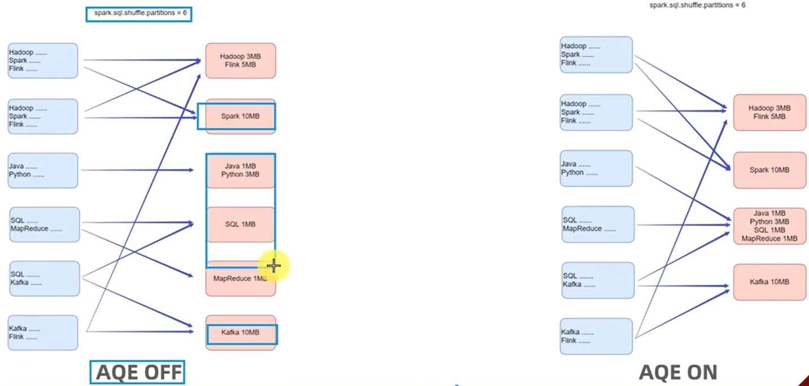

# 6.	Spark新特性

## 6.1	Spark Shuffle

Spark的Shuffle阶段中有MapReduce的概念：

​	提供数据的是Map端（Shuffle Write）、接收数据的是Reduce端（Shuffle Read）

在Spark的两个阶段中，总是前一个阶段产生一批Map提供数据，下一个阶段产生一批Reduce接收数据


Spark提供了两种Shuffle管理器：

- HashShuffleManager：基于Hash分组的Shuffle
- SortShuffleManager：基于排序的Shuffle


### 6.1.1	HashShuffleManager


按上图所示，假设有Executor的Task执行后将结果输出到文件中，原始思想是首先输出到Buffer内存缓冲区，缓冲区满后输出到文件块Block File中，最后再进行Shuffle，将文件块通过网络传输到对应文件内。这个过程中产生了大量的网络IO，造成了Shuffle效率低下。

优化：在Task结束后，Executor内的Task共享同一个Buffer缓冲区，因此先对输出内容进行Shuffle，从而极大地减少了网络IO和磁盘IO，提高了Shuffle性能：


### 6.1.2	SortShuffleManager

SortShuffleManager运行机制分为普通运行机制和bypass运行机制。

SortShuffle实际上是HashShuffle的改进，因为每个Task只生成一个磁盘文件，这就减少了网络IO：


Task需要输出时首先进行按类别排序，得到多个内存缓冲区...

最终Task所有结果都输出到一个磁盘文件中，同时还有一个索引文件，指导该磁盘文件中不同内容对应所在的位置，只需要按块读取即可。


**bypass运行机制**：

当shuffle时Map端的Task数量小于spark.shuffle.sort.bypassMergeThreshold(默认200)时，且使用不是聚合类的Shuffle算子（如reduceByKey）时运行bypass机制。


bypass机制写入内存缓冲前不需要排序而是直接写出，最终合并为一个最终文件和索引开销，节省了排序的性能开销。


**注意**：Shuffle都需要经过内存缓冲区**溢写磁盘**场景，尽管Spark是内存迭代计算矿价，但内存迭代主要在窄依赖中，在宽依赖（Shuffle）中，磁盘交互是不可避免的，因此要尽量减少Shuffle的出现。


## 6.2	Spark3.0新特性

### 6.2.1	SparkSQL 自适应查询AQE

自适应查询（Adaptive Query Execution）避免了Catalyst优化器由于缺乏或不准确的数据统计信息（元数据）和对成本的错误估算（执行计划调度）导致生成的初始执行计划不理想的问题。

通过在**运行时**对查询执行计划进行优化，允许Planner在运行时执行可选计划，这些可选计划将会基于运行时数据统计进行动态优化，从而提高性能。

AQE主要提供三个方面的自适应优化：

- 动态合并Shuffle Partitions
- 动态调整JOIN策略
- 动态优化倾斜JOIN(Skew Joins)

```python
#开启AQE
.set('spark.sql.adaptive.enabled', 'true')
```

#### 6.2.1.1	动态合并

动态合并可以动态调整shuffle分区数量，用户可以在开始时设置相对较多的shuffle分区数，AQE会在运行时将相邻小分区合并为大分区




#### 6.2.1.2	动态调整JOIN策略

动态调整JOIN策略可以一定程度避免由于缺少统计信息或错误估计大小，导致执行计划性能不佳的问题。它能在运行时sort merge join转换为broadcast hash join，从而进一步提升性能


如上图所示，在Sort Merge JOIN时，块2在生成执行计划时原本预估大小为25M但实际大小为8M，此时直接发送再Shuffle会造成额外的网络IO开销，因此AQE将Sort Merge JOIN策略动态转换为Broadcast Hash JOIN策略，此时块1可以直接通过广播变量获取块2数据，直接在块内完成Shuffle，从而减少了网络IO开销。


#### 6.2.1.3	动态优化倾斜JOIN

倾斜JOIN可能导致负载极端不平衡并严重降低性能，在AQE从Shuffle文件统计信息中**检测到倾斜**后，可以将倾斜分区**分割为更小的分区**，并将其与另一侧的相应分区连接起来。这种优化可以并行化倾斜处理，以获得更好性能。


### 6.2.2	SparkSQL 动态分区裁剪


### 6.2.3	增强的Python API：Koalas

Koalas是基于Spark的Pandas API实现，使得开发者能在分布式环境使用Pandas API处理数据