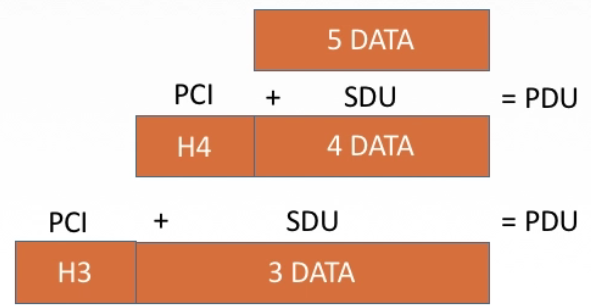
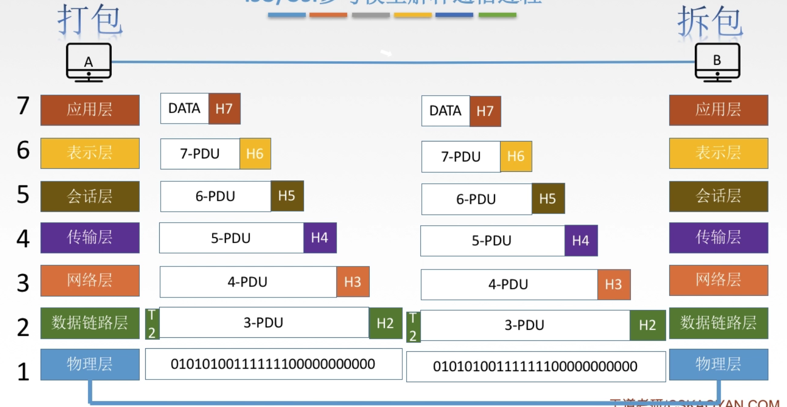

[TOC]

# 1.	概念

## 1.1	概念

### 1.1.1	基本概念

**计算机网络是网络下的一个分支**，网络还有许多其他分支，如铁路网、电话网、人体神经网络等

**计算机网络**：是一个将分散的、有独立功能的**计算机系统**，通过**通信设备**与**线路**连接起来，由功能完善的**软件**实现**资源共享**和**信息传递**的系统。

计算机网络是**互连、自治**的计算机集合

> 计算机网络的实现依托：通信设备、线路、软件，是一个计算机系统

> 计算机网络的功能：
>
> 1. 数据通信
> 2. 资源共享（硬软件、数据共享）
> 3. （了解）分布式处理、提高可靠性、负载均衡

### 1.1.2	计算机网络组成

1.组成部分：硬件、软件、协议

2.工作方式：

- 边缘部分：用户直接使用（C/S方式、P2P方式）
- 核心部分：为边缘部分提供服务

3.功能组成：

根据计算机网络的功能（数据通信、资源共享），将计算机网络按功能分为两个子网：

- 通信子网：用于实现**数据通信**，是各种传输介质、通信设备和网络协议的组成
- 资源子网：实现**资源共享**和数据处理，是实现资源共享功能的设备和软件的集合

| 子网划分 | OSI模型分层 | 该层对应设备   |
| -------: | :---------: | :------------- |
| 资源子网 |   应用层    |                |
| 资源子网 |   表示层    |                |
| 资源子网 |   会话层    |                |
|          |   传输层    |                |
| 通信子网 |   网络层    | 路由器         |
| 通信子网 | 数据链路层  | 交换机、网桥   |
| 通信子网 |   物理层    | 集线器、中继器 |

### 1.1.3	计算机网络分类

1.按分布范围分为：广域网WAN、城域网MAN、局域网WAN、个人局域网PAN

2.按使用者分为：

- 公用网（如商业网络）
- 专用网（如军用网络）

3.按交互技术分为：电路交换、报文交换、分组交换

4.按拓扑结构分为：总线型、星型（**中间有一个节点连接外部各节点，因此链路数=节点数-1**）、环形、网状型（常用于广域网）

5.按传输技术分为：

  - 广播式网络：共享公共通信信道
  - 点对点网络：使用**分组存储转发**和**路由选择**机制

### 1.1.4	总结

## （非重点）1.2	标准化

标准化的目的：实现不同厂商的软硬件之间相互连通

标准的分类：

  - 法定标准：由权威机构指定，正式合法的标准（如OSI模型）
  - 事实标准：某公司产品因竞争力强占据市场主流，时间长了，产品的协议和技术就成了标准（如TCP/IP）

### 1.2.1	标准化工作

RFC(Request For Comments)：因特网标准的形式

RFC上升为因特网正式标准的**四个阶段**：

1）**因特网草案(Internet Draft)**：还不是RFC文档

2）**建议标准(Proposed Standard)**：开始成为RFC文档，在网上接受建议

3）**草案标准(Draft Standard)**：**已废弃**，将标准提交IETF、IAB审核

4）**因特网标准(Internet Standard)**

### 1.2.2	标准化相关组织

国际标准化组织ISO：设计了OSI参考模型、HDLC协议

国际电信联盟ITU：制定通信规则

国际电气电子工程师协会IEEE：学术机构，制定了IEEE802系列标准、5G标准

Internet工程任务组IETF：负责因特网相关标准的制定（RFC XXX）

### 1.2.3	总结

## 1.3	性能指标

### 1.3.1	速率

速率，即**数据率**，或称为**数据传输率**，或**比特率**

速率：连接在计算机网络上的**主机**，在数字信道上，**传输数据位数的速率****

### 1.3.2	带宽

在计算机网络中，**带宽表示网络通信线路传送数据的能力**，通常指单位时间内，从网络某一点到另一点通过的**最高数据率**

**带宽也表示网络设备所支持的最高速度**，如百兆路由器

带宽指的是发送数据的速率，数据传播速度由链路介质决定

### 1.3.3	吞吐量

吞吐量，表示单位时间内，通过某个网络（信道、接口）的数据量

吞吐量受网络带宽，或网络额定速率限制

### 1.3.4	时延

时延，指数据（报文/分组/比特流），从网络（链路）一端传送到另一端所需时间。也叫延迟或迟延。

时延分为四种：

- 发送时延（传输时延）：从发送分组第一个比特算起，到该分组最后一个比特发送完毕所需时间，其大小由数据长度和信道带宽决定

> $发送时延 = \frac{数据长度}{信道带宽（发送速率）}$

- 传播时延：数据在信道从一端传播到另一端所需时间，其大小取决于电磁波传播速度和链路长度

> $传播时延 = \frac{信道长度}{电磁波传播速率}$

- 排队时延：等待输入、输出链路可用的时间
- 处理时延：网络设备检错、找出口所需时间

### 1.3.5	时延带宽积

$时延带宽积 = 传播时延 * 带宽$，是描述数据量的属性

时延带宽积又称为 **以比特为单位的链路长度**，即某段链路现在有多少比特

### 1.3.6	往返时延RTT

往返时延RTT：从发送方发送数据开始，到发送方收到接收方的确认（接收方收到数据后立即发送确认），总共经历的时延

RTT越大，在收到确认之前，可以发送的数据越多

$RTT = 往返传播时延 + 末端处理时间 = 传播时延*2 + 末端处理时间$

### 1.3.7	利用率

利用率分为信道利用率和网络利用率

$信道利用率 = \frac{有数据通过时间}{总时间}$

网络利用率：各信道的信道利用率加权平均值

### 1.3.8	总结

## 1.4	网络体系结构

关键词：实体、接口、服务、协议

- 实体：层中的活动元素 ，同一层间的实体为**对等实体**

- （水平）协议：为进行网络中对等实体数据交换建立的规则，协议分为三项：

	- 语法：规定传输数据的格式
	- 语义：规定要完成的功能
	- 同步：规定各种操作的顺序

- 接口（访问服务点SAP）：上层使用下层服务的入口

- （垂直）服务：下层为相邻上层提供的功能调用

SDU服务数据单元：为完成用户要求的功能应传送的数据

PCI协议控制信息：控制协议操作的信息

PDU协议数据单元：对等层次之间传送的数据单位

在同一层中，$PCI + SDU = PDU$，该层的PDU将作为下一层的SDU：

### 1.4.1	分层原则

1. 各层之间相互**独立**，每层只实现一种相对独立的功能
2. 每层之间**界面自然清晰**，易于理解，相互交流尽可能少
3. 结构上可分割开，每层都采用**最合适的技术**来实现
4. 保持**下层对上层的独立**性，**上层单向使用下层提供的服务**
5. 整个分层结构能促进标准化工作

### 1.4.2	总结

网络体系结构是从**功能**上描述计算机网络结构的

计算机网络体系结构是**分层结构**

**每层遵循某网络协议**，以完成本层功能

**计算机网络体系结构**是计算机网络的**各层及其协议的集合**

某层在向上层提供服务时，此服务不仅包含该层自身功能，还包含下层服务提供的功能

**仅在相邻层之间存在接口**，且提供的服务具体实现细节对上层完全屏蔽

体系结构是**抽象**的，而实现是指能运行的一些软硬件

## 1.5	OSI参考模型

ISO提出**OSI参考模型的目的**：**支持异构网络系统互联互通**

OSI七层模型：

| OSI七层模型 |      |
| ----------- | ---- |
| 应用层      |      |
| 表示层      |      |
| 会话层      |      |
| 传输层      |      |
| 网络层      |      |
| 数据链路层  |      |
| 物理层      |      |

从下向上，1-3层为通信子网，负责数据通信；5-7层为资源子网，负责数据处理

### 1.5.1	OSI模型工作流程

在通信过程中，发送端主机从应用层开始，由数据作为数据服务单元SDU，加上协议控制信息PCI，组装为协议数据单元PDU，传递给下层

下层将整个PDU作为该层的SDU，再加上该层的PCI，组装为该层的PDU，传递给更下层。

当传递到数据链路层时，在之前基础上，在尾部还添加了一段信息，再将该PDU传递给物理层

物理层不作处理，只将信息转换为数字信号，传递给目标主机的物理层。

目标主机接收到信息后层层上传，最终传递到应用层。

发送端信息由上向下传递信息的过程中要不断添加协议控制信息PCI，称为打包

接收端将PCI剥离信息，这个过程称为拆包

### 1.5.2	各层

#### 1.5.2.1	应用层

应用层是所有能与用户交互，产生网络流量的程序，如文件传输(FTP)、电子邮件(SMTP)、万维网(HTTP)

#### 1.5.2.2	表示层

用于处理在两个通信系统中，交互信息的表示方式（语法和语义）

表示层的功能：数据格式变换、数据加密解密、数据压缩和恢复

#### 1.5.2.3	会话层

向表示层实体/用户进程，提供**建立连接**并在连接上**有序传输数据**

这是会话，也是**建立同步**(SYN)

会话层功能：

①建立、管理、终止会话 

②使用校验点，使会话在通信失效时，从校验点/同步点恢复通信，实现数据同步（用于传输大文件，断点续传）

#### 1.5.2.4	传输层（TCP、UDP）

负责主机中**两进程，即端到端**的通信。

传输层的信息传输单位是报文段或用户数据报

传输层的功能：

①可靠传输、不可靠船速

②差错控制

③流量控制

④复用分用

> 复用：多个应用层进程同时使用下面运输层的服务
>
> 分用：运输层把收到的信息分别交付给上面应用层中相应进程

#### 1.5.2.5	网络层（IP、IPX、ICMP、IGMP、ARP、RARP、OSPF）

把**分组**从源端传到目的端，为分组交换网上的不同主机提供通信服务

网络层的传输单位是数据报，一个数据报由若干个分组组成。

网络层的功能：

①路由选择（选择最佳路径）

②流量控制（协调发送和接收速度，限制发送速度）

③差错控制（确保分组正确）

④拥塞控制（限制全局速度）

#### 1.5.2.6	数据链路层（SDLC、HDLC、PPP、STP）

将网络层传递的**数据报组装成帧**

数据链路层的传输单位是**帧**

数据链路层功能：

①成帧（定义帧的开始和结束）

②差错控制（帧错、位错）

③流量控制

④访问（接入）控制 （控制对信道的访问）

#### 1.5.2.7	物理层（RJ45、802.3）

在**物理媒体**上实现比特流的**透明传输**

> 透明传输：无论所传数据是什么样的比特组合，都应当能在链路上传送

物理层传输单位是**比特**

物理层的功能：

①定义接口特性（接口引脚定义等）

②定义传输模式（单工、半双工、双工）

③定义传输速率

④比特同步（发送1接收1，发送0接收0）

⑤比特编码（定义编码格式）

## 1.6	TCP/IP模型

### 1.6.1	TCP/IP与OSI模型共同点

①都是分层模型

②都是基于独立的协议栈的概念

③都能实现异构网络互联

### 1.6.2	TCPI/IP与OSI模型不同点

①OSI定义了三点：服务、协议和接口

②OSI先出现，参考模型先于协议发明，不偏向特定协议

③TCP/IP设计初就考虑到**异构网络互连**问题，将IP作为重要层次

④网络层使用IP协议，是基于无连接的协议（TCP/IP模型更看重IP协议，因此TCP/IP模型在网络层只有无连接）

为了保证可靠性，在传输层使用基于传输层的协议

|        |     OSI模型      | TCP/IP模型       |
| -----: | :--------------: | ---------------- |
| 网络层 | 无连接、面向连接 | 无连接           |
| 传输层 |     面向连接     | 无连接、面向连接 |

**面向连接分为三个阶段：建立连接、传输数据、释放连接**

**无连接不需要建立和释放连接，直接传输数据**

### 1.6.3	5层参考模型

5层参考模型综合了OSI和TCP/IP模型的优点：

| 5层参考模型 |                 特点                 | 代表协议                             | 传输单位             |
| ----------: | :----------------------------------: | ------------------------------------ | -------------------- |
|      应用层 |           支持各种网络应用           | FTP、SMTP、HTTP                      | 报文Message          |
|      传输层 |    进程-进程（端到端）的数据传输     | TCP、UDP                             | 报文段Segment        |
|      网络层 | 源主机到目的主机的数据分组路由与转发 | IP、IPX、ICMP、IGMP、ARP、RARP、OSPF | 数据报Datagram、分组 |
|  数据链路层 |     将网络层传递的数据报组装成帧     | Ethernet、PPP                        | 帧Frame              |
|      物理层 |               比特传输               |                                      | 比特bit              |

## 1.7	总结

