# 2.	物理层

## 2.1	基本概念

### 2.1.1	物理层

物理层是指解决如何在连接各种主机的传输媒体上**传输数据比特流**，而不是具体的传输媒体

主要任务：确定与传输媒体接口有关的特性（即定义标准）：

①机械特性：定义物理连接特性，规定物理连接时采用的规格、接口形状、**引线数目、引脚数量**和排列等

②电气特性：规定传输二进制位时，线路上信号的**电压范围**、阻抗匹配、**传输速率和距离限制**等

③功能特性：指明某条线上出现的**某电平表示何种意义**，接口部件的信号线用途

④规程特性：定义各物理线路**工作规程和时序关系**

### 2.1.2	数据通信

通信的目的是传输消息

**数据**：传输消息的实体，通常是有意义的符号序列

**信号**：数据的电气/电磁表现，是数据在传输过程中的**存在形式**

-	数字信号：信息的参数取值是离散的
-	模拟信号：信息的参数取值是连续的

**信源**：产生和发送数据的源头

**信宿**：接收数据的终点

**信道**：信号的传输媒介，一般指向某方向传递信息的介质，因此一条通信线路通常包含一条发送信道和一条接收信道

- 按传输信号，信道可分为数字信道和模拟信道
- 按传输介质，信道可分为有限信道和无线信道

**两种数据传输方式**：

- **串行传输**：传输速度慢，费用低，适合远距离传输
- **并行传输**：传输速度快，费用高，适合近距离传输，常用于计算机内部数据传输

**码元**：用一个**固定时长的信号波形（数字脉冲）**，代表不同离散数值的基本波形，是数字通信中数字信号的计量单位。

​		这个时长内的信号称为$k$**进制码元**，时长称为码元宽度。

​		当码元的离散状态有$M(M>2)$个时，此时码元为$M$进制码元。如二进制编码中，只有0、1两种状态的码元

​		**1码元可携带多个比特的信息量**。

**速率**：**数据传输速率**，表示单位时间内传输的数据量，可用**码元传输速率**和**信息传输速率**表示

> 传输速率指的是发送端的发送速率，传播速率指的是在信道上的信号传递速率

- **码元传输速率**：也叫码元速率、波形速率、调制速率、符号速率等，表示单位时间内传输的**码元个数（或脉冲个数、信号变化次数）**，单位是**波特(Baud)**，1波特表示数字通信系统每秒传输1个码元。码元速率与码元进制数无关。

- **信息传输速率**：也叫信息速率、比特率等，表示单位时间内传输的**二进制码元个数（比特数）**，单位是比特/秒(b/s)

- 若1码元携带 $n$ bit信息量，则$M$ Baud码元传输速率对应的信息传输速率为 $M * n$ b/s，

  **注意**，$n = log_2k$

**带宽**：单位时间内，从网络一点到另一点能通过的**最高数据率**，表示通信线路的传输数据的能力

> 例题：某通信系统传输四进制码元，$4s$内传输了$8000$个码元，求系统的码元传输速率和信息传输速率；若另一通信系统传输十六进制码元，$6s$传输了$7200$个码元，求该系统的码元传输速率和信息传输速率，比较两系统传输速率高低。
>
> ​	对前者：码元传输速率 = $8000 / 4 = 2000 Baud$， 信息传输速率 = $log_24 * 2000 = 4000 b/s$
>
> ​	对后者：码元传输速率 = $7200 / 6 = 1200Baud$， 信息传递速率 = $log_216 * 1200 = 4800b/s$
>
> ​	通过比较信息传递速率可知，后者传输速率更高。

### 2.1.2	编码与调制 

接2.1.1信道内容，

信道上传递的信号可分为两类：

- 基带信号：将数字信号0、1直接用两种不同电压表示，再送到**数字信道**上传输（**基带传输**）

> 基带信号是**来自信源的信号**，如计算机输出的代表各种文字、图像文件的数据信号。
>
> 基带信号是发出的**直接表达要传输信息的信号**，如说话的声波

- 宽带信号：将基带信号调制后形成的频分复用模拟信号，再送到**模拟信道**上传输（宽带传输）

> 基带信号经过**载波调制**后，把信号的**频率范围搬移到较高频段**，以便传输（即仅在一段频率范围内能通过信道）

近距离传输使用基带传输（近距离传输衰减小，信号内容不容易变化）

远距离传输使用宽带传输（远距离传输衰减大，即使信号变化大也能过滤出基带信号）

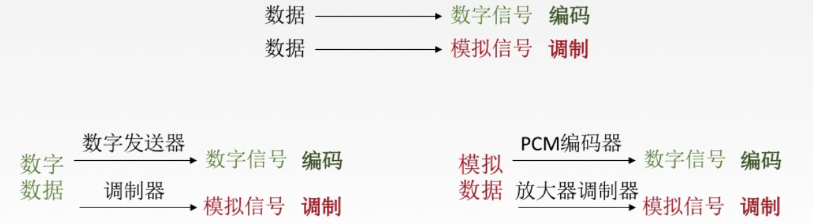

#### 2.1.2.1	编码

编码类型：非归零编码、曼彻斯特编码、差分曼彻斯特编码、归零编码、（了解）反向不归零编码、（了解）4B/5B编码

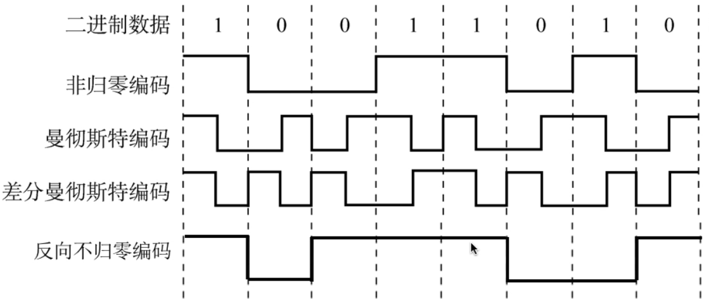

- 非归零编码：高1低0

  - 编码易实现，但**没有检错功能**，**无法判断一个码元的开始和结束**，以至于收发双方**难以保持同步**

- 归零编码：信号电平在一个码元内，要恢复到零

- 反向不归零编码：信号电平翻转表示0，信号电平不变表示1
  - 当有连续相同信号时，信号电平长期保持不变，难以准确接受信息
  
- 曼彻斯特编码：将一个码元分为两个相等间隔，前低后高表示1，前高后低表示0，或正相反
  - 在每个码元中间都有电平跳变，位中间的跳变既作时钟信号（用于同步），也作数据信号。但其所占频带宽度时原始基带宽度的两倍
  - 由于一个码元被调成两个电平，因此数据传输速率只有调制速率的一半                
  
- 差分曼彻斯特编码：同1异0（遇0跳变，遇1不变）

  - 常用于局域网传输，若码元为1，则前半个码元电平与上一个码元的后半个码元电平相同；0则相反
  -  在每个码元中间，都有一次电平跳转，可以实现自同步，干扰性强于曼彻斯特编码

- （了解）4B/5B编码：在比特流中，插入额外比特以打破一连串的0或1，即用5个比特编码4个比特的数据，编码效率80%

  - 只采用16种编码对应16种不同的4位码，其余16种作为控制码（帧开始、结束，线路状态信息等）或保留

  

  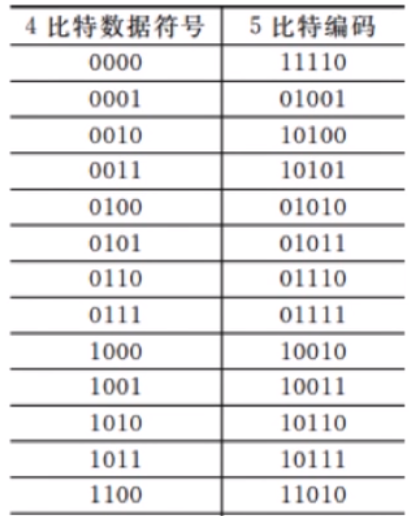

#### 2.1.2.2	数字数据调制为模拟信号

数字数据调制技术：在发送端将数字信号转换为模拟信号（调制），在接收端将模拟信号还原为数字信号（解调）

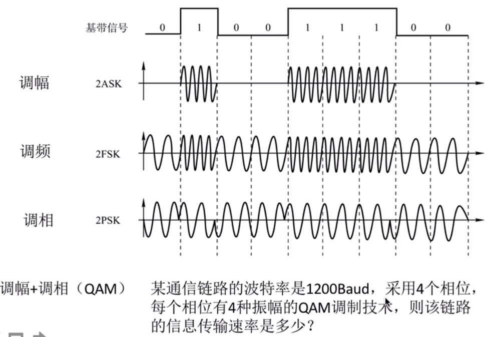

调幅（2ASK）：0无振幅，1有振幅

调频（2FSK）：0为低频，1为高频（频率由图像波形疏密体现）

调相（2PSK）：0、1分别对应正弦波和余弦波

调幅+调相（QAM）：

某链路波特率1200Baud，采用4个相位，每个相位有4种振幅的QAM调制技术，则该链路的信息传输速率=

$log2(4*4) * 1200 = 4800b/s$

#### 2.1.2.3	模拟数据编码为数字信号

模拟音频要交由计算机处理，需要通过**音频数字化**，处理为数字音频

如对音频信号编码的脉码调制(**PCM**)，能达到最高保真水平，其主要包括三步：抽样、量化、编码

1.**抽样**：对模拟信号周期性扫描，将时间上连续的信号变成时间上离散的信号

为了使所得离散信号能无失真地代表被抽样的模拟数据，要使用采样定理进行采样：$f_{采样频率}≥2f{信号最高频率}$

2.**量化**：将抽样所得电平幅值按一定分级标度，转化为对应数字值并取整，将连续的电平幅值转换为离散的数字量

3.**编码**：将量化结果转换为对应的二进制编码

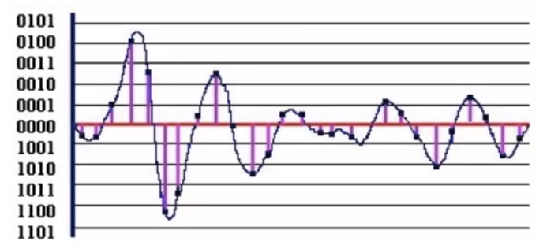

#### 2.1.2.4	模拟数据调制为模拟信号

为实现传输的有效性，可能需要使用较高的频率；或需要使用频分复用技术，充分利用带宽资源，在电话和本地交换机需要使用模拟信号传播模拟数据

#### 2.1.2.5	总结

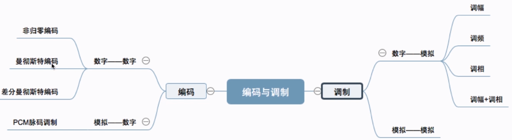

### 2.1.3	奈氏准则和香农定理

影响失真程度的因素：①码元传输速率 ②信号传输距离 ③噪声干扰 ④传输媒体质量

信道带宽：信道能通过的最高频率和最低频率之差

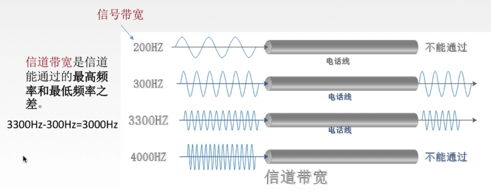

码间串扰：接收端收到的信号波形，失去了码元间清晰界限的现象

奈氏准则：在理想低通（无噪声、带宽受限）条件下，为避免码间串扰，极限码元传输速率为$2W Baud$，$W$是信道带宽，单位是Hz

理想低通信道下，极限数据传输率=$2Wlog_2V(b/s)$，$V$是几种码元/码元的离散电平数目

> 1.在任何信道中，码元传输速率是有上限的。若传输速率超过上限，就会出现码间串扰问题，接收端将无法完全证券识别码元
>
> 2.信道的频带越宽（能通过的信号高频分量越多），就能用更高的速率进行码元的有效传输
>
> 3.奈氏准则给出了码元传输速率的限制，但没有对信息传输速率给出限制
>
> 4.由于码元传输速率受奈氏准则制约，因此要提高数据传输速率，就要提高码元携带的信息量，即使用多元制的调制方法

在无噪声的情况下，若某链路带宽为3kHz，采用4个相位，每个相位有4种振幅的QAM调制技术，则该链路最大数据传输率 = $2*3*log_2(4*4)= 24 kb/s$

信噪比 = $\frac{信号平均功率}{噪声的平静功率}$，常记为$\frac{S}{N}$，用分贝($dB$)作为度量单位，即信噪比($dB$) = $10log_{10}{\frac{S}{N}}$

香农定理：在带宽受限且有噪声的信道中，为不产生误差，信息的数据传输速率有上限值。

信道的极限数据传输速率 = $W*log_2(1+\frac{S}{N}) (b/s)$

> 1.信道带宽或信道信噪比越大，则信息的极限传输速率越高
>
> 2.对一定传输带宽和一定的信噪比，信息传输速率的上限就确定了
>
> 3.只要信息的传输速率低于信道的极限传输速率，就一定能找到某种方法，实现无差错传输
>
> 4.香农定理得到的为极限信息传输速率，实际信道能达到的传输速率要低很多
>
> 5.从香农定理可知，若信道带宽$W$或信噪比$\frac{S}{N}$无上限，则信道的极限信息传输速率无上限

电话系统的典型参数是信道带宽为3000Hz，信噪比为30dB，则该系统最大信息传输速率为多少？

30dB = $10log_{10}{\frac{S}{N}}$，则$\frac{S}{N} = 1000$

信道极限数据传输速率 = $W*log_2(1+\frac{S}{N}) = 3000 * log_2{1+1000} ≈ 30kb/s$

|                           奈氏准则                           |                  香农定理                   |
| :----------------------------------------------------------: | :-----------------------------------------: |
| 带宽受限无噪声条件下，为避免码间串扰，码元传输速率上限2W Baud |      带宽受限有噪声条件下信息传输速率       |
|             理想低通信道极限数据传输率$2Wlog_2V$             | 信道极限数据传输速率$Wlog_2(1+\frac{S}{N})$ |
|        要提升数据率，就要提高带宽或使用更好的编码技术        |   要提高数据率，就要提高带宽或提高信噪比    |

> 二进制信号在信噪比为127:1的4kHz信道传输，最大数据率为多少？
>
> 奈氏准则：$2*4k*log_22 = 8kb/s$
>
> 香农定理：$4k*log_2{1+127} = 28kb/s$
>
> 两者取最小值，因此最大数据率为$8kb/s$

### 2.1.4	传输介质

传输介质，也称为传输媒体/传输媒介，是数据传输系统中，在发送设备和接收设备间的**物理通路**

**传输媒体并不是物理层**

传输介质根据可否导向分为两种：

- 导向性传输介质：电磁波被导向沿着固体媒介传播
- 非导向性传输介质：自由空间，介质可以是任何物质

#### 2.1.4.1	导向性传输介质

##### 2.1.4.1.1	双绞线

双绞线是最常用的传输介质，由两根绞合的铜导线组成。

> 绞合可以减少对相邻导线的电磁干扰。

为进一步提高抗电磁干扰能力，可在双绞线外加一层金属丝编织的屏蔽层，即**屏蔽双绞线(STP)**，无屏蔽层的双绞线称为**非屏蔽双绞线(UTP)**

双绞线价格便宜，通信距离几公里到几十公里。

当距离太远时，对于**模拟传输**，要用**放大器**放大衰减的信号；对于**数字传输**，要用**中继器**将失真信号整形

##### 2.1.4.1.2	同轴电缆

同轴电缆由**导体铜质芯线、绝缘层、网状编织屏蔽层和塑料外层**构成。按特性阻抗数值的不同，低阻值同轴电缆用于传送基带数字信号，称为**基带同轴电缆**，主要用于局域网；高阻值同轴电缆主要用于传送宽带信号，又称为**宽带同轴电缆**，主要用于有线电视系统

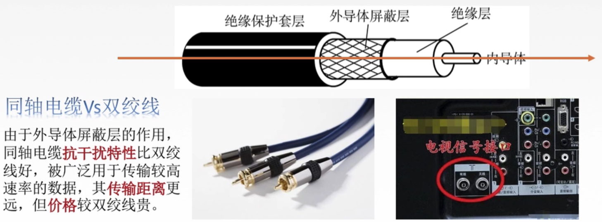

##### 2.1.4.1.3	同轴电缆和双绞线

由于外导体屏蔽层作用，同轴电缆抗干扰特性比双绞线好，可用于传输更高速率的数据，传输距离更远，但价格更高

##### 2.1.4.1.4	光纤

光纤的带宽**远远大于**其他传输媒体的带宽

光纤由**纤芯和包层**构成，采用**全反射**的原理传输光信号，损耗极低，因此可以传输很远距离

根据入射光线条数的多少，可将光纤分为多模光纤和单模光纤：

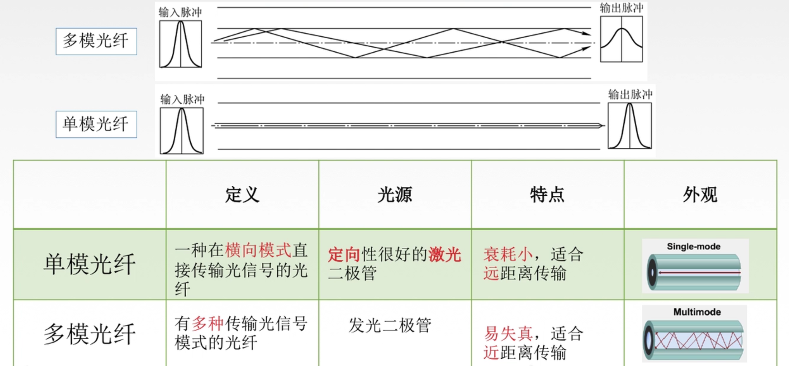

光纤特点：

①传输损耗小，中继距离长，远距离传输经济

②抗雷电和电磁干扰性能好

③无串音干扰，保密性好，不易被窃听或截取数据

④体积小，重量轻

#### 2.1.4.2	非导向性传输介质

非导向性传输介质主要有三种：

- **无线电波**：信号向所有方向传播，穿透力强，可传递远距离，广泛用于通信领域
- （了解）**微波**：信号沿固定方向传播，通信频率高、频段范围宽，因此数据率很高，常用于地面微波接力通信和卫星通信
- （了解）**红外线**、激光：信号沿固定方向传播，把要传输的信号分别转换为各自的信号格式，再在空间中传播

卫星通信的优点：①通信容量大 ②通信距离远 ③覆盖广 ④广播通信和多址通信

卫星通信的缺点：①传播时延长 ②受气候影响大 ③误码率高 ④成本高

### 2.1.5	物理层设备

#### 2.1.5.1	中继器

由于在传输过程中存在损耗，线路上的信号功率会逐渐衰减，衰减到一定程度时将造成信号失真，进而导致接收错误

中继器的功能：对**数字信号**进行**再生和还原**，放大衰减信号，保持与源数据相同，以增加信号传输距离，延长网络长度

中继器两端：两端的**网络部分是网段**，而不是子网，适用于**完全相同的两类网络**的互连，且两个网段速率必须相同

​					中继器只发送数据，作用于信号的电气部分，**不对数据内容进行检查**

​					中继器两端**传输媒体可以不相同**，但两端的**网段必须使用同一个协议**

​					中继器不能存储转发

**5-4-3规则**：网络标准中对信号的延迟范围作了具体规定，因此中继器只能在规定范围内进行，否则会网络故障

网段最多不超过5个，物理设备不超过4个，计算机不超过3个

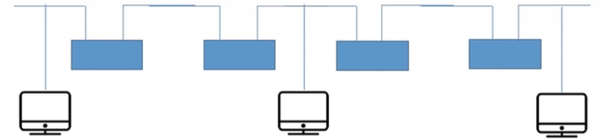

#### 2.1.5.2	集线器（多口中继器）

集线器同样对信号进行放大和转生，集线器不具备信号的定向传送能力，是一个共享式设备（广播通信）

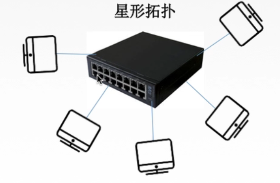

集线器不能分割冲突域，因此连接到集线器的主机将平分带宽

## 2.2	总结

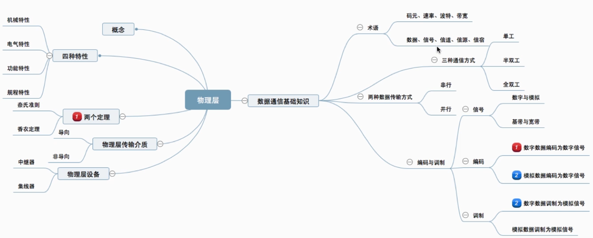

