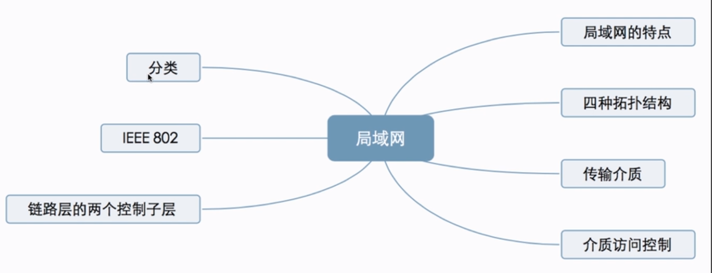
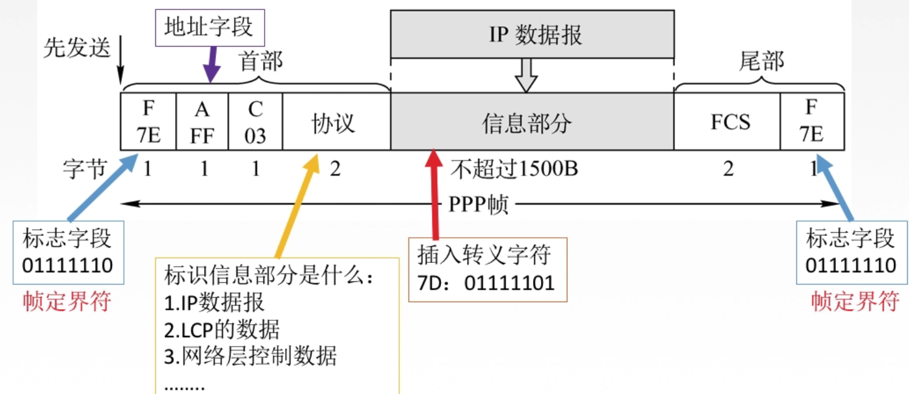
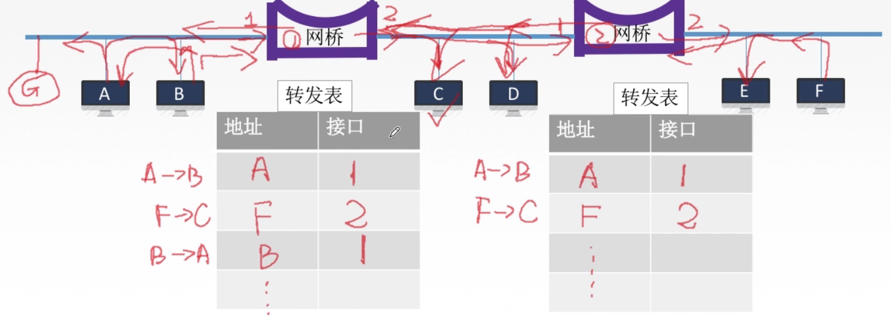

[TOC]

# 3.	数据链路层

## 3.1	概述

### 3.1.1	基本概念

**结点**：主机、路由器

**链路**：网络中两结点间的**物理通道**，传输介质主要有双绞线、光纤和微博，分为有线链路和无线链路

**数据链路**：网络中两结点间的**逻辑通道**，把数据传输协议的硬件和软件加到链路上就构成数据链路

**帧**：数据链路层的协议数据单元，封装网络层的数据报

数据链路层负责通过一条链路，从一个结点向另一个物理链路直接相连的相邻结点传送数据报

### 3.1.2	功能概述

数据链路层在物理层提供服务的基础上，**向网络层提供服务**。

最基本的服务是将网络层的数据可靠传输到相邻结点的目标主机网络层。

主要作用是**加强物理层传输原始比特流的功能**，将物理层提供的可能出错的物理连接改造成**逻辑上无差错的数据链路**，使之对网络层表现为一条无差错链路

数据链路层的功能：

- 为网络层提供服务：无确认无连接服务（可靠性最低，但速度快）、有确认无连接服务（适用于误码率较高的链路）、有确认面向连接服务（可靠性最高）

- 链路管理：即连接的建立、维持和释放
- 组帧
- 流量控制，用于限制发送方
- 差错控制：差错分为帧错和位错

## 3.2	封装成帧

**封装成帧**，就是在一段数据（网络层的IP数据报）前后添加帧首部和帧尾部，组成一个帧

帧的首部和尾部包含控制信息，作用是**帧定界**，即确定帧的界限

**帧同步**：**接收方**应当能从接收到的二进制比特流中，区分出帧的起始和终止

**组帧的方法**：①字符计数法 ②字符（节）填充法 ③零比特填充法 ④违规编码法

### 3.2.1	透明传输

透明传输指的是任何数据都应能在链路上传输而不受阻碍

当所传数据与某控制信息相同时，必须采取措施，使得接收方不将其认为是控制信息，才能保证数据的正常传输

#### 3.2.1.1	字符计数法

帧首部使用一个计数字段（第一个字节，8位）标明帧内字节数

由于较容易出现错误，因此很少使用

#### 3.2.1.2	字符填充法

SOH：帧首部的第一个字节

EOT：帧尾部的最后一个字节

通过使用SOH和EOT，标记了帧的首部和尾部

但当帧内数据部分出现了与SOH或EOT相同内容的数据，就要使用字符填充法，对原有数据进行转义：

#### 3.2.1.3	零比特填充法

与字符填充法类似，零比特填充法在帧首部和尾部使用相同的一个字节标记帧：

#### 3.2.1.4	违规编码法

 使用常规编码中不存在的编码格式，来定界帧的起始和终止

## 3.3	差错控制

传输中的差错都是由噪声引起的

### 3.3.1	差错的成因

全局性：由于线路本身的电气特性所产生的随机噪声（热噪声），是信道固有的，随机存在的

​			解决办法：提高信噪比，以此减少或避免干扰

局部性：外界原因造成的冲击噪声，是产生差错的主要原因

​			解决办法：使用编码技术解决

### 3.3.2	差错的分类

- 位错：即比特位出错，1变0,0变1
- 帧错：丢失、重复、失序

### 3.3.3	差错控制

为了防止错误帧在链路上一直传递，因此需要使用差错控制方法

此处差错控制主要针对位错（比特错）：

- 检错编码：奇偶校验码、循环冗余码CRC
- 纠错编码：海明码

#### 3.3.3.1	数据链路层与物理层编码的区别

物理层编码针对的是**单个比特**，解决传输过程中比特同步等问题，如曼彻斯特编码

数据链路层编码针对的是**一组比特**，通过冗余码实现一组二进制比特串在传输过程中差错的检验和纠正

> 冗余码：数据发送前，先按某种关系附加上一定的冗余位，构成一个符合某规则的码字再发送。当要发送的有效数据发生变化时，其冗余位码字与数据不匹配，从而检验到数据出现错误

#### 3.3.3.2	检错编码

##### 	3.3.3.2.1	奇偶校验码

奇偶校验码由$n-1$位信息元（有效数据）和$1$位校验元（校验码）组成

当校验码中含有奇数个1时，为奇校验码；当校验码中含有偶数个1时，为偶校验码

> 若一个字符的ASCII编码由低到高依次为1100101，采用奇校验，在下述收到的传输后字符中，哪种错误不能检测？
>
> A.11000011 B.11001010 C.11001100 D.11010011
>
> 由于D中有5个1，ABC中有4个1，因此选D
>
> 因为原始数据中有4个1，采用奇校验，为保证校验码中有奇数个1，在前面添一个1，校验码为11100101
>
> 当接收到数据中1的个数不是奇数时，就能检测到错误。而D中1的个数仍为奇数个，因此无法检测

奇偶校验码的特点：只能检查到奇数个比特错误，检错能力为50%

##### 3.3.3.2.2	CRC循环冗余码

**注意：二进制除法使用异或**

在数据链路层使用循环冗余校验CRC检测技术，可以认为做到了对帧的无差错接收，即接收到的帧均无差错

#### 3.3.3.3	纠错编码

##### 3.3.3.3.1	海明码

**海明码能发现双比特错，但只能纠正但比特错**

海明码工作流程：

- 确定校验码位数$r$
- 确定校验码和数据的位置
- 求出校验码的值
- 检错并纠错

###### 3.3.3.3.1.1	确定校验码位数$r$

海明不等式：$2^r ≥ k+r+1$，其中$r$为冗余信息位，$k$为信息位

> 如要发送的数据为101101，数据位数$k=6$，则满足海明不等式的$r_{min}=4$
>
> 即该数据的海明码应有$6+4=10$位，其中原数据6位，校验码4位

###### 3.3.3.3.1.2	确定校验码和数据位置

假设4位校验码分别为$P_1、P_2、P_3、P_4$，数据从左到右为$D_1、D_2...D_6$

只需将$P_n$放在$2^{n-1}$位置上，$D_n$依次将空位填满即可

###### 3.3.3.3.1.3	求校验码的值

要求$P_n$，则将$P_n$与所有数据位对应二进制中，第$n$位为1的$D$异或，令其结果为0

如求$P_1$，则寻找所有数据位对应二进制中，第1位为1的$D$，即$D_1、D_3、D_4、D_5$，将这五个值异或，令其结果为0，求得$P_1$

###### 3.3.3.3.1.4	检错并纠错

对各校验码进行校验，即求校验码的逆过程，$P_1、P_2、P_3、P_4$依次计算结果为1010，逆过来结果为0101，即十进制5，可知第5位出现位错

### 3.3.4	总结

## 3.4	流量控制和可靠传输机制

流量控制的目的：防止发送速度超过接受能力，造成传输出错，因此流量控制要限制发送方的发送速度

### 3.4.1	数据链路层和传输层的流量控制区别

数据链路层的流量控制是点对点的，即相邻结点间；而传输层的流量控制是端到端的，即发送方和接收方

数据链路层流量控制手段：当接收方收不下时不回复确认；

传输层的流量控制手段：接收端给发送端一个窗口公告，告知窗口情况

### 3.4.2	流量控制的方法

- 停止-等待协议：每发送完一个帧就停止发送，等待对方确认，收到确认后再发送下一个帧
  - 发送效率太低，可看作发送窗口和接收窗口大小都是1的滑动窗口协议

- 滑动窗口协议：
- 以后退N帧协议为例，发送方有一个长度大于1的发送窗口，接收方有一个长度为1的接收窗口
- 发送方将发送窗口中所有帧都发送给接收方，接收方接收到接收窗口中的帧时，会发送该帧的确认并后移接收窗口，当发送方收到该帧确认时，发送窗口后移；
- 若发送方在一段时间内没有收到确认，则将自动重传该帧，直到收到确认为止
  - 后退N帧协议：发送窗口大小>1，接收窗口大小=1
  - 选择重传协议：发送窗口大小>1，接收窗口大小=1

### 3.4.3	可靠传输、滑动窗口、流量控制

可靠传输：保证接收方完全准确接收到发送端发送的数据

流量控制：控制发送数据，使接收方有足够的缓冲空间来接收每个帧

滑动窗口的实现方案：

- 可靠传输：发送方自动重传没有收到确认的帧
- 流量控制：收不下的帧将不会被确认

### 3.4.4	总结

### 3.4.5	停止-等待协议

停止-等待协议目的：解决丢包问题，并实现流量控制

停止-等待协议应用情况：无差错情况和有差错情况

#### 3.4.5.1	无差错情况

#### 3.4.5.2	有差错情况

##### 3.4.5.2.1	数据帧丢失或帧出错

##### 3.4.5.2.2	确认帧(ACK)丢失

##### 3.4.5.2.3	确认帧(ACK)迟到

#### 3.4.5.3	停等协议性能分析

优点：实现简单

缺点：信道利用率低

##### 3.4.5.3.1	信道利用率

信道利用率，是发送方在一个发送周期$T$内，有效发送数据$L$所需时间占整个发送周期的比率

信道利用率 = $\frac{\frac{L}{C}}{T}$，$C$是发送方发送速率

信道吞吐率 = 信道利用率 * 发送方发送速率

> 一个信道的数据传输率为4kb/s，单向传播时延30ms，若使停等协议的信道最大利用率达到80%，则数据帧长度至少为多少？
>
> $80%  $$= $$ (L/4k)/[(L/4k)+2*30ms] $
>
> $L$ = $ 960bit$

#### 3.4.5.4	总结

### 3.4.6	后退N帧协议(GBN)

#### 3.4.6.1	滑动窗口机制

为解决停等协议存在的信道利用率过低的问题，引入滑动窗口机制

要使用滑动窗口机制，需要①增加序号范围，记录更多的帧 ②发送方需要缓存多个分组，用于帧重传

#### 3.4.6.2	后退N帧协议

发送窗口：发送方维持一组连续的、允许发送的帧的序号

接收窗口：接收方维持一组连续的、允许接受的帧的序号，在后退N帧协议中，接收窗口大小为1

##### 3.4.6.2.1	GBN发送方需要响应的事件

###### 3.4.6.2.1.1	上层调用

上层要发送数据时，发送方先检查发送窗口是否已满，若未满则产生一个帧并将其发送；若已满则将数据返回给上层，表示窗口已满，上层将等待一段时间后再发送（实际使用中，发送方可以缓存这些数据，等到发送窗口未满时再发送）

###### （重点）3.4.6.2.1.2	收到ACK

GBN协议采用**累计确认**的方式，对n号帧的确认表示接收方已**收到包括n号帧及之前的所有帧**

###### 3.4.6.2.1.3	超时

当出现超时时，发送方将重传所有已发送但未被确认的帧

##### 3.4.6.2.2	GBN接收方需要相应的事件

若**正确按序**接收到n号帧，接收方将发送n号帧的ACK，并将该帧数据部分交付上层

其余情况下都将丢弃帧，并为最近按需接收的帧重新发送ACK。

接收方无需缓存任何失序帧，只维护一个信息：expectedseqnum（下一个按序接收的帧序号）

> 当接收方收到帧01245，则接收方将返回2号帧ACK，并将expectedseqnum设为3
>
> 发送方在收到2号ACK后，将在超时时间后重传3-5号帧
>
> 

#### 3.4.6.3	滑动窗口长度

若采用$n$个比特对帧进行编号，则发送窗口尺寸$W_T$满足：$1≤W_T≤2^n-1$

因为若发送窗口尺寸过大，接收方将无法区分新帧和旧帧

#### 3.4.6.4	重点总结

1.累计确认：n号帧的ACK表示对n号帧及之前所有帧的确认

2.接收方只按序接收帧，否则丢弃

3.确认序列号最大、按序到达的帧

> 数据链路层使用后退N帧协议GBN，发送方发送了0~7的帧，当计时器超时时，发送方只收到0、2、3号帧的确认，则发送方需要重发的帧数是4帧
>
> GBN协议使用累积确认机制，即收到的ACK表示已收到该帧及之前的所有帧，收到3号ACK表示需要重传的帧为4~7号帧

#### 3.4.6.5	性能分析

优点：发送方可以连续发送数据帧，提高了信道利用率

缺点：重传时，必须将原来已经正确传送的数据帧重传，降低了传送效率

#### 3.4.6.6	总结

### 3.4.7	选择重传协议(SR)

#### 3.4.7.1	GBN协议的缺点

GBN协议使用累积确认机制，将导致帧的批量重传，造成原来正确传输的帧被重传，降低了传输效率

为了解决这个问题，设置单个确认，加大接收窗口，设置接收缓存，缓存乱序到达的帧，为此引入了确认重传协议SR

#### 3.4.7.2	选择重传机制

#### 3.4.7.3	响应机制

##### 3.4.7.3.1	SR发送方响应事件

###### 3.4.7.3.1.1	上层调用

从上层收到数据后，SR发送方检查下一个可用于该帧的序号，若序号位于发送窗口内，则发送数据帧；否则缓存数据或返回给上层

###### 3.4.7.3.1.2	收到ACK

若收到ACK，若该帧序号在窗口内，则发送方将对应帧标记为已接收；若该帧序号在窗口的下界（最左边第一个窗口对应序号），则窗口后移到具有最小序号的未确认帧处。若窗口移动了并且有序号在窗口内的未发送帧，则发送这些帧

###### 3.4.7.3.1.3	超时

每个帧都有自己的定时器，超时发生后将重传对应帧

##### 3.4.7.3.2	SR接收方响应事件

SR接收方将确认一个正确接受的帧，不论是否按序

失序的帧将被缓存，并返回一个该帧的确认帧，直到所有帧都被收到，此时才可以将一批帧按序交付上层，然后向后移动滑动窗口

若收到了窗口序号外（小于窗口下界的帧），将返回一个ACK；其他情况则忽略该帧

#### 3.4.7.4	滑动窗口长度

当滑动窗口长度过大时，接收方将无法区分新旧帧：

对于选择重传协议SR，发送窗口大小最好等于接收窗口，$W_{Tmax}=W_{Rmax}=2^{n-1}$

#### 3.4.7.5	重点总结

1.对数据帧逐个确认

2.发送方只需要重传错误帧

3.接收方可以缓存帧

4.窗口大小$W_{Tmax}=W_{Rmax}=2^{n-1}$

> 数据链路层使用选择重传协议SR，发送方发送了编号0~3的帧，现收到1号帧的确认，0、2号帧超时，则发送方需要重传的帧数为2
>
> 只需要重传超时的帧，即重传0、2号帧

#### 3.4.7.6	总结

## 3.5	介质访问控制

传输数据使用的链路有两种：

- 点对点链路：两相邻结点通过一个链路项链，没有第三者。（如两人打固定电话）
  - 应用：PPP协议，常用于广域网
- 广播式链路：所有主机共享通信介质（如对讲机）
  - 应用：早期的总线以太网、无线局域网，常用于局域网
  - 典型拓扑结构：总线型、星型（逻辑总线性）

### 3.5.1	介质访问控制(MAC)

介质访问控制的目的：通过一定措施，使得两对结点之间的通信不会相互干扰

介质访问控制(MAC，Multiple Access Control)：

- 静态划分信道，也称**信道划分介质访问控制**：
  - **频分多路复用FDM**(F - Frequency)
  - **时分多路复用TDM**(T - Time)
  - **波分多路复用WDM**(W - Wave)
  - **码分多路复用CDM**(C - Code)

- 动态分配信道：
  - **轮训访问介质访问控制**：
    - 轮询协议
    - **令牌传递协议**
  - **随机访问介质访问控制**：
    - ALOHA协议
    - **CSMA协议**
    - **CSMA/CD协议**
    - **CSMA/CA协议**

#### 3.5.1.1	信道划分介质访问控制

信道划分介质访问控制，是将使用介质的每个设备，与来自同信道上其它设备的**通信隔离**开，把**时域和频域资源合理分配**给网络上的设备

> 多路复用技术：将多个信号组合在一条物理信道上传输，是的多个计算机或终端设备**共享信道资源**，提高信道利用率
>
> 复用技术，就是将一条广播信道，在逻辑上分成几条用于两节点之间通信的、互不干扰的子信道，实际是**将广播信道转变为点对点信道**

##### 3.5.1.1.1	频分多路复用FDM

##### 3.5.1.1.2	时分多路复用TDM

时分多路复用TDM存在的问题：假设A暂时不需要发送数据，则此时一个TDM帧中，A仍占据时间片但不发送数据，这就造成了信道利用率的降低

为了解决这一问题，提出了统计时分复用STDM

##### 3.5.1.1.3	统计时分复用STDM

##### 3.5.1.1.4	波分多路复用WDM

实质是**光的频分多路复用**，非重点

##### 3.5.1.1.5	码分多路复用CDM

**码分多址(CDMA)**是码分复用的一种方式

1个比特分为多个码片/芯片，每个站点被指定一个唯一的m位芯片序列

**防冲突：当多个站点同时发送数据时，要将各站点的芯片序列相互正交（对应位相乘相加，结果除以m，若为0则不冲突）**

**合并：各路数据在信道中线性相加（对应位相加）**

**分离：合并的数据和源站规格化内积（对应位相乘相加，结果除以m）**

### 3.5.2	随机访问介质访问控制

#### 3.5.2.1	ALOHA协议(不听就说)

##### 3.5.2.1.1	纯ALOHA协议

纯ALOHA协议：不监听信道，不按时间槽发送，随机重发（想发就发）

纯ALOHA协议发送成功率仍然比较低，因此提出时隙ALOHA协议

##### 3.5.2.1.2	时隙ALOHA协议

时隙ALOHA协议：将时间分成若干个相同的时间片，所有用户在时间片开始时同步介入网络信道，若发送冲突，则必须等到下个时间片开始时刻再发送

##### 3.5.2.1.3	ALOHA协议的特点

1.纯ALOHA协议比时隙ALOHA协议吞吐量更低，效率更低

2.纯ALOHA协议想发就发，时隙ALOHA协议只有在时间片开始时刻才能发

#### 3.5.2.2	CSMA协议(先听再说)

CSMA，即载波监听多路访问协议（Carrier Sense Multiple Access)

CS：载波监听，每个站**在发送数据前**，先检测总线上有无其他计算机发送数据

MA：多点接入，表示许多计算机以多点接入的方式，连接在一个总线上

CSMA思想：发送帧之前，先监听信道

对监听结果：

- 信道空闲：发送完整帧：
  - 1-坚持CSMA
  - 非坚持CSMA
  - p-坚持CSMA
- 信道忙：推迟发送

##### 3.5.2.2.1	1-坚持CSMA

坚持，指监听信道忙之后的坚持

1-坚持CSMA思想：若一个主机要发送消息，那么它先监听信道：

- 若信道空闲，则直接传输，不必等待
- 若信道忙，则一直监听，直到空闲
- 如果发生冲突（一段时间内未收到回复），则等待一个随机长度时间再监听，重复以上过程

优点：只要媒体空闲，站点就马上发送，避免了媒体利用率损失

缺点：若有两个或两个以上的站点要发送数据，则冲突不可避免

##### 3.5.2.2.2	非坚持CSMA

非坚持指的是对监听信道忙时，不继续监听

非坚持CSMA思想：若一个主机要发送消息，那么它先监听信道：

- 若信道空闲，则直接传输，不必等待
- 若信道忙，则等待一个随机事件后再监听

优点：采用随机的重发延迟时间，减少冲突发生可能性

缺点：可能存在都在延迟等待监听的过程，使得媒体处于空闲状态，降低了媒体使用率

##### 3.5.2.2.3	p-坚持CSMA

p-坚持指的是对监听信道空闲的处理

p-坚持CSMA思想：若一个主机要发送消息，那么它先监听信道：

- 若信道空闲，则以p概率直接传输，不必等待；概率1-p等待到下个时间槽再传输
- 若信道忙，则等待一个随机时间后再监听

优点：既像非坚持算法减少了冲突，又像1-坚持算法减少媒体空闲时间

缺点：发生冲突后还是坚持发送完数据帧，造成资源浪费

为了减少资源浪费，及时发现冲突，提出了CSMA/CD协议

##### 3.5.2.2.4	三种CSMA对比

### 3.5.3	介质访问控制

介质访问控制（MAC）分为三类：

- 信道划分MAC：基于**多路复用**划分资源
  - 网络负载重时共享信道效率高且分配公平；网络负载低时共享信道效率低
  - 不冲突但效率较低
- 随机访问MAC：用户根据意愿，**随机**发送消息，发送消息时独占信道带宽
  - 网络负载重时产生冲突开销；网络负载低时共享信道效率高，单个节点独占信道带宽
  - 可能产生冲突但效率较高
- 轮询访问MAC/轮流/轮转访问MAC：效率高且不冲突，分为轮训协议和令牌传递协议

### 3.5.4	轮旋访问介质访问控制

#### 3.5.4.1	轮训协议（非重点）

主节点轮流询问各从属节点是否发送数据

轮询协议存在的问题：①轮询开销 ②等待延迟 ③单点故障

#### 3.5.4.2	令牌传递协议

令牌：特殊格式的MAC控制帧，不包含任何协议

令牌控制信道的使用，确保同一时刻只有一个结点独占信道，因此**令牌环网无碰撞**

各节点都可以在一定时间内获得发送数据的权利，不是无限制持有令牌

令牌传递协议的问题：①令牌开销 ②等待延迟 ③等待故障

令牌传递协议常用于令牌环网（物理星型拓扑、逻辑环形拓扑）

令牌传递协议常用于**负载较重、通信量较大**的网络

### 3.5.5	局域网

局域网使用**广播信道**，其决定要素为：**网络拓扑、传输介质和介质访问控制方法**

#### 3.5.5.1	网络拓扑

局域网中常使用总线型拓扑

#### 3.5.5.2	传输介质

按传输介质，局域网分为：

- 有线局域网：传输介质为双绞线、同轴电缆、光纤等
- 无线局域网：传输介质为电磁波

#### 3.5.5.3	局域网介质访问控制方法

1.CSMA/CD：常用于**总线型局域网**、树型网络

2.令牌总线：常用于**总线型局域网**、树型网络

​	将总线型或树型网络中各工作站，按一定顺序，如按接口地址大小，排列成一个逻辑环。只有令牌持有者才能控制总线，才有发送信息的权力

3.令牌环：用于**环形局域网**，如令牌环网

#### 3.5.5.4	局域网分类

局域网分为以太网、令牌环网、FDDI网(非重点)、ATM网(非重点)、无线局域网（**IEEE 802.11**标准）

以太网是应用最广泛的局域网，使用IEEE 802.3标准，逻辑拓扑总线型、物理拓扑为星型或扩展星型，使用CSMA/CD协议

令牌环网：物理拓扑星型，逻辑拓扑环形，已弃用

##### 3.5.5.4.1	IEEE 802标准

IEE 802标准是局域网、城域网技术标准，常用的802标准有：

- IEEE 802.3 以太网
- IEEE 802.5 令牌环网
- IEEE 802.8 光纤技术，FDDI网
- IEEE 802.11 无线局域网

##### 3.5.5.4.2	MAC子层和LLC子层

IEEE 802标准所描述的局域网参考模型对应OSI参考模型的数据链路层和网络层

将数据链路层划分为**逻辑链路层LLC子层**和**介质访问控制MAC子层**

LLC子层负责识别网络层协议，为网络层提供服务

MAC子层功能与物理层相关

#### 3.5.5.5	总结

### 3.5.6	以太网Ethernet

以太网是一种**基带总线局域网规范**，是现有局域网最常用通信协议标准，使用**CSMA/CD**（载波监听多路访问及冲突检测）技术

以太网的优势：

1. 造价低廉，使用简单
2. 应用广泛
3. 满足网络速率要求

两个以太网标准：

- DIX Ethernet V2：第一个以太网规约
- IEEE 802.3：第一个IEEE以太网标准

通常可以将802.3局域网认为是以太网

#### 3.5.6.1	以太网的服务

以太网只提供无连接、不可靠的服务

> 无连接：发送方和接收方没有握手
>
> 不可靠：不对发送方数据帧**编号**，接收方不向发送方**确认**，差错帧直接丢弃

因此，以太网只实现无差错接收，不实现可靠传输

#### 3.5.6.2	以太网传输介质和拓扑结构变化

#### 3.5.6.3	10BASE-T以太网

10BASE-T是传输**基带信号**的**双绞线**以太网，传输速率**10Mb/s**，双绞线一般指无屏蔽双绞线UTP

10BASE-T以太网，在**物理上采用星型拓扑**，**逻辑上采用总线型拓扑**，每段**双绞线最长100m**

使用**曼彻斯特编码**，**CSMA/CD**介质访问控制

#### 3.5.6.4	适配器和MAC地址

计算机与外界局域网的连接要通过**通信适配器**

在局域网中，设备使用网卡唯一硬件地址，或称物理地址，或MAC地址

**MAC是全球唯一的48位二进制地址**，**前24位表示厂家，后24位由厂家指定**，常使用6个16进制数表示

#### 3.5.6.5	以太网MAC帧

最常用的MAC帧是以太网V2格式：

类型字段指明当前帧对应协议

IP数据报长度为46~1500字节，46字节是为了保证满足CSMA/CD协议最小帧长为64字节，1500字节是最大传输单元MTU

FCS用于冗余数据校验CRC

以太网V2帧只有帧首部，而没有帧尾部

IEEE 802.3帧与以太网V2帧的区别：

- 第三个字段为长度/类型
- 当长度/类型字段值小于0x0600时，数据字段必须装入LLC子层

#### 3.5.6.6	高速以太网

高速以太网，指的是速度≥100Mb/s的以太网

常见的高速以太网：

- 100BASE-T以太网：在**双绞线**上，传送**100Mb/s基带信号**的**星型拓扑**以太网，使用IEEE 802.3的**CSMA/CD协议**，支持全双工和半双工。
- 吉比特以太网：在**光纤或双绞线**上，传送**1Gb/s**信号，支持全双工和半双工
- 10吉比特：在**光纤**上传送**10Gb/s**信号，**只支持全双工**

#### 3.5.6.7	总结

### 3.5.7	无线局域网WLAN

#### 3.5.7.1	IEEE 802.11

IEEE 802.11是无线局域网的通用标准

#### 3.5.7.2	802.11的MAC帧头格式

假设两设备$A、B$通过无线局域网通信，$A$首先发送信息到$AP_1$，$AP_1$将信息转发给$AP_2$，$AP_2$再将信息传递给$B$

则在MAC帧头中，

地址1，即接收端地址(RA，Receive Address)为$AP_2$的MAC地址；

地址2，即发送端地址(TA， Transport Address)为$AP_1$的MAC地址;

地址3，即目的主机地址(DA，Destination Address)为$B$的MAC地址;

地址4，即源地址(SA，Source Address)为$A$的MAC地址

以上介绍的是WDS帧头，还有其余三种帧如下：（BSSID是AP地址）

#### 3.5.7.3	无线局域网分类

##### 3.5.7.3.1	有固定基础设施的无线局域网

##### 3.5.7.3.2	无固定基础设施无线局域网的自组织网络

### 3.5.7	CSMA/CD协议（先听再说，边听边说）

CSMA/CD(Carrier Sense Multiple Access with Collision Detection，载波监听多点接入/碰撞检测)

CS：载波监听，每个站**在发送数据前和发送数据时**都会检测总线上有无计算机发送数据

MA：多点接入，表示许多计算机以多点接入方式连接在一根总线上（总线型网络）

CD：碰撞检测（冲突检测），**边发送边监听**（半双工网络）

> 为什么先听再发也不能完全避免冲突？
>
> 电磁波的传播速度是有限的

#### 3.5.7.1	传播时延对载波监听的影响

假设单程端到端传播时延为$τ$，当$t=0时$，A监听发现信道上没有信息，向B发送信息

当$t ＜ τ $时，B监听发现信道上没有信息，向A发送信息

此时信道上存在方向相反的两信息，假设在$t = τ - δ$时发生碰撞

当$t = τ$时，A发送的信息传递到B，B检测到碰撞，停止发送数据

当$t = 2τ - δ$时，B发送的信息传递到A，A检测到碰撞，停止发送数据

当$δ -> 0$时，A检测到碰撞的时间为$t = 2τ$

因此最迟$2τ$时间后可知是否发生碰撞，若超过$2τ$还没有检测到碰撞，则不会发生碰撞

$2τ$是总线的端到端往返传播时延，即两倍的总线的端到端传播时延，也称为争用期/冲突窗口/碰撞窗口

#### 3.5.7.2	确定碰撞后的重传时机

CSMA/CD协议使用**截断二进制指数规避算法**，确定碰撞后的重传时机：

1. 确定基本退避（推迟）时间为争用期$2τ$
2. 定义参数$k$，$k$等于重传次数但不超过10，即$k = min[重传次数，10]$。
3. 从离散的整数集合$[0,1,...,2^k-1]$中随机取出一个数$r$，重传所需退避时间就是$r$**倍的基本退避时间**，即$2rτ$
4. 当**重传16次仍不成功**时，说明网络过于拥挤，认为此帧永远无法正确发出，抛弃此帧并向上层报告出错

> 第一次重传，$k=1, r ∈[0,1]$，重传推迟时间为$0$或$2τ$
>
> 若再次碰撞，第二次重传，$k=2，r∈[0,1,2,3]$，重传推迟时间为$0$或$2τ$或$4τ$或$6τ$
>
> 若再次碰撞，第三次重传，$k=3，r∈[0,1,2,3,4,5,6,7]...$

#### 3.5.7.3	最小帧长

为避免在检测到碰撞时，由于帧过短导致帧已经发送完毕，无法停止发送的问题，提出了最小帧长

最小帧长应保证帧的传播时延不低于争用期，即两倍于信号在总线的传播时延

$最小帧长 = 总线传播时延 * 2 * 数据传输速率 = 2τ * 数据传输速率$

#### 3.5.7.4	总结

### 3.5.8	CSMA/CA协议（了解）

CSMA/CA(Carrier Sense Multiple Access with Collision Avoidance，载波监听多点接入/碰撞避免)

#### 3.5.8.1	CSMA/CA协议工作原理

#### 3.5.8.2	CSMA/CD与CSMA/CA对比

相同点：

- 都从属于CSMA思路，**先听再说**。即接入信道前先监听，发现空闲后才能接入
- 当发生冲突时，都会进行**有上限次数的重传**

不同点：

1. **传输介质不同**：CSMA/CD用于总线式以太网（有线），CSMA/CA用于无线局域网(无线)
2. **载波检测方式不同**：由于传输介质不同，两者检测方式也不同
3. **CSMA/CD检测冲突，CSMA/CA避免冲突**

### 3.5.9	广域网

广域网(WAN, Wide Area Network)，其**通信子网使用分组交换**技术，将不同地区的**局域网或计算机系统互连**，达到**资源共享**的目的，因特网是世界最大的广域网

#### 3.5.9.1	PPP协议

点对点协议PPP(Point-to-Point Protocol)是目前使用最广泛的数据链路层协议，拨号入网一般都使用PPP协议，**只支持全双工链路**

##### 3.5.9.1.1	PPP协议要求

**简单**：对于数据链路层的帧，无需纠错、无需序号、无需流量控制、无需可靠传输

**封装成帧**：帧定界符

**透明传输**：遇到与帧定界符相同比特组合的数据时，对异步线路使用字节填充，同步线路使用比特填充

**多种网络层协议**：封装的IP数据报可以采用多种协议

**多种类型链路**：串行/并行、同步/异步、电/光

**差错检测**：发现错误直接丢弃

**检测连接状态**：检查链路能否正常工作

**最大传送单元**：数据部分最大长度MTU

**网络层地址协商**：知道通信双方网络层地址

**数据压缩协商**

##### 3.5.9.1.2	PPP协议无需满足的要求

- 纠错
- 流量控制
- 序号
- 多点线路

##### 3.5.9.1.3	组成部分

1. 将IP数据报封装到串行链路（同步串行/异步串行）的方法
2. 链路控制协议LCP：建立并维护数据链路连接（**身份验证**）
3. 网络控制协议NCP：PPP支持多种网络层协议，不同网络层协议都要响应的NCP配置，为网络层协议建立和配置逻辑连接

##### 3.5.9.1.4	PPP协议帧格式

A为地址字段、C为控制字段，这两个字段都是保留字段

PPP协议帧格式以字节为单位，因此PPP协议是**面向字节**的

#### 3.5.9.2	HDLC协议

高级数据链路控制协议(HDLC, High-level Data Link Control)，是在同步网上传输数据、**面向比特**的数据链路层协议，由**ISO**提出，采用**全双工通信**

HDLC通过0比特插入法，实现透明传输

采用**CRC校验**，对信息帧进行**编号**

##### 3.5.9.2.1	HDLC的站

HDLC有三种站：

- 主站：（控制端），发送命令（包括数据信息）帧，接收响应帧，负责对整个链路的控制系统的初启、流程控制、差错检测或恢复等
- 从站：接收主站发来的命令帧，向主站发送响应帧，配合主站参与差错恢复等链路控制
- 复合站：既能发送，又能接受命令帧和响应帧，负责整个链路的控制

三种方式：

- 正常响应方式：从站在主站同意后才能发送数据
- 异步平衡方式：主从站位置平等
- 异步响应方式：从站不需获得主站同意也能发送数据

##### 3.5.9.2.2	HDLC帧格式

地址字段：

- 对于正常响应方式和异步响应方式，地址字段为从站地址
- 对于异步平衡方式，地址字段为目标站地址

控制字段如下图：

### 3.5.9.3	PPP协议和HDLC协议对比

##### 3.5.9.3.1	共同点

- 只支持全双工链路
- 透明传输
- 差错检测，但不纠正差错

##### 3.5.9.3.2	不同点

| PPP协议  | 面向字节 | 2B协议字段 | 无序号和确认机制 | 不可靠 |
| -------- | -------- | ---------- | ---------------- | ------ |
| HDLC协议 | 面向比特 | 无协议字段 | 有编号和确认机制 | 可靠   |

### 3.5.9.4	总结

### 3.5.10	链路层设备

在物理层，通过集线器连接多台设备，通过光纤扩展以太网范围

在同一冲突域内，同时只能有一台设备发送信息，因此在物理层扩展以太网，会造成冲突域扩大，从而导致通信效率降低

为了解决这一问题，我们需要在链路层扩展以太网

#### 3.5.10.1	链路层扩展以太网

链路层扩展以太网需要使用网桥和交换机

##### 3.5.10.1.1	网桥

**网桥**根据**MAC帧目的地址**对帧进行**转发和过滤**。

当网桥收到一个帧时，并不向所有接口转发此帧，而是先检查其目的MAC地址，再确定将该帧转发到哪个接口，或是将其丢弃（即过滤）

网桥的优点：

1. 过滤通信量，增大吞吐量
2. 扩大了物理范围
3. 提高了可靠性
4. 可互连不同物理层、不同MAC子层和不同速率的以太网

网桥分为两类：

- **透明网桥**：透明指的是以太网站点不知道所发送的帧将经过哪些网桥，是一种即插即用的**自学习**设备

- **源路由网桥**：发送帧时，将详细的最佳路由信息（路由最少/时间最短）放在帧首部
  - 源站以广播方式，向目的站发送一个**发现帧**

> 发现帧到达目的站后，再原路返回，其中记录了传递方案，源站将从其中选择最佳方案作为之后的传递路线

##### 3.5.10.1.2	多接口网桥-以太网交换机

以太网交换机，是一种有多个接口的网桥

以太网交换机能够独占传输媒体带宽

两种交换方式：

- 直通式交换机：检查完目的地址(6B)就直接转发
  - **延迟低**，可靠性低，无法支持不同速率的端口的交换
- 存储转发式交换机：将帧放入缓存，检查是否正确，正确转发错误丢弃
  - 延迟相对较高，**可靠性高，可以支持不同速率的端口交换**

##### 3.5.10.1.3	冲突域和广播域

冲突域：在同一冲突域内，各节点都能收到所有被发送的帧，即同一时间内，只能有一台设备发送信息的范围

广播域：网络中，能接收任一设备发出的广播帧的所有设备的集合，即若站点发出一个广播，所有能接收到这个信号的设备范围称为广播域

> 由于图中没有路由器，故不能分隔广播域，因此只有1个广播域
>
> 由于集线器不能分隔冲突域，因此同一集线器下所有主机共属一个冲突域；
>
> 而交互及可以分隔冲突域，因此交换机下每个主机独占一个冲突域，因此共有4个冲突域

#### 3.5.10.2	总结

## 3.6	总结

