[TOC]

# 4.	网络层

网络层主要任务是将**分组**从源端传到目的端，传输单位是**数据报**

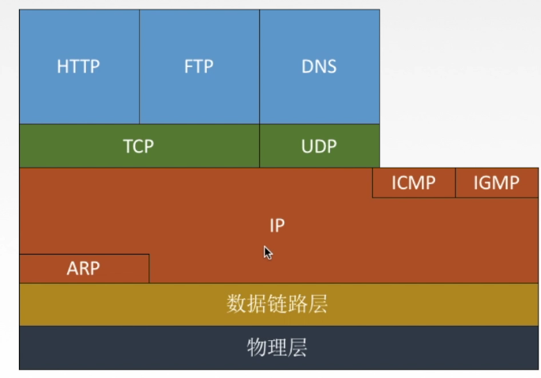

网络层的功能：

- **路由选择与分组转发（最佳路径）**
- **异构网络互联**
- **拥塞控制**：防止因结点来不及接收分组而丢弃大量分组
  - **开环控制：静态**
  - **闭环控制：动态**

## 4.1	数据交换方式

数据通过**数据交换**的方式，通过路由器，从源主机传送到目的主机

数据交换的目的：

- 减少链路数量
- 延长链路长度，实现远距离通信

数据交换方式：

- **电路交换**
- **报文交换**
- **分组交换**
  - **数据报方式**
  - **虚电路方式**

### 4.1.1	电路交换

电路交换的过程：建立连接、通信、释放连接

特点：独占资源

优点：①通信时延小 ②有序传输 ③无冲突 ④实时性强

缺点：①建立连接时间长 ②独占线路，使用效率低 ③灵活性差 ④无差错控制

### 4.1.2	报文交换

**报文**：源应用发送的信息整体

优点：①无需建立连接 ②存储转发，动态分配线路 ③线路可靠性高 ④线路利用率高 ⑤多目标服务

缺点：①有存储转发时延 ②报文大小不定，需要网络节点有较大的缓存空间

### 4.1.3	分组交换

分组：将大的数据块分割成小的数据块

优点：①无需建立连接 ②存储转发，动态分配线路 ③线路可靠性高 ④线路利用率高 ⑤相对于报文交换，更易于存储管理

缺点：①有存储转发时延 ②需要传输额外的信息量 ③乱序到达目的主机时，需要对分组排序重组

### 4.1.4	报文交换和分组交换传输时延比较

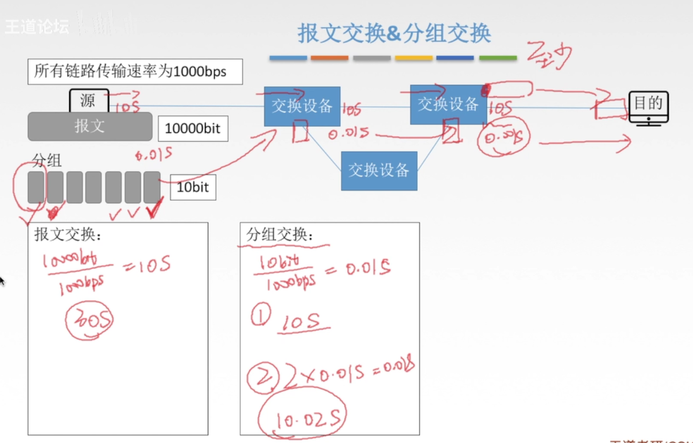

> 报文交换：报文交换需要将报文完整传递给交换设备，再由交换设备转发，因此总时延为：
>
> $3* \frac{10000bit}{1000bps} = 30s$
>
> 分组交换：分组交欢，源端发送第一个分组给交换设备，交换设备1在发送分组1时，源端可以继续发送分组2，因此总时延 = 总数据发送时延 + 交换设备数 * 单个分组发送时延：
>
> $\frac{10000bit}{1000bps} + 2 * \frac{10bit}{1000bps} = 10.02s$
>
> 可见分组交换时延要低于报文交换

### 4.1.5	三种数据交换方式比较

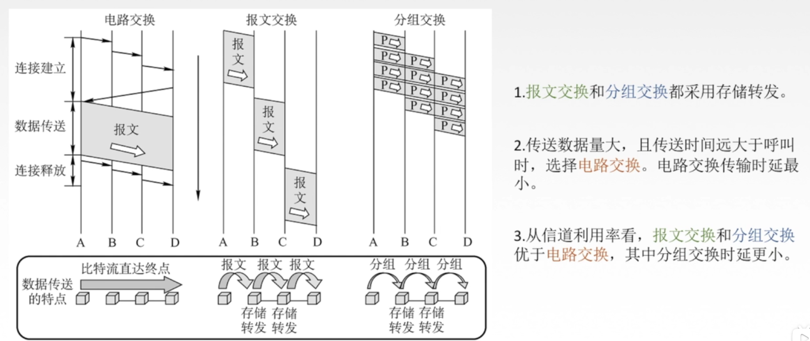

### 4.1.6	分组交换的两种方式

**数据报方式**：为网络层提供**无连接服务**

**虚电路方式**：为网络层提供**连接服务**

> 无连接服务：不事先为分组传输确定路径，每个分组单独确定传输路径，不同分组传输路径可能不同
>
> 连接服务：首先为分组传输确定路径（建立连接），再沿该路径传输系列分组，系列分组传输路径相同，传输结束后释放连接

#### 4.1.6.1	数据报

数据报特点：

- **无连接**
- **每个分组携带源地址和目的地址**
- **路由器根据分组目的地址转发分组**：基于路由协议/算法构建**转发表**，检索转发表，为每个分组独立选择路径

#### 4.1.6.2	虚电路

虚电路将数据报方式和电路交换方式结合

虚电路：一条源主机到目的主机的**逻辑连接**，路径上所有结点都要维持这条虚电路的建立，都维持一张虚电路表，每项记录一个打开的虚电路信息

虚电路方式通信过程：

- 建立连接：每个分组携带虚电路号，而非目的地址。源主机发送呼叫请求分组并收到呼叫应答分组才算建立连接
- 数据传输（全双工通信）
- 释放连接：虚电路发送释放请求分组以拆除虚电路

#### 4.1.6.3	数据报和虚电路对比

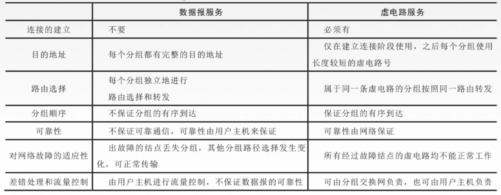

可靠性和差错处理了解即可

## 4.2	IP协议

### 4.2.1	IP数据报

#### 4.2.1.1	IP数据报的格式

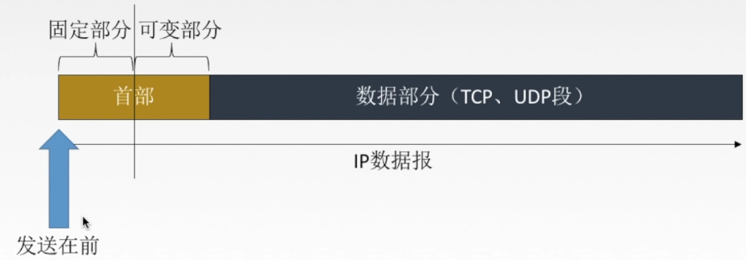

当IP数据报报文过大时，就需要对IP数据报进行分组，将一个IP数据报拆分为多个分组进行传输。

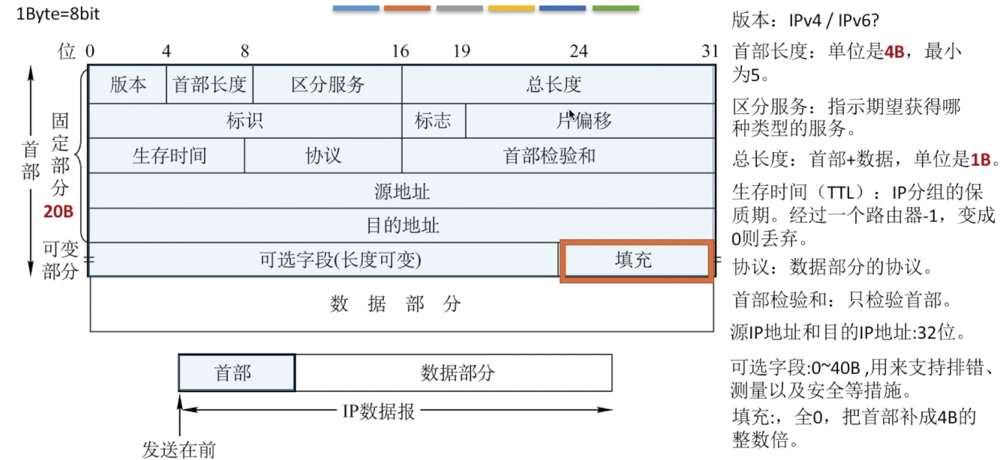

> 1.首部长度字段有4位，单位为**4B**，即表示首部长度 = 首部长度字段对应数值 * 4B
>
> 因为首部中固定部分长度为20B，因此首部长度字段最小值为5，即0101
>
> 2.总长度字段长度为16位，可表示的最大值为$2^{16}-1=65535$，但实际不会达到这么大，因为当报文过大时将进行分组。
>
> 3.**对于协议字段，TCP对应字段值为6，UDP对应字段值为17**

#### 4.2.1.2	最大传送单元MTU

最大传送单元MTU，是数据链路层数据帧可封装数据的上限。

**对以太网，MTU大小为1500字节。**

当要传送的数据超过了MTU大小，就要对数据报进行分片。

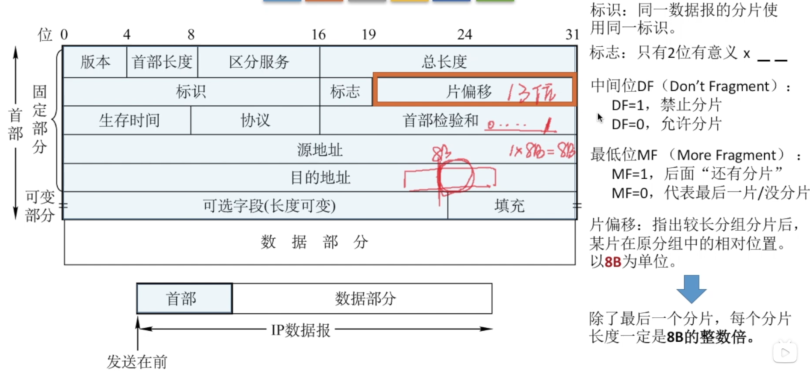

> 对于片偏移字段，其数值为分组中数据部分首字节在原数据中的位置，如下图，分组2片偏移 = $\frac{1400}{8} = 175$

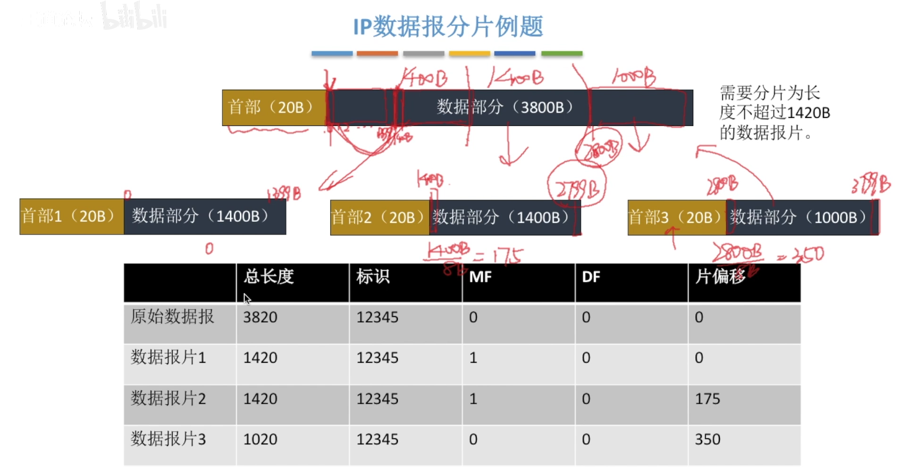

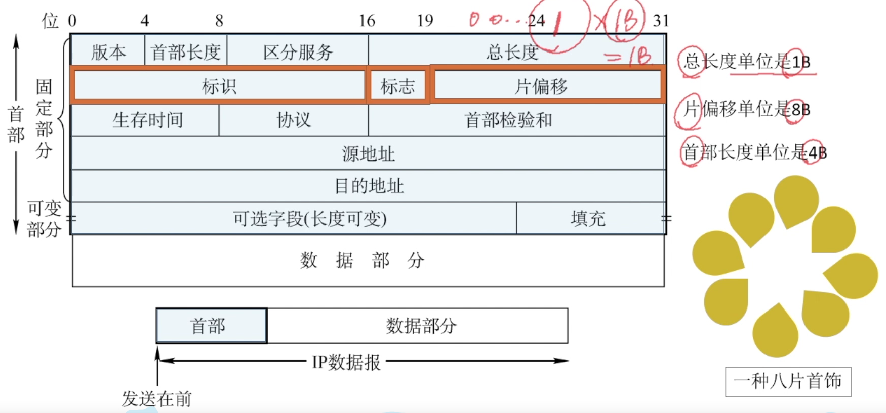

### 4.2.2	IPv4地址

IPv4地址：是全球唯一的**32位**(4字节)标识符，标识主机接口。

IP地址表示为：{<网络号><主机号>}

#### 4.2.2.1	IP地址分类

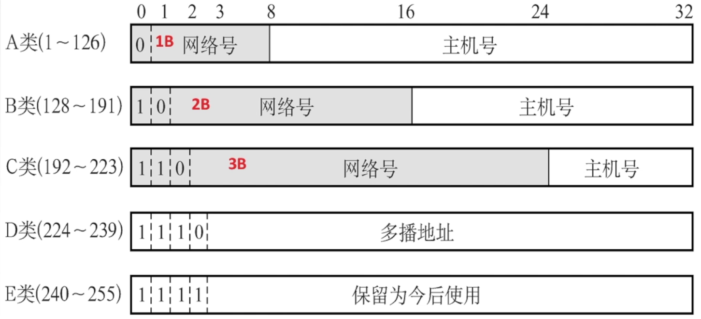

##### 4.2.2.1.1	特殊IP地址

##### 4.2.2.1.2	私有IP地址

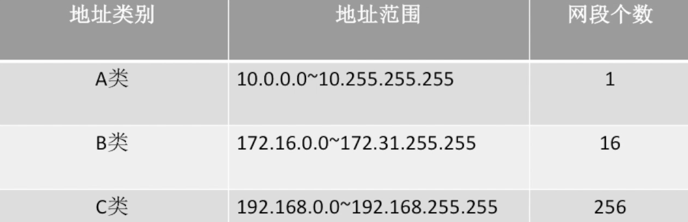

##### 4.2.2.1.3	分类的IP地址

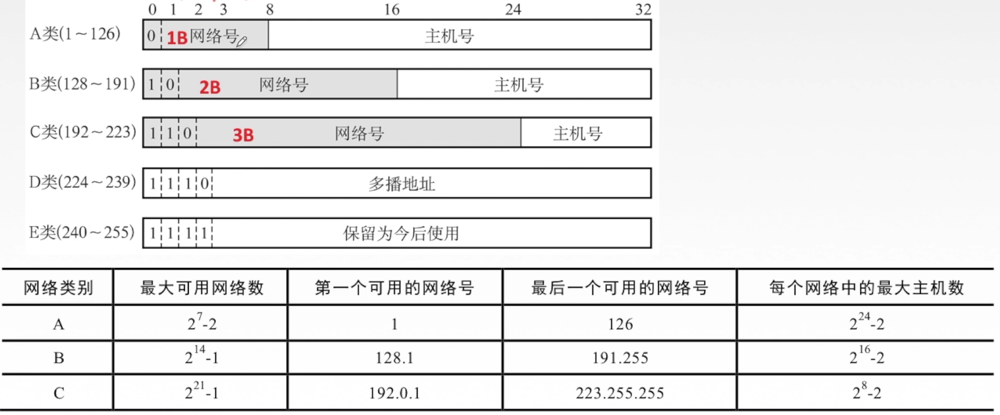

> 对A类地址，网络号不可用：0.0和127.0
>
> 对B类地址：网络号不可用：128.0
>
> 对C类地址：网络号不可用：192.0.0
>
> 对主机号，应排除**\*.0和\*.255**

#### 4.2.2.2	网络地址转换NAT

网络地址转换(NAT, Network Address Translation)：在专用网连接到因特网的路由器上安装NAT软件，安装了NAT软件的路由器叫**NAT路由器**，它**至少有一个有效的外部全球IP地址**

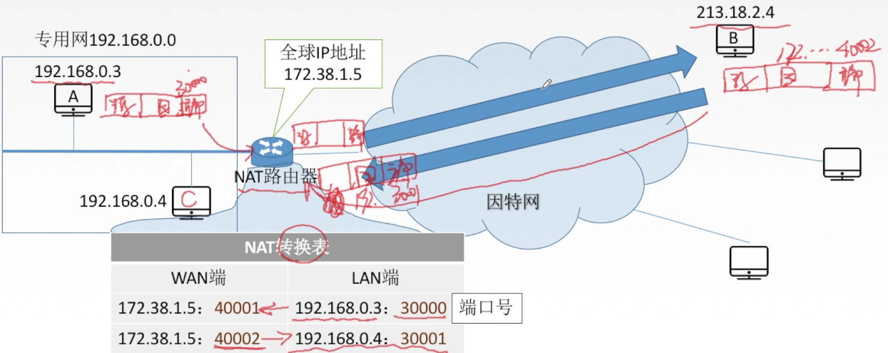

NAT路由器维护一张NAT转换表，通过端口号，实现专用网与因特网的IP转换

#### 4.2.2.3	子网划分

分类IP地址的缺点：

①IP地址空间利用率有时很低

②两级IP地址（网络号，主机号）不够灵活

为了提高IP地址利用率，提出了子网划分：

将两级IP地址（网络号，主机号）划分为三级IP地址（网络号，子网号，主机号）

> 内网划分子网后，对外仍表现为一个网络，即外网看不到内网的子网划分。

划分子网后，主机号长度至少要保留两位（主机号不能全0或全1）

##### 4.2.2.3.1	子网掩码

对二级IP地址，子网掩码为网络位全1，主机号全0

对三级IP地址，子网掩码为网络位、子网位全1，主机号全0

要求子网网络地址，只需将子网掩码与IP地址诸位相与。

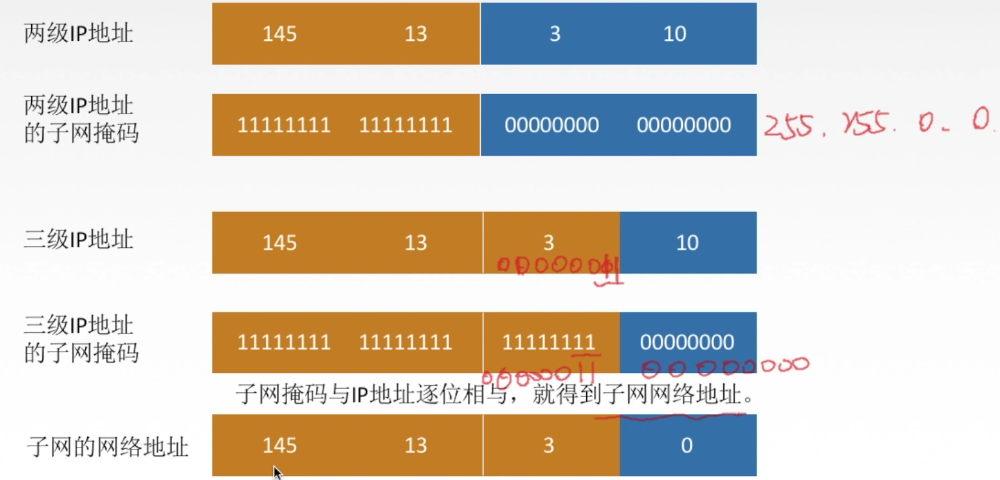

> 已知IP地址为141.14.72.24，子网掩码255.255.192.0，求网络地址
>
> 子网掩码前两段都为255，因此一定是网络位，无需将其化为二进制；最后一段为0，因此最后一段全是主机位，也无需计算，因此只需将第三段化为二进制：
>
> IP地址：$72=64+8$，因此72对应二进制为0100 1000
>
> 子网掩码：$192 = 128 + 64$，因此192对应二进制为1100 0000
>
> 逐位相与，所得结果为0100 0000，因此网络地址为141.14.64.0

> 某主机IP地址为180.80.77.55，子网掩码255.255.252.0.若该主机向其所在子网发送广播分组，则目的地址可以是()
>
> A.180.80.76.0    B.180.80.76.255    C.180.80.77.255    D.180.80.79.255
>
> 要发送广播分组，则主机位必定为全1，直接排除A项
>
> 子网掩码第三段：$252 = 255 - 3$，对应二进制 1111 1100
>
> 由于180网段属于B类网络，网络号占2B，即16位，因此该IP地址划分为16位网络号，6位子网号，10位主机号
>
> IP地址第三段：$77 = 64 + 8 + 4 + 1$，对应二进制0100 1101，去掉两位主机号，即0100 1100，对应十进制为76，可知主机所在子网为180.80.76.0
>
> 因此要发送广播信号，需要**主机位全为1**，对应目的地址为180.80.**79**.255

##### 4.2.2.3.2	使用子网时分组的转发

路由器维护一个路由表，用于转发分组。

路由表中每条子项包括：①目的网络地址 ②目的网络子网掩码 ③下一跳地址

路由器转发分组的算法：

①提取目标IP地址

②是否直接交付

③特定主机路由

④检测路由表中有无路径

⑤交由默认路由0.0.0.0

⑥丢弃，报告转发分组出错

#### 4.2.2.4	无分类编址CIDR

无分类编址CIDR，也称无分类域间路由选择。

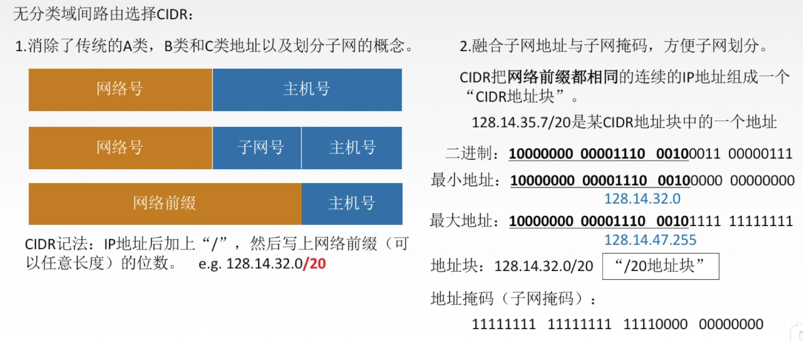

> 对于IP地址192.199.170.82/27，
>
> 可知其网络前缀为27位，主机号为5位，该网络下IP地址有$2^5=32$个
>
> 最小地址（主机号全0）：192.199.170.64/27
>
> 最大地址（主机号全1）：192.199.170.95/27

#### 4.2.2.5	构成超网

将多个方法聚合为一个较大的子网，叫做构成超网，或路由聚合。

构成超网使用的方法：缩短网络前缀

 

##### 4.2.2.5.1	最长前缀匹配

当使用CIDR时，查找路由表可能得到多个匹配结果，此时应选择具有最长网络前缀的路由。前缀越长，地址块越小，路由越具体。

> 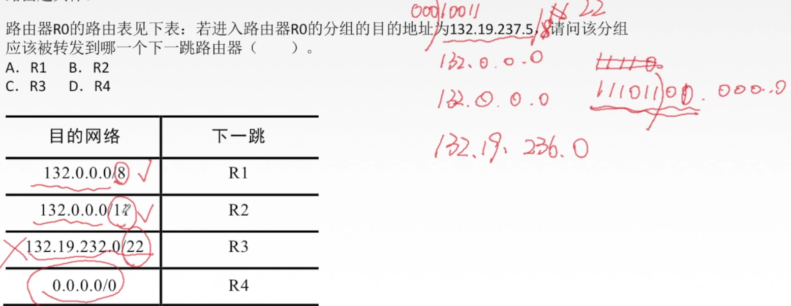
>
> 对路由表逐表项尝试匹配：
>
> 当网络前缀长度为8时，目的地址对应网络为132.0.0.0，与表项匹配
>
> 当网络前缀长度为11时，目的地址IP第二段$19 = 16 + 2 + 1$，对应二进制0001 0011，其中后五位为主机位，转换为网络地址时将其全填0，得到网络地址132.0.0.0，与表项匹配
>
> 当网络前缀长度为22时，目的地址IP第三段$237 = 255 - 16 - 2$，对应二进制1110 1101，其中后两位为主机位，对应网络地址132.19.236.0，与表项不匹配
>
> 综上，匹配长度最多的为R2，故选B

> 某网络IP地址空间为192.168.5.0/24，采用定长子网划分，子网掩码255.255.255.248，则该网络中最大子网个数、各子网中最大可分配地址个数分别为：
>
> 子网掩码最后一段$248 = 255 - 4 - 2 -1$，对应二进制1111 1000，故主机位为3位，去除全0和全1字段，最大可分配地址个数 = $2^3 -2 = 6$
>
> 192是C类网络，主机位为24位，故子网位$ = 32 - 24 - 3 = 5$位，最大子网个数 $ = 2^5 = 32$个

### 4.2.3	ARP协议

ARP协议：实现主机或路由器IP地址到MAC地址的映射（解决下一跳去哪的问题）

ARP协议使用过程：

①**检查ARP高速缓存**，有对应表项则写入MAC帧，没有则用目的MAC地址为FF-FF-FF-FF-FF-FF的帧封装并**广播ARP请求分组**，**同一局域网**中所有主机都能收到该请求

②目的主机收到请求后，向源主机**单播ARP响应分组**

③源主机收到后，将该映射**写入ARP高速缓存**

ARP协议典型情况：

1.主机A发给**本网络**上主机B：用ARP找到主机B的MAC地址

2.主机A发给**另一网络**上主机B：用ARP找到本网络上一个路由器（网关）的MAC地址

3.路由器发给**本网络**的主机A：用ARP找到主机A的MAC地址

4.路由器发给**另一网络**的主机B：用ARP找到本网络上一个路由器的MAC地址

> 发给本网络，需要用ARP获取主机地址
>
> 发给外网，需要用ARP获取路由器地址

> 主机发送IP数据报给主机B，经过5个路由器，请问此过程使用了几次ARP协议？
>
> 主机A发给路由器 1次
>
> 路由器发给下一个路由器（两路由器间发一次） 4次
>
> 路由器发给主机B 1次
>
> 综上 共$1+4+1=6$次

### 4.2.4	DHCP协议

主机获取IP地址的方法：

①静态配置IP地址：IP地址、子网掩码、默认网关

②动态配置IP地址

#### 4.2.4.1	DHCP协议

动态主机配置协议DHCP是**应用层协议**，**使用客户/服务器（C/S）方式**，通过广播方式进行交互，**基于UDP协议**

DHCP提供**即插即用**联网的机制，主机可以从服务器动态获取IP地址、子网掩码、默认网关、DNS服务器名称与IP地址，允许**地址重用**，支持**移动用户加入网络**，支持**在用地址续租**

DHCP工作流程：

①主机广播**DHCP发现**报文（主机试图寻找DHCP服务器，服务器获取一个IP地址）

②DHCP服务器广播**DHCP提供**报文（服务器拟分配IP地址及其相关配置）

③主机广播**DHCP请求**报文（主机向服务器请求提供IP地址）

④DHCP服务器广播**DHCP确认**报文（服务器正式将IP地址分配给主机）

### 4.2.5	ICMP协议

网际控制报文协议ICMP，是为了更有效地转发IP数据报和提高交付成功的机会

ICMP协议支持主机或路由器：

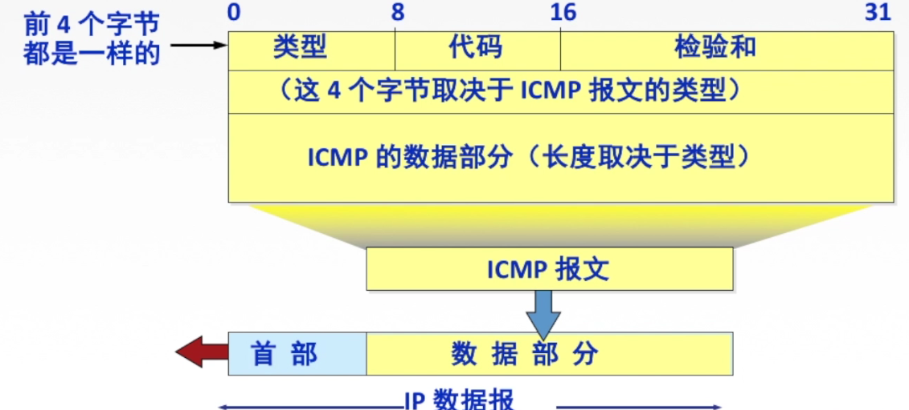

#### 4.2.5.1	ICMP差错报告报文

ICMP差错报告报文分为5种：

- 终点不可达：数据报无法交付时发送。（无法交付）
- 源点抑制：当由于拥塞而丢弃数据报时发送。（拥塞丢数据，已废弃）
- 时间超过：路由器收到TTL=0报文时发送，终点在规定时间内不能收到一个数据报全部数据报片时，丢弃全部已收到的数据报片并发送。（路由器TTL=0报文、终点超时未收齐）
- 参数问题：首部字段出现问题时发送（首部字段有问题）
- 改变路由（重定向）：有更好路由时发送（有更好路由）

ICMP差错报告报文数据字段：

#### 4.2.5.2	不发送ICMP差错报文的情况

1.不对ICMP差错报告报文，发送ICMP差错报告报文

2.不对第一个分片的数据报片的所有**后续数据表片**，发送ICMP差错报告报文

3.不对**组播地址**的数据报，发送ICMP差错报告报文

4.不对**特殊地址**(如127.0.0.0、0.0.0.0）的数据报，发送ICMP差错报告报文

#### 4.2.5.3	ICMP询问报文

1.回送请求和回答报文：测试目的站是否可达，以及了解其相关状态

2.时间戳请求和回答报文：用于时钟同步和测量时间

3.掩码地址请求和回答报文（已废弃）

4.路由器询问和通告报文（已废弃）

#### 4.2.5.4	ICMP应用

**PING**：测试两主机间连通性，使用**ICMP回送请求和回答报文**

**Traceroute**：跟踪一个分组从源点到终点路径，使用**ICMP时间超过差错报告报文**

> Traceroute命令工作流程：
>
> 源主机向第一个路由器发送一个TTL=1的数据报，当数据报到达第一个路由器时，TTL=0，因此路由器将向源主机发送ICMP时间超过差错报告报文，源主机收到并将其记录
>
> 接着，源主机向第二个路由器发送一个TTL=2的数据报，当数据报到达第二个路由器时，TTL=2，因此路由器将向源主机发送ICMP时间超过差错报告报文，源主机收到并将其记录
>
> 以此类推，直到数据报能传递到目的主机。

### 4.2.6	IPv6

#### 4.2.6.1	IPv6提出的原因

①32位IPv4地址即将耗尽

②改进首部格式，实现快速处理和转发数据报

③支持QoS

#### 4.2.6.2	IPv6数据报格式

扩展首部用于IPv6扩展格式

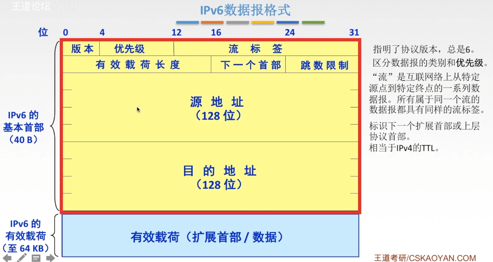

#### 4.2.6.3	IPv4与IPv6对比

①IPv4地址为32位(4B)，IPv6地址为**128位(16B)**

②IPv6**移除了IPv4的校验和字段**，以减少每跳处理时间

③IPv6将IPv4的可选字段移出首部，变成了**扩展首部**，提高了路由器处理效率

④**IPv6支持即插即用**(自动配置)，不需要DHCP协议

⑤**IPv6首部长度必须为8B的整数倍，IPv4首部是4B的整数倍**

⑥**IPv6只能在主机处分片**，IPv4可以在路由器和主机处分片

#### 4.2.6.4	IPv6地址表示形式

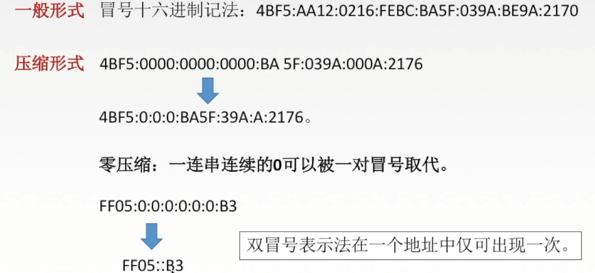

#### 4.2.6.5	IPv6基本地址类型

- 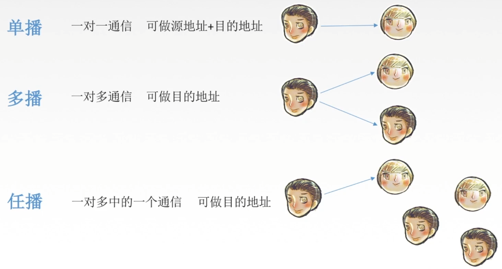

#### 4.2.6.6	IPv4向IPv6过渡

IPv4向IPv6的策略：

- 双栈协议：一台设备上**同时启用IPv4协议栈和IPv6协议栈**，对一台计算机，它将同时拥有IPv4地址和IPv6地址
- 隧道技术：通过隧道协议，将其他协议数据帧或包**重新封装**再发送

#### 4.2.6.7	总结

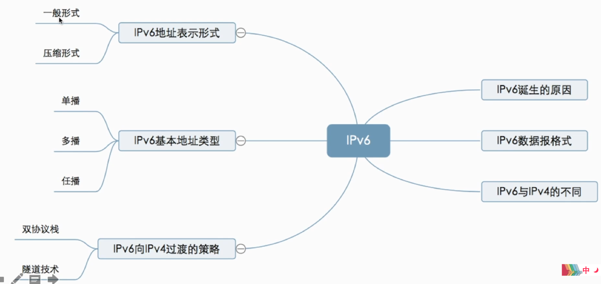

## 4.3	路由算法与路由协议

### 4.3.1	路由算法

 路由算法的分类：

- 静态路由算法（非自适应路由算法）：由管理员手工配置路由信息

  - 简单可靠，在负荷稳定、拓扑变化不大的网络中运行效果好，常用于军事网络和小型商业网络
  - 路由更新慢，不适用于大型网络

- 动态路由算法（自适应路由算法）：路由器间彼此交换信息，根据路由算法优化出路由表项

  - 路由更新快，适用于大型网络，及时响应链路费用或网络拓扑变化
  - 算法复杂，增加了网络负担

  

动态路由算法分类：

- 全局性：链路状态路由算法OSPF
  - 所有路由器掌握完整网络拓扑和链路费用信息
- 分散性：距离向量路由算法RIP
  - 路由器只掌握物理相连的邻居及链路费用

### 4.3.2	分层次的路由选择协议

自治系统AS：在单一技术管理下的一组路由器，一个AS内所有网络都属于一个行政单位灌下，一个自治系统的所有路由器在本自治系统中必须连同

路由选择协议：

- 内部网关协议IGP：同一自治系统使用，如RIP、OSPF
- 外部网关协议EGP：自治系统间使用，如BGP

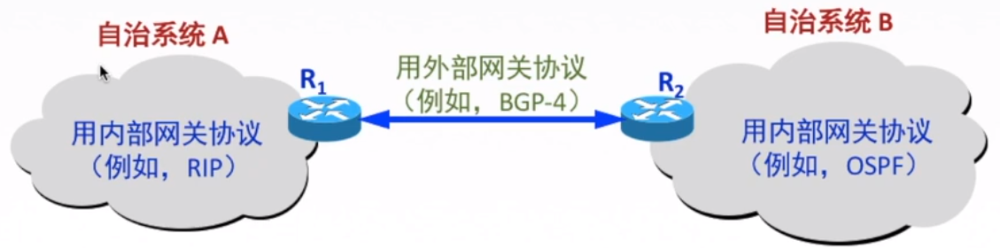

### 4.3.3	内部网关协议IGP

#### 4.3.3.1	RIP协议

RIP协议是**基于距离向量**的路由选择协议，最大优点是**简单**

RIP协议要求网络中每个路由器都维护**从它自己，到其他各目的网络的唯一最佳距离纪录**（即一组距离）

距离：通常为跳数，直接交付距离为1，RIP规定**最大距离为15，距离16表示网络不可达**

> RIP只适用于小型网络

RIP协议的特点：

①仅与**相邻路由器**交换信息

②交换的信息是**自己的路由表**

③**每30秒交换一次路由信息**，**超过180秒未收到邻居路由器通告，则认为链路不通**(即不可达，将距离设为16)并更新路由表

④经过若干次更新后，所有路由器最终都知道到达本自治系统任何一个网络的最短距离和下一跳路由器地址，即**收敛**

##### 4.3.3.1.1	距离向量算法

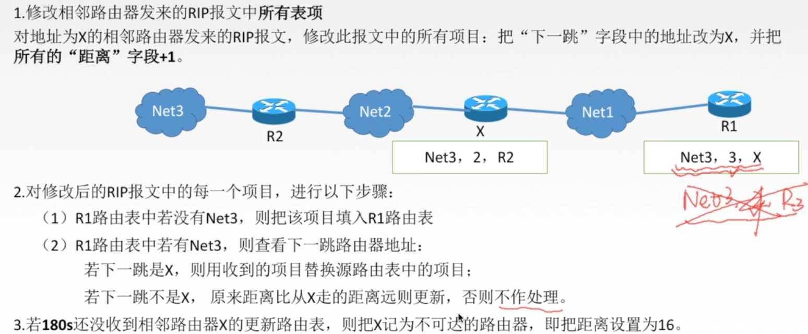

> 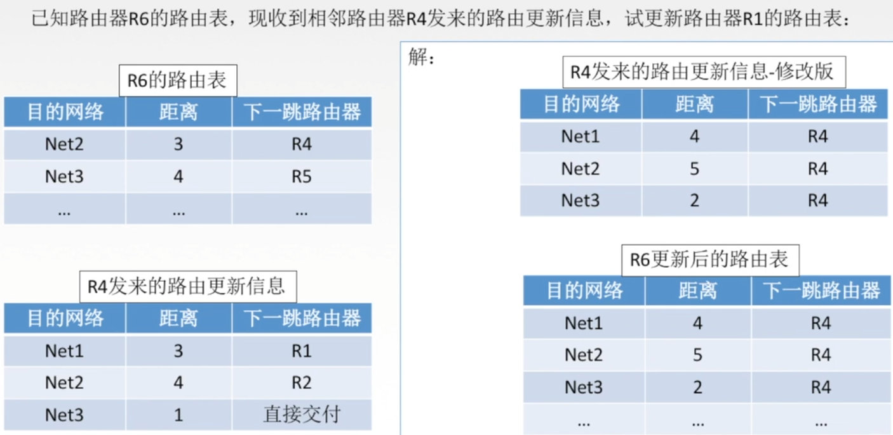

> 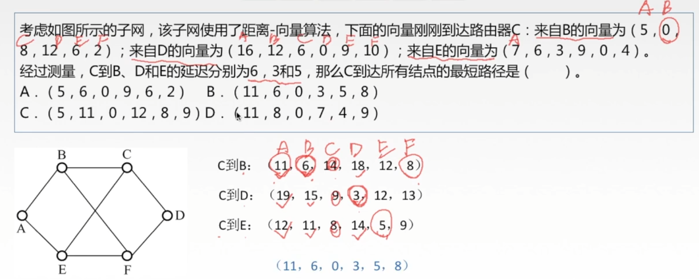

#####   4.3.2.1.2	RIP协议报文

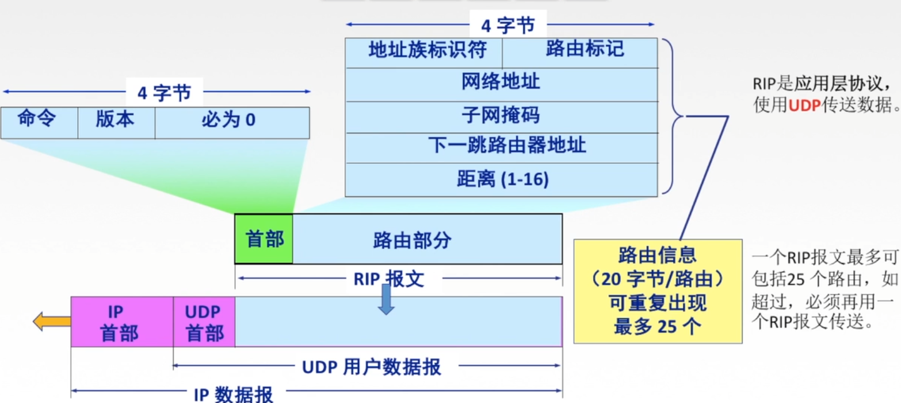

只需要注意：

①**RIP是应用层协议**，通过将RIP报文封装在**UDP**数据报中传递数据

②一个RIP报文最多携带25个路由表项

##### 4.3.2.1.3	RIP协议特点

RIP协议特点：**当网络出现故障时**，要较长时间才能将信息传递到所有路由器，即**收敛速度慢**

（好消息传得快，坏消息传得慢）

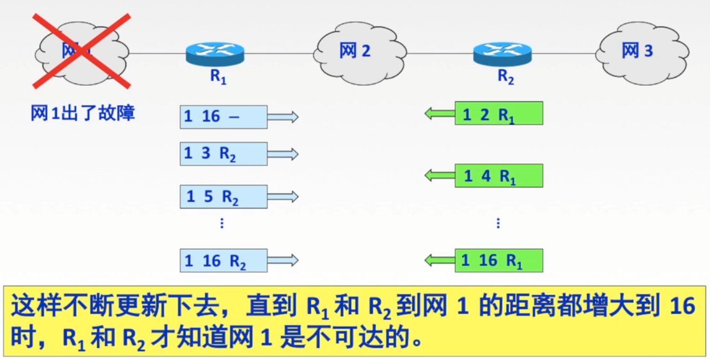

##### 4.3.2.1.4	总结

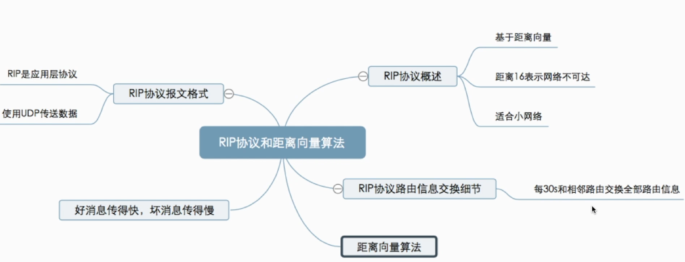

#### 4.3.3.2	OSPF协议

开放最短路径优先OSPF协议：使用了Dijkstra的最短路径算法SPF得名

OSPF最主要特征是使用分布式**链路状态协议**

OSPF协议特点：

①通过广播，向**所有路由器**发送信息

②发送的信息是与本路由器**相邻所有路由器的链路状态**（与哪些路由器相邻，链路度量/代价）

③只有当**链路状态发生变化**时，才广播发送此信息

④最终，所有路由器都能建立一个**链路状态数据库**，即**全网拓扑图**

##### 4.3.3.2.1	链路状态路由算法

1.各路由器通过【HELLO问候分组】发现邻居节点，并了解邻居节点的网络地址（每10s发送一次）

2.设置到其邻居的成本度量metric

3.构造【DD数据库描述分组】，向邻居给出自己的链路状态数据库中，所有链路状态项目的摘要信息

4.若DD分组中摘要自己都有，则邻居不做处理；若有没有或是更新的，则发送【LSR链路状态请求分组】，请求该信息

5.收到邻居的LSR分组后，发送【LSU链路状态更新分组】进行更新

6.更新完成后，邻居返回【LSAck链路状态确认分组】进行确认

7.使用Dijkstra算法，根据自己的链路状态数据库，构造到其他节点间最短路径

##### 4.3.3.2.2	OSPF的区域

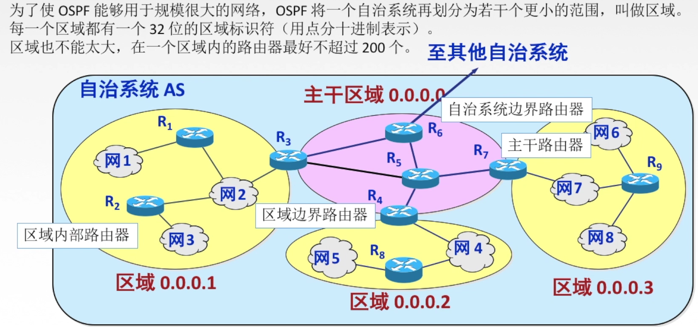

##### 4.3.3.2.3	OSPF分组

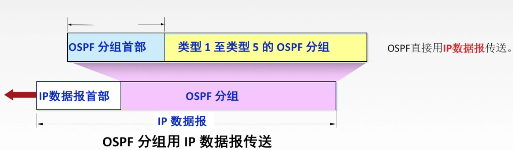

##### 4.3.3.2.4	OSPF其他特点

1.每隔30min，刷新一次数据库中链路状态

2.由于路由器的链路状态只设计与其相邻的路由器连通状态，因此与整个互联网规模没有直接关系。

因此**当互联网规模很大时**，OSPF协议比距离向量协议RIP协议好得多。

3.OSPF**收敛速度快**

### 4.3.4	外部网关协议BGP

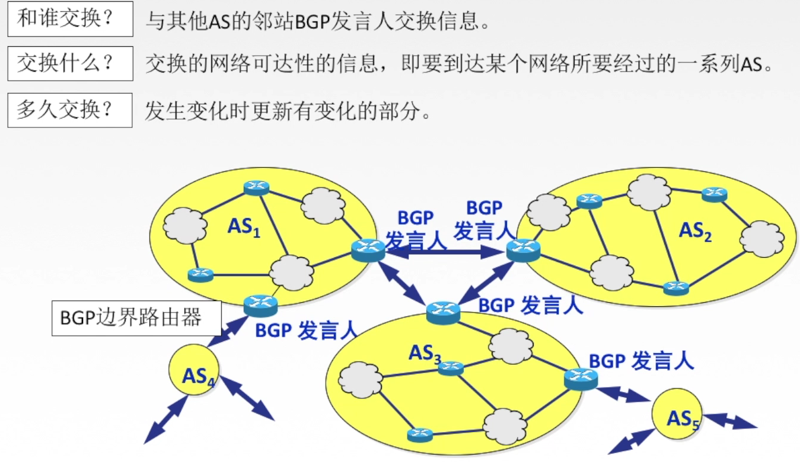

#### 4.3.4.1	BGP协议交换信息的过程

BGP交换的信息，就是**到达某个网络所要经过的一系列AS**，即**BGP交换的信息是一组完整的路径**

BGP发言人会在互相交换网络可达性信息后，找到到达各AS的较好路由

#### 4.3.4.2	BGP协议报文

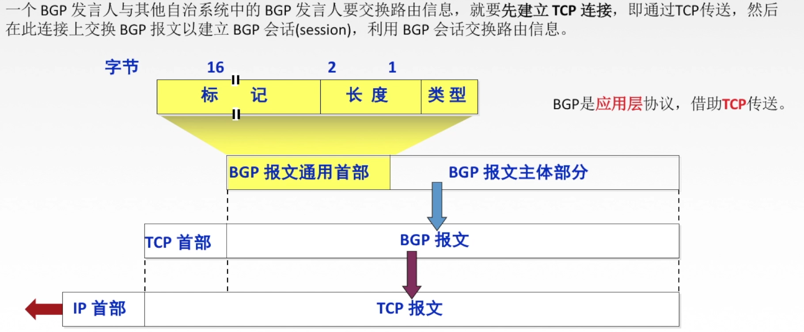

#### 4.3.4.3	BGP协议特点

①BGP**支持CIDR**

②BGP刚运行时，要与邻居交换整个路由表，之后**只需要在发生变化时更新变化部分**即可

#### 4.3.4.4	BGP-4四种报文

1.**OPEN（打开）报文**：打开与相邻另一BGP发言人建立关系，认证发送方

2.**UPDATE（更新）报文**：通告新路径或撤销原路径

3.**KEEPALIVE（保活）报文**：在没有UPDATE时，周期性确认邻站连通性，也作为OPEN的确认

4.**NOTIFICATION（通知）报文**：报告先前报文差错，也用于关闭连接

### 4.3.5	三种路由协议的比较

RIP是**基于距离向量**的**内部网关**路由选择协议，通过广播**UDP**报文，交换路由信息

OSPF是一个**内部网关**路由选择协议，因要交换信息量较大，因此不使用传输层协议，而是直接**使用IP协议**

BGP是**外部网关协议**，在不同自治系统间交换路由信息，因网络环境复杂，为保证可靠传输，因此**使用TCP协议**

## 4.4	IP组播

### 4.4.1	IP数据报的三种传输方式

IP数据报传输方式分为：

- 单播：点对点
- 广播：点对多点，发送到所有设备
- 组播（多播）：点对多点，发送到某指定网络

#### 4.4.2	组播的优点

组播提高了数据传送效率，减少主干网拥塞可能性。

若有**组播路由器**的支持，则组播可以发送到多个物理网络下。

### 4.4.3	IP组播地址

IP组播地址，让源地址能将分组发给一组设备。属于多播组的设备，将被分配**一个组播组IP地址（一群共同需求主机的相同标识）**。

组播地址范围为224.0.0.0~239.255.255.255(D类地址)，一个D类地址表示一个组播组。**组播地址只能用作分组的目标地址，而源地址总是单播地址。**

组播特点：

①最大努力交付，不提供可靠交付，应用于UDP

②对组播数据报，不产生ICMP差错报文

③并非所有D类地址都可以作为组播地址

### 4.4.4	硬件组播

类似于单播地址，组播IP地址也需要相应的组播MAC地址，在本地网络中实际传送帧。

组播MAC地址以十六进制值**01-00-5E**开始，余下6个十六进制位，第一位是0，剩下23位根据IP组播组地址的最后23位转换得到：

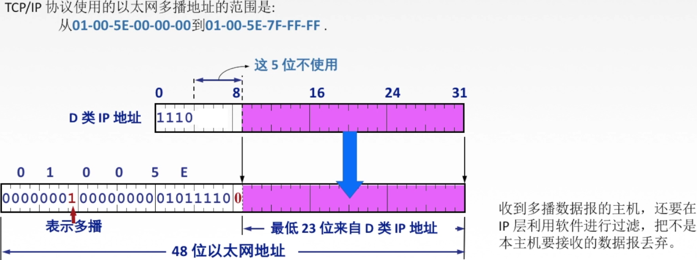

### 4.4.5	IGMP与组播路由选择协议

IGMP协议：让路由器知道，本局域网上**是否有主机参加活动退出某个组播组**

IGMP工作流程：

①主机要加入组播组时，向组播组的组播地址发送IGMP报文，声明要成为该组成员

本地组播路由器收到报文后，利用组播路由选择协议，将该组成员关系发到因特网上其他组播路由器

②本地组播路由器周期性探寻本地主机， 以了解这些主机是否还是组播组成员

只要有主机对某个组响应，组播路由器就认为该组是活跃的；若几次探寻都没有主机响应，组播路由器就认为该网络上没有该组播组的主机，因此不再将该组成员关系发给其他组播路由器。

> 组播路由器只能知道所连局域网中**有无**组播组成员

### 4.4.6	组播路由选择协议

组播路由选择协议目的是找出以源主机为根结点的**组播转发树**

不同多播组对应不同多播转发树，同一多播组，对不同源点也有不同多播转发树

组播路由选择协议使用三种算法：

- 基于链路状态的路由选择
- 基于距离向量的路由选择
- 协议无关的组播（稀疏/密集）

### 4.4.7	总结

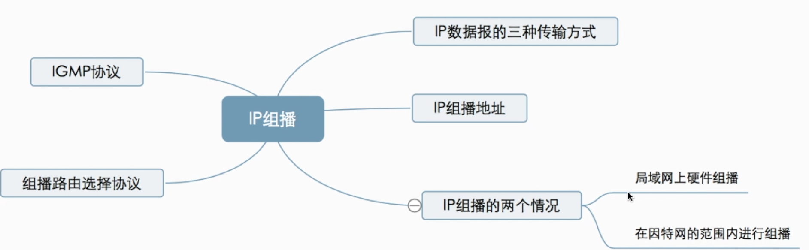

## 4.5	移动IP

移动IP技术是移动结点以**固定的IP地址**，实现跨越不同网段的**漫游**功能，保证了基于IP的网络权限在漫游过程中不发生改变

移动结点：具有永久IP地址的移动设备

归属代理（本地代理）：一个移动结点拥有的居所称为**归属网络**，在归属网络中代表移动结点执行移动管理功能的实体叫做归属代理

外部代理（外地代理）：在**外部网络**中，帮助移动结点完成移动管理功能的实体叫外部代理

永久地址（归属地址/主地址）：移动站点在归属网络中的原始地址

转交地址（辅地址）：移动站点在外部网络使用的临时地址

### 4.5.1	移动IP通信过程

 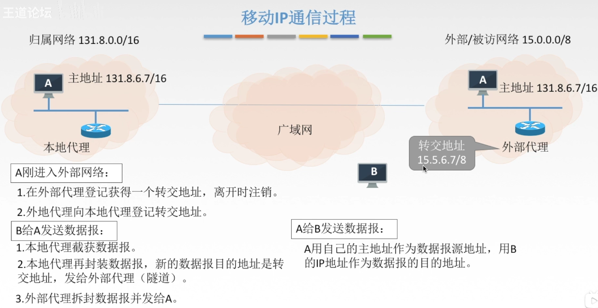

## 4.6	网络层设备

### 4.6.1	路由器

路由器的任务是**路由选择和分组转发**

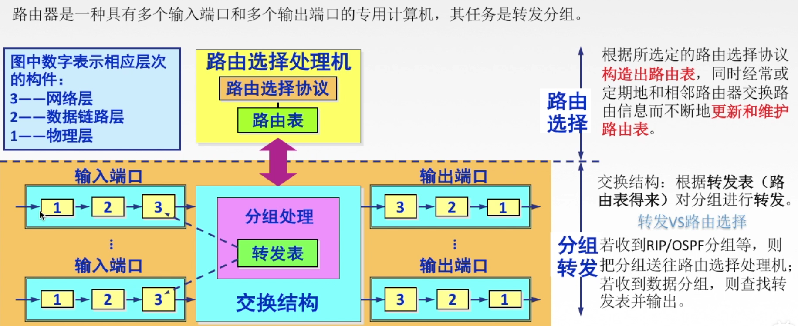

> 转发指的是路由器决定将分组从哪个端口发出
>
> 路由选择指的是路由器决定将分组发送到哪个路由器

**路由器的输入或输出队列移除是造成分组丢失的重要原因**

### 4.6.2	物理层、数据链路层、网络层设备区别

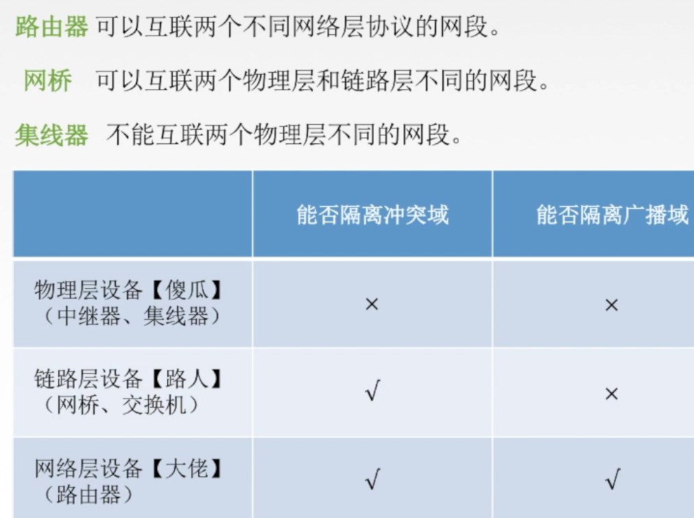

### 4.6.3	路由表与路由转发

路由表是根据**路由选择算法**得出，主要用途是**路由选择**，由软件实现

转发表由**路由表**得来，软硬件实现皆可。

转发表包含完成转发功能必需的信息，每一行包含目的网络、输出端口和某些MAC地址信息的映射

