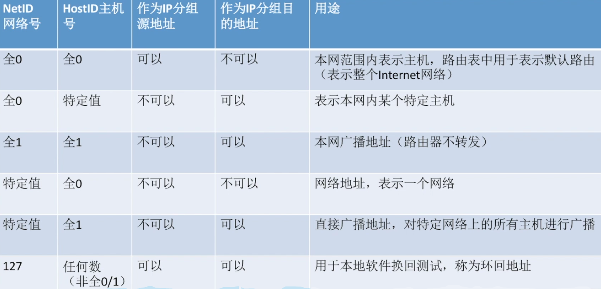
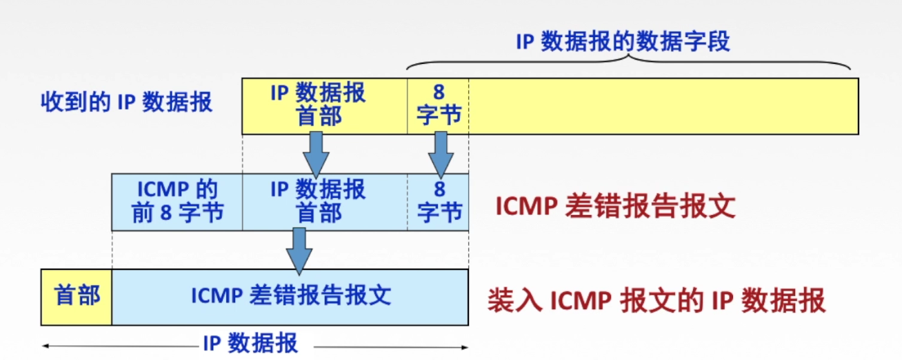

# 4.	网络层

网络层主要任务是将**分组**从源端传到目的端，传输单位是**数据报**

网络层的功能：

- **路由选择与分组转发（最佳路径）**
- **异构网络互联**
- **拥塞控制**：防止因结点来不及接收分组而丢弃大量分组
  - **开环控制：静态**
  - **闭环控制：动态**

## 4.1	数据交换方式

数据通过**数据交换**的方式，通过路由器，从源主机传送到目的主机

数据交换的目的：

- 减少链路数量
- 延长链路长度，实现远距离通信

数据交换方式：

- **电路交换**
- **报文交换**
- **分组交换**
  - **数据报方式**
  - **虚电路方式**

### 4.1.1	电路交换

电路交换的过程：建立连接、通信、释放连接

特点：独占资源

优点：①通信时延小 ②有序传输 ③无冲突 ④实时性强

缺点：①建立连接时间长 ②独占线路，使用效率低 ③灵活性差 ④无差错控制

### 4.1.2	报文交换

**报文**：源应用发送的信息整体

优点：①无需建立连接 ②存储转发，动态分配线路 ③线路可靠性高 ④线路利用率高 ⑤多目标服务

缺点：①有存储转发时延 ②报文大小不定，需要网络节点有较大的缓存空间

### 4.1.3	分组交换

分组：将大的数据块分割成小的数据块

优点：①无需建立连接 ②存储转发，动态分配线路 ③线路可靠性高 ④线路利用率高 ⑤相对于报文交换，更易于存储管理

缺点：①有存储转发时延 ②需要传输额外的信息量 ③乱序到达目的主机时，需要对分组排序重组

### 4.1.4	报文交换和分组交换传输时延比较

> 报文交换：报文交换需要将报文完整传递给交换设备，再由交换设备转发，因此总时延为：
>
> $3* \frac{10000bit}{1000bps} = 30s$
>
> 分组交换：分组交欢，源端发送第一个分组给交换设备，交换设备1在发送分组1时，源端可以继续发送分组2，因此总时延 = 总数据发送时延 + 交换设备数 * 单个分组发送时延：
>
> $\frac{10000bit}{1000bps} + 2 * \frac{10bit}{1000bps} = 10.02s$
>
> 可见分组交换时延要低于报文交换

### 4.1.5	三种数据交换方式比较

### 4.1.6	分组交换的两种方式

**数据报方式**：为网络层提供**无连接服务**

**虚电路方式**：为网络层提供**连接服务**

> 无连接服务：不事先为分组传输确定路径，每个分组单独确定传输路径，不同分组传输路径可能不同
>
> 连接服务：首先为分组传输确定路径（建立连接），再沿该路径传输系列分组，系列分组传输路径相同，传输结束后释放连接

#### 4.1.6.1	数据报

数据报特点：

- **无连接**
- **每个分组携带源地址和目的地址**
- **路由器根据分组目的地址转发分组**：基于路由协议/算法构建**转发表**，检索转发表，为每个分组独立选择路径

#### 4.1.6.2	虚电路

虚电路将数据报方式和电路交换方式结合

虚电路：一条源主机到目的主机的**逻辑连接**，路径上所有结点都要维持这条虚电路的建立，都维持一张虚电路表，每项记录一个打开的虚电路信息

虚电路方式通信过程：

- 建立连接：每个分组携带虚电路号，而非目的地址。源主机发送呼叫请求分组并收到呼叫应答分组才算建立连接
- 数据传输（全双工通信）
- 释放连接：虚电路发送释放请求分组以拆除虚电路

#### 4.1.6.3	数据报和虚电路对比

可靠性和差错处理了解即可

## 4.2	路由算法与路由协议

### 4.2.1	路由算法

 路由算法的分类：

- 静态路由算法（非自适应路由算法）：由管理员手工配置路由信息

  - 简单可靠，在负荷稳定、拓扑变化不大的网络中运行效果好，常用于军事网络和小型商业网络
  - 路由更新慢，不适用于大型网络

- 动态路由算法（自适应路由算法）：路由器间彼此交换信息，根据路由算法优化出路由表项

  - 路由更新快，适用于大型网络，及时响应链路费用或网络拓扑变化
  - 算法复杂，增加了网络负担

  

动态路由算法分类：

- 全局性：链路状态路由算法OSPF
  - 所有路由器掌握完整网络拓扑和链路费用信息
- 分散性：距离向量路由算法RIP
  - 路由器只掌握物理相连的邻居及链路费用

### 4.2.2	分层次的路由选择协议

自治系统AS：在单一技术管理下的一组路由器，一个AS内所有网络都属于一个行政单位灌下，一个自治系统的所有路由器在本自治系统中必须连同

路由选择协议：

- 内部网关协议IGP：同一自治系统使用，如RIP、OSPF
- 外部网关协议EGP：自治系统间使用，如BGP

## 4.3	IP协议

### 4.3.1	IP数据报

#### 4.3.1.1	IP数据报的格式

当IP数据报报文过大时，就需要对IP数据报进行分组，将一个IP数据报拆分为多个分组进行传输。

> 1.首部长度字段有4位，单位为**4B**，即表示首部长度 = 首部长度字段对应数值 * 4B
>
> 因为首部中固定部分长度为20B，因此首部长度字段最小值为5，即0101
>
> 2.总长度字段长度为16位，可表示的最大值为$2^{16}-1=65535$，但实际不会达到这么大，因为当报文过大时将进行分组。
>
> 3.**对于协议字段，TCP对应字段值为6，UDP对应字段值为17**

#### 4.3.1.2	最大传送单元MTU

最大传送单元MTU，是数据链路层数据帧可封装数据的上限。

**对以太网，MTU大小为1500字节。**

当要传送的数据超过了MTU大小，就要对数据报进行分片。

> 对于片偏移字段，其数值为分组中数据部分首字节在原数据中的位置，如下图，分组2片偏移 = $\frac{1400}{8} = 175$

### 4.3.2	IPv4地址

IPv4地址：是全球唯一的**32位**(4字节)标识符，标识主机接口。

IP地址表示为：{<网络号><主机号>}

#### 4.3.2.1	IP地址分类

##### 4.3.2.1.1	特殊IP地址

##### 4.3.2.1.2	私有IP地址

##### 4.3.2.1.3	分类的IP地址

> 对A类地址，网络号不可用：0.0和127.0
>
> 对B类地址：网络号不可用：128.0
>
> 对C类地址：网络号不可用：192.0.0
>
> 对主机号，应排除**\*.0和\*.255**

#### 4.3.2.2	网络地址转换NAT

网络地址转换(NAT, Network Address Translation)：在专用网连接到因特网的路由器上安装NAT软件，安装了NAT软件的路由器叫**NAT路由器**，它**至少有一个有效的外部全球IP地址**

NAT路由器维护一张NAT转换表，通过端口号，实现专用网与因特网的IP转换

#### 4.3.2.3	子网划分

分类IP地址的缺点：

①IP地址空间利用率有时很低

②两级IP地址（网络号，主机号）不够灵活

为了提高IP地址利用率，提出了子网划分：

将两级IP地址（网络号，主机号）划分为三级IP地址（网络号，子网号，主机号）

> 内网划分子网后，对外仍表现为一个网络，即外网看不到内网的子网划分。

划分子网后，主机号长度至少要保留两位（主机号不能全0或全1）

##### 4.3.2.3.1	子网掩码

对二级IP地址，子网掩码为网络位全1，主机号全0

对三级IP地址，子网掩码为网络位、子网位全1，主机号全0

要求子网网络地址，只需将子网掩码与IP地址诸位相与。

> 已知IP地址为141.14.72.24，子网掩码255.255.192.0，求网络地址
>
> 子网掩码前两段都为255，因此一定是网络位，无需将其化为二进制；最后一段为0，因此最后一段全是主机位，也无需计算，因此只需将第三段化为二进制：
>
> IP地址：$72=64+8$，因此72对应二进制为0100 1000
>
> 子网掩码：$192 = 128 + 64$，因此192对应二进制为1100 0000
>
> 逐位相与，所得结果为0100 0000，因此网络地址为141.14.64.0

> 某主机IP地址为180.80.77.55，子网掩码255.255.252.0.若该主机向其所在子网发送广播分组，则目的地址可以是()
>
> A.180.80.76.0    B.180.80.76.255    C.180.80.77.255    D.180.80.79.255
>
> 要发送广播分组，则主机位必定为全1，直接排除A项
>
> 子网掩码第三段：$252 = 255 - 3$，对应二进制 1111 1100
>
> 由于180网段属于B类网络，网络号占2B，即16位，因此该IP地址划分为16位网络号，6位子网号，10位主机号
>
> IP地址第三段：$77 = 64 + 8 + 4 + 1$，对应二进制0100 1101，去掉两位主机号，即0100 1100，对应十进制为76，可知主机所在子网为180.80.76.0
>
> 因此要发送广播信号，需要**主机位全为1**，对应目的地址为180.80.**79**.255

##### 4.3.2.3.2	使用子网时分组的转发

路由器维护一个路由表，用于转发分组。

路由表中每条子项包括：①目的网络地址 ②目的网络子网掩码 ③下一跳地址

路由器转发分组的算法：

①提取目标IP地址

②是否直接交付

③特定主机路由

④检测路由表中有无路径

⑤交由默认路由0.0.0.0

⑥丢弃，报告转发分组出错

#### 4.3.2.4	无分类编址CIDR

无分类编址CIDR，也称无分类域间路由选择。

> 对于IP地址192.199.170.82/27，
>
> 可知其网络前缀为27位，主机号为5位，该网络下IP地址有$2^5=32$个
>
> 最小地址（主机号全0）：192.199.170.64/27
>
> 最大地址（主机号全1）：192.199.170.95/27

#### 4.3.2.5	构成超网

将多个方法聚合为一个较大的子网，叫做构成超网，或路由聚合。

构成超网使用的方法：缩短网络前缀

 

##### 4.3.2.5.1	最长前缀匹配

当使用CIDR时，查找路由表可能得到多个匹配结果，此时应选择具有最长网络前缀的路由。前缀越长，地址块越小，路由越具体。

> 
>
> 对路由表逐表项尝试匹配：
>
> 当网络前缀长度为8时，目的地址对应网络为132.0.0.0，与表项匹配
>
> 当网络前缀长度为11时，目的地址IP第二段$19 = 16 + 2 + 1$，对应二进制0001 0011，其中后五位为主机位，转换为网络地址时将其全填0，得到网络地址132.0.0.0，与表项匹配
>
> 当网络前缀长度为22时，目的地址IP第三段$237 = 255 - 16 - 2$，对应二进制1110 1101，其中后两位为主机位，对应网络地址132.19.236.0，与表项不匹配
>
> 综上，匹配长度最多的为R2，故选B

> 某网络IP地址空间为192.168.5.0/24，采用定长子网划分，子网掩码255.255.255.248，则该网络中最大子网个数、各子网中最大可分配地址个数分别为：
>
> 子网掩码最后一段$248 = 255 - 4 - 2 -1$，对应二进制1111 1000，故主机位为3位，去除全0和全1字段，最大可分配地址个数 = $2^3 -2 = 6$
>
> 192是C类网络，主机位为24位，故子网位$ = 32 - 24 - 3 = 5$位，最大子网个数 $ = 2^5 = 32$个

### 4.3.3	ARP协议

ARP协议：实现主机或路由器IP地址到MAC地址的映射（解决下一跳去哪的问题）

ARP协议使用过程：

①**检查ARP高速缓存**，有对应表项则写入MAC帧，没有则用目的MAC地址为FF-FF-FF-FF-FF-FF的帧封装并**广播ARP请求分组**，**同一局域网**中所有主机都能收到该请求

②目的主机收到请求后，向源主机**单播ARP响应分组**

③源主机收到后，将该映射**写入ARP高速缓存**

ARP协议典型情况：

1.主机A发给**本网络**上主机B：用ARP找到主机B的MAC地址

2.主机A发给**另一网络**上主机B：用ARP找到本网络上一个路由器（网关）的MAC地址

3.路由器发给**本网络**的主机A：用ARP找到主机A的MAC地址

4.路由器发给**另一网络**的主机B：用ARP找到本网络上一个路由器的MAC地址

> 发给本网络，需要用ARP获取主机地址
>
> 发给外网，需要用ARP获取路由器地址

> 主机发送IP数据报给主机B，经过5个路由器，请问此过程使用了几次ARP协议？
>
> 主机A发给路由器 1次
>
> 路由器发给下一个路由器（两路由器间发一次） 4次
>
> 路由器发给主机B 1次
>
> 综上 共$1+4+1=6$次

### 4.3.4	DHCP协议

主机获取IP地址的方法：

①静态配置IP地址：IP地址、子网掩码、默认网关

②动态配置IP地址

#### 4.3.4.1	DHCP协议

动态主机配置协议DHCP是**应用层协议**，**使用客户/服务器（C/S）方式**，通过广播方式进行交互，**基于UDP协议**

DHCP提供**即插即用**联网的机制，主机可以从服务器动态获取IP地址、子网掩码、默认网关、DNS服务器名称与IP地址，允许**地址重用**，支持**移动用户加入网络**，支持**在用地址续租**

DHCP工作流程：

①主机广播**DHCP发现**报文（主机试图寻找DHCP服务器，服务器获取一个IP地址）

②DHCP服务器广播**DHCP提供**报文（服务器拟分配IP地址及其相关配置）

③主机广播**DHCP请求**报文（主机向服务器请求提供IP地址）

④DHCP服务器广播**DHCP确认**报文（服务器正式将IP地址分配给主机）

### 4.3.5	ICMP协议

网际控制报文协议ICMP，是为了更有效地转发IP数据报和提高交付成功的机会

ICMP协议支持主机或路由器：

#### 4.3.5.1	ICMP差错报告报文

ICMP差错报告报文分为5种：

- 终点不可达：数据报无法交付时发送。（无法交付）
- 源点抑制：当由于拥塞而丢弃数据报时发送。（拥塞丢数据，已废弃）
- 时间超过：路由器收到TTL=0报文时发送，终点在规定时间内不能收到一个数据报全部数据报片时，丢弃全部已收到的数据报片并发送。（路由器TTL=0报文、终点超时未收齐）
- 参数问题：首部字段出现问题时发送（首部字段有问题）
- 改变路由（重定向）：有更好路由时发送（有更好路由）

ICMP差错报告报文数据字段：

#### 4.3.5.2	不发送ICMP差错报文的情况

1.不对ICMP差错报告报文，发送ICMP差错报告报文

2.不对第一个分片的数据报片的所有**后续数据表片**，发送ICMP差错报告报文

3.不对**组播地址**的数据报，发送ICMP差错报告报文

4.不对**特殊地址**(如127.0.0.0、0.0.0.0）的数据报，发送ICMP差错报告报文

#### 4.3.5.3	ICMP询问报文

1.回送请求和回答报文：测试目的站是否可达，以及了解其相关状态

2.时间戳请求和回答报文：用于时钟同步和测量时间

3.掩码地址请求和回答报文（已废弃）

4.路由器询问和通告报文（已废弃）

#### 4.3.5.4	ICMP应用

**PING**：测试两主机间连通性，使用**ICMP回送请求和回答报文**

**Traceroute**：跟踪一个分组从源点到终点路径，使用**ICMP时间超过差错报告报文**

> Traceroute命令工作流程：
>
> 源主机向第一个路由器发送一个TTL=1的数据报，当数据报到达第一个路由器时，TTL=0，因此路由器将向源主机发送ICMP时间超过差错报告报文，源主机收到并将其记录
>
> 接着，源主机向第二个路由器发送一个TTL=2的数据报，当数据报到达第二个路由器时，TTL=2，因此路由器将向源主机发送ICMP时间超过差错报告报文，源主机收到并将其记录
>
> 以此类推，直到数据报能传递到目的主机。

### 4.3.6	IPv6

