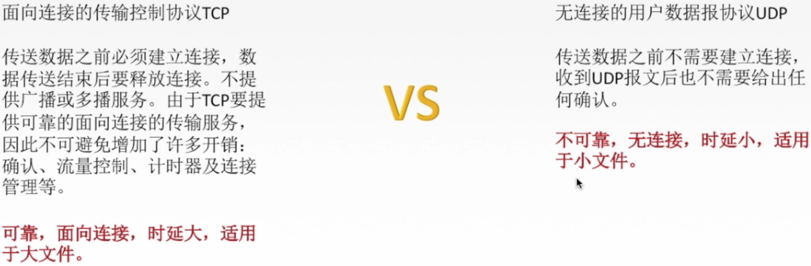

[TOC]

# 5.	传输层

传输层是主机才有的层次

传输层的功能：

①提供进程与进程间通信

②复用和分用

③对收到的报文进行差错检测

④两种传输层协议TCP、UDP

复用：应用层所有应用进程都能通过传输层再传输到网络层

分用：传输层从网络层收到数据后，交付到对应应用进程

为标识主机中应用进程，需要使用**端口（逻辑端口/软件端口），它是传输层的SAP**

端口号只有本地意义，不同主机的相同端口间不存在联系

端口号长度为16位，因此能表示的范围为0~65535

## 5.1	UDP协议

用户数据报协议UDP，只在IP数据报服务的基础上，增加了复用分用和差错检测的功能

UDP特点：

①无连接，减少开销和发送时延

②不保证可靠交付

③面向报文，适合传输少量数据

若应用层报文过大，则造成UDP用户数据报数据部分过大，进而造成IP数据报过大，需要分片，造成传输效率降低

④无拥塞控制，适合实时应用

⑤首部开销小，只有8B（TCP首部为20B）

### 5.1.1	UDP首部格式

当发出的报文不需要回复时，源端口号可以为空（全0）

### 5.1.2	UDP校验

## 5.2	TCP协议

由于在TCP/IP模型中，网络层不提供可靠服务，因此在传输层中，为保证可靠传输，提出了TCP可靠传输

TCP实现可靠传输的机制：

①校验：类似于UDP，使用伪首部校验

②序号

③确认

④重传

### 5.2.1	重传

**超时重传**：TCP发送方在规定时间（重传时间）内未收到确认，就要重传已发送的报文段

TCP采用自适应算法，**动态改变重传时间RTTs**（加权平均往返时间）

**冗余ACK（冗余确认）**：

当收到比期望序号大的失序报文段时，发送一个**冗余ACK**，指明下个期待字节的序号

> 例：
>
> 发送发已发送1,2,3,4,5报文段，
>
> 接收方收到1，返回给1的确认（确认号为2的第一个字节）
>
> 接收方收到3，仍返回给1的确认（确认号为2的第一个字节）
>
> 接收方收到4，仍返回给1的确认（确认号为2的第一个字节）
>
> 接收方收到5，仍返回给1的确认（确认号为2的第一个字节）、
>
> 发送方收到**三个对报文段1的冗余ACK**，认为报文段2丢失，重传2号报文段（**快速重传**）

### 5.2.2	流量控制

流量控制：控制发送方速率

TCP使用**滑动窗口**机制实现流量控制

在通信过程中，接收方根据自己**接收缓存大小**，动态调整发送方发送窗口大小，即接收窗口rwnd（接收方设置确认报文段的**窗口字段**，将rwnd通知给发送方），发送方**发送窗口取接收窗口rwnd和拥塞窗口cwnd最小值**

零窗口通知：即rwnd=0的通知

防止B允许A发送的通知报文丢失，导致陷入互相等待的死锁局面

### 5.2.3	拥塞控制

产生拥塞的原因：对资源需求总和>可用资源

拥塞控制的目的：防止过多数据注入到网络中（全局性）

拥塞控制和流量控制：

拥塞控制：全局性问题，多台主机同时发送数据造成网络拥塞

流量控制：点对点问题，发送方发送数据超过接收方处理速度

#### 5.2.3.1	拥塞控制算法

假定：

①数据单方向传送，另一方向只传送确认

②接收方总有足够大的缓存空间，因而发送窗口大小取决于拥塞程度

发送窗口 =  Min{接收窗口rwnd，拥塞窗口cwnd}

接收窗口：**接收方**根据接收缓存设置的值，并告知发送方，反映接收方容量

拥塞窗口：**发送方**根据自己估算的网络拥塞程度而设置的窗口值，反映网络当前容量

##### 5.2.3.1.1	慢开始和拥塞避免

**慢开始**：拥塞窗口cwnd默认值为1，单位是最大报文长度MSS，即1个最大报文长度，此阶段cwnd指数级增长

传输轮次：发送一批报文段，并收到它们的确认时间，可用一个往返时延RTT表示，

​		或开始发送一批拥塞窗口内的报文段，到开始发送下一批拥塞窗口内报文段的时间

ssthresh（慢开始门限）：cwnd大小达到此数值时，由慢开始转为拥塞避免，此阶段cwnd线性增长。

​		当产生网络拥塞时，cwnd大小缩小到慢开始初始值1，再重复以上步骤。

##### 5.2.3.2.2	快重传和快恢复

快重传：收到3个重复的确认时，执行快重传，调用快恢复

快恢复：不必将cwnd大小重置为慢开始初始值，而是将ssthresh慢开始门限设为快重传执行前cwnd值的一半，cwnd大小即为新的慢开始门限ssthresh

## 5.3	总结

