[TOC]

# 6.	应用层

应用层：对应用程序的通信提供服务

应用层协议定义：

- 应用进程交换的报文类型，请求还是响应？

- 各报文类型的语法，如报文中各字段及其向其描述

- 字段语义，即包含在字段中的信息含义
- 进程何时、如何发送报文，以及对报文进行响应的规则

应用层的功能：

- 文件传输、访问和管理（FTP）
- 电子邮件（SMTP、POP3）
- 虚拟终端（HTTP）
- 查询服务和远程作业登录（DNS）

## 6.1	网络应用模型

### 6.1.1	客户/服务器(C/S)模型

服务器：**提供计算服务**的设备

​				①永久提供服务

​				②永久性访问地址/域名

客户机：**请求计算服务**的主机

​				①与服务器通信，使用服务器提供的服务

​				②间接性接入网络

​				③可能使用动态IP地址

​				④不与其他客户机直接通信

应用：Web、文件传输FTP、远程登录、电子邮件

### 6.1.2	P2P模型

不存在永远在线的服务器

每个主机既可以**提供服务**，也可以**请求服务**

任意端之间可以**直接通信**

节点间歇性接入网络

节点可能改变IP地址

可扩展性好

网络健壮性好

## 6.2	域名解析系统DNS

### 6.2.1	域名

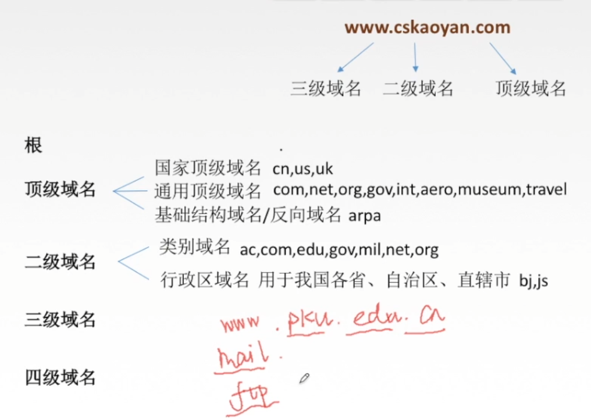

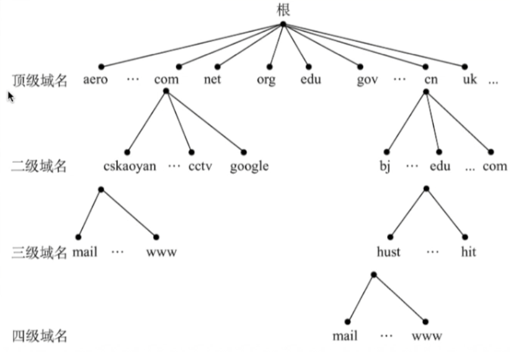

### 6.2.2	域名服务器

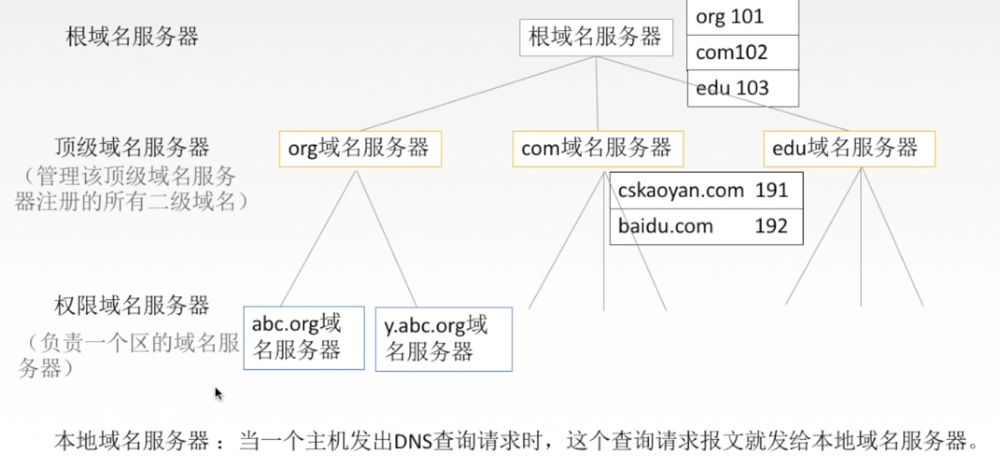

主机发出DNS查询请求后，首先交由本地域名服务器处理，若无法处理再交给根域名服务器

### 6.2.3	域名解析过程

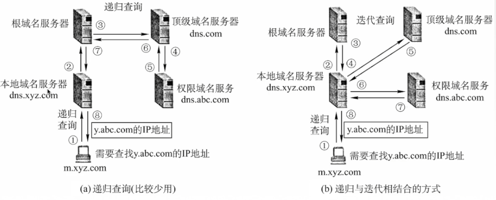

主机、本地域名服务器有**高速缓存**

## 6.3	文件传送协议FTP

简易文件传送协议TFTP（适用于UDP，向许多主机传送小文件的情况）

文件传送协议FTP：提供不同种类主机系统（硬软件体系都可以不同）间文件传输能力

### 6.3.1	FTP服务器和用户端

FTP是基于C/S的协议，

提供服务，进行文件传送的计算机是FTP服务器；

连接FTP服务器，与服务器传送文件的电脑是FTP客户端

### 6.3.2	FTP工作原理

FTP使用TCP实现可靠传输

登录：使用FTP地址，用户名和密码进行登录

> 有时也可以使用匿名登录，不要求用户事先在服务器**登记注册**，也不需要FTP服务器**授权**
>
> 用户使用特殊用户名anonymous登录FTP服务器

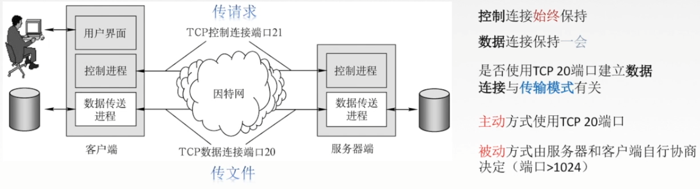

## 6.4	电子邮件系统

### 6.4.1	电子邮件

电子邮件的格式： 

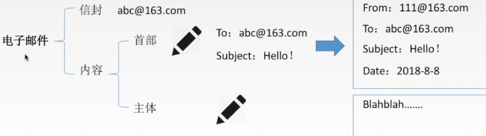

### 6.4.2	电子邮件系统

#### 6.4.2.1	组成结构

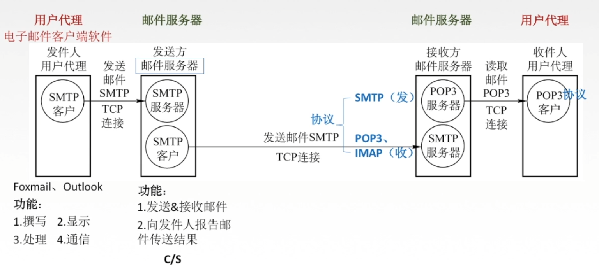

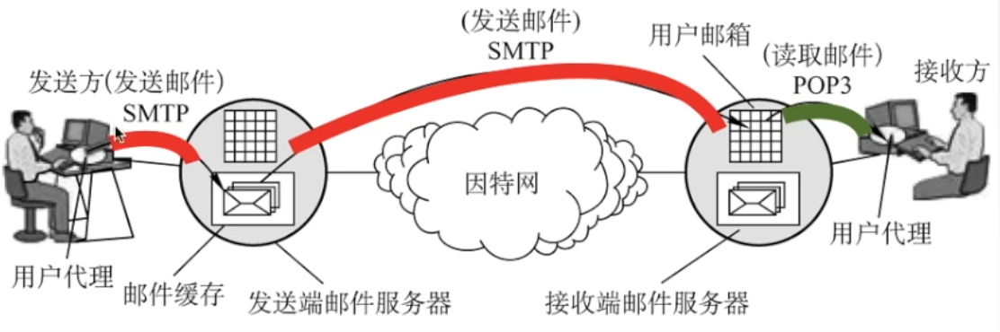

过程中为保证可靠，使用TCP协议传输

#### 6.4.2.2	简单邮件传送协议SMTP

SMTP规定在两个相互通信的**SMTP进程**间如何交换信息

发送邮件的是**SMTP客户**，接收邮件的是**SMTP服务器**

SMTP使用**TCP连接**，**端口号25**，使用**C/S方式**

SMTP通信阶段：**连接建立->邮件传送->连接释放**

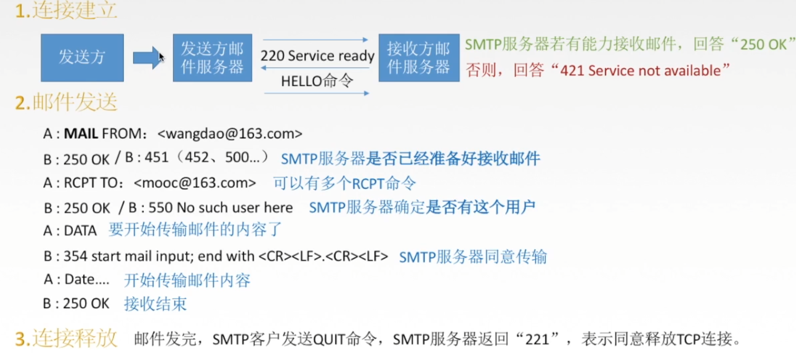

SMTP的缺点：

①不能传送可执行文件或其他二进制对象

②仅限于传送7位ASCII码，不能传送其他非英语国家文字

③SMTP服务器会拒绝超过一定长度的邮件

为了解决SMTP上述局限性，提出了**通用因特网邮件扩充MIME**

MIME能**将非ASCII码信息转换为7位ASCII码**，在邮件发送后再通过MIME转换回原信息，使传输内容更丰富

 

#### 6.4.2.3	邮局协议POP3

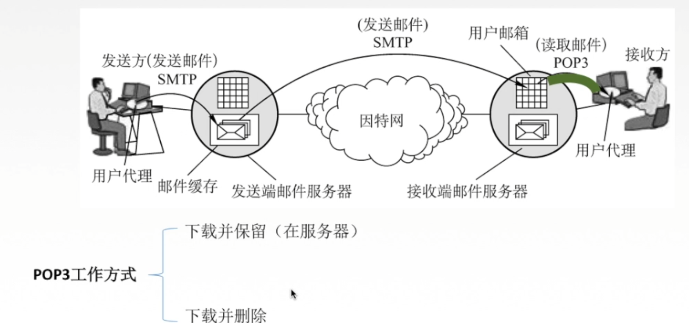

POP3协议用于接收方读取接收端邮件服务器传递的用户邮件

POP3同样使用**TCP协议**，**端口号110，C/S方式**

POP3工作方式：

- 下载并保留（在服务器）
- 下载并删除

由于POP3协议过于简单，因此又提出了**网际报文存取协议IMAP**

#### 6.4.2.4	网际报文存取协议IMAP

当用户通过IMAP客户程序打开IMAP服务器上邮箱时，用户可以看到邮箱首部，若需要打开某邮件，该邮件才上传到用户的计算机上

IMAP允许只读取邮件中某一部分（先看正文，有WiFi时再下载附件）

#### 6.4.2.5	基于万维网的电子邮件

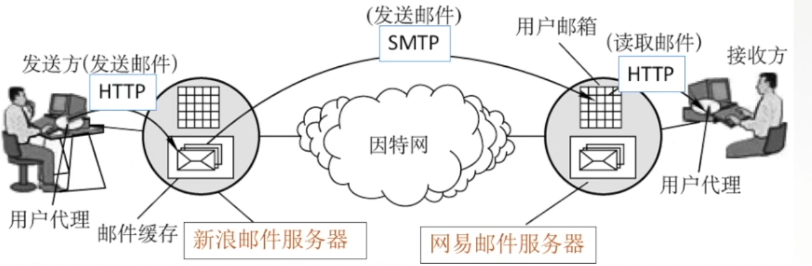

需要注意，**在用户代理和邮件服务器间使用HTTP协议**，在邮件发送时使用SMTP协议

### 6.4.3	总结

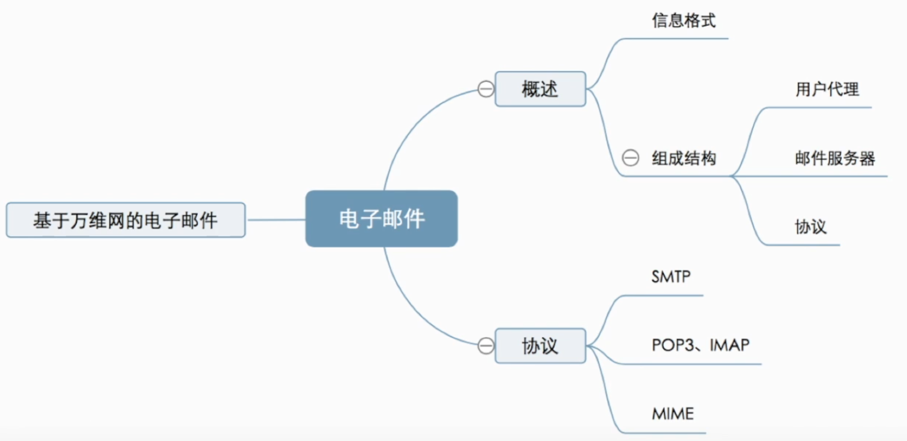

## 6.5	HTTP协议

### 6.5.1	万维网

万维网WWW是一个大规模的**资料空间**，是无数网站和网页的集合

统一资源定位符URL：是对某资源的唯一标识

URL形式：**<协议>://<主机>:<端口>/<路径>**，不区分大小写

> 对于协议，常用的为HTTP或FTP
>
> 主机一般为域名或IP地址
>
> 端口可省略
>
> 例：http://www.baidu.com

用户通过超链接获取资源，资源通过**HTTP**传送给使用者

万维网以**C/S方式**工作，浏览器就是万维网客户程序，万维网文档所驻留的主机是万维网服务器

万维网使用超文本标记语言**HTML**

### 6.5.2	超文本传输协议HTTP

HTTP协议定义了浏览器与万维网服务器的通信过程

HTTP使用**TCP连接，端口号80**

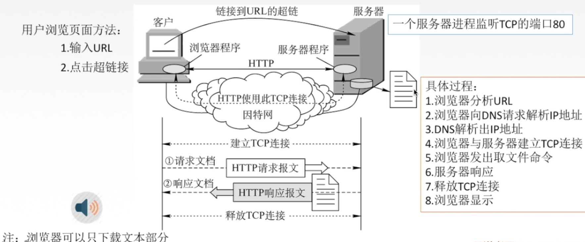

 

#### 6.5.2.1	HTTP协议的特点

HTTP协议是**无状态**的，即服务器不能识别用户

为了能识别用户，提出了Cookie

Cookie是存储在用户主机上的**文本文件**，记录一段时间内某用户（通过识别码识别）的访问记录

HTTP采用TCP作为传输层协议，但**HTTP协议本身是无连接的**（通信双方在交换HTTP报文前不需要先建立HTTP连接）

#### 6.5.2.2	HTTP的连接方式

HTTP的连接方式：

- 持久连接(Keep-alive)：
  - 非流水线
  - 流水线
- 非持久连接(Close)

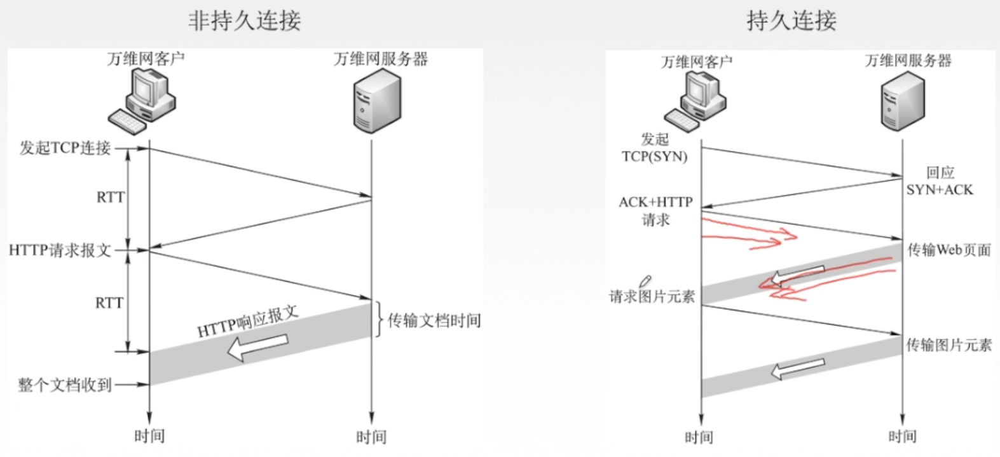

对于非持久连接，每个网页元素对象都需要单独建立一个TCP连接，传输效率低，同时服务器负担重

对于持久连接，在建立TCP连接后，可以持续传输网页元素对象，提高了传输效率。

> 图中持久连接为非流水线方式，流水线方式类似于数据链路层选择重传协议SR，可连续发送和接收文件，传输效率更高

#### 6.5.2.3	HTTP报文结构

HTTP报文是**面向文本**的，因此每个字段都是ASCII码串

HTTP报文分为请求报文和响应报文

请求报文和响应报文的第一行都叫做**开始行**，但两报文开始行结构不同，因此可用开始行区分是请求报文还是响应报文

开始行之后，是首部行（可选），用于说明浏览器、服务器和报文主体的一些信息

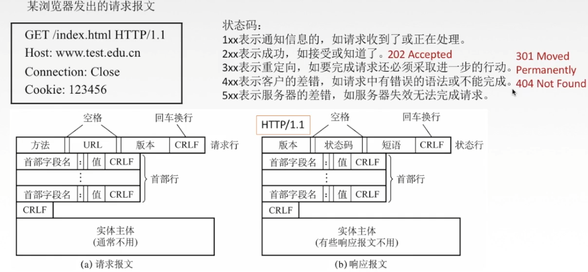