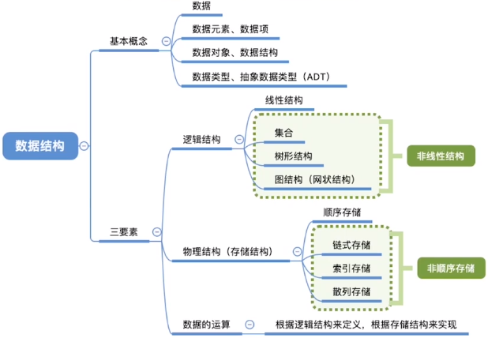
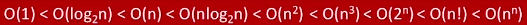

[TOC]

# 1.	绪论

## 1.1	基本概念

**数据**：数据是信息的载体，是所有能输入到计算机中并被计算机程序识别和处理的符号的集合。

**数据元素**：数据的基本单位，通常作为一个整体来考虑和处理，一个数据元素可由多个**数据项**构成

**数据项**：构成数据元素的不可分割的最小单位

**数据结构**：相互存在一种或多种**关系**的数据元素的集合

**数据对象**：具有相同性质的数据元素的集合，是数据的一个子集（不强调数据元素间的关系）

**数据类型**：一个值的集合和定义在此集合上的一组操作的总称

1. 原子类型：其值不可再分的数据类型（如int、bool）
2. 结构类型：其值可以再分解为若干成分的数据类型（如结构体）

**抽象数据类型**(ADT)：抽象数据组织及与之相关的操作，即用数学化语言定义数据的逻辑结构、定义运算，与具体实现无关，不考虑物理结构

## 

### 1.1.1	数据结构三要素

**逻辑结构**：

1. **集合**（不讨论）：各元素同属一个集合，除此之外别无关系

2. **线性结构**：数据元素之间是一对一关系；

	​					除第一个元素外，所有元素都有唯一前驱；

	​					除最后一个元素外，所有元素都有唯一后继

3. **树形结构**：数据元素间是一对多的关系

4. **图状结构（网状结构）**：数据元素间是多对多的关系

**物理结构**（存储结构）：

1. **顺序存储**：将**逻辑上相邻元素存储在物理位置上也相邻的存储单元中**，通过存储单元的邻接关系表示元素间关系

2. **链式存储**：**逻辑上相邻元素在物理位置上可以不相邻**，通过指示元素存储地址的指针表示元素间关系

3. **索引存储**：存储元素的同时，还建立了附加的索引表。索引表中每项称为索引项，索引项一般形式为（关键字，地址）

4. **散列存储**：根据元素关键字直接计算该元素的存储地址，即**哈希存储**

	​	

	除顺序存储外的三种存储方式都是非顺序存储

	- 若采取顺序存储方式，则各元素在物理上必须连续；若采用非顺序存储，则各元素在物理上可以是离散的
	- 数据的存储结构会影响存储空间分配的方便程度（如插入数据）
	- 数据的存储结构会影响数据运算速度（如查找）

**数据运算**：施加在数据上的运算，包括运算的定义和实现：

**运算的定义**：**针对逻辑结构**（如队列、栈），指出运算的功能

**运算的实现**：**针对存储结构**，指出运算具体操作步骤（如入栈、出栈）

探讨一种数据结构时：

1. 定义逻辑结构（元素间关系）
2. 定义数据运算（针对需求，对逻辑结构进行运算）
3. 确定存储结构，实现数据结构，并实现一些基本运算

## 1.2	算法

### 1.2.1	算法基本概念

程序=数据结构+算法，数据结构是现实问题的信息化，算法是对信息的处理，即对问题的解决

**算法的特性**：

- **有穷性**：一个算法必须总在执行有穷步后结束，且每步都在有穷时间内完成。

	​	算法必须是有穷的，程序可以是无穷的

- **确定性**：对相同的输入只能得出相同的输出
- **可行性**：算法中描述的操作都可以通过已实现的**基本运算执行有穷次**来实现
- **输入**：一个算法有零个或多个输入，这些输入取自某个特定对象集合
- **输出**：一个算法有零个或多个输出，这些输出是与输入有某种特定关系的量

好算法的特质（设计算法尽量追求的目标）：

- 正确性：算法应能够正确解决问题

- 可读性：算法应有良好的可读性，以帮助理解。

	​	算法可以用伪代码甚至文字描述，重要的是要**无歧义**描述解决问题的步骤

- 健壮性：输入非法数据时，算法能适当作出反应或进行处理，而不会产生莫名其妙的输出结果

- 高效率与低存储量要求：即执行速度快，省时省内存，时间复杂度、空间复杂度低

### 1.2.2	时间复杂度

算法的时间复杂度，即算法的时间开销。

#### 1.2.2.1	评估算法的时间复杂度

##### 1.2.2.1.1	运行程序以运行时间评估存在的问题

1. 与设备性能有关，设备性能越高处理速度越快，花费时间越短
2. 与编程语言有关，语言越高级，执行效率越低
3. 与编译程序产生的机器语言质量有关
4. 有些算法不能事后统计，如导弹控制算法

前三条都是由外界因素造成的差异，在评估算法时应排除这些因素；且我们应事先估计算法

##### 1.2.2.1.2	事先评估算法的时间复杂度

**算法时间开销T(n)与问题规模n的关系**

****

算法的时间复杂度从小到大排列：

增长速度：**常对幂指阶**

评估算法时间复杂度：

1. 忽略顺序执行的代码，因为它们只会影响常数项的大小
2. 只需要分析循环中的一个基本操作执行次数与n的关系即可
3. 若有多层嵌套循环，则只需关注最深层循环次数
4. 当算法执行时间与输入有关时，需要分别考虑最好情况、最坏情况和平均情况下的时间复杂度，但一般不关注最好情况

算法的性能问题只有在n很大的时候才能体现出来

### 1.2.3	空间复杂度

**算法空间开销(内存开销)与问题规模n的关系**

------

程序的内存开销=程序代码所占内存+数据所占内存

数据包括全局变量、局部变量和参数，影响最大的是数组

#### 1.2.3.1	普通程序的空间复杂度

1. 找到所占空间大小与问题规模相关的变量
2. 分析所占空间x与问题规模n的关系 x=f(n)
3. x的数量级O(x)就是算法空间复杂度S(n)

#### 1.2.3.2	递归程序的空间复杂度

1. 找到递归调用的深度x与问题规模n的关系x=f(n)
2. x的数量级O(x)就是算法空间复杂度S(n)

当函数递归调用时，每次调用函数，函数内的参数和局部变量都要为其分配内存

