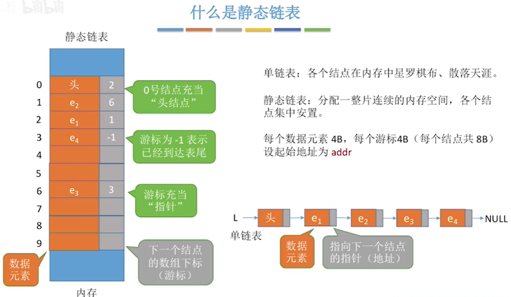
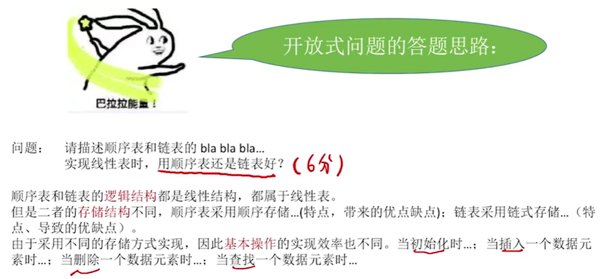

# 2.	线性表LinearList

## 2.1	线性表定义

线性表是具有**相同数据类型**的n(n≥0)个**数据元素**的**有限序列**

其中n为表长，当n=0时，线性表是一个空表。

> 相同数据类型意味着每个数据元素所占空间相同
>
> 线性表是一种有限序列，表示元素之间存在次序，元素个数有限

若用L命名线性表，则其一般表示为：

```properties
L = (a1, a2, ..., ai, ai+1, ..., an)
```

- ai是线性表中第i个元素在线性表中的位序

- a1是表头元素，an是表尾元素

- 除第一个元素外，每个元素有且仅有一个直接前驱；

	除最后一个元素外，每个元素有且仅有一个直接后继


## 2.2	线性表的基本操作

数据结构中对数据的操作：创建销毁、增删改查

**什么时候传入参数使用指针类型？对参数的修改结果需要返回时**

### 2.2.1	初始化和销毁

InitList(&L)：

初始化线性表时，将构造一个空的线性表L，为其分配内存空间；（从无到有）

DestroyList(&L)：

销毁线性表时，将释放线性表L所占内存空间（从有到无）

### 

### 2.2.2	插入和删除

ListInsert(&L, i, e)：

插入操作在表L的第i个位置插入指定元素e

ListDelete(&L, i, &e)：

删除操作将删除表L在第i个位置的元素，并用e返回删除元素的值


### 2.2.3	按值查找和按位查找

LocateElem(L, e)：

按值查找操作在表L中，查找具有给定关键字值的元素

GetElem(L, i)：

按位查找操作将获取表L中第i个位置元素的值


### 2.2.4	其他操作

Length(L)：

求表长，返回线性表L的长度，即L中数据元素个数


PrintList(L)：

输出操作，按先后顺序输出线性表L中所有元素值


Empty(L)：

判空操作，若L为空表返回true，否则返回false


## 2.3	顺序表

顺序表，即用顺序存储方式实现的线性表

### 2.3.1	顺序表实现

#### 2.3.1.1	静态定义

```c
//顺序表静态定义
#define MAXSIZE 10//定义最大长度
typedef struct {
	int data[MAXSIZE];//用数组存放数据元素
	int length;//顺序表当前长度
}SeqList;
//静态定义存在的问题：若数组存满了也没有办法扩大存储空间；若初始声明的数组很大容易造成资源浪费
```

#### 2.3.1.2	动态定义

```c
//顺序表动态定义
#define INITSIZE 10//定义最大长度
typedef struct {
	int* data;//动态数组存放数据
	int maxSize;//最大长度
	int length;//顺序表当前长度
}seqlist;
```

基本操作：

```c
//顺序表静态实现
//顺序表初始化
void initList(SeqList* list) {
	for (int i = 0; i < MAXSIZE; i++) {
		list->data[i] = 0;//数组置零
	}//此步骤可省略，但可以避免因为非法操作而读取到脏数据
	list->length = 0;
}
```

```c
//顺序表动态实现

//顺序表初始化
void initList(SeqList* list) {
	//当使用动态定义的顺序表时，需要动态分配内存空间
	list->data = (int*)malloc(INITSIZE * sizeof(int));
	for (int i = 0; i < INITSIZE; i++) {
		list->data[i] = 0;//数组置零
	}//此步骤可省略，但可以避免因为非法操作而读取到脏数据
	list->length = 0;
	list->maxSize = INITSIZE;
}

//顺序表扩容(动态实现才可以使用)
void increaseList(SeqList* list, int len) {
	int* p = list->data;
	//重新分配内存空间
	list->data = (int*)malloc(len * sizeof(int));
	//将原来的值赋值到新的动态数组中
	for(int i = 0; i < list->maxSize; i++) {
		list->data[i] = p[i];
	}
	//将之后的数组置零(可省略)
	for (int i = list->maxSize; i < len; i++) {
		list->data[i] = 0;
	}
	//重新设置顺序表的最大容量
	list->maxSize = len;
	//释放之前的动态数组
	free(p);
}


```

顺序表的特点：

- 随机访问：可以在O(1)时间内找到第i个元素
- 存储密度高：每个节点只存储数据元素
- 拓展容量不方便：即使采用动态分配方式实现，拓展长度的时间复杂度也比较高
- 插入、删除数据元素不方便

## 2.4	链表

### 2.4.1	单链表

#### 2.4.1.1	带头结点的单链表

#### 2.4.1.2	不带头结点的单链表

#### 2.4.1.3	单链表逆转

##### 2.4.1.3.1	头插法

方案1：遍历链表，将遍历到的结点用头插法插到头结点（头指针）后，得到的链表是原链表的逆转

方案2：遍历链表，将遍历的得到的值，通过头插法建立一个新的链表，这个链表也相当于原链表的逆转。


### 2.4.2	双链表

**从此处开始，若无特殊说明，代码均按照有头结点的链表编写**


### 2.4.3	静态链表

- 用数组形式实现的链表
- 占用一整片连续空间，不能自由改变大小
- 逻辑上相邻的节点在物理上不一定相邻


#### 2.4.3.1	静态链表的优缺点

- 优点：增删操作不需要移动大量元素，只需要改变结点next对应的数组下标
- 缺点：
  - 1.不能随机存取，只能顺序遍历
  - 2.容量固定不变




## 2.5	顺序表和链表对比

### 2.5.1	逻辑结构

都是线性表，都是线性结构


### 2.5.2	存储结构

- 顺序表：使用顺序存储，支持随机存取，存储密度高；但需要分配大片连续空间，且改变容量困难
- 链表：使用链式存储，存储在离散空间，改变容量方便；但不可随机存取，且存储密度低


### 2.5.3	基本运算

#### 2.5.3.1	创建

- 顺序表：需要预分配大片连续空间，若分配空间过小，则后期拓展容量困难；若分配空间过大，则造成内存浪费

  ​	对静态分配的顺序表，无法更改容量大小；对动态分配的顺序表，更改容量需要移动大量元素，开销大，操作比较困难

- 链表：只需分配一个头结点（或一个头指针），之后拓展容量简单


#### 2.5.3.2	销毁

- 顺序表：对静态分配的顺序表，只需要将表长置零；对动态分配的顺序表，还需要手动free释放
- 链表：需要对各节点依次free释放


#### 2.5.3.3	插入和删除

- 顺序表：插入/删除需要对其后元素后移/前移，时间复杂度O(n)，时间开销来源于移动元素
- 链表：插入/删除只需要修改指针指向，时间复杂度O(n)，时间开销来源于查找元素

虽然顺序表和链表的插入删除操作时间复杂度都是O(n)，但当数据较大时，移动数据会造成很大的开销；相比移动元素，查找元素代价更低，因此链表插入和删除操作效率更高


#### 2.5.3.4	查找

##### 2.5.3.4.1	按位查找

- 顺序表：支持随机存取，时间复杂度O(1)
- 链表：时间复杂度O(n)

##### 2.5.3.4.2	按值查找

- 顺序表：当表内元素有序时，可使用算法查找，时间复杂度O(log2n)；当表内元素无序时，时间复杂度O(n)
- 链表：时间复杂度O(n)


#### 2.5.3.5	总结

- 顺序表：可拓展性较差、增删操作效率较低、查找效率高
- 链表：可拓展性好、增删操作效率较高、查找效率低

当表长难以预估，且经常需要增删元素时，应使用链表；

当表长稳定，且经常需要查找元素时，应使用顺序表




## 2.6	课后习题

### 2.6.2	顺序表

#### 第3题

```c
void deleteX(int x) {
	int count = 0;
	for (int i = 0; i < LISTLENGTH; i++) {
		if (num[i] == x) {	//记录值为x的元素个数
			count++;
		}
		else {
			num[i - count] = num[i];
		}
	}
}
```
