# 3.	栈与队列

## 3.1	栈Stack

### 3.1.0	概念

栈(Stack)是**只允许在一端进行插入和删除操作**的**线性表**，是一种操作受限的线性表

栈**先进后出FILO**，创增删查的时间复杂度都为O(1)

**注意规定栈顶指针指向栈顶元素还是栈顶元素的下一个位置**

#### 3.1.0.1	卡特兰数

n个不同元素入栈，==出栈元素排列种类==有 **$\frac{1}{n+1}$ * $C^n_{2n}$​** 种


### 3.1.1	栈与普通线性表的区别

逻辑结构：栈与普通线性表相同

数据的运算：插入、删除操作有区别


### 3.1.2	顺序栈SeqStack

### 3.1.3	共享栈ShareStack

共享栈有两个栈顶指针，分别从上向下遍历和从下向上遍历，共同使用同一片内存空间，提高了顺序栈的空间利用率

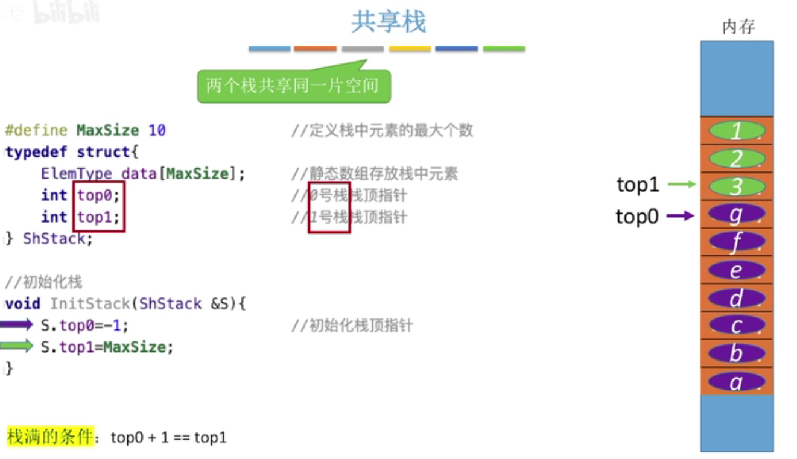

### 3.1.4	链栈LinkedStack

链栈是使用链式存储方式实现的栈

链栈入栈（添加元素）操作实质是单链表头插法插入元素

链栈出栈（删除元素）实质是单链表删除头结点后第一个元素


## 3.2	队列Queue

### 3.2.0	概念

队列是**只允许在一端插入，另一端删除**的**线性表**

队列中的元素**先进先出FIFO**，从队尾入队（插入），从队头出队（删除）


### 3.2.1	队列SeqQueue

#### 3.2.1.0	普通队列的问题

普通顺序队列存在的问题是：随着元素出队，队头指针不断后移，队列可用长度会不断减少，造成内存空间浪费

为了提高内存空间利用率，可以使用循环队列


### 3.2.2	循环队列CycleSeqQueue

循环队列通过模运算，在逻辑上使队列形成一个环路，队头指针和队尾指针可以在其中不断循环

#### 3.2.2.0	普通循环队列的问题

普通循环队列存在的问题是：

由于判空条件为front == rear，判满条件为(rear+1)%MAXSIZE == front，

因此队列最后一个元素不能存放数据，否则将无法判断当front == rear时队列是空的还是满的，

这样就会造成最后一个元素所占用的内存空间不能被使用，一定程度上还是造成了内存资源浪费

#### 3.2.2.1	循环队列的判空/判满和长度获取

##### 3.2.2.1.1	普通情况

普通情况下，即标准循环队列定义如下：

```c
typedef struct{
    datatype data[MAXSIZE];
    int front, rear;
}SeqQueue;
```

此时判空操作：

```c
Q.rear == Q.front
```

此时判满操作：

```c
(Q.rear+1) % MAXSIZE == Q.front
```

此时获取元素数量：

```c
len = ( (Q.rear+MAXSIZE) - Q.front) % MAXSIZE
```


##### 3.2.2.1.2	必须使用完整队列空间

当要求使用完整队列空间时，队列中所有元素都可以用于存放数据，

为了保证仍然能进行判空、判满和获取队列长度操作，必须修改队列的结构体（类）定义：

###### 3.2.2.1.2.1	队列长度

在结构体（类）定义中引入队列长度size字段：

```c
typedef struct{
    datatype data[MAXSIZE];
    int front, rear;
    int size;
}SeqQueue;
```

此时通过size即可进行判空、判满和获取队列长度操作


###### 3.2.2.1.2.2	变长操作记录

在结构体（类）定义中引入变长操作记录tag字段：

tag记录队列的上一次变长操作，即入队/出队（插入/删除）操作：

- 当执行出队（删除）操作时，令tag=0
- 当执行入队（插入）操作时，令tag=1

因为只有出队（删除）操作才可能导致队空，只有入队（插入）操作才可能导致队满，

因此判空条件为：

```c
rear==front && tag==0
```

判满条件为：

```c
rear==front && tag==1
```

获取长度方法：

```c
if(rear==front && tag==1) len = MAXSIZE
else len = ( (Q.rear+MAXSIZE) - Q.front) % MAXSIZE
```


### 3.2.3	队列的链式实现

```c
typedef int datatype;
typedef struct LinkNode{
    datatype data;
    struct LinkNode* next;
}LinkNode;
typedef struct{
    LinkNode *front, *rear;
}LinkQueue;
```

队列的链式实现解决了队列长度问题


### 3.2.4	双端队列

双端队列是==只允许从两端插入、两端删除==的线性表

双端队列还有两种变形：输入受限或输出受限的双端队列

#### 3.2.4.1	输入受限的双端队列

只允许==从一段插入、从两端删除==的线性表


#### 3.2.4.2	输出受限的双端队列

只允许从两端插入、从一端删除的线性表


#### 3.2.4.3	判断输出序列合法性

在栈中合法的输出序列，在双端队列中也合法


## 3.3	应用

### 3.3.1	栈

#### 3.3.1.1	括号匹配问题

基本思路：遇到左括号就压入栈中，遇到右括号就弹出栈顶元素进行匹配，若括号不配对或匹配时栈已经空了则匹配失败；若所有括号都完成匹配（无需要匹配的右括号且栈空）则匹配成功

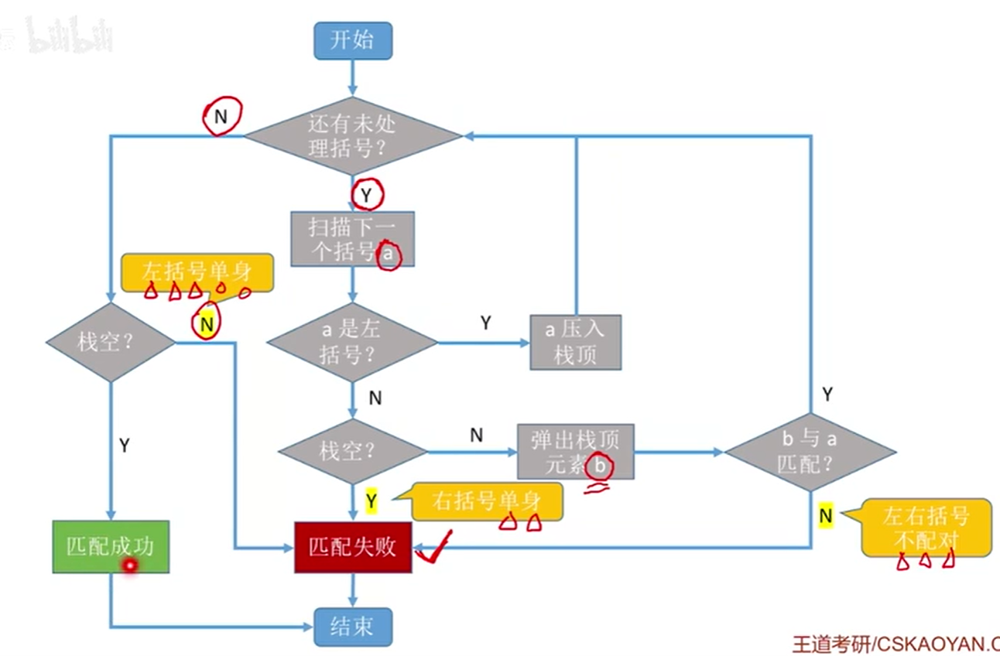

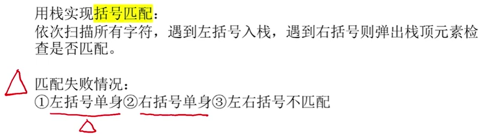

```c
bool bracketCheck(char str[], int len)
{
    SeqStack s;
    initStack(&s);
    for(int i=0; i<len; i++){
        //Push str[i] if str[i] is a Left Bracket
        if(str[i]=='(' || str[i]=='[' || str[i]=='{')
            push(&s, str[i]);
        else{
            //Return false if Stack is empty
            if(isStackEmpty(s))
                return false;
            //Pop leftBracket to match the Right Bracket
            datatype leftBracket;
            pop(&s, &leftBracket);

            if(str[i]==')' && leftBracket!='(')
                return false;
            if(str[i]==']' && leftBracket!='[')
                return false;
            if(str[i]=='}' && leftBracket!='{')
                return false;
        }
    }
    //Return true if( (all brackets were matched successfully) && (Stack is empty) ) 
    return isStackEmpty(s);
}
```


#### 3.3.1.2	表达式求值

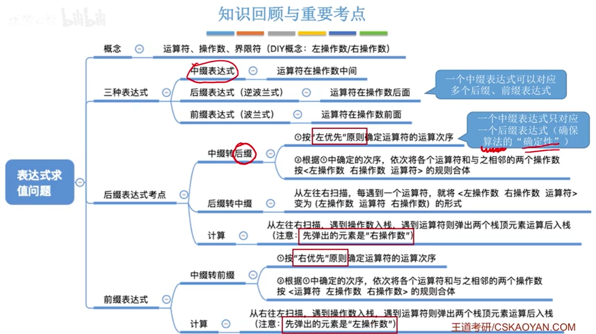

##### 3.3.1.2.1	后缀表达式

###### 3.3.1.2.1.1	中缀转后缀基本思路

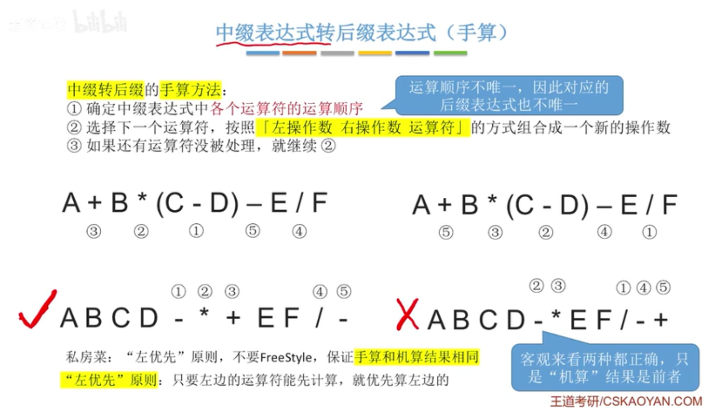

**左优先原则：优先计算左边的运算符**

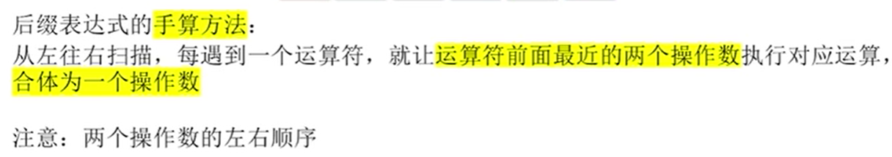


###### 3.3.1.2.1.2	后缀表达式计算算法思路

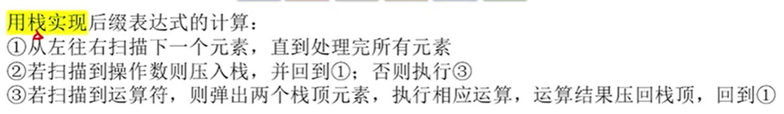


##### 3.3.1.2.2	前缀表达式

###### 3.3.1.2.2.1	中缀转前缀基本思路

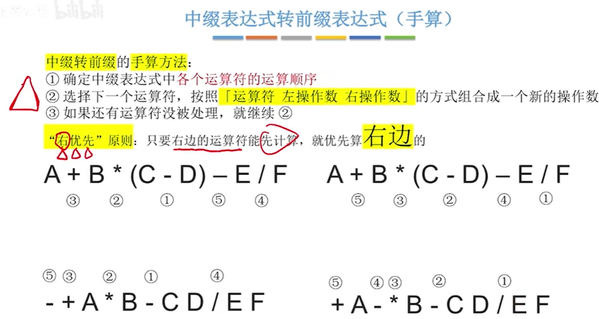


###### 3.3.1.2.2.2	前缀表达式计算算法思路

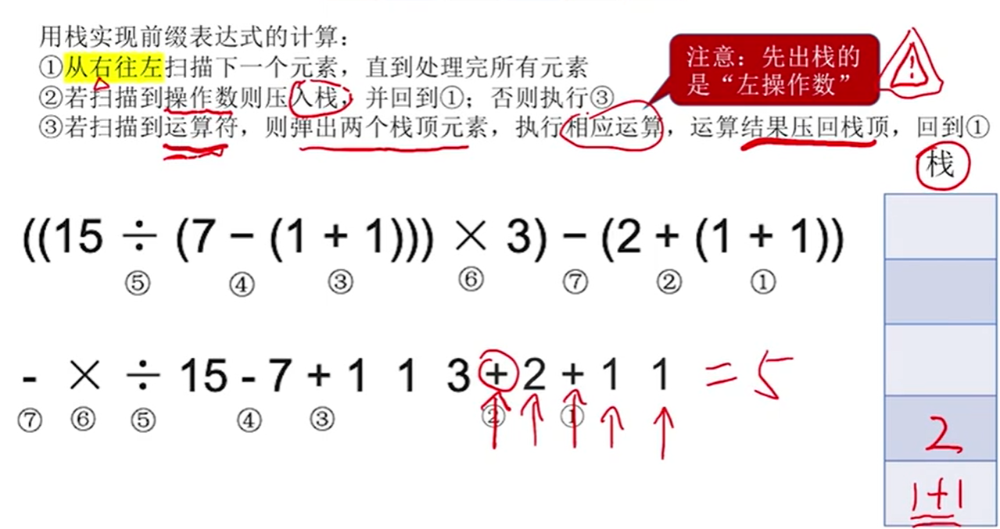

|                        | **中缀转前缀**                                               | **中缀转后缀**                                               |
| ---------------------- | ------------------------------------------------------------ | ------------------------------------------------------------ |
| **栈**                 | 操作符栈                                                     | 操作符栈                                                     |
| **扫描顺序**           | **从右到左**                                                 | **从左到右**                                                 |
| **遇到操作数**         | 直接归入                                                     | 直接归入                                                     |
| **遇到右括号**         | 直接入栈                                                     | 将栈中操作符依次弹栈，归入，直至遇到左括号，将左括号弹栈，处理完毕 |
| **遇到左括号**         | 将栈中操作符依次弹栈，归入，直至遇到右括号，将右括号弹栈，处理完毕 | 直接入栈                                                     |
| **遇到其他操作符**     | 检测栈顶操作符优先级与当前操作符优先级关系，如果栈顶大于当前，则出栈，归入，**直至栈顶小于等于当前**，并将当前操作符入栈 | 检测栈顶与当前优先级关系，如果栈顶大于等于当前则出栈，归入，**直至栈顶小于当前**，并将当前操作符入栈 |
| **操作符栈中的优先级** | **从栈底到栈顶操作优先级：非递减。即：栈顶可以大于或等于下面的** | **从栈底到栈顶优先级：递增。即：栈顶必须大于下面的**         |
| **是否翻转**           | 翻转                                                         | 无需翻转                                                     |

以看出中缀转前缀与中缀转后缀的最大区别在于两点：扫描顺序和操作符栈中操作符优先级的排列关系。

##### 3.3.1.2.3	中缀表达式

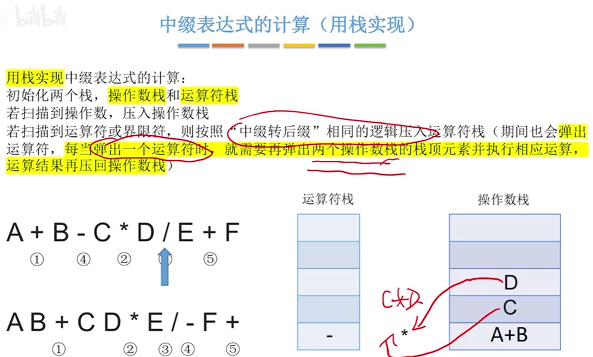


##### 3.3.1.2.4	总结

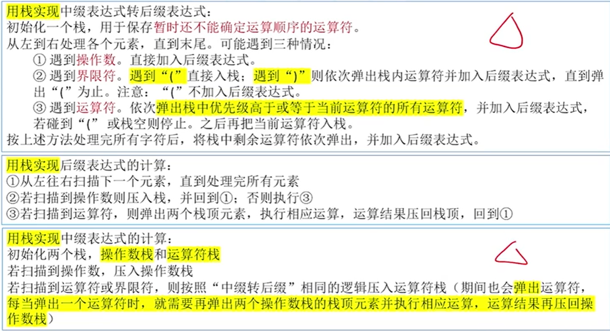


#### 3.3.1.3	函数调用

##### 3.3.1.3.1	函数调用的特点

函数调用的特点：最后被调用的函数最先执行结束(LIFO)

函数调用需要存储在函数调用栈中的数据：

- 调用返回地址
- 实参
- 局部变量


##### 3.3.1.3.2	递归函数

适合用递归算法解决的问题：可以把原始问题转换为属性相同，但规模较小的问题

在函数调用时，函数调用栈也叫作递归工作栈。

递归算法的缺点：效率较低，递归层数太多可能会导致栈溢出，可能包括很多重复运算

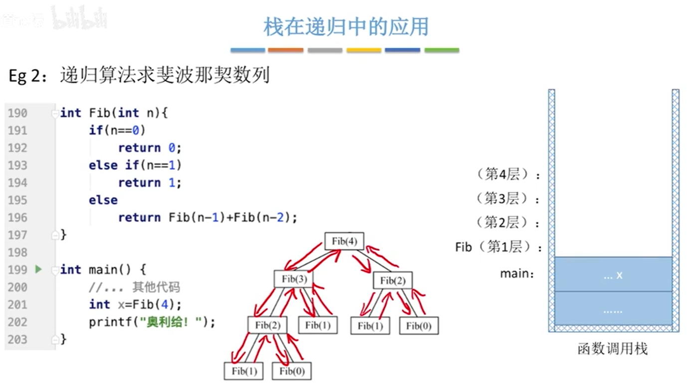


### 3.3.2	队列

#### 3.3.2.1	树的层次遍历

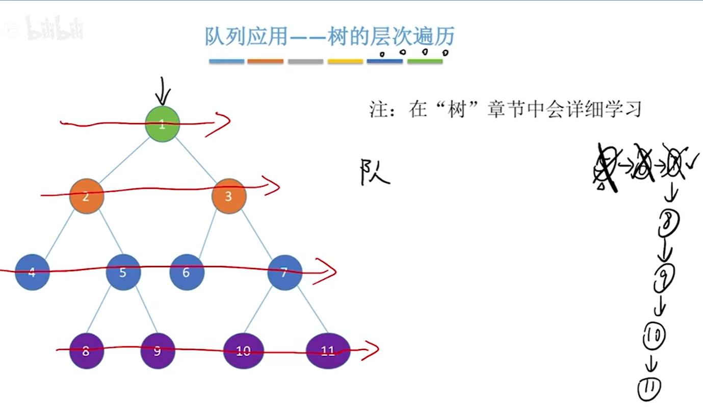


#### 3.3.2.2	图的广度优先遍历

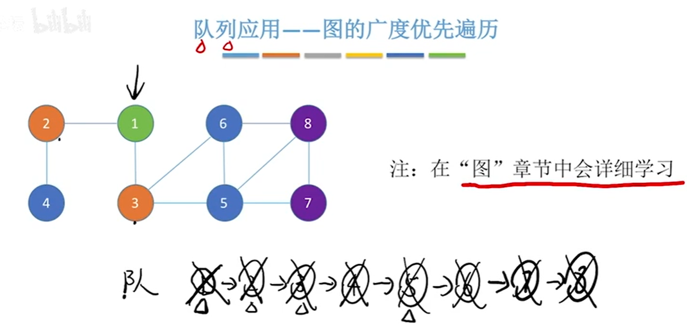


#### 3.3.2.3	队列在操作系统中的应用

##### 3.3.2.3.1	先来先服务

多个进程争抢系统资源时，常使用先来先服务FCFS策略


##### 3.3.2.3.2	数据缓冲区

用队列缓存数据，缓解高速设备和低速设备之间速度不匹配的问题

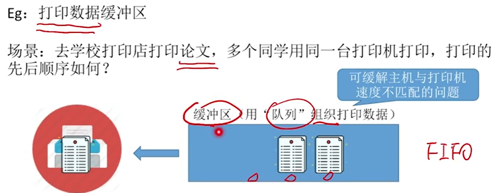
