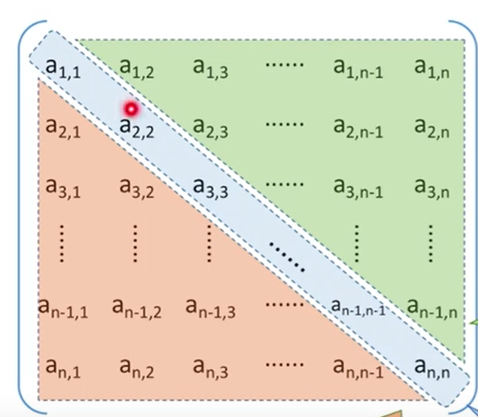
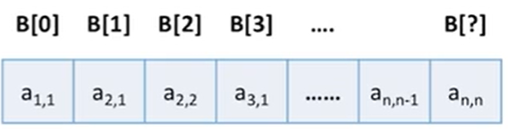
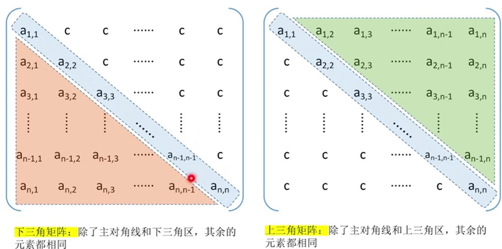
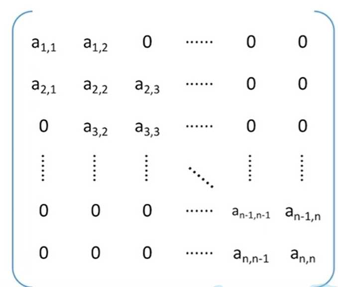
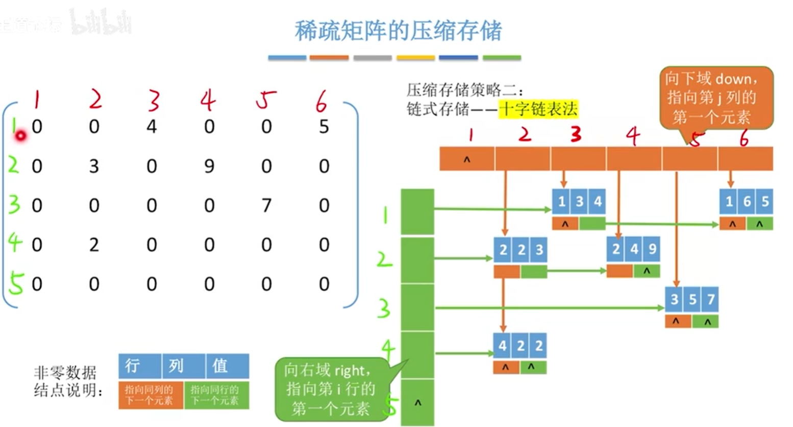
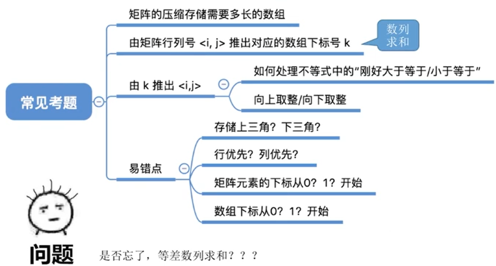

# 4.	数组和矩阵

## 4.1	数组

### 4.1.1	一维数组

数组中,各数组元素大小相同,且在物理上连续存放

除非题目特别说明,否则==数组下标默认从0开始==

### 4.1.2	二维数组

由于计算机内存是线性存储,因此二维数组在内存中有**行优先存储**和**列优先存储**两种存储策略

在M行N列的二维数组b[M]\[N] 中：

- 对于行优先存储，b\[i]\[j]的存储地址= 起始地址+ (i*N + j) * sizeof(data)

- 对于列优先存储，b\[i]\[j]的存储地址= 起始地址+ (i + j*M) * sizeof(data)

## 4.2	矩阵

### 4.2.1	普通矩阵的存储

普通矩阵可用二维数组存储，

在描述矩阵元素时，行、列号通常从1开始，而描述数组时下标通常从0开始

### 4.2.2	特殊矩阵的存储

#### 4.2.2.1	对称矩阵

若n阶方阵中，任一元素a~i~~j~都有a~i~~j~ = a~j~~i~，则该矩阵为对称矩阵

##### 4.2.2.1.1	对称矩阵的压缩存储

存储策略：只存储主对角线+上三角区， 或只存储主对角线+下三角区

以只存储主对角线+下三角区为例：

可以按行优先存储原则，将各元素存入一维数组，

由于第一行有1个元素，第二行有2个元素，第n行有n个元素，因此数组长度为$$\frac{n(n+1)}{2}$$

由于此时很难直接访问矩阵对应元素，因此需要使用映射函数，将矩阵下标转换为数组下标：

###### 4.2.2.1.1.1	行优先存储

在下三角区，a~i~~j~是第 $$[1 + 2 + ... + (i-1)] + j = \frac{i(i-1)}{2} + j - 1$$个元素​

$ 数组下标k =\begin{cases} \frac{i(i-1)}{2} + j - 1 & i≥j \\ \frac{j(j-1)}{2} + i - 1 & i<j \end{cases}$​​

###### 4.2.2.1.1.2	列优先存储

列优先存储中，第一列有n个元素，第二列有n-1个元素，第n列有1个元素，

在下三角区中，a~i~~j~前面经历了1 ~ (j-1)列，有元素 $$[n + (n-1) + ... + (n-j+2)] = \frac{(j-1)(2n-j+2)}{2}$$个

在第j列，a~i~~j~前有元素$i-j$个，因此a~i~~j~是第$$ \frac{(j-1)(2n-j+2)}{2} + (i-j) + 1$$个元素

由此可知，$ 数组下标k =\begin{cases}  \frac{(j-1)(2n-j+2)}{2} + (i-j) + 1 & i≥j \\  \frac{(i-1)(2n-i+2)}{2} + (j-i) + 1 & i<j \end{cases}$

#### 4.2.2.2	三角矩阵

三角矩阵分为上三角矩阵和下三角矩阵，

- 上三角矩阵是除对角线和上三角区外，其余元素都相同的矩阵

- 下三角矩阵是除对角线和下三角区外，其余元素都相同的矩阵

##### 4.2.2.2.1	三角矩阵的压缩存储

###### 4.2.2.2.1.1	下三角矩阵

存储策略：按行优先存储原则，将主对角线和下三角区存储到一维数组，再在一维数组最后一个单元存储常量C

因此数组长度$$L=[1+2+...+n]+1=\frac{n(n-1)}{2}+1$$

此时有映射关系$ k =\begin{cases}  \frac{i(i-1)}{2} + j-1 & i≥j(下三角区和主对角线元素) \\  \frac{n(n+1)}{2}& i<j(上三角区元素) \end{cases}$​​

###### 4.2.2.2.1.2	上三角矩阵

在a~i~~j~前有1~ (i-1)行，有元素$$[n+ (n-1) +... + (n-i+2)] = \frac{(i-1)(2n-i+2)}{2}$$个

在第i行，a~i~~j~前有元素$j-i$​个，因此a~i~~j~是第$\frac{(i-1)(2n-i+2)}{2} + （j-i) + 1$​个元素

因此映射关系$ k =\begin{cases}  \frac{n(n+1)}{2} & i≥j(下三角区) \\  \frac{(i-1)(2n-i+2)}{2} + （j-i) + 1 & i<j(上三角区元素和主对角线元素) \end{cases}$​

#### 4.2.2.3	带状矩阵(三对角矩阵)

当$|i-j|>1$时，有a~i~~j~=0

##### 4.2.2.3.1	带状矩阵压缩存储

存储策略：按行优先（列优先）原则，只存储带状部分

数组长度$n +(n-1) + (n-1) = 3n-3$ 

###### 4.2.2.3.1.1	行优先存储

对a~i~~j~，其前经历了1~(i-1)行，有元素$3(n-1)-1$​个

在第i行，a~i~~j~前有$j-i+1$​个元素，因此a~I~~j~是第i行的第$j-i+2$​个元素

因此a~i~~j~是第$2i+j-2$个元素，$ k =\begin{cases}  2i+j-2 & |i-j|≤1 \\  0 & |i-j|>1 \end{cases}$

若已知数组下标k，要求第k+1个元素在第几行第几列：

设第k+1个元素在第i行第j列上，则有

​	$3(i-1)-1 ≤ k+1 <= 3i-1$

因此，$ i ≥ \frac{k+2}{3}$，即 $ i = \lceil \frac{k+2}{3} \rceil$，即对$\frac{k+2}{3}$向上取整

#### 4.2.2.4	稀疏矩阵

稀疏矩阵是指非零元素远少于矩阵元素个数的矩阵

##### 4.2.2.4.1	稀疏矩阵压缩存储

###### 4.2.2.4.1.1	顺序存储

存储策略：三元组<行, 列, 值>

缺点：失去了随机存取特性

###### 4.2.2.4.1.2	十字链表

###### 

​	

## 4.3	总结

