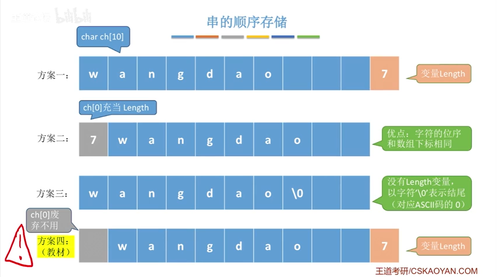
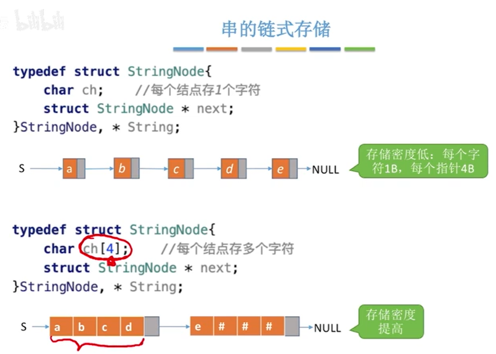
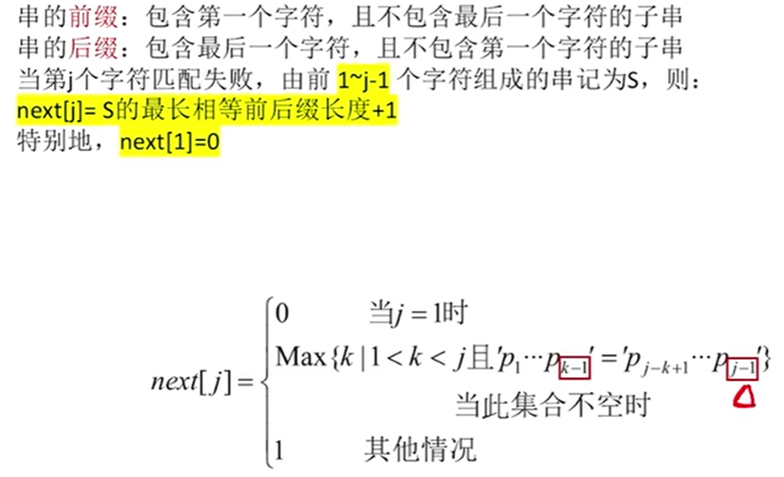
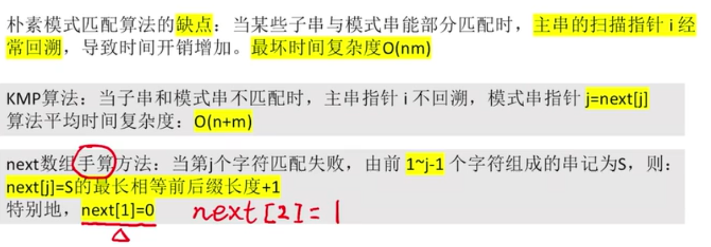
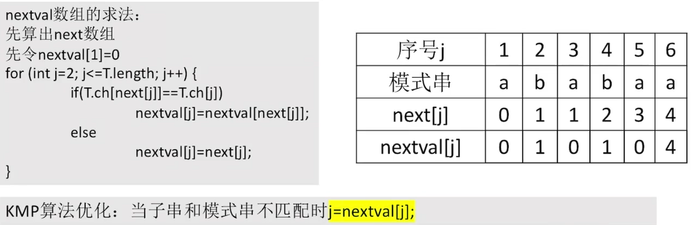

[TOC]

# 5.	串

## 5.0	概念

### 5.0.1	串

串，即字符串(String)，是由零个或多个字符组成的有限序列。一般记为$S='a_1a_2…a_n'(n≥0)$，

其中S是串名，单引号括起来的字符序列是串的值，a~i~可以是字母、数字或其他字符；

串中字符个数n称为串的长度，当n=0时称为空串，用∅表示

### 5.0.2	子串

子串是串中**任意个连续的**字符组成的子序列，空串也是子串

主串：包含子串的串

字符在主串中的位置：字符在串中的序号，==从1开始==

子串在主串中的位置：子串中第一个字符在主串中的位置

### 5.0.3	串与线性表的关系

- 串是一种特殊的线性表，数据元素间呈线性关系
- 串的数据对象限定为字符集（如中文字符、英文字符、数字字符、标点字符等）
- 串的基本操作，如增删改查等，==通常以子串为操作对象==

## 5.1	串的存储结构

### 5.1.1	顺序存储

顺序存储分为两种：

- 静态数组：定长顺序存储
- 动态数组：堆分配存储（需要手动释放内存空间）

方案一：使用额外变量Length记录数组长度，数组从0开始存放串，优点是存储密度最大，且能直接获取数组长度

方案二：在ch[0]存放数组长度，优点是此时字符位序与数组下标相同，缺点是最大能表示的串长度为255

方案三：以'\0'表示字符串结尾，缺点是要获取数组长度必须遍历数组

（默认方案）方案四：数组从1开始存放串，使用额外变量Length记录数组长度，此时可以直接获取数组长度而没有限制，且字符位序与数组下标相同

### 5.1.2	链式存储

## 5.2	串的模式匹配

### 5.2.1	朴素模式匹配

### 5.2.2	KMP

### 5.2.3	改进KMP

