[TOC]

# 6.	树与二叉树

## 6.0	树的概念

空树：节点数为0的树

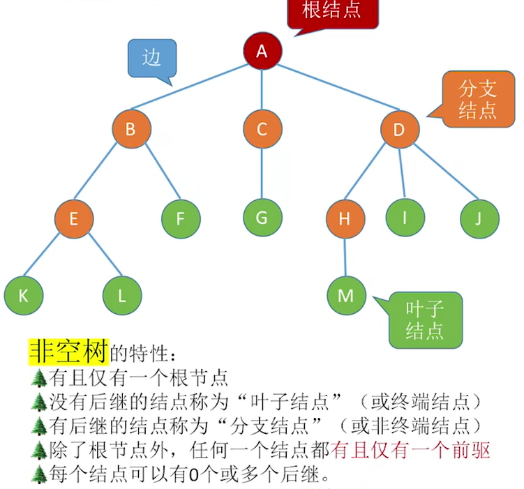

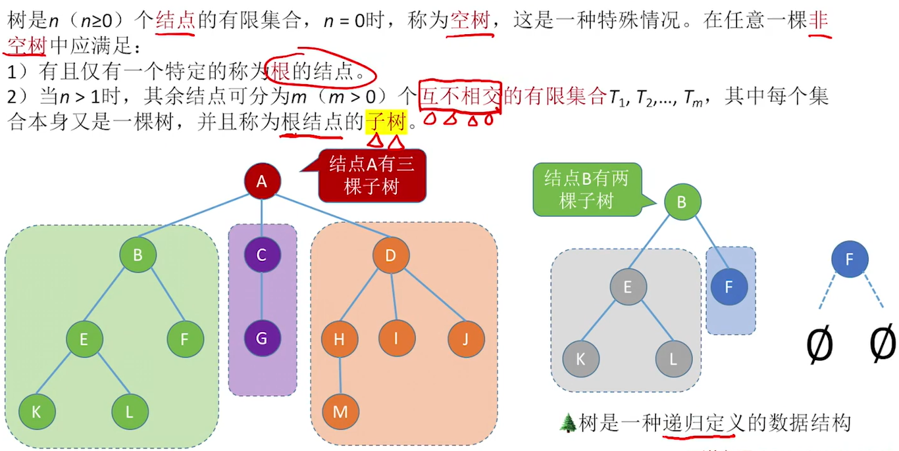

### 6.0.1	树形逻辑结构的应用

思维导图、家谱、行政区（职位）隶属关系

文件系统


### 6.0.2	结点、树的属性描述

- 结点的层次（深度）：从上向下数，默认从1开始
- 结点的高度：从下向上数，默认从1开始
- 树的高度（深度）：最大结点层次
- 结点的度：当前结点的分支数（孩子数）
- 树的度：最大结点度


### 6.0.3	有序树与无序树

有序树：逻辑上，树中结点各子树从左至右有次序，不能互换

无序树：逻辑上，树中结点的各子树从左至右无次序，可以互换

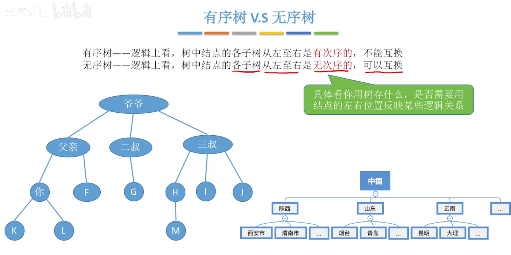

使用有序树或无序树取决于是否需要用结点位置表示逻辑关系


### 6.0.4	树与森林（树与森林的转化问题）

森林：$m(m≥0)$棵互不相交的树的集合


## 6.1	树的性质

### 6.1.1	树的性质

1.树的结点数 = 总度数+1

2.==度为m的树与m叉树的区别==：

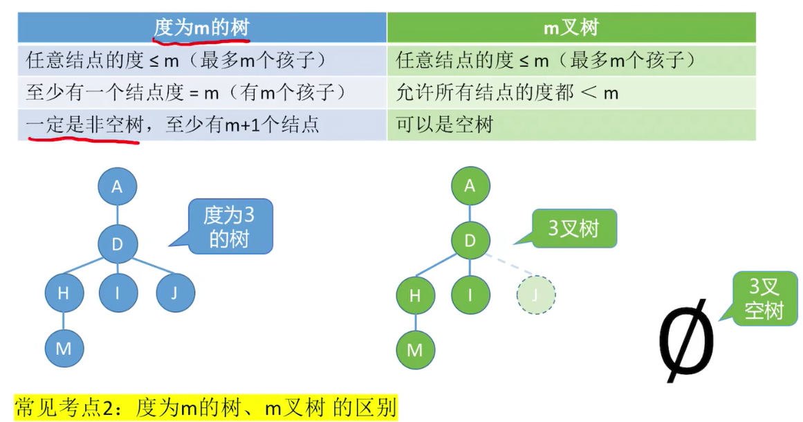


3.度为$m$的树，第$i$层至多有$m^{i-1}$个结点$(i≥1)$；

$m$叉树第$i$层至多有$m^{i-1}$个结点$(i≥1)$


4.高度为$h$的$m$叉树，至多有$\frac{m^h-1}{m-1}$个结点

> 等比数列求和公式：$a + aq + aq^2 +...+ aq^{n-1} = \frac{a(1-q^n)}{1-q}$
>
> 因此有：$1 + m + m^2 +...+ m^{h-1} = \frac{1 * (1 - m^h)}{1-m} = \frac{m^h-1}{m-1}$

5.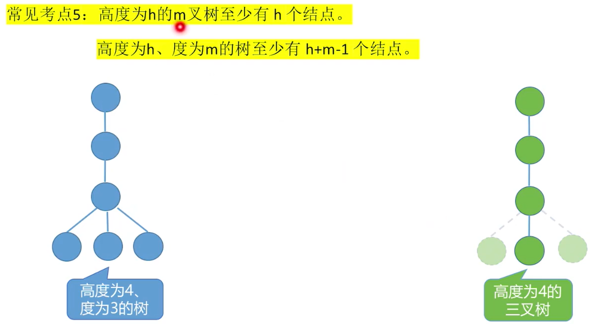


6.具有n个结点的m叉树最小高度为$\lceil log_m(n(m-1)+1) \rceil$

高度最小的情况：除最后一层外各结点都有m个孩子

> 前h-1层有结点数$\frac{m^{h-1}-1}{m-1}$个，若每一层除叶子结点外都有m个孩子，则有结点$\frac{m^h-1}{m-1}$个，
>
> 则有$\frac{m^{h-1}-1}{m-1} ＜ n ≤ \frac{m^h-1}{m-1}$，化简得$m^{h-1} < n(m-1)+1 ≤ m^h$，同时取对数得$h-1 < log_m(n(m-1)+1) ≤ h$，
>
> 可得$h_{min} = \lceil log_m(n(m-1)+1) \rceil$

### 6.1.2	考点总结

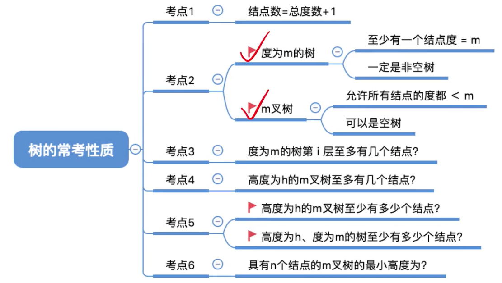


## 6.2	二叉树的概念

二叉树是$n(n≥0)$个结点的有限集合，

可以是空二叉树，此时$n=0$，

若二叉树非空，则是由一个根节点和两个互不相交的被称为根的左子树和右子树组成的。左子树和右子树又分别是一棵二叉树。


### 6.2.1	二叉树的特点

①各结点最多有两棵子树 

②**左右子树不能颠倒（二叉树是有序树）**(注意与度为2的有序树区分)


### 6.2.2	二叉树的五种状态

①空二叉树 ②只有根节点 ③只有左子树 ④只有右子树 ⑤左右子树都有


### 6.2.3	特殊二叉树

#### 6.2.3.1	满二叉树

除最后一层（除叶子结点）外，每个结点都有2个孩子

设树高度为$h$，则满二叉树有结点$2^h-1$个


##### 6.2.3.1.1	满二叉树的特点

①只有最后一层存在叶子结点

②不存在度为1的结点

③按层序从1开始编号，结点$i$的左孩子为$2i$，右孩子为$2i+1$，

若存在父节点，则父节点为$\lfloor \frac{i}{2} \rfloor$


#### 6.2.3.2	完全二叉树

当且仅当各节点都与 高度为$h$的满二叉树 中 按层序编号从1~n的结点 一一对应时，称为完全二叉树


##### 6.2.3.2.1	完全二叉树的特点

①只有最后两层可能有叶子结点

②最多只有一个度为1的结点（否则不满足1~n结点一一对应）

③同满二叉树特点③

④当$i ≤ \lfloor \frac{n}{2} \rfloor$时为分支节点，$i > \lfloor \frac{n}{2} \rfloor$时为叶子结点（$\lfloor \frac{n}{2} \rfloor$是倒数第二层最后一个有子树的分支节点）

⑤若某结点只有一个孩子，则一定为左孩子而不可能是右孩子（否则不是完全二叉树）

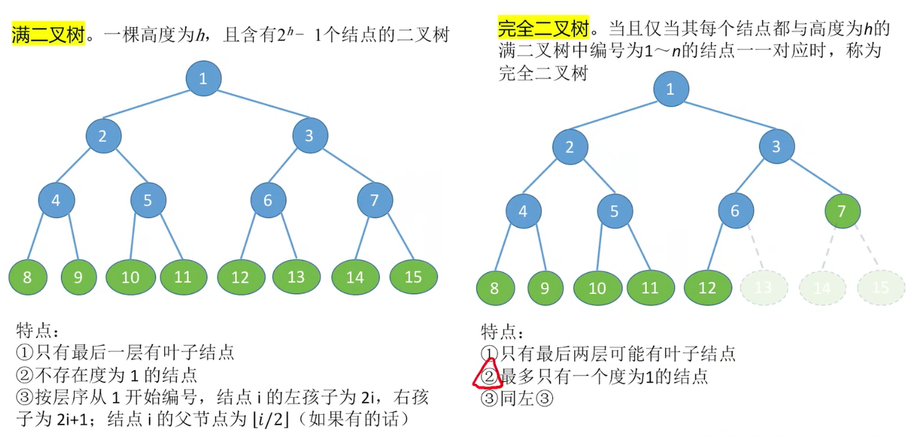

满二叉树一定是完全二叉树，完全二叉树不一定是满二叉树


#### 6.2.3.3	二叉排序树

二叉排序树常用于元素的排序和搜索

##### 6.2.3.3.1	二叉排序树的性质

①左子树上所有结点关键字均小于根节点的关键字

②右子树上所有结点关键字均大于根节点关键字

③左右子树各是一棵二叉排序树


#### 6.2.3.4	平衡二叉树

平衡二叉树上**任一结点左右子树深度之差不超过1**

平衡二叉树具有更高的搜索效率

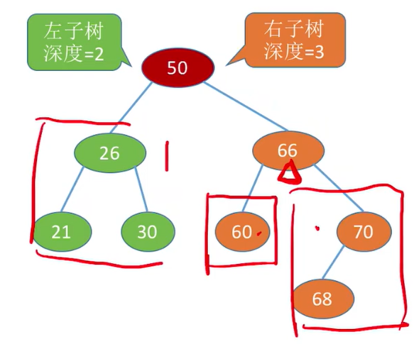


## 6.3	二叉树的性质

### 6.3.1	二叉树的性质

1. 设非空二叉树中度为0、1、2的结点个数分别为$n_0$、$n_1$、$n_2$，则有$n_0 = n_2 +1$

即叶子结点比二分支结点多一个

> 设二叉树的总结点数为$n$，则有$n = n_0 + n_1 + n_2$，
>
> 又因为树的结点数等于总度数+1，则有$n = n_1 + 2n_2 + 1$
>
> 由此可得上式$n_0 = n_2 +1$

2. 二叉树第$i$层至多有$2^{i-1}(i≥1)$个结点

> m叉树第$i$层至多有$m^{i-1}$个结点


### 6.3.2	完全二叉树的性质

1. 具有$n(n>0)$个结点的完全二叉树高度$h$为$\lceil log_2(n+1) \rceil$

（第$i$个结点所在层次为$\lceil log_2(i+1) \rceil$

2. 对完全二叉树，可以根据其总结点数$n$分别求得其度为0、1、2的结点数$n_0$、$n_1$、$n_2$

> 因为完全二叉树至多有一个度为1的结点，即$n_1=0或1$
>
> 又有$n_0 = n_2 +1$
>
> 因此当完全二叉树有$2k$（偶数）个结点时，$n_1=0,n_0=k,n_2=k-1$
>
> 当完全二叉树有$2k+1$（奇数）个结点时，$n_1=1,n_0=k,n_2=k-1$


## 6.4	二叉树的存储结构

### 6.4.1	顺序存储

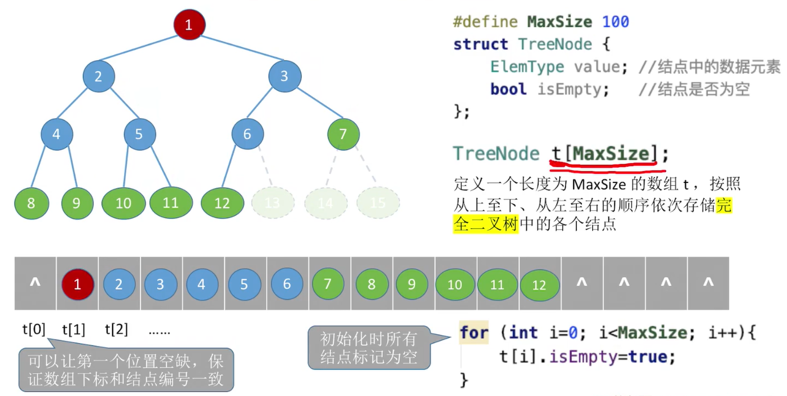

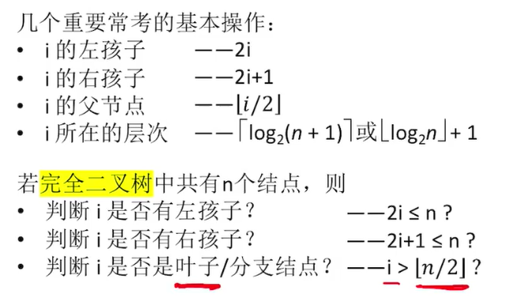

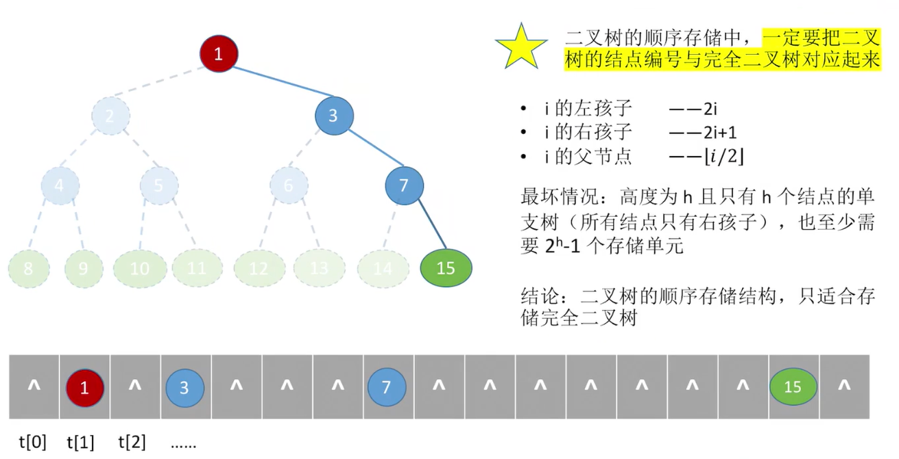


### 6.4.2	链式存储

```c
typedef struct BiTNode{
    datatype data;
    struct BiTNode *lchild, *rchild;
    //Add this attribute If (parent Node is often required)
    //struct BiTNode *parent; 
}BinTreeNode, *BinTree;
```

由于一个结点有两个指针域，因此有n个结点的二叉树有n+1个空链域，可以用于构造线索二叉树


## 6.5	二叉树的遍历

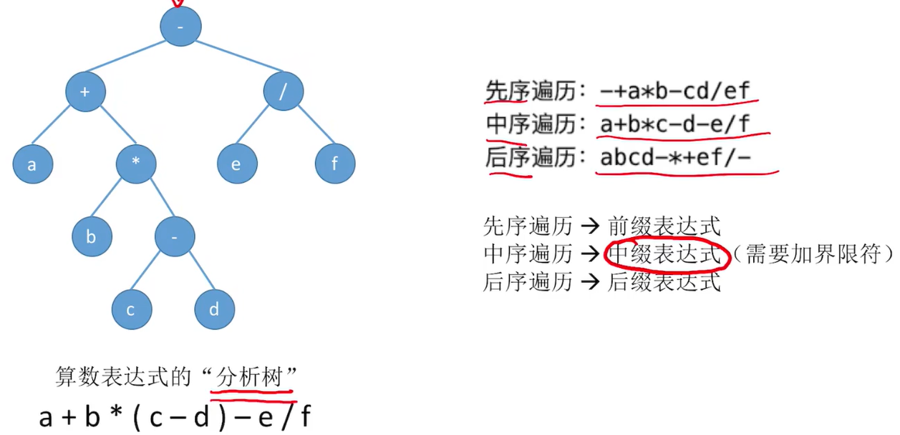

### 6.5.1	先序遍历（根左右）

### 6.5.2	中序遍历（左根右）

### 6.5.3	后序遍历（左右根）

### 6.5.4	层序遍历（队列）

算法思想：

①初始化一个队列

②根节点入队

③若队列非空，则队头结点出队，访问该节点，并将其左右孩子入队

④重复③直到队列为空


## 6.6	由遍历序列构造二叉树

前/中/后序遍历序列，若只有其中一种，无法唯一确定一棵二叉树；

而由前序、后序、层序中任意一种+中序遍历序列可得到一棵唯一确定的二叉树


### 6.6.1	前、中序遍历序列构造二叉树

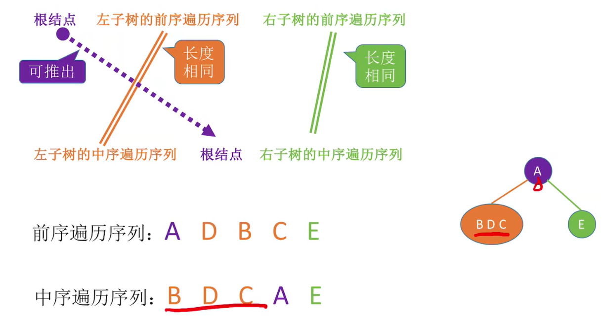

> 前序遍历序列：根结点、左子树的前序遍历序列、右子树前序遍历序列
>
> 中序遍历序列：左子树中序遍历序列、根结点、右子树中序遍历序列
>
> 前序遍历序列第一个结点是根结点，对应找到中序遍历序列中根结点位置，
>
> 中序遍历序列中根结点左侧为根结点的左子树，右侧为根结点的右子树，以此类推


### 6.6.2	中、后序遍历序列构造二叉树

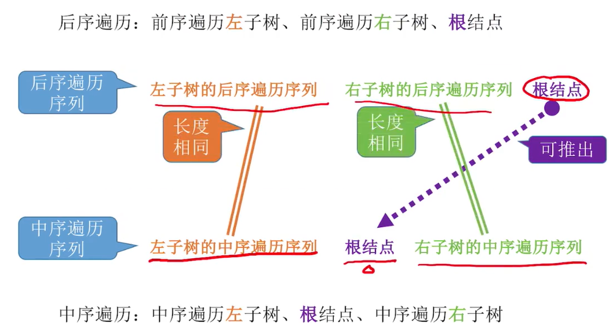

> 中序遍历序列：左子树中序遍历序列、根结点、右子树中序遍历序列
>
> 后序遍历序列：左子树后序遍历序列、右子树后序遍历序列、根结点
>
> 后序遍历序列最后一个结点是根结点，对应找到中序遍历序列中根结点位置，
>
> 中序遍历序列中，根结点左侧为左子树的中序遍历序列，右侧为右子树的中序遍历序列，以此类推


### 6.6.3	层序、中序遍历序列构造二叉树

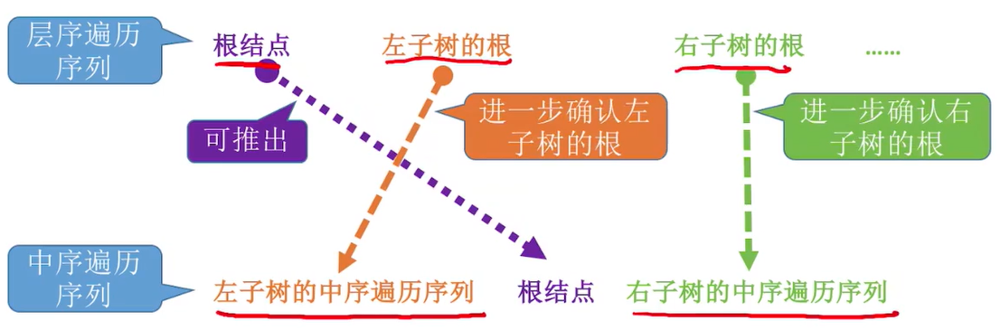

> 中序遍历序列：左子树中序遍历序列、根结点、右子树中序遍历序列
>
> 层序遍历序列：根结点、左子树的根、右子树的根
>
> 层序序列第一个结点是根结点，对应找到中序遍历序列中根结点位置
>
> 中序遍历序列中，根结点左侧为左子树中序遍历序列，右侧为右子树中序遍历序列


## 6.7	线索二叉树

普通二叉树存在的问题：要遍历整个二叉树必须从根结点开始，因此要寻找某结点的前驱、后继结点很不方便

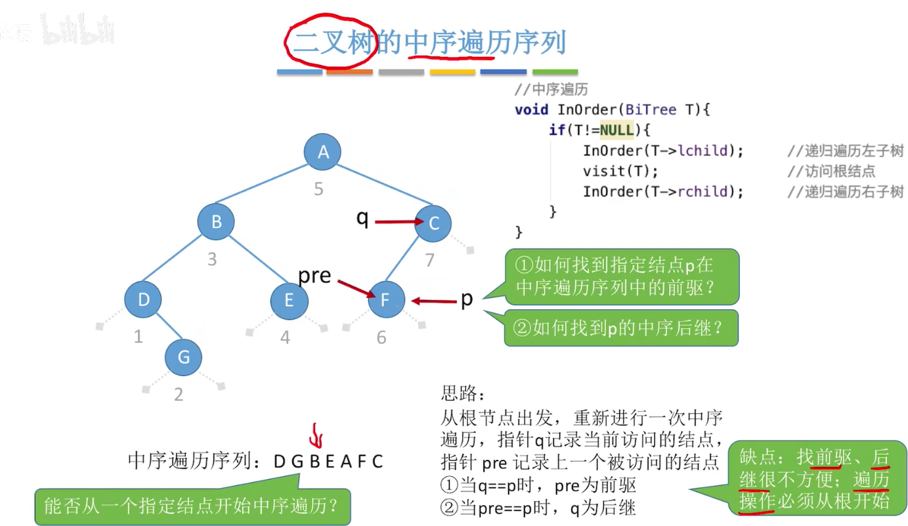


为了解决这一问题，提出了线索二叉树，将原本为空的指针域重新利用，左右子树域分别存放其前驱、后继结点所在位置

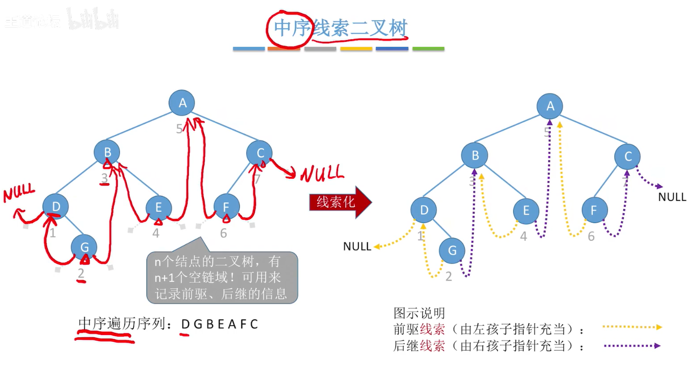

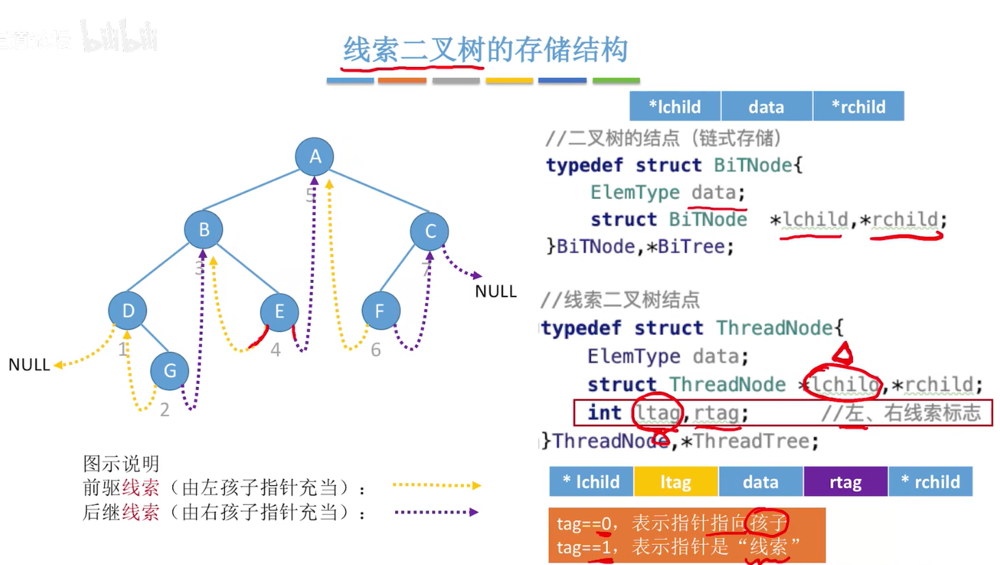

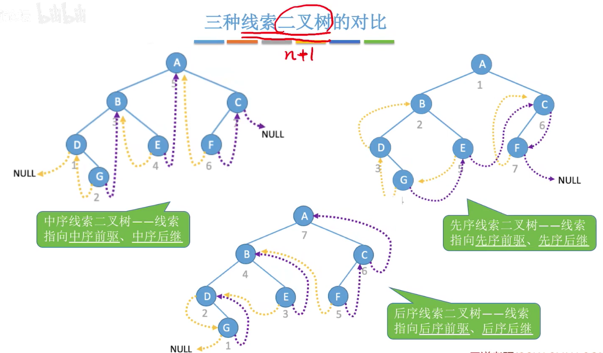


### 6.7.1	构造线索二叉树

#### 6.7.1.1	中序线索化


#### 6.7.1.2	先序线索化

##### 6.7.1.2.1	先序前驱

==在不改变结构体定义的前提下，当ltag == 0时，先序线索二叉树找不到前驱结点==

要找到前驱结点，就要使用三叉链表，在结构体定义中添加指针parent，指向其父结点

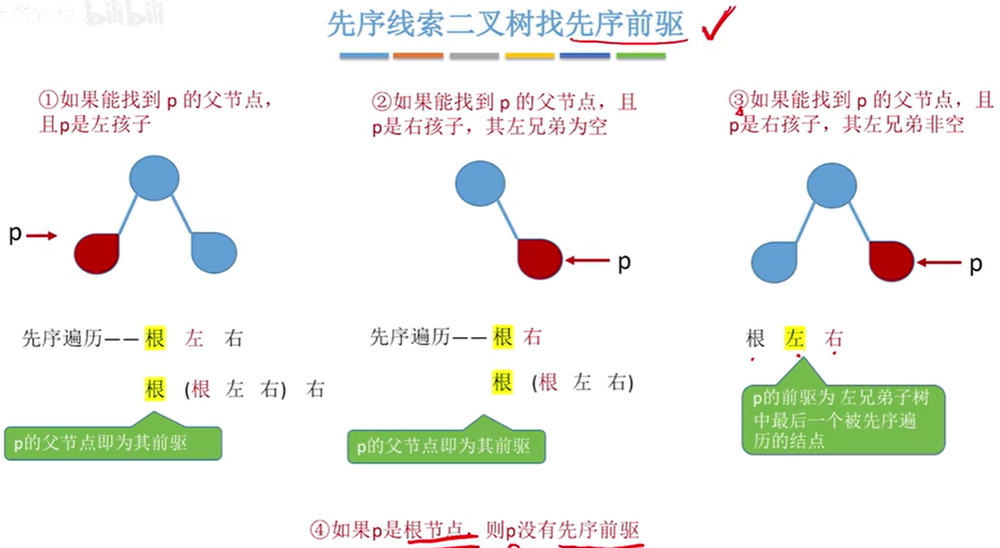

#### 6.7.1.3	后序线索化

##### 6.7.1.3.1	后序前驱

当ltag==0时，此时结点必有左孩子，

若有右孩子，则前驱结点为右孩子；否则为左孩子


##### 6.7.1.3.2	后序后继

由于在后序遍历中，左右子树中结点一定在根之前，即只可能是根的前驱，不可能是后继

因此==在不改变结构体定义的前提下，当rtag == 0时，要找到后继结点只能通过遍历整棵二叉树获取==


要找到后序后继，就要使用三叉链表，在结构体定义中添加父结点指针parent：

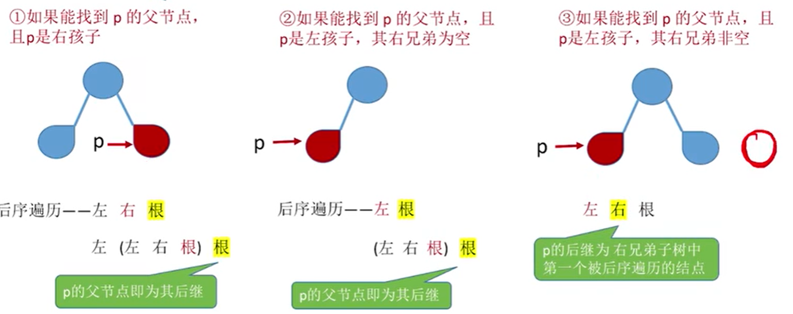


#### 6.7.1.4	总结

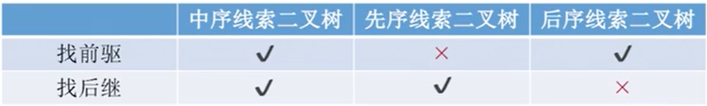

**x表示没有简单办法寻找，只能通过修改结构体为三叉链表，添加父结点指针；或使用全局遍历结点的办法获取**


## 6.8	树的存储结构

### 6.8.1	双亲表示法（顺序存储）

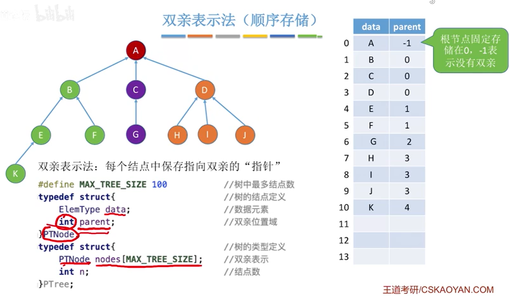

优点：可以快速找到指定结点的父结点

缺点：要找到指定结点的子结点必须遍历整个数组


### 6.8.2	孩子表示法（顺序存储+链式存储）

顺序存储各结点，各结点中保存孩子结点的链表头指针

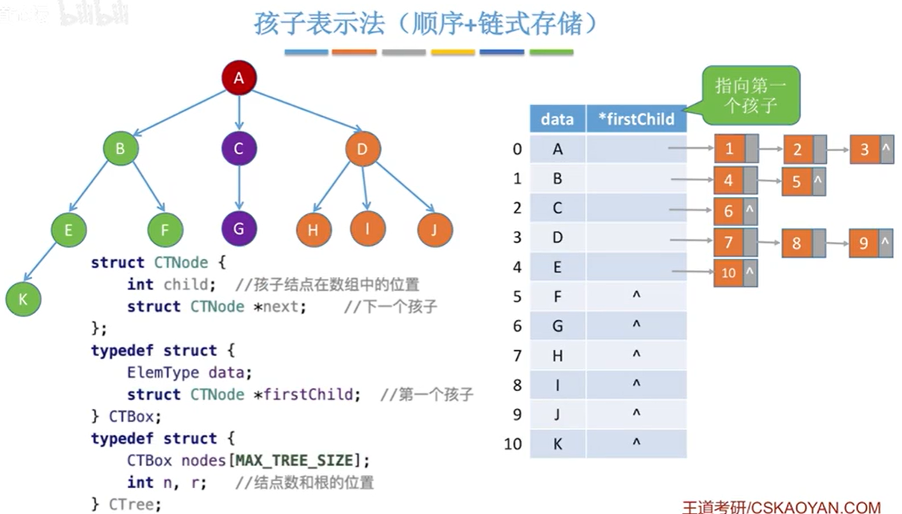

优点：可以快速找到当前结点的所有子节点

缺点：要寻找父结点必须遍历数组


### （重点）6.8.3	孩子兄弟表示法（链式存储）

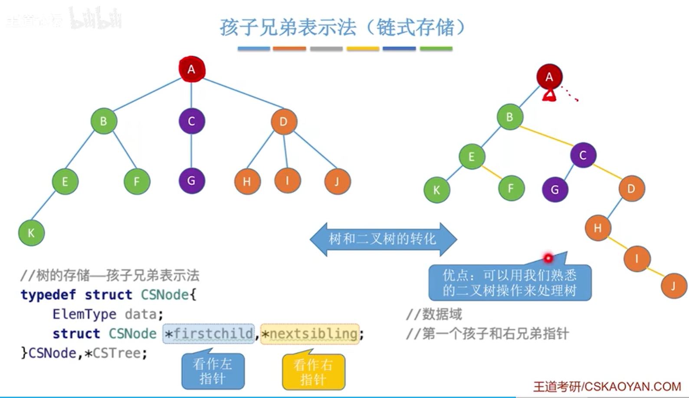

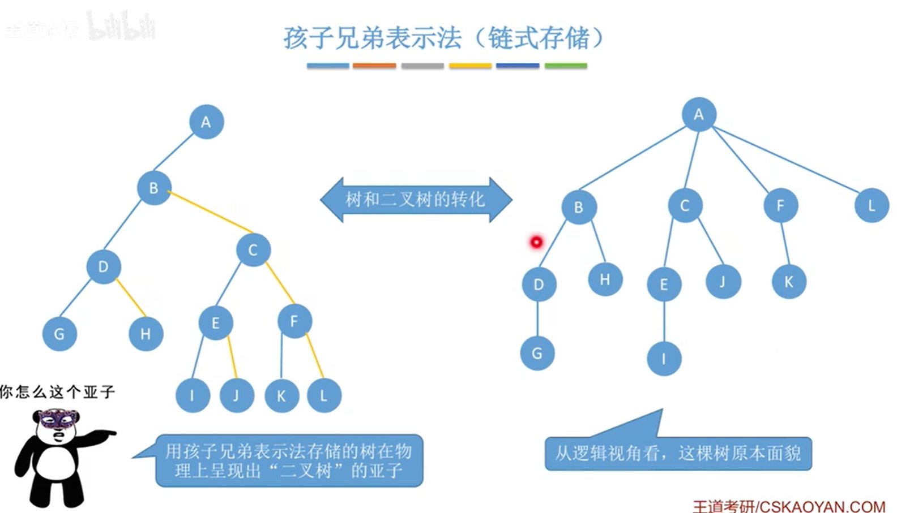


## 6.9	森林和二叉树的转换

森林是非负棵互不相交的树的集合

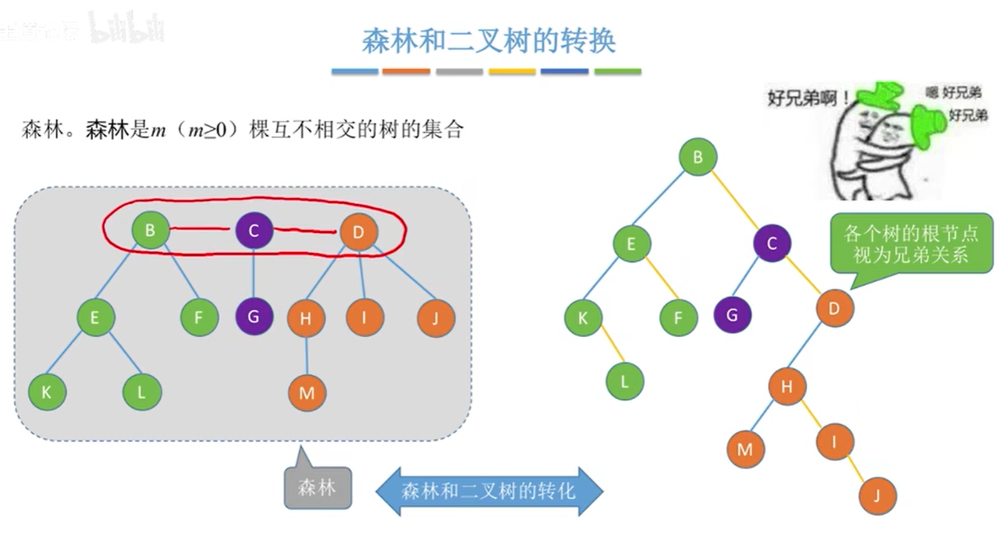

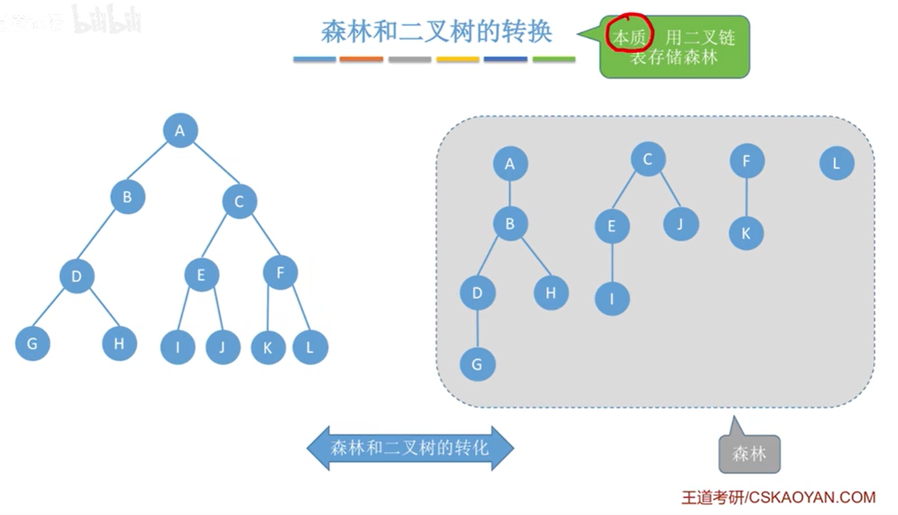


## 6.10	树和森林的遍历

### 6.10.1	树的遍历

#### 6.10.1.1	深度优先遍历

##### 6.10.1.1.1	树的先根遍历

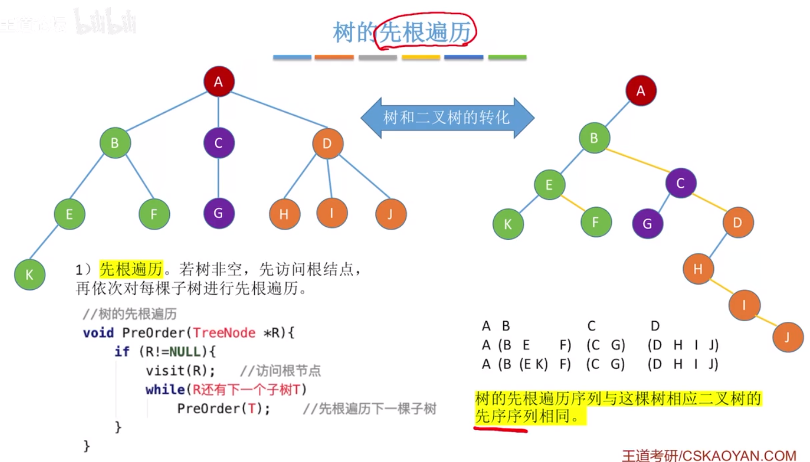


##### 6.10.1.1.2	树的后根遍历

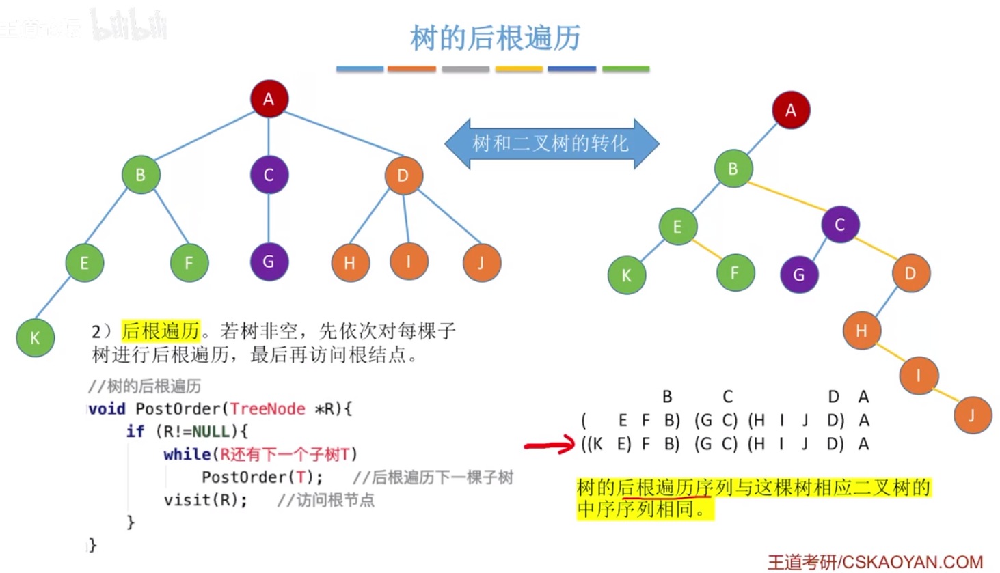

#### 

#### 6.10.1.2	广度优先遍历

##### 6.10.1.2.1	树的层次遍历


### 6.10.2	森林的遍历

#### 6.10.2.1	森林的先序遍历

若森林非空，则**从左向右依次对各子树进行树的先根遍历**

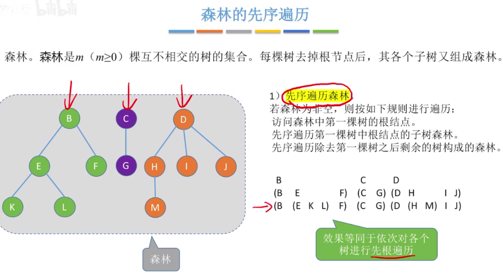


#### 6.10.2.2	森林的中序遍历

若森林非空，则从左向右依次对各子树进行树的后根遍历

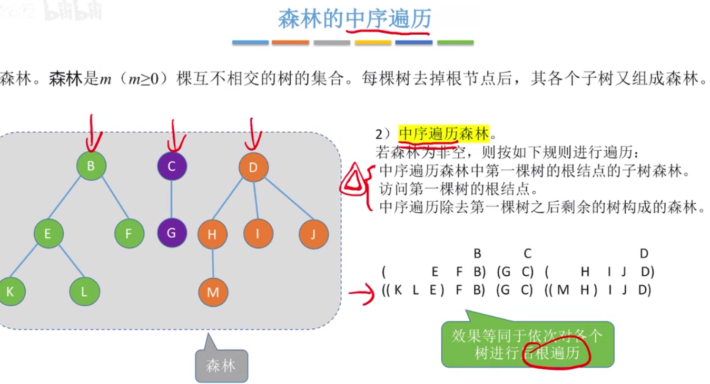


#### 6.10.2.3	森林算法题

要写算法遍历森林，可以将森林转化为二叉树再进行遍历

森林转化为二叉树详见6.8.3孩子兄弟表示法、6.9森林和二叉树的转换


## 6.11	二叉排序树BST

二叉排序树可以有效实现元素的有序组织和搜索

二叉排序树的特点：$左子树结点值<根结点值<右子树结点值$

==对二叉排序树使用中序遍历，可以得到递增有序序列==

==按不同顺序插入同一组值，得到的二叉排序树可能相同，可能不同==

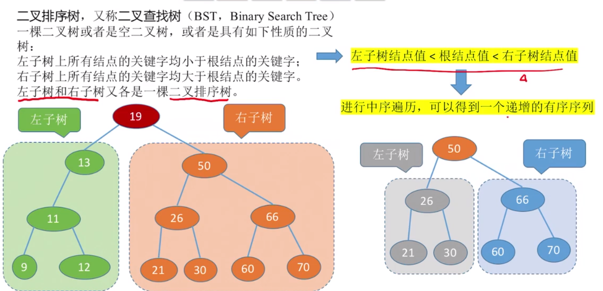


### 6.11.1	二叉排序树的删除

删除二叉排序树中结点需要分情况讨论：

①删除叶子结点：直接删除即可

②删除结点只有左（右）子树：让其左（右）子树替代原位置即可

③删除结点既有左子树又有右子树：

- 方法一：令该结点的（中序遍历）直接前驱替代，即其左子树最右下结点，该结点一定没有右子树
- 方法二：令该结点的（中序遍历）直接后继替代，即其右子树最左下结点，该结点一定没有左子树


### 6.11.2	查找长度

在查找运算中，需要对比关键字的次数称为查找长度，反映了查找操作的时间复杂度

要度量查找算法的好坏，可以使用平均查找长度ASL

#### 6.11.2.1	查找成功的平均查找长度

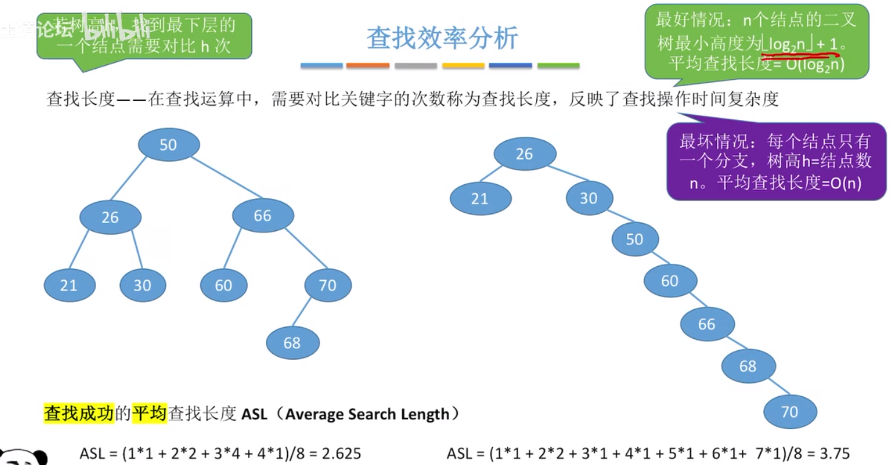

#### 6.11.2.2	查找失败的平均查找长度

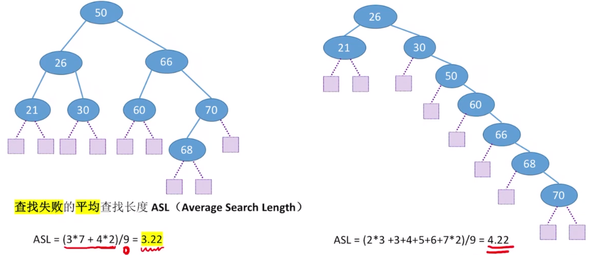

二叉排序树越丰满，平均查找长度越小，查找效率越高

因此要提高二叉排序树的查找效率，就要在构造二叉排序树时尽量平衡


## 6.12	平衡二叉树AVL

平衡二叉树简称平衡树，树上任一结点的左右子树高度之差不超过1

$结点的平衡因子 = 左子树高度 - 右子树高度$

因此平衡二叉树的平衡因子只可能为-1、0、1，任一结点平衡因子绝对值大于1的树不是平衡二叉树

```c
typedef struct AVLNode {
    int data;
    int balance;
    struct AVLNode* lchild, * rchild;
}AVLNode, *AVLTree;
```

==平衡排序二叉树的查找效率为==$O(log_2n)$


### 6.12.1	调整最小不平衡子树

排序二叉树插入结点后调整为平衡二叉树的思路：

从插入点向上找到第一个不平衡的结点，调整以该结点为根的子树，即每次调整的对象都是最小不平衡子树

只要将最小不平衡子树调整平衡，其他祖先结点也会恢复平衡


调整最小不平衡子树的目标：

①恢复平衡 ②保持二叉排序树的特性

#### 6.12.1.1	在A左孩子的左子树插入导致不平衡LL

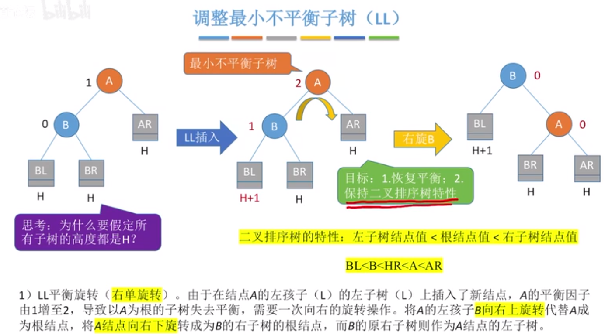

#### 6.12.1.2	在A右孩子的右子树插入导致不平衡RR

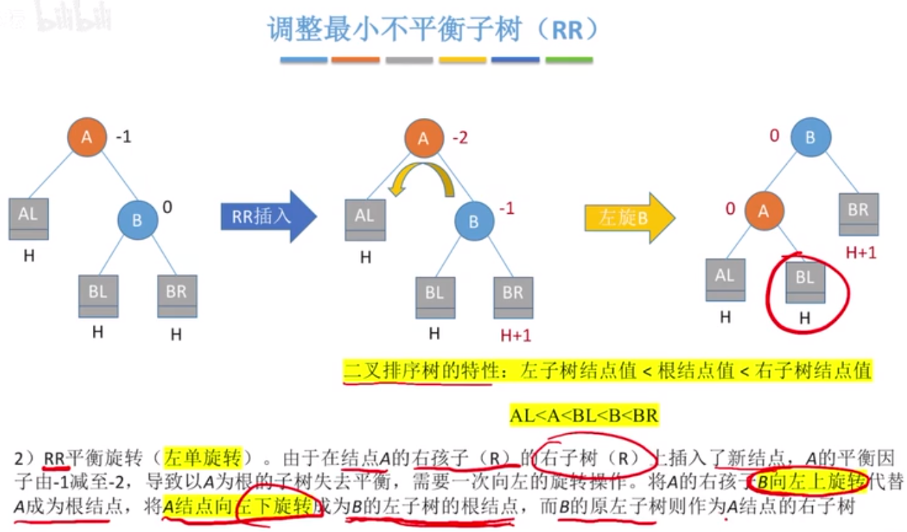

#### 6.12.1.3	LL、RR问题算法思路

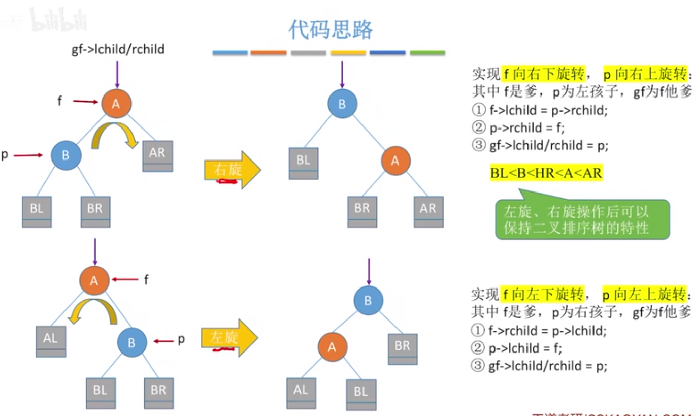

#### 6.12.1.4	在A左孩子的右子树插入导致不平衡LR

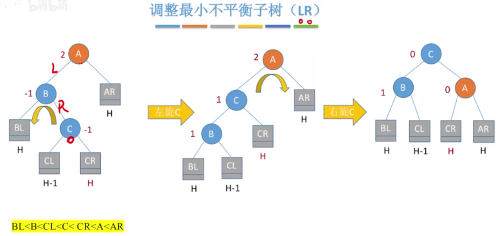

#### 6.12.1.5	在A右孩子的左子树插入导致不平衡RLL

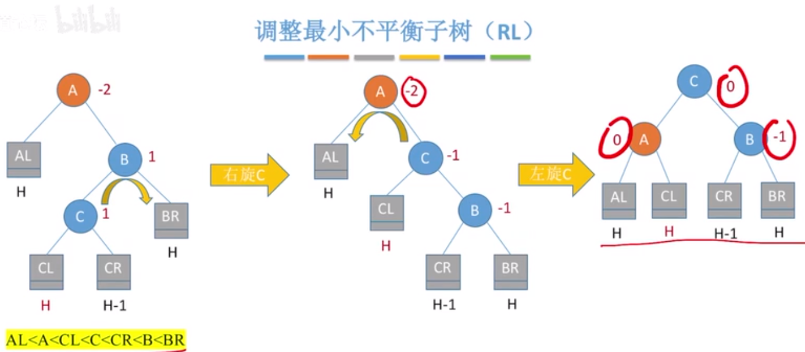

#### 6.12.1.6	总结

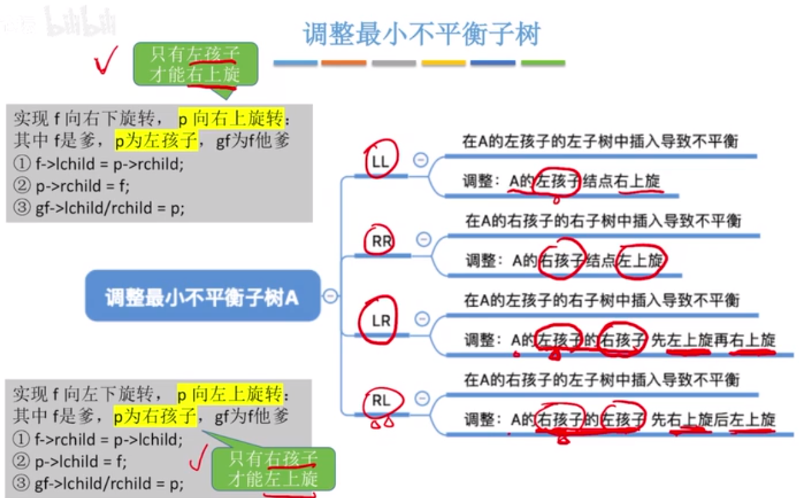


### 6.12.2	查找效率分析

若树高为h，则最坏情况下查找一个关键字最多对比h次，即时间复杂度不超过O(h)


假设$n_h$是深度为$h$的平衡树中含有的最少结点数，

由于平衡树中任一结点左右子树高度差不超过1，

则有$n_0=0, n_1=1, n_2=2$，并且有$n_h=n_{h-1}+n_{h-2}+1$

因此，一棵含有$n$个结点的平衡树最大深度为$log_2n$，平均查找长度为$O(log_2n)$


## 6.13	哈夫曼树

### 6.13.1	带权路径长度

结点的权：有某种现实含义的数值（如表示结点的重要性等）

结点的带权路径长度：从树的根到该结点的路径长度（经过的边数），与该结点上权值的乘积

树的带权路径长度：树中所有叶子结点的带权路径长度之和(WPL, Weighted Path Length )
$$
\begin{equation*}
{WPL} = \sum_{n=1}^N{w_il_i}
\end{equation*}
$$
在有$n$个**带权叶子结点**的二叉树中，其中==带权路径长度(WPL)最小的二叉树称为哈夫曼树==，也称最优二叉树

注意**哈夫曼树不唯一**


### 6.13.2	构造哈夫曼树

给定$n$个带权结点，构造哈夫曼树的算法描述如下：

①将这$n$个结点看作$n$棵只有根结点的二叉树，构成森林F

②每次从森林中选出根结点权值最小的两棵树，作为新结点的左右子树（左右顺序任意），新结点的权值为其左右子树上根结点权值之和

③从森林F中删除刚才选出的两棵树，将新产生的树加入森林F

④重复步骤②和③，直至森林F中只剩一棵树

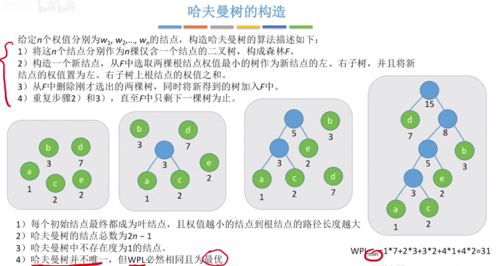


### 6.13.3	哈夫曼编码

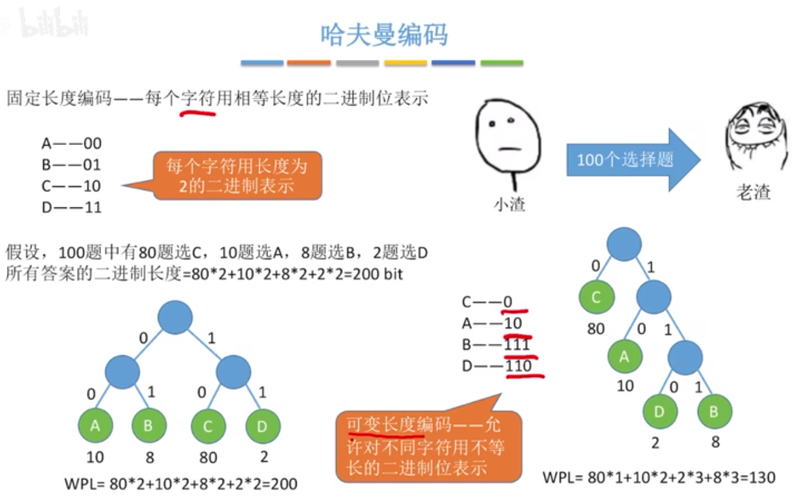

固定长度编码：每个字符用等长的二进制位表示

可变长度编码：允许对不同字符用不等长的二进制位表示

前缀编码：没有一个编码是另一个编码的前缀

非前缀编码在解码时可能会产生歧义

通过哈夫曼树得到哈夫曼编码：字符集中每个字符作为一个叶子结点，字符出现频度作为结点权值，构造出哈夫曼树，这样

要注意哈夫曼树不唯一，因此哈夫曼编码不唯一

哈夫曼编码可以用数据的压缩
