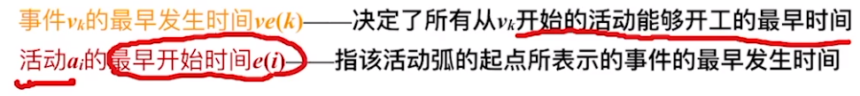
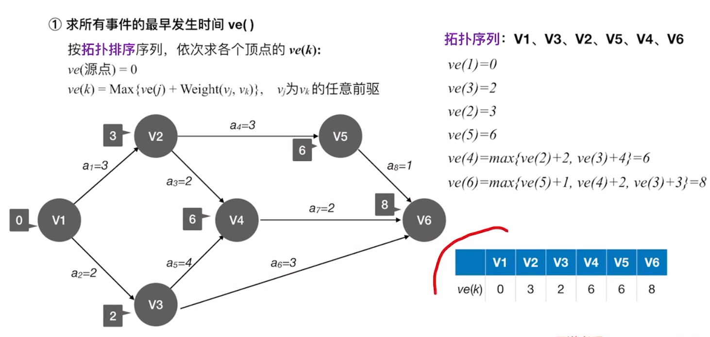

# 7.	图

## 7.0	概念

> Graph、Vertex、Edge

图G由顶点集V和边集E组成，记作G = (V, E)，

其中V(G)表示图G中顶点的**有限非空集**；E(G)表示图G中顶点之间的关系集合。

**若$V = {v_1, v_2,..., v_n}$，则用$|V|$表示图G中顶点个数，也称图G的阶**

**$E = {(u,v)|u∈V, v∈V}$，用$|E|$表示图G边数**

注意：图的顶点集V必须非空，而边集E可空


### 7.0.1	有向图和无向图

- 若$E$是无向边（边）的有限集合时，图G为无向图。边是顶点的无序对，记为$(v,w)或(w,v)$，且$(v,w)=(w,v)$，其中$v,w$是顶点，可以说顶点$v$和顶点$w$互为邻接点

- 若$E$是有向边（弧）的有限集合时，图G为有向图。弧是顶点的有序对，记为$<v,w>$，且$<v,w>≠<w,v>$，$v$称为弧头，$w$称为弧尾，$<v,w>$是从顶点$v$到顶点$w$的弧，也称$v$邻接到$w$，或$w$邻接自$v$


### 7.0.2	简单图和多重图

简单图：①无重复边 ②无顶点到自身的边

多重图：图G中某两顶点间边数多于一条，允许顶点通过同一条边和自己关联

默认情况下，我们讨论的图都是简单图


### 7.0.3	顶点的度、出度、入度

对无向图：顶点$v$的度指依附于该顶点的边的条数，记为$TD(v)$

在有$n$个顶点、$e$条边的无向图中，各顶点度之和等于两倍的边数，即
$$
\begin{equation*}
\sum_{n=1}^NTD(v_i) = 2e
\end{equation*}
$$


对有向图：入度指以顶点$v$为终点的有向边数目，记为$ID(v)$；出度指以顶点$v$为起点的有向边数目，记为$OD(v)$；顶点$v$的度等于其入度和出度之和，即$TD(v) = ID(v) + OD(v)$

在有$n$个顶点、$e$条边的有向图中，各顶点入度之和等于出度之和等于图的边数，即
$$
\begin{equation*}
\sum_{n=1}^NID(v_i) = \sum_{n=1}^NOD(v_i) = e
\end{equation*}
$$

### 7.0.4	顶点-顶点关系描述

路径：顶点$v_p$到顶点$v_q$之间的一条路径是指路径序列$v_p, v_{i1}, v_{i2}, ..., v_{im}, v_q$

- 顶点之间可能不存在路径
- 有向图的路径也是有向的

回路：第一个顶点和最后一个顶点相同的路径，称为回路或环


简单路径：在路径序列中，顶点不重复出现的路径

简单回路：除第一个顶点和最后一个顶点外，其余顶点不重复出现的回路


路径长度：路径上边的长度

点到点的距离：从顶点$u$出发到顶点$v$的最短路径若存在，则此路径长度称为从$u$到$v$的距离；若从$u$到$v$不存在路径，则记该路径为无穷$(∞)$


连通：无向图中，若从顶点$v$到顶点$w$有路径存在，则称$v$和$w$是连通的

强连通：有向图中，若从顶点$v$到顶点$w$和从顶点$w$到顶点$v$之间都有路径，则称两个顶点是强连通的


连通图、非连通图：若图G中任意两顶点都是连通的，则称图G为连通图，否则为非连通图

> 对有$n$个顶点的无向图G，
>
> 若G为连通图，则至少有$n-1$条边
>
> 若G为非连通图，则最多有$C_{n-1}^2$条边

强连通图：若有向图G中任意一对顶点都是强连通的，则称为强连通图

> 对有$n$个顶点的有向图G，若G为强连通图，则至少有$n$条边（形成回路）


### 7.0.5	子图、连通分量、生成树

子图：设有两个图$G=(V,E)$和$G'=(V',E')$，若$V'$是$V$的子集，且$E'$是$E$的子集，则称$G'$是$G$的**子图**

> 注意：$G'$本身也必须满足图的定义

生成子图：若有满足$V(G')=V(G)$的子图$G'$，则称其为G的生成子图，即$G'$中包含$G$的全部顶点


连通分量：无向图中的极大连通子图称为**连通分量**

> 子图必须连通，且包含尽可能多的顶点和边

强连通分量：有向图中的极大强连通子图称为有向图的**强连通分量**


生成树：（无向图）连通图的生成树是**包含图中全部顶点**的一个**极小连通子图**

> 要包含图中全部顶点，边尽可能少，但要保持连通
>
> 若图中顶点数为$n$，则生成树有$n-1$条边。
>
> 对生成树，若减少一条边就会变成非连通图，加上一条边就会形成回路

生成森林：在**非连通图**中，连通分量的生成树构成了非连通图的**生成森林**


### 7.0.6	特殊的图

#### 7.0.6.1	完全图

无向完全图：无向图中任意两顶点间都存在边

> 若有$n$个顶点，则边数为$C_n^2 = \frac{n(n-1)}{2}$

有向完全图：有向图中任意两顶点间都存在方向相反的两条弧

> 若有$n$个顶点，则边数为$2C_n^2 = n(n-1)$


#### （了解）7.0.6.2	稀疏图和稠密图

稀疏图：边很少的图，一般认为$|E|<|V|log|V|$时，可以将G视为稀疏图

稠密图：边很多的图


### 7.0.6.3	树

树：不存在回路且连通的无向图，对n个顶点的树必有n-1条边

> n个顶点的图，若$|E|>n-1$则必有回路

有向树：一个顶点入度为0，其余顶点入度均为1的有向图

> 树是一种连通图，但有向树不是强连通图


### 7.0.7	总结


## 7.1	图的存储

### 7.1.1	邻接矩阵（顺序存储，稠密图）


#### 7.1.1.0	结构体定义

```c
#define MaxVertexNum 100
//Adjacency matrix
typedef struct{
    char vertex[MaxVertexNum];//Vertex table
    bool edge[MaxVertexNum][MaxVertexNum];//Edge table, Adjacency matrix
    int verNum, edgeNum;
}AMGraph;
```


#### 7.1.1.1	邻接矩阵存储带权图(网)

用边表结点值表示权值，若两顶点间有边连接则将权值存入；若没有边存在则存入0或无穷大（自定义数值）


#### 7.1.1.2	性能分析

空间复杂度$O(|V|^2)$——只与顶点数有关，与边数无关

==空间复杂度较高，因此邻接矩阵适合存储稠密图，不适合存储稀疏图==

对于无向图，其邻接矩阵是对称矩阵，可以用压缩对称矩阵存储的方式节省空间


#### 7.1.1.3	邻接矩阵的性质

1.对无向图：第$i$个结点的度 = 第$i$行或第$i$列非零元素个数

对有向图：   第$i$个结点的出度 = 第$i$行非零元素个数

​					 第$i$个结点的入度 = 第$i$列非零元素个数

​					 第$i$个结点的度 = 第$i$行非零元素个数与第$i$列非零元素个数之和

2.邻接矩阵求结点度/出度/入度的时间复杂度为$O(|V|)$

3.设图G的邻接矩阵为$A$，矩阵元素为0或1，则$A^n$的元素$A^n [i][j]$等于从顶点$i$到顶点$j$的长度为$n$的路径数目


### 7.1.2	邻接表法（顺序+链式存储，稀疏图）

类似于树的孩子表示法：


#### 7.1.2.0	结构体定义

```c
#define MaxVertexNum 100
//Adjacency list
typedef struct ArcNode{
    int vertex;//The node to point to
    struct ArcNode* next;//The next arc
    //int value;
}ArcNode;

typedef struct VNode{
    int data;
    ArcNode* first;//The first edge/arc
}VNode, AdjList[MaxVertexNum];

typedef struct{
    AdjList vertex;
    int verNum, arcNum;
}ALGraph;
```

用顺序表存储顶点，顶点结点中存放顶点信息和第一条边对应结点指针

用链表存储边，边结点中存放指向的顶点、下一条边，还可以存放权值


#### 7.1.2.1	邻接表的使用

对无向图，要求顶点的度（或寻找与另一个顶点相连的边）只需遍历对应顶点存储的边结点链表即可

对有向图，要求顶点出度（或寻找从该顶点出发的弧）只需遍历对应顶点存储的边结点链表即可

​					要求顶点入度（或寻找从某个结点指向该顶点的弧）需要遍历整个邻接表，时间复杂度高

对于一个给定的图，邻接表不唯一


#### 7.1.2.2	性能分析

对无向图，边结点ArcNode数量$2|E|$，空间复杂度$O(|V|+2|E|)$

对有向图，边结点ArcNode数量$|E|$，空间复杂度$O(|V|+|E|)$


对有向图，要求顶点入度（或寻找从某个结点指向该顶点的弧）需要遍历整个邻接表，时间复杂度高


### 7.1.3	邻接矩阵与邻接表的对比


### 7.1.4	十字链表（链式存储，有向图）


#### 7.1.5.1	性能分析

空间复杂度$O(|V|+|E|)$

### 

#### 7.1.5.2	十字链表使用

找指定顶点的入边：沿橙色路线

找指定顶点的出边：沿绿色路线

==十字链表只用于存储有向图==


### 7.1.5	邻接多重表（无向图）

#### 7.1.5.0	邻接矩阵和邻接表存在的问题

在存储无向图时，邻接矩阵空间复杂度高($O(|V|)^2$)

邻接表每条边对应两份冗余信息，在删除顶点、删除边等操作时时间复杂度高

为了解决这些问题，可以使用邻接多重表


#### 7.1.5.1	邻接多重表


#### 7.1.5.2	性能分析

空间复杂度$O(|V|+|E|)$

相比邻接表，删除边、删除节点操作很方便

==注意：邻接多重表只用于存储无向图==


### 7.1.6	四种存储方式对比


由于十字链表和邻接多重表实现方式较为复杂，因此考研中不会考察代码操作题

## 7.2	图的基本操作

此处我们只探讨基于邻接矩阵和邻接表的图的操作


```c
adjacent(G, x, y)：判断图G中是否存在边<x,y>或(x,y)
//邻接矩阵：判断A[x][y]是否为0即可，时间复杂度O(1)，
//邻接表：遍历结点x对应的边链表，最好时间复杂度O(1)，最坏时间复杂度O(|V|)
    
neighbors(G, x)：列出图G中与结点x邻接的边
//对无向图：
//邻接矩阵：遍历第x行或第x列，找出所有非零结点，时间复杂度O(|V|)
//邻接表：遍历结点x对应的边链表，最好时间复杂度O(1)，最坏时间复杂度O(|V|)
    
//对有向图：
//邻接矩阵：要找出边只需遍历第x行，要找入边只需遍历第x列，时间复杂度都为O(|V|)
//邻接表：找出边方法同上，最好时间复杂度O(1)，最坏时间复杂度O(|V|)
    	//找入边需遍历全部边结点，时间复杂度O(|E|)

insertVertex(G, x)：在图G中插入结点x
//邻接矩阵：新增一行一列，时间复杂度O(1)
//邻接表：新增一个顶点结点，时间复杂度O(1)
    
deleteVertex(G, x)：从图G中删除结点x
//邻接矩阵：在结构体中添加一个bool类型，长度为MaxVertexNum的一维数组，用于标记该结点是否可用，当结点被删除时只需将该数组中对应位置设为false，再将第i行和第i列所有元素都设为0，时间复杂度O(|V|)
//邻接表：
    //对无向图：
    //若该结点有边则先遍历顶点结点表，遍历所有边结点，删除所有与该节点相连的边结点
    //再遍历该结点的边链表，删除所有边结点，最后从顶点结点表中删除该顶点结点
    //最好情况，即该顶点没有边时，时间复杂度O(1)
    //最坏情况，当所有边都与该顶点相连时，时间复杂度O(|E|)
    //对有向图：
    //要删除出边：只需遍历该结点边链表并删除即可，时间复杂度O(1)~O(|V|)
    //要删除入边：需要遍历所有边结点，找出指向该结点的删除，时间复杂度O(|E|)

addEdge(G, x, y)：若无向边(x,y)或有向边<x,y>不存在，则向图G中添加该边
//邻接矩阵：将A[x][y]置为1或权值即可，时间复杂度O(1)
//邻接表：使用头插法，时间复杂度O(1)
    
firstNeighbor(G, x)：求图G中顶点x的第一个邻接点，若有返回顶点号，若没有邻接点或无顶点x则返回-1
//对无向图：
	//邻接矩阵：扫描第x行或第x列有无非零元素即可，时间复杂度O(1)~O(|V|)
	//邻接表：判断该顶点结点中指针域是否为空即可，时间复杂度O(1)
//对有向图：
    //邻接矩阵：要找出边扫描第x行，要找入边扫描第x列，时间复杂度O(1)~O(|V|)
    //邻接表：要找出边扫描该顶点结点指针域，时间复杂度O(1)
    		//要找入边扫描所有边结点，时间复杂度O(1)~O(|E|)
    
nextNeighbor(G, x, y)：在图G中寻找对顶点x，继顶点y后下一个邻接点，返回顶点号，若y是x最后一个邻接点返回-1
//邻接矩阵：扫描第x行或第x列，时间复杂度O(1)~O(|V|)
//邻接表：判断当前边结点有无下一个边结点，时间复杂度O(1)
    
get_edge_value(G, x, y)：获取图G中边(x,y)或<x,y>的权值
set_edge_value(G, x, y, v)：设置图G中边(x,y)或<x,y>的权值为v
//思路与adjacent(G, x, y)类似
```


## 7.3	广度优先遍历BFS

### 7.3.1	树与图的广度优先遍历


树的广度优先遍历，即层序遍历，在遍历中不存在回路

==图的广度优先遍历，在遍历中可能出现回路==，为了解决这个问题，需要对已访问过的节点进行标记


### 7.3.2	实现思路


### 7.3.3	广度优先遍历序列


### 7.3.4	代码实现


### 7.3.5	性能分析

对于无向图，调用BFS的次数=连通分量数

空间复杂度：空间开销主要在于队列，最坏情况为$O(|V|)$

时间复杂度：

- 对邻接矩阵：时间开销在于遍历$O(|V|)$个顶点需要$O(|V|)$时间，对各顶点寻找所有邻接点也需要$O(|V|)$时间，时间复杂度$O(|V|^2)$
- 对邻接表：时间开销在于遍历$O(|V|)$个顶点需要$O(|V|)$时间，而查找各顶点所有邻接点需要$O(|E|)$时间，时间复杂度$O(|V|+|E|)$


### 7.3.6	广度优先生成树

广度优先生成树是在进行广度优先遍历时，根据遍历序列得到的生成树

当结点第一次被访问到时，将结点加入树


对于邻接表，由于其边链表表示方式不唯一，因此基于邻接表的广度优先生成树也不唯一


### 7.3.7	广度优先生成森林

对非连通图进行广度优先遍历，可得到广度优先生成森林


## 7.4	深度优先遍历DFS

图的深度优先遍历类似于树的先根遍历，通过函数递归实现

### 7.4.1	代码实现


### 7.4.2	性能分析

空间复杂度：空间开销来自函数调用栈，最坏情况（默认情况）递归深度$O(|V|)$，最好情况递归深度$O(1)$

时间复杂度：与广度优先遍历一致，时间开销来自访问结点和探索各条边，

- 对邻接矩阵，访问$|V|$个顶点需要$O(|V|)$时间，查找各顶点的邻接点分别需要$O(|V|)$时间，时间复杂度$O(|V|^2)$
- 对邻接表，访问$|V|$个顶点需要$O(|V|)$时间，查找各顶点的邻接点需要$O(|E|)$时间，时间复杂度$O(|V|+|E|)$


### 7.4.3	深度优先遍历序列


与广度优先遍历类似，对邻接表，由于边链表实现不唯一，因此深度优先遍历序列也不唯一


### 7.4.4	深度优先生成树

原理同7.3.6广度优先生成树，是在进行深度优先遍历时，根据遍历序列得到的生成树


### 7.4.5	深度优先生成森林

原理同7.3.7广度优先生成森林，是通过对非连通图进行深度优先遍历，得到深度优先生成森林


## 7.5	图的遍历总结

对**无向图**进行BFS/DFS遍历，**调用BFS/DFS函数次数=连通分量数**

因此对于**连通图，只需要调用一次**BFS/DFS函数


对**有向图**进行BFS/DFS遍历，**调用次数根据实际情况判断**

若起始顶点到各顶点都有路径，则只需调用一次BFS/DFS函数，

因此对**强连通图，任一结点出发都只需调用一次**BFS/DFS函数


## 7.6	最小生成树/最小代价树

### 7.6.0	生成树和最小生成树

生成树：（无向图）连通图的生成树是**包含图中全部顶点**的一个**极小连通子图**

> 要包含图中全部顶点，边尽可能少，但要保持连通
>
> 若图中顶点数为$n$，则生成树有$n-1$条边。
>
> 对生成树，若减少一条边就会变成非连通图，加上一条边就会形成回路

最小生成树：对一个带权连通无向图G，生成树不同，每棵树的权（树中所有边的权值之和）也可能不同。最小生成树，即G对应**所有生成树中权最小的生成树**。

> 1.最小生成树可能不唯一，但权一定唯一且最小
>
> 2.若连通图本身就是一棵树，则其最小生成树就是它本身
>
> 3.只有连通图才有生成树，非连通图只有生成森林

生成森林：在**非连通图**中，连通分量的生成树构成了非连通图的**生成森林**


### 7.6.1	Prim算法

#### 7.6.1.1	算法思想

从某一顶点开始构建生成树，每次将代价最小的新顶点纳入生成树，直到将所有顶点都纳入为止


#### 7.6.1.2	实现思路


初始化时，建立数组isJoin[G.vernum]、lowCost[G.vernum]，分别用于标记各结点是否加入树、各结点加入树的最低代价（最小权值）。

如图，假设从V~0~结点出发，则lowCost数组初始值为各结点到V~0~的代价。


开始循环，遍历所有结点，找到lowCost最小且还未加入树的结点，

然后循环遍历，更新还未加入树的结点对应lowCost值

循环执行以上操作，直到所有结点都加入树


### 7.6.2	Kruskal算法

#### 7.6.2.1	算法思想

每次选择权值最小的边，使这条边的两头连通，若原本已经连通则不选这条边，重复以上过程直到所有结点连通


#### 7.6.2.2	实现思路

初始化：将所有边按权值排序


开始循环，按权值从小到大遍历该表，依次判断各边对应两结点是否连通（通过并查集判断），若不连通则将结点加入树，若连通则跳过该边。

循环执行以上步骤，直到所有结点都加入树


### 7.6.3	Prim算法和Kruskal算法对比


Prim算法每次都寻找顶点，因此时间复杂度只与顶点有关

Kruskal算法每次寻找边，因此时间复杂度只与边有关


## 7.7	最短路径问题


### 7.7.1	单源最短路径问题

#### 7.7.1.1	BFS算法（无权图）

无权图可以看作一种特殊的带权图，即所有边权值都是1


#### 7.7.1.2	Dijkstra算法

> 带权路径长度：在带权图G中，一条路径上所有边的权值之和

BFS算法只能解决无权图或所有权值相同的图的单源最短路径问题，对于带权图，我们可以使用Dijkstra算法解决这一问题

##### 7.7.1.2.1	算法思路

初始化三个数组：final、dist、path，分别用于记录结点是否找到最短路径、最短路径长度和路径前驱结点


开始循环，遍历所有结点，找到还没确定最短路径且dist最小的结点V~i~，令final[i]=true

检查V~i~的所有邻接点，若其final为false，则更新对应dist和path值

循环执行以上步骤，直到final中所有元素都为true


##### 7.7.1.2.2	性能分析


##### 7.7.1.2.3	负权值带权图


### 7.7.2	各顶点间最短路径问题

#### 7.7.2.1	Floyd算法

Floyd是一种动态规划算法，计算每对顶点间最短路径问题

**动态规划算法思路是分割问题，对问题的每一阶段都给出局部最优解，逐步扩大问题规模直到解决问题**

##### 7.7.2.1.1	算法思想


##### 7.7.2.1.2	实现思路

初始阶段，建立两个二维数组A和path，其中A是各顶点间最短路径长度，path是两顶点间中转点

初始阶段不允许中转，因此A^(-1)^数组最短路径长度为直达长度，不能直达的路径长度为$∞$；path^(-1)^数组所有元素全为-1


循环开始，假设允许在V~0~中转，此时应求A^(0)^和path^(0)^，按下式循环遍历计算A表

重复以上步骤直到将所有顶点都纳入中转，对上图应计算至A^(2)^

> 若$A^{(k-1)}[i][j] > A^{(k-1)}[i][k] + A^{(k-1)}[k][j]$，
>
> 则$A^{(k)}[i][j] = A^{(k-1)}[i][k] + A^{(k-1)}[k][j]， path^{(k)}[i][j]=k$
>
> 否则$A^{(k)}$和$path^{(k)}$保持原值


> n指的是结点个数$|V|$

##### 7.7.2.1.3	核心代码


##### 7.7.2.1.4	算法缺陷

Floyd算法可以解决负权图，但不能解决有负权回路的图


### 7.7.3	三种算法对比


Dijkstra算法对各顶点分别求最短路径，也能解决最短路径问题，时间复杂度与Floyd算法相同，为$O(|V|^3)$


## 7.8	有向无环图

有向无环图(DAG)：若一个有向图中不存在环路，则称为有向无环图

### 7.8.1	描述表达式

通过有向无环图，可以简化表达式的存储，对于原式如下图，可简化为：


#### 7.8.1.1	规律


观察简化后的表达式对应有向无环图，顶点中不会存在重复的操作数


#### 7.8.1.2	解题思路


### 7.8.2	拓扑排序

#### 7.8.2.1	AOV网

用顶点表示活动的网（AOV网）：用DAG图表示一个工程，顶点表示活动，有向边$<V_i, V_j>$表示活动$V_i$必须先于活动$V_j$进行

> AOV网一定是一个DAG图


#### 7.8.2.2	拓扑排序

拓扑排序，就是在AOV网中找到活动进行的顺序

> 拓扑排序、逆拓扑排序序列可能不唯一
>
> 若图中存在环，则不存在（逆）拓扑排序序列


#### 7.8.2.3	拓扑排序的文字定义


#### 7.8.2.4	代码实现

拓扑排序需要两个数组indegree、print和一个容器Stack（数组、队列或栈，此处使用栈），分别用于计算对应顶点入度、记录拓扑序列、保存入度为0的顶点

初始化阶段：

①初始化indegree数组，将各顶点入度记录在内 

②初始化print数组，此时还未进行拓扑排序，没有拓扑序列，因此将所有元素初始化为-1

③初始化栈，将此时入度为0，即indegree中元素值为0的顶点压入栈中，对下图，压入栈的顶点为0、2


开始循环，循环条件为栈非空

将栈顶元素弹出，将该顶点输出到print数组中，即输出到拓扑序列

遍历该顶点的边链表，将该顶点指向的所有元素入度-1，即在indegree数组中对应元素值-1（逻辑上相当于删除该顶点和对应的边）

再将入度为0的顶点压入栈中

重复以上步骤，直到栈为空


循环结束后，检查拓扑序列长度，若拓扑序列长度等于图顶点数，则排序成功，否则排序失败


#### 7.8.2.5	性能分析


在循环中，遍历了图中所有($|V|$)个顶点，对每个顶点都遍历其边链表，因此对邻接表，拓扑排序复杂度为$O(|V|+|E|)$，

而对邻接矩阵，时间复杂度为$O(|V|^2)$


### 7.8.3	逆拓扑排序

顾名思义，即在AOV网中每次寻找出度为0的顶点并输出，删除该顶点和指向它的边（以该顶点为终点的边），

重复以上步骤直到AOV网为空。


#### 7.8.3.1	逆拓扑排序算法


逆拓扑排序在删除顶点时还要删除指向该顶点的边，若使用邻接表，则需要遍历所有顶点的边链表，效率较低

因此我们可以使用邻接矩阵或逆邻接表

> 逆邻接表：即边链表存储的边结点是指向该结点的边


### 7.8.4	DFS实现拓扑排序和逆拓扑排序

#### 7.8.4.1	DFS实现逆拓扑排序


DFS实现逆拓扑排序，只需在原DFS基础上，在顶点退出函数递归栈之前，即在函数结束前输出即可


#### 7.8.4.2	DFS（逆）拓扑排序回路问题

当出现回路时，原有DFS算法不能解决这一问题


## 7.9	关键路径

### 7.9.1	AOE网





### 7.9.2	求关键路径的步骤


#### 7.9.2.1	求所有事件最早发生时间ve()




#### 7.9.2.2	求所有事件最迟发生时间vl()


#### 7.9.2.3	求所有活动最早发生时间e()


#### 7.9.2.4	求所有活动最迟发生时间l()


#### 7.9.2.5	求所有活动的时间余量d()


#### 7.9.2.6	求关键活动、关键路径


### 7.9.3	关键活动、关键路径的特性


