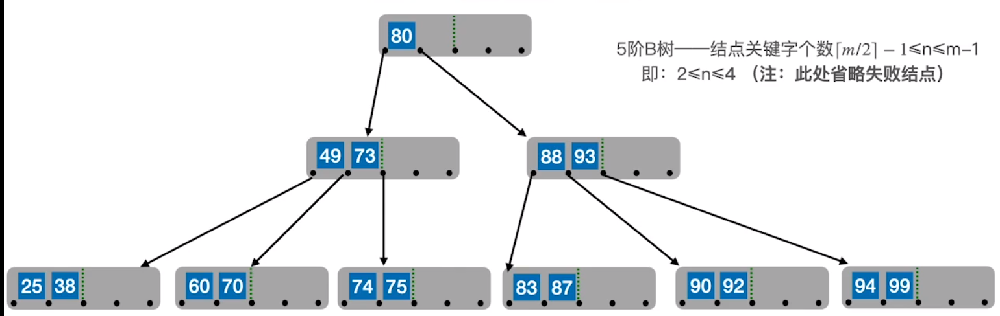
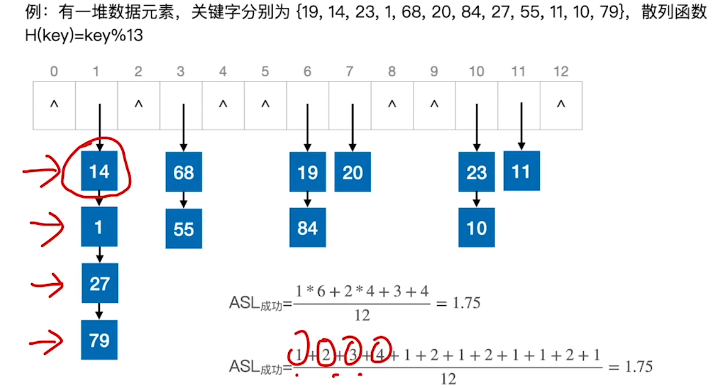

[TOC]

# 8.	查找

## 8.0	概念

查找：在数据集合中，寻找满足某种条件的数据元素的过程

查找表（查找结构）：用于查找的数据集合，由同一类型的数据元素（或记录）组成

关键字：数据元素中，唯一标识该元素的某个数据项，使用基于关键字的查找，其结果唯一

## 8.1	查找表常见操作

①查找

②插入、删除

只需①操作——静态查找表，只关注查找速度即可

需要②操作——动态查找表，需要关注增删操作是否易于实现

## 8.2	查找算法评价指标

查找长度：查找运算中，对比关键字的次数

平均查找长度（ASL）：所有查找过程中，进行关键字比较次数的平均值
$$
ASL = \sum_{i=1}^nP_iC_i
$$

> $P_i$：查找第$i$个元素的概率，$C_i$：查找第$i$个元素的查找长度
>
> 默认认为查找任一元素概率相等

评价一个查找算法的效率时，通常考虑查找成功/查找失败两种情况的ASL

## 8.3	顺序查找

顺序查找，又称为线性查找，通常用于线性表

### 8.3.1	顺序查找改进——哨兵查找

### 8.3.2	顺序查找性能分析

$查找成功ASL = \frac{1}{n}*(1+2+...+n) = \frac{n+1}{2} $

$查找失败ASL = n+1$

### 8.3.3	针对有序表的算法优化

当查找表有序时，若目标元素已经超出查找范围就可以停止查找了

此时查找失败情况有$n+1$种，$查找失败ASL = \frac{1}{n+1}*(1+2+...+(n-1)+n+n) = \frac{n}{2}+\frac{n}{n+1}$

### 8.3.4	用查找判定树分析ASL

### 8.3.5	针对查找概率不相等的优化

将被查找概率高的数据元素放在距离查找开始位置更近的位置，减少了查找成功ASL

这样会打乱元素顺序，使得表成为无序表，因此查找失败ASL明显不如针对有序表的优化

因此使用哪种优化方式，应根据实际情况判定，查找成功次数较多的使用该方法，查找失败次数较多的使用针对有序表的优化

## 8.4	折半查找

折半查找，又称二分查找，只适用于有序顺序表

### 8.4.1	折半查找性能分析

### （重点）8.4.2	折半查找判定树的构造

## （选择题）8.5	分块查找

### 8.5.1	算法思想

分块查找处理的顺序表块内无序，块间有序

当low超出索引表范围时，查找失败，目标元素一定不存在

### 8.5.2	查找效率分析

#### 8.5.2.1	顺序查找

#### 8.5.2.2	折半查找

### 8.5.3	链式存储实现动态查找表

## （概念）8.5	B树

### 8.5.1	二叉查找树

### 8.5.2	5叉查找树

### 8.5.3	保证查找效率

满足这两点的，就是**B树**

### 8.5.4	B树

### 8.5.5	B树特性

### 8.5.6	B树高度

思路一：

思路二：

### 8.5.7	B树插入

新元素一定插入到最底层的终端结点，因此失败结点只能出现在最底层

向B树插入88、90、99后，右下角结点已满，将$\lceil{\frac{m}{2}\rceil}$位置结点，即88结点插入到父结点，即根结点中，将其右边的结点放到新结点中

再向B树插入70、83、87，此时中间结点已满，将$\lceil{\frac{m}{2}\rceil}$位置结点，即80结点插入到父结点，由于$49<80<88$，因此将80结点插入到49结点和88结点之间，将原80结点右侧结点放入新结点

当上层结点存满而下方分支也存满时，应建立上层结点的上层节点，这个过程一直传递直到根结点为止，进而导致B树高度+1：

### 8.5.8	B树删除

1.删除非终端结点的关键字时：

2.删除关键字后，关键字数量不满足最低要求时：

（1）向右兄弟借

（2）向左兄弟借

（3）兄弟不够借时，则

### 8.5.9	总结

## （概念）8.6	B+树

### 8.6.1	B+树概念

### 8.6.2	B+树查找特点

### 8.6.3	B+树存储特点

在B+树中，非叶节点不含有该关键字对应记录的存储地址，因此可使一个磁盘块包含更多关键字，使得B+树的阶更大，树高更矮，读磁盘次数更少，查找更快

因此数据库中使用B+树而不是B树

### 8.6.4	B树和B+树对比

## 8.7	散列查找

散列查找使用散列函数（哈希函数）将关键字与存储地址建立映射关系，存储到散列表中。

在查找时，通过用散列函数，将目标关键字映射到散列表对应位置进行查找

一般情况下，散列查找的查找速度远高于顺序查找，**理想情况下时间复杂度O(1)**

散列查找是用**空间换时间**的算法，散列表越长，冲突越少，查找越快

**装填因子α = 散列表记录数/散列表长度，散列表的装填因子越高，发生冲突可能性越高**

当发生冲突时，映射到相同位置的不同关键字称为同义词

### 8.7.1	散列表

### 8.7.2	散列函数

散列函数的**设计目标是对给定的关键字集合，尽可能均匀地散列到各地址，使冲突更少**，散列函数的**设计要参考实际情况**

- **除留余数法**：$H(key) = key \% p $

散列表表长为$m$，则$p$是不大于$m$但最接近或等于$m$的质数

> 用质数取模，分布更均匀，冲突更少

- **直接定址法**：$H(key) = key$或$H(key) = a*key + b$

其中$a,b$为常数，这种方法计算简单且不会产生冲突，适合关键字分布基本连续的情况。

若关键字分布不连续，空位较多，则会产生存储空间的浪费

- **数字分析法**：选取数码分布较为均匀的若干位作为散列地址

> 

- 平方取中法：取关键字的平均值中间几位作为散列地址。

具体取几位根据实际情况决定。这种方法得到的散列地址与关键字每位都有关系，使得散列地址分布比较均匀，适用于关键字的每位取值都不够均匀或均小于散列地址所需位数

### 8.7.3	冲突处理

#### 8.7.3.1	拉链法

**在拉链法中，空元素的比较不计入查找长度**，因为空元素是一个空指针，而不是关键字

##### 8.7.3.1.1	查找成功ASL

法一：第一层的需要查找一次，共6个；第二层的需要查找两次，共四个，以此类推。共12个元素，因此分母为12

法二：14需查找1次，1需查找2次，以此类推。

##### 8.7.3.1.2	查找失败ASL

散列表长为13，因此分母为13

散列表各单元中有几个结点，查找长度就是几

#### 8.7.3.2	开放定址法

开放定址法，指的是可存放新表项的空闲地址既向同义词表项开放，又向非同义词表项开放

其数学递推公式为$H_i =( H(key) + d_i ) \% m， i = 0,1,2,...,k(k≤m-1)$，$m$为散列表长，$d_i$为增量序列，$i$可理解为第$i$次发生冲突

**在开放定址法中，空元素的比较计入查找次数**，因为在开放定址法中，空元素是一个表示空的特殊关键字

**使用开放定址法时，删除结点不能简单地进行物理删除，否则将阻断其后同义词结点的查找路径，只能做一个删除标记，进行逻辑删除。**

> 由于开放定址法使用逻辑删除，因此需要定期维护散列表，进行物理删除 

开放定址法会一直向后查找，直到对应单元为空停止，因此同义词与非同义词之间也可能发生冲突

开放定址法主要有三种：

1.**线性探测法**：$d_i = 0,1,2,3,..,m-1$，即发生冲突时，每次向后探测相邻的下一个单元是否为空

> 线性探测法容易造成同义词、非同义词的聚集（堆积）现象，严重影响查找效率

2.平方探测法：$d_i=0^2,1^2,-1^2,2^2,-2^2,...,k^2,-k^2$时，称为平方探测法，又称二次探测法，其中$k≤\frac{m}{2}$

> 相比线性探测法，平方探测法更不容易产生聚集（堆积）现象
>
> 注意：**散列表长度$m$必须是一个可以表示成$4j+3$的质数，才能探测到所有位置**

3.伪随机探测法：$d_i$为伪随机序列

#### 8.7.3.3	再散列法

