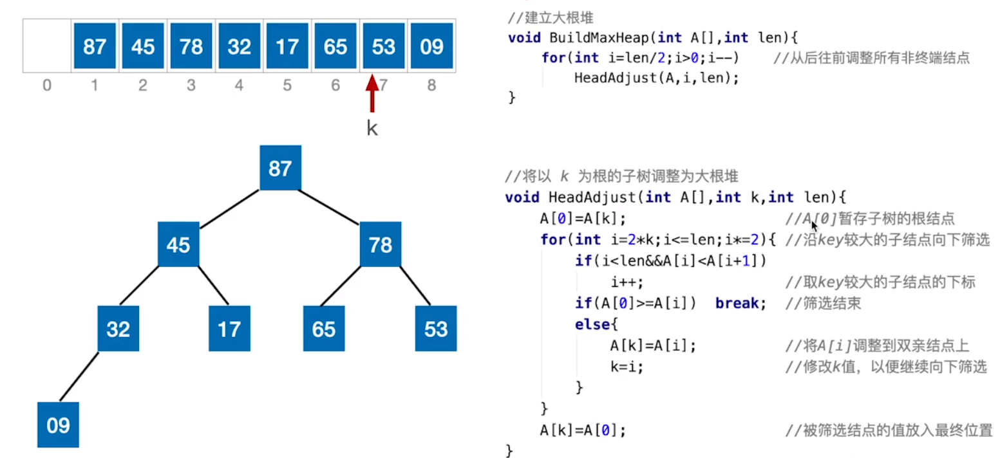
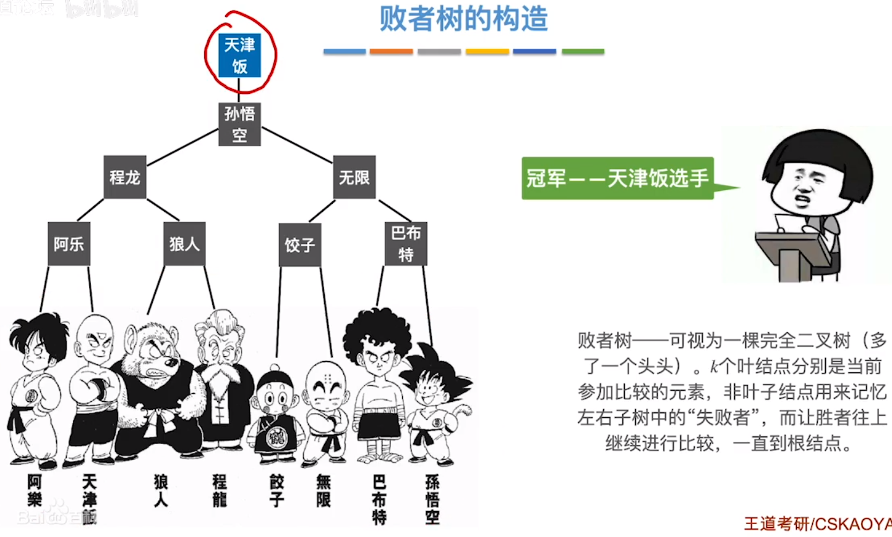

[TOC]

# 9.	排序

排序，是使表中元素按关键字有序排列的过程，因此**拓扑排序不是排序**

一般情况下，**排序算法的时间复杂度主要来自关键字对比和元素移动**（**基数排序是例外，它不需要对比**）

**算法的稳定性**：待排序表中关键字相同的元素$a,b$，排序前后$a,b$相对位置（前的仍在前）不变，则称该排序算法是稳定的；否则是不稳定的。**算法的稳定性是描述算法排序的特点，不能用于评价排序算法的优劣**

排序算法分为两种：

①内部排序：数据都在内存中，主要关注算法的时间、空间复杂度

②外部排序：数据不能完全放入内存，除了算法时间、空间复杂度外，还关注磁盘读取次数

## 9.1	插入排序

算法思想：每次将一个待排序的记录按关键字大小，插入到前面已排序的子序列中，直到全部记录插入完成

主要插入排序算法：

①直接插入排序 ②折半插入排序 ③希尔排序

其中，只有希尔排序是不稳定的

### 9.1.1	直接插入排序（稳定）

 该算法从后向前检查并插入，因此该排序算法是稳定的

#### 9.1.1.1	性能分析

空间复杂度：$O(1)$

时间复杂度：主要来自对比关键字和移动元素，共$n-1$趟

​	最好情况（全部有序）：$O(n)$

​	最坏情况（全部逆序）：$O(n^2)$

​	平均情况：$O(n^2)$

### 9.1.2	折半插入排序（稳定）

算法思路：先用折半查找找到需要插入的位置，再使用直接插入排序，移动元素 

当low>high时，折半查找停止，将[low, i-1]内元素右移，将A[0]复制到A[low]

**注意：为保证算法稳定性，当A[mid] == A[0]时，应继续在mid右侧寻找插入位置**

#### 9.1.2.1	性能分析

相比直接插入排序，折半插入排序比较关键字的次数减少了，但移动元素的次数不变，整体时间复杂度仍为$O(n^2)$

### 9.1.3	希尔排序(Shell排序，不稳定)

算法思想：先追求表中元素部分有序，再逐渐逼近全局有序

#### 9.1.3.1	性能分析

希尔排序的时间复杂度与增量序列的选择有关，无法获取确切的时间复杂度

最坏$O(n^2)$，当$n$在某个范围内时，可达到$O(n^{1.3})$

## 9.2	交换排序

算法思想：根据序列中两元素关键字的比较结果，对换两记录在序列中的位置

交换排序主要算法：①冒泡排序 ②快速排序

### 9.2.1	冒泡排序（稳定）

从前向后（或从后向前），两两比较相邻元素值，若为逆序则交换两元素，直到序列比较完，这样称为一趟冒泡排序

冒泡排序第$i$趟能将序列中第$i$小的元素放到第$i$位

冒牌排序只与遍历方向上相邻元素比较和交换元素，因此算法稳定

#### 9.2.1.1	性能分析

空间复杂度：$O(1)$

时间复杂度：

​	最好情况（有序）：$O(n)$，比较次数$n-1$，交换次数0

​	最坏情况（逆序）：$O(n^2)$，比较次数=交换次数=$(n-1)+(n-2)+...+1=\frac{n(n-1)}{2}$

​	平均情况：$O(n^2)$

**注意：交换一次需要移动三次**

### 9.2.2	快速排序（不稳定）

#### 9.2.2.1	性能分析

时间复杂度与递归层数相关，为$O(n*递归层数)$

空间复杂度也与递归层数有关，为$O(递归层数)$

因此要研究快速排序的时间、空间复杂度，就要先了解其递归层数 

将$n$个元素组织为二叉树，二叉树层数即递归调用层数

因此,最好情况时间复杂度$O(nlog_2n)$，空间复杂度$O(log_2n)$，

最坏情况时间复杂度$O(n^2)$，空间复杂度$O(n)$

平均时间复杂度$O(nlog_2n)$，快速排序是一般情况下效率最高的排序算法

若每次选中的枢轴将待排序序列划分为均匀两部分，则递归深度最小，算法效率最高

#### 9.2.2.2	优化思路

尽可能选择把数据中分的枢轴元素

如选择头、中、尾位置元素，取中间值作为枢轴元素

或随机选一个元素作为枢轴元素

#### 9.2.2.3	一趟排序和一次划分

注意：一趟排序指的是对所有未确定最终位置的元素进行一遍处理，因此快速排序中，一次划分≠一次排序

一次划分可以确定一个元素的最终位置，而一趟排序可能可以确定多个元素的最终位置

## 9.3	选择排序

选择排序：每一趟排序，在待排序元素中，选取关键字最小（或最大）的元素，加入有序子序列

### 9.3.1	简单选择排序（不稳定）

#### 9.3.1.1	性能分析

空间复杂度：$O(1)$

时间复杂度：$O(n^2)$

**无论原序列是否有序，简单选择排序都需要处理n-1趟**，对比关键字$(n-1)+(n-2)+...+1=\frac{n(n-1)}{2}$次，元素交换次数$＜n-1$

该算法是不稳定的

### 9.3.2	堆排序（不稳定）

#### 9.3.2.0	堆

若$n$个关键字序列$L[1..n]$满足下面某条性质，则称为堆(Heap)：

①若满足：$L(i)≥L(2i)$且$L(i)≥L(2i+1)$，$(1≤i≤\frac{n}{2})$，则为大根堆（大顶堆）

②若满足：$L(i)≤L(2i)$且$L(i)≤L(2i+1)$，$(1≤i≤\frac{n}{2})$，则为小根堆（小顶堆）

从逻辑上看，堆其实就是一棵顺序存储的二叉树：

#### 9.3.2.1	大根堆

##### 9.3.2.1.1	建立大根堆

##### 9.3.2.1.2	基于大根堆的排序

基于大根堆的堆排序，实质上是每轮处理都将根结点与待排序序列最后一个元素互换，再对待排序序列调整为大根堆的过程

##### 9.3.2.1.3	性能分析

**在建堆时，关键字对比次数不超过$4n$，时间复杂度**$O(n)$

在排序时，时间复杂度为$O(nlog_2n)$

因此**堆排序总的时间复杂度为**$O(nlog_2n)$

由于堆排序优先将左孩子结点的值与根结点交换，因此**堆排序是不稳定的**

#### 9.3.2.2	堆的插入、删除（基于小根堆）

#### 9.3.2.3	总结

## 9.4	归并排序(Merge Sort，稳定)

### 9.4.1	归并

归并：将两个或多个有序序列合并成一个有序序列

> 对于$n$路归并，每选出最小元素，需要对比关键字$n-1$次

### 9.4.2	归并排序

在内部排序中，一般使用2路归并

#### 9.4.2.1	实现思想

核心操作：将数组中两个有序序列归并成一个

#### 9.4.2.2	代码思想

归并排序使用了一个辅助数组B，其长度与未排序数组A[]等长

在未排序数组A[]中使用三个指针low、mid、high分隔出两个已排序子序列，用于二路归并

初始化阶段，将A[low, high]部分按原位置复制到B[]中

在A[]中，指针k指向当前需要填入的待排序元素，

在B[]中，指针i、j分别指向第一、第二个已排序序列的第一位

循环开始，i、j向右遍历寻找较小值，填入k所指位置

循环结束后，将未遍历完的部分依次填入A[]中即可

#### 9.4.2.3	代码实现

#### 9.4.2.4	性能分析

时间复杂度$O(nlog_2n)$，空间复杂度$O(n)$

## 9.5	基数排序(Radix Sort，稳定)

**基数排序是不基于比较的排序算法**，基数排序通常使用**链式存储**实现

基数$r$即进制数，基数排序需要使用$r$个辅助队列

### 9.5.1	性能分析

### 9.5.2	基数排序的应用

## 9.6	外部排序

### 9.6.1	外部排序

### 9.6.2	性能分析

### 9.6.3	优化

由于外存IO速度低，因此外部排序时间开销主要由读写外存时间决定

要减小排序开销，就要缩短外存读写时间，即减少读写次数

要减少外存读写次数，有两种思路：

①减少归并趟数，即使用更多路的归并排序

②减小初始归并段数，即使用更大的初始归并段，要使用更大的初始归并段，就需要在内存中开辟更大的工作区

### 9.6.4	优化思路带来的缺点

1.若减少归并趟数，即增大归并路数$k$：

​		①会需要开辟更多输入缓存区，增加内存开销 

​		②增加关键字对比次数，内部归并时间开销增加（要减少比较次数，可使用败者树）

2.若减少初始归并段数，即增大初始归并段：

​		需要在内存中开辟更大的工作区，输入、输出缓冲区需对应扩大

### 9.6.5	多路平衡归并

例中有8个归并段参与归并，得到了3个新的归并段

而若是$k$路平衡归并，即4路平衡归并，则应为$\lceil8/4\rceil = 2 ≠ 3$，而例中最多有4个归并段归并为一个新的归并段，因此该例为4路归并而不是4路平衡归并

再看上图7.8，第一层有8个归并段归并得到2个新的归并段，符合4路平衡归并排序，第二层有2个归并段，归并得到1个新的归并段，满足$\lceil\frac{2}{4}\rceil = 1$，因此图7.8是4路平衡归并排序

### 9.6.6	总结

以目前方法生成初始归并段的数量，取决于内存大小，要解决这个问题，可以使用置换-选择排序

## 9.7	败者树

### 9.7.1	多路平衡归并带来的问题

**要减少**多路平衡归并排序在选出一个最小元素时，**需要对比的关键字次数**，我们可以使用**败者树**来解决这个问题

### 9.7.2	败者树

### 9.7.3	败者树在多路归并排序的应用

### 9.7.4	总结

通过败者树选出一次最小（或最大）元素，只需要对比$\lceil log_2k \rceil$次，相比常规办法需要对比$n-1$次，大大提高了对比效率

## 9.8	置换-选择排序

### 9.8.1	传统方法存在的缺点

使用普通方法进行初始归并段的构造时，**初始归并段的数量和大小受内存大小影响**，为了避免这个问题，可以使用置换-选择排序

### 9.8.2	置换-选择排序

使用置换-归并排序时，初始，从FI中输入元素到内存工作区WA直到工作区满

循环开始，每次从内存工作区WA中选取最小记录并输出，用变量MINIMAX记录上次输出的最小关键字，确保输出的关键字在MINIMAX中最小且＞MINIMAX

当WA中最小值＜MINIMAX时，选择＞MINIMAX的较小值输出：

当WA中所有关键字都＜MINIMAX时，则截断该归并段，开辟一个新的归并段，继续重复以上步骤：

通过置换-选择排序，使得初始归并段长度超过了内存工作区大小限制，从而减少了初始归并段数量，提高了多路平衡归并排序的效率

## 9.9	最佳归并树

### 9.9.1	归并树的性质

### 9.9.2	总结

