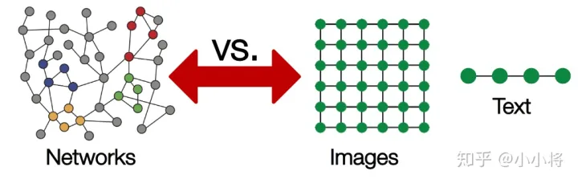
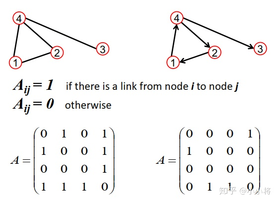
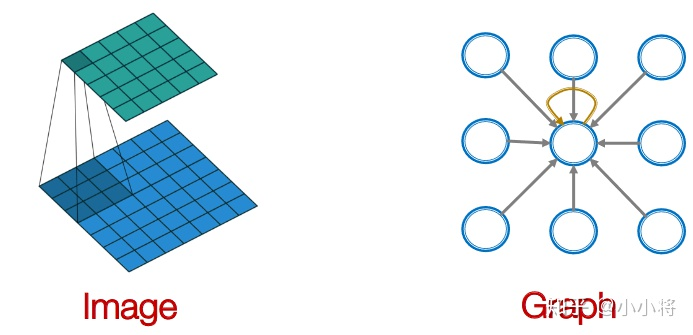
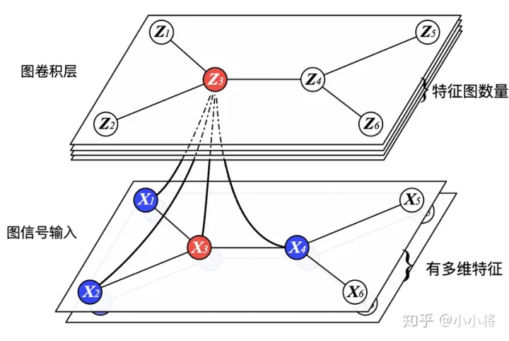

现在，我们已经得到了CNN的几个核心词，而这也正是GNN的核心思想。那么现在就可以介绍GNN了吗？很遗憾，CNN常用于处理的是图像、语音等结构规整的欧几里得数据；而GNN要处理的是图数据，这是一种非欧几里得数据，它的排列不整齐，具体体现在：**对于数据中的某个点，难以定义出其邻居节点出来，或者是不同节点的邻居节点的数量是不同的**。其中每个样本的节点排列可能都不同，因此难以定义欧几里得距离，进而很难定义卷积操作。因此，首先我们要将其嵌入(Embedding)到合适的欧几里德空间后再进行度量。

## 1.	图的概念

对图，我们用$G=(V,E)$表示，其中$V$为图的节点集合，$E$为边集合，并记图中节点数为$N$，图有3个重要的矩阵：（以无权无向图为例）

- 邻接矩阵$A$(Adjacent Matrix)：用来表示节点间的连接关系，用0-1矩阵表示；
- 度矩阵$D$(Degree Matrix)：每个节点的**度指的是其连接的节点数**，这是一个对角矩阵，其中对角线元素$D_{ii}=\sum_jA_{ij}$
- 特征矩阵$X$(Feature Matrix)：表示节点的特征，$X\in R^{N\times F},F$为特征维数

其实际表示以下图为例，左侧为无向图，右侧为有向图，这里展示了它们对应的邻接矩阵：

相比图像和文本，图这种拓扑结构是较复杂的：任意的节点数以及节点间的复杂关系。

## 2.	学习新特征

深度学习中最重要的是学习特征：随着网络层数的增加，特征越来越抽象，然后用于最终的任务。

对于图任务来说，这点同样适用，我们希望深度模型从图的最初始特征$X$出发，学习到更抽象的特征，比如学习到了某个节点的高级特征，这个特征根据图结构融合了图中其他节点的特征，我们就可以用这个特征用于节点分类或者属性预测。图网络学习新特征的公式如下：
$$
H^{(k+1)}=f(H^{(k)},A)
$$
这里$k$为网络层数，$H^{(k)}$就是网络第$k$层的特征，其中$H^{(0)}=X$，即初始特征为图的特征矩阵。

但GCN要怎么从CNN中借鉴思路呢？

在CNN中，卷积就是利用卷积核，对局部空间的特征先变换($w_ix_i$)再求和($\sum_i w_ix_i$)。

类比到图上，每个节点的新特征可以类似得到：对该节点的邻域节点特征进行变换，然后求和。用公式表达就是：
$$
H^{(k+1)}=f(H^{(k)},A)=\sigma (AH^{(k)}W^{(k)})
$$
其中$W^{(k)}$为学习权重，维度$F^{k-1}\times F^k$，$\sigma(·)$为非线性的激活函数(如ReLU)。这里：
$$
(AH)_{i} = A_iH\\
=\sum_j A_{ij}H_j
$$
特征矩阵$A$是0-1矩阵，因此当节点$i,j$连接时，$A_{ij}=1$，因此节点$i$的新特征即为其邻接节点的特征和

我们可以将上述学习过程分为三部分：

- 变换（Transform）：对当前的节点特征进行变换学习，这里就是乘法规则；
- 聚合（Aggregate）：聚合邻居节点特征，得到该节点的新特征，这里是简单的加法规则；
- 激活（Activate）：采用激活函数，增加非线性。

这就是简单的图卷积了，这里的**权重是所有节点共享的**，类比于CNN中的参数共享；另外可以**将节点的邻居节点看成感受野**，随着网络层数的增加，感受野越来越大，即**节点的特征融合了更多节点的信息**。直观的图卷积示意图如下：

## 3.	图卷积

上述的加法规则只是一个简单实现，其存在两个问题：

- 计算新特征时没有考虑自己的特征
- 采用加法规则时，对于度大的节点特征越来越大，而对于度小的节点却相反，这可能导致训练过程中梯度爆炸或者消失。

针对第一个问题，我们可以给图中每个节点增加自连接，实现上可以直接改变邻接矩阵：
$$
\tilde A = A + I
$$
针对第二个问题，我们可以对邻接矩阵进行归一化，使得$A$的每行和值为1，在实现上我们可以乘以度矩阵的逆矩阵：$\tilde D^{-1} \tilde A$，这里的度矩阵$\tilde D$是更新$A$后根据$\tilde A$重新计算的。这样我们就得到：
$$
H^{(k+1)} = f(H^{(k)},A)=σ(\tilde{D}^{−1}\tilde{A}H^{(k)}W^{(k)})
$$
这里：
$$
(\tilde{D}^{-1}\tilde{A}H)_i\\=(\tilde{D}^{-1}\tilde{A})_iH\\
=(\sum_k\tilde{D}_{ik}^{-1}\tilde{A}_i)H\\
=(\tilde{D}_{ii}^{-1}\tilde{A}_i)H\\
=\tilde{D}_{ii}^{-1} \sum_j \tilde{A}_{ij}H_j\\
=\sum_j \frac{1}{\tilde{D}_{ii}}\tilde{A}_{ij}H_j
$$
由于度矩阵$\tilde{D}=\sum_j \tilde{A}_{ij}$，因此这样的聚合实际上是**对邻域结点的特征值求平均**，通过**归一化**避免了直接求和造成的梯度消失或梯度爆炸问题

### 3.1	Cluster-GCN好像没提到？

更进一步，我们可以使用在聚合时进行对称归一化，而这正是GCN所提出的图卷积方法：
$$
H^{(k+1)}=f(H^{(k)},A)=\sigma(\tilde{D}^{-0.5}\tilde{A}\tilde{D}^{-0.5}H^{(k)}W^{(k)})
$$
这里：
$$
(\tilde{D}^{-0.5}\tilde{A}\tilde{D}^{-0.5}H)_i\\
=(\tilde{D}^{-0.5}\tilde{A})_i\tilde{D}^{-0.5}H\\
=(\sum_k\tilde{D}_{ik}^{-0.5}\tilde{A})_i\tilde{D}^{-0.5}H\\
=\tilde{D}^{-0.5}_{ii} \sum_{j}\tilde{A}_{ij} \sum_k\tilde{D}_{jk}^{-0.5} H_j\\
=\tilde{D}_{ii}^{-0.5} \sum_j \tilde{A}_{ij} \tilde{D}_{jj}^{-0.5} H_j\\
=\sum_j \frac{1}{\sqrt{\tilde{D}_{ii}\tilde{D}_{jj}}} \tilde{A}_{ij} H_j\\
$$
这种新的聚合方法，不再是只对邻域节点特征进行平均，它同时考虑了节点$i$和邻居结点$j$的度，当邻居节点$j$度较大时，其特征反而受到抑制

这里的对称归一化和上述的归一化最大的区别不在于开根号，而是引入了邻居节点$j$的度：

- 前者只对整个矩阵进行了**横向标准化**，即**只考虑值之间的相对大小而不是绝对大小**，从而避免了训练时产生的梯度消失或梯度爆炸导致的无法收敛；
- 而后者则是对矩阵进行了**纵向标准化**，即通过邻居节点$j$的度$\tilde{D}_{jj}$，**判断邻居节点$j$对节点$i$特征表达所带来的贡献大小**,惩罚度大的节点，而这是GNN所独有的。
- 贡献是什么？如果一个节点与许多节点相连，或者说是一个交际花，它认识的节点很多很杂，什么节点它都有可能认识，因此你与它之间的联系不足以描述你是什么样的人；而如果一个节点只与另一个节点相连，那么这两个节点的特征就可以根据另一个节点来进行描述了。