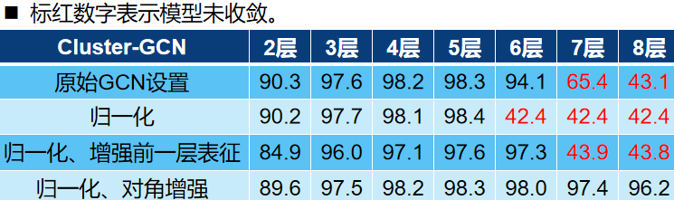

# 1.	Cluster-GCN为什么没有使用对称归一化

## 1.1	问题

我在看GCN特征传播的时候，第三代GCN(空域GCN, Spatial GCN)认为：随机游走归一化没有解决度较大的节点对描述其他节点贡献比较低的问题，因此使用对称归一化替代

> 随机游走归一化：$\tilde A = D^{-1}A$
>
> 对称归一化：$\tilde A = D^{- \frac{1}{2}}AD^{- \frac{1}{2}}$

但是我读Cluster-GCN论文的时候，发现**Cluster-GCN使用随机游走归一化，而不是对称归一化**

> 随机游走归一化只完成了矩阵的横向标准化，而对称归一化在此基础上还完成了纵向标准化：
>
> **横向标准化**，即**只考虑值之间的相对大小而不是绝对大小**，从而避免了训练时产生的梯度消失或梯度爆炸导致的无法收敛；
>
> **纵向标准化**，即通过邻居节点$j$的度$\tilde{D}_{jj}$，**判断邻居节点$j$对节点$i$特征表达所带来的贡献大小**，惩罚度大的节点
>
> https://blog.csdn.net/zfhsfdhdfajhsr/article/details/124552753

## 1.2	猜想

是不是对称归一化解决的是度比较大的结点贡献不足的问题，但是Cluster-GCN用图聚类方法划分节点的同时，去掉了小批次训练中节点以外的边，这样节点之间度都相对变小了，而且节点之间相关性更强，每个节点与其相连节点间描述更多，是不是就不需要纵向标准化了？

# 2.	Cluster-GCN对角增强

## 2.1	问题

我看到有人对Cluster-GCN提出一个思考：其提到的训练深层GCN的出发点（随层数加深，远处节点贡献大于近处节点）应当是不成立的，因为如果训练得当，每层的权重参数应该能包含该层节点的权重信息，不同层天然是不等权的

然而实验给出的数据确实证明这是有效的，那应该如何思考这个问题呢？

# 3.	GCN邻接矩阵归一化为什么能解决梯度消失和梯度爆炸问题

度大的节点在其特征表征中将具有较大的值，度小的节点将具有较小的值。这可能会导致梯度消失或梯度爆炸，也会影响数值稳定性

GCN层层卷积数值规模差异较大时数值不稳定我能理解，但梯度消失和梯度爆炸是怎么产生的呢？梯度消失和梯度爆炸问题不是激活函数和权重导致的吗？

这里是因为没有归一化的$AH^{(k)}$数值不稳定，导致学习到的$W^{(k)}$也不稳定才出现的梯度消失和梯度爆炸，所以归一化解决了数值稳定性问题也就解决了梯度消失和梯度爆炸问题？

# 4.	Cluster-GCN为什么使用随机聚类

知乎有文章指出 Louvain算法效果明显优于Metis划分结果，那为什么还要使用Metis呢？

# 5.	Cluster-GCN的对角增强有多好？

DropEdge能否胜过？

# 6.	GCN的过平滑问题

https://www.zhihu.com/question/346942899