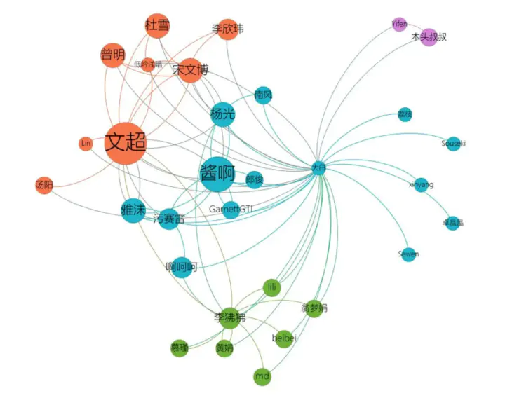
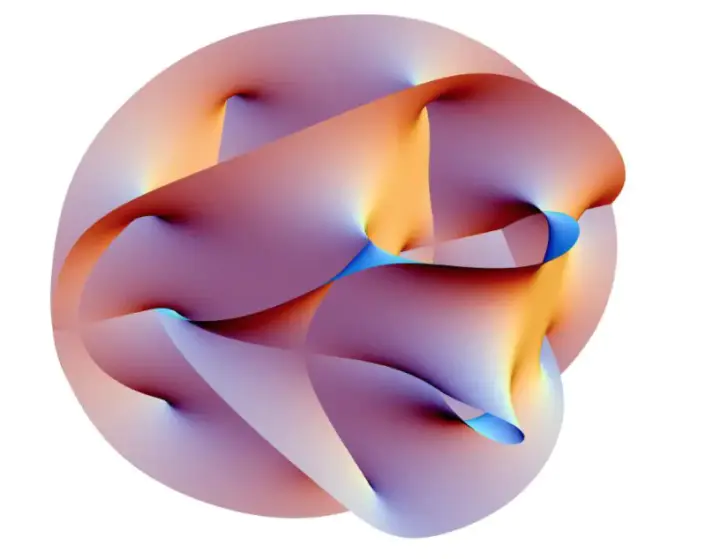
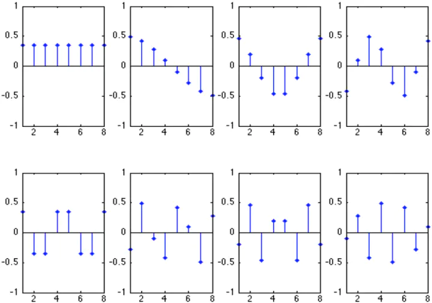
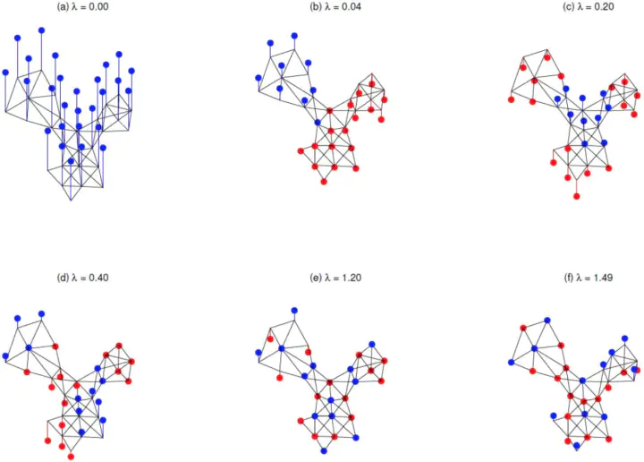
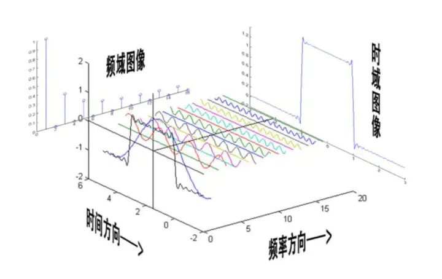

# 1.	图数据的非欧性

## 1.1	欧几里得数据域

从数据域角度，数据可分为**欧几里德结构数据**(欧式数据)和**非欧几里德结构数据**(非欧数据)。

欧几里德结构数据的特点是排列整齐，即对于数据中某个信号点我们很容易可以找出其邻居信号点，其邻居信号点数量固定并有着统计相关性。在我们日常生活中，最常见到的欧几里德结构数据包括图片(image)、视频(video)以及语音(voice)。

非欧几里得结构数据的特点是排列不整齐，即对于数据中的某个信号点，难以定义其邻居信号点，或者是不同信号点的邻居信号点的数量不同。图数据(Graph)与流形数据(Manifold)就是典型的非欧几里得结构数据。下图依次为 graph 数据和流形数据：

## 1.2	欧几里得空间

在数学定义下，**欧几里得空间**指有限维线性内积空间。欧几里得结构数据的距离是很好度量的，因为欧几里得结构数据处于欧几里得空间。

拿图像数据来说，其是整齐排布的点阵，具有平移不变性。简单来想，如果把两张图像上的某两像素点进行对齐，只要两个中心像素点是对齐的，则两个中心像素点的邻居像素点也一定是两两对齐的。

因此，不妨把图片样本的不同像素点看成是高维欧几里德空间中的某个维度，因此一张大小$m\times n$的图片可以看成是 $m\times n$ 维的欧几里德样本空间中的一个点，而不同样本之间的距离就体现在了样本点之间的距离了。

## 1.3	希尔伯特空间

从图像的例子我们可以看出：一张图像是欧几里得空间中的一个点，即欧几里得结构数据处于欧几里得空间中。但是如果换成 Graph 数据，则无法将其看做欧几里得空间中的点。如果把两个 Graph 上的某两个节点进行对齐，即使两个中心节点对齐了，也无法保证中心节点的邻居节点都是两两对齐的，因为其邻居节点数量不固定，5 个邻居节点永远无法与 4 个邻居节点对齐，总会有一个多出来。因此，**Graph 不属于欧几里得空间**。

那么 Graph 属于什么空间呢？实际上，非欧空间的 Graph 经过变换可以属于**希尔伯特空间**(Hilbert Space)。在数学里，希尔伯特空间是有限维欧几里得空间的一个推广，在由内积所定义的范数意义下完备的内积空间称为希尔伯特空间。处于欧几里得空间的图像，其基底是每个像素点所在的维度，并且由于其像素点是有限的，所以其维度也是有限的。然而希尔伯特空间的基底一般是函数，常见的是含有各种频率的平面波函数，一种频率对应一个基底，因此希尔伯特空间维度是无穷的。实际上，欧几里德空间是希尔伯特空间的一个特例，举个对应的栗子：图像也是 grid-Graph，即 Graph 的一个特例。

想让 Graph 属于希尔伯特空间，就需要存在满足希尔伯特空间性质的基底可以将图数据进行映射，这种映射叫**图傅里叶变换**，这种基底叫**图拉普拉斯矩阵**特征向量。通过图傅里叶变换可以将空域的 Graph 映射为以函数为基底的谱域 Graph，下面让我们来看这种谱域变换是如何做到的。

# 2.	图的谱域变换

## 2.1	图拉普拉斯矩阵

在数学中，拉普拉斯算子（Laplacian）是由欧几里得空间中的一个函数的梯度的散度给出的微分算子。

所谓散度（Divergence）是向量分析的一个向量算子，将向量空间上的向量场（矢量场）对应到一个标量场。散度描述的是向量场里一个点是汇聚点还是发源点。值为正时表示该点为发源点，值为负时表示该点为汇聚点，值为零时表示该点无源。散度在物理上的含义可以理解为磁场、热源等。

上文说到 Graph 在希尔伯特空间中的基底是图拉普拉斯矩阵的特征向量，其中图拉普拉斯矩阵就是 Graph 上的拉普拉斯算子。**在 Graph 数据上，拉普拉斯矩阵反映了当前节点对周围节点产生扰动时所产生的累积增益，直观上也可以理解为某一节点的权值变为其相邻节点权值的期望影响，形象一点就是拉普拉斯矩阵可以刻画局部的平滑度**。

与复杂的含义不同，图拉普拉斯矩阵的计算方式十分简单：$L=A-D$，其中$A$是图邻接矩阵，$D$是图的度矩阵。

## 2.2	图拉普拉斯矩阵特征分解

矩阵的特征值分解可以使得矩阵被特征值和特征向量唯一表示，该矩阵的所有特征向量组成了这个变换矩阵的一组基。图拉普拉斯矩阵也可以进行特征分解，其数学表示如下，其中$L$是$N\times N$的拉普拉斯矩阵，$u_i$是$N\times 1$的第$i$个特征向量，$\lambda_i$是第$i$个特征值：
$$
L = U \Lambda U^T\\
U = (u_1, u_2,\cdots , u_n)\\
\Lambda = \begin{bmatrix}
\lambda_1 &  \cdots & 0 \\
\cdots & \cdots & \cdots \\
0 &  \cdots & \lambda_n \\
\end{bmatrix}
$$
图拉普拉斯矩阵的特征向量与特征值具有特殊的物理意义——衡量图结构的平滑性。

拉普拉斯矩阵的每个特征向量都是希尔伯特空间上的一个基，特征向量对应的特征值越大 -> 该基的频率就越高 -> 刻画的图频率信息越高 -> 刻画的图的信息越不平滑 -> 相邻节点相似性越小、变化越大 -> 平滑性越低。

如下图所示，6 个特征值从小到大排列的特征向量 1-6，特征值越大，特征向量震荡的频率越高，从而描述的图信息的平滑性就越低。

> 图的平滑性反映图中信息数量和质量，平滑度越低，噪声越大信息越少

## 2.3	图傅里叶变换

信号的傅里叶变换可以将信号分解为正余弦波的组合。所谓“横看成岭侧成峰”，从空域（时域）角度看信号是一个又一个的方波，然而从谱域（频域）的角度看，同样的信号就变成了无数个频率不同的正余弦波的叠加。图的傅里叶变换与普通信号的傅里叶变换具有相似之处，信号的频域基底是正余弦波，而图的谱域基底就是拉普拉斯矩阵的特征向量。图傅里叶变换的数学表达如下，其中$f$是大小$N\times m$的变换前的空域图信号，$U$是大小$N\times N$的拉普拉斯矩阵特征向量，$\hat{f}$为变换后的频域图信号：
$$
\hat{f} = 
\begin{bmatrix}
\hat{f}(1)\\
\cdots\\
\hat{f}(N)
\end{bmatrix}
=U^T f
$$

## 2.4	图的卷积

将空域图变换到了谱域上，从而谱域图数据属于希尔伯特空间，因此可以进行点击、卷积等一系列原本空域无法进行的操作与计算。下面是 Graph 卷积的计算：利用图傅里叶变换与卷积定理，使得空域卷积变换为频域相乘，在频域上进行卷积后再逆变换回空域。其中$U$是大小$N\times N$的拉普拉斯矩阵特征向量，用以进行图傅里叶变换：
$$
(f * Gg) = FT^{-1}\left[ FT[f] \odot FT[g] \right]\\
=U(U^Tf \odot U^T g)\\
=U(U^Tg \odot U^Tf)
$$

# 3.	文末总结

本文主要介绍了谱图理论，包括欧几里得与希尔伯特空间、图拉普拉斯矩阵及其特征分解、图傅里叶变换等等。虽然本文着眼于图的谱域变换，但是我相信可以学习的经验绝不仅仅限于这些理论与公式：所谓横看成岭侧成峰，谱域给我们提供了一种新的视角，如果图卷积从空域视角无法解决，那就换谱域视角看吧；如果有任何事情无法解决，那就换个视角看吧！