# Cluster-GCN: An Efficient Algorithm for Training Deep and Large Graph Convolutional Networks

聚类GCN：一种用于深度学习和大型图卷积网络的高效算法

## 摘要

训练一个大规模的GCN仍然具有挑战性，目前基于SGD的算法要么面临着很高的计算成本，并且随着GCN层的数量呈指数级增长，要么对于将整个图和每个节点的Embedding存放到内存中，占用巨额内存。在本文中，我们提出了一种新的GCN算法，它适用于基于SGD的训练。

工作原理如下：**在每个步骤中，它对与由图聚类算法识别出的密集子图相关联的一组节点进行采样，并限制该子图内的邻居搜索**。这种简单但有效的策略显著提高了内存和计算效率，同时能够实现与以前的算法相当的测试精度。

为了测试我们算法的可伸缩性，我们创建了一个新的Amazon2M数据，包含200万个节点和6100万条边，比之前最大的公开可用数据集(Reddit)大5倍多。

训练3层GCN，Cluster-GCN比之前最先进的VR-GCN(1523秒vs 1961秒)更快，并且使用更少的内存(2.2GB vs 11.2GB)。

此外，**在该数据集上训练4层GCN，我们的算法可以在大约36分钟内完成，而所有现有的GCN训练算法都由于内存不足的问题而无法进行训练**。

此外，Cluster-GCN允许我们在没有太多时间和内存开销的情况下训练更深入的GCN，从而提高了预测精度——使用5层Cluster-GCN，我们在PPI数据集上实现了最先进的测试F1分数99.36，而之前的最佳结果是98.71


## 1	绪论

### 1.1	现状

图卷积网络(GCN)在解决许多基于图的应用中变得越来越流行，包括半监督的节点分类、链接预测和推荐系统。

给定一个图，**GCN使用图卷积操作来逐层获得节点Embedding**--在每一层，**节点的Embedding是通过收集其邻居的Embedding来获得的**，然后再进行一层或几层线性变换和非线性激活。最后一层的Embedding再用于一些终端任务。例如，在节点分类问题中，最后一层的Embedding被传递给分类器以预测节点标签，因此GCN的参数可以以端到端的方式进行训练。

由于GCN中的图卷积算子需要利用图中节点之间的相互作用来传播Embedding，这使得训练变得相当具有挑战性。与其他训练损失可以完美地分解为每个样本上的单个项的神经网络不同的是，GCN中的损失(例如，单个节点上的分类损失)取决于大量的其他节点，尤其是当GCN层数较深时。**由于节点的依赖性，GCN的训练非常慢，需要大量的内存--反向传播需要将计算图中的所有Embedding存储在GPU内存中。**

> **Embedding是离散分类变量到连续数向量的映射。**在神经网络中，Embedding是离散变量的低维学习连续向量表示。它可以降低分类变量的维数，并有意义地表示变换空间中的类别。
>
> Embedding有3个主要目的：
>
> - 在Embedding空间中寻找最近邻。这些可用于根据用户兴趣或簇类别提出建议。
> - 作为监督任务的机器学习模型的输入。
> - 用于概念和类别之间关系的可视化。
>
> 这意味着在图书项目中，使用神经网络Embedding，我们可以在维基百科上获取所有37000篇图书文章，并在一个向量中仅使用50个数字来表示每一篇文章。此外，因为Embedding是学习的，所以在我们学习问题的背景下更相似的书籍在Embedding空间中彼此更接近。
>
> **更简单的理解：**
>
> Embedding 的本质是“压缩”，用较低维度的 k 维特征去描述有冗余信息的较高维度的 n 维特征，也可以叫用较低维度的 k 维空间去描述较高维度的 n 维空间。
>
> 
>
> **问：**
>
> 用向量方式从智力层面描述小明。已知：小明的语文成绩88，数学成绩3，英语成绩18，身高149，体重35公斤，父亲是大学教授，母亲是音乐家，立定跳远2.1米，50米自由泳个人记录93秒。
>
> **答：**
>
> 根据已有信息(特征)，小明的完整向量表示为：[88, 3, 18, 149, 35, 大学教授, 音乐家, 2.1, 93]。
>
> 根据先验知识，身高、体重、立定跳远、游泳成绩、家世和智力无明显关系，摒弃掉，仅保留[语文成绩，数学成绩，英语成绩] 三个维度的特征。
>
> 得小明的智力向量: [88, 3, 18]。
>
> 这就是 Embedding 方法， **Embedding 技术压缩数据**(9维数据压缩到3维)，同时它**通常是丢失信息的**。
>
> 在机器学习中，这个过程称为嵌入(Embedding)。Embedding通常指**将一个度量空间中的一些对象映射到另一个低维的度量空间中，并尽可能保持不同对象之间的拓扑关系**。
>

为了证明开发可扩展的GCN训练算法的必要性，文中首先讨论了现有方法的优缺点，包括：**内存需求、每个epoch的时间、每个epoch收敛速度**。这三个因素是评估训练算法的关键。注意，内存需求直接限制了算法的可扩展性，后两个因素结合在一起将决定训练速度。

在接下来的讨论中，用$N$为图中的节点数，$F$为Embedding的维数，$L$为分析经典GCN训练算法的层数。

### 1.2	同行表现

- 在第一个GCN论文[9]中提出了全批次梯度下降(Full-batch gradient decent)。要计算全梯度，需要存储所有中间Embedding，这导致$O(NFL)$内存需求，这是不可扩展的。此外，虽然其每epoch时间是高效的，但梯度下降的收敛是缓慢的，因为参数只更新一次【内存表现：差；每epoch时间：好；收敛：差】

- 在GraphSAGE中提出了小批次SGD(Mini-batch SGD)，可以**减少内存需求**，并在每个epoch上进行多次更新，从而**收敛更快**。但由于邻居扩展问题，小批次SGD引入了一个显著的计算开销——要计算在层$L$上单个节点的损失，需要节点的邻居节点在层$L-1$的Embedding，而这由于需要他们的邻居在层$L-2$上的Embedding，以此类推。这使得**其时间复杂度与GCN深度相关**。

  GraphSAGE提出在通过层反向传播时使用固定大小的邻居样本，FastGCN [1]提出了重要采样，但这些方法的开销仍然很大，当GCN深入时会变得更糟。

  【内存表现：好；每epoch时间：差；收敛：好】

- VR-GCN提出使用一种方差(variance)减少技术来减小邻居采样节点的大小。尽管成功地减少了采样的大小(在我们的实验中，每个节点只有2个样本的VR-GCN工作得很好)，但它需要存储内存中所有节点的所有中间Embedding，从而导致了$O(NFL)$内存需求。如果图中的节点数量增加到数百万个，那么VR-GCN的内存需求可能会太高，无法适应GPU。

  【内存：差；每epoch时间：好；收敛：好】

### 1.3	本算法表现

本文利用图的聚类结构，提出了一种新的GCN训练算法。我们发现，小批处理算法的效率可以用“Embedding利用率”的概念来表征，它与一批或批内链路中，节点间链路数成正比。这一发现促使我们使用图聚类算法来设计批处理，旨在构建节点分区，从而使同一分区中的节点之间比不同分区中的节点之间有更多的图链接。

在内存方面，我们只需要在当前批处理中存储节点Embedding，即$O(bFL)$，批处理大小为$b$。在收敛速度方面，与其他基于SGD的算法相当。此外，该算法实现简单，因为只计算矩阵乘法而无需邻居采样。

> 这明显优于VR-GCN和全梯度体面，也略优于其他基于sgd的方法。在计算复杂度方面，我们的算法在梯度下降时实现了相同的每epoch时间，并且比邻居搜索方法要快得多。

### 1.4	测试成绩

我们在几个大规模的图数据集上进行了全面的实验，并做出了以下贡献：

- Cluster-GCN在大规模图上实现了最好的内存使用，特别是在深度GCN上。例如，在Amazon2M上的3层GCN模型中，Cluster-GCN使用的内存比VRGCN少5倍。

  > Amazon2M是一个新的图形数据集，我们构造它来演示GCN算法的可扩展性。这个数据集包含了一个包含超过200万条节点和6100万条边的亚马逊产品共同购买图。

- 对于浅层网络(如2层)，Cluster-GCN与VR-GCN实现了类似的训练速度，但当网络更深(如4层)时，可以比VRGCN快，因为我们的复杂度与层数L呈线性关系，而VR-GCN的复杂度与L呈指数关系。

- Cluster-GCN能够训练一个非常深的有很大的Embedding规模的网络。虽然之前的一些研究表明，深度很大的GCN并不能提供更好的性能，但我们发现，通过适当的优化，更深的GCN可以帮助提高精度。例如，使用5层GCN，我们获得了一个新的PPI数据集的基准精度为99.36，而[16]报告的最高基准精度为98.71。

## 2	背景

假设给定图$G = (V,G,A)$，它由$N = |V|$个顶点和$|E|$条边组成，使任两个顶点$i,j$间的一条边表示他们的相似性。

其对应的邻接矩阵$A$是一个$N\times N$系数矩阵，若顶点$i,j$间存在一条边，则$A_{ij}=1$，否则为0。此外，各节点与一个$F$维特征向量相关联，$X \in \R^{N\times F}$表示全部$N$个结点的特征矩阵。

一个$L$层GCN由$L$个图卷积层组成，每层通过混合上一层的节点邻居的Embedding来为每个节点构建Embedding：
$$
Z^{(l+1)}=A^\prime X^{(l)}W^{(L)},\\
X^{(l+1)}=\sigma(Z^{(l+1)}) 
\\(1)\\
$$

其中$X^{(l)}\in\R^{(N\times F_l)}$是全部$N$个结点在第$l$层的Embedding且$X^{(0)}=X$，$A^\prime$是归一化和正则化的邻接矩阵，$W^{(l)}\in\R^{F_l\times F_{l+1}}$是将为下游任务学习的特征变换矩阵。注意，简单起见，我们假设所有层的特征维数相同$(F_1=...=F_L=F)$。激活函数$\sigma(·)$为元素级(element-wise)的ReLU

本程序使用GCN，目标是通过最小化损失函数来学习式(1)的权重矩阵：
$$
L = \frac{1}{|y_L|}\sum_{i\in y_L}loss(y_i,z^L_i)\\
(2)
$$
其中$y_L$包含标注结点的所有标签，$z_i^{(L)}$是$Z^{(L)}$第$i$行，其对应的真实值为$y_i$，表示结点$i$的最终层预测。

## 3	算法

在论文[9]中，使用全梯度下降法(full gradient descent)，但计算和内存成本高。在内存方面，通过反向传播计算式(2)的全梯度需要存储所有Embedding矩阵$\{  Z^{(l)} \}^L_{l=1}$，而这需要空间$O(NFL)$。在收敛速度方面，由于模型在一个epoch只更新一次，因此需要更多epoch才能收敛。

研究表明，小批次SGD能改善GCN的训练速度和内存需求。SGD不需要计算全梯度，而只需基于每次更新的小批计算梯度。本文使用大小为$B\subseteq [N],b = |B|$表示一批结点索引，SGD每epoch将计算梯度估计来执行更新。虽然SGD在epoch方面收敛更快，但其在GCN训练中引入了另一计算开销，使得其每epoch时间比全梯度下降慢得多
$$
\frac{1}{|B|}\sum_{i\in B}\nabla loss(y_i,z^{(L)}_i)\\
(3)
$$

### 3.0	传统SGD算法存在的问题

#### 3.0.1	为什么朴素小批次SGD每epoch时间更长？

我们考虑与一个节点$i$相关的梯度计算：$\nabla loss(y_i,z^{(L)}_i)$。显然，这需要结点$i$的Embedding，而这取决于其邻居在前一层的Embedding。为获取各节点$i$的邻居节点的Embedding，我们还要进一步聚合各邻居节点的邻居节点的Embedding。假设一个GCN有$L+1$层，各节点平均度$d$，为得到结点$i$的梯度，我们需要从图中的$O(dL)$个节点聚合特征，以获得一个节点的特征。

#### 3.0.2	Embedding利用率能反映计算效率

若一个批处理有多个节点，其时间复杂度就不简单了。因为不同结点可以有重复的$k$跳(hop-$k$)邻居结点，且Embedding计算的数量可以小于最坏情况$O(bd^L)$。

为反应小批次SGD计算效率，使用**Embedding利用率**的概念。在算法中，若结点$i$在第$l$层的Embedding$z_i^{(l)}$被计算且在第$l+1$层的Embedding计算中被重用$u$次，则称$z_i^{(l)}$的Embedding利用为$u$

对随机抽样的小批次SGD，$u$很小因为图通常很大且稀疏。假设$u$是一个小常数(几乎没有$k$跳邻居重叠)，那么小批次SGD每epoch需要计算$O(bd^L)$的Embedding，这导致每次更新$O(bd^LF^2)$时间，每epoch时间$O(Nd^LF^2)$。


**表1**：GCN训练算法的时间、空间复杂度。$L$为层数，$N$为结点数，$||A||_0$为邻接矩阵非零数的数量，$F$为特征数

简单起见，假设所有层特征数量固定。对基于SGD的算法，$b$是批处理大小，$r$为各结点采样的邻居数。注意，由于方差减少技术，VR-GCN能使用比GraphSAGE和FastGCN更小的$r$工作。对于内存复杂度，$LF^2$用于存储$\{ W^{(l)}  \} ^L_{l=1}$，其他项用于存储Embedding。简单起见，忽略用于存储图(GCN)或子图(其他方法)的内存，因为它们大小固定且通常不是主要瓶颈。

|                 | 时间复杂度                   | 内存复杂度      |
| --------------: | ---------------------------- | --------------- |
|         **GCN** | $O(L||A||_0F+LNF^2)$         | $O(LNF+LF^2)$   |
|     **朴素SGD** | $O(d^LNF^2)$                 | $O(bd^LF+LF^2)$ |
|   **GraphSAGE** | $O(r^LNF^2)$                 | $O(br^LF+LF^2)$ |
|     **FastGCN** | $O(rLNF^2)$                  | $O(brLF+LF^2)$  |
|      **VR-GCN** | $O(L||A||_0F+LNF^2+r^LNF^2)$ | $O(LNF+LF^2)$   |
| **Cluster-GCN** | $O(L||A||_0F+LNF^2)$         | $O(bLF+LF^2)$   |

全批次梯度下降有最大的Embedding利用率——每个Embedding将在上层被重用$d$次。

因此，原始的全梯度下降每epoch只需要计算$O(NL)$Embedding，这意味着平均只需要$O(L)$Embedding计算就能获得一个结点的梯度。

#### 3.0.3	以往方法的改进策略

为使小批次SGD有效，**以往方法试图限制邻居扩展的大小，但这并没有提高Embedding的利用率**。

**GraphSAGE均匀地采样一个固定大小的邻居集，而不是使用一个全邻居集**。我们用$r$来表示样本量。这导致了对每个损失项的$O(rL)$Embedding计算，但也**使梯度估计的准确性降低**。

FastGCN [1]提出了一种重要的采样策略来改进梯度估计。

VR-GCN [2]提出了一种策略，对于所有的$N$个节点和$L$个层，**存储之前计算出的Embedding，并对未采样的邻居重用它们**。尽管存储所有的$NL$Embedding有很高的内存占用，但我们发现这非常有用，而且在实践中，即使是一个小的$r$(例如2)也可以得到**很好的收敛**。

我们在表1中总结了时间和空间的复杂性。显然，**所有基于SGD算法都存在与层数有关的指数级的复杂度**，而**对于VR-GCN，即使$r$可能很小，它们也会产生巨大的空间复杂度，可能超过GPU的内存容量**。下面，我们将介绍我们的**Cluster-GCN算法**，该算法实现了两个世界的最佳效果——**相同的全梯度下降，与普通的SGD相同的内存复杂度**。

### 3.1	朴素Cluster-GCN

我们的技术基于以下问题：在小批次SGD更新中，能否**设计一个批处理和相应的计算子图，来最大限度地提高Embedding利用率**？我们通过将Embedding利用率的概念与聚类目标联系起来，回答这个问题。

考虑在每个批处理中，计算从层$1$到层$L$的一组节点$B$的Embedding，由于相同的子图$A_{B,B}$($B$中的连接)在每层的计算中都被使用，因此可以发现Embedding利用率即为该批次的边数$||A_{B,B}||_0$。因此，要提高Embedding利用率，就要设计一个批次$B$来最大化批次内边数，借此将SGD更新效率与图聚类算法联系起来。

现在对Cluster-GCN介绍：对图$G$，将其结点划分为$c$组：$\mathcal V = [\mathcal V_1,...,\mathcal V_c]$，其中$V_t$由第$t$个分区中的结点组成。因此得$c$个子图：
$$
\overline{G} = [G_1,...,G_c]=[{\mathcal V_1,\mathcal E_1},...,{\mathcal V_c,\mathcal E_c}],
$$
其中每个$\varepsilon_t$只包含$V_t$中结点间的连接。重组节点后，将邻接矩阵划分为$c^2$个子矩阵：
$$
A = \overline{A} + \Delta = 


\begin{bmatrix}
A_{11}& \cdots& A_{1c}\\
\vdots& \ddots& \vdots\\
A_{c1}& \cdots& A_{cc}
\end{bmatrix}
(4),\\

\overline{A}=\begin{bmatrix}
A_{11}& \cdots& 0\\
\vdots& \ddots& \vdots\\
0& \cdots& A_{cc}
\end{bmatrix},

\Delta = \begin{bmatrix}
0& \cdots& A_{1c}\\
\vdots& \ddots& \vdots\\
A_{c1}& \cdots& 0
\end{bmatrix}
(5)
$$
其中每个对角线块$A_{tt}$是一个$|\mathcal V_t| \times |\mathcal V_t|$的邻接矩阵，包含子图$G_t$中的连接。$\overline{A}$是图$G$的邻接矩阵，$A_{st}$包含分块$\mathcal V_s$和$\mathcal V_t$间的连接；$\Delta$是$A$的所有非对角线块组成的矩阵。

同样，我们可以根据分区$[\mathcal V_1,...,\mathcal V_C]$，将特征矩阵$X$和训练标签$Y$划分为$[X_1,...,X_c]$和$[Y_1,...,Y_c]$，其中$X_t,Y_t$分别由$V_t$中结点特征和标签组成。

这种块对角近似$\overline{G}$好处是GCN的损失函数可以根据批次分解为多部分之和，我们用$\overline{A^\prime}$表示归一化的$\overline{A}$，由于$\overline{A}$的块对角线形式(注意$\overline{A^\prime}_tt$是$\overline{A^\prime}$对应的对角线块)，其最终Embedding矩阵为：
$$
Z^{(L)} = \overline{A^\prime} \sigma(\overline{A^\prime}\sigma(\cdots\sigma(\overline{A^\prime}XW^{(0)})W^{(1)})\cdots)W^{(L-1)}\\
=\begin{bmatrix}
\overline{A^\prime} _{11}\sigma(\overline{A^\prime}_{11}\sigma(\cdots\sigma(\overline{A^\prime}_{11}XW^{(0)})W^{(1)})\cdots)W^{(L-1)}\\

\vdots\\

\overline{A^\prime} _{cc}\sigma(\overline{A^\prime}_{cc}\sigma(\cdots\sigma(\overline{A^\prime}_{cc}XW^{(0)})W^{(1)})\cdots)W^{(L-1)}\\
\end{bmatrix}(6)
$$
其损失函数表示为：
$$
\mathcal L_{\overline{A^\prime}_{}} = \sum_{t}\frac{|\mathcal V_t|}{N}\mathcal L_{\overline{A^\prime}_{tt}},\\
\mathcal L_{\overline{A^\prime}_{tt}}=\frac{1}{|\mathcal V_t|}\sum_{i\in\mathcal V_t}{loss}(y_i,z_i^{(L)})\\
(7)
$$
Cluster-GCN是基于式(6)和(7)的分解形式，在每一步中，我们采样一个簇$\mathcal V_t$，然后基于$\mathcal L_{\overline{A^\prime_{tt}}}$的梯度进行SGD更新，这只需要子图$A_{tt}$,当前批的$X_t,Y_t$和模型$\{ W^{(l)} \}^L_{l=1}$，其实现只需要矩阵积(式(6)的一个块)的前向传播和反向传播，相较于传统基于SGD训练方法使用的邻居搜索过程容易实现得多。

我们使用图的聚类算法对图进行划分。像Metis [8]和Graclus [4]这样的图聚类方法目的是在图中的顶点上构造分区，使得簇内连接远多于簇间连接，从而更好捕获图的聚类(clustering)和社区(community)结构。

> **社区(Community)是内部具有大量连接，而到网络其他部分连接很小的节点集合**。
>
> 需要与其区分的概念是**角色(Role)**是指在网络中具有相似功能的节点(A group of nodes with similar structural properties)。
> Role取决于节点间的相似性，而并非相互连接性。**角色和社区是一种互补的概念**
>
> 社区是相互连接的一组节点，**重在连接性**。

这正是我们所需要的，因为：

- 如上所述，Embedding利用率等于每个批处理的簇内连接。直观上，每个节点和其相邻结点常处于同一簇中，因此经过几跳后，邻居节点很大可能仍处于同一簇。
- 由于我们使用块对角近似矩阵$\overline{A}$替代$A$，且**误差与簇间链路$\Delta$正比**，因此我们要找到一个分区来最小化簇间链路数量

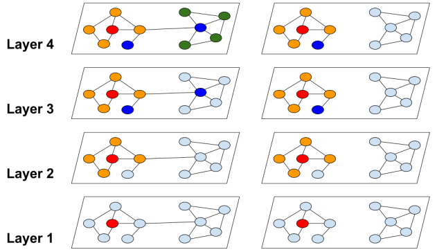

**图1**：传统图卷积与我们提出的聚类方法间的邻居展开差异。红色结点是邻居结点扩展的起始结点。传统图卷积中邻居扩展问题复杂度为指数级，而我们的方法则可以避免

在图1中，我们用全图$G$和聚类分区$\overline{G}$的邻居扩展进行说明。可以看到，Cluster-GCN专注于各聚类中的邻居，从而避免了繁重的邻居搜索。在表2中，展示了两种不同的节点划分策略：随机划分和聚类划分。通过使用随机分区和METIS将图划分为10个部分，再用一个分区作为一个批次，执行SGD更新。可以看到在相同epoch下，使用聚类分区能得到更高精度。

| Dataset | Random Partition | Clustering Partition |
| ------: | :--------------: | -------------------- |
|    Cora |       78.4       | 82.5                 |
|  Pubmed |       78.9       | 79.9                 |
|     PPI |       68.1       | 92.9                 |

**表2**：图的随机分区和聚类分区对比(在小批次SGD上训练)。聚类分区性能更优(就测试F1得分而言)，因为其删除了较少的分区间链接。

> 这三个数据集都是公开的GCN数据集。我们将在实验部分解释PPI数据。Cora有2,708个节点和13,264条边，Pubmed有19,717个节点和108,365条边。

#### 3.1.1	时间/空间复杂度

**时间复杂度**

由于$\mathcal V_t$中每个节点只连接其内部结点，因此每个结点不需要在$A_tt$外进行邻居搜索。每个批次的计算纯粹是矩阵积$\overline{A^\prime_{tt}}X_t^{(l)}W^{(l)}$和一些元素级操作，因此每批次时间复杂度为$O(||A_{tt}||_0F+bF^2)$.因此每epoch整体时间复杂度为$O(||A||_0F+NF^2)$，平均每批次只需计算$O(bL)$个Embedding，从而用线性复杂度替代了传统方法的指数级复杂度。

**空间复杂度**

每批次只加载$b$个样本，并存储每层的Embedding，从而产生用于存储Embedding的$O(bLF)$内存。因此我们在空间复杂度上也优于传统算法。

此外，我们的算法只需要将一个子图加载到GPU内存而无需加载全图。


### 3.2	随机多重分区

尽管朴素Cluster-GCN实现了良好的时间和空间复杂度，但仍有两个潜在问题：

- 图被分区后，一些连接(式4中的$\Delta$部分)被删除，这可能影响实际性能
- 图聚类算法往往将相似结点聚集在一起，因此其分布可能与原始数据集不同，从而导致在执行SGD更新时，对全梯度的估计存在偏差

在图2中，我们使用Reddit数据和Metis形成的聚类来展示不平衡标签分布的例子。根据每个簇的标签分布计算熵值。与随机划分相比，大多数簇熵值较小，这表明簇的标签分布偏向于某些特定标签。这增加了不同批次的差异，并且可能影响SGD收敛。

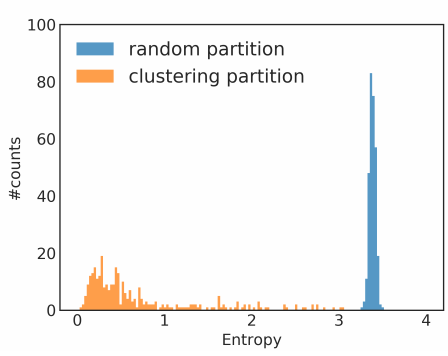

**图2**：基于标签分布的熵值柱状图，介绍了每批次内使用随机分区和聚类分区的情况。大多数聚类分区的批次标签熵较低，标明每个批次内的标签分布为偏态分布。相比之下，随机划分的批次内标签熵较高，尽管其效率较低。

(本例中，使用300个簇划分Reddit数据集)

> 频数分布有正态分布和偏态分布之分。正态分布是指多数频数集中在中央位置，两端的频数分布大致对称。
>
> 
>
> **偏态分布**是指频数分布不对称，集中位置偏向一侧。

为解决上述问题，我们提出了一种随机多簇方法，来合并簇间连接并减少批次间差异。

首先将图划分为相对较多的$p$个簇$\mathcal V_1,...,\mathcal V_p$，当为SGD更新构建一个批次$B$时，我们不只考虑一个簇，而是随机选择$q$个，表示为$t_1,...,t_q$，并将它们的结点$\left\{ \mathcal V_{t_1} \cup ...\cup \mathcal V_{t_q}\right\}$都纳入批处理。此外，所选簇之间的链接$\left\{ A_{ij}|i,j\in t_1,...,t_q\right\}$也添加回来了。

这样，这些簇间的连接被重新合并，且簇的组合使得批次间的方差更小。图3说明了我们的算法，对每个epoch，不同的簇组合被选为一个批处理。

(我们在Reddit数据集进行的试验证明了所提方法的有效性。)

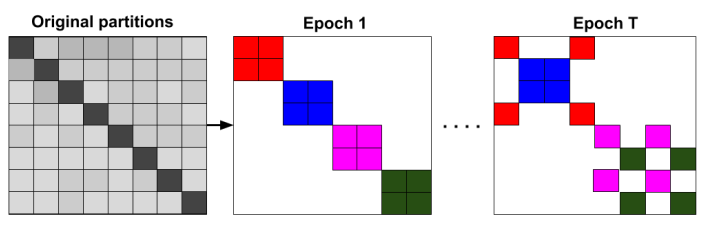

**图3**：所提出的随机多重分区。在每个epoch中，我们随机采样$q$个聚类(该实例中$q=2$)，并和它们的簇间连接一同构造为一个新批次。相同色块表示在同一批中。

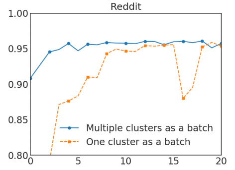

**图4**：选择单簇和多簇的比较，前者使用了300个分区，后者使用了1500个并随机选择五个组成一个批次。x轴为epoch数，y轴为F1分数

在图4中，我们可以发现使用多个簇作为一个批处理能改善收敛效果。我们最终的Cluster-GCN算法表述如算法1.

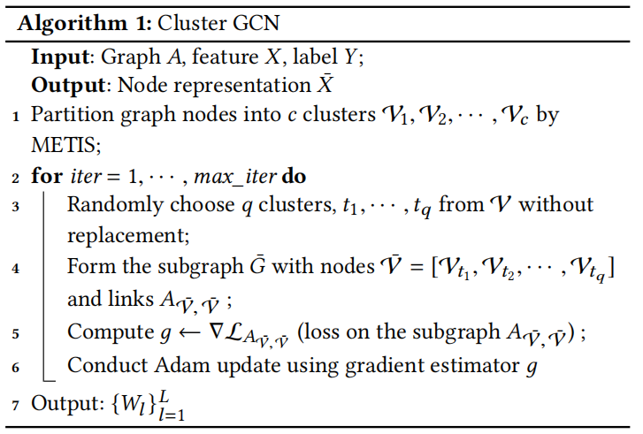
$$
算法1:聚类GCN\\
输入：图A,特征矩阵X,标签矩阵Y\\
输出：节点表征\overline X(Node Representation)\\
$$

```python
通过METIS将图中结点划分为c个簇:V_1,...,V_c
for i in range(max_iter):
    从V中随机选取q个簇t1~tq
    用选取的簇V' = [V_t1,...,V_tq]和簇内链接A_{V',V'}构建子图G'
    计算子图A_{V',V'}上的损失
    使用梯度估计g进行Adam更新
```

$$
输出：\left\{ W_l \right\}^L_{l=1}
$$

> 节点表征Node Representation：是图节点预测或边预测任务中的第一步，
>
> 在节点预测任务中，我们拥有一个图，图上有很多节点，部分节点的标签已知，剩余节点的标签未知。将节点的属性(x)、边的端点信息(edge_index)、边的属性(edge_attr，如果有的话)输入到多层图神经网络，经过图神经网络每一层的一次节点间信息传递，图神经网络为节点生成节点表征。有了节点表征，我们就可以对节点本身进行一些预测问题了。

### 3.3	训练更深GCN的问题

之前的实验[9]认为训练更深的GCN没有作用，然而实验中使用的数据集可能太小，无法进行适当证明。

例如[9]中只考虑了一个只有几百个训练节点的图，因此可能存在过拟合问题。

此外，深度GCN模型的优化比较困难，因为其可能会阻碍前几层的信息通过。[9]中使用了一种类似于残差连接[6]的方法，将信息从上一层传递到下一层。具体来说，他们修改了式(1)，将层$l$的隐藏表示(隐藏层输出)添加到下一层：
$$
X^{(l+1)} = \sigma(A^\prime X^{(l)}W^{(l)})+X^{(l)}\\
(8)
$$


> 更深的网络理论上会有更强的表达能力, 但实际训练中遇到的问题是层数加深后, 训练集误差不降反升. 这是因为网络变深后, 梯度消失隐患也会增大, 模型性能会不升反降.
>
> 为了应对梯度消失挑战, ResNet 的设计理念是允许低层的原始信息直接传到后续的高层, 让高层专注残差的学习, 避免模型的退化
>
> 假设神经网络某一层对input x进行了一个F操作，变为F(x)，那么正常的神经网络输出为F(x)，而加入残差连接以后，输出为x+F(x)
>
> 那么残差结构有什么好处呢？显而易见：因为增加了一项，那么该层网络对x求偏导的时候，多了一个常数项，所以在反向传播过程中，梯度连乘，也不会造成梯度消失。

在此，我们提出另一种简单的技术以改进深度GCN的训练。

在原始GCN设置中，每个节点从前一层中聚合其邻居的表示。然而在深度GCN中，由于未考虑层数问题，该策略并不适用，这导致其附近邻居比远处结点贡献更多。

因此我们提出了一种更好的方法，思路是**放大在每个GCN层使用的邻接矩阵$A$的对角线部分**，使每次聚合对前一层的表征赋予更高权重。以向$\overline A$添加标识为例：
$$
X^{(l+1)} = \sigma((A^\prime + I)X^{(l)}W^{(l)})\\
(9)
$$
式(9)表面看起来合理，但对所有节点使用相同权重而不论其邻居数量如何，可能并不合适、此外，其数值可能不稳定，因为当使用更多层时，数值可能以指数级增长。

因此我们提出了式(9)的改良，以更好维护邻居信息和数值范围。我们先为原始$A$添加一个标识并执行归一化：
$$
\widetilde A = (D+I)^{-1}(A+I),\\
(10)\\
X^{(l+1)} = \sigma((\widetilde A+\lambda diag(\widetilde A))X^{(l)}W^{(l)})\\
(11)
$$
使用"对角增强"技术的实验结果表明，这种新的归一化策略能帮助构建深度GCN和实现SOTA性能

> SOTA：state of the art，即目前最好的


## 4	实验

我们评估了我们提出的在两个任务上训练GCN的方法：多标签分类和多分类。数据集的统计量如表3所示。

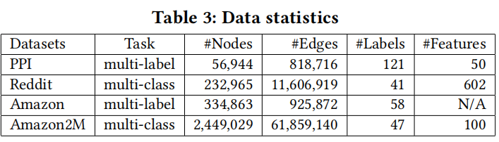

**实验数据集**

所用的Reddit数据集是当时可用的最大GCN数据集，Amazon2M是论文作者自行收集且其规模远大于Reddit

**实验包含的算法**

在比较中包括了以下GCN训练算法：

- Cluster-GCN：本文所提出的快速GCN训练方法
- VRGCN[2]：为加快训练速度，保留了图中所有结点的历史Embedding，只扩展到几个邻居；按[2]$^5$建议，采样邻居数量设为2
- GraphSAGEGraphSAGE：对每个结点采样固定数量邻居，我们使用其中每层采样大小默认设置($S_1=25,S_2=10$)

对其他方法，我们使用了其论文对应的原始代码，由于[9]不适用于大规模图，因此不予讨论。

同样如[2]所示，VRGCN比FastGCN快，因此在这里不与FastGCN比较。

**参数设置**

对所有方法，均使用Adam优化器，学习率0.01，dropout率20%，权重衰减为0

> **dropout**：缓解过拟合，一定程度上达到正则化效果
>
> Dropout可以作为训练深度神经网络的一种trick供选择。在每个训练批次中，通过忽略一半的特征检测器(让一半的隐层节点值为0)，可以明显地减少过拟合现象。这种方式可以减少特征检测器(隐层节点)间的相互作用，检测器相互作用是指某些检测器依赖其他检测器才能发挥作用。
>
> 简单说：我们在前向传播的时候，让某个神经元的激活值以一定的概率p停止工作，这样可以使模型泛化性更强，因为它不会太依赖某些局部的特征
>
> 控制好dropout rate也是调参的关键，调好了就是加大模型鲁棒性，调不好就是overfitting
>
> 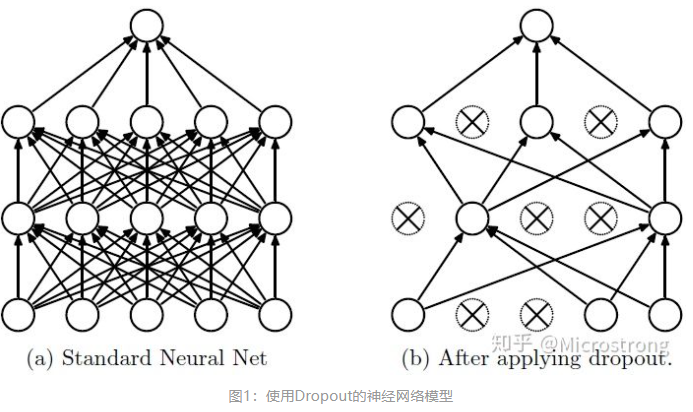
>
> 权重衰退：
>
> - 通过L2正则项使得模型参数不会过大，从而控制模型的复杂度
> - 正则项权重是控制模型复杂度的超参数

聚合器使用GraphSAGE提出的平均算子(**Mean aggregator**)，所有方法的隐藏层神经元数量都相同。

注意，这里没有考虑式(11)，即对角增强等技术。在每个实验中，所有方法都考虑相同的GCN结构。

对VRGCN和GraphSAGE，按原论文提供的设置，并将批处理大小设为512；对Cluster-GCN，表4列出每个数据集分区和簇数量。

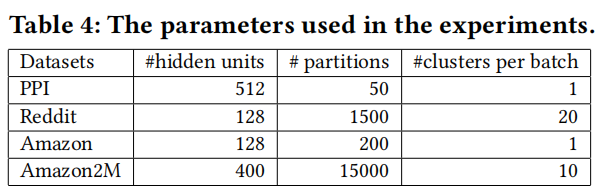

注意，实验中，聚类被视作一个预处理步骤，在训练中没有考虑到其运行时间。表13展示了对四个GCN数据集预处理时间。我们使用Metis(一个高速可扩展的图聚类库)。我们观察到，图聚类算法只花费了一小部分预处理时间，在大数据集上应用时只需很小的额外成本。此外，一次图聚类就可形成节点分区，且之后可重用。

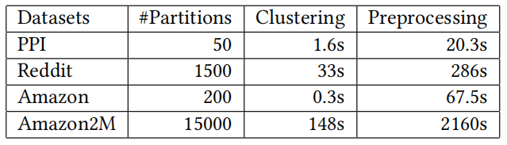

**表13**：在GCN训练前的图聚类算法(METIS)和数据预处理的运行时间

### 4.1	中值大小数据集的训练性能

#### 4.1.1	训练时间与准确性

**训练时间**：在图6中，我们对比了2、3、4层GCN模型的性能。由于GraphSAGE比VRGCN和我们的方法慢，因此其曲线只出现在PPI和Reddit数据集中。可以看到，对不同层数的GCN模型，我们的方法在PPI和Reddit数据集上都是最快的。

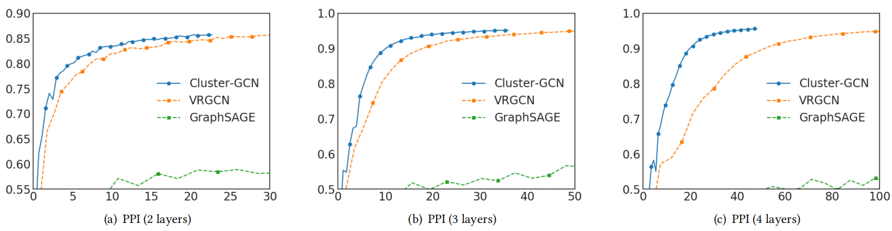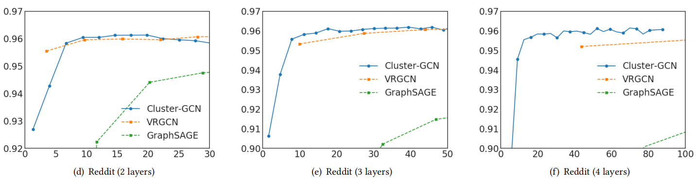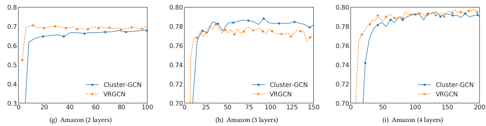

**图6**：对比不同GCN训练方法，x轴为训练时间(单位秒)，y轴为F1分数


对Amazon数据，由于结点的特征不可用，因此我们使用一个单位矩阵作为特征矩阵$X$。在此设置下，参数矩阵$W^{(0)}$

shape变为334863x128。因此，计算主要是进行稀疏矩阵操作，如$AW^{(0)}$

##### 4.1.1.1	比VRGCN慢的可能原因

3层情况下，我们的方法比VRGCN更快，但2、4层更慢。原因可能是不同框架稀疏矩阵操作速度不同。VRGCN使用TensorFlow而我们使用PyTorch。

在表6中，我们展示了TensorFlow和Pytorch对Amazon数据集进行前向/反向操作的时间，并使用一个简单的两层网络对两个框架进行基准测试。可以看到TensorFlow快于Pytorch，当隐藏层神经元数量增加时其差距更明显。这也许能解释Cluster-GCN在Amazon数据集训练时间长的问题、

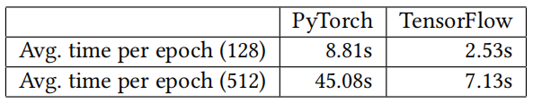

**表6**：对Pytorch和TensorFlow中稀疏张量操作的基准测试。测试使用了两个线性层组成的简单网络，时间包含前向和反向操作。括号中数字表示第一层中隐藏神经元数量，数据集为Amazon数据集。


**内存表现**：

> 对于大规模GCN训练，除训练时间外，其所需内存更为重要，并直接限制了其可扩展性。内存占用包括在epoch中训练GCN所需内存。

- 如第3节所述，为了加速训练，VRGCN需要在训练中保存历史Embedding，因此其需要更多内存。
- 由于指数级的邻居增长问题，GraphSAGE也有需要更高的内存

在表5中，我们比较了对不同GCN中，三种方法所需内存。当层数增加时，Cluster-GCN内存需求不会增长很多，原因是增加一层时，引入的额外变量是权重矩阵$W^{(L)}$，与子图和节点特征相比，相对较小。

而VRHCM需要保存每一层的历史Embedding，且通常很密集，因此总占大头。

表5可见，Cluster-GCN比VRGCN内存使用效率更高。

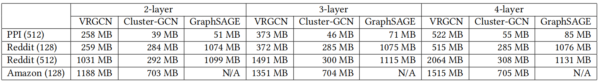

**表5**：比较在不同数据集上的内存使用情况。括号中的数字表示隐藏神经元数。


### 4.2	Amazon2M上的实验性结果

迄今用于测试GCN的最大的公共数据是Reddit数据集，其统计数据如表3所示，其中包含约200K个节点。如图6所示，对这些数据的GCN训练可以在几百秒内完成。

为了测试GCN训练算法的可伸缩性，我们基于亚马逊共同购买网络[11,12]，构建了一个更大的包含超过200万个节点和6100万条边的图。原始的共同购买数据来自Amazon3M$^7$。

在表8中，我们将从训练时间、内存使用和测试准确性(F1分数)方面，以不同层数的GCN模型与VRGCN进行比较。

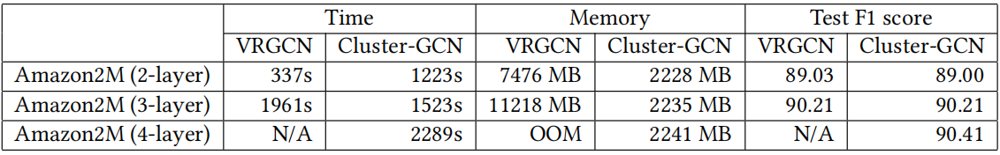

**表8**：在Amazon2M数据集上两模型训练运行时间，内存占用和测试准确度(F1分数)对比


由表可见：

- VRGCN比2层GCN的Cluster-GCN快，但在增加一层时比Cluster-GCN慢，且两者精度近似
- VRGCN所需内存远多于Cluster-GCN(3层模型上相差五倍，4层模型出现内存溢出)，而Cluster-GCN在层数增加时无需额外内存。


### 4.3	训练更深的GCN

本节将考虑使用更深的GCN。首先在表9中对比了Cluster-GCN和VRGCN的时间，基准测试数据集使用PPI。对两个方法分别运行200epoch，发现由于VRGCN的邻居搜索问题，其运行时间呈指数级增长；而Cluster-GCN只是线性增长。

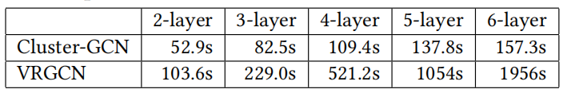

接下来研究更深层GCN能否获得更好的准确性。在3.3节中讨论过修改邻接矩阵$A$以促进深度GCN模型训练的策略。

我们将对角增强技术应用于深度GCN，并在PPI数据集进行实验。结果如表11所示：

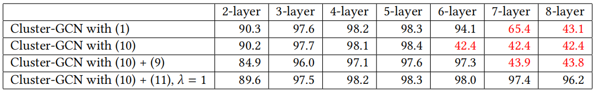

**表11**：使用不同对角增强技术比较。此处展示所有方法在200epoch训练达到的最好精度。数据集使用PPI，dropout率0.1，其他设置与4.1节所述相同。标红数字表示模型未收敛。


对2-5层情况，所有方法准确性都随层数增加而增加，这表明更深的GCN可能是有用的。

然而使用7或8层GCN时，前三种方法不能在200epoch内收敛，且精度严重降低。可能原因是，优化更深层的GCN更加困难。

我们在图5中展示了一个8层GCN模型的具体收敛性，利用式(11)所述对角增强技术，可以显著提高收敛性并获得近似精度。

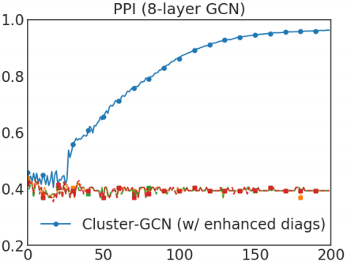

**图5**：在一个8层GCN上的收敛情况。x轴为epoch，y轴为验证精度。除使用式11所述方法外，其他方法都不收敛


#### 4.3.1	通过训练更深GCN获得最先进结果

通过Cluster-GCN和提出的归一化方法，我们有能力训练更深层次GCN以获得更好的准确性(F1分数)

我们将测试精度与表10其他现有方法对比，对于PPI，Cluster-GCN通过训练含2048个隐藏神经元的5层GCN模型实现了最先进结果。对于Reddit则使用了一个包含128隐藏神经元的4层GCN模型：

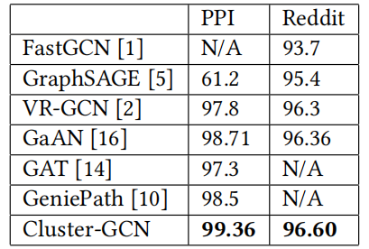


## 5	结论

提出了一种新的快速、高效的GCN训练算法。实验结果表明，该方法可以在大规模图上训练非常深的GCN，例如在一个超过200万个节点的图上，使用约2G内存的训练时间不到1小时，准确率达到90.41(F1分数)。使用所提出的方法，我们能够成功地训练更深层次的GCN，从而在PPI和Reddit数据集上实现了最先进的测试F1分数。


## 6	实现细节

- 之前的工作[1,2]提出在GCN第一层预计算乘积$AX$，我们如是。通过预先计算$AX$，本质上是为每个节点使用精确的1跳邻居，并且可以保存在第一层中搜索到的邻居。
- 在3.2节中，选择多簇时，会重新添加一些簇间连接。因此新的组合邻接矩阵应重新归一化，以保持结果Embedding矩阵的数值范围。结果表明重新归一化是有效的。


## 7	思考

为了解决普通训练方法无法训练超大图的问题，Cluster-GCN提出：利用图聚类算法将一个图的节点划分为多个簇，每次选择几个簇的节点和这些节点对应的边构成一个子图，然后对子图做训练。

### 7.0	原理：

在每个步骤中，它对与图聚类算法识别的稠密子图相关联的节点块进行采样，并限制在该子图中进行邻域搜索。在构建批量进行SGD更新时，没有只考虑一个簇，而是随机选择$q$个簇

### 7.1	优点

- **提高表征利用率、训练效率**。由于是利用图节点聚类算法将节点划分为多个簇，所以簇内边的数量要比簇间边的数量多得多，所以可以提高表征利用率，并提高图神经网络的训练效率。
- **解决batch内类别分布偏差过大的问题**。每一次随机选择多个簇来组成一个batch，这样不会丢失簇间的边，同时也不会有batch内类别分布偏差过大的问题。
- **减少内存消耗，提高模型精度**。基于子图进行训练，不会消耗很多内存空间，因此可以训练更深的神经网络，进而可以达到更高的精度。

### 7.2	痛点

- 本文提出了的方法实际上是利用图结构特征进行降维，但可能会如文中提到了，将一些重要的连接忽略掉，导致对某些数据、某些任务不适用。
- 如果能设计深层的结构，是否可以以端到端的方式将这种图聚类分析得到的图结构信息融合进去？
- 本文提到的训练深层GNN的出发点应当是不成立的，因为如果训练得当，每层的权重参数应该能包含该层节点的权重信息，不同层天然是不等权的。
- 为什么聚类之后再做卷积会有效？说明稀疏链接信息不太重要？
- 在异构图上如何推广？
- 聚类打破了远距离传输的通道，如果Cluster-GCN广泛有效，那么是不是说明远距离信息不太重要？
- GNN中常用的增加全局链接节点的trick旨在传递全图的信息，与Cluster-GCN是否相悖？
- Metis是基于内存的聚类方法，如果图再大到放不到内存里的情况，是否有其他有效的聚类方法？
- Cluster-GCN没有完全解决子图采样对GCN计算带来的偏差，因此采样造成的偏差仍然存在，而GraphSAINT则显式考虑了该问题，可以保证采样后节点的聚合过程是无偏的，并且使采样带来的方差尽量小


