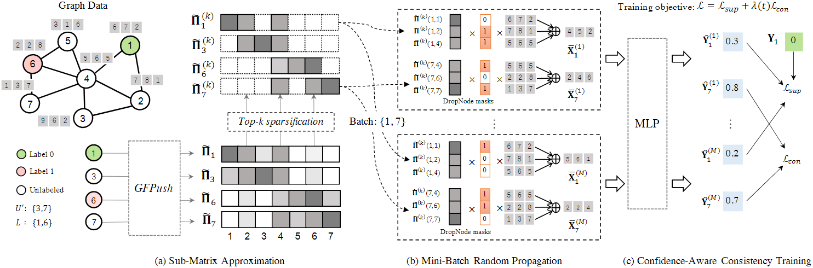
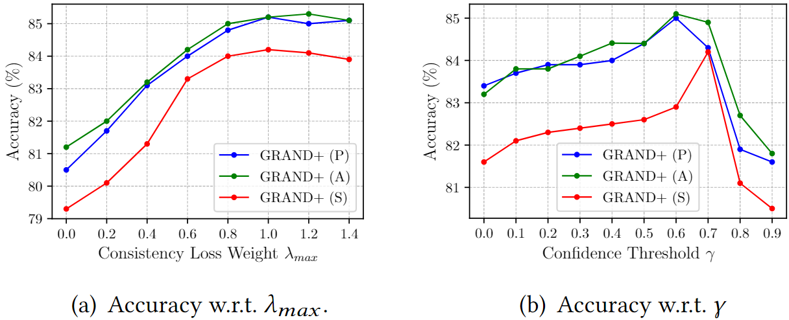
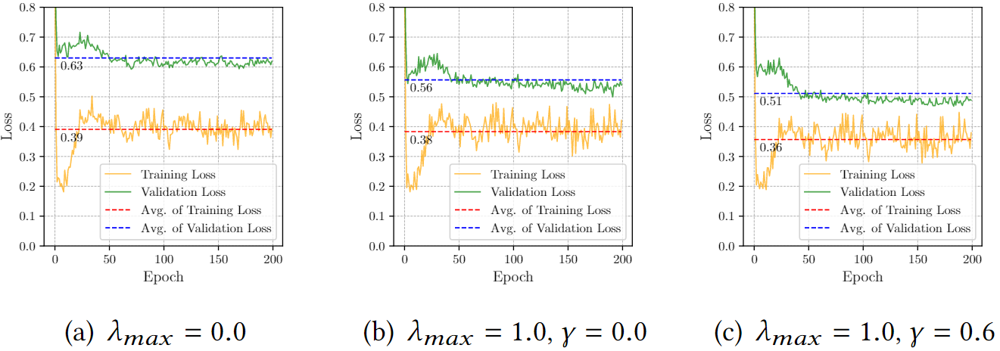
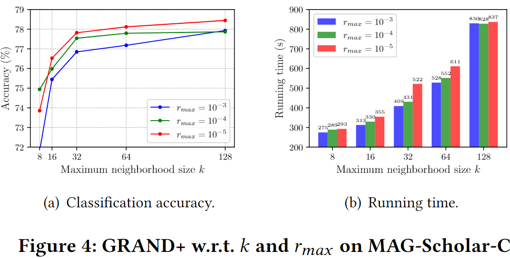
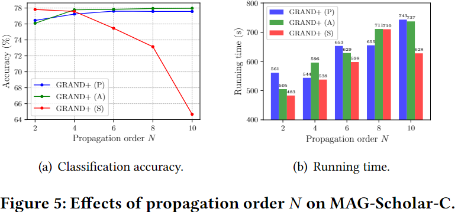

# 论文十问

1.论文试图解决什么问题？

提出了图随机神经网络(GRAND)，利用随机传播策略来增强图数据，并利用一致性正则化来优化不同数据增强范围内未标记节点的预测一致性，从而解决GNN中标记节点有限引起的过度平滑、非鲁棒性和弱泛化问题。

目的:提高模型能力，增强理论解释。

主题:半监督学习，GNN正则化方法

# 现有问题

## 1.	过平滑问题

过多的图卷积操作会使拉普拉斯矩阵的元素值趋于一致，因此，堆叠许多 GNN 层往往会使节点的特征无法区分。此外，**许多工作表明传播过程中耦合的非线性变换(信息变换)进一步加剧了过平滑问题。**

## 2.	节点易被数据噪声误导并易受对抗性扰动的影响

由于在大多数图攻击中采用了确定性传播，自然地，确定性传播使每个节点与其（多跳）邻域高度依赖，因而GNN 无法应对图攻击。

## 3.	半监督学习的设置

现有的GNN半监督训练方法很容易过拟合稀缺的标签信息，解决这一广泛问题的大多数努力都集中在如何充分利用大量未标记数据上。受到CV领域提出的MixMatch、UDA的启发，本文通过设计一致性正则化训练的数据增强方法来解决这一问题。

# 论文方案

## 1.	随机数据增强

**随机传播**：

​	1.通过随机删除特征矩阵中的元素，生成扰动特征矩阵。

​	2.利用扰动特征矩阵进行特征传播，生成增强特征。

在这个过程中，节点特征都随机与邻居节点混合在一起。

同态假设表明**相邻节点往往具有相似的特征和标签**。因此一个节点丢失的信息可以由它的邻居来补偿，换句话说，随机传播允许我们随机地为每个节点生成多个增强表示。

### 1.1	随机特征增强

- 要实现第一步，简单思路是对节点特征使用Dropout，即随机丢弃节点部分特征。更进一步地，我们可以DropNode，即删除一些节点的整个特征向量，而不是删除单个特征元素。换句话说，DropNode通过完全忽略某些节点的特征，使每个节点只聚合来自其(多跳)邻居子集的信息，这减少了它对特定邻居的依赖，从而有助于增加模型的鲁棒性。在经验上，它产生了更多的随机数据增强，并且比Dropout获得了更好的性能。DropNode的采样过程仅在训练期间执行。在推理过程中，我们直接使用原始特征矩阵 X。

### 1.2	混合阶传播

- 在第二步中，我们采用了混合阶传播（mixed-order propagation）。具体而言，我们定义了一个新的变量 $\bar{X}=\bar{A}\tilde{X}$，其中 $\bar{A} = \sum^{K}_{k=0}\frac{1}{K+1}\hat{A}^k$ 是 $\hat{A}$ 的幂级数（power series）从阶数 0 到阶数 K 的平均值。这种传播规则使模型能够融合更多的局部信息，在与直接使用$ \hat{A}^K$ 相比，减少了过平滑风险。注意，计算稠密矩阵$ \bar{A}$ 的效率较低，因此在实现中，我们通过迭代计算和累加稀疏矩阵 $\hat{A}$ 和 $\hat{A}^{k}\tilde{X}(0 ≤ k ≤ K − 1)$的乘积来计算$ \bar{X}$。

### 1.3	信息变换

在进行 $S$ 次随机传播后，得到了$S$ 个增强特征矩阵 $\{X^{(s)}|1 ≤ s ≤ S\}$。这些增强数据中的每一个都被送入两层 MLP 以获得相应的输出：$\tilde{Z}^{(s)}=f_{mlp}(\bar{X}^{(s)}, \Theta)$， 其中$\tilde{Z}^{(s)}\in [0, 1]^{n \times C}$表示在$X^{(s)}$上的预测概率， $\Theta$是模型参数。

传统的GNN消息传递公式为$H=\sigma(AXW)$， 即特征传递和信息变换两步是耦合的；而GRAND通过随机传播的方式，用混合阶传播的方式实现了特征传递，又用一个两层的MLP实现了信息变换，将消息传递的两步解耦，从而进一步防止了模型的过平滑。**解耦的好处在于我们能够在不进行非线性变换的情况下执行高阶特征传播，降低过平滑的风险**

## 2.	一致性正则化训练

在GNN的半监督学习中，目标通常是通过正则化来平滑图上的标签信息，即其损失函数是标记节点上监督损失和图正则化损失的组合。给定随机传播生成的 $S$ 个数据增强，我们可以自然地为半监督学习设计一致性正则化损失。

### 2.1	监督损失

在 $n$ 个节点中有 $m$ 个标记节点的情况下，每 epoch 中图节点分类任务的监督目标定义为 $S$ 个增强的平均交叉熵损失：
$$
\mathcal{L}_{sup}=-\frac{1}{S}\sum^{S}_{s=1}\sum^{m-1}_{i=0}Y_{i}^{\intercal}log{\tilde{Z}_{i}^{(s)}}
$$

### 2.2	一致性正则化损失

在半监督设置中，我们建议优化未标记数据的 $S$个 增强数据之间的预测一致性。以$S=2$为例，我们可以最小化两个输出间的平方$L_2$距离，即$min\sum^{n-1}_{i=0}{\Vert \tilde{Z}_{i}^{(1)}-\tilde{Z}_{i}^{(2)}\Vert_{2}^{2}}$

将情况扩展到多重增强， 我们首先通过取所有分布的平均值来计算标签分布中心，即$\bar{Z}_{i}=\frac{1}{S}\sum^{S}_{s=1}{\tilde{Z}_{i}^{(s)}}$，然后我们使用MixMatch提出的“**锐化**”技巧，根据平均分布“猜测”标签。具体来说，第 $i$ 个节点在第 $j$ 个类别上的猜测概率如下式：
$$
\bar{Z}_{ij}^{\prime} = \bar{Z}_{ij}^{\frac{1}{T}} \Big/ \sum_{c=0}^{C-1}{\bar{Z}_{ij}^{\frac{1}{T}}},\ (0 \leq j \leq C-1)
$$
其中$0<T\leq 1$表示控制分类分布的锐度的“温度”。当$T \rightarrow 0$时，锐化标签分布将接近 one-hot 分布。我们最小化每个分布$\bar{Z}_{i}$与平均猜测概率$\bar{Z}_{i}^{\prime}$的距离：
$$
\mathcal{L}_{con} = \frac{1}{S}\sum^{S}_{s=1}\sum^{n-1}_{i=0}{\Vert \bar{Z}_{i}^{\prime} - \bar{Z}_{i}^{(s)}\Vert^{2}_{2}}
$$
因此，通过将$T$设置为一个小值，我们可以强制模型输出低熵预测。这可以看作是在模型中增加了一个额外的熵最小化正则化，该模型假设分类器的决策边界不应该通过边缘数据分布的高密度区域。

综上，GRAND最终在半监督学习中使用的损失函数为：
$$
\mathcal{L} = \mathcal{L}_{sup} + \lambda\mathcal{L}_{con}
$$
其中， $\lambda$是控制两个损失间平衡的超参数。在推理过程中，直接使用原始特征矩阵$X$进行传播。这是合理的，因为我们在训练期间缩放了扰动特征矩阵，以保证其期望与$X$匹配，因此得递推公式为$Z = f_{mlp}(\bar{A}X， Θ)$。

# 论文局限性

本文提出的方案基于同态假设，在同态性较差的图上可能无法成功。

# GRAND+

GRAND的有效性依赖于计算成本高昂的数据增强过程，因此很难处理大规模图。为了解决上述问题，GRAND+开发了一种广义前推(GFPush)算法，以预先计算一个通用传播矩阵，并将其用于以小批方式执行图数据增强。

GFPush的低时空复杂性使GRAND+能够有效地扩展到大规模图。此外，GRAND+的模型优化中引入了信心感知的一致性损失，增强了GRAND+的泛化优势。

## 本文贡献

1. 广义特征传播(Generalized feature propagation)： 提出了一种广义混阶矩阵来进行随机特征传播，提供了一组可调权重来控制不同邻域顺序的重要性，从而提供了一种灵活的机制来处理复杂的实际图。

2. 高效逼近(Efficient approximation)：采用了近似方法——广义前推(GFPush)来有效计算广义传播矩阵。这使得GRAND+能够以小批处理的方式执行随机传播和模型学习，为模型提供了显著的可伸缩性。

3. 置信度感知损失(Confidence-aware loss)：为GRAND+正则化框架设计了一个置信度感知损失。这有助于在一致性训练中过滤掉潜在的噪声，忽略高度不确定的未标记样本，从而提高GRAND+的泛化性能。

本文只关注半监督图节点分类问题，对每个样本$s$有：

1)特征向量$X_s\in X \in \R^{|V|\times d_f}$

2)标签向量$Y_s\in Y \in \{0,1\}^{|V|\times C}$， 其中$C$表示类别数

在半监督设置中，只有有限节点$L\in V$有可见标签$(0 < |L| \ll |V|)$， 其余节点的标签不可见。

## Scalable GNN

本文将扩展GNN的方法分为三种： 

1)节点采样方法：采用采样策略来加速递归特征聚合过程，代表方法包括GraphSAGE、FastGCN ； 

2) 图分割方法：将原始大图划分为几个子图并在子图上运行 GNN。代表方法为 Cluster-GCN和 GraphSAINT

3) 矩阵近似方法：遵循 SGC的设计，将特征传播和非线性变换解耦，并利用一些近似方法来加速特征传播。

GRAND+是一种矩阵近似方法

GRAND设计了随机传播——一种混合阶传播的策略，来实现图数据增强。

首先，使用DropNode随机删除节点特征，然后用混合阶矩阵在图上传播扰动特征矩阵。

GRAND的消息传递没有使用PPR矩阵，而是使用了平均池化矩阵$\Pi^{avg}_{sym} = \sum^N_{n=0}{\hat{A}^{n}}\big/ (N+1)$。形式上，随机传播策略表示为：
$$
\bar{X}=\Pi^{avg}_{sym}\cdot diag(z) \cdot X, z_i \sim Bernoulli(1-\delta)
$$
$z\in {0, 1}^{|V|}$表示从伯努利分布$Bernoulli(1-\delta)$中绘制的随机DropNode掩码，$\delta$是DropNode的概率。

这样，每个节点丢失的信息由它的邻域来补偿。在图数据同态假设下，得到的扰动特征矩阵可以看作是原始特征矩阵的有效数据增广。由于DropNode的随机性，该方法理论上可以对每个节点产生指数级的增广。

在GRAND的每个训练步骤中，随机传播执行$M$次，得到$M$个增强的特征矩阵$\{\bar{X}^{(m)}|1 \leq m \leq M\}$。然后所有增强特征矩阵输入MLP，得到$M$个预测。在优化过程中，GRAND同时使用标记数据上的分类损失和未标记节点集$U$上的额外一致性正则化损失进行训练，即
$$
\frac{1}{M\cdot |U|}\sum_{s\in U}\sum^M_{m=1}\Vert\hat{Y}_{s}^{(m)}-\bar{Y}_{s}\Vert^{2}_{2},\ \ \bar{Y}_{s}=\sum_{m=1}^{M}{\frac{1}{M}\hat{Y}_{s}^{(m)}}
$$
其中，$\hat{Y}_s^{(m)}$是以$\bar{X}_s^{(m)}$作为输入时，MLP对于节点$s$的预测概率。一致性损失通过强制神经网络对不同的未标记数据增强量给出相似的预测，提供了额外的正则化效果。通过随机传播和一致性正则化，GRAND实现了比传统GNN更好的泛化能力[12]。

### GRAND的扩展性

当$n$取值比较大时，直接计算$n$阶邻接矩阵$\hat{A}^n$并不可行。为了避免这个问题，GRAND采用幂次迭代直接计算整个增广特征矩阵。即迭代计算和求和，并求出$\hat{A}$与$\hat{A}^n \cdot diag(z) \cdot X\ for\ 0 \leq n \leq N$的乘积。该方法用稀疏-密集矩阵乘法实现的，它的线性时间复杂度为$O(|V|+|E|)$。然而，它需要在每个训练步骤执行$M$次，以产生不同的特征增强。因此对于$T$步训练，总时间复杂度为$O(T\cdot M \cdot (|V|+|E|))$，在处理大规模图时开销极高。

## GRAND+

GRAND+遵循GRAND的一致性正则化原则，并提出了使其可扩展到大图的技术，同时保持GRAND的灵活性和泛化能力。

简而言之，我们在GRAND+中提出了一种有效的近似算法——广义前向推送(GFPush)来代替幂次迭代传播特征，以预先计算传播矩阵所需的行向量并以小批量方式进行随机传播。该过程的时间复杂度由预定义的超参数控制，避免了GRAND所面临的可扩展性限制。此外，GRAND+采用了一种新的置信度感知损失进行一致性正则化，使得训练过程更加稳定，泛化性能优于GRAND。

### 传播矩阵

在GRAND+中，提出以下用于特征传播的广义混合阶矩阵:
$$
\Pi = \sum^{N}_{n=0}{w_n \cdot P^n},P=\tilde{D}^{-1}\tilde{A}
$$
其中$\sum^{N}_{n=0}{w_n}=1$且$w_n \geq 0$，$P$是行归一化邻接矩阵。不同于GRAND和其他GNN使用的传播矩阵，$\Pi$的形式采用了一套可调权重$\{w_n | 0 \leq n \leq N \}$来融合不同顺序的邻接矩阵。通过调整$w_n$，GRAND+能够灵活调整不同阶邻居的权重，从而适应现实世界中具有不同结构属性的各种图。

### 训练流程

为实现快速训练，GRAND+放弃了直接计算整个增强特征矩阵的幂次迭代，而是改为对每个节点分别计算增强特征向量。理想情况下，节点$s$的增强特征向量$\bar{X}_s$计算公式为：
$$
\bar{X}_s = \sum_{\mathcal{v}\in \mathcal{N}^\pi_s}z_v\cdot \Pi(s,v) \cdot X_v, z_v \sim Bernoulli(1-\delta)
$$
这里我们使用$\Pi_s$表示与节点$s$对应的行向量，$\mathcal{N}^\pi_s$表示$\Pi_s$的非零元素索引，$\Pi(s,v)$表示$\Pi_s$的第$v$个元素。这种模式允许我们在每个训练步骤中仅为一批节点生成增强特征，从而使我们能够使用高效的小批量梯度下降进行优化。

然而，很难在实践中计算出$\Pi_s$的准确形式。为了解决这个问题，开发了计算$\Pi_s$的近似方法。

近似过程包括两个阶段：

1）使用广义前推(GFPush)方法计算行向量$\Pi_s$的误差有界近似$\widetilde{\Pi}_s$

2）采用了一种*top-k*稀疏化策略，将$\tilde{\Pi}_{s}$截断为仅包含前𝑘个最大元素。

得到的稀疏化行近似$\widetilde{\Pi}_s^{(k)}$替代上式(8)中$\Pi_s$，来计算$\bar{X}_s$。为了提高效率，需要为训练中使用的所有节点预先计算相应的行近似。

除了标记节点外，GRAND+还要求未标记节点在训练期间执行一致性正则化。为进一步提高效率，GRAND+不使用未标记节点全集$U$，而是采样一个子集$U^\prime \subseteq U$用于一致性正则化。

如图1所示，GRAND+训练流程分为三步：

- **子矩阵近似**：使用广义前推(GFPush)和top-k稀疏，得到标记节点集$L$全集和未标记节点子集$U^\prime$并集($L\cup U^\prime$)中每个节点对应的稀疏化行近似$\Pi_s^{(k)}$。得到的子矩阵用于进行随机传播。
- **小批量随机传播**：在训练每一步中，从$L\cup U^\prime$中抽样一批节点，并用近似行向量为批次中每个节点生成多个增强特征。
- **置信度感知训练**：将增强特征输入MLP，得到相关预测并用训练损失和置信度感知损失优化模型

图1. GRAND+图示

#### 1.	子矩阵近似

**广义前推(Generalized Forward Push, GFPush)**：可以看出，行正则化邻接矩阵$P=\tilde{D}^{-1}\tilde{A}$也是节点自环的图$\tilde{G}$上的**反向随机游走转移概率矩阵**，其中行向量$P_s$表示从节点$s$开始的随机游走转移概率。

基于此事实，我们提出广义前推算法，来用一个有界误差近似表示行向量$\Pi_s=\sum^N_{n=0}w_nP^n_s$。GFPush受Forward Push算法的启发，用于逼近个性化PageRank向量，同时具有更高的灵活性，可以近似广义混合阶矩阵$\Pi$。

广义前推算法的核心思想是模拟从节点$s$开始的$N$步随机游走概率扩散过程，并进行一系列的加速剪枝操作。为了实现，我们要在训练每一步$n(0 \leq n \leq N)$准备一对向量：

①储备向量 $q^{(n)}\in \R^{|V|}$，表示在阶段$n$的概率质量(?probability masses)	

②残差向量$r^{(n)}\in \R^{|V|}$，表示扩散到阶段$n$之外的概率质量

算法1给出了GFPush的伪代码，在开始阶段，$r^{(0)}$和$q^{(0)}$都初始化为指示向量$e^{(s)}$，其中$e_s^{(s)}=1,e_v^{(s)}=0$，即随机游走从$s$开始，概率质量为1。其他保留向量和残差向量(即$r^{(n)}$和$q^{(n)},\ 1 \leq n \leq N$)都被初始化为零向量。然后算法$N$步迭代更新保留向量和残差向量。

在第$n$次迭代，算法对满足$r_v^{(n-1)}>d_v \cdot r_{max}$的节点$v$执行一次推送(push)操作(算法1的第5-9行)。这里$d_v=\tilde{D}(v,v)$表示节点$v$的度，$r_{max}$是预先定义的阈值。在推送操作中，节点$v$的残差向量$r_v^{(n-1)}$被均分到其邻居中，结果被存储在第$n$个残差向量$r^{(n)}$中。同时，保留向量$q^{(n)}$也更新为与$r^{(n)}$相同。在完成节点$v$上的推送操作后，我们将$r_v^{(n-1)}$重置为0，从而避免重复更新。

为了更直观地理解这个过程，我们可以看到$r_v^{(n-1)} / d_v$是随机游走从节点$v$到邻居节点$u$的条件概率，前提是它在前一步以$r^{(n-1)}_v$的概率到达节点$v$。因此每次在$v$上的推送操作可以被看做是从$v$到其邻居的一步随机游走概率扩散过程。

为了保证效率，广义前推只在残差向量值大于$d_v \cdot r_{max}$时对节点$v$进行推送操作。因此当第$n$次迭代完成，$q^{(n)}$可以被看作是$n$步随机游走转移向量$P_s^n$的近似。$\tilde{\Pi}_s=\sum^N_{n=0}{w_n}q^{(n)}$相应地可以认为是算法的返回$\Pi_s$的近似。

##### 理论分析

我们得到了关于GFPush的时间复杂度、内存复杂度和近似误差的边界定理。

**定义1**	算法1时间复杂度$O(N/r_{max})$，空间复杂度$O(N/r_{max})$，并返回$\tilde{\Pi}_s$作为$\Pi_s$的带有$L_1$误差边界: $\Vert \Pi_s - \tilde{\Pi}_s \Vert_1 \leq N \cdot (2|E|+|V| \cdot r_{max})$的近似。

定理1表明GFPush的近似精度和运行成本与$r_{max}$呈负相关。在实践中，我们可以使用$r_{max}$来控制效率和近似精度之间的权衡。

**Top-k 稀疏**

为了进一步减少训练开销，我们对$\tilde{\Pi}_s$执行top-k稀疏化，只保留$\tilde{\Pi}_s$中前$k$个最大的元素，其余置零。因此，得到的稀疏转移向量$\tilde{\Pi}_s^{(k)}$最多有$k$个非零元素。这样，在随机传播时，模型只能考虑每个节点的$k$个最重要邻居，根据聚类假设，这仍然是有效的。

**并行化**

在GRAND+，我们需要对$L \cup U^\prime$中所有节点进行行向量近似。在GFPush中，不同的行近似是彼此独立计算的，因此可以并行计算近似向量，实现中是以多线程完成的。

#### 2.	小批量随机传播

GRAND+ 采用$\Pi$的稀疏行近似，以小批量方式进行随机传播。具体来说，在训练第$t$步，从标记节点$L$中随机抽取一批标记节点$L_t$，再从未标记节点子集$U^\prime$中随机抽取一批节点$U_t$。接着计算节点$s \in L_t \cup U_t$的增强特征向量$\bar{X}_s$：
$$
\bar{X}_s = \sum_{v\in \mathcal{N}_s^{(k)}}{z_v \cdot \tilde{\Pi}^{(k)}(s, v) \cdot X_v},\ \ z_v \sim Bernoulli(1-\delta)
$$
其中$\mathcal{N}_s^{(k)}$表示$\tilde{\Pi}^{(k)}$的非零索引，$X_v\in \R^{d_f}$是节点$v$的特征向量。在训练每步，通过重复这个步骤$M$次，能够生成$M$个增强特征向量$\{\bar{X}_s^{(m)}| 1 \leq m \leq M\}$.令$b = \lvert{L_t}\rvert+\lvert{U_t}\rvert$表示批次大小。这样，每个批次的时间复杂度边界为$O(k \cdot b \cdot d_f)$

**可学习表征的随机传播**

在上式中，增强特征向量$\bar{X}_s$以原始特征$X$计算。然而一些实际应用中，如图像或文本分类中，$X$的维度可能非常大，这将产生很大的计算成本。为了缓解这个问题，我们可以部署一个线性层，将$X_v$转换到一个低维隐藏表示$H_v \in \R^{d_h}$，然后再执行随机传播：
$$
\bar{X_s}=\sum_{v\in \mathcal{N}_s^{(k)}}{z_v\cdot \tilde{\Pi}^{(k)}(s,v)\cdot H_v},\ \ H_v = X_v \cdot W^{(0)}
$$
其中$W^{(0)} \in \R^{d_f\times d_h}$表示可学习的变换矩阵。这样，复杂度降低到了$O(k\cdot b\cdot d_h)$，其中$d_h \ll d_f$表示$H_v$的维度

**预测**

训练时，增强特征向量$\bar{X}_s^{(m)}$进入MLP模型，并得到相关输出：
$$
\hat{Y}_s^{(m)}=MLP(\bar{X}_s^{(m)}, \Theta)
$$
其中$\hat{Y}_s^{(m)} \in [0, 1]^{C}$是节点$s$的预测概率，$\Theta$是$MLP$的参数。

#### 3.	置信度感知一致性训练

在训练时，GRAND+同时使用监督分类损失和一致性正则化损失。

监督损失被定义为标记节点的多个增强特征上的平均交叉熵：
$$
\mathcal{L}_{sup}=-\frac{1}{|L_t|\cdot M}\sum_{s\in L_t}\sum^M_{m=1}{Y_s \cdot log(\hat{Y}_s^{(m)})}
$$
**置信度感知一致性损失**

受MixMatch启发，GRAND采用额外的一致性损失来优化未标记数据的多次增强数据的预测一致性，有效地提高了泛化能力。GRAND+也遵循了这一理念，同时采用了新的置信度感知一致性损失来进一步提高有效性。

具体来说，对于未标记节点$s\in U_t$，先通过取其$M$个预测概率的平均值来确定分布中心，即$\bar{Y}_s = \sum^M_{m=1}{\hat{Y}_s^{(m)}/ M}$

然后对$\bar{Y}_s$使用FixMatch的锐化(sharpening)方法，为节点$s$“猜测”一个伪标签$\tilde{Y}_s$。形式上，节点$s$的第$j$个类别的预测概率可以下式得到：
$$
\tilde{Y}(s,j) = \bar{Y}(s,j)^{\frac{1}{\tau}} / \sum_{c=0}^{C-1}{\bar{Y}(s,c)^\frac{1}{\tau}}
$$
其中$0 < \tau \leq 1$是控制猜测伪标签的锐化程度的超参数。随着$\tau$减小，$\tilde{Y}_s$被强制变得更尖锐，并最终收敛到一个one-hot分布。因此未标记节点批次$U_t$上的置信度感知一致性损失定义为:
$$
\mathcal{L}_{con} = \frac{1}{|U_t|\cdot M}\sum_{s\in U_t}\mathbb{I}(max(\bar{Y}_s)\geq {\gamma})\sum^M_{m=1}\mathcal{D}(\tilde{Y}_s, \hat{Y}_s^{(m)})
$$
其中$\mathbb{I}(max(\bar{Y}_s)\geq {\gamma})$是指示函数，当$max(\bar{Y}_s)\geq {\gamma}$时为1否则为0。$0 \leq \gamma \leq 1$是预定义的阈值。$\mathcal{D}(p,q)$是度量$p,q$之间分布差异的距离函数。主要考虑两个距离：$L_2$距离和$KL$散度

与GRAND使用的一致性损失(公式6)相比，$\mathcal{L}_{con}$最大的优点是它只考虑由阈值$\tau$确定的“高置信度”的未标记节点进行优化。该机制可以通过过滤掉不确定的伪标签来降低潜在的训练噪声，进一步提高模型在实践中的性能。结合$\mathcal{L}_{con},\mathcal{L}_{sup}$，得到的最终损失函数为：
$$
\mathcal{L} = \mathcal{L}_{sup} + \lambda(t)\mathcal{L}_{con}
$$
其中$\lambda(t)$是随着训练步数$t$增加，从0到最大值$\lambda_{max}$线性增长的线性预热函数。

**模型推理**

训练后，我们需要推断未标记节点的预测。GRAND+采用幂次迭代计算推理过程中未标记节点的准确预测结果:
$$
\hat{Y}^{(inf)}=MLP(\sum^N_{n=0}w_n(\tilde{D^{-1}\tilde{A}})^n \cdot (1-\delta) \cdot X,\Theta)
$$
其中，我们用$(1-\delta)$缩放$X$，是为了使其与训练中使用的DropNode扰动特征的期望相同。需要注意的是，与GRAND不同的是，上述幂次迭代过程在GRAND+中只需要执行一次，计算成本在实践中是可以接受的。

与在训练中使用GFPush获得预测相比，该推理策略在理论上可以提供更准确的预测。算法2展示了GRAND+的整个训练和推理过程。

对于GRAND+，我们实现了三个具有不同设置的传播矩阵$\Pi$的变体(公式7)：

- GRAND+(P)：截断PPR矩阵$\Pi^{ppr}=\sum_{n=0}^N \alpha(1-\alpha)^n P^n$
- GRAND+(A)：平均池化矩阵$\Pi^{avg}=\sum^N_{n=0}P^n/(N+1)$
- GRAND+(S)：单阶矩阵$\Pi^{single}=P^N$

### 泛化性改进

定量研究置信度感知一致性损失$\mathcal{L}_{con}$对模型泛化能力的提升，在GRAND+中，$\mathcal{L}_{con}$主要由两个超参数支配：置信阈值$\gamma$（公式14）和最大一致性损失权重$\lambda_{max}$（公式15）。

先分析$\gamma$和$\lambda_{max}$对GRAND+分类能力的影响，具体来说，我们分别单独调整这两个值，然后观察GRAND+的准确率变化，图2显示了模型在Pubmed数据集上的效果。

如图2(a)所示，可以看到当$\lambda_{max}$值从0增长到0.8的过程中，模型准确率受到显著影响，当值继续增长时，模型准确率趋于稳定。这表示一致性损失能够影响GRAND+的性能。如图2(b)所示，可以看到当$\gamma$值低于0.7时，模型准确率随$\gamma$增长而增长，这凸显了置信度机制的重要性。若$\gamma$过大(即>0.7)时，模型性能下降，因为此时忽略了过多的未标记节点，削弱了一致性正则化效果。

图2. 分别调整$\gamma$和$\lambda_{max}$对GRAND+准确率的影响

图2展示了置信度感知一致性损失可以显著提高模型的性能。通过分析训练集和验证集上的交叉熵损失，进一步研究了它对泛化能力的好处。我们用模型的泛化差距来衡量模型的泛化能力，即训练损失和验证损失之间的差距。越小的泛化差距意味着模型的泛化能力越好。图3显示了Pubmed上GRAND+ (A)的训练和验证损失，可以看到在训练中不使用一致性损失($\lambda_{max}=0$)时，泛化差距相当大，表明存在严重的过拟合问题。当将$\lambda_{max}$调整到1.0时，差距逐渐缩小。当我们将$\lambda_{max}$和$\gamma$都设置到适当值($\lambda_{max}=1.0, \gamma=0.6$)时，泛化差距进一步缩小。这些观察结果表明，所提出的一致性训练和置信度机制确实有助于GRAND+的泛化能力。

图3.	Pubmed数据集上的训练集和验证集损失

### 参数分析

**阈值$r_{max}$和邻域大小$k$**

GRAND+使用了广义前推和top-k前推，从而近似$\Pi$的多个行向量，来执行小批量随机传播。

该过程的近似误差主要受两个超参数影响，即GFPush的阈值$r_{max}$和用于稀疏化的最大邻域大小$k$。

图4显示了GRAND+ (S)在MAG-ScholarC数据集上对$k, r_{max}$变化的相关结果。可以看到，当$r_{max}$变小时，准确率和和准确率都在增长，这与定理1结论一致。而$k$则相反，随着$k$的增大，精度和运行时间都增长。有趣的是，当$k$从128降至32时，运行时间减少了一半而准确率只下降了约2%。这表明了$top-k$稀疏化策略的高效，它可以在不牺牲精度的情况下实现显著的加速。

**传播阶次$N$**

我们研究使用不同传播矩阵时，传播阶次$N$在GRAND+上的影响。图5显示了三种GRAND+变体在MAG-Scholar-C数据集上，以不同$N$值运行得到的分类表现和运行时间。可以看到，当$N=2$时，GRAND+(S)比(P)和(A)实现了更高准确度和更快运行时间。然而，随着$N$增长，GRAND+(S)由于过平滑，准确率急剧下降；而(P)和(A)则没有出现过平滑并且从更高的传播阶次中受益。但另一方面，增大$N$会提升模型的运行时间。在实际应用中，我们可以灵活调整传播矩阵和$N$的取值以达到预期的效率和效果。

