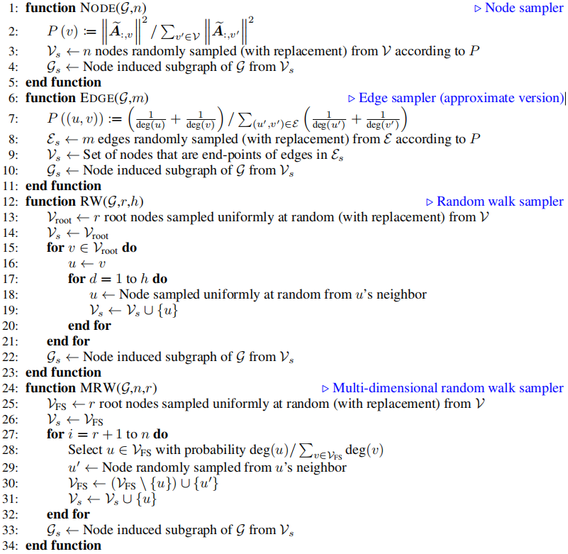

# GraphSAINT：Graph Sampling Based Inductive Learning Method

**简述**：GraphSAINT提出了一种新的基于子图采样的GNN，相较于Cluster-GCN，GraphSAINT显式考虑了子图采样时引入的误差，通过使用新的归一化方法避免了采样时产生的节点间差异。

**图采样遇到的问题**

图采样时，相互影响较大的节点形成子图的概率较高，但这导致不同节点被采样的概率不同，导致产生的子图在SGD训练时出现偏差。

**解决思路**

- 提出新的归一化技术，使得特征学习就不会优先考虑更频繁地采样的节点。
- 进行方差减少分析，并通过量化邻居的“影响”来设计轻量级抽样算法。

GraphSAINT的目标：

- 提取适当连接的子图，这样在子图内传播时信息丢失得很少。
- 将多个子图组合，从而在训练过程就能整体上学习完整图的良好表示。

​																												**图1**. GraphSAINT训练算法

算法1
输入：图$\mathcal{G}(\mathcal{V,E,X})$;标签集$\overline{Y}$;采样器
输出：有训练权重的GCN
1: 预处理: 设置采样器参数; 计算归一化系数$\alpha, \lambda$.
2: 对每批次:
3:	采样器采样得到子图$\mathcal{G_s(V_s,E_s)}$
4:	在$\mathcal{G_s}$构造GCN
5:	前向传播：$\{\mathcal{y_v |v \in \mathcal{V_s} } \}\leftarrow\{\mathcal{x_v|v\in\mathcal{V_s}}\}$, 用$\alpha$归一化
6:	根据$\lambda$-归一化的损失函数$\mathcal{L(y_v,\overline{y}_v)}$反向传播, 更新权重
7: 循环结束

对采样器有两个要求：

1. 采样时，相互影响较大的节点应在同一子图。
2. 每条边都应有采样概率。

对于需求(1)，理想情况下考虑来自节点连接的联合信息以及属性。然而由于复杂度过高，简单起见，从图连接性的角度来定义影响。

需求(2)导致了更好的泛化，因为它使神经网络能够探索完整的特征和标签空间。

# 1.	归一化

为保持图的连通性，采样时不可避免会引入偏差，因此本文提出了消除偏差的归一化技术：

假设有一个层$\mathcal{l+1}$节点$\mathcal{v}$和一个层$\mathcal{l}$节点$\mathcal{u}$。如果对$\mathcal{v}$进行采样，可得$\mathcal{v}$的聚合特征为：
$$
\xi_v^{(l+1)}=\sum_{u\in \mathcal{V}}\frac{\tilde{A}_{v,u}}{\alpha_{u,v}}(W^{(\mathcal{l})})^T x_u^{(\mathcal l)}\mathbb{l}_{u|v}\\
=\sum_{u\in \mathcal{V}}\frac{\tilde{A}_{v,u}}{\alpha_{u,v}}\tilde x_u^{(\mathcal l)}\mathbb{l}_{u|v}
$$
其中，$\tilde x_u^{(\mathcal l)}=(W^{(\mathcal{l})})^T x_u^{(\mathcal l)}$，$\mathbb{l}_{u|v}\in\{0,1\}$是指示函数：当边$(\mathcal{u,v})$属于节点$v$所在子图时为1，否则为0。

我们将常数$\alpha_{u,v}$作为聚合器归一化(*aggregator normalization*)

将$p_{u,v}=p_{v,u}$定义为边$(u,v)$被采样到子图中的概率，$p_v$定义为节点$v$被采样到子图中的概率

==**命题3.1**== $\xi_v^{(l+1)}$是全$\mathcal{l+1}^{th}$GCN层的一个无偏估计量，若$\alpha_{u,v}=\frac{p_{u,v}}{p_v}$，则$\mathbb{E}(\xi_v^{(l+1)})=\sum_{u\in \mathcal V}{\tilde{A}_{v,u}\tilde{x}_u^{(l)}}$

批次损失记为$L_{batch}=\sum_{v\in\mathcal G}\frac{L_v}{\lambda_v}$，我们将$\lambda_v$称为损失归一化常数。

令$\lambda_v=|V|\cdot p_v$，得：
$$
\mathbb{E}(L_{batch})=\frac{1}{|\mathbb{G}|}\sum_{\mathcal{G}_s\in \mathbb{G}}\sum_{v\in\mathcal{V}_s}\frac{L_v}{\lambda_v}\\
=\frac{1}{|\mathcal{V}|}\sum_{v\in\mathcal{V}}L_v
$$
由上式可知，子图内的特征传播需要归一化因子$\alpha,\lambda$，它们是基于边和节点采样概率$p_{u,v},p_v$计算而来

对于随机采样器，$p_{u,v},p_v$可推导得出；而对于其他采样器，通常很难获得封闭形式的表达式。因此，我们对估计进行了预处理。

在训练开始前，反复采样得到一组$N$个子图$\mathbb{G}$。分别为节点$v$和边$(u,v)$设置计数器$C_v, C_{u,v}$，计算节点和边分别在子图集$\mathbb{G}$中出现的次数，然后令$\alpha_{u,v}=\frac{C_{u,v}}{C_v}, \lambda_v=\frac{C_v}{N}$，而这带来的开销很小。

# 2.	方差

以边采样器为例：设$e$是连接节点$u,v$的边，且$b_e^{(l)}=\tilde{A}_{v,u}\tilde{x}_u^{(l-1)}+\tilde{A}_{u,v}\tilde{x}_v^{(l-1)}$

我们希望所有估计量$\xi_v^{(l)}$的方差都很小，因此定义：
$$
\xi=\sum_l\sum_{v\in\mathcal G}\frac{\xi_v^{(l)}}{p_v}\\
=\sum_l\sum_{v,u}\frac{\tilde{A}_{v,u}}{p_v\alpha_{u,v}}\tilde x_u^{(\mathcal l)}\mathbb{l}_v\mathbb{l}_{u|v}\\
=\sum_l\sum_{e}\frac{b_e^{(l)}}{p_e}\mathbb{l}_e^{(l)}
$$
其中，当$e\in\mathcal{E}_s$时，$\mathbb{l}_e^{(l)}=1$否则为0；当$v\in\mathcal{V}_s$时，$\mathbb{l}_v=1$否则为0

对$p_u$同理，因此$\xi$是对所有层上的所有节点聚合之和的无偏估计量：
$$
\mathbb{E}(\xi)=\sum_l\sum_{v\in V}\mathbb{E}(\xi_v^{(l)})
$$
注意，对$\forall l$，都有$\mathbb{l}_e^{(l)}=\mathbb{l}_e$，因为一旦一条边出现在采样图中，它就会出现在我们的GCN的所有层中。

我们定义了最优边采样器来最小化$\xi$的方差。我们限制自己进行独立的边采样。

对每条边$e\in\mathcal{E}$，独立决定其是否应采样到子图$\mathcal{G}_s$，采样概率为$p_e$，进一步约束$\sum{p_e}=m$，得：

==**定理3.2**==	在预算$m$的独立边采样下，为最小化每个$\xi$的维度的方差之和，给定最优边采样概率：
$$
p_e=\frac{m}{\sum_{e^\prime}\Vert\sum_lb^{(l)}_{e^\prime}\Vert}\Vert\sum_lb_e^{(l)}\Vert
$$
注意，计算$b_e^{(l)}$需要先计算$\tilde{x}_v^{(l-1)}$，为简化计算，我们省略$\tilde{x}_v^{(l)}$，使边的采样概率只取决于图的拓扑结构。因此，我们使$p_e\propto\tilde{A}_{v,u}+\tilde{A}_{u,v}=\frac{1}{deg(u)}+\frac{1}{deg(v)}$

我们可以以上的边采样器进行层采样。根据FastGCN所提出的独立层采样，我们以概率$p_{u,v}^{(l)}\propto\frac{1}{deg(u)}+\frac{1}{deg(v)}$采样连接$(u^{(l)},v^{(l+1)})$

简单起见，假设有一个匀度图，度为$d$，$p_e^{(l)}=p$，对已采样的$u^{(l)}$，在$l+1$层上，采样器至少要将它的一条边选中。

显然，输入层节点在$L$层采样后存活的概率为$(1-(1-p)^d)^{L-1}$，但这样的层采样器可能会为$L > 1$返回一个过于稀疏的批处理。

另一方面，GraphSAINT内的连接不会随着GCN深度的增加而下降。如果一条边存在于层$l$中，则它存在于所有层中。

# 3.	采样器

注意，采样参数$n,m$指定的是预算，而不是子图$\mathcal G_s$中的节点和边的实际数量。

由于训练图$\mathcal G$中的某些节点或边会在采样器一次调用下被重复采样，因此我们对节点采样和多维随机游走采样限制$|\mathcal V_s|<n$，对边采样限制$|\mathcal {V}_s|<2m$，对随机游走采样限制$|\mathcal {V}_s|<r\cdot h$

还要注意，算法中描述的边采样器是2.方差中定义的独立边采样器的近似版本。原始版本复杂度(不包括子图归纳)为$O(|E|)$而近似版本为$O(|m|)$，==对给定的$m$，当$m \ll |E|$时，近似实现与原始版本精度可以认为一致==。

==算法2==	GraphSAINT的图采样算法

输入: 训练图$\mathcal{G(V,E)}$；采样变量：节点预算$n$、边预算$m$、随机游走根结点数量$r$、随机游走长度$h$

输出: 采样子图$\mathcal{G_s(V_s,E_s)}$

## 3.1	随机节点采样

根据节点采样概率分布$P(u)\propto\Vert\tilde{A}_{:,u}\Vert^2$，随机从节点集$\mathcal V$中采样$|\mathcal V_s|$个节点

## 3.2	随机边采样

原理已在2.方差中叙述

## 3.3	随机游走采样

另一种分析基于图采样的多层GCN的方法是忽略激活函数。

这样，$L$层就可以表示为给定边权重$B=\tilde{A}^L$的一个单独层了。其实现与3.2相似，若能独立选择节点对$u,v$(无论它们在原图中是否相连)，则令$p_{u,v}\propto B_{u,v}+B_{v,u}$，其中$B_{u,v}$可以解释为$L$跳随机游走从$u$开始从$v$结束的概率，$B_{v,u}$同理。

本文实现了一个规则的随机漫步采样器（均匀随机选择$r$个根节点，每个游走器行走$h$跳）和一个多维随机游走采样器

