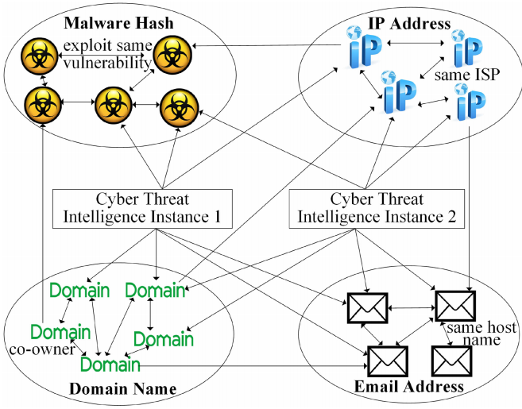
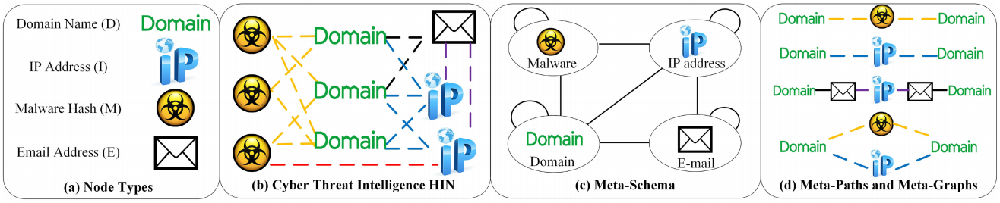
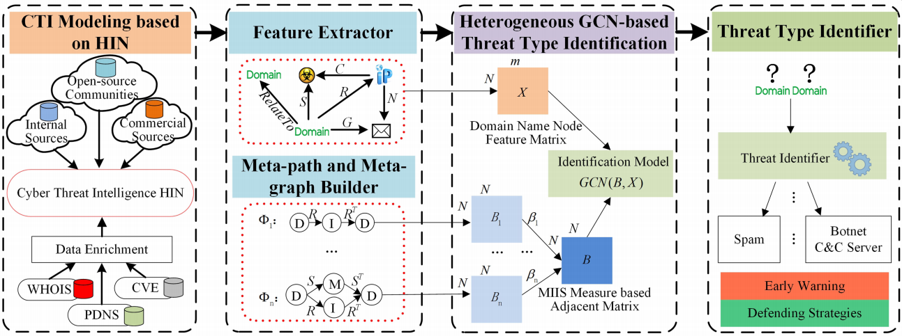
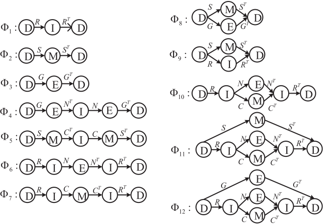
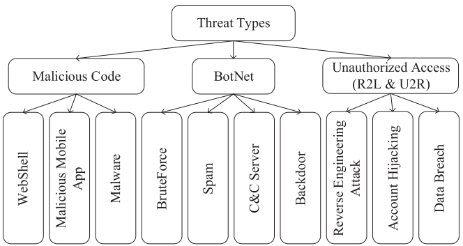
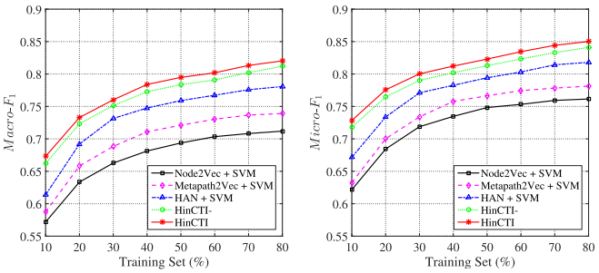
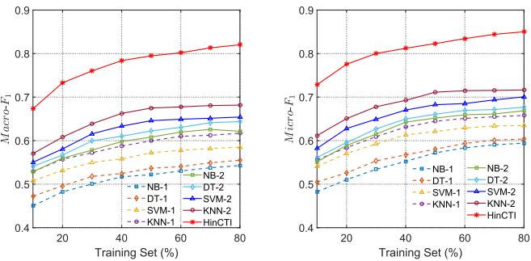
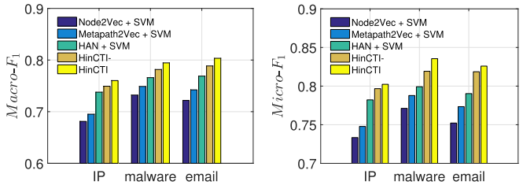

# HinCTI: A Cyber Threat Intelligence Modeling and Identification System Based on Heterogeneous Information Network

HinCTI：一种基于异构信息网络的网络威胁智能建模与识别系统

## 摘要

由于CTI之间的显性和隐性关系以及参与CTI的网络威胁基础设施结点的异质性，对CTI进行建模具有挑战性。由于参与CTI的网络威胁基础设施结点的标签有限，自动识别基础设施结点的威胁类型以进行早期预警也是一种挑战。

> CTI是关于现有或新兴资产威胁的证明性知识，可提供主体对威胁反应的决策支持。网络犯罪分子通常充分利用网络基础设施（如域名、互联网协议或IP地址）进行网络攻击。一般来说，不同的情报来源有助于从不同的角度描述网络威胁基础设施结点。
>
> CTI建模提供了许多优势，例如获得快速演变的网络威胁形势的全貌，以及揭示特定攻击背后的潜在集团。以域名基础设施结点为例，域名的威胁类型可以是垃圾邮件URL、暴力登录攻击、恶意软件活动和僵尸网络结点活动。识别基础设施结点的威胁类型不仅有利于细粒度的威胁预警，而且有利于采取有针对性的防御措施。

## 贡献

> 1. 开发了一个名为HinCTI的实用系统，用于建立网络威胁情报模型和识别威胁类型，在基础设施结点的威胁类型识别方面取得了良好的效果
>2. 基于HIN进行CTI建模，整合各种类型的基础设施结点和之间的关系，以语义的方式集成CTI中涉及的威胁实体，同时提取合并实体间的高级语义
> 3. 提出了一种基于MIIS措施的异质图卷积网络（GCN）方法，以识别参与CTI的基础设施结点的威胁类型。通过分层正则化策略，缓解过拟合的问题，并在CTI的威胁类型识别中取得良好的效果。

## 1.1	痛点

网络威胁情报(CTI)间关系复杂、参与CTI的网络威胁基础设施结点的异质性，难以建模，而**现有针对CTI研究主要集中在同质图上**；

**标签有限**，难以自动识别危险类型；

## 1.2	思路

1. 如何准确有效地从有限的标记基础设施结点和它们之间的大量关系中学习来预测未标记结点的威胁类型
2. 从异构信息网络(HIN)的角度，关注网络威胁基础设施结点之间的高级语义关系，区分不同的网络攻击基于网络行为的差异，并探索对手如何组织活动和适应他们的技术

## 1.3	应对

1. 设计威胁智能元模式，描述结点间语义相关性
2. 在异构信息网络(HIN)上进行网络信息情报建模，集成了结点和之间的关系
3. 定义了一种基于元路径和元图实例的威胁基础设施相似度(MIIS)度量，并提出了一种基于MIIS度量的异构图卷积网络(GCN)方法来识别CTI中涉及的基础设施结点的威胁类型。该方法通过分层正则化，缓解了过拟合的问题。本研究还可以促进提供部分或不完整信息的网络安全调查。

## 2.1	CTI建模

从CTI共享的角度来看，提出了许多交换格式，如结构化威胁信息表达(STIX)、事件对象描述和交换格式(IODEF)和OpenIOC，来描述与攻击活动相关的安全事件和观察。然而，这些格式并不用于计算目的。为了提取并合并基础设施结点的高级语义，CTI必须从计算的角度进行建模。

基于多个情报来源(如IBM X-Force Exchange和 ThreatBook)的CTI建模有利于发现各种网络攻击事件之间的相关性，便于网络攻击的分析，并在杀伤链阶段[20]之间获得完整的可见性。例如，引用IP和DNS注册信息对恶意软件数据库很有用，而引用恶意软件数据库条目对IP和DNS黑名单也很有用。

### 2.1.1	业界现有方案

Modi：ATIS自动化CTI融合框架，考虑了多个威胁源，并将明显孤立的网络事件连接起来

Gascon: MANTIS，为众多标准提供了统一表现形式的CTI平台，通过基于归属图的新型类型诊断相似性算法将不同来源的威胁数据关联起来，但只考虑任两个对象的指纹（哈希值）相似性，可用的高层次语义（涉及其他类型结点的间接关系）被完全忽略。

Boukhtouta： 提出一种调查网络威胁的方法，考虑了几十种类型的结点。但CTI之间的高层次语义没有被进一步分析。

研究人员已经提出了从非结构化的CTI文本中自动提取结点和关系的方法，如推文、博客和论坛。

Liao等人提出了一种方法，从自然语言的博客文章中自动提取妥协指标（IoCs）。他们将该问题建模为图的相似性问题，如果IoC项目具有与训练集相似的图结构，则识别该项目。然而，识别出的IoCs并没有保留它们在恶意活动中的角色，这使得分析不同阶段的活动特征以及与现场测量的关联变得困难。Husari等人提出了TTPDrill，利用自然语言处理（NLP）和信息检索（IR），从非结构化的CTI文本中提取威胁行动。

## 2.2	基于图的威胁识别

> 基于图的威胁识别提供了CTI之间的互动特征，以及对有影响力的实体和团体的识别。通过利用感兴趣的基础设施结点之间的联系信息，基于图的方法可以发现潜在的关系，这对攻击者来说相对更难逃避，因为进行网络攻击不可避免地在图中产生大量的链接。

现有的研究主要集中在同质化的信息网络，只能进行简单的关联分析。

Manadhata等人利用图推理和自适应置信传播来检测恶意域名。然而，只构建了host-domain图，而忽略了IP-domain图和其他信息图，大大阻碍了识别的准确性。

Shi等人提出了一种基于极端机器学习（ELM）的恶意域名识别方法，其中基于构造、基于IP、基于TTL和基于Whois的特征被提取来描述域名的特征，并输入ELM。然而，忽视不同类型CTI之间的关系会大大降低识别的性能。

一些学者开发了网络安全知识图谱的实体论，以表示网络实体之间的丰富关系。然而，该方法需要大量的工作来构建，并且在一定程度上难以使用。

在本文中，我们进一步分析了异构基础设施结点之间更高层次的关系，并研究了复杂的、语义丰富的HIN中的基础设施结点，该机制易于构建和使用。

## 2.3	用于威胁识别的网络表征学习

> 网络表征学习，即网络嵌入，旨在将网络嵌入到一个低维空间中，同时保留网络结构和属性，使学到的嵌入可以很容易地被机器学习技术应用。

最近，人们提出了许多高效的网络嵌入方法来解决同质网络的表示学习问题，如DeepWalk、Node2Vec。与广泛研究的同质信息网络相比，HIN的异质性（即包含多种类型的结点或链接）使得直接应用同质技术进行HIN表示学习变得困难。

为此，Dong等人提出了Metapath2Vec，它设计了一个基于元路径的随机行走，并利用skip-gram来进行异质图嵌入。然而，Metapath2Vec只能利用一条元路径，可能会忽略有用的信息。

Fu等人提出了HIN2Vec来探索HIN中的元路径，以进行表示学习。图形神经网络（GNN）被提出来扩展深度神经网络以处理任意图形结构的数据。

Wang等人提出了异质图注意网络（HAN）来处理异质图，考虑了结点级和语义级的注意。

## 3	CTI建模

## 3.1 基于HIN的CTI建模

> CTI一般是指网络攻击相关的证据，涉及一组不同类型的威胁基础设施，如恶意IP地址、恶意域名、恶意软件哈希值和恶意电子邮件地址。我们将上述基础设施命名为威胁基础设施结点。

> 威胁基础设施结点之间存在关系，包括同一类型的结点之间的关系和不同类型的结点之间的关系，即域名之间的关系、IP地址之间的关系、恶意软件哈希值之间的关系、电子邮件地址之间的关系，以及它们之间的关系。我们将上述关系命名为威胁基础设施关系。

通过威胁情报提供商提供的API，可以得出不同类型的威胁基础设施结点（即域名、IP地址、电子邮件地址和恶意软件哈希值）之间的海量关系（即域-IP、域恶意软件、IP-恶意软件、域-电子邮件和IP电子邮件），从而构建HinCTI。

至于同一类型的结点之间的关系，从各种外部资源中提取相关信息来丰富威胁基础设施结点的上下文。如图1所示，两个域名之间的直接关系可以通过域名相关的服务来丰富，如从Whois数据库中得到共同所有者、共同组织、DNS的共同位置和共同注册者的关系。两个IP地址之间的直接关系可以通过IP相关的服务来丰富，比如从IP2Location服务中获得具有相同互联网服务提供商（ISP）的关系。两个恶意软件哈希值之间的直接关系可以通过开源的恶意软件分析工具来丰富，例如从共同漏洞和暴露（CVE）数据库中获得利用相同漏洞的关系。两个电子邮件地址之间的直接关系可以丰富相同主机名的关系。

**图1**. 涉及不同类型的威胁基础设施结点和边缘的两个网络威胁情报实例。

从CTI实例和外部资源中提取上述威胁基础设施结点和威胁基础设施关系后，我们可以建立一个HINCTI，如图1所示，其中包含四类威胁基础设施结点，即恶意软件哈希值、IP地址、域名和电子邮件地址。

> 威胁情报可以被视为一组威胁基础设施结点和威胁基础设施关系，有助于解释各种类型结点之间的关系。因此，一个威胁情报实例可以被视为整个HIN的一个子图。
>
> HIN的一个特殊优势是，在结点类型上定义的元路径（定义于第3.2节）和元图（定义于第4.2节）可以反映出语义上有意义的相似性信息，因此，可以自然地为威胁分析和识别提供可解释的结果。

例如，两个域名之间的关系可以通过元路径Domain-Malware-Domain来揭示，它描述了两个域名被相同的恶意软件访问，或者通过元路径Domain-Email-Domain来描述两个域名 描述了由相同的电子邮件地址注册的两个域名。

##  3.2	 序言 

### 3.2.1	网络威胁基础设施结点

> 网络威胁基础设施结点由IP地址、域名、恶意软件哈希值和电子邮件地址组成。

从情报提供者那里收集到的CTI通常是以恶意软件、恶意IP地址和恶意域名的哈希值的形式出现。因此，我们只考虑较低级别的基本CTI，并在本文中用HIN表示它们。图中的结点代表网络威胁的基础设施，即域名、IP地址、恶意软件哈希值和电子邮件地址。在本文中，我们研究如何利用HIN来促进CTI数据集的挖掘。

### 3.2.2	HIN

*A HIN is a graph $G = (V, E)$ with a node type mapping $ \phi: V\rightarrow A $ and a relation type mapping  $\psi: E \rightarrow R$, where $V$ denotes the node set, and $E$ denotes the link set. $A$ denotes the node type set, and $R$ denotes the relation type set, where the number of node types $\left| A \right| > 1 $ or the number of relation types $\left| R \right| > 1$.*

HIN是一个图$G = (V, E)$，有结点类型映射 $ \phi: V\rightarrow A $ 和关系类型映射$\psi: E \rightarrow R$，其中$V$ 表示结点集，$E$表示边集。$A$表示结点类型集，$R$表示关系类型集，其中结点类型数量$\left| A \right| > 1 $或关系类型数量 $\left| R \right| > 1$.

图1给出了一个用不同类型的结点和关系连接的两个CTI实例的例子。在给定了一个用于CTI建模的复杂HIN后，为了更好地理解，描述其元层次（即模式层次）是必要的。

### 3.2.3	元模式(网络模式)

*Given a HIN $G = (V,E)$ with the node type mapping $\phi: V \rightarrow A$ and the relation type mapping $\psi: E \rightarrow R$, the meta-schema (or network-schema) for network $G$, denoted as $T_G = (A, R)$, is a graph with nodes as node types from $A$ and edges as relation types from $R$.*

给定HIN $G = (V,E)$ ，其结点类型映射$\phi: V \rightarrow A$，关系类型映射$\psi: E \rightarrow R$，则网络G的元模式(网络模式)表示为$T_G = (A, R)$，其为一个由结点类型属于$A$，边关系属于$R$的结点组成的图

**图2**. 基于HIN的CTI建模。

(a) 四种结点  (b) 五条不同颜色的线代表各类结点间五种不同关系。

(c) 元模式      (d) HinCTI中涉及的元路径和元图的例子。

如图2所述，CTI建模涉及四种结点以及五种关系。

HIN的另一个重要概念是定义在类型上的元路径，它可以制定结点间更高层次关系的语义，因此，自然可以为威胁基础设施建模提供可解释的结果。

### 3.2.4	元路径

 *A meta-path $P$ is a path defined on the graph of network schema $T_G = (A,R)$ and is denoted in the form of $A_1 \stackrel{R_1}{\longrightarrow} A_2 \stackrel{R_2}{\longrightarrow}... \stackrel{R_d}{\longrightarrow} A_{d+1}$ which defines a composite relation $R = R_1 · R2 · ... · R_d$ between node types $A_1 $and $A_{d+1}$, where symbol $·$ denotes the composition operator on relations, and $d$ is the length of $P$.*

元路径P是在网络模式$T_G = (A,R)$上定义的路径，以$A_1 \stackrel{R_1}{\longrightarrow} A_2 \stackrel{R_2}{\longrightarrow}... \stackrel{R_d}{\longrightarrow} A_{d+1}$的形式，表示从结点$A_1$到结点$A_{d+1}$之间的复合关系$R = R_1 · R2 · ... · R_d$，其中符号$·$表示在关系上的组合算子，$d$是$P$的长度

In general, a meta-path corresponds to a type of path within the network schema, containing a certain sequence of link types. For simplicity, we use object types connected by symbol “,” to denote the meta-path when there is only one relationship between a pair of types: $P = (A_1, A_2,...,A_{d+1})$. If $\forall l, \phi(v_l)=A_l$and edge $e_l = <v_l, v_{l+1}>$belongs to relation type $R_l \in P$, then a meta-path instance $p = (v_1, v_2,..., v_{d+1})$ between $v_1$ and $v_{d+1}$ in network $G$ follows the meta-path $P = (A_1, A_2,...,A_{d+1})$. We further introduce semantically meaningful meta-paths that describe infrastructure node relations in Section 4.2.

一般来说，元路径对应于网络模式中的一种路径类型，包含一定序列的链接类型。简单起见，当一对类型之间只有一种关系时，我们用符号"，"连接的对象类型来表示元路径：$P = (A_1, A_2,...,A_{d+1})$。如果$\forall l, \phi(v_l)=A_l$和边$e_l = <v_l, v_{l+1}>$属于$P$中的关系类型$R_l$，那么一个元路径实例$p = (v_1, v_2,. . ., v_{d+1})$ 在网络$G$中$v_1$和$v_{d+1}$之间的元路径$P = (A_1, A_2,..., A_{d+1})$。我们在4.2节中进一步介绍了有语义的元路径，描述了基础设施节点关系。

### 3.2.5	威胁类型标识

对于收集到的没有威胁标签的网络威胁基础设施节点，**威胁类型识别是指以基于异构GCN的威胁类型识别模型，利用那些有威胁标签的网络威胁基础设施节点以及它们之间的关系来识别它们的威胁类型标签**。

在威胁情报共享平台上，大量威胁基础设施节点没有威胁标签，这对CTI消费者来说是不完整的。因此，利用大量基本CTI中涉及的威胁-基础设施节点及其关系，预测没有威胁标签的节点的威胁类型具有重要意义。

## 3.3	系统架构

我们提出的基于HIN的CTI建模和识别系统的体系结构HinCTI如图3所示，主要由以下四个模块组成：

> 结点类型：域名(D)、IP地址(I)、恶意软件哈希(M)、邮箱地址(E)
>
> $X$：$N \times m$维度的域名结点特征矩阵
>
> $B_n$：基于元路径/元图的邻接矩阵$\Phi_n$
>
> $\beta_n$：$\Phi_n$权值
>
> $B$：$N \times N$维度，基于***MIIS***度量的邻接矩阵

**图3**. HinCTI系统结构。

(1) 在HIN上建立CTI模型，并生成HinCTI。

(2) 提取节点特征，设计一套基于HinCTI的元路径和元图。

(3) 结点特征矩阵$X$和基于***MIIS***度量的相邻矩阵$B$是异构GCN模型的输入。

(4) 异质GCN模型预测域名基础设施节点的威胁类型，如垃圾邮件和僵尸网络C&C服务器。基础设施节点的威胁类型识别结果可用于早期预警和采取防御策略。请注意，HinCTI中不同类型节点（即D、I、M和E）的威胁类型识别任务是单独进行的，我们以域名基础设施节点（即D）为例。

### 3.3.1	基于HIN的CTI建模

在HinCTI中，与节点相关的上下文信息越多，越有利于CTI的分析。因此，为了丰富基础设施节点的上下文，我们从外部数据库中提取信息，建立同一类型和不同类型节点之间的关系，例如，"Whois "数据库用于域名和IP节点，"CVE "数据库用于恶意软件节点，"Passive DNS "数据库用于域名和电子邮件地址节点。通过这种方式，HinCTI的构建可以描绘出各种类型的基础设施节点之间的关系。

### 3.3.2	特征提取器、元路径和元图生成器

基于为HinCTI设计的元模式，我们建立了一系列元路径和元图，以捕捉来自不同语义的基础设施节点的高层关联性。

### 3.3.3	基于异质GCN的威胁类型识别

1.提取基础设施节点特征，生成节点特征矩阵$X$。

2.基于元图的相邻矩阵，得到加权相邻矩阵$B$。

3.利用异构GCN来融合$X$和$B$，学习网络威胁基础设施节点的威胁类型。

### 3.3.4	威胁类型标识符

1.对每个新收集的未知威胁基础设施节点，先提取节点特征，再从外部来源提取其相关的基础设施节点。

2.进一步分析这些基础设施节点之间的关系。

3.在特征提取和基于异构GCN的威胁类型识别模型构建的基础之上，我们用威胁标识符标记基础设施节点的威胁类型。

4.基于识别出的威胁类型标签，安全分析人员可以给出早期预警并采取防御策略。

## 4.	威胁类型识别方法

在本节中，我们首先介绍特征提取，然后是元路径和元图的构建。然后，我们描述了基于异构GCN的威胁类型识别方法，最后描述了分层正则化策略如何缓解过拟合的问题。

**由于关于域名的CTI在网络安全中比其他类型的基础设施节点更具静态性和高效性，因此我们特别关注域名基础设施节点的威胁类型识别**。

## 4.1	特征提取

### 4.1.1	节点特征

以域名为例，我们将**域名的长度、信息熵、活跃时间和域名在Whois上信息更新频率**作为结点特征

> 域名经常被攻击者用来与服务器保持联系。恶意域名通常由域名生成算法（DGA）成批生成，其平均长度要比良性域名的长度长。基于Domain-Flux的恶意域名的字符分布通常是混乱的，信息熵较高。因此，在域名的威胁类型识别中，我们选择域名的长度和信息熵作为基于字符的特征。
>
> 恶意域名的活跃时间很短，每当旧域名被停用，攻击者就会迅速注册新域名，并在被发现和封锁之前将其用于恶意目的，这通常使恶意域名的寿命大大缩短。此外，鉴于合法域名经常被用户查询，合法域名的所有者会及时更新他们的Whois信息，以确保域名能很好地服务于用户。相反，恶意域名的所有者不会更新Whois信息，而且他们的更新频率低于良性域名的所有者。我们把域名的活跃时间和更新频率作为时间相关的节点特征。

### 4.1.2	基于关系的特征

尽管域名的节点特征可以用来反映它们的行为并检测像 "amazon-gst-sale. com "这样的恶意域名，但它与相关恶意软件之间的内在和复杂关系可以提供更关键的识别信息。提取的节点之间的关系可以提供比简单统计更高层次的表示，这需要攻击者做出更多努力来逃避检测。如果攻击者减少与相关恶意软件、域名和IP地址的通信，攻击的范围就会大大减少。因此，为了分析越来越复杂的恶意域名，我们不仅要考虑节点特征，还要考虑表2中总结的关系，其中 "元素 "表示相关关系矩阵中的元素。

**表1 符号及描述**

| 符号                           | 描述                                                         |
| :----------------------------- | ------------------------------------------------------------ |
| $X$                            | 基础设施节点的特征矩阵                                       |
| $m$                            | 基础设施节点的特征维度                                       |
| $N$                            | 基础设施节点数                                               |
| $\Phi$                         | 元路径和元图集$\Phi =  \lbrace \Phi_k | k = 1,2,...,n \rbrace$ |
| $v_i$                          | 第$i$个基础设施节点                                          |
| ***Num***$P_{\Phi_k}(v_i,v_j)$ | 结点$v_i$和$v_j$之间，满足$\Phi_k$的元路径、元图实例数       |
| ***MIIS***$(v_i,v_j)$          | 基础设施节点$v_i$和$v_j$间，基于元路径和元图实例的相似性     |
| $B_k$                          | 基于$\Phi_k$的邻接矩阵                                       |
| $\beta$                        | 元路径和元图集$\Phi$的权重向量，其中$\beta = \left[ \beta_1， \beta_2，...， \beta_n \right]$，$\beta_k$是$\Phi_k$的权重。 |
| $B$                            | 基于***MIIS***度量的邻接矩阵                                 |
| $U_{\Phi_k}$                   | $\phi_k$下的交换矩阵                                         |
| $L$                            | 威胁类型标签集，其中$L = \lbrace l_i | i=1,2,...,K \rbrace$，$K$是标签数 |
| $L_i$                          | $L_i$的子威胁类型标签集，其中$Li = \lbrace l_i^{(j)}|j=1,2,...,K_i \rbrace$，$l_i^{(j)}$是$l_i$的第$j$个子标签，$K_i$是$l_i$的子标签数 |
| $W$                            | GCN模型的最终输出层中标签的参数向量，其中$W = \left[ w_{l_1}, w_{l_2},..., w_{l_K} \right]$，$w_{l_i}$是标签$l_i$的参数向量 |

**表2 关系矩阵描述**

| 矩阵 | 元素     | 描述                                                         |
| ---- | -------- | ------------------------------------------------------------ |
| $R$  | $r_{ij}$ | **域名-IP** 若域名$i$被解析为IP$j$，则$r_{ij}=1$，否则为0    |
| $S$  | $s_{ij}$ | **域名-恶意软件** 若域名$i$被恶意软件$j$访问，则$s_{ij}=1$，否则为0 |
| $G$  | $g_{ij}$ | **域名-邮箱** 若域名$i$被邮箱$j$注册，则$g_{ij}=1$，否则为0  |
| $C$  | $c_{ij}$ | **IP-恶意软件** 若IP与恶意软件$j$通信，则$c_{ij}=1$，否则为0 |
| $N$  | $n_{ij}$ | **IP-邮箱** 若IP$i$与邮箱$j$连接，则$n_{ij}=1$，否则为0      |

## 4.2	元路径和元图生成器

尽管元路径可以用做描述结点间联系，但它无法捕获更复杂的联系。

元图用有向无环图来处理HIN结点间更复杂的关系，定义如下：

### 4.2.1	元图

 A meta-graph $\Phi_i$ is a directed acyclic graph with single source node $n_s$ and single target node $n_t$, defined on a HIN $G =(V,E)$ with schema $T_G = (A, R)$. Formally, a meta-graph is defined as $\Phi_i = (V_{\Phi_i}, E_{\Phi_i},A_{\Phi_i},R_{\Phi_i},n_s,n_t)$, where $V_{\Phi_i} \subseteq V$ and  $E_{\Phi_i} \subseteq E$ are constrained by $A_{\Phi_i} \subseteq A$ and $R_{\Phi_i} \subseteq R$, respectively.

元图$\Phi_i$是一个有**单源结点**$n_s$和**单目标结点**$n_t$的有向无环图，定义在HIN $G =(V,E)$ 上，其中模式$T_G = (A, R)$。

数学上，元图定义为$\Phi_i = (V_{\Phi_i}, E_{\Phi_i},A_{\Phi_i},R_{\Phi_i},n_s,n_t)$，其中$V_{\Phi_i} \subseteq V$ 和 $E_{\Phi_i} \subseteq E$ 分别受$A_{\Phi_i} \subseteq A$ 和 $R_{\Phi_i} \subseteq R$,约束

**图4**. 为识别域名基础设施节点的威胁类型而设计的元路径和元图。符号$D$代表域名，$I$代表IP地址，$M$代表恶意软件散列，$E$代表电子邮件地址。

如图4所示，不同元路径和元图从不同方面描述了威胁基础设施节点的关联性，即具有不同的语义。

例如，元路径$\Phi_1$通过域名-IP关系（即两域名都被解析为同一IP）描述了威胁基础设施的关联性。元路径$\Phi_2$通过域名-恶意软件关系描述了基础设施节点的关联性（即两域名都被同一恶意软件访问）。元图$\Phi_{11}$从外部和内在的联系两方面描述了网络威胁实体间的关系。即两域名是相连的，因为它们都被相同恶意软件访问过（外部连接），且它们的解析IP地址连接到了相同的电子邮件地址、相同的恶意软件（内在连接）。

在我们的方法中，为了检测基础设施节点的威胁类型，元路径和元图被联合考虑，以捕获基础设施节点之间的复杂关联性。不同的元路径和元图从不同的角度衡量两个基础设施节点之间的关联性，即元模式列举的元路径和元图越有意义，相似性测量的准确性就越高。

## 4.3	基于异构GCN的威胁类型识别

我们使用基于MIIS度量的异构GCN方法，识别CTI中涉及的基础设施节点的威胁类型。这种异质GCN同时整合了节点特征和有意义的元路径和基于元图的相似邻接关系，能够以更全面的方式表示基础设施节点。在定义MIIS之前，我们提出$\Phi_k$下的元路径和元图实例数的定义，称为Num$P_{\Phi_k}$，如下所示

给定网络$G = (V, E)$，其网络模式$T_G = (A,R)$，即一条对称元路径或元图$\Phi_k$，在$\Phi_k$下两域名基础设施结点$v_i, v_j$下的元路径/元图实例数记作Num$P_{\Phi_k}$，有
$$
NumP_{\Phi_k}(v_i,v_j) = U_{\Phi_k}(v_i,v_j)
$$
其中$U_{\Phi_k}(v_i,v_j)$是$\Phi_k$下，域名基础设施结点间的交换矩阵

对元路径$\Phi_k=(A_1,A_2,...,A_{d+1})$，其结点类型$A_1$到$A_{d+1}$间的交换矩阵计算为：
$$
U_{\Phi_k}=Q_{A_1A_2}·Q_{A_2A_3}·...·Q_{A_dA_{d+1}}
$$
其中$Q_{A_iA_{i+1}}$是类型$A_i$和类型$A_{i+1}$间的对称矩阵，符号·表示矩阵乘法

**对于元图，当从源节点到目标结点有多条元路径时，我们定义其为有相似性**

当存在多条路径时，我们约束一个流来满足所有的路径，这需要比简单的矩阵乘法多一个矩阵运算，即哈达玛乘积（舒尔乘积）。

**算法1. $M_{\Phi_{10}}$的交换矩阵计算**

------

1 计算$U_{P_1} = Q_{IE} \cdot Q_{IE}^T = N \cdot N^T$，其中$P_1$是子路径(I, E, I)

2 计算$U_{P_2} = Q_{IM} \cdot Q_{IM}^T = C \cdot C^T$，其中$P_2$是子路径(I, M, I)

3 计算$U_{P_r} = U_{P_1} \odot U_{P_2}$

4 计算$U_{\Phi_{10}} = Q_{DI} \cdot U_{P_r} \cdot Q_{DI}^T = R \cdot U_{P_r} \cdot R^T$

------

以图4中的元图$\Phi_{10}$为例，算法1描述了如何计算其交换矩阵，其中$\odot$为Hadamard乘积，N、C、R分别表示IP-email、IP-恶意软件和域名-ip邻接矩阵。得到$U_{P_r}$后，通过矩阵序列的乘法，易得交换矩阵$U_{\Phi_{10}}$

> Hadamard(哈达玛)乘积：矩阵元素对应相乘
> $$
> \begin{bmatrix}
>     A_1&A_2\\
>     A_3&A_4
> \end{bmatrix} 
> 
> \times
> 
> \begin{bmatrix}
>     B_1&B_2\\
>     B_3&B_4
> \end{bmatrix} 
> 
> =
> 
> \begin{bmatrix}
>     A_1B_1&A_2B_2\\
>     A_3B_3&A_4B_4
> \end{bmatrix}
> $$

由于不同的元路径和元图可以定义不同的相似性并引入不同的高级语义，因此在识别基础设施节点的威胁类型时，自然会合并所有有用的元路径和元图。要注意的是，**不同元路径和元图权重不同**。**同样处理不同元路径和元图会削弱有意义的元路径和元图提供的语义**。

为了探索其两者互补性，我们使用基于元路径和元图的加权邻接矩阵来合并不同语义。

我们为任两个威胁基础设施节点$v_i,v_j$定义了带权相似度，记作***MIIS***$(v_i,v_j)$：

### 4.3.1	MIIS

给定元路径和元图集，记作$\Phi = \lbrace \Phi_k | k=1,2,...,n \rbrace$，$v_i,v_j$间**MIIS**度量定义为：
$$
MIIS(v_i,v_j) = \sum_{k=1}^n \beta_k \frac{2 \times NumP_{\Phi_k}(v_i,v_j)}{NumP_{\Phi_k(v_i,v_i)+NumP_{\Phi_k}(v_j,v_j)}}
$$

其中$NumP_{\Phi_k}(v_i,v_j)$是基础设施结点$v_i,v_j$在$\Phi_k$下的元路径和元图实例数，$\beta = \left[ \beta_1, \beta_2, ...,\beta_n \right]$表示$\Phi$的权重，$\beta_k$是元路径/元图$\Phi_k$的权重且满足$\beta_k \geq 0, \sum_{k=1}^n \beta_k = 1$

MIIS度量是从两方面定义的：**语义重叠**(由$v_i$和$v_j$间路径数定义)、**语义广泛性**(由它们间的路径实例数量定义，如$v_i$到$v_i$路径和$v_j$到$v_j$路径)

构建一个维度$N \times N$矩阵$B$，其中$N$是域名结点数量，$B_{ij}=b_{ji}=MIIS(v_i,v_j)$。

根据第4.1节所述，利用两层GCN架构，可得维度$N \times m$的域名结点特征矩阵$X$，用于识别基础设施节点类型

类别标签代表基础设施结点威胁类型。

基于GCN的识别模型输入是$B$和$X$，满足$B \in \R^{N \times N}, X \in \R^{N \times m}$，包含$m$维原始域名结点特征

我们先计算$\hat{B} = \widetilde{D}^{-\frac{1}{2}}\widetilde{B}\widetilde{D}^{-\frac{1}{2}}$，其中$\widetilde{B} = B + I_N$是添加了自连接的基于MIIS度量的邻接矩阵，$I_N$是特征矩阵，$\widetilde{D}$是满足$\widetilde{D}_{ii} = \sum_j{\widetilde{B_{ij}}}$的对角矩阵。正向模型采用以下形式：
$$
Z = f(X,B) = softmax(\hat{B}ReLU(\hat{B}XW^{(0)})W^{(1)})
$$
其中激活函数$ReLU(\cdot) = max(0,\cdot)$，激活函数$softmax(x_i) = e^{x_i}/\sum_j{e^{x_j}}$逐行使用

神经网络权重$W^{(0)} \in \R^{m \times h}$是一个输入层到隐藏层的可训练权重矩阵，用于具有h个特征图的隐藏层

神经网络权重$W^{(1)} \in \R^{h \times K}$是一个隐藏层到输出层的可训练权重矩阵，其中$K$是威胁类型标签数量

这两者都使用梯度下降进行训练，我们在每次训练迭代中使用完整数据集进行批处理梯度下降。

 给定一组有威胁类型标记的威胁基础设施，我们的模型优化了真实标签分布和预测分布之间的交叉熵H，如下所示
$$
H = -\sum_{i \in \gamma_L}\sum_{k=1}^K(l_k(v_i)lnZ_k(v_i) + (1-l_k(v_i))ln(1-Z_k(v_i)))
$$
$\gamma_L$是一组有标签的域名基础设施结点索引；$K$是该层中标签数量；$l_k(v_i)$是一个二进制标签，用于表示基础设施节点$v_i$是否属于标签$k$；$Z_k(v_i)$是对基础设施节点$v_i$的标签$k$的神经网络预测的概率

## 4.4	分层正则化

若将各标签看作一个独立决策，则上式可直接用于训练神经网络

但在**威胁类型标签间存在层次结构**，一个父标签有多个子标签

图5为所有威胁基础设施节点的威胁标签层次结构示例

 **图5.** 所有威胁基础设施节点的威胁标签层次的简化例子，其中R2L代表从远程机器到本地机器的未授权访问，U2R代表本地非特权用户对本地超级用户权限的未授权访问。

因此，**在标签间引入层次化依赖关系能提高威胁类型识别的性能**。当叶标签很少有训练示例时，该决策可通过其父标签进行正则化。

我们在GCN模型的最终输出层上使用了分层正则化。为了简化，我们**鼓励有层次关系的标签的参数相似**。

## 5	实验

## 5.1	实验设置

### 5.1.1	数据集

从威胁情报共享平台IBMX-ForceExchange平台和VirousTotal收集真实数据，并丰富数据，收集到的数据集中包含126,933个威胁实体，在预处理后只剩下11,340个实体。利用威胁情报公司爬取10833个标签，其余507个未标记的由人工和第三方工具进行标记。

### 5.1.2	基线方法

1. Node2Vec+SVM：一种基于随机游走的齐次图网络嵌入方法。忽略了节点的异质性，并对整个异质域对节点进行Node2Vec。
2. Metapath2Vec+SVM：一种异构图嵌入方法，它执行基于元路径的随机游走，并利用skip-gram嵌入异构图。对比实验中，作者测试了所有的元路径。
3. HAN+SVM：一种半监督的异构图神经网络，它考虑了节点级注意力和语义级注意力来分别学习节点和元路径的重要性。
4. HinCTI-：不考虑层次正则化的HinCTI模型。

## 5.2	实验结果

**图6** 基线

**图7** HinCTI与传统识别方法性能对比

在这组实验中，我们将HinCTI与其他四种典型的识别方法进行了比较，即朴素贝叶斯（NB）、决策树（DT）、支持向量机（SVM）和k-最近邻（KNN）。在NB-1、DT-1、SVM-1和KNN-1中，我们以第4.1节中讨论的原始节点特征作为输入。在NB-2、DT-2、SVM-2和KNN-2中，我们将所有与hin相关的节点和关系作为算法学习的特征。

HinCTI明显优于我们比较的基线方法。原因是传统识别算法的输入是简单的平面特征，即不同的简单组合

而HinCTI构建了节点数据高级语义与其标签间连接，使用基于元图方法，以更具表达力和全面的视图构建更高层次的语义和结构连接，从而实现更好的识别性能。

## 5.3	局限

在本研究中，考虑到**数据采集的局限性**，**只明确考虑了四种基础设施节点类型和五种关系类型**。

然而，该模型仍有待改进，其中可以引入更多类型的节点和关系来产生更高级的语义，如组织、域所有者、用于实现攻击的技术和工具、攻击事件的发生时间和位置，以及它们之间的关系。

此外，我们还**没有考虑到基础设施节点的威胁类型的动态性质**，即在本研究中，我们只处理了最新的基础设施节点的威胁类型。

**忽略基础设施节点的历史威胁类型会影响识别的性能**。

## 6	总结与展望

## 6.1	总结

1.提出了一种基于HIN的CTI建模和威胁类型识别系统，HinCTI。

2.设计了元模式和一组元路径和元图来建模HIN上的CTI，可以提取和合并CTI中涉及的网络威胁基础设施节点的高级语义。

3.通过提出的基于MIIS度量的基于异构GCN的威胁类型识别方法，我们克服了网络威胁基础设施节点的有限标签的挑战。

4.通过分层正则化，我们的识别方法也可以缓解过拟合的问题。

5.与现有的最先进的基线方法相比，HinCTI系统显著提高了威胁类型识别性能。

## 6.2	展望

1.HinCTI只有节点特征和关系特征，不能充分表示结点的语义信息，还需探索其他信息以丰富，以进一步提高性能。

2.从以自然语言记录的智能报告中提取细粒度的结构化数据（包括节点及其关系），利用主题建模和自然语言处理技术。极大地丰富异构信息网络，提高威胁识别的性能。