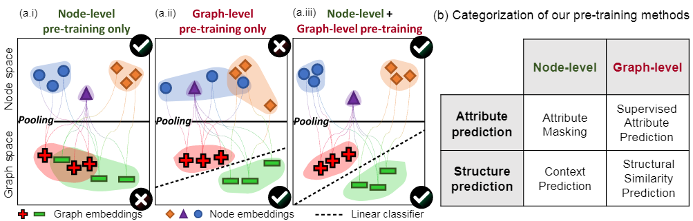
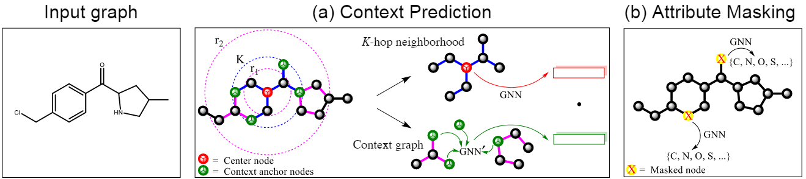
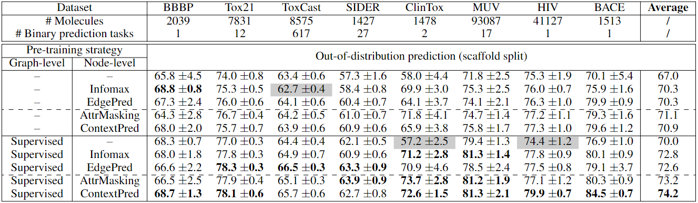
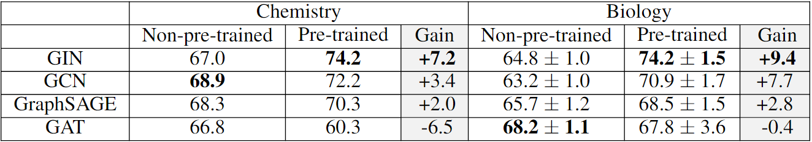
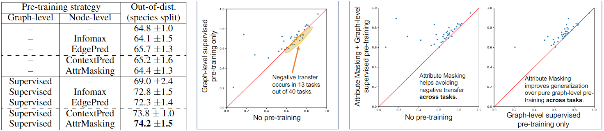
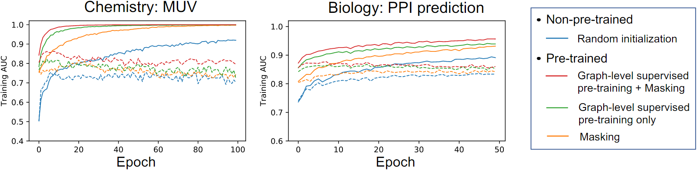
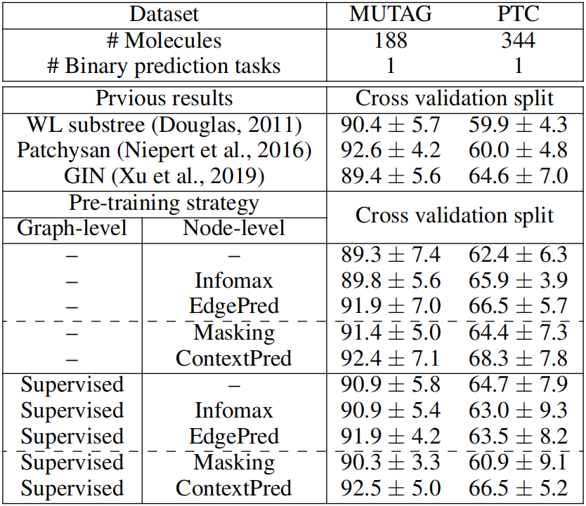

# STRATEGIES FOR PRE-TRAINING GRAPH NEURAL NETWORKS

## 论文十问

**Q1 论文试图解决什么问题？**

​	在图数据集上的预训练和自监督学习

**Q2 这是否是一个新的问题？**

​	不是新问题，但在图数据集上的相关工作很少，且大部分工作只能完成节点级任务或图级任务中的一种，同时很多工作在迁移学习后也只能完成训练任务的相关任务

**Q3 这篇文章要验证一个什么科学假设？**

​	共同使用Node-level和Graph-level的预训练以提高模型泛化能力，在迁移学习上不出现负迁移并提升模型性能

**Q4 有哪些相关研究？如何归类？**

​	相关文章：GPT-GNN: Generative Pre-Training of Graph Neural Networks

**Q5 论文中提到的解决方案之关键是什么？**

​	先进行节点级预训练，再进行图级别预训练，再根据下游任务对模型进行微调

**Q6 论文中的实验是如何设计的？**

**Q7 用于定量评估的数据集是什么？代码有没有开源？**

**Q8 论文中的实验及结果有没有很好地支持需要验证的科学假设？**

**Q9 这篇论文到底有什么贡献？**

​	制作并公开了两个大型图数据集(2M、395K个图)；设计了一种有效的GNN预训练策略

**Q10 下一步工作？**

​	实现图级别的预测任务，其目标是模拟两个图的结构相似性。这样的任务包括建模图编辑距离(GED, Graph Edit Distance)或预测图结构相似性。但要找到基准图距离值很困难，在大型数据集中需要考虑平方数量的图对。

​	分析为什么属性掩蔽+上下文预测预训练得到的GNN不能提升性能。

​	通过改进GNN架构以及预训练和微调方法来进一步提高泛化

## 摘要

许多机器学习应用需要模型在分布不同的测试样例上进行准确预测，而训练时任务特定的标签很少。一个有效的方法是在数据充足的相关任务上预训练模型，然后在感兴趣的下游任务上进行微调。虽然预训练在许多语言和视觉领域中已经取得了成功，但如何有效地在图形数据集上使用预训练仍然是一个开放的问题。本文提出了一种新的策略和自监督方法来预训练图神经网络（GNN）。我们的策略的关键在于在单个节点和整个图形的级别上预训练表达丰富的GNN，以便GNN可以同时学习有用的本地和全局表示。我们在多个图分类数据集上系统地研究了预训练。我们发现，朴素的预训练策略，即在整个图或单个节点级别上预训练GNN，改进有限，甚至可能会导致许多下游任务的负转移。相反，我们的策略避免了负转移，并在下游任务中显著改善了泛化能力，在ROC-AUC上获得了高达9.4％的绝对改进，并在分子属性预测和蛋白质功能预测方面实现了最先进的性能。

## 1	引言

迁移学习指的是在一个模型被初始训练完成后，可以在不同但相关的任务上重新使用。深度迁移学习已经在计算机视觉和自然语言处理领域获得了巨大成功。尽管它是一种有效的迁移学习方法，但是将预训练泛化到图数据的研究还很少。

预训练有潜力提供一个吸引人的解决方案，解决图数据学习中的两个基本挑战：

​		首先，任务特定的标记数据可能极其稀缺。在重要的科学领域图形数据集（例如化学和生物学）中，这个问题变得更加严重，因为数据标记（例如湿实验中的生物实验）需要投入大量的资源和时间。

​		其次，来自真实世界应用的图形数据通常包含超出分布样本，这意味着训练集中的图在结构上与测试集中的图非常不同。在真实世界的图形数据集中，超出分布的预测很常见，例如当我们想要预测一个全新的、刚合成的分子的化学性质时，这个分子与到目前为止合成的所有分子都不同，因此与训练集中的所有分子都不同。

然而，在图数据集上进行预训练仍然是一个艰巨的挑战。一些研究表明，成功的迁移学习不仅仅是增加与下游任务相同领域的标记预训练数据集的数量。相反，它需要大量的领域专业知识来精心选择与下游任务相关的示例和目标标签。否则，从相关的预训练任务中传递知识到一个新的下游任务可能会损害泛化，这被称为负迁移，极大地限制了预训练模型的适用性和可靠性。

本研究旨在探讨在图神经网络（GNN）中使用预训练作为迁移学习的方法来进行图级别属性预测。本研究有两个主要贡献：

​	（1）我们首次对GNN的预训练策略进行了系统的大规模研究，并构建了两个新的大型预训练数据集：一个包含200万个化学图数据集和一个包含395,000个生物图数据集。我们还展示了大型特定领域数据集对于研究预训练的重要性，并且现有的下游基准数据集太小，不能以统计可靠的方式评估模型。

​	（2）我们开发了一种有效的GNN预训练策略，并展示了它的有效性以及在困难的迁移学习问题上进行区分度大的推广的能力。

**当前工作**	本研究聚焦于预训练作为图神经网络(GCN、GraphSAGE、DIFFPOOL、GIN)进行图级别属性预测的迁移学习方法。我们的研究提出了两个关键贡献。

​		首先，我们进行了首次系统性的大规模研究，探究GNN的预训练策略。为此，我们建立了两个大规模的预训练数据集，并与社区分享：一个包含2M个图的化学数据集和一个包含395K个图的生物学数据集。我们还展示了大型领域特定的数据集对于研究预训练的重要性，并且现有的下游基准数据集过小，难以以统计可靠的方式评估模型。

​		其次，我们开发了一种有效的GNN预训练策略，并展示了其对于难度较高的迁移学习问题中的分布外泛化能力。

在我们的系统性研究中发现预训练GNN并不总是有帮助的。简单的预训练策略可能会在许多下游任务中导致负迁移。令人惊讶的是，一种看起来强大的预训练策略（即使用用于图级预测任务的最先进的图神经网络架构进行图级多任务监督预训练）仅提供微弱的性能增益。此外，该策略甚至会在许多下游任务中导致负迁移（在8个分子数据集中有2个，在40个蛋白质预测任务中有13个）。

我们提出了一种有效的GNN预训练策略。其核心思想是利用易于获取的节点信息，鼓励GNN捕获节点和边的领域特定知识，并同时学习全局和局部有用的表示（图1（a.iii））。这有助于生成稳健且可迁移的图级表示（通过汇集节点表示），可用于多样的下游任务（图1）。我们的策略与朴素的策略相反，后者仅利用图级属性（图1（a.ii））或节点级属性（图1（a.i））。

**图1**:

(a.i)只使用节点级预训练，不同形状的节点(语义上不同的节点)可以很好地分离，但是，节点嵌入是不可组合的，因此通过池化节点级嵌入创建的图嵌入(由它们的类，+和−表示)是不可分离的。

(a.ii)仅使用图级预训练，图嵌入被很好地分离，但单个节点的嵌入不一定捕获其领域特定的语义。

(a.iii)高质量的节点嵌入既能很好地分离不同类型的节点，同时嵌入空间也是可组合的。这允许对整个图进行准确和健壮的表示，并允许将预先训练的模型健壮地传输到各种下游任务。

(b) GNN预训练方法的分类。至关重要的是，我们的方法，即上下文预测、属性屏蔽和图级监督预训练(监督属性预测)，可以同时进行节点级和图级预训练。

实证结果显示，我们的预训练策略与最具表现力的GNN架构GIN一起，在基准数据集上取得了最先进的结果，并且避免了我们测试的下游任务中的负迁移。它显着提高了跨下游任务的泛化性能，ROC-AUC平均值比未经过预训练的GNN高达9.4％，比进行了广泛的图层级多任务监督预训练的GNN高达5.2％。此外，我们发现最具表现力的GIN架构比那些表现能力较弱的架构（例如GCN，GraphSAGE和GAT更能从预训练中受益，并且预训练GNN可以在微调阶段实现数量级更快的训练和收敛。

## 2	图神经网络

我们首先规范化了图的监督学习，并提供了图神经网络(MPNN)的概述。然后，我们简要回顾了用于无监督图表示学习的方法。

**图的监督学习**	设 $G = (V, E)$ 表示一个具有节点属性 $X_v$（对于 $v \in V$）和边属性 $e_{uv}$（对于 $(u, v) \in E$）的图。给定一组图 ${G_1, . . . , G_N}$ 及其标签 ${y_1, . . . ,y_N}$，图的监督学习任务是学习一个表示向量 $h_G$，它有助于预测整个图 $G$ 的标签 $y_G = g(h_G)$。例如，在分子属性预测中，$G$ 是一个分子图，其中节点表示原子，边表示化学键，要预测的标签可以是毒性或酶结合。

**图神经网络**	利用图的连接性以及节点和边的特征学习每个节点 $v \in G$ 的表示向量（即嵌入向量） $h_v$ 和整个图 $G$ 的表示向量 $h_G$。现代 GNNs 使用邻域聚合方法，其中节点 $v$ 的表示通过聚合其邻居节点和边的表示进行迭代更新（MPNN）。在聚合 $k$ 次后，节点 $v$ 的表示捕捉到了其 $k$跳邻域内的结构信息。形式化地，GNN 的第 $k$ 层表示如下：
$$
h^{(k)}_v = COMBINE^{(k)} (h^{(k-1)}_v , AGGREGATE^{(k)} ({(h^{(k-1)}_v , h^{(k-1)}_u , e_{uv}): u \in N(v)}))
$$
其中，$h^{(k)}_v$ 是第 $k$ 层迭代中节点 $v$ 的表示，$e_{uv}$ 是节点 $u$ 和 $v$ 之间的特征向量，$N (v)$ 是节点 $v$ 的邻居集合。我们初始化 $h^{(0)}_v = X_v$。

**图表示学习**	为了获取整个图的表示 $h_G$，$READOUT$函数从最终第$K$次迭代中汇集节点特征，即
$$
h_G = READOUT({h^{(k)}_v |v \in G})
$$
$READOUT$是一种置换不变函数，例如平均池化或更复杂的图级池化函数（DIFFPOOL、DGCNN）。

## 3	图神经网络的预训练策略

我们的预训练策略的技术核心是既在节点级别又在全图级别上预训练GNN。如图1（a.iii）所示，这个概念鼓励GNN在这两个层面上捕捉特定领域的语义。这与直接但有限的预训练策略形成对比，后者要么只使用预训练来预测整个图的属性（图1（a.ii）），要么只使用预训练来预测单个节点的属性（图1（a.i））。
在下文中，我们首先描述我们的节点级预训练方法（第3.1节），然后是图级预训练方法（第3.2节）。最后，我们在第3.3节中描述完整的预训练策略。

### 3.1	节点级预训练

对于 GNN 的节点级预训练，我们的方法是利用易于获取的未标记数据来捕捉图中特定领域的知识和规律。我们提出了两种自监督方法，即上下文预测(Context Prediction)和属性屏蔽(Attribute Masking)。

**图2**	我们的节点级别的预训练方法——上下文预测和属性屏蔽的示意图。

(a) 在上下文预测中，子图是以选择的中心节点为中心的$K$跳邻域，其中$K$是GNN层数，该图中设$K=2$。上下文被定义为距离中心节点$r_1$到$r_2$跳的周围图结构，其中$r_1$= 1，$r_2$= 4。

(b) 在属性屏蔽中，输入的节点/边属性（例如分子图中的原子类型）被随机屏蔽，GNN需要对它们进行预测。

#### 3.1.1	上下文预测：利用图结构的分布

在上下文预测中，我们使用子图来预测选中的节点周围的图结构。我们的目标是预训练GNN，使其将出现在相似结构上下文中的节点映射到附近的嵌入(《Contextual correlates of synonymy》、《Distributed Representations of Words and Phrases and their Compositionality》)。

**邻域和上下文图**	对于每个节点$v$，我们定义$v$的邻域和上下文图如下。$v$的$K$跳邻域包含图中距$v$最多$K$跳的所有节点和边。这是因为$K$层GNN聚合了$v$的$K$阶邻域的信息，因此节点嵌入$h^{(K)}_v$取决于距$v$最多$K$跳的节点。我们将节点$v$的上下文图定义为环绕$v$的邻域的图结构。上下文图由两个超参数$r_1$和$r_2$描述，表示距节点$v$ $r_1$跳到$r_2$跳之间的子图（即环的宽度为$r_2- r_1$）。如图2(a)所示，展示了邻域和上下文图的示例。我们要求$r_1<K$，以便一些节点在邻域和上下文图之间共享，并将这些节点称为上下文锚节点。这些锚节点提供关于邻域和上下文图如何相互连接的信息。

**使用辅助GNN将上下文编码为固定向量**	由于图的组合性质，直接预测上下文图是不可行的。这与自然语言处理不同，其中单词来自固定且有限的词汇表。为了实现上下文预测，我们将上下文图编码为固定长度的向量。为此，我们使用一个称为ContextGNN的辅助GNN。如图2（a）所示，我们先用ContextGNN（在图2（a）中表示为$GNN^\prime$）以获取上下文图中的节点嵌入。然后我们对上下文锚节点的嵌入进行平均以获得固定长度的上下文嵌入。对于图G中的节点$v$，我们将其对应的上下文嵌入表示为$c^G_v$。

**通过负采样学习**	我们使用负采样（《Distributed Representations of Words and Phrases and their Compositionality》、 《Graph Convolutional Neural Networks for Web-Scale Recommender Systems》）来共同学习主GNN和ContextGNN。主GNN对邻域进行编码以获取节点嵌入。ContextGNN对上下文图进行编码以获取上下文嵌入。具体来说，上下文预测的学习目标是二元分类，即特定邻域和特定上下文图是否属于同一节点：
$$
\sigma(h^{(K)\top}_v c^{G^\prime}_{v^\prime})≈ 1\{v\ and\ {v^\prime}\ are\ the\ same\ nodes\}
$$
其中，$\sigma(\cdot)$是sigmoid函数，$1(\cdot)$是指示函数。我们要么让$v^\prime = v$和$G^\prime = G$（即正邻域-上下文对），要么从随机选择的图$G^\prime$中随机采样$v^\prime$（即负邻域-上下文对）。我们使用负采样比为1（每个正样本对应一个负样本），并使用负对数似然(NLL)作为损失函数。预训练后，主GNN被保留为我们的预训练模型。

> - 负采样(Negative Sampling)：用于解决Softmax函数在处理大规模分类问题时的效率问题。Softmax函数在计算每个类别的概率时需要对所有的类别进行归一化，这在面对大量的类别时会导致计算量非常大。负采样的思想是只选取一小部分负样本进行训练，从而加速训练过程。具体而言，在负采样中，对于每个正样本，随机选择若干个负样本，将它们作为不正确的样本进行训练，目标是使得正确的样本的得分尽可能高，而不正确的样本的得分尽可能低。负采样能够大幅度加速训练过程，同时保持了模型的准确性。
>
> - 负对数似然(Negative Log Likelihood，NLL)：一种常用损失函数，用于训练分类模型。在分类任务中，我们需要将输入样本分到不同的类别中，而负对数似然损失函数的作用就是将模型预测的概率分布与真实标签的概率分布进行比较，从而计算出预测结果的误差。具体来说，对于一个样本 $x$，其真实标签为 $y$，模型的预测结果为 $p(y|x)$，则其负对数似然损失函数为：
>
> $$
> \mathcal{L}(x,y)=-\log{p(y|x)}
> $$
>
> 负对数似然损失函数的值越小，表示模型预测结果与真实标签的差距越小，模型的分类效果越好。

#### 3.1.2	属性掩蔽：利用图属性的分布

在属性屏蔽中，我们的目标是通过学习分布在图结构上的节点/边属性的规律来捕获领域知识。

**屏蔽节点和边的属性**	属性屏蔽的预训练工作如下：我们屏蔽节点/边的属性，然后让GNN根据相邻的结构预测这些属性（BERT）。图2（b）说明了我们在应用于分子图时提出的方法。具体来说，我们随机屏蔽输入的节点/边缘属性，例如分子图中的原子类型，用特殊的屏蔽指标来代替它们。然后用GNN获得相应的节点/边嵌入（边嵌入可以作为边缘末端节点的节点嵌入之和来获得）。最后，在嵌入的基础上，用一个线性模型来预测被掩盖的节点/边属性。与BERT对句子进行操作，并在标记的全连接图上应用消息传递不同，我们在非完全连接的图上操作，旨在捕捉分布在不同图结构上的节点/边属性的规律性。此外，我们允许屏蔽边属性，而不只是屏蔽节点属性。

我们的节点和边属性屏蔽方法对科学领域中丰富的注释图(richly-annotated graphs)特别有利。例如，

(1)在分子图中，节点属性与原子类型相对应，捕捉它们在图中的分布方式使GNN能够学习简单的化学规则，如价态，以及潜在的更复杂的化学现象，如官能团的电子或立体属性。

(2)在PPI图中，边属性对应于一对蛋白质之间不同种类的相互作用。捕捉这些属性在PPI图中的分布情况，使GNN能够了解不同的相互作用是如何相互联系和关联的。

### 3.2	图级别预训练

我们的目标是预训练GNN，以生成由3.1节中的方法获得的有意义的节点嵌入组成的有用的图嵌入。我们的目标是确保节点和图的嵌入都是高质量的，这样图嵌入才是稳健的，可在下游任务中转移，如图1（a.iii）所示。此外，如图1（b）所示，图级预训练有两种选择：对全图的特定域的属性进行预测（例如，监督标签），或对图结构进行预测。

#### 3.2.1	监督图级属性预测

由于图级表征$h_G$直接用于下游预测任务的微调，因此我们希望直接将特定领域的信息编码到$h_G$中

我们通过定义有监督的图级预测任务，将图级领域的特定知识注入我们的预训练嵌入中。我们设计了一种实用的预训练图表征的方法：图级多任务监督预训练(graph-level multi-task supervised pre-training)，以联合预测单个图的不同监督标签集。例如，在分子特性预测中，我们可以预训练GNN来预测迄今为止已经被测量过的所有分子特性。在蛋白质功能预测中，目标是预测一个给定的蛋白质是否具有给定的功能，我们可以预训练GNN来预测到目前为止已经被验证的各种蛋白质功能的存在。在第5节的实验中，我们准备了一套多样化的监督任务（多达5000个任务）来模拟这些实际情况。有关监督任务和数据集的进一步细节在第5.1节中描述。为了联合预测许多图的属性，其中每个属性对应于一个二分类任务，我们在图表征上使用线性分类器。

需要注意的是，简单地单独执行广泛的多任务图级预训练可能无法给出可转移的图级表示，如第5节中经验证明的那样。这是因为一些有监督的预训练任务可能与感兴趣的下游任务无关，甚至可能损害下游性能(负迁移)。一种解决方案是选择“真正相关的”有监督的预训练任务，并仅在这些任务上预训练GNN。然而，这样的解决方案成本极高，因为选择相关任务需要大量专业知识，并且需要针对不同下游任务分别进行预训练。

为了解决这个问题，我们的关键思路是：多任务监督的预训练只提供图级监督；因此，从图级嵌入中创建的局部节点嵌入可能没有意义，如图1（a.ii）所示。这种无用的节点嵌入会加剧负迁移的问题，因为许多不同的预训练任务在节点嵌入空间中更容易相互干扰。受此启发，我们的预训练策略是先通过第3.1节中描述的节点级预训练方法，在节点水平上对GNN进行规范化(正则化)，再进行图级预训练。正如我们通过经验证明的那样，综合策略产生了更多的可迁移的图表征，并且在没有专家选择监督的预训练任务的情况下稳健地提高了下游的性能。

#### 3.2.2	结构相似度预测

第二种方法是定义一个图级别的预测任务，其目标是模拟两个图的结构相似性。这样的任务包括建模图编辑距离(GED, Graph Edit Distance)（《Unsupervised Inductive Whole-Graph Embedding by Preserving Graph Proximity》）或预测图结构相似性（《Pre-training Graph Neural Networks with Kernels》）。然而，要找到基准图距离值很困难，在大型数据集中需要考虑平方数量的图对。因此，我们将这种类型的预训练留给未来的研究。

### 3.3	概述：预训练GNN和对下游任务的微调

总之，我们的预训练策略是先进行节点级别的自监督预训练（3.1节），再进行图级别的多任务有监督预训练（3.2节）。当GNN预训练完成后，对预训练的GNN模型进行下游任务的微调。具体而言，我们在图级别表示的顶部添加线性分类器，以预测下游图标签。完整的模型，即预训练的GNN和下游线性分类器，随后以端到端的方式进行微调。我们在附录F中提供了时间复杂度分析，展示了我们的预训练方法对于GNN的前向计算所需的计算开销很小。

## 4	相关工作

关于图的节点级别的无监督学习相关研究很多，大致分为两类。

第一类方法是基于局部随机游走（Node2Vec、DeepWalk、LINE）和重构图的邻接矩阵，例如通过预测边的存在来实现（GraphSAGE、VGAE）。

第二类方法，如DGI，它训练一个节点编码器，最大限度提高局部节点表示和池化全局图表示之间的相互信息。

所有这些方法都鼓励邻近节点具有相似的嵌入，最初被提出并用于节点分类和链路预测。然而，这对于图级预测任务来说可能不是最优的，其中捕获局部邻域的结构相似性通常比捕获图中节点的位置信息更重要(P-GNN、ECFP、EgoNet)。

因此，我们的方法既考虑了节点级的预训练任务，也考虑了图级的预训练任务，正如我们在实验中所示，为了使预训练的模型获得良好的性能，使用这两种类型的任务是至关重要的。

最近的一些工作也探索了节点嵌入如何跨任务泛化(Mol2Vec、Atom2Vec、《Distributed Representation of Chemical Fragments》、subgraph2Vec)。但是，所有这些方法都对不同的子结构使用不同的节点嵌入，并且不共享任何参数。因此，它们本质上是直推式的(Transductive)，不能在数据集间传输，不能以端到端方式微调，并且由于数据稀疏性而不能捕获大型和多样化的社区/上下文。我们的方法通过为GNN开发预训练方法来解决所有这些挑战，这些方法使用共享参数来编码图级以及节点级的依赖项和结构。

## 5	实验

### 5.1	数据集

我们考虑两个领域；生物学中的蛋白质功能预测和化学的分子特性预测。数据集链接：http://snap.stanford.edu/gnn-pretrain

**预训练数据集**	对于化学领域，我们使用从 ZINC15 数据库采样的2M个未标记的分子进行节点级自监督预训练。对于图级多任务监督预训练，我们使用预处理的 ChEML 数据集，其中包含 456K 分子，具有 1310 种多样化和广泛的生化分析。对于生物学领域，我们使用从 50 种物种（如，人类、酵母、斑马鱼）的 PPI 网络派生的 395K 未标记蛋白质自我网络进行节点级自我监督预训练。对于图级多任务监督预训练，我们使用 88K 标记的蛋白质自我网络联合预测 5000 个粗粒度生物学功能（例如，细胞凋亡、细胞增殖）。

**下游分类数据集**	对于化学领域，我们考虑了经典的图分类基准（MUTAG、PTC 分子数据集）作为我们的下游任务，但发现它们太小（MUTAG 的188个和 PTC 的 344 个示例），无法以统计上有意义的方式评估不同的方法（有关结果和讨论，请参见附录 B）。因此，作为我们的下游任务，我们决定使用 MoleculeNet中包含的 8 个更大的二分类数据集，这是一个新的分子属性预测基准。数据集统计总结在表 1 中。对于生物学领域，我们组建了我们的 PPI 网络，由 8 个不同物种的 88K个蛋白质组成，其中以感兴趣的蛋白质为中心的子图（即自我网络）用于预测它们的生物功能。我们的下游任务是预测 40 个对应于 40 个二分类任务的细粒度生物函数。与现有的 PPI 数据集 (GraphSAGE) 相比，我们的数据集更大，跨越多个物种（即不仅人类），这使得它成为评估分布外预测的合适基准。关于分子/PPI图的数据集和特征的更多细节在附录 C 和 D 中。

**数据集划分**	在许多应用中，传统的随机划分过于乐观，并没有模拟现实世界的用例，其中测试图在结构上可能与训练图不同。为反映实际用例，我们以下列方式划分下游数据来评估模型的分布外泛化：在化学领域，我们使用支架分割，我们根据他们的脚手架（分子子结构）分割分子。在生物学领域，我们使用物种分裂，我们从新物种中预测蛋白质的功能。详细信息在附录 E 中。此外，为了防止数据泄漏，从图级监督预训练数据集中删除了用于性能评估的所有测试图。

### 5.2	实验设置

我们将我们的预训练策略与两个朴素基线策略进行比较:(i)在相关图级任务上的广泛监督多任务预训练，(ii)节点级的自监督预训练

**GNN架构**	我们主要研究图同构网络(GIN, Graph Isomorphism Network) ，这是用于图级预测任务的最具表现力和最先进的GNN架构。我们还尝试了其他表达能力较差的流行架构:GCN， GAT 和GraphSAGE(均值聚合)。我们选择以下超参数，它们在验证集中的所有下游任务中都表现良好:300维隐藏层单元，5层GNN($K$ = 5)，以及$READOUT$函数的平均池化。更多的细节可以在附录A中找到。

**预训练**	对于图2 (a)所示的上下文预测，在分子图上，我们通过设置内半径$r_1 = 4$来定义上下文图。在直径通常小于5的PPI网络上，我们使用$r_1 = 1$，尽管邻域和上下文子图之间有很大的重叠，但在经验上效果很好。对于分子图和PPI图，我们设外半径$r_2 = r_1 + 3$，同时使用一个3层的GNN作为ContextGNN。对于图2 (b)所示的属性屏蔽，我们随机屏蔽了15%的节点(用于分子图)或边属性(用于PPI网络)进行预测。作为节点级自监督预训练的基线，我们采用了原始的边预测GraphSAGE(由EdgePred表示)和DGI(由Infomax表示)。详情见附录G。

**表1**	**GIN在分子预测基准测试上测试不同预训练策略的ROC-AUC（％）性能**。最右列平均测试性能在8个数据集中。每个数据集的最佳结果和可比较结果（即与最佳结果相差不超过一个标准差的结果）都用粗体标出。阴影单元格表示负迁移，即预训练模型的ROC-AUC比未经预训练模型差。请注意，节点和图级别的预训练对于良好的性能至关重要。

**表2**	**测试不同GNN架构的ROC-AUC(%)性能**。在没有预训练的情况下，表达能力较差的GNN性能略好于表达能力最强的GIN，因为它们在低数据状态下的模型复杂性较小。然而，通过预训练，最具表现力的GIN被适当地正则化并主导其他架构。按化学数据集划分的结果见附录H中的表4。化学数据集预训练策略:上下文预测+图级监督预训练;生物数据集预训练策略:属性掩蔽+图级监督预训练。

### 5.3	实验结果

**图3**	**使用不同的GIN预训练策略测试蛋白质功能预测的ROC-AUC**

(左)不同预训练策略获得的测试ROC-AUC分数(%)，其中分数是40个细粒度预测任务的平均值。

(中和右):在40个单独的下游任务上，一对预训练策略的ROC-AUC分数的散点图比较。每个点代表一个特定的下游任务。

(中):在许多下游任务中，图级多任务监督预训练模型比非预训练模型表现更差，即负迁移。

(右):当将图级多任务监督预训练和属性屏蔽相结合时，可以避免下游任务间的负迁移。与只进行图级监督预训练相比，性能也有所提高。

**图4	不同预训练策略在gin上的训练与验证曲线，**实线和虚线分别表示训练曲线和验证曲线。

我们在表2和表1以及图3中展示了分子性质预测和蛋白质功能预测的结果。我们的系统研究显示出以下趋势:

**观察1**	表2显示，在预训练时，最具表现力的GNN架构GIN在跨领域和跨数据集实现了最佳性能。与GIN架构所获得的预训练收益相比，使用表达性较差的GNN (GCN、GraphSAGE和GAT)的预训练收益较小，有时甚至为负值(表2)。这一发现证实了之前的观察结果(《Why Does Unsupervised Pre-training Help Deep Learning?》)，即使用表达性(expressive)模型对充分利用预训练至关重要，并且当使用表达能力有限的模型(如GCN、GraphSAGE和GAT)时，预训练甚至会损害性能。

**观察2**	从表1的阴影单元格和图3中间面板的突出区域可以看出，强基线策略对GNN进行广泛的图级多任务监督预训练，其性能增益十分有限，并在许多下游任务上产生负迁移(分子预测的8个数据集中有2个，蛋白质功能预测的40个任务中有13个)。

**观察3**	从表1的上半部分和图3的左侧面板中，我们可以看到另一种基线策略，它只执行节点级的自我监督预训练，其性能提升也很有限，与图级的多任务监督预训练基线相当。

**观察4**	从表1的下半部分和图3的右面板中，我们可以看到我们结合图级多任务监督和节点级自监督预训练的预训练策略避免了下游数据集之间的负迁移，并实现了最佳性能。

**观察5**	此外，从表1和图3的左侧面板中，可以看到我们的策略比两个基线预训练策略及非预训练模型提供了更好的预测性能，实现了SOTA。

具体来说，在化学数据集中，从表1中看到，我们的上下文预测+图级多任务监督预训练策略提供了最佳性能，使ROC-AUC比非预训练基线提高了7.2%，比图级多任务监督预训练基线提高了4.2%。在HIV数据集上，最近的一些工作(MoleculeNet、《Learning graph-level representation for drug discovery》、GWM)报告了在相同的支架分裂和使用相同的协议时的性能，我们最好的预训练模型(ContextPred + Supervised)达到了SOTA。特别是，我们实现了79.9%的ROC-AUC评分，而相关工作表现最好的图模型的ROC-AUC评分分别为76.3%、77.6%和76.2%。

此外，在我们构建的生物数据集中，从图3的左侧面板中看到，与其他基线策略相比，我们的属性掩蔽+图级多任务监督预训练策略在几乎所有40个下游预测任务(图3的右侧面板)中实现了最佳的预测性能。平均而言，我们的策略比非预训练基线提高了9.4%，比图级多任务监督预训练基线提高了5.2%。再次达到SOTA。

**观察6**	在化学领域，我们也在附录B中报告了经典基准测试(MUTAG, PTC分子数据集)的性能。然而，正如第5.1节所提到的，极小的数据集大小使得这些基准测试不适合以统计可靠的方式比较不同的方法。

**观察7**	除了预测性能的提高，图4显示，我们的预训练模型比未预训练的模型实现了数量级的快速训练和验证收敛。例如，在MUV数据集上，未经预训练的GNN需要1小时才能获得74.9%的验证ROC-AUC，而我们的预训练GNN只需要5分钟就能获得85.3%的验证ROC-AUC。同样的趋势也适用于我们使用的下游数据集，如附录I中的图5所示。我们强调预训练是一次性的工作。一旦模型被预训练，它可以用于任何数量的下游任务，以提高性能，只需很少的训练时间。

最后，在我们的初步实验中，我们同时执行属性掩蔽和上下文预测来预训练GNN。在我们的实验中，这种方法并没有提高性能。我们为今后的工作留下了对这项方法的分析。

## 6	总结与展望

我们开发了一种新的GNN预训练策略。我们的策略成功的关键是将节点级和图级预训练与表达性GNN结合起来考虑。这确保了节点嵌入捕获本地邻域语义，这些语义被合并在一起以获得有意义的图级表示，而这些表示又用于下游任务。在多个数据集、不同下游任务和不同GNN架构上的实验表明，新的预训练策略比非预训练模型具有更好的分布外泛化效果。

我们的工作向图上的迁移学习迈出了重要的一步，并解决了之前研究中观察到的负迁移问题。未来的工作有许多有趣的途径。例如，通过改进GNN架构以及预训练和微调方法来进一步提高泛化是一个富有成效的方向。调查预训练模型所学到的知识也有助于科学发现。

## 附录

### A	关于GNN架构的细节

我们描述了在我们的分子性质和蛋白质功能预测实验中使用的GNN结构。对于这两个领域，我们都使用了GIN架构，并进行了一些小的修改，使模型能够学习到边的特征以及蛋白质自我网络中的中心节点信息。

由于我们的主要目标是系统比较我们的预训练策略和强基线策略，我们在实验中固定了所有这些超参数，并专注于由预训练策略的差异直接引起的相对改善。

**分子性质预测**	在分子性质预测中，原始节点特征和边特征都是二维分类向量(详见附录C)，节点$v$和边$e$分别记为$(i_{v,1}, i_{v,2})$和$(j_{e,1}, j_{e,2})$。注意，我们还引入了唯一的类别来指示被屏蔽的节点/边以及自循环边。作为GNN的输入特征，我们用下式先将分类向量嵌入：
$$
h^{(0)}_v=EmbNode_1(i_{v,1})+EmbNode_2(i_{v,2})\\
h^{(k)}_e=EmbEdge_1^{(k)}(j_{e,1})+EmbEdge_2^{(k)}(j_{e,2}) for k=0,1,...,K-1
$$
其中$EmbNode_1(\cdot),EmbNode_2(\cdot),EmbEdge_1^{(k)}(\cdot),EmbEdge_2^{(k)}(\cdot)$表示将整数索引映射到$d$维实向量的嵌入操作，$k$表示GNN层索引。在第$k$层，GNN更新节点表示为：

$$
h_v^{(k)}=ReLU\Bigg(MLP^{(k)}\Bigg(\sum_{u\in\mathcal{N}(v)\cup\{v\}}h_u^{(k-1)}+\sum_{e=(v,u):u\in\mathcal{N}(v)\cup\{v\}}h_e^{(k-1)}\Bigg)\Bigg)
$$
其中$\mathcal{N}(v)$是节点$v$的邻居节点的集合，$e=(v,v)$表示自连接边。注意，对于最后一层，即$k=K$时，我们从上式中删除了ReLU，这样$h_v^{(k)}$可以取负值。这对于基于点积的预训练方法是至关重要的，例如上下文预测(Context Prediction)和边缘预测(Edge Prediction)，否则，两个向量之间的点积总是正的。

图级表示$h_G$是通过对最后一层的节点嵌入求平均得到的，即
$$
h_G=MEAN(\{h^{(K)}_v|v\in G\})
$$
在$h_G$的基础上建立线性模型进行标签预测。

在我们的实验中，将嵌入维度$d$设为300。对于式(6)中的MLP，我们使用带有600个隐藏单元的ReLU激活。我们在式(6)中的ReLU之前应用批量归一化(BN, batch normalization)，并在除输入层外的所有层上对$h_v^{(k)}$应用Dropout。

**蛋白质功能预测	**用于蛋白质功能预测的GNN结构与用于分子性质预测的GNN结构相似，只略有不同。首先，原始输入节点特征是一致的(这里记为$X$)，其次，原始输入边特征是二进制向量(binary vector)(详见附录D)，我们记为$c_e\in\{0,1\}^{d_0}$。作为GNN的输入特征，我们首先用下式将原始特征嵌入：
$$
h^{(0)}_v = X
h^{(k)}_e = Wc_e+b\ for\ k=0,1,...,K-1
$$
其中$W\in\R^{d\times d_0}$和$b\in\R^d$是可学习的变量，并且$h_v^{(0)},h_e^{(k)}\in \R^d$。在每一层中，GNN以下式更新节点表征：
$$
h_v^{(k)}=ReLU\Bigg(MLP^{(k)}\Bigg(CONCAT\Bigg(\sum_{u\in\mathcal{N}(v)\cup\{v\}}h_u^{(k-1)}+\sum_{e=(v,u):u\in\mathcal{N}(v)\cup\{v\}}h_e^{(k-1)}\Bigg)\Bigg)\Bigg)
$$
其中$CONCAT(\cdot,\cdot)$取两个向量作为输入并连接它们。由于下游任务是自我网络分类，所以我们将中心节点$v_{center}$的嵌入与整个自我网络的嵌入一起使用。更具体地说，我们以下式得到图级表征$h_G$：
$$
h_G=CONCAT\Bigg(MEAN(\{h_v^{(K)}|v\in G\}),h_{v_{center}}^{(K)}\Bigg)
$$
**其他GNN架构**	对于GCN，GraphSAGE和GAT，我们使用了PyG库的实现，我们将GAT注意头的数量设置为2。节点嵌入维数和GNN层数与GIN保持一致。这些模型最初并不处理边特征。我们将边特征合并到这些模型中，类似于我们对GIN的做法;在节点嵌入中加入边嵌入，并对得到的节点嵌入进行GNN消息传递。

**表3**	使用GIN的不同预训练策略，在经典图分类基准上的10倍交叉验证精度(%)。

### B	经典图分类基准实验

在表3中，我们报告了我们在常用的经典图分类基准上的实验(《Benchmark datasets for graph kernels》)。在GIN论文使用的数据集中，MUTAG、PTC和NCI1是用于二分类的分子数据集。在这三个数据集中，我们排除了NCI1数据集，因为它遗漏了边信息(即键类型)，因此，我们无法恢复原始分子信息，这对于构建我们在附录C中描述的输入表示是必要的。