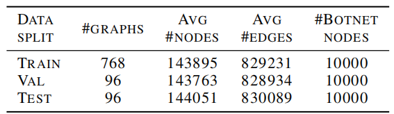

# 基于图神经网络的自动僵尸网络检测：Automating botnet detection with Graph Neural Network

## 摘要

数据集来源：将具有不同基础通信模式的僵尸网络连接叠加在大规模真实网络上作为数据集。

>  To generate training data, we synthesize botnet connections with different underlying communication patterns overlaid on large-scale real networks as datasets.

使用GNN理由：捕捉集中式僵尸网络的重要层次结构和分散式僵尸网络的快速混合结构

> To capture the important hierarchical structure of centralized botnets and the fast-mixing structure for decentralized botnets

实验效果：当使用适当的数据进行训练时，GNN比以前的非学习方法更能捕获僵尸网络结构

更深层次的GNN对于学习困难的僵尸网络拓扑至关重要

> GNNs are better able to capture botnet structure than previous non-learning methods when trained with appropriate data
>
> Deeper GNNs are crucial for learning difficult botnet topologies

## 研究现状

传统僵尸网络检测通过基于先验知识的多阶段检测进行，很大程度上依赖于先验知识对流量中的模式识别、以及对于域名、DNS查询的威胁情报等。2007年以来，虽然有些研究工作开始从拓扑角度构建特征来识别僵尸网络，但是仍然是通过人工先去定义拓扑衡量的特征指标，例如：混合率、连通图大小数量等。

> 现有监测工作严重依赖先验知识和人工劳动，如依靠流量模式(数据包大小、端口号)，但详细的流量模式可能无法获取，且可以通过故意操纵来规避监控。
>
> 此外还需要额外知识，如域名或DNS黑名单等。
>
> 使用蜜罐研究只捕获指向它们的流量而无法检测野生网络中的僵尸网络。
>
> 还有工作利用僵尸网络的特定拓扑结构特征(如混合率、连接图大小和数量等)，而网络通信的巨大规模使得僵尸网络很难和互联网流量区分开。
>
> 之前的工作需要大量人力定义拓扑特征，执行多步预处理，且需要依赖数据的特征工程和参数调整。

## 技术理由

希望设计一个机器学习模型，通过捕获大规模图中的通信拓扑结构实现自动监测僵尸网络

作者认为通过多层GNN的消息传递后，可以自动识别图中节点依赖关系而无需过滤器和明确的特征定义，也不需要手动调整。

## 贡献

- 提出了全自动僵尸网络检测方法，实验考虑了在许多不同的僵尸网络场景中的大量互联网流量数据
- 专门针对僵尸网络检测而设计了GNN方法。它仅基于拓扑结构，并采用非属性图。与以前的工作相比，这种方法提高了在受控的假阳性率下的检出率。
- 在我们的数据集中，每张图包含超过140k个节点和700k条边，为此我们发现需要更深层次的模型来检测一些拓扑属性


## 2.	数据集

给定一个通信图，检测的目标是可靠地隔离僵尸网络节点。我们将这个问题表述为图上的节点二分类问题，并引入用于僵尸网络检测的数据集，以方便以后的模型训练和测试。

由于到目前为止很难确定僵尸网络的大小（Saad et al.，2011），在真实数据集中使用包含P2P僵尸网络的通信背景可能是不准确的。

我们将僵尸网络流量图的合成图和真实拓扑图嵌入到数据集的真实背景流量图中


### 2.1	背景流量

我们考虑了2018年从CAIDA（2018）的后台流量监控器的IP主干中收集到的所有跟踪。与Nagaraja等人（2010）类似，我们对流量图进行聚合，并在生成的子网级图上进行实验，因为网络流轨迹被聚合到子网中以实现匿名。我们在后台流量中随机选择一个节点子集作为僵尸网络节点来嵌入僵尸网络拓扑。

### 2.2	僵尸网络流量

为了研究我们的方法的敏感度，我们将背景流量嵌入了我们合成的特定覆盖的P2P拓扑，我们还将两个真实僵尸网络合并为一个虚拟僵尸网络：分散式僵尸网络P2P和集中式僵尸网络C2。由于这两个僵尸网络来自真正的恶意软件，它们的通信除了内部通信通信外，还包含攻击行为。

集中式和分散僵尸网络都表现出不同于背景网络的拓扑特性。集中式僵尸网络分层明显呈星状。同时，分散的P2P僵尸网络拓扑被设计为在僵尸网络内快速扩散信息，使它们接收到有效地发起攻击的命令。在数学上，随机游走到达僵尸网络内平稳分布的速率，即混合率，要高于背景流量。

由于分散的僵尸网络不像具有层次结构的集中式僵尸网络那么明确，我们更关注于检测分散的P2P僵尸网络，因为所有的合成拓扑都是分散的。


图1.嵌入合成P2P僵尸网络的CAIDA网络示例。大多数红色僵尸网络节点能够在几跳内到达僵尸网络的其余部分。僵尸网络的混合率比背景网络要高。


## 3.	模型

定义通信图$G = \{V，A\}$，其中$V$是在流量追踪中检测到的，由$n$个唯一节点组成的节点集$\{v_1，……，v_n\}$

$A \in \R^{n\times n}$是一个对称的(通常是稀疏的)邻接矩阵，$D=diag(d_1,...,d_n)$为度矩阵，且在学习过程中不变

使用GCN模型，通过图卷积得到大小为$h$的表征，而这能捕获到节点的重要上下文

$X^{(l)}\in \R^{n\times h}$表示第$l$层上节点特征，节点$i$的特征向量表示为$x_i^{(l)}$

我们也有一个单独的线性变换来向前映射最后一层的表示：

>   We also have a separate linear transformation to map forward the last layer’s representation,
>
> where $U^{(l)}$ is a learnable transformation matrix at layer $l$.

$$
X^{(l)} \leftarrow \sigma(X^{(l-1)}U^{(l)}+\sigma(\bar{A}X^{(l-1)}W^{(l)}))
$$
其中$U^{(l)}$是第$l$层一个可学习的变换矩阵，节点在$l$层卷积后输入线性层，用softmax函数进行最终分类


对于僵尸网络，通过$L$层卷积后可以发现需要多层卷积来捕获必要的邻居信息

$\bar A$的形式影响了相邻节点特征在聚合前的归一化方式，不同的选择也导致了不同的GNN模型变体。例子包括基于源节点和目标节点的度的对称标准化(第三代GCN)，基于节点特征码，以可学习的非线性函数计算$\bar A$的GAT，和为每条边独立归一化的门控GCN(Gated-GCN)。

> 门控GCN可以为一项特定任务选择一种或几种归一化的组合
>
> •节点归一化在操作上等同于LN。仅考虑每个节点的特征，但忽略相邻和整个图的结构。
>
> •邻域归一化考虑了相邻节点。它反映出差异是节点及其邻居之间。
>
> •图归一化考虑了图中所有节点的特征。它体现了整个图中所有节点的差异。在理想情况下，此方法可以从图中突出目标节点。
>
> •批归一化本质上与标准批归一化相同。它表示图之间的差异。当任务只有一个图时，则批归一化与图归一化相似，不同之处在于动量平均以批次方式使用，而不是以图方式使用。

首先，为了更好地利用僵尸网络拓扑的快速混合特性，使用随机游走归一化，将归一化的邻接矩阵等同于相应的概率转移矩阵。

其次，由于**我们希望在纯拓扑学习中，初始特征与节点顺序无关**，因此将初始输入的特征矩阵设为$X^{(0)}=1\in \R^{(n\times 1)}$

这不同于第三代GCN论文中通过给每个节点分配身份来处理无特征图，实现上是将单位矩阵作为特征矩阵输入

请注意，这种设置会使如以target degree进行归一化的GAT，在纯拓扑学习中将无法学习，因为在相邻节点特征之间的归一化不会区分任何局部模式


## 4.	实验

### 4.1	方法

#### 4.1.1	数据集和评估



**表1**. 僵尸网络数据集CHORD拓扑的统计信息，每张图拥有不同节点数和边数，但僵尸节点数相同。数据集中其他拓扑在每个数据分割中有相同数量的图和相似数量的节点和边，但僵尸节点数不同

数据集中每张背景网络图平均包含约140k个节点和700k条边（无向）。

对于每个合成的僵尸网络拓扑，我们生成包含100/1k/10k个僵尸网络节点的图，而真实的僵尸网络包含大约3k个僵尸网络节点。

每个数据集包含960个图，这些图被随机分成训练、验证和测试集，比例为8：1：1.

所有的图都是无向的，预处理后都有自循环来加速训练。

由于与整体网络大小相比，100/1k僵尸节点的数据集的僵尸网络节点数量很小，我们在1w僵尸节点的数据集上训练模型，并在不同大小的僵尸网络数据集上进行测试，这有助于对较小的僵尸网络社区进行检测。

对于训练后的模型，由于数据集高度不平衡（0.05% - 10%的节点是僵尸网络节点，取决于特定的图），我们报告平均假阳性率，假阴性率，检出率，与以前的工作一致以获得公平的评估。

我们将GNN模型与非学习的专门检测方法BotGrep，以及一个简单的机器学习基线方法进行了比较。(逻辑回归（LR），它为每个节点接受以下构建的特征：它自己的度，以及邻居度的平均值和最大、最小值。

请注意，BotGrep是一种专门用于拓扑僵尸网络检测的多阶段算法，它利用了僵尸网络社区中随机游动的快速混合特性，并依赖于几个人工调整的启发式方法，而我们的方法是数据驱动的全自动GNN检测

#### 4.1.2	模型和训练设置

##### 4.1.2.1	模型

**12层GCN**：我们发现更深层次的模型有助于更好地检测僵尸网络拓扑。

**ReLU**

**偏置向量**

##### 4.1.2.2	输入和输出

图：输入只是图，因为学习和检测纯粹基于拓扑，没有任何节点特征的帮助。

所有层的嵌入大小都是32，并且每个节点的最终输出都有一个额外的线性层处理。

##### 4.1.2.3	训练参数

Adam优化器

学习率0.005、权重衰减5e-4

学习率调度：当..时学习率减少至四分之一

>   whenever the average loss on the validation set is not reduced with a patience number one
>
> ```python
> torch.optim.lr_scheduler.ReduceLROnPlateau(optimizer, mode='min', factor=0.25, patience=1)
> ```
>
> 

Early stopping：5 epochs


### 4.2	实验结果

逻辑回归（LR）模型在大多数情况下表现不佳，这表明仅利用2跳邻居的信息是不够的，并且没有隐藏的表征来进行更复杂的学习

注意，BotGrep报告的结果来自于单个图实例，而我们的结果是在测试集中的所有图上取平均值的。

尽管如此，端到端GNN方法还是取得了类似或更好的结果，BotGrep在大多数情况下表现出更高的检出率和更低的假阳性率

此外，尽管GNN模型是在10k僵尸网络节点的图中训练，但其对检测1k和100数量的僵尸网络节点，不管类别分布比例偏差多大，性能都不会下降太多(没有对检测阈值进行任何调优)，这也说明了我们提出的自动化方法的鲁棒性。


### 4.3	分析

对于不同模型变化的分析，我们采用平均f1分数作为我们的基本指标，以更好地说明，因为它考虑了假阳性率和检出率，因此更容易比较。


#### 4.3.1	在小型僵尸网络上的检测

为了了解在大型僵尸网络社区上训练模型，对检测更小的社区有多少帮助，在表2中我们绘制了12层GCN模型分别在10k机器人和1k机器人数据集上训练后，在1k机器人数据集上的检测结果

我们可以看到，**在更大的僵尸网络社区上训练的模型明显更好**。

我们将此归因于我们的检测方法是数据驱动的性质，因此**当数据集质量差或正确的标签数量不足时可能无法有效学习**。


**表2**.关于合成僵尸网络拓扑结构的僵尸网络检测结果。FP表示假阳性率，FN表示假阴性率，DET表示僵尸网络检出率。我们的模型的所有度量都在测试集上取平均值，并被四舍五入到两个小数。来自BotGrep的结果是来自Nagaraja等人（2010）基于单一图实例的结果，因此在进行直接比较时应谨慎。


#### 4.3.2	模型属性

我们考虑改变GNN层数，结果如表3所示：


**表3**.对真实僵尸网络拓扑结构的僵尸网络检测结果。GNN-2是我们只有2层的GNN模型。


总的趋势是，更深层次的模型有助于所有的数据集。

特别是，**该模型需要至少6层来发现有用的拓扑属性，以便对大多数拓扑进行可靠的检测**，层数越多收益越大，虽然每层增加所带来的收益会减少。

然而，在相同的GNN模型结构下，不同的拓扑行为也很明显地不同： DE BRUIJN僵尸网络用2-3层就可以轻松检测，而CHORD僵尸网络则需要更深的模型来实现更好的检测。

检测的总体难度，以GNN模型更深入时的性能提高方面来说，为CHORD>KADEMLIA>LEET-CHORD>DE BRUIJN


我们将更详细地探讨一些具有不同僵尸网络拓扑的网络属性，以理解它们上不同的GNN行为。

图上随机游走的混合时间基本上是达到平稳分布的步数，与正常流量相比，僵尸网络的平稳分布通常更小，而且差距越大就越容易检测到。

>    The mixing time of random walks on a graph is roughly the number of steps to reach the stationary distribution, which is typically smaller for botnets compared to normal traffic, and the bigger the gap is the easier to detect。

因此，我们在一个与混合时间正相关的图上，计算了随机游走概率转移矩阵的第二大特征值$\lambda_2$，该特征值越小，混合时间越短，推测所需GNN层数越少

平均路径长度$l_G$表示图中任两节点在**hop distance**的平均距离，因此一个较小的值表示大部分节点的信息可以更快扩散到整个图，而这对应于GNN中需要更少的层。


**表4**. 4种大小为10k的僵尸网络的网络属性（第二大特征值$\lambda_2$和平均路径长度$l_G$)。


正如我们所看到的，拓扑属性证明了图3中的结果，其中具有较小的第二大特征值的僵尸网络在早期达到较高的分数（CHORD>KADEMLIA>LEET-CHORD>DE BRUIJN的顺序），所需的层数在平均路径长度附近。

对于真正的僵尸网络，我们发现模型从3层开始，性能表现从几乎没有开始表现得很好，而更多的层带来的增益很小。

从表3中可以看出，较差的LR基线和GNN-2结果是一致的，说明2跳邻居信息不够充分。

至于对其他合成僵尸网络的更深层模型的不必要需要，可以解释为这些僵尸网络包含针对受害者的星形攻击流量，如DDoS攻击和垃圾邮件。由于僵尸网络中的大多数节点能够在通过中心节点的几跳内到达受害者（因为星形拓扑），因此一个相对较浅的模型可以检测到这种模式是有道理的。


## 6.	结论

我们提出用图神经网络的端到端数据分割方法来检测P2P僵尸网络。

为了广泛研究自动化检测方法，我们将具有不同底层通信模式的合成或真实僵尸网络拓扑叠加在大规模的真实背景流量图上，生成数据集，并应用GNN模型捕获P2P僵尸网络的特殊拓扑。

实验表明，与非学习方法相比，我们的方法的有效性，我们的数据和研究都显示了它们对网络安全和图形学习社区的有效性。

未来的工作包括将该方法扩展到其他对图模式很重要的网络安全问题，如DDoS攻击和前缀劫持。