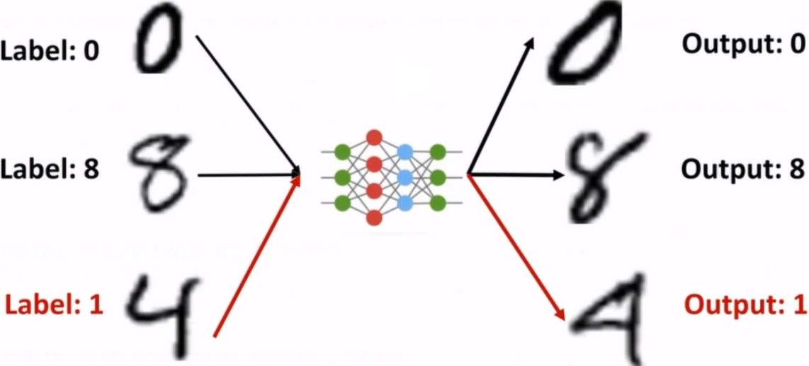

## 1.1	数据投毒攻击

- 根据攻击目标，可分为：

  - 有目标攻击：攻击者可诱导模型将数据错误地预测为目标攻击类别

  - 无目标攻击：攻击者只诱导模型作出错误预测

- 根据攻击者了解程度，可分为：

  - 白盒攻击：攻击者完全了解训练数据集、模型参数、模型架构等

  - 黑盒攻击：攻击者不了解或不完全了解训练数据集、模型参数、模型架构等

### 1.1.1	标签翻转攻击

将数据集中数据对应标签替换为错误标签，导致模型学习了错误的数据映射关系。

**局限性**：易于被基于异常标签检测的方法检测到

### 1.1.2	特征碰撞攻击

这是一种白盒数据毒化方法，其通过扰动部分*基类*（base class）训练数据，使其在特征空间下趋于*目标类*（target class），从而诱使模型在训练过程中产生误解。特征碰撞攻击最初是为攻击单个目标样本而设计的，所以也被称为“*有目标*”攻击，攻击多个样本则需要重复多次同样的攻击过程。具体而言，攻击者巧妙的使有毒基类数据点在特征空间中靠近目标类样本，从而诱使目标模型在推理阶段将目标类测试样本误分为基类类别。

**局限性**：需要攻击者掌握目标模型，这是很强的威胁模型假设。其次，一旦目标模型又通过其他干净数据再次微调，那么特征攻击效果会大大降低。因此，*端到端训练*或*逐层微调*对特征碰撞攻击具有显著的鲁棒性。

### 1.1.3	防御方法

1. 数据筛选和清理
2. 对抗训练，提升模型鲁棒性
3. 输入验证和过滤
4. 