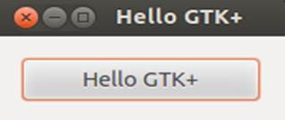
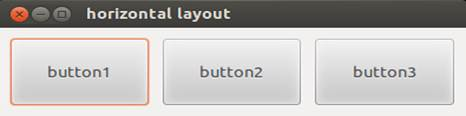
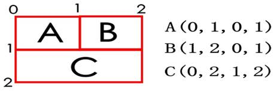
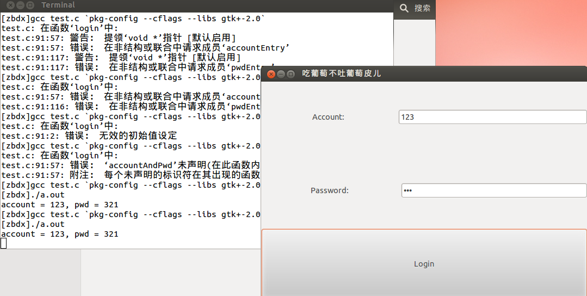

```c
#include <gtk/gtk.h>
//头文件〈gtk/gtk.h> 包括了GTK+中所有的控件、变量、函数和结构的声明。

int main(int argc, char  *argv[])
{
	//gtk环境初始化,必须在控件定义之前使用，参数由命令行中解析出来并且送到该程序中。
	gtk_init(&argc,&argv);
	//创建一个窗口
	GtkWidget* window = gtk_window_new(GTK_WINDOW_TOPLEVEL);
    	//GTK_WINDOW_TOPLEVEL指明窗口的类型为最上层的主窗口，它最常用。
    
	//绑定关闭窗口信号事件
	g_signal_connect(window, "destroy", G_CALLBACK(gtk_main_quit), NULL);
	//设置窗口标题
	gtk_window_set_title(GTK_WINDOW(window), "吃葡萄不吐葡萄皮儿");
	//设置窗口最小大小
	gtk_widget_set_size_request(GTK_WIDGET(window), 1000, 600);
	//设置窗口为可拉伸
	gtk_window_set_resizable(GTK_WINDOW(window), TRUE);
	//设置窗口在屏幕位置
	gtk_window_set_position(GTK_WINDOW(window), GTK_WIN_POS_CENTER_ALWAYS);

	//主事件循环
	gtk_main();
	return 0;
}
```


## 1.	窗口的详细配置

### 1.1	创建窗口

```c
GtkWidget *gtk_window_new(GtkWindowType type);
	/*GtkWindowType是一个枚举，有两种情况：
	GTK_WINDOW_TOPLEVEL：有边框，指明窗口的类型为最上层的主窗口，它最常用
	GTK_WINDOW_POPUP：   没边框*/
```


### 1.2	窗口在显示器位置的设置

```c
void gtk_window_set_position(
			GtkWindow *window,
			GtkWindowPosition position);
	/*position常用有4种情况：
	GTK_WIN_POS_NONE：  不固定
	GTK_WIN_POS_CENTER: 居中
	GTK_WIN_POS_MOUSE:  出现在鼠标位置
	GTK_WIN_POS_CENTER_ALWAYS: 窗口总是居中 */
```

### 1.3	设置窗口边框宽度

```c
void gtk_container_set_border_width(GTK_CONTAINER(window), 10);       // 设置窗口边框的宽度
```


## 2.	控件

1、**控件是对数据和方法的封装**。控件有自己的属性和方法。属性是指控件的特征。方法是指控件的一些简单而可见的功能。

2、**控件的分类：容器控件，非容器控件**。

容器控件：它可以容纳别的控件。容器控件分为两类，一类只能容纳一个控件，如窗口，按钮；另一类能容纳多个控件，如布局控件。

非容器控件：它不可以容纳别的控件，如标签、行编辑。


### 2.1	创建带文本内容的按钮



```c
GtkWidget *gtk_button_new_with_label(const gchar *label );
```


### 2.2	获得按钮上面的文本内容

```c
const gchar *gtk_button_get_label(GtkButton *button );
```


### 2.3	把控件添加到窗口容器里

```c
void gtk_container_add(GtkContainer*container,GtkWidget*widget);
//container：容纳控件的容器；widget：要添加的控件
```


```c
//创建一个带内容的按钮
GtkWidget* btn = gtk_button_new_with_label("这是一个按钮");
//将按钮添加到窗口
gtk_container_add(GTK_CONTAINER(window), btn);
//展示窗口内全部组件
gtk_widget_show_all(window);
```


### 2.4	将标签添加到容器中

```c
GtkWidget* label = gtk_label_new("Label1");
gtk_container_add(GTK_CONTAINER(button), label);
gtk_container_add(GTK_CONTAINER(hbox), button); 	// 按钮添加到布局容器里
```


## 3.	信号与回调函数机制

GTK+采用了信号与回调函数来处理窗口外部传来的事件、消息或信号。

当信号发生时，程序自动调用为信号连接的回调函数。

**窗口关闭时触发的常用信号：destroy, delete-event**

**操作按钮触发的常用信号：clicked, pressed，released**


**回调函数的定义**

void callback( GtkButton *button,  gpointer user_data );

​    button： 信号的发出者

​    user_data：传给回调函数的数据

```c
//为btn绑定点击事件
g_signal_connect(btn, "clicked", G_CALLBACK(printBtn), "Rock'n roll");
	/*
	gulong g_signal_connect( 
  		gpointer instance,
			const gchar *detailed_signal,
			GCallback c_handler,
			gpointer data );

	instance：       信号的发出者
	detailed_signal：  要连接信号的名称
	c_handler：      回调函数的名称，需要用G_CALLBACK()进行转换
	data：			传递给回调函数的参数
	*/

void printBtn(GtkWidget* btn, const char* str)
{
	g_print("str = %s\n", str);
}
```

​	

## 4.	布局

布局：设定控件在整个窗口中的位置和尺寸

**常用的布局方式**

水平布局 GtkHBox

垂直布局 GtkVBox

表格布局 GtkTable

固定布局 GtkFixed


### 4.1	水平布局GtkHBox



```c
GtkWidget* gtk_hbox_new(gboolean homogeneous, gint spacing);                       
    //homogeneous：容器内控件是否均衡排放(大小一致)
    //spacing：  控件之间的间隔
```


### 4.2	垂直布局GtkVBox

垂直布局容器的操作和水平布局的操作几乎是一样

```c
//创建垂直布局容器
gtk_vbox_new()

//标签的创建
GtkWidget *gtk_label_new(const gchar *str);

//设置标签的内容
void gtk_label_set_text(GtkLabel *label, const gchar *str);

//获得标签的内容
const gchar *gtk_label_get_label(GtkLabel *label );
```


### 4.3	表格布局GtkTable

```c
//创建表格布局容器
GtkWidget* gtk_table_new(guint rows, guint columns, gboolean homogeneous );
	/*rows:行数
	coumns:列数
	homogeneous：容器内表格的大小是否一致(均匀排布)*/
```

```c
//添加控件到布局容器中
void gtk_table_attach_defaults(
GtkTable *table, 
GtkWidget *widget,
guint left_attach,
guint right_attach,
guint top_attach,
guint bottom_attach );

    /*table:  要容纳控件的容器 
    widget: 被容纳控件
    后四个参数为控件摆放的坐标，规则如下：*/
```



创建一个2x2的表格布局：

```c
GtkWidget * table = gtk_table_new(2, 2, TRUE);
// 把容器放入窗口
gtk_container_add(GTK_CONTAINER(window), table); 

// button1
GtkWidget *button = gtk_button_new_with_label("Button1");
g_signal_connect(button, "clicked", G_CALLBACK(printBtn), (gpointer)(gtk_button_get_label(GTK_BUTTON(button))));
gtk_table_attach_defaults(GTK_TABLE(table), button, 0, 1, 0, 1);
// button2
button = gtk_button_new_with_label("button2");
g_signal_connect(button, "clicked", G_CALLBACK(printBtn), (gpointer)(gtk_button_get_label(GTK_BUTTON(button))));
gtk_table_attach_defaults(GTK_TABLE(table), button, 1, 2, 0, 1);
// button3
button = gtk_button_new_with_label("button3");
g_signal_connect(button, "clicked", G_CALLBACK(printBtn), (gpointer)(gtk_button_get_label(GTK_BUTTON(button))));
gtk_table_attach_defaults(GTK_TABLE(table), button, 0, 1, 1, 2);
//button4
button = gtk_button_new_with_label("button4");
g_signal_connect(button, "clicked", G_CALLBACK(printBtn), (gpointer)(gtk_button_get_label(GTK_BUTTON(button))));
gtk_table_attach_defaults(GTK_TABLE(table), button, 1, 2, 1, 2);

void printBtn(GtkWidget* btn, const gchar* str)
{
	g_print("%s is Clicked\n", str);
}
```


### 4.4	固定布局GtkFixed

```c
//创建固定布局容器
GtkWidget *gtk_fixed_new(void);
//添加控件到容器中
void gtk_fixed_put(GtkFixed *fixed, GtkWidget *widget, gint x, gint y );
	//fixed：要容纳控件的容器；widget：被容纳控件
	//x，y： 控件摆放位置的起点坐标
```

```c
GtkWidget* fixed = gtk_fixed_new();
// 把容器放入窗口
gtk_container_add(GTK_CONTAINER(window), fixed); 

//Button1
GtkWidget *button = gtk_button_new_with_label("Button1");
gtk_fixed_put(GTK_FIXED(fixed), button, 100, 100);
//Button2
button = gtk_button_new_with_label("Button2");
gtk_fixed_put(GTK_FIXED(fixed), button, 200, 200);
//Button3
button = gtk_button_new_with_label("Button3");
gtk_fixed_put(GTK_FIXED(fixed), button, 300, 300);
```


## 5.	行编辑(文本框)

### 5.1	常用函数

```c
//行编辑的创建
GtkWidget *gtk_entry_new(void);

//显示模式(FALSE为密码模式)
void gtk_entry_set_visibility(GtkEntry *entry, gboolean visible );

// 设置行编辑显示最大字符的长度
void gtk_entry_set_max_length(GtkEntry *entry, gint maxLength);    

//获得文本内容
const gchar *gtk_entry_get_text(GtkEntry *entry );

//设置行编辑的内容
void gtk_entry_set_text(GtkEntry *entry, const gchar *text);

//常用信号 
activate，按回车键触发
```


```c
typedef struct accountAndPwd
{
	GtkWidget* accountEntry;
	GtkWidget* pwdEntry;
}AccountAndPwd;

GtkWidget* vbox = gtk_vbox_new(TRUE, 5);//创建均匀摆放，间隔为5的垂直布局
gtk_container_add(GTK_CONTAINER(window), vbox);//将垂直布局加入Window

GtkWidget* hbox = gtk_hbox_new(FALSE, 5);//创建不均匀排布，间隔为5的水平布局
gtk_container_add(GTK_CONTAINER(vbox), hbox);

GtkWidget* label = gtk_label_new("Account:");
GtkWidget* accountEntry = gtk_entry_new();//创建行编辑，用于输入账号
gtk_entry_set_visibility(GTK_ENTRY(accountEntry), TRUE);//明文输入
gtk_entry_set_max_length(GTK_ENTRY(accountEntry), 10);//设置最大输入长度为10
gtk_container_add(GTK_CONTAINER(hbox), label);
gtk_container_add(GTK_CONTAINER(hbox), accountEntry);

hbox = gtk_hbox_new(FALSE, 5);
gtk_container_add(GTK_CONTAINER(vbox), hbox);

label = gtk_label_new("Password:");
GtkWidget* pwdEntry = gtk_entry_new();//创建行编辑，用于输入密码
gtk_entry_set_visibility(GTK_ENTRY(pwdEntry), FALSE);//密文输入
gtk_entry_set_max_length(GTK_ENTRY(accountEntry), 10);//设置最大输入长度为10
gtk_container_add(GTK_CONTAINER(hbox), label);
gtk_container_add(GTK_CONTAINER(hbox), pwdEntry);

GtkWidget* loginBtn = gtk_button_new_with_label("Login");
AccountAndPwd aap = {accountEntry, pwdEntry};
g_signal_connect(loginBtn, "clicked", G_CALLBACK(login), &aap);
gtk_container_add(GTK_CONTAINER(vbox), loginBtn);

void login(GtkWidget* btn, gpointer accountAndPwd)
{
	g_print("account = %s, pwd = %s\n", 
		gtk_entry_get_text(GTK_ENTRY(((AccountAndPwd*)accountAndPwd)->accountEntry)),
		 gtk_entry_get_text(GTK_ENTRY(((AccountAndPwd*)accountAndPwd)->pwdEntry)));
}
```



