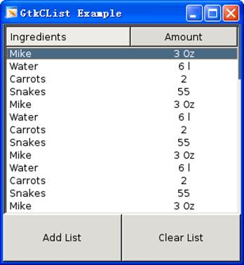

## 1.	按钮GtkButton

### 1.1	创建带图标的按钮

```c
void gtk_button_set_image(GtkButton *button, GtkWidget *image);
//image：通过gtk_image_new_from_file()来创建，参数为图片的路径

GtkWidget *image = gtk_image_new_from_file("1.png"); // 图像控件
gtk_button_set_image(GTK_BUTTON(button), image);
```


### 1.2	设置按钮为透明背景色

```c
void gtk_button_set_relief(GtkButton *button, GtkReliefStyle newstyle);
//newstyle： GTK_RELIEF_NONE为透明
gtk_button_set_relief(loginBtn, GTK_RELIEF_NONE);
```


### 1.3	按钮使能设置

```c
// 按钮使能设置，默认为使能TRUE，非使能FALSE
gtk_widget_set_sensitive(button, FALSE);
```


## 2.	图片资源对象GdkPixbuf

### 2.1	基本函数

```c
//创建图片资源对象
GdkPixbuf *gdk_pixbuf_new_from_file(const gchar *filename, GError **error);
	//filename：图片路径；error: 储存错误的指针

//设置图片大小
GdkPixbuf *gdk_pixbuf_scale_simple(const GdkPixbuf *src, int dest_width, 
	int dest_height, GdkInterpType interp_type);
	//interp_type：是一个枚举变量，标志图片的加载速度和质量，常用GDK_INTERP_BILINEAR

//释放资源
void g_object_unref(GtkObject *object);
```


### 2.2	图片控件GtkImage

#### 2.2.1	基本函数

```c
//通过图片资源对象创建图片控件
GtkWidget *gtk_image_new_from_pixbuf(GdkPixbuf *pixbuf );

//图片控件重新设置图片资源对象
void gtk_image_set_froma_pixbuf(GtkImage *image, GdkPixbuf *pixbuf );

//清除控件里的图像数据
void gtk_image_clear(GtkImage *image);
```

#### 2.2.2	示例

```c
#include <gtk/gtk.h>

typedef struct _Window
{
	GtkWidget *main_window;
	GtkWidget *table;
	GtkWidget *image;
	GtkWidget *button_previous;
	GtkWidget *button_next;
}WINDOW;

// 给创建好的image重新设计一张图片
void load_image(GtkWidget *image, const char *file_path, const int w, const int h )
{
	gtk_image_clear( GTK_IMAGE(image) );        // 清除图像
	GdkPixbuf *src_pixbuf = gdk_pixbuf_new_from_file(file_path, NULL);	// 创建图片资源
	GdkPixbuf *dest_pixbuf = gdk_pixbuf_scale_simple(src_pixbuf, w, h, GDK_INTERP_BILINEAR); // 指定大小
	gtk_image_set_from_pixbuf(GTK_IMAGE(image), dest_pixbuf); // 图片控件重新设置一张图片(pixbuf)
	g_object_unref(src_pixbuf);		// 释放资源
	g_object_unref(dest_pixbuf);	// 释放资源
}

// 根据图片路径创建一个新按钮，同时指定图片大小
GtkWidget *create_button_from_file(const char *file_path, const int w, const int h)
{
	GtkWidget *temp_image = gtk_image_new_from_pixbuf(NULL);
	load_image(temp_image, file_path, w, h);
	
	GtkWidget *button = gtk_button_new(); 					// 先创建空按钮
	gtk_button_set_image(GTK_BUTTON(button), temp_image);	// 给按钮设置图标
	gtk_button_set_relief(GTK_BUTTON(button), GTK_RELIEF_NONE);	// 按钮背景色透明
	
	return button;
}

// 按钮的回调函数
void deal_switch_image(GtkWidget *button, gpointer data)
{
	WINDOW *p_temp = (WINDOW *)data;
	
	if(button == p_temp->button_previous){		// 上一张
		printf("p_temp->button_previous\n");
	}else if(button == p_temp->button_next ){	// 下一张
		printf("p_temp->button_next\n");
	}
}

void window_demo(gpointer data)
{
	WINDOW *p_temp = (WINDOW *)data;
	
	// 主窗口
	p_temp->main_window = gtk_window_new(GTK_WINDOW_TOPLEVEL);		 	// 创建主窗口
	gtk_window_set_title(GTK_WINDOW(p_temp->main_window), "image");	 	// 设置窗口标题
	gtk_window_set_position(GTK_WINDOW(p_temp->main_window), GTK_WIN_POS_CENTER); // 设置窗口在显示器中的位置为居中
	gtk_widget_set_size_request(p_temp->main_window, 800, 480);		 	// 设置窗口的最小大小
	gtk_window_set_resizable(GTK_WINDOW(p_temp->main_window), FALSE); 	// 固定窗口的大小
	g_signal_connect(p_temp->main_window, "destroy", G_CALLBACK(gtk_main_quit), NULL); 
	
	// 表格布局
	p_temp->table = gtk_table_new(7, 7, TRUE);	 					      // 表格布局容器
	gtk_container_add(GTK_CONTAINER(p_temp->main_window), p_temp->table); // 容器加入窗口
	
	// 图片控件
	p_temp->image = gtk_image_new_from_pixbuf(NULL);		// 创建图片控件
	load_image(p_temp->image, "./image/1.jpg", 500, 450);
	gtk_table_attach_defaults(GTK_TABLE(p_temp->table), p_temp->image, 1, 6, 1, 6);	// 把图片控件加入布局

	
	// 按钮
	p_temp->button_previous = create_button_from_file("./image/previous.bmp", 80, 80);
	gtk_table_attach_defaults(GTK_TABLE(p_temp->table), p_temp->button_previous, 1, 2, 6, 7);
	g_signal_connect(p_temp->button_previous, "clicked", G_CALLBACK(deal_switch_image), p_temp);
	
	p_temp->button_next = create_button_from_file("./image/next.bmp", 80, 80);
	gtk_table_attach_defaults(GTK_TABLE(p_temp->table), p_temp->button_next, 5, 6, 6, 7);
	g_signal_connect(p_temp->button_next, "clicked", G_CALLBACK(deal_switch_image), p_temp);
	
	gtk_widget_show_all(p_temp->main_window);
	
}

int main(int argc, char *argv[])
{
	gtk_init(&argc, &argv);		// 初始化
	
	WINDOW window;
	window_demo(&window);

	gtk_main();			// 主事件循环

	return 0;
}
```


## 3.	进度条GtkProgressBar

### 3.1	基本函数

```c
//进度条的创建
GtkWidget *gtk_progress_bar_new(void);

//设置进度条显示的百分比
void gtk_progress_bar_set_fraction(GtkProgressBar *pbar, gdouble fraction);
	//fraction：0.0到1.0

//设置滑槽上的文本显示
void gtk_progress_bar_set_text(GtkProgressBar *pbar, gchar *text);

//设置进度条的移动方向
void gtk_progress_bar_set_orientation(GtkProgressBar *pbar, GtkProgressBarOrientation orientation);
	/*GTK_PROGRESS_LEFT_TO_RIGHT：从左向右 
      GTK_PROGRESS_RIGHT_TO_LEFT：从右向左 
      GTK_PROGRESS_BOTTOM_TO_TOP：从下向上 
      GTK_PROGRESS_TOP_TO_BOTTOM：从上向下*/
```

### 3.2	示例

```c
#include <gtk/gtk.h>
#include <string.h>

// 回调函数，切换进度条的移动方向 
void toggle_orientation(GtkWidget *widget, gpointer data) 
{ 
	// gtk_progress_bar_get_orientation: 获得进度条当前移动的方向
	switch( gtk_progress_bar_get_orientation( GTK_PROGRESS_BAR(data) ) ){ 
	case GTK_PROGRESS_LEFT_TO_RIGHT: 
		gtk_progress_bar_set_orientation(GTK_PROGRESS_BAR(data), GTK_PROGRESS_RIGHT_TO_LEFT); 
		break; 
	case GTK_PROGRESS_RIGHT_TO_LEFT: 
		gtk_progress_bar_set_orientation(GTK_PROGRESS_BAR(data), GTK_PROGRESS_LEFT_TO_RIGHT); 
		break; 
	default: // 什么也不做 
		break;
	} 
} 

// 更新进度条，这样就能够看到进度条的移动
void callback(GtkWidget *widget, gpointer data)
{
	// 在原来值基础上增加 0.05
	gdouble new_val = gtk_progress_bar_get_fraction( GTK_PROGRESS_BAR(data) ) + 0.05; 
	   
	if(new_val > 1.0){	// 越界处理
		new_val = 0.0; 
	}
	   
	// 设置进度条的新值 
	gtk_progress_bar_set_fraction(GTK_PROGRESS_BAR(data), new_val); 
}

int main(int argc, char *argv[])
{
	gtk_init(&argc, &argv);		// 初始化

	GtkWidget *window = gtk_window_new(GTK_WINDOW_TOPLEVEL);		// 创建主窗口
	gtk_window_set_title(GTK_WINDOW(window), "GtkProgressBar");		// 设置窗口标题
	gtk_container_set_border_width(GTK_CONTAINER(window), 10);		// 设置边框宽度
	// 设置窗口在显示器中的位置为居中
    gtk_window_set_position(GTK_WINDOW(window), GTK_WIN_POS_CENTER);
	// 设置窗口的最小大小
	gtk_widget_set_size_request(window, 300, 200);
	// 窗口关联 destroy 信号 到 gtk_main_quit
	g_signal_connect(G_OBJECT(window), "destroy", G_CALLBACK(gtk_main_quit), NULL);

	GtkWidget *vbox = gtk_vbox_new(FALSE, 5);		 // 垂直布局容器
	gtk_container_add(GTK_CONTAINER(window), vbox);  // 容器加入窗口
	
	// 创建一个进度条
	GtkWidget *progress = gtk_progress_bar_new();
	gtk_container_add(GTK_CONTAINER(vbox), progress);  // 加入垂直布局容器
	// 设置进度条显示的百分比：50%
	gtk_progress_bar_set_fraction(GTK_PROGRESS_BAR(progress), 0.5 ); 
	// 设置在进度条的滑槽上的文本显示 
	gtk_progress_bar_set_text(GTK_PROGRESS_BAR(progress), "some text");
	
	// 添加一个按钮，切换移动方向  
    GtkWidget *button_orientation = gtk_button_new_with_label("Right to Left"); 
	g_signal_connect(button_orientation, "clicked", G_CALLBACK(toggle_orientation), progress); // connect
	gtk_container_add(GTK_CONTAINER(vbox), button_orientation);  // 加入垂直布局容器
	
	// 增加进度条进度按钮
	GtkWidget *button = gtk_button_new_with_label("add");
	g_signal_connect(button, "clicked", G_CALLBACK(callback), progress); // connect
	gtk_container_add(GTK_CONTAINER(vbox), button);  // 加入垂直布局容器
	
	gtk_widget_show_all(window);

	gtk_main();			// 主事件循环

	return 0;
}
```


## 4.	滚动窗口GtkScrolledWindow

### 4.1	基本函数

```c
//创建滚动窗口
GtkWidget *gtk_scrolled_window_new(GtkAdjustment *hadjustment, GtkAdjustment *vadjustment );
	//第一个参数是水平方向的调整对象，第二个参数是垂直方向的调整对象。它们一般都设置为NULL。

//滚动窗口添加控件
void gtk_scrolled_window_add_with_viewport(GtkScrolledWindow *scrolled_window, GtkWidget *child );

//设置滚动条出现的方式(水平或垂直方向)
void gtk_scrolled_window_set_policy(GtkScrolledWindow *scrolled_window, 
                                    GtkPolicyType hscrollbar_policy, 
								GtkPolicyType vscrollbar_policy );
	/*GTK_POLICY_AUTOMATIC：滚动条根据需要自动出现
	GTK_POLICY_ALWAYS：   滚动条总是出现
  	GTK_POLICY_NEVER：    不需要滚动条*/
```


### 4.2	示例

```c
/* 创建一个新的滚动窗口。
	 * 第一个参数是水平方向的调整对象，第二个参数是垂直方向的调整对象。它们总是设置为NULL。
	 */
    GtkWidget *scrolled_window = gtk_scrolled_window_new(NULL, NULL); 
    gtk_container_set_border_width(GTK_CONTAINER(scrolled_window), 10); 
	gtk_container_add(GTK_CONTAINER(window), scrolled_window); // 滚动窗口放入窗口
     
    /* 滚动条的出现方式可以是 GTK_POLICY_AUTOMATIC 或GTK_POLICY_ALWAYS。 
     * GTK_POLICY_AUTOMATIC：将自动决定是否需要出现滚动条 
     * GTK_POLICY_AUTOMATIC：将自动决定是否需要出现滚动条 
     * 第一个是设置水平滚动条，第二个是垂直滚动条 
	 */ 
    gtk_scrolled_window_set_policy(GTK_SCROLLED_WINDOW(scrolled_window), 
                     GTK_POLICY_AUTOMATIC, GTK_POLICY_AUTOMATIC); 
	
	// 标签
	GtkWidget *label = gtk_label_new("This is an example of a line-wrapped label. It "\
	   "should not be taking up the entire "\
       "width allocated to it, but automatically "\
       "wraps the words to fit.  "\
       "The time has come, for all good men, to come to "\
       "the aid of their party. "\
       "The sixth sheik's six sheep's sick.\n"\
       "     It supports multiple paragraphs correctly, "\
       "and correctly adds "\
       "many extra  spaces."\
	   "This is an example of a line-wrapped label. It "\
	   "should not be taking up the entire "\
       "width allocated to it, but automatically "\
       "wraps the words to fit.  "\
       "The time has come, for all good men, to come to "\
       "the aid of their party. "\
       "The sixth sheik's six sheep's sick.\n"\
       "     It supports multiple paragraphs correctly, "\
       "and correctly adds "\
       "many extra  spaces."); 
    gtk_label_set_line_wrap(GTK_LABEL(label), TRUE); 	// label 自动换行
	
    // 将标签组装到滚动窗口中 
    gtk_scrolled_window_add_with_viewport(GTK_SCROLLED_WINDOW(scrolled_window), label); 
```


## 5.	分栏列表控件GtkCList

### 5.1	基本函数

```c
//创建列表
GtkWidget *gtk_clist_new_with_titles(gint columns, gchar *titles[]);
	/*columns：列数
	titles： 标题，指针数目应该与列数相等*/

//设置某一列的宽度
void gtk_clist_set_column_width(GtkCList *clist, gint column, gint width);

//设置某列内容显示的对齐方式
void gtk_clist_set_column_justification(GtkCList *clist, gint column,
                                        GtkJustification justification);
	/*GTK_JUSTIFY_LEFT：  左对齐。
	GTK_JUSTIFY_RIGHT： 右对齐。
	GTK_JUSTIFY_CENTER：居中对齐。
	GTK_JUSTIFY_FILL：  填充*/

//向列表中添加行
gint gtk_clist_append(GtkCList *clist, gchar *text[] );

//删除列表中所有的行
void gtk_clist_clear(GtkCList *clist);

//获取某一行某一列的内容
gint gtk_clist_get_text(GtkCList *clist, gint row, gint column, gchar **text );

//常用信号
select-row：选中某一行触发
```


### 5.2	示例



```c
#include <gtk/gtk.h>

// 用户点击"Add List"按钮时的回调函数
void button_add_clicked( GtkWidget *widget, gpointer data )
{
	char *a[2] = {"Mike",  "3 Oz"};
	gtk_clist_append( (GtkCList *)data, a );

	char *b[2] = { "Water",   "6 l" };
	gtk_clist_append( (GtkCList *)data, b );
}

//用户点击"Clear List"  按钮时的回调函数
void button_clear_clicked( GtkWidget *widget, gpointer data )
{
	/* 用gtk_clist_clear函数清除列表。比用
	 * gtk_clist_remove函数逐行清除要快
	 */
	gtk_clist_clear( (GtkCList *)data );
}

// 用户选中某一行时的回调函数
void selection_made( GtkWidget *clist, gint row, gint column,
					GdkEventButton *event, gpointer data )
{
	gtk_widget_queue_draw(clist);	// 人为更新列表，开发板有效
	
	gchar *text;
	
	/* 取得存储在被选中的行和列的单元格上的文本
	 * 当鼠标点击时，我们用text参数接收一个指针
	 */
	gtk_clist_get_text(GTK_CLIST(clist), row, column, &text);
	//打印一些关于选中了哪一行的信息
	g_print("第%d行，第%d列的内容为%s\n", row, column, text);
}

int main( int argc, gchar *argv[] )
{                                  
	gtk_init(&argc, &argv);					// 初始化
	
	// 主窗口
	GtkWidget *window = gtk_window_new(GTK_WINDOW_TOPLEVEL);	// 创建窗口
	gtk_widget_set_size_request(GTK_WIDGET(window), 300, 300);	// 设置最小大小
	gtk_window_set_title(GTK_WINDOW(window), "GtkCList Example");	// 设置标题
	gtk_window_set_resizable(GTK_WINDOW(window), FALSE); 			// 固定窗口大小
	g_signal_connect(window, "destroy", G_CALLBACK(gtk_main_quit),  NULL);
	
	// 表格布局容器
	GtkWidget *table = gtk_table_new(5, 2, TRUE);
	gtk_container_add(GTK_CONTAINER(window), table);

	/* 创建一个滚动窗口构件，将GtkCList组装到里面。
	 * 这样使得内容超出列表时，可以用滚动条浏览
	 * 第一个参数是水平方向的调整对象，第二个参数是垂直方向的调整对象。它们总是设置为NULL。
	 */
	GtkWidget *scrolled_window = gtk_scrolled_window_new(NULL, NULL);
	gtk_table_attach_defaults(GTK_TABLE(table), scrolled_window, 0, 2, 0, 4);// 把按钮加入布局
	
	// GTK_POLICY_AUTOMATIC：滚动条根据需要自动出现时
	gtk_scrolled_window_set_policy(GTK_SCROLLED_WINDOW(scrolled_window),
					GTK_POLICY_AUTOMATIC, GTK_POLICY_AUTOMATIC);
	

	gchar *titles[2] = { "Ingredients", "Amount" };
	// 创建GtkCList构件。本例中，我们使用了两列
	GtkWidget *clist = gtk_clist_new_with_titles(2, titles);
	// 将GtkCList构件添加到滚动窗口构件中
	gtk_scrolled_window_add_with_viewport(GTK_SCROLLED_WINDOW(scrolled_window), clist); 
	
	/* 设置某列内容显示的对齐方式
	 * GTK_JUSTIFY_LEFT：  列中的文本左对齐。
	 * GTK_JUSTIFY_RIGHT： 列中的文本右对齐。
	 * GTK_JUSTIFY_CENTER：列中的文本居中对齐。
	 * GTK_JUSTIFY_FILL：  文本使用列中所有可用的空间
	 */
	gtk_clist_set_column_justification(GTK_CLIST(clist), 1, GTK_JUSTIFY_CENTER);
	 
	/* 很重要的一点，我们设置列宽，让文本能容纳在列中。
	 * 注意，列编号是从0开始的, 本例中是0和1
	 */
	gtk_clist_set_column_width(GTK_CLIST(clist), 0, 150);
	
	// 选择某一行时触发selection_made回调函数
	g_signal_connect(clist, "select-row", G_CALLBACK(selection_made), NULL);
	
	
	// 按钮的创建，并放进布局容器里
	GtkWidget *button_add = gtk_button_new_with_label("Add List");
	GtkWidget *button_clear = gtk_button_new_with_label("Clear List");
	gtk_table_attach_defaults(GTK_TABLE(table), button_add, 0, 1, 4, 5);// 把按钮加入布局
	gtk_table_attach_defaults(GTK_TABLE(table), button_clear, 1, 2, 4, 5);// 把按钮加入布局
	
	// 为按钮的点击设置回调函数
	g_signal_connect(button_add, "clicked", G_CALLBACK(button_add_clicked), (gpointer)clist);
	g_signal_connect(button_clear, "clicked", G_CALLBACK(button_clear_clicked), (gpointer)clist);
				  gtk_clist_set_row_style(clist,2,NULL);
	/* 界面已经完全设置好了，下面可以显示窗口，
	 * 进入gtk_main主循环
	 */
	gtk_widget_show_all(window);
	
	gtk_main();

	return 0;
}
```

