# 1.	监督学习Supervised Learning

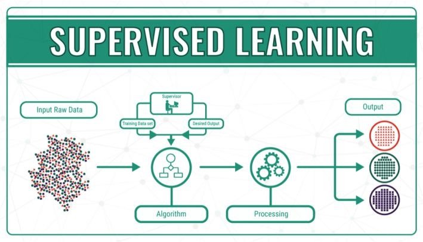

监督学习的关键特征在于**给予学习算法示例**，即**Learns from being given "right answers**"

> 监督学习是指：利用一组已知类别的样本调整[分类器](https://baike.baidu.com/item/分类器/3317404?fromModule=lemma_inlink)的[参数](https://baike.baidu.com/item/参数/5934974?fromModule=lemma_inlink)，使其达到所要求性能的过程
>
> 监督学习是从标记的训练数据来推断一个功能的机器学习任务
>
> 监督学习是学习函数的机器学习任务，该函数基于示例输入 – 输出对将输入映射到输出。它推断出一个函数标记的训练数据由一组训练样例组成。最佳方案将允许算法正确地确定看不见的实例的类标签。这要求学习算法以“合理”的方式**从训练数据推广到看不见的情况**。

监督学习有两大主要任务：

1. **回归Regression**：**预测连续的、具体的数值，即predict number**
2. **分类Classification**：**对各种事物分门别类，用于离散型预测，即predict class/category**，分类产生不同的**类Class**(或称**类别Category**)


## 1.1	回归Regression

### 1.1.1	线性回归Linear Regression

线性回归使用一条直线拟合数据

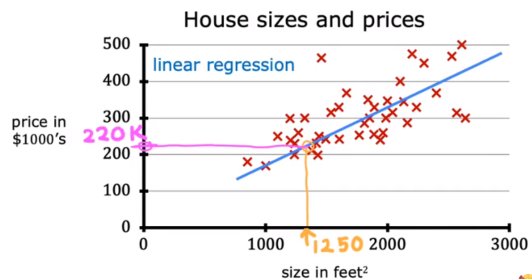

|               描述 |                             描述                             | Python对应变量 |
| -----------------: | :----------------------------------------------------------: | -------------: |
|                  𝑎 |                         标量，不加粗                         |                |
|                  𝐚 |                          向量，加粗                          |                |
|       **回归函数** |                                                              |                |
|                  𝐱 |          训练样例特征值(本实验中，单位为千平方英尺)          |      `x_train` |
|                  𝐲 |            训练样例目标值(本实验中，单位为千美元)            |      `y_train` |
| $𝑥^{(𝑖)}, 𝑦^{(𝑖)}$ |                       第$i$个训练样例                        |   `x_i`, `y_i` |
|                $m$ |                          训练样例数                          |            `m` |
|                $w$ |                      变量：$weight$权重                      |            `w` |
|                  𝑏 |                   变量：$bias$偏置项/偏差                    |            `b` |
| $𝑓_{𝑤,𝑏}(𝑥^{(i)})$ | 模型通过$w,b$参数化，对$x^{(i)}$的推演结果$𝑓_{𝑤,𝑏}(𝑥^{(𝑖)})=𝑤𝑥^{(𝑖)}+𝑏$ |         `f_wb` |

对回归函数$𝑓_{𝑤,𝑏}(𝑥^{(i)})$，其中只包含一个特征值$x$，对这样的回归函数，称为**单一线性回归Univariate Linear Regression**


### 1.1.2	成本函数Cost Function

为了找到更合适的$w,b$，使得拟合的回归函数预测值$y^{(i)}$更接近真实目标值$y^{(i)}$，首先要衡量函数与训练数据的拟合程度，为此引出成本函数Cost Function

在成本函数中，预测值与目标值之差称为**误差*Error***，即***Error*** $=\ \hat{y} - y$，成本函数数学表达如下：
$$
J(w,b) = \frac{1}{2m}\sum_{i=1}^m(\hat{y}^{(i)}-y^{(i)})^2
$$
其中$m$是训练样例数，上式也称为**平方误差成本函数*Squared Error Cost Function***，它最常用于线性回归

另外，由于$\hat{y} = 𝑓_{𝑤,𝑏}(𝑥^{(i)})$，因此上式也可写作：
$$
J(w,b) = \frac{1}{2m}\sum_{i=1}^m(𝑓_{𝑤,𝑏}(𝑥^{(i)})-y^{(i)})^2
$$
由于构建模型的目的是获得拟合程度更高的模型，因此其成本函数值应当尽可能小，即目标为最小代价函数：
$$
\mathop{minimize}\limits_{w,b}J(w,b)
$$
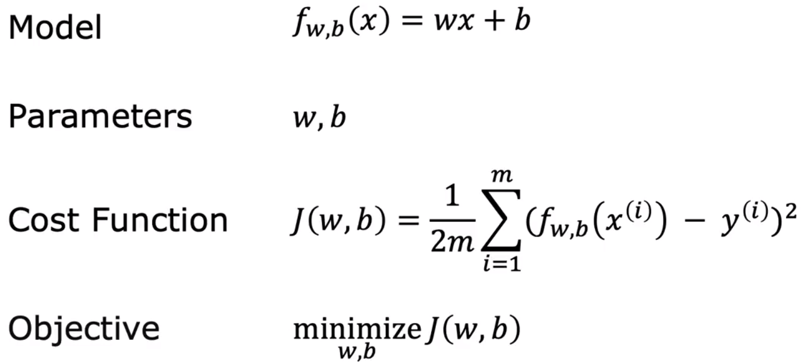

其代码实现如下：

```python
import numpy as np

#Function to calculate the cost
def compute_cost(x, y, w, b):
   
    m = x.shape[0] 
    cost = 0
    
    for i in range(m):
        f_wb = w * x[i] + b
        cost = cost + (f_wb - y[i])**2
    total_cost = 1 / (2 * m) * cost

    return total_cost
```


### 1.1.3	梯度下降Gradient Descent

为了高效找到更小的代价函数Cost Function，我们需要引入新的算法：**梯度下降Gradient Descent**

**梯度下降算法可用于最小化任何函数**

#### 1.1.3.1	思路

以成本函数$J(w,b)$为例，我们期望找到最小成本函数$\mathop{min}\limits_{w,b}J(w,b)$

- 起始，我们应有$w,b$初始值，此处假定$w=0,b=0$
- 接下来，不断改变$w,b$的值以减小成本函数$J(w,b)$
- 直到我们找到或接近最小值

减小成本函数$J(w,b)$的思路是：在每个阶段，寻找周围点中成本函数值最小的点，到循环结束，将找到一个局部最优解

多次尝试并比较局部最优解，可能找到全局最优解

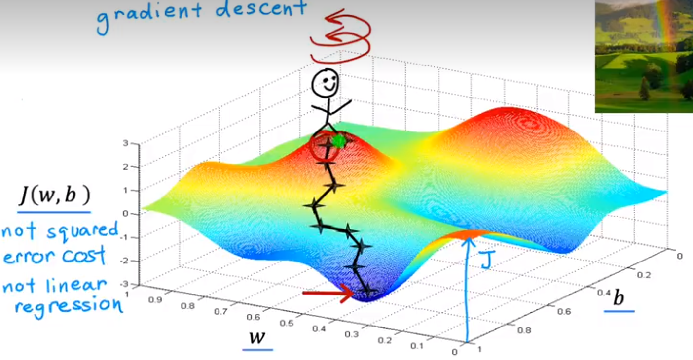

梯度下降数学表达如下：
$$
w\ =\ w-\alpha \frac{\partial{}}{\partial{w}}J(w,b),\\ 
b\ = \ b-\alpha \frac{\partial{}}{\partial{b}}J(w,b)
$$
其中$\alpha$是**学习率Learning rate**，它是一个介于0-1间的正数，控制更新模型参数(如$w,b$)时的步长，即表示梯度下降的程度大小

在每个阶段，我们需要同步更新$w,b$(Simultaneously update $w,b$)，要注意的是，在对应的代码实现中应写作：
$$
tmp\_w\ =\ w-\alpha \frac{\partial{}}{\partial{w}}J(w,b)\\ 
tmp\_b\ = \ b-\alpha \frac{\partial{}}{\partial{b}}J(w,b)\\
w\ =\ tmp\_w\\
b\ =\ tmp\_b
%这样才能保证计算b时，J(w,b)不变
$$
梯度下降代码实现如下：

```python
import numpy as np

def compute_gradient(x, y, w, b): 
    """
    Computes the gradient for linear regression 
    Args:
      x (ndarray (m,)): Data, m examples 
      y (ndarray (m,)): target values
      w,b (scalar)    : model parameters  
    Returns
      dj_dw (scalar): The gradient of the cost w.r.t. the parameters w
      dj_db (scalar): The gradient of the cost w.r.t. the parameter b     
     """
    
    # Number of training examples
    m = x.shape[0]    
    dj_dw = 0
    dj_db = 0
    
    for i in range(m):  
        f_wb = w * x[i] + b 
        dj_dw_i = (f_wb - y[i]) * x[i] 
        dj_db_i = f_wb - y[i] 
        dj_db += dj_db_i
        dj_dw += dj_dw_i 
    dj_dw = dj_dw / m 
    dj_db = dj_db / m 
        
    return dj_dw, dj_db


def gradient_descent(x, y, w_in, b_in, alpha, num_iters, cost_function, gradient_function): 
    """
    Performs gradient descent to fit w,b. Updates w,b by taking 
    num_iters gradient steps with learning rate alpha
    
    Args:
      x (ndarray (m,))  : Data, m examples 
      y (ndarray (m,))  : target values
      w_in,b_in (scalar): initial values of model parameters  
      alpha (float):     Learning rate
      num_iters (int):   number of iterations to run gradient descent
      cost_function:     function to call to produce cost
      gradient_function: function to call to produce gradient
      
    Returns:
      w (scalar): Updated value of parameter after running gradient descent
      b (scalar): Updated value of parameter after running gradient descent
      J_history (List): History of cost values
      p_history (list): History of parameters [w,b] 
      """
    
    w = copy.deepcopy(w_in) # avoid modifying global w_in
    # An array to store cost J and w's at each iteration primarily for graphing later
    J_history = []
    p_history = []
    b = b_in
    w = w_in
    
    for i in range(num_iters):
        # Calculate the gradient and update the parameters using gradient_function
        dj_dw, dj_db = gradient_function(x, y, w, b)     

        # Update Parameters using equation (3) above
        b = b - alpha * dj_db                            
        w = w - alpha * dj_dw                            

        # Save cost J at each iteration
        if i<100000:      # prevent resource exhaustion 
            J_history.append( cost_function(x, y, w, b))
            p_history.append([w,b])
        # Print cost every at intervals 10 times or as many iterations if < 10
        if i% math.ceil(num_iters/10) == 0:
            print(f"Iteration {i:4}: Cost {J_history[-1]:0.2e} ",
                  f"dj_dw: {dj_dw: 0.3e}, dj_db: {dj_db: 0.3e}  ",
                  f"w: {w: 0.3e}, b:{b: 0.5e}")
 
    return w, b, J_history, p_history #return w and J,w history for graphing
```


#### 1.1.3.2	学习率Learning rate

对成本函数$J(w)$进行梯度下降，其数学表达为$w\ = \ w-\alpha \frac{d}{dw}J(w)$，$\alpha$为其**学习率*Learning Rate***

若学习率$\alpha$取值过小，则梯度下降速度过慢，需要过多的计算阶段

若学习率$\alpha$取值过大，则梯度下降速度过快，可能会跳过最小值(**过冲*Overshoot***)，甚至梯度下降无法**收敛*Converge***，还可以会导致函数**发散*Diverge***

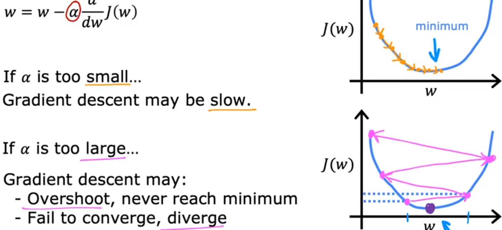

当学习率$\alpha$值固定时，由于我们每个阶段都在减小成本函数，因此其导数会越来越小，即每个阶段的更新步长越来越小，最终我们将找到一个局部最小值：

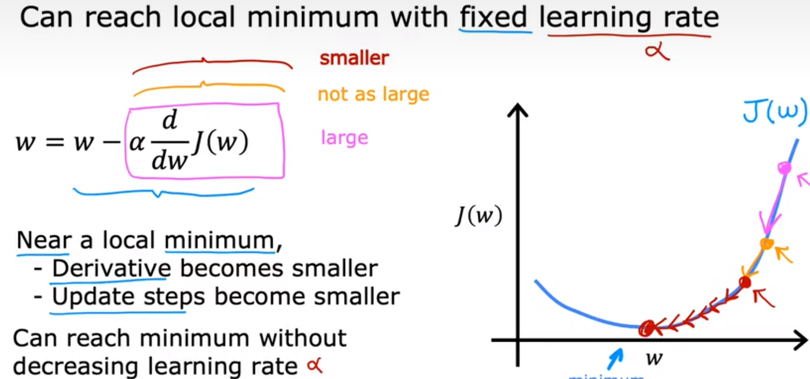

#### 1.1.3.3	线性回归的梯度下降算法——批量梯度下降

对线性回归模型Linear Regression Model$f_{w,b}(x)=wx+b$，有成本函数Cost function $J(w,b) = \frac{1}{2m}\sum_{i=1}^m(𝑓_{𝑤,𝑏}(𝑥^{(i)})-y^{(i)})^2$,其梯度下降算法Gradient Descent Algorithm为：
$$
w\ =\ w-\alpha \frac{\partial{}}{\partial{w}}J(w,b)\ =\ w-\alpha \frac{1}{m}\sum_{i=1}^m(𝑓_{𝑤,𝑏}(𝑥^{(i)})-y^{(i)})x^{(i)},\\ 
b\ = \ b-\alpha \frac{\partial{}}{\partial{b}}J(w,b)\ =\ b-\alpha\frac{1}{m}\sum_{i=1}^m(𝑓_{𝑤,𝑏}(𝑥^{(i)})-y^{(i)})
$$
在训练过程中，我们使用的梯度下降算法被称为**批量梯度下降*Batch Gradient Descent***，因为我们在每个梯度下降阶段中都使用了完整的训练数据集


### 1.1.4	多元线性回归Multiple Linear Regression

为了更准确地预测目标值$y$，我们可以引入多个特征$x$，记为$x_1,x_2,...,x_n$

因此我们使用$x_j$表示训练样例的第$j$个特征值，$n$表示特征数量，$\vec{x}^{(i)}$表示第$i$个训练样例的特征值，$x_j^{(i)}$表示第$i$个训练样例的第$j$个特征值：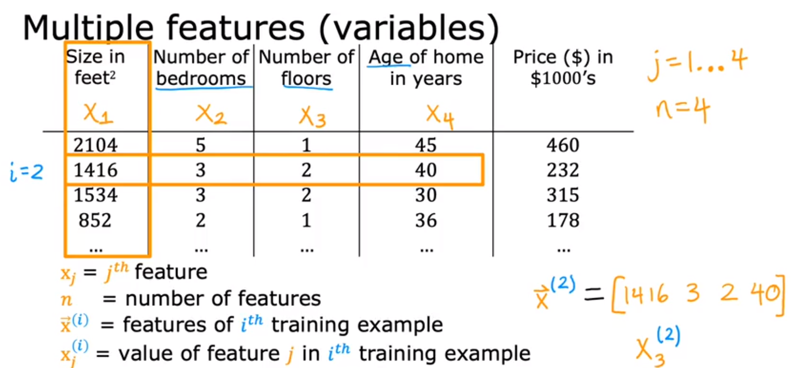

对之前的线性回归方程$f_{w,b}(x)=wx+b$，引入多元特征后有：
$$
f_{\vec{w},b}(\vec{x})=w_1x_1+w_2x_2+...+w_nx_n+b
$$
其中$\vec{w}=\left[ w_1,w_2,...,w_n \right],\vec{x}=\left[ x_1,x_2,...,x_n \right]$，因此可得：
$$
f_{\vec{w},b}(\vec{x})=\vec{w} \cdot \vec{x} + b=w_1x_1+w_2x_2+...+w_nx_n+b=(\sum_{j=1}^{n}{w_jx_j})+b
$$
其中$\vec{w} \cdot \vec{x}$表示向量$\vec{w}$ 与向量$\vec{x}$的**点积*Dot Product***，**点积要求两向量元素个数相同**


#### 1.1.4.1	向量化/矢量化Vectorization

矢量化能够**简化代码**，更好表达思想，并**加快运算速度**，对上述多元线性回归方程，其代码表述如下：

```python
import numpy as np

w = np.array([1, 2, 3])
b = 1
x = np.array([2, 3, 4])
f_wb = lambda w,x,b: np.dot(w,x) + b
```

矢量化之所以能加快运算速度，是因为它能使两向量中各元素间**并行运算*Parallel Computing***，而不是依次运算：

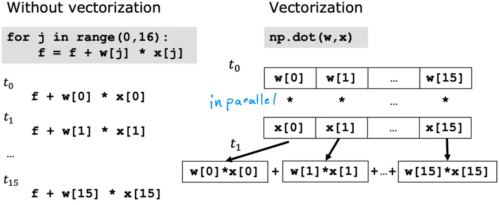

#### 1.1.4.2	多元线性回归的梯度下降算法

在一元线性回归的梯度下降算法中，有：
$$
w\ =\ w-\alpha \frac{\partial{}}{\partial{w}}J(w,b),\\ 
b\ = \ b-\alpha \frac{\partial{}}{\partial{w}}J(w,b),\\
J(w,b) = \frac{1}{2m}\sum_{i=1}^m(𝑓_{𝑤,𝑏}(𝑥^{(i)})-y^{(i)})^2
$$
对应的，在多元线性回归的梯度下降算法中，有：
$$
w_j\ =\ w_j-\alpha \frac{\partial{}}{\partial{w_j}}J(w_1,w_2,...,w_n,b),\\ 
b\ = \ b-\alpha \frac{\partial{}}{\partial{b}}J((w_1,w_2,...,w_n,b),\\
J(\vec{w},b) = f_{\vec{w},b}(\vec{x}) - y = \frac{1}{2m}[(\sum_{i=1}^{n}(w_ix_i)+b) - y]^2
$$
其中$m$为训练样例数，$n$为样例的特征数，将上式展开，得：
$$
w_1 = w_1 - \alpha \frac{1}{m} \sum_{i=1}^{m}(f_{\vec{w},b}(\vec{x}^{(i)})-y^{(i)})x_1^{(i)}\\
\vdots\\
w_n = w_n - \alpha \frac{1}{m} \sum_{i=1}^{m}(f_{\vec{w},b}(\vec{x}^{(i)})-y^{(i)})x_n^{(i)}\\
b = b - \alpha \frac{1}{m} \sum_{i=1}^{m}(f_{\vec{w},b}(\vec{x}^{(i)})-y^{(i)})\\
$$
由此可得，计算多元线性回归方程的成本函数代码实现如下：

```python
import numpy as np


def compute_cost(X, y, w, b): 
    """
    compute cost
    Args:
      X (ndarray (m,n)): Data, m examples with n features
      y (ndarray (m,)) : target values
      w (ndarray (n,)) : model parameters  
      b (scalar)       : model parameter
      
    Returns:
      cost (scalar): cost
    """
    m = X.shape[0]
    cost = 0.0
    for i in range(m):                                
        f_wb_i = np.dot(X[i], w) + b           #(n,)(n,) = scalar (see np.dot)
        cost = cost + (f_wb_i - y[i])**2       #scalar
    cost = cost / (2 * m)                      #scalar    
    return cost
```

而计算梯度的函数代码实现如下：

```python
import numpy as np


def compute_gradient(X, y, w, b): 
    """
    Computes the gradient for linear regression 
    Args:
      X (ndarray (m,n)): Data, m examples with n features
      y (ndarray (m,)) : target values
      w (ndarray (n,)) : model parameters  
      b (scalar)       : model parameter
      
    Returns:
      dj_dw (ndarray (n,)): The gradient of the cost w.r.t. the parameters w. 
      dj_db (scalar):       The gradient of the cost w.r.t. the parameter b. 
    """
    m,n = X.shape           #(number of examples, number of features)
    dj_dw = np.zeros((n,))
    dj_db = 0.

    for i in range(m):                             
        err = (np.dot(X[i], w) + b) - y[i]   
        for j in range(n):                         
            dj_dw[j] = dj_dw[j] + err * X[i, j]    
        dj_db = dj_db + err                        
    dj_dw = dj_dw / m                                
    dj_db = dj_db / m                                
        
    return dj_db, dj_dw
```

由此可得，多元线性回归的梯度下降算法代码实现如下：

```python
import numpy as np
import math, copy


def gradient_descent(X, y, w_in, b_in, cost_function, gradient_function, alpha, num_iters): 
    """
    Performs batch gradient descent to learn theta. Updates theta by taking 
    num_iters gradient steps with learning rate alpha
    
    Args:
      X (ndarray (m,n))   : Data, m examples with n features
      y (ndarray (m,))    : target values
      w_in (ndarray (n,)) : initial model parameters  
      b_in (scalar)       : initial model parameter
      cost_function       : function to compute cost
      gradient_function   : function to compute the gradient
      alpha (float)       : Learning rate
      num_iters (int)     : number of iterations to run gradient descent
      
    Returns:
      w (ndarray (n,)) : Updated values of parameters 
      b (scalar)       : Updated value of parameter 
      """
    
    # An array to store cost J and w's at each iteration primarily for graphing later
    J_history = []
    w = copy.deepcopy(w_in)  #avoid modifying global w within function
    b = b_in
    
    for i in range(num_iters):

        # Calculate the gradient and update the parameters
        dj_db,dj_dw = gradient_function(X, y, w, b)   ##None

        # Update Parameters using w, b, alpha and gradient
        w = w - alpha * dj_dw               ##None
        b = b - alpha * dj_db               ##None
      
        # Save cost J at each iteration
        if i<100000:      # prevent resource exhaustion 
            J_history.append( cost_function(X, y, w, b))

        # Print cost every at intervals 10 times or as many iterations if < 10
        if i% math.ceil(num_iters / 10) == 0:
            print(f"Iteration {i:4d}: Cost {J_history[-1]:8.2f}   ")
        
    return w, b, J_history #return final w,b and J history for graphing

'''Example Inputs

# initialize parameters
initial_w = np.zeros_like(w_init)
initial_b = 0.
# some gradient descent settings
iterations = 1000
alpha = 5.0e-7
# run gradient descent 
w_final, b_final, J_hist = gradient_descent(X_train, y_train, initial_w, initial_b,
                                                    compute_cost, compute_gradient, 
                                                    alpha, iterations)
print(f"b,w found by gradient descent: {b_final:0.2f},{w_final} ")
m,_ = X_train.shape
for i in range(m):
    print(f"prediction: {np.dot(X_train[i], w_final) + b_final:0.2f}, target value: {y_train[i]}")
'''
```


#### 1.1.4.3	正规方程Normal Equation

**正规方程*Normal Equation***同样是解决线性回归问题的函数，它有以下特点：

- **只能用于求解线性回归问题**
- 解得$w,b$而**无需迭代**

缺点：

- **不能推广**到其他学习算法
- 当**特征数量很大**$(>10,000)$**时计算速度很慢**

我们无需知道正规方程如何运算，只需知道当我们在调用机器学习库时，**在求解线性回归问题时，库函数有可能会使用这种方法**

### 

### 1.1.5	特征缩放Feature Scaling

面对特征数量较多的时候，保证这些特征具有相近的尺度（无量纲化），可以使梯度下降法更快的收敛。这两张图代表数据是否均一化的最优解寻解过程（左边是未归一化的，右边归一化后）

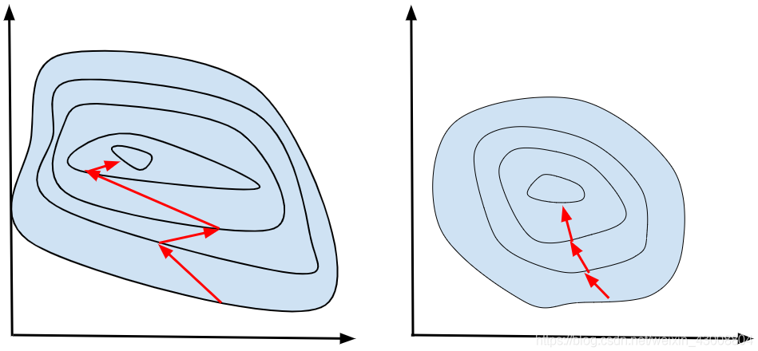

从这两张图可以看出，数据归一化后，最优解的寻优过程明显会变得平缓，**更容易正确的收敛到最优解**

#### 1.1.5.1	均值归一化Mean Normalization

**均值归一化*Mean Normalization***是特征缩放的一种方法，其目标是使训练样例中各特征值分布在[-1,1]之间，其数学表达为：
$$
x = \frac{x-\mu}{max(x)-min(x)}
$$
其中$x$是特征值，$\mu$是特征值$x$的平均值，$max(x),min(x)$分别是特征值$x$中的最大、最小值

#### 1.1.5.2	Z-score标准化Z-score Normalization

***Z-score*标准化**需要计算各特征值的**标准差*Standard Deviation***，用符号$\sigma$表示，其数学表达为
$$
x = \frac{x - \mu}{\sigma}
$$


### 1.1.6	判断梯度下降是否收敛

梯度下降算法的目标是找到最小成本函数，因此判断梯度下降是否收敛，就要看成本函数是否随梯度下降的迭代次数增加而减少。

- 目测：我们可根据迭代次数和成本函数变化绘制左图，可看到当迭代300次时已基本平衡，迭代400次时曲线近似水平线，此时可认为梯度下降收敛
- **自动收敛测试*Automatic Convergence Test***：我们可引入$\varepsilon = 10^{-3}$，当$J_2-J_1 = \Delta J(\vec{w},b) \leq \varepsilon$时，可认为收敛

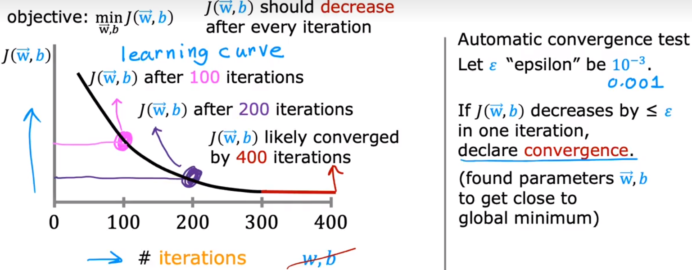

通过判断梯度下降是否收敛和迭代次数，我们可以对学习率$\alpha$进行调整


### 1.1.7	特征工程Feature Engineering

**特征工程*Feature Engineering***，即根据直觉，借助转换或组合原有特征的方式，设计新的特征

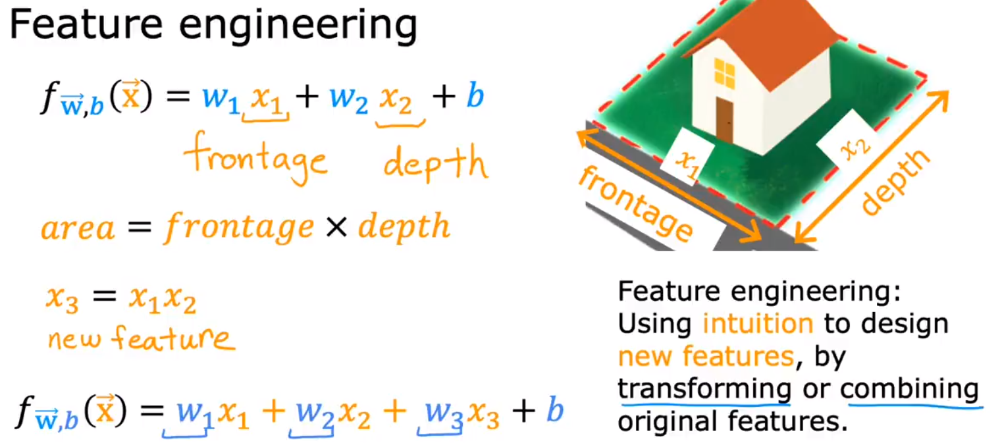

以上图为例，假设要预测房屋价格，现有特征为房屋临街长度(frontage)和房屋纵深(depth)，记作$x_1,x_2$

则此时我们的线性回归方程$f_{\vec{w},b}(\vec{x})=w_1x_1+w_2x_2+b$

但我们发现，房屋面积比房屋临街长度和纵深单独拿出来，更能体现房屋价值，因此我们引入新的特征房屋面积$x_3$，

$x_3=x_1x_2$，此时新的特征方程为$f_{\vec{w},b}(\vec{x})=w_1x_1+w_2x_2+w_3x_3+b$

### 1.1.8	多项式回归Polynomial Regression

我们在多元线性回归和特征工程的基础上引入**多项式回归*Polynomial Regression***，以更好地表示非线性函数


## 1.2	分类Classification

分类是另一种监督学习的算法，其中对于只有两种可能输出的分类问题称为**二元分类*Binary Classification***

在二元分类问题中，分类结果只有0和1两种，即$P(y=0)+P(y=1)=1$，其中$y$是分类结果

要解决二元分类问题，线性回归显然不适用，为此我们提出了**逻辑回归*Logistic Regression***，需要注意的是，虽然逻辑回归中有“回归”一词，但它仍是**一种分类问题的解决方案**

为了构建逻辑回归算法，我们还需要引入**逻辑函数*Sigmoid Function/Logistic Function***，其特点是**输出只介于(0,1)之间**

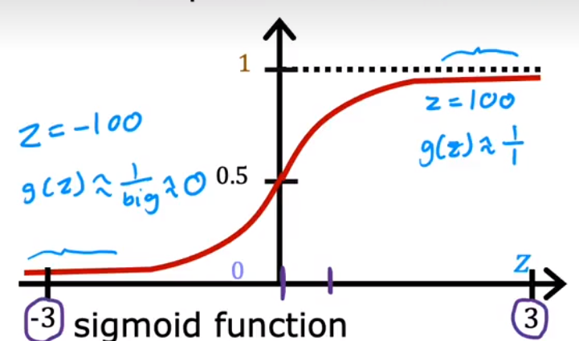

因此，我们需要构造的逻辑函数形式如下：
$$
f_{\vec{w},b}(\vec{x}) = g(z) = g(\vec{w}\cdot\vec{x}+b) = \frac{1}{1+e^{-(\vec{w}\cdot\vec{x}+b)}}
$$
其**函数值含义**为：**分类结果为1的可能性**，即当$f_{\vec{w},b}(\vec{x}) = 0.7$时表示，有70%可能分类结果为1

逻辑回归中的逻辑函数还有其他表现形式，如：
$$
f_{\vec{w},b}(\vec{x}) = P(y=1|\vec{x};\vec{w},b)
$$
该函数值含义是给定输入$\vec{x}$，参数$\vec{w},b$，分类结果为1的可能

### 1.2.1	决策边界Decision Boundary

要通过逻辑函数解决逻辑回归问题，我们首先要确定一个阈值，当超过或小于这个阈值时，输出分类结果为0或1，而这个阈值就被称为**决策边界*Decision Boundary***，因为在决策边界上，我们对输出0或1的态度是中立的

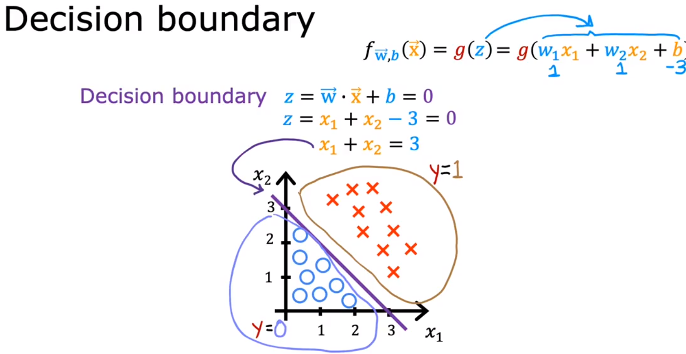

如图所示，假定有数据集如下，蓝圈表示分类结果为0，红叉表示分类结果为1，由于有两特征量$x_1,x_2$，因此我们的逻辑函数$f_{\vec{w},b}(\vec{x}) = g(z) = g(\vec{w}\cdot\vec{x}+b) = g(w_1x_1+w_2x_2+b)$

要找到决策边界，即满足$z=0$，令$z = \vec{w}\cdot\vec{x}+b = 0 = w_1x_1+w_2x_2+b=0$

假设$w_1=1,w_2=1,b=-3$，则有$z=x_1+x_2-3=0$，可知决策边界为$x_1+x_2=3$，即如图所示紫色直线

### 1.2.2	逻辑回归中的成本函数

设$m$为训练样本数，$n$为特征值数，目标值$y$取值只能为0或1

在线性回归问题中，我们使用平方误差函数来评估拟合程度，但在逻辑回归问题中，平方误差函数得到的结果并不是一个凸函数，这使得我们很难找到全局最优解：

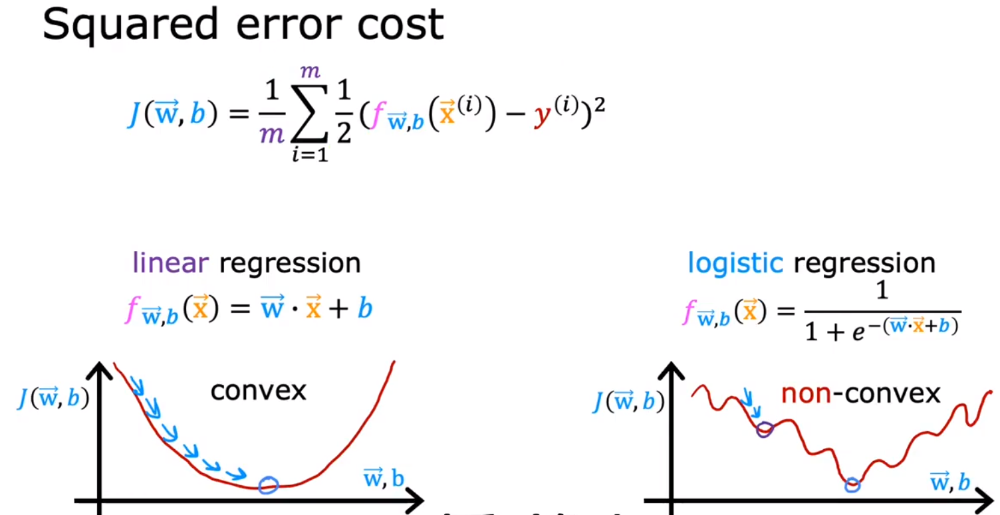

#### 1.2.2.1	损失函数Loss Function

我们的代价函数$J(\vec{w},b)= \frac{1}{m}\sum_{i=1}^{m}\frac{1}{2}(f_{\vec{w},b}(\vec{x}^{(i)}-y^{(i)}))^2 = \frac{1}{m}\sum_{i=1}^{m} L(f_{\vec{w},b}(\vec{x}^{(i)}),y^{(i)})$

我们将$L(f_{\vec{w},b}(\vec{x}^{(i)}),y^{(i)})$称为**损失函数*Loss Function***，**损失函数表示逻辑函数在该训练样例(这一点)上的预测代价，而代价函数表示函数在全部训练样例上的平均代价**。

损失函数在逻辑回归问题的数学表达如下：
$$
L(f_{\vec{w},b}(\vec{x}^{(i)}),y^{(i)}) =

\begin{cases}

-log(f_{\vec{w},b}(\vec{x}^{(i)}))       & y^{(i)}=1 \\

-log(1-f_{\vec{w},b}(\vec{x}^{(i)}))   & y^{(i)}=0 \\

\end{cases}
$$
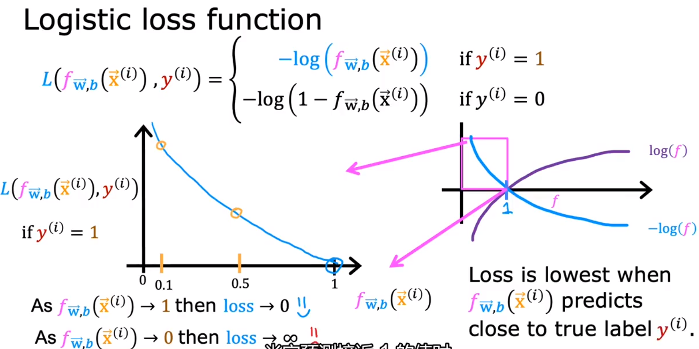

- **当预测结果为1时**，损失函数曲线如图中右坐标系蓝色曲线所示，由于逻辑函数取值总介于(0,1)，因此其曲线只取第一象限，如紫框所示

  将紫框中曲线放大为左侧坐标系，横轴为逻辑函数取值，纵轴为损失函数，根据曲线可以看出，**当逻辑函数预测结果(即逻辑函数值)越接近1时，损失越小**

  

- **当预测结果为0时**，损失函数曲线如图所示，**当逻辑函数预测结果(函数值)越接近0时，损失越小**

#### 1.2.2.2	简化代价函数

首先简化损失函数：
$$
L(f_{\vec{w},b}(\vec{x}^{(i)}),y^{(i)}) =

\begin{cases}

-log(f_{\vec{w},b}(\vec{x}^{(i)}))       & y^{(i)}=1 \\

-log(1-f_{\vec{w},b}(\vec{x}^{(i)}))   & y^{(i)}=0 \\

\end{cases}

\\ = -y^{(i)}log(f_{\vec{w},b}(\vec{x}^{(i)})) - (1-y^{(i)})log(1-f_{\vec{w},b}(\vec{x}^{(i)}))
$$
可得代价函数：
$$
J(\vec{w},b)=\frac{1}{m}\sum_{i=1}^{m}[L(f_{\vec{w},b}(\vec{x}^{(i)}),y^{(i)})]
=-\frac{1}{m}\sum_{i=1}^{m}\left[ y^{(i)}log(f_{\vec{w},b}(\vec{x}^{(i)})) + (1-y^{(i)})log(1-f_{\vec{w},b}(\vec{x}^{(i)})) \right]
$$

### 1.2.3	实现梯度下降

逻辑回归的梯度下降函数与线性回归相同，但由于它们定义的$f$不同，因此并不是同一类问题

但类似于线性回归，逻辑回归的梯度下降问题同样有以下几个共同点：

- 关注梯度下降的学习曲线，调整学习率$\alpha$
- 矢量化，加快计算速度
- 特征缩放，加快计算速度


### 1.2.4	过拟合Overfitting与欠拟合underfitting

以线性回归为例：

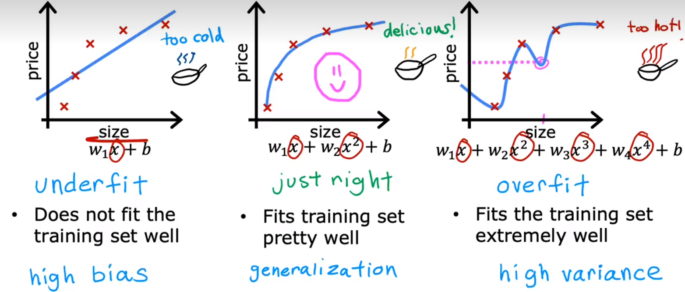

- 当训练模型不能很好地拟合训练样本集时，我们称之为**欠拟合*Underfitting***或**高偏差*High Bias***
- 当训练模型能很好拟合训练样本，且模型对新的训练样本的预测值与目标值十分接近时，我们认为模型实现了**泛化*Generalization***
- 当训练模型过于拟合训练样本，即为了拟合样本而产生了不合常理的函数(如曲线摇摆不定)或模型无法推广时，我们称之为**过拟合*Overfitting***或**高方差*High Variance***，如坐标系3所示，在紫色虚线所指示点处，预测值明显不合理

欠拟合和过拟合问题在分类问题中同样会出现：

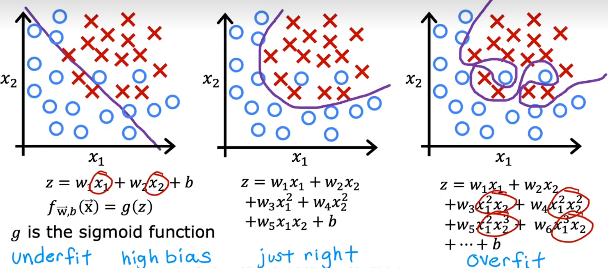


#### 1.2.4.1	解决过拟合问题

- 收集更多训练样本，重新训练模型
- **特征选择*Future Selection***：根据样本特点和样本数量，选择合适的特征，若数据集较小，则特征不应过多
- **正则化*Regularization***：正则化鼓励算法缩小参数$w$而无需恰好设置为0（一种温和的减少特征值的方法）

####  1.2.4.2	正则化Regularization

正则化的目的是简化模型，通过尽可能缩小参数的方式，以一种温和的方式缩小参数对模型的影响

正则化的实现方式是惩罚所有特征，即所有$w$参数，其数学表达如下：
$$
J(\vec{w},b)=\frac{1}{2m}\sum_{i=1}^{m}(f_{\vec{w},b}(\vec{x}^{(i)})-y^{(i)})^2+\frac{\lambda}{2m}\sum_{j=1}^{n}w_j^2
$$
其中$\lambda$被称为正则化参数，而$\frac{\lambda}{2m}\sum_{j=1}^{n}w_j^2$被称为正则化项

现在我们的成本函数分为两项：均方误差成本和正则化项

当$\lambda$过大时，所有参数$w$都将趋近于0；当$\lambda$值过小时，过拟合问题仍得不到解决

现在，我们需要选择合适的正则化参数$\lambda$，来解决过拟合问题。


##### 1.2.4.2.1	线性回归的正则方法

在之前的线性回归学习中，我们得到梯度下降算法为：
$$
w_j\ =\ w_j-\alpha \frac{\partial{}}{\partial{w_j}}J(\vec{w},b)\\
b\ = \ b-\alpha \frac{\partial{}}{\partial{b}}J(w,b)
$$
现在引入正则化后的成本函数并展开，得：
$$
w_j\ =\ w_j-\alpha \frac{\partial{}}{\partial{w_j}}J(\vec{w},b) = w_j-\alpha (\frac{1}{m}\sum_{i=1}^m(𝑓_{\vec{w},𝑏}(𝑥^{(i)})-y^{(i)})x^{(i)} + \frac{\lambda}{m}w_j)
\\
b\ = \ b-\alpha \frac{\partial{}}{\partial{b}}J(\vec{w},b) = b-\alpha (\frac{1}{m}\sum_{i=1}^m(𝑓_{\vec{w},𝑏}(𝑥^{(i)})-y^{(i)})
$$
由于我们只对参数$w$进行正则化，因此$b$无需添加正则化项

调整项顺序可得：
$$
w_j\ =\ w_j-\alpha \frac{\partial{}}{\partial{w_j}}J(\vec{w},b)
\\
= w_j-\alpha (\frac{1}{m}\sum_{i=1}^m(𝑓_{\vec{w},𝑏}(𝑥^{(i)})-y^{(i)})x^{(i)} + \frac{\lambda}{m}w_j)
\\
=w_j(1-\alpha\frac{\lambda}{m})-\alpha\frac{1}{m}\sum_{i=1}^m(𝑓_{\vec{w},𝑏}(𝑥^{(i)})-y^{(i)})x^{(i)}
$$
这样的形式可以更直观的看出，$\lambda$是对参数$w_j$的惩罚(Shrink $w_j$)


##### 1.2.4.2.2	逻辑回归的正则方法

同上，更新代价函数：
$$
J(\vec{w},b)=\frac{1}{m}\sum_{i=1}^{m}[L(f_{\vec{w},b}(\vec{x}^{(i)}),y^{(i)})] + \frac{\lambda}{2m}\sum_{j=1}^{n}w_j^2
\\
=-\frac{1}{m}\sum_{i=1}^{m}\left[ y^{(i)}log(f_{\vec{w},b}(\vec{x}^{(i)})) + (1-y^{(i)})log(1-f_{\vec{w},b}(\vec{x}^{(i)})) \right]  + \frac{\lambda}{2m}\sum_{j=1}^{n}w_j^2
$$
更新梯度下降函数：
$$
w_j\ =\ w_j-\alpha \frac{\partial{}}{\partial{w_j}}J(\vec{w},b) = w_j-\alpha (\frac{1}{m}\sum_{i=1}^m(𝑓_{\vec{w},𝑏}(𝑥^{(i)})-y^{(i)})x^{(i)} + \frac{\lambda}{m}w_j)
\\
b\ = \ b-\alpha \frac{\partial{}}{\partial{b}}J(\vec{w},b) = b-\alpha (\frac{1}{m}\sum_{i=1}^m(𝑓_{\vec{w},𝑏}(𝑥^{(i)})-y^{(i)})
$$
事实上，这与线性回归的正则方法形式完全相同


