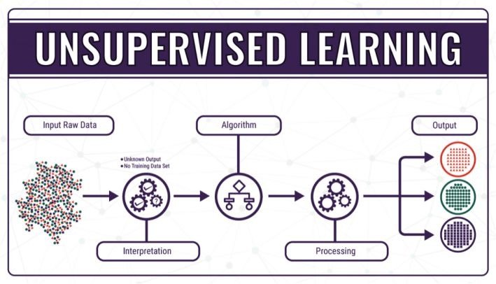

# 2.	无监督学习Unsupervised Learning

无监督学习：根据类别未知(没有被标记)的训练样本，解决模式识别中的各种问题

与监督学习不同，**非监督学习并不需要完整的输入输出数据集，并且系统的输出经常是不确定的。**

> Data only comes with inputs $x$, but not output labels $y$
>
> Data has to find **structure** in the data.

## 2.1	聚类Clustering

无监督学习中最经典的就是**聚类算法Clustering**，聚类的目的在于把相似的东西聚在一起，即**自行将数据分类**，而我们并不关心这一类是什么。因此，一个聚类算法通常只需要知道如何计算相似度就可以开始工作了。

> Clustering: Group similar data points together.

## 2.2	异常检测Anomaly Detection/Outlier Detection

异常检测即在数据集中找出异常数据，指的是通过数据挖掘手段识别数据中的“异常点”

## 2.3	降维Dimensionality Reduction

降维：将一个大数据集压缩成一个较小数据集，且丢失信息尽可能少

> Compress data using fewer numbers