# 3.	神经网络

## 3.0	神经元Neutron和神经网络Neutral Network

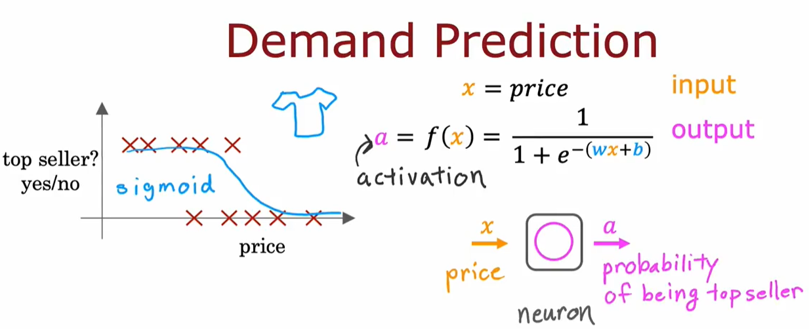

在逻辑回归问题中，我们通过逻辑函数Sigmoid Function，根据输入$x$得到预测$f(x)$

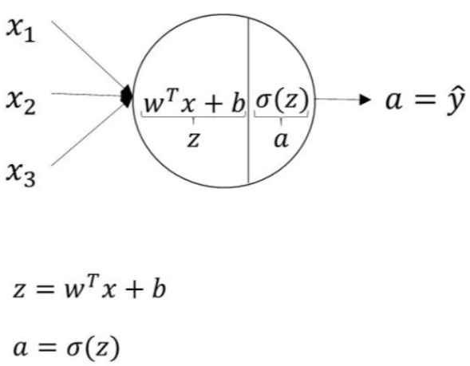

现在将这个问题带入到神经网络中，此时整个逻辑回归问题成为一个单层的**神经网络*Neutral Network***，逻辑函数称为**激活函数*Activation Function***，它是运行在**神经元*Neuron***(或**单元*Unit***)上的函数，将输入映射到输出，而此时的输出$f(x)$被称为$a$(***Activation***)，以上就是一个简单的**人工神经网络(ANN, *Artificial Neutral Network*)**

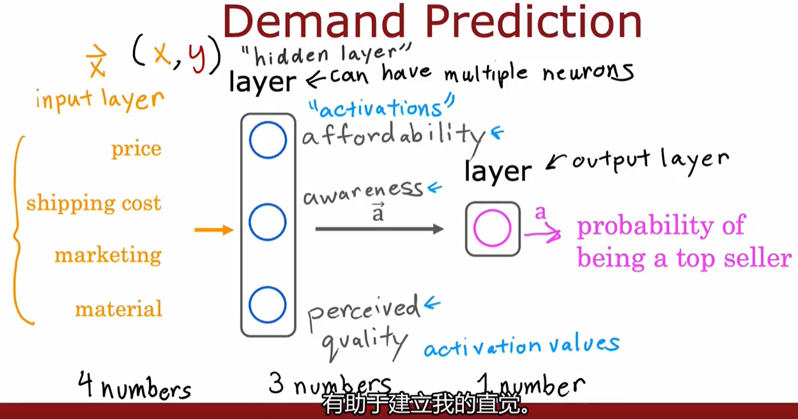

将问题复杂化，假设我们根据价格、运费、市场情况和商品材料四点可以计算出商品的可负担性、客户对商品认知度和对商品材料质量评价三点；而根据以上三点又能计算出该商品成为热销产品的概率

此时，这一问题也可以抽象成神经网络，前四项输入形成了**输入层*Input Layer***，其输入项记作向量$\vec{x}$，最右侧一个神经元形成**输出层*Output Layer***，其输出项记作$a，$而中间三个神经元组成**隐藏层*Hidden Layer***（因为它们的输出不可见），其输出项记作$\vec{a}$；层由一个或多个神经元组成，而这一神经网络被称为**多层感知器（*Multi-Layer Perception*** **，MLP）**，它将输入的多个数据集映射到单一的输出的数据集上。


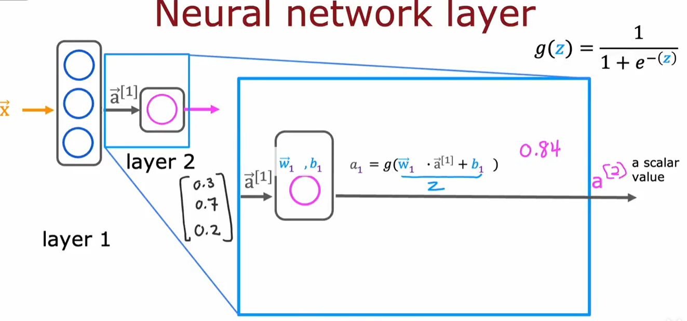

为了区分，我们用$\vec{w},b,z$表示某一神经元的激活函数参数，$\vec{a}$表示某一层的输出，用下标表示属于哪一个神经元，上标表示属于哪一层

如$\vec{w_1}^{[1]}$表示第一层的第一个神经元参数$\vec{w}$，$\vec{a}^{[2]}$表示第二层的输出

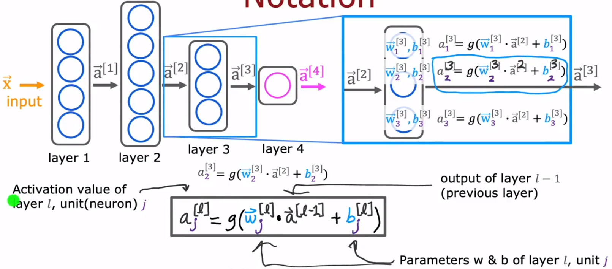

一般的，我们将输入层称为第0层，这样，每一层的输入$\vec{a}^{[l]} = g(z) = g(\vec{w}_j^{[l]}\cdot\vec{a}^{[l-1]}+b_j^{[l]})$


## 3.1	前向传播Forward Propagation

以手写输入为例，假设我们要识别手写数字为数字0或1，我们使用的神经网络如下：

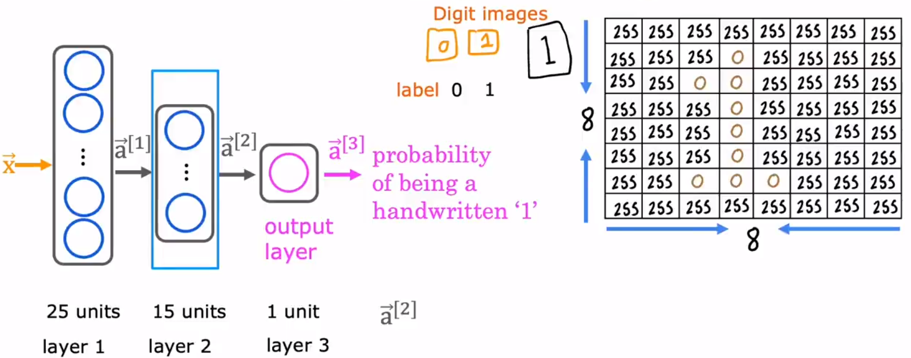

我们使用的识别神经网络第一层有25个神经元(单元)，第二层有15个神经元，第三层1个

假设输入的手写字母为一个8x8矩阵，则输入项$\vec{x}$(或$\vec{a}^{[0]}$)即为一个8x8矩阵

经过隐藏层1计算，得到**激活值*Activation Value***$\vec{a}^{[1]}$，再由第二层计算得到激活值$\vec{a}^{[2]}$，最后由第三层计算输出结果$\vec{a}^{[3]}$：
$$
\vec{a}^{[1]} = 

\begin{bmatrix}
\vec{w}_1^{[1]} \cdot \vec{x} + b_1^{[1]} \\
\vdots \\
\vec{w}_{25}^{[1]} \cdot \vec{x} + b_{25}^1 \\
\end{bmatrix},\\

\vec{a}^{[2]} = 

\begin{bmatrix}
\vec{w}_1^{[2]} \cdot \vec{a}^{[1]} + b_1^{[2]} \\
\vdots \\
\vec{w}_{15}^{[2]} \cdot \vec{a}^{[1]} + b_{15}^{[2]} \\
\end{bmatrix},\\

\vec{a}^{[3]} = 
\vec{w}_1^{[3]} \cdot \vec{a}^{[2]} + b_1^{[3]} \\
$$
由于这一神经网络的激活值不断向前传播，并最终输出结果，因此我们称这种算法为**前向传播算法*Forward Propagation Algorithm***


## 3.2	代码实现神经网络推理

仍以3.1中手写数字识别神经网络为例：

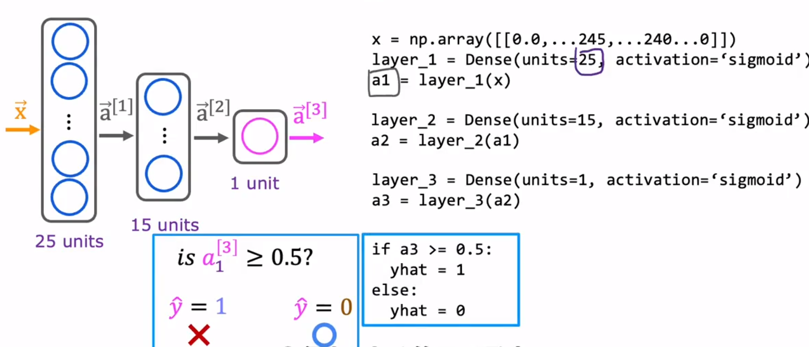


神经网络层也叫作**密集层*Dense Layer***，代码如图所示(基于TensorFlow)。

在TensorFlow中，编写者更希望我们使用**张量*Tensor***来存储数据而不是使用一维数组，这样能提升计算的效率

> 这里我们可以简单认为张量就是矩阵的一种
>
> 要将Tensor张量转换为Numpy数组，只需要使用data.numpy()即可

### 3.2.1	Keras 顺序模型Sequential Model

> 什么是Keras的顺序模型(Sequential Model)?
>
> - 由神经网络层顺序堆叠而成，不能存在分支
> - 每个神经网络层只有一个输入和一个输出
> - 神经网络层不能做图层共享(layer sharing)
>
> 不适用顺序模型的情况：
>
> - 模型有多个输入或多个输出
> - 任何一层都有多个输入或多个输出
> - 需要进行图层共享
> - 需要非线性拓扑（例如，残余连接，多分支模型）

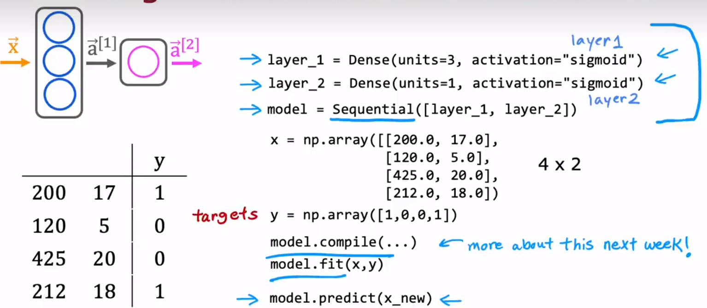

仍以咖啡烘焙数据为例，

- 首先创建密集层1、2，分别设置神经元个数和激活函数；
- 将密集层1、2作为参数建立顺序模型
- 导入训练集x、y
- 编译模型(具体内容暂时忽略)，model.compile()定义损失函数并指定编译优化器

> ```python
> model.compile(
>     #损失函数
>     loss = tf.keras.losses.BinaryCrossentropy(),
>     #优化器
>     optimizer = tf.keras.optimizers.Adam(learning_rate=0.01),
> )
> ```

- 将训练集导入模型，model.fit()执行梯度下降并将权重拟合到数据

> ```python
> model.fit(
>     Xt,Yt,            
>     epochs=10,
>     #epoch表示训练阶段数
> )
> ```

- 通过模型预测结果

我们创建的顺序模型其计算流程与之前所学习的大致相同：

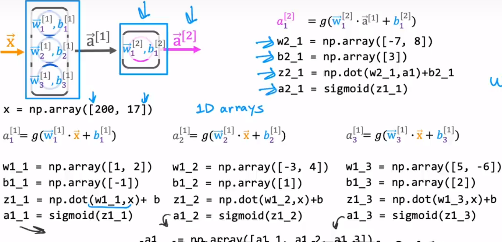


### 3.2.2	前向传播的一般实现

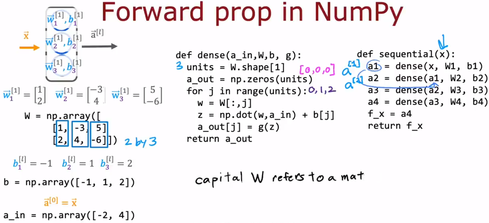

以创建第一层为例，首先输入参数$\vec{w},b$和输入值$\vec{a}^{[0]}(\vec{x})$，要注意的是，在输入$\vec{w}$时，同属一个向量的元素应在同一列(如图左上$\vec{w}_1^{[1]}、\vec{w}_2^{[1]}、\vec{w}_3^{[1]}$所示)

在稠密层函数dense()中，分别计算$\vec{a}^{[1]}_1、\vec{a}^{[1]}_2、\vec{a}^{[1]}_3$后，组成向量$\vec{a}^{[1]}$输出

在顺序模型函数sequential()中，分别计算各层激活值后输出最终结果


### 3.2.3	矢量化

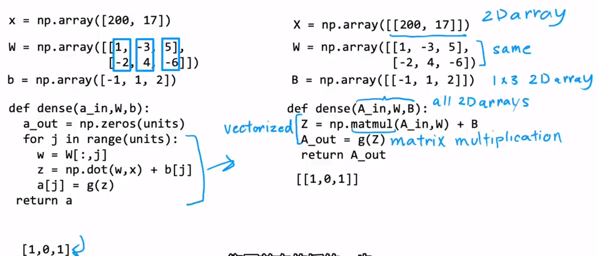

在上述代码中，我们还可以进一步提升计算效率，即矢量化：使用numpy.matmul($A, B$)方法，直接计算得到新的向量$Z$，

需要注意的是，输入的变量都应是矩阵(二维Numpy数组)

另外，在一些代码中，矩阵乘法会被表示为 $A@B$

> numpy.matmul(A, B)：Numpy的矩阵乘法函数(***Matrix Multiplication***)

### 3.2.4	规范化数据Normalization

如果数据被规范化，将权重拟合到数据（**反向传播**，将在之后介绍）**将更快地进行**。其中数据中的每个特征都经过标准化以具有相似的范围。 以下过程使用 Keras [规范化层](https://keras.io/api/layers/preprocessing_layers/numerical/normalization/)。它有以下步骤：

- 创建一个“规范化层”。请注意，**这不是模型中的层**。
- “调整”数据。这会学习数据集的均值和方差，并在内部保存值。
- 规范化数据。 对使用学习模型的任何未来数据应用归一化非常重要。

```python
print(f"Temperature Max, Min pre normalization: {np.max(X[:,0]):0.2f}, {np.min(X[:,0]):0.2f}")
print(f"Duration    Max, Min pre normalization: {np.max(X[:,1]):0.2f}, {np.min(X[:,1]):0.2f}")
norm_l = tf.keras.layers.experimental.preprocessing.Normalization(axis=-1)
norm_l.adapt(X)  # learns mean, variance
Xn = norm_l(X)
print(f"Temperature Max, Min post normalization: {np.max(Xn[:,0]):0.2f}, {np.min(Xn[:,0]):0.2f}")
print(f"Duration    Max, Min post normalization: {np.max(Xn[:,1]):0.2f}, {np.min(Xn[:,1]):0.2f}")

'''
Temperature Max, Min pre normalization: 284.99, 151.32
Duration    Max, Min pre normalization: 15.45, 11.51
Temperature Max, Min post normalization: 1.66, -1.69
Duration    Max, Min post normalization: 1.79, -1.70
'''
```


### 3.2.5	TensorFlow实现

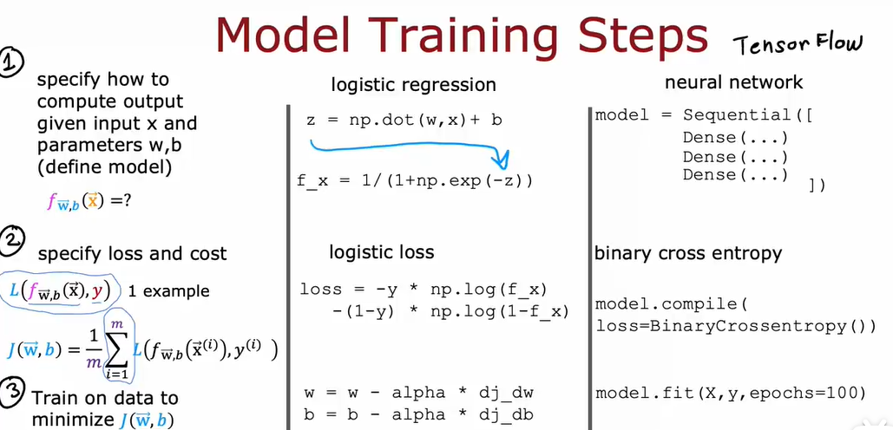

如上图，我们首先将问题解决逻辑、逻辑回归问题解决步骤和神经网络模型解决步骤三个问题逻辑进行对比，可以发现三者基本逻辑是相同的。接下来，我们再详细观察在TensorFlow中各步骤究竟在做什么：

#### 3.2.5.1	建立模型

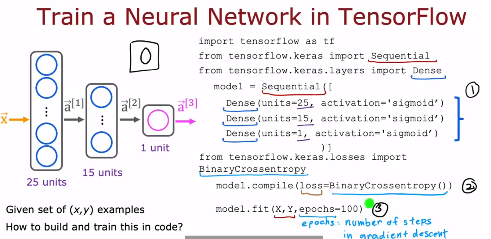

- 我们首先使用TensorFlow.Keras库建立了一个顺序模型，并在其中设置了三个稠密层，分别为各层设置了神经元数量和激活函数
- 接下来，我们为模型设置了损失函数

#### 3.2.5.2	设置损失函数

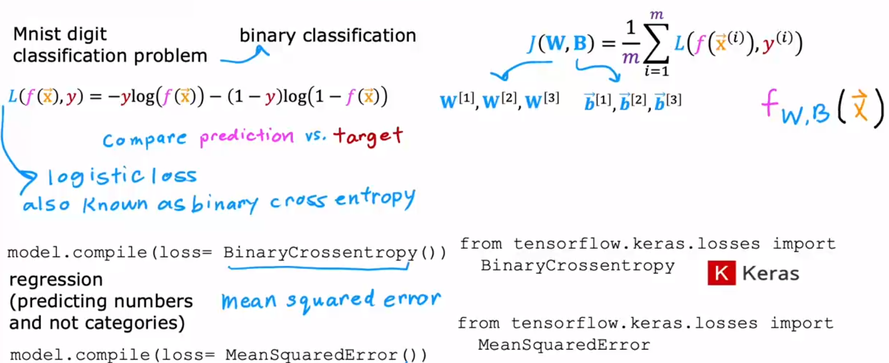

在TensorFlow中，我们指定模型使用的损失函数为**二元交叉熵损失函数*BinaryCrossEntropy***，事实上，这与我们在逻辑回归中使用的损失函数(见下图)相同。

> 因为在统计学上，这种问题叫做交叉熵问题，而二元则是指明这是一个二元分类问题


#### 3.2.5.3	训练模型

在逻辑回归问题中，我们使用梯度下降算法来调整参数$\vec{w},b$的值

而在TensorFlow中，我们使用model.fit()方法即可实现相同的功能，事实上，TensorFlow在这里使用了反向传播算法，而TensorFlow使用的方法比梯度下降更快


## 3.3	Sigmoid函数的替代方案

### 3.3.1	线性整流函数/修正线性单元ReLU

假设我们要通过激活函数计算，用户对商品的认知程度

此时，我们应当明确，用户对商品的认知应是一个连续量而非离散值，更不应当是0或1的二分逻辑

因此，我们可以使用其他激活函数替代Sigmoid函数，由此引出**线性整流函数(ReLU, *Linear rectification function*)或修正线性单元(*ReLU, Rectified Lieanr Unit*)**

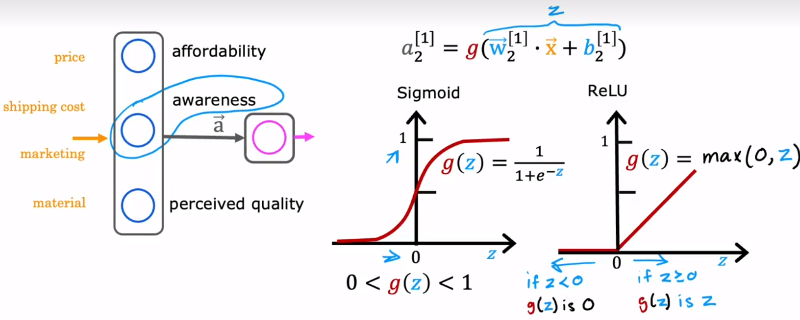

其数学表达式也很简单：
$$
g(z) = max(0,z)
$$

### 3.3.2	线性激活函数/无激活函数

线性激活函数(或无激活函数)即不对输入值处理，直接使用线性函数$g(z)=z$，因此当某文指出不使用激活函数即表示使用的激活函数为$g(z)=z$的线性激活函数

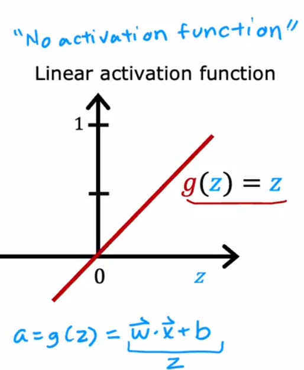


## 3.4	激活函数的选择

### 3.4.1	输出层

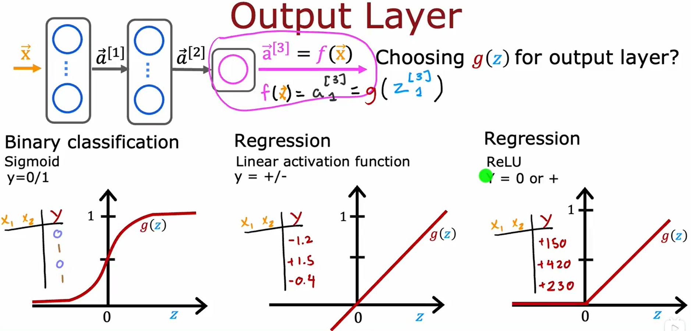

为输出层选择激活函数，我们需要观察问题的类型：

- 对二元分类问题，我们可以直接选择使用Sigmoid函数
- 对于有正负值的回归问题，我们可以使用线性激活函数
- 对只有非负值的回归问题，我们可以使用线性整流函数

### 3.4.5	隐藏层

#### 3.4.5.1	ReLU相较于Sigmoid函数的优点

1.ReLU函数的计算速度更快

2.ReLU函数只在一个地方平坦($z\leq0$)，而Sigmoid函数在两个地方平坦($z\rightarrow \infty, z\rightarrow-\infty$)，这就导致Sigmoid函数在梯度下降时很缓慢，而梯度下降并不会优化激活函数，因此其代价函数曲线平滑且梯度很小，从而减慢了学习速度

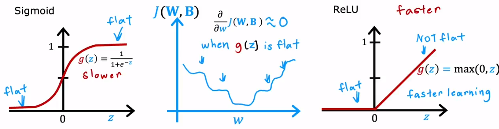

综上，我们在隐藏层中应当尽可能使用ReLU函数


## 3.5	多分类问题Multiclass

当我们需要识别数字0~9而不只是0或1时，就产生了多分类问题

多分类问题仍是分类问题，因此目标值$y$取值为离散值但其可能取值超过两种

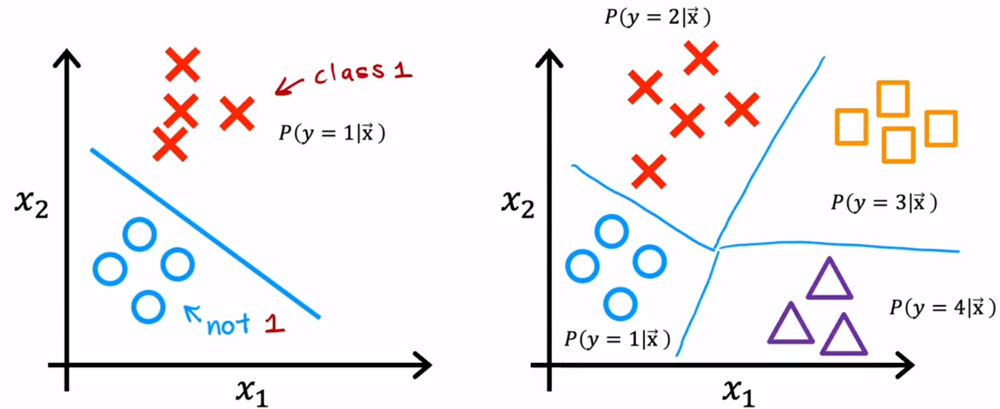


### 3.5.1	softmax函数

#### 3.5.1.1	softmax函数

softmax函数是逻辑回归函数的泛化，它可以用于解决多分类问题，其数学表达如下：
$$
z_j = \vec{w}_j \cdot \vec{x} +b_j \ j=1,...,N\\
a_j = \frac{e^{z_j}}{\sum^N_{k=1}e^{z_k}}=P(y=j|\vec{x})
$$
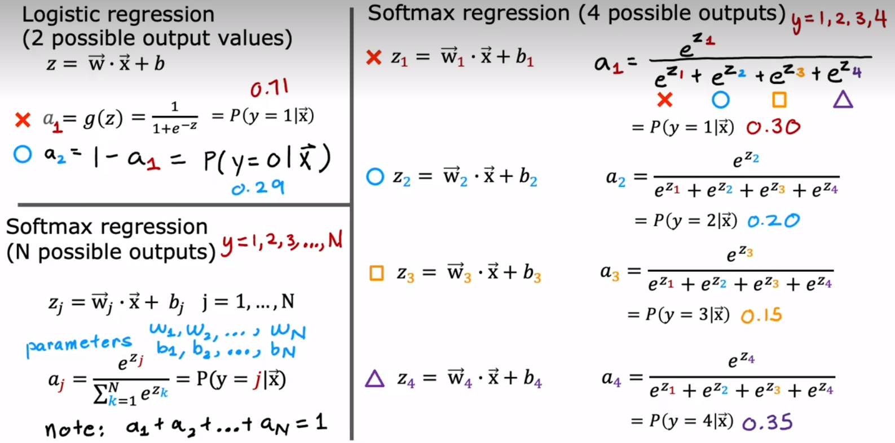


#### 3.5.1.2	损失函数

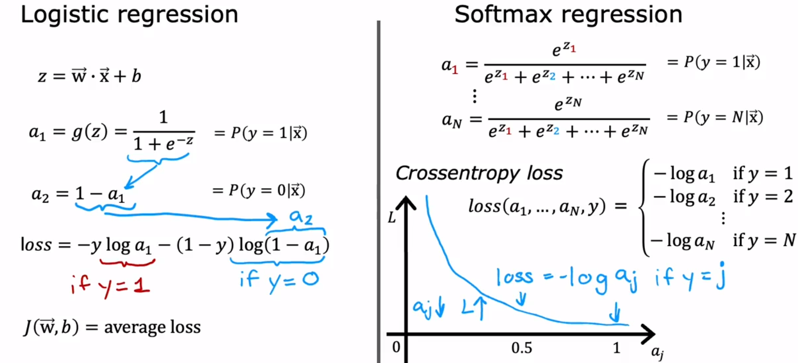

在逻辑回归中，假设取值只有$a_1,a_2$，则损失函数表达为：
$$
loss=

\begin{cases}

-log(f_{\vec{w},b}(\vec{x}^{(i)})) = -loga_1       & y^{(i)}=1 \\

-log(1-f_{\vec{w},b}(\vec{x}^{(i)})) = -log(1-a_1) = -loga_2  & y^{(i)}=0 \\

\end{cases}
$$
由于softmax函数就是逻辑回归函数的推广，因此其损失函数类似：
$$
loss(a_1,...,a_N,y)=
\begin{cases}
-loga_1       & y=1 \\
-loga_2  & y=2 \\
\ \ \ \ \ \ \ \ \ \ \ \vdots\\
-loga_N &y=N
\end{cases}
$$

#### 3.5.1.3	舍入误差的优化

##### 3.5.1.3.1	逻辑回归的舍入误差优化

从数学推导的角度上，我们的softmax算法的代价函数计算正确，但在存储上的舍入误差较大

由于softmax即逻辑回归函数的泛化，因此此处先介绍逻辑回归函数在计算上的优化：

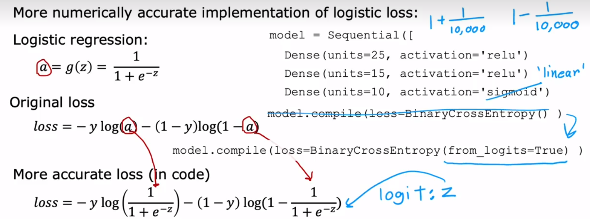

在逻辑回归中，其损失函数原形式为上图式(3)，被我们简化为式(2)形式，这一形式在数学上是没有问题的，但在代码实现中会产生更大的舍入误差。

要解决舍入误差问题，只需要在TensorFlow编译模型阶段加入参数`from_logits=True`即可，其含义大体是将$z$作为中间量计算。

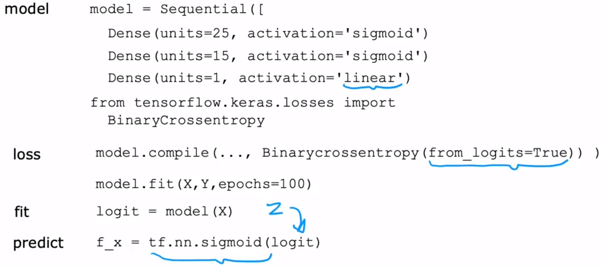

在代码实现上，需要将输出层激活函数改为线性激活函数，在预测时再将预测值输入Sigmoid函数计算

##### 3.5.1.3.2	softmax的舍入误差优化

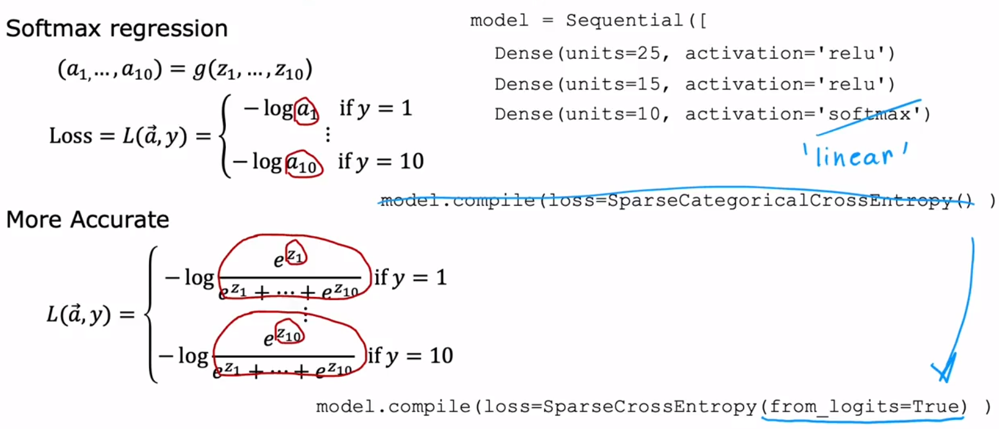

类似于逻辑回归函数，其代码修改也只需要在模型编译时加入参数`from_logits=True`，其能使参数$z_i$值不会因过大过小而影响整体值的计算

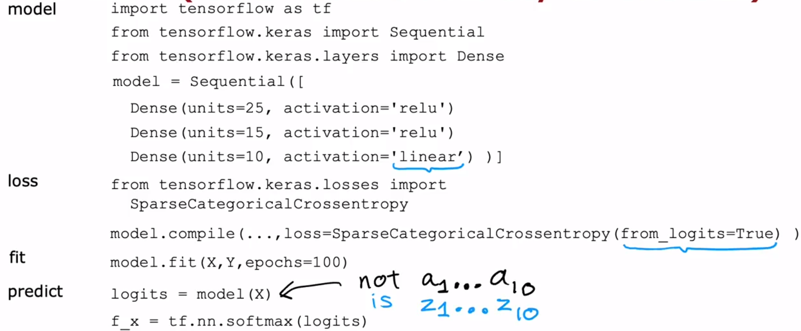

同样类似于逻辑回归问题，使用Softmax函数的多分类问题在隐藏层使用ReLU函数而输出层使用线性激活函数。

需要注意的是，此时模型输出的预测值不再是$a_i$而是$z_i$了，因此需要再次输入到Softmax函数中计算才能得到预测结果

### 3.5.2	多标签分类问题MultiLabel Classification

众所周知，二分类任务旨在将给定的输入分为 0 和 1 两类。而多标签分类（又称多目标分类）一次性地根据给定输入预测多个二分类目标。例如，模型可以预测给定的图片是一条狗还是一只猫，同时预测其毛皮是长还是短。

而在多分类任务中，预测目标是互斥的，这意味着**一个输入可以对应于多个分类**。

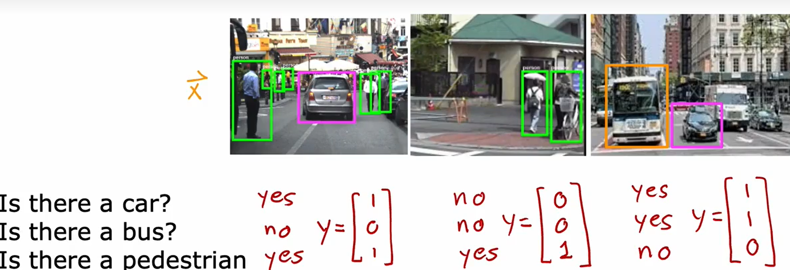

我们的输入是一张图片$\vec{x}$，而输出的结果并不是一个值而是一组结果$\vec{y}$

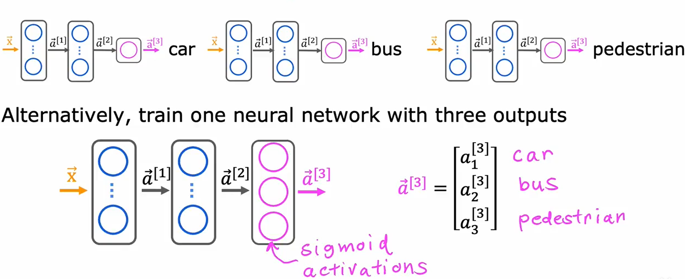

要解决此类问题，使用多个神经网络分别解决各自问题再组合显然是不明智的

现有方法是训练一个神经网络，它的每一层不同神经元解决不同问题，在最后一层输出层中可以使用Sigmoid函数对之前的分析作出预测

需要注意的是**多分类问题与多标签分类问题是截然不同的两个问题**，前者是对一个输入产生一个预测值，其中预测值的可能取值有多个；而后者是对一个输入有多个输出


## 3.6	更好的优化算法Adam

在之前的学习中，我们一直使用梯度下降作为优化算法

在梯度下降算法中，其数学表达如图所示：

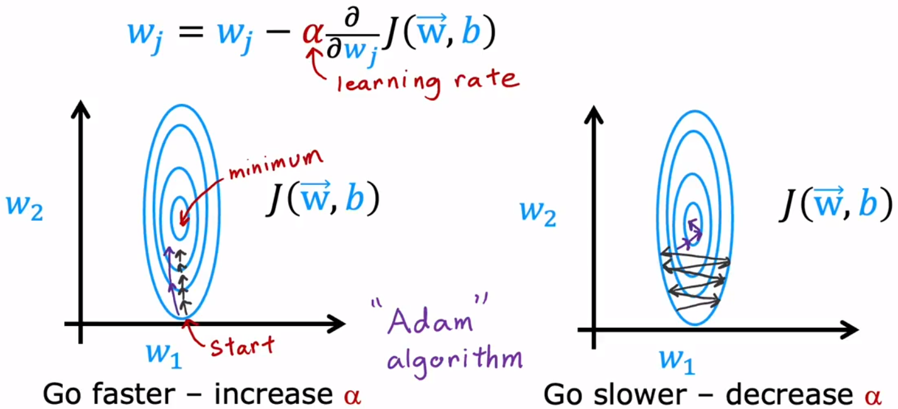

可见其中的学习率$\alpha$是控制每阶段学习步长的重要参数，

如左图，当学习率较小或适中时，参数随阶段增长逐渐收敛，但每阶段步长也因收敛而越来越小，为什么没有能自己增大学习率的算法呢？

如右图，当学习率较大时，参数无法收敛，为什么没有算法能及时调整学习率呢？

为了解决以上问题，提出了***Adam(自适应矩估计, Adaptive Moment Estimation)*优化算法**

与梯度下降算法不同的是，Adam算法中每个参数都有一个学习率，包括$w,b$
$$
w_1 = w_1 - \alpha_1 \frac{\partial{}}{\partial{w_1}}J(\vec{w},b)\\
\vdots\\
w_9 = w_9 - \alpha_9 \frac{\partial{}}{\partial{w_9}}J(\vec{w},b)\\
b = b - \alpha_{10} \frac{\partial{}}{\partial{b}}J(\vec{w},b)\\
$$
Adam算法的逻辑是：当一个参数($w_j$或$b$)在大致相同的方向上持续移动，则增大学习率$\alpha$；当一个参数持续震荡时，缩小学习率$\alpha$

### 3.6.1	在TensorFlow中使用Adam

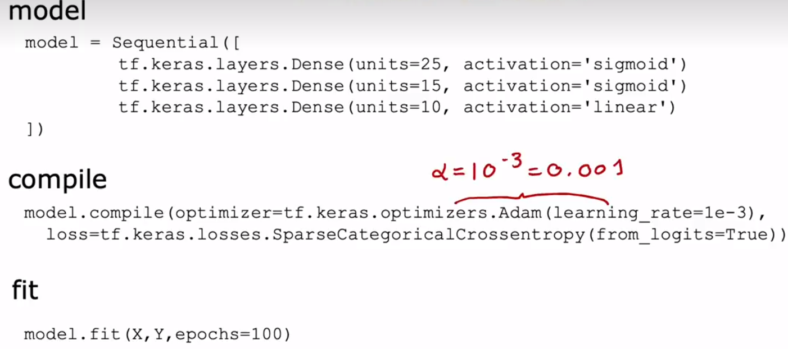

要使用Adam，只需要在模型编译时加入`optimizer=tf.keras.optimizers.Adam(learning_rate=学习率初始值)`

需要注意的是，使用Adam算法时需要为学习率指定一个初始值

相比于梯度下降算法，Adam算法对学习率的选择具有更高的鲁棒性和健壮性，但选择更好的初试学习率可以提高模型训练速度


## 3.7	卷积层Convolutional Layer

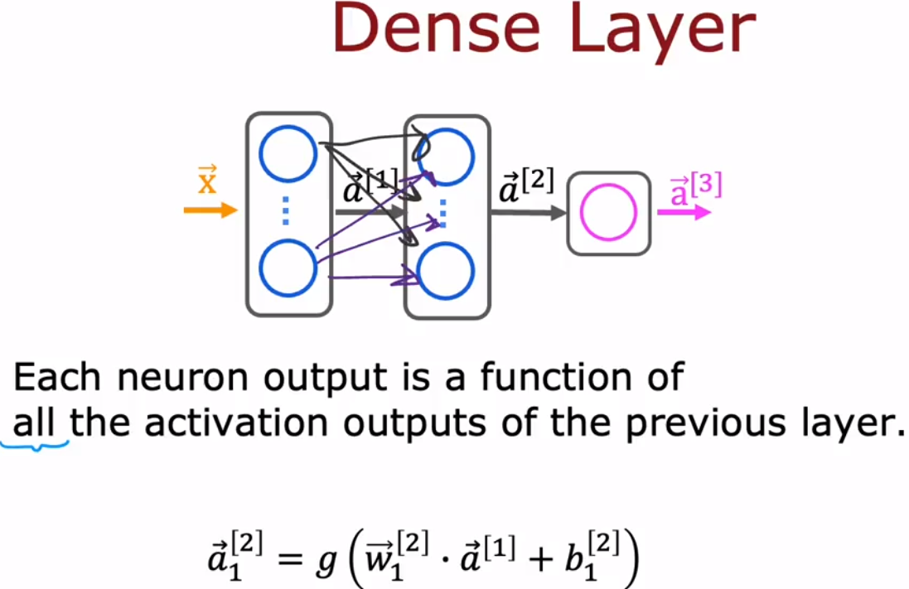

之前所学内容涉及到的神经网络层都是**全连接层*Dense Layer***，其中这一层中每个神经元都从前一层得到所有激活值，即下一层的神经元是上一层激活值的函数

然而在深度学习中，还有一些其他的层：

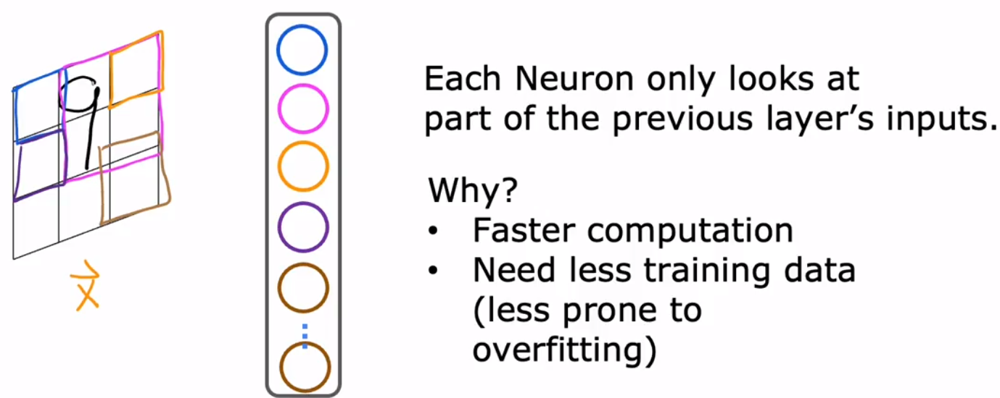

假设输入值为一张图片，我们使用卷积层对其进行处理，每个神经元只能看到图像中一部分(比如同样颜色框部分)，即每个神经元只关注输入的一个有限部分，其好处在于：

- 计算更快
- 需要的训练数据更少(不易过拟合)

当神经网络中存在多个卷积层时，称为**卷积神经网络(CNN，*Convolutional Neutral Network*)**

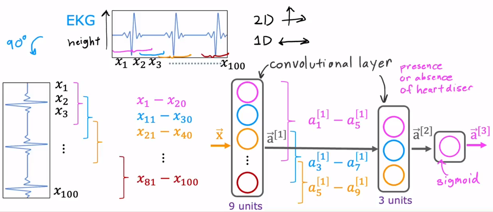

对于卷积层，我们有很多架构需要选择，比如单个神经元应该观察的输入窗口大小，以及一个卷积层应当包含多少个神经元等。

